# Firmware State Machines

Version: 0.1.16

## Changelog

### 2026-05-04 - 0.1.16

- Update clicker and anchor state charts to the robust wake/READY ranging strategy: UWB politeness sniff, timed wake advertisements, addressed READY scans, deterministic anchor arbitration, 500 ms UWB responder windows, and normal-click success after 4 unique anchor ranges.
- Update DS-TWR wording so equal reply timing is the first priority and shortest common reply timing is second.

### 2026-05-03 - 0.1.15

- Rewritten as a chart-first state-machine reference; removed the completed-work, verification, and remaining-work status sections.

## Runtime Hierarchy

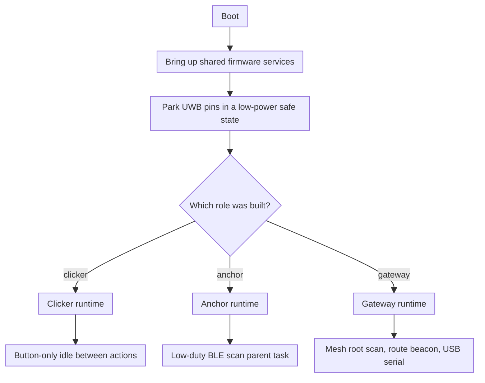
```mermaid
%%{init: {"flowchart": {"nodeSpacing": 24, "rankSpacing": 34, "padding": 6}, "themeVariables": {"fontSize": "12px"}} }%%
flowchart TD
    Boot[Boot] --> Shared[Bring up shared firmware services]
    Shared --> Park[Park UWB pins in a low-power safe state]
    Park --> Role{Which role was built?}
    Role -->|clicker| Clicker[Clicker runtime]
    Role -->|anchor| Anchor[Anchor runtime]
    Role -->|gateway| Gateway[Gateway runtime]
    Clicker --> ClickerIdle[Button-only idle between actions]
    Anchor --> AnchorScan[Low-duty BLE scan parent task]
    Gateway --> GatewayRoot[Mesh root scan, route beacon, USB serial]
```

## Clicker Role

### Clicker Parent Flow

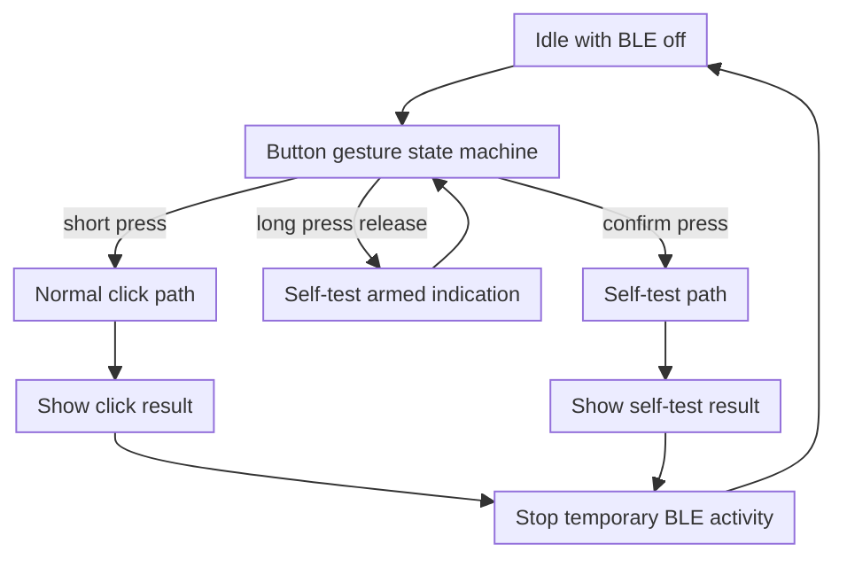
```mermaid
%%{init: {"flowchart": {"nodeSpacing": 24, "rankSpacing": 34, "padding": 6}, "themeVariables": {"fontSize": "12px"}} }%%
flowchart TD
    Idle[Idle with BLE off] --> Button[Button gesture state machine]
    Button -->|short press| Normal[Normal click path]
    Button -->|long press release| Armed[Self-test armed indication]
    Armed --> Button
    Button -->|confirm press| SelfTest[Self-test path]
    Normal --> NormalResult[Show click result]
    SelfTest --> SelfTestResult[Show self-test result]
    NormalResult --> Shutdown[Stop temporary BLE activity]
    SelfTestResult --> Shutdown
    Shutdown --> Idle
```

### Button Gesture State Machine

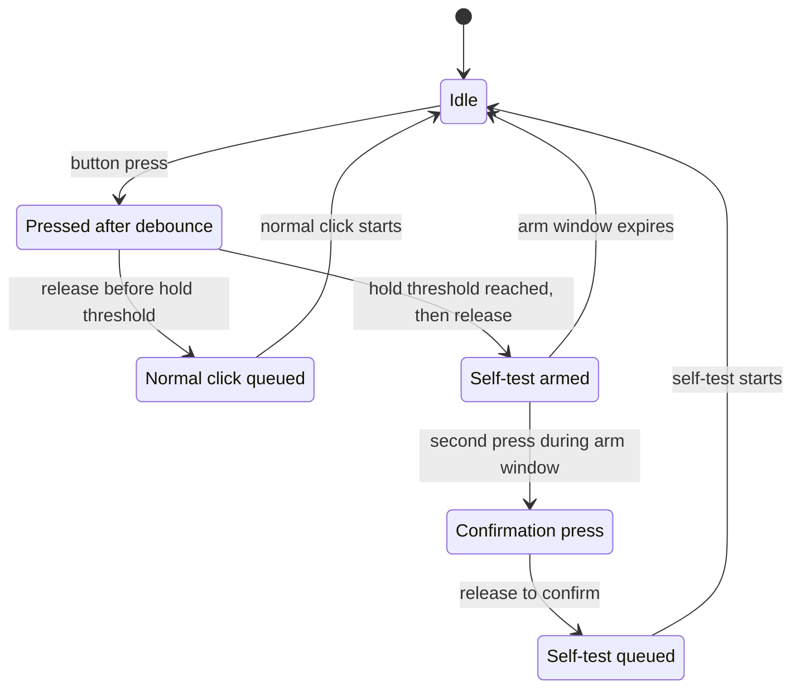
```mermaid
stateDiagram-v2
    state "Idle" as Idle
    state "Pressed after debounce" as Pressed
    state "Normal click queued" as NormalQueued
    state "Self-test armed" as Armed
    state "Confirmation press" as Confirm
    state "Self-test queued" as SelfTestQueued

    [*] --> Idle
    Idle --> Pressed: button press
    Pressed --> NormalQueued: release before hold threshold
    Pressed --> Armed: hold threshold reached, then release
    NormalQueued --> Idle: normal click starts
    Armed --> Confirm: second press during arm window
    Confirm --> SelfTestQueued: release to confirm
    SelfTestQueued --> Idle: self-test starts
    Armed --> Idle: arm window expires
```

### Normal Click End-to-End

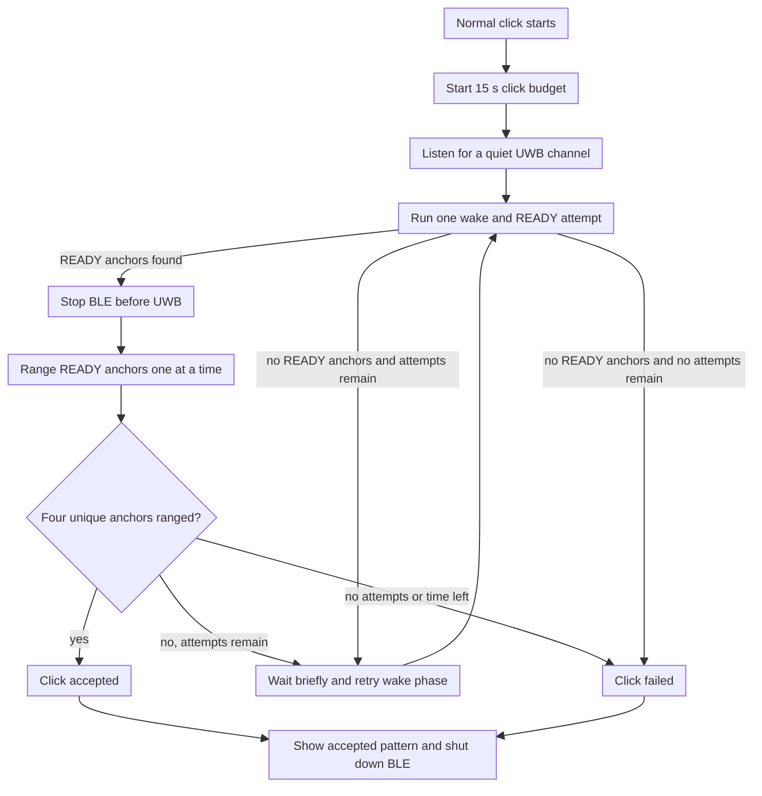
```mermaid
%%{init: {"flowchart": {"nodeSpacing": 24, "rankSpacing": 34, "padding": 6}, "themeVariables": {"fontSize": "12px"}} }%%
flowchart TD
    Start[Normal click starts] --> Deadline[Start 15 s click budget]
    Deadline --> Polite[Listen for a quiet UWB channel]
    Polite --> Attempt[Run one wake and READY attempt]
    Attempt -->|READY anchors found| BleOff[Stop BLE before UWB]
    BleOff --> Ranging[Range READY anchors one at a time]
    Ranging --> Success{Four unique anchors ranged?}
    Success -->|yes| Accepted[Click accepted]
    Success -->|no, attempts remain| Retry[Wait briefly and retry wake phase]
    Retry --> Attempt
    Success -->|no attempts or time left| Fail[Click failed]
    Attempt -->|no READY anchors and attempts remain| Retry
    Attempt -->|no READY anchors and no attempts remain| Fail
    Accepted --> Done[Show accepted pattern and shut down BLE]
    Fail --> Done
```

### Wake And READY Attempt

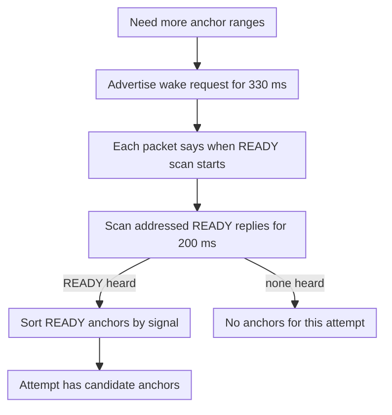
```mermaid
%%{init: {"flowchart": {"nodeSpacing": 24, "rankSpacing": 34, "padding": 6}, "themeVariables": {"fontSize": "12px"}} }%%
flowchart TD
    Start[Need more anchor ranges] --> Advertise[Advertise wake request for 330 ms]
    Advertise --> Timing[Each packet says when READY scan starts]
    Timing --> Scan[Scan addressed READY replies for 200 ms]
    Scan -->|READY heard| Sort[Sort READY anchors by signal]
    Scan -->|none heard| NoReady[No anchors for this attempt]
    Sort --> Done[Attempt has candidate anchors]
```

The 330 ms wake window covers one 300 ms anchor scan interval plus timing margin.

### READY Anchor Ranging

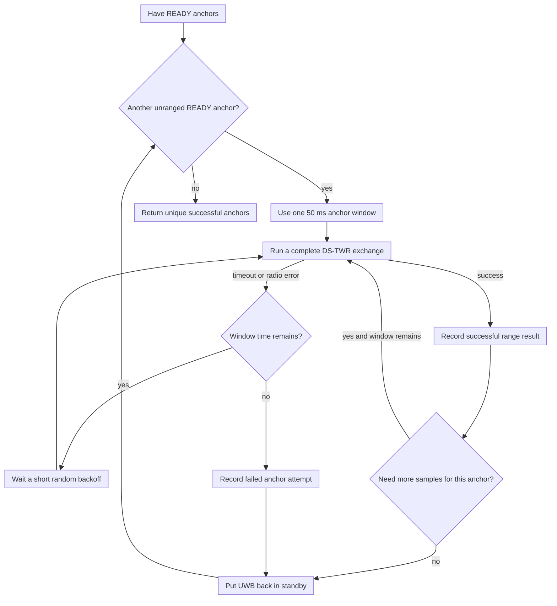
```mermaid
%%{init: {"flowchart": {"nodeSpacing": 24, "rankSpacing": 34, "padding": 6}, "themeVariables": {"fontSize": "12px"}} }%%
flowchart TD
    Start[Have READY anchors] --> Next{Another unranged READY anchor?}
    Next -->|yes| Window[Use one 50 ms anchor window]
    Window --> Range[Run a complete DS-TWR exchange]
    Range -->|success| RecordOk[Record successful range result]
    Range -->|timeout or radio error| Backoff{Window time remains?}
    Backoff -->|yes| Wait[Wait a short random backoff]
    Wait --> Range
    Backoff -->|no| RecordFail[Record failed anchor attempt]
    RecordOk --> More{Need more samples for this anchor?}
    More -->|yes and window remains| Range
    More -->|no| Standby[Put UWB back in standby]
    RecordFail --> Standby
    Standby --> Next
    Next -->|no| Finish[Return unique successful anchors]
```

Each DS-TWR exchange is completed without interleaving another anchor. Reply timing is kept equal first; the common delay is shortened only when both sides still have enough processing headroom.

### Self-Test Flow

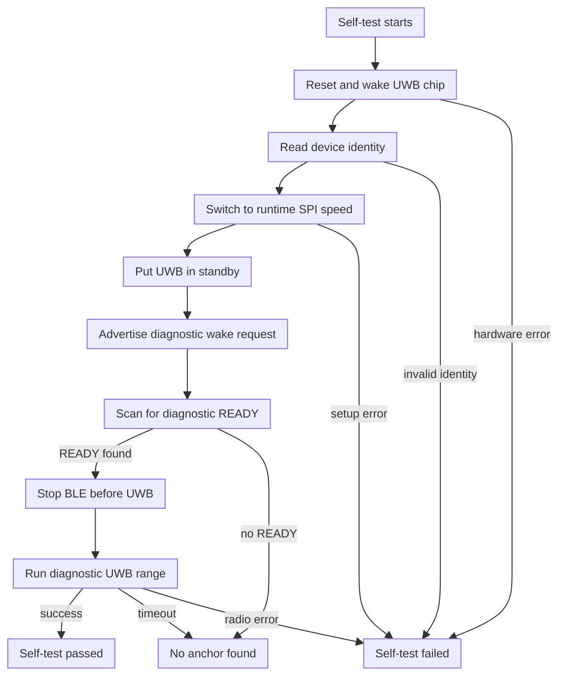
```mermaid
%%{init: {"flowchart": {"nodeSpacing": 24, "rankSpacing": 34, "padding": 6}, "themeVariables": {"fontSize": "12px"}} }%%
flowchart TD
    Start[Self-test starts] --> Reset[Reset and wake UWB chip]
    Reset --> Probe[Read device identity]
    Probe --> FastSpi[Switch to runtime SPI speed]
    FastSpi --> Standby[Put UWB in standby]
    Standby --> DiagnosticDiscovery[Advertise diagnostic wake request]
    DiagnosticDiscovery --> ReadyScan[Scan for diagnostic READY]
    ReadyScan -->|READY found| StopBle[Stop BLE before UWB]
    ReadyScan -->|no READY| NoAnchor[No anchor found]
    StopBle --> Range[Run diagnostic UWB range]
    Range -->|success| Pass[Self-test passed]
    Range -->|timeout| NoAnchor
    Range -->|radio error| Fail[Self-test failed]
    Reset -->|hardware error| Fail
    Probe -->|invalid identity| Fail
    FastSpi -->|setup error| Fail
```

Diagnostic events do not count as clicks.

## Anchor Role

### Anchor Parent Flow

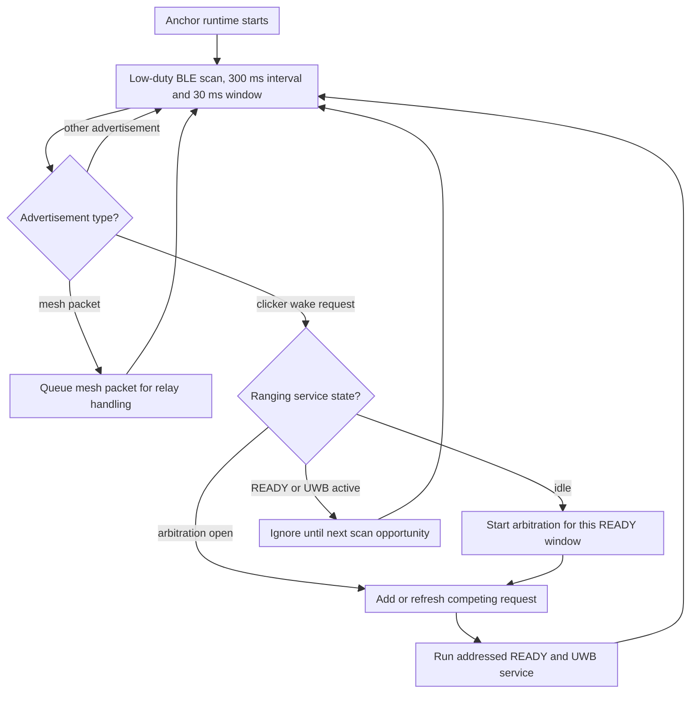
```mermaid
%%{init: {"flowchart": {"nodeSpacing": 24, "rankSpacing": 34, "padding": 6}, "themeVariables": {"fontSize": "12px"}} }%%
flowchart TD
    Start[Anchor runtime starts] --> Scan[Low-duty BLE scan, 300 ms interval and 30 ms window]
    Scan --> Packet{Advertisement type?}
    Packet -->|mesh packet| MeshQueue[Queue mesh packet for relay handling]
    MeshQueue --> Scan
    Packet -->|clicker wake request| Availability{Ranging service state?}
    Availability -->|idle| NewAdmission[Start arbitration for this READY window]
    Availability -->|arbitration open| AddRequest[Add or refresh competing request]
    Availability -->|READY or UWB active| Ignore[Ignore until next scan opportunity]
    NewAdmission --> AddRequest
    AddRequest --> Service[Run addressed READY and UWB service]
    Service --> Scan
    Ignore --> Scan
    Packet -->|other advertisement| Scan
```

Anchor scan pauses only for READY advertising and the UWB responder window.

### Addressed READY Service

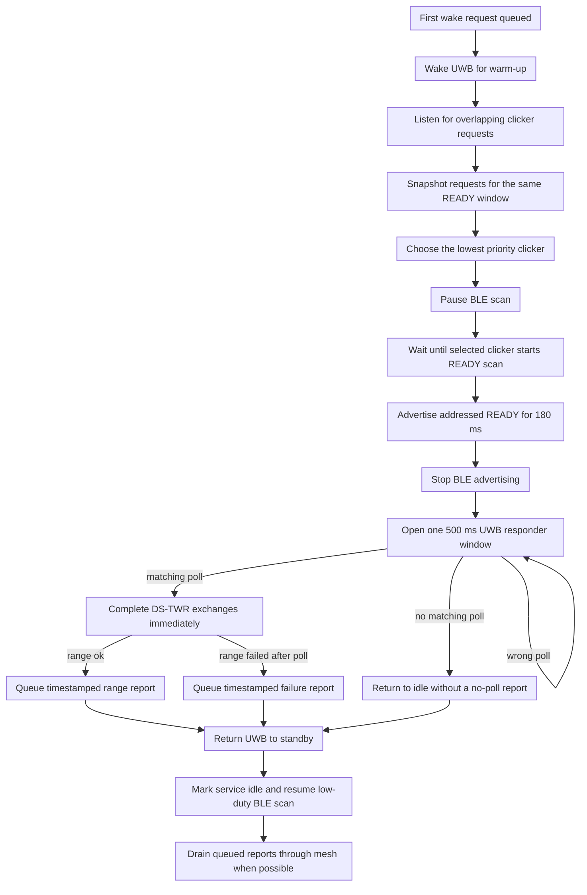
```mermaid
%%{init: {"flowchart": {"nodeSpacing": 24, "rankSpacing": 34, "padding": 6}, "themeVariables": {"fontSize": "12px"}} }%%
flowchart TD
    First[First wake request queued] --> WakeUwb[Wake UWB for warm-up]
    WakeUwb --> Listen[Listen for overlapping clicker requests]
    Listen --> Snapshot[Snapshot requests for the same READY window]
    Snapshot --> Select[Choose the lowest priority clicker]
    Select --> PauseScan[Pause BLE scan]
    PauseScan --> WaitReady[Wait until selected clicker starts READY scan]
    WaitReady --> Ready[Advertise addressed READY for 180 ms]
    Ready --> StopAdv[Stop BLE advertising]
    StopAdv --> Window[Open one 500 ms UWB responder window]
    Window -->|matching poll| Exchange[Complete DS-TWR exchanges immediately]
    Window -->|no matching poll| Timeout[Return to idle without a no-poll report]
    Window -->|wrong poll| Window
    Exchange -->|range ok| QueueOk[Queue timestamped range report]
    Exchange -->|range failed after poll| QueueFail[Queue timestamped failure report]
    QueueOk --> Standby[Return UWB to standby]
    QueueFail --> Standby
    Timeout --> Standby
    Standby --> Resume[Mark service idle and resume low-duty BLE scan]
    Resume --> Drain[Drain queued reports through mesh when possible]
```

Selection order: lower priority ID, then lower clicker ID, event sequence, and attempt.

### Four Quick Clickers On The Same Anchors

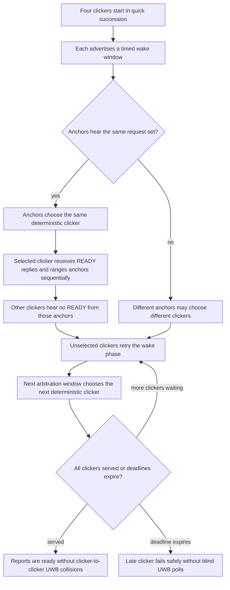
```mermaid
%%{init: {"flowchart": {"nodeSpacing": 24, "rankSpacing": 34, "padding": 6}, "themeVariables": {"fontSize": "12px"}} }%%
flowchart TD
    Four[Four clickers start in quick succession] --> Advertise[Each advertises a timed wake window]
    Advertise --> SameSet{Anchors hear the same request set?}
    SameSet -->|yes| SameChoice[Anchors choose the same deterministic clicker]
    SameChoice --> ReadyOne[Selected clicker receives READY replies and ranges anchors sequentially]
    ReadyOne --> Others[Other clickers hear no READY from those anchors]
    Others --> Retry[Unselected clickers retry the wake phase]
    Retry --> NextAttempt[Next arbitration window chooses the next deterministic clicker]
    NextAttempt --> Complete{All clickers served or deadlines expire?}
    Complete -->|more clickers waiting| Retry
    Complete -->|served| Reports[Reports are ready without clicker-to-clicker UWB collisions]
    Complete -->|deadline expires| Fail[Late clicker fails safely without blind UWB polls]
    SameSet -->|no| Diverge[Different anchors may choose different clickers]
    Diverge --> Retry
```

This v1 rule trades speed for deterministic collision avoidance.

### Busy Anchor During A New Click

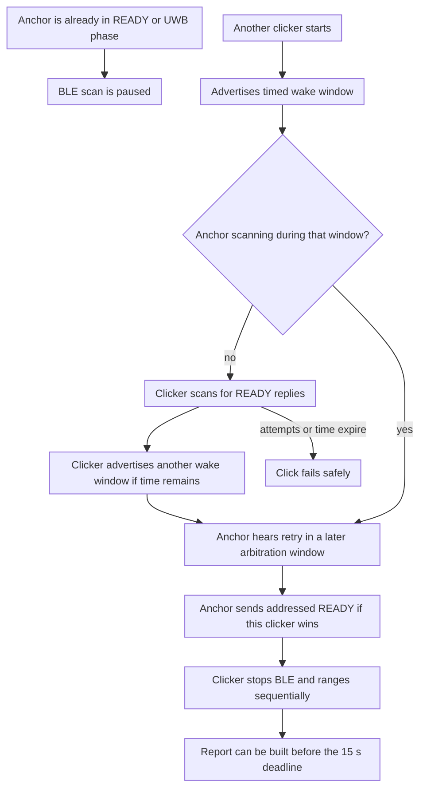
```mermaid
%%{init: {"flowchart": {"nodeSpacing": 24, "rankSpacing": 34, "padding": 6}, "themeVariables": {"fontSize": "12px"}} }%%
flowchart TD
    Existing[Anchor is already in READY or UWB phase] --> BlePaused[BLE scan is paused]
    NewClick[Another clicker starts] --> Discovery[Advertises timed wake window]
    Discovery --> Missed{Anchor scanning during that window?}
    Missed -->|no| ScanAfter[Clicker scans for READY replies]
    ScanAfter --> Retry[Clicker advertises another wake window if time remains]
    Retry --> Admitted[Anchor hears retry in a later arbitration window]
    Missed -->|yes| Admitted
    Admitted --> Ready[Anchor sends addressed READY if this clicker wins]
    Ready --> Uwb[Clicker stops BLE and ranges sequentially]
    Uwb --> ReportReady[Report can be built before the 15 s deadline]
    ScanAfter -->|attempts or time expire| Fail[Click fails safely]
```

No anchor advertises BLE while its UWB receiver is active.

### Mesh Receive And Relay Handling

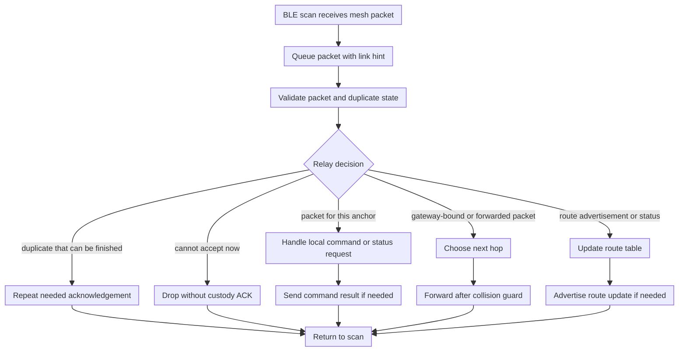
```mermaid
%%{init: {"flowchart": {"nodeSpacing": 24, "rankSpacing": 34, "padding": 6}, "themeVariables": {"fontSize": "12px"}} }%%
flowchart TD
    Found[BLE scan receives mesh packet] --> Queue[Queue packet with link hint]
    Queue --> Validate[Validate packet and duplicate state]
    Validate --> Decision{Relay decision}
    Decision -->|packet for this anchor| Local[Handle local command or status request]
    Decision -->|gateway-bound or forwarded packet| Route[Choose next hop]
    Decision -->|route advertisement or status| Learn[Update route table]
    Decision -->|duplicate that can be finished| AckAgain[Repeat needed acknowledgement]
    Decision -->|cannot accept now| DropNoAck[Drop without custody ACK]
    Local --> Responses[Send command result if needed]
    Route --> Forward[Forward after collision guard]
    Learn --> MaybeAdvertise[Advertise route update if needed]
    AckAgain --> Done[Return to scan]
    DropNoAck --> Done
    Responses --> Done
    Forward --> Done
    MaybeAdvertise --> Done
```

### Anchor Report Queue Drain

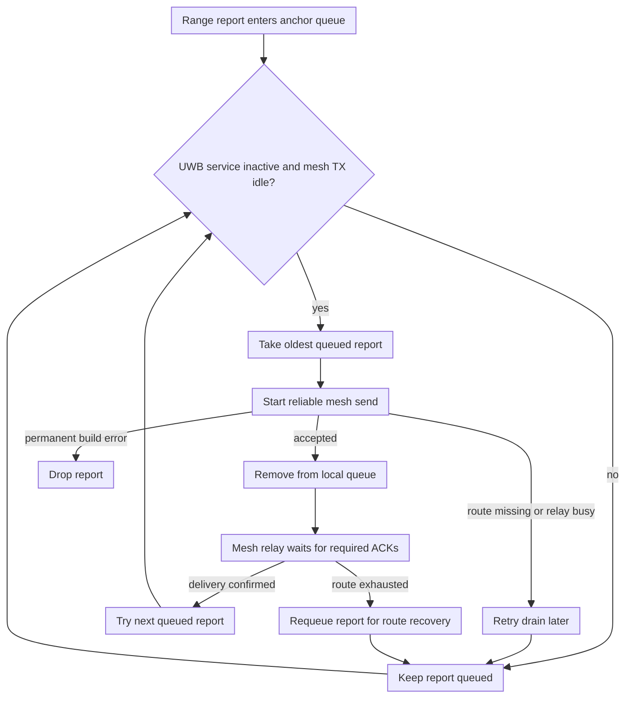
```mermaid
%%{init: {"flowchart": {"nodeSpacing": 24, "rankSpacing": 34, "padding": 6}, "themeVariables": {"fontSize": "12px"}} }%%
flowchart TD
    Report[Range report enters anchor queue] --> Ready{UWB service inactive and mesh TX idle?}
    Ready -->|no| Hold[Keep report queued]
    Hold --> Ready
    Ready -->|yes| Oldest[Take oldest queued report]
    Oldest --> StartTx[Start reliable mesh send]
    StartTx -->|accepted| Remove[Remove from local queue]
    StartTx -->|route missing or relay busy| RetryLater[Retry drain later]
    StartTx -->|permanent build error| Drop[Drop report]
    Remove --> Await[Mesh relay waits for required ACKs]
    Await -->|delivery confirmed| Next[Try next queued report]
    Await -->|route exhausted| Requeue[Requeue report for route recovery]
    RetryLater --> Hold
    Requeue --> Hold
    Next --> Ready
```

### Local Command Response

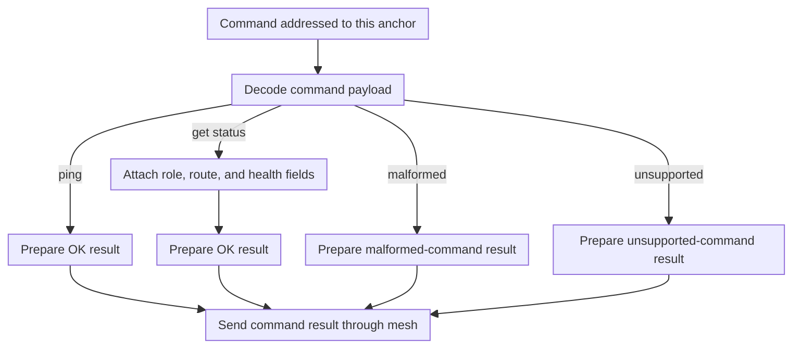
```mermaid
%%{init: {"flowchart": {"nodeSpacing": 24, "rankSpacing": 34, "padding": 6}, "themeVariables": {"fontSize": "12px"}} }%%
flowchart TD
    Command[Command addressed to this anchor] --> Decode[Decode command payload]
    Decode -->|malformed| Malformed[Prepare malformed-command result]
    Decode -->|ping| Ping[Prepare OK result]
    Decode -->|get status| Status[Attach role, route, and health fields]
    Decode -->|unsupported| Unsupported[Prepare unsupported-command result]
    Status --> Ok[Prepare OK result]
    Ping --> Result[Send command result through mesh]
    Ok --> Result
    Malformed --> Result
    Unsupported --> Result
```

## Gateway Role

### Gateway Parent Flow

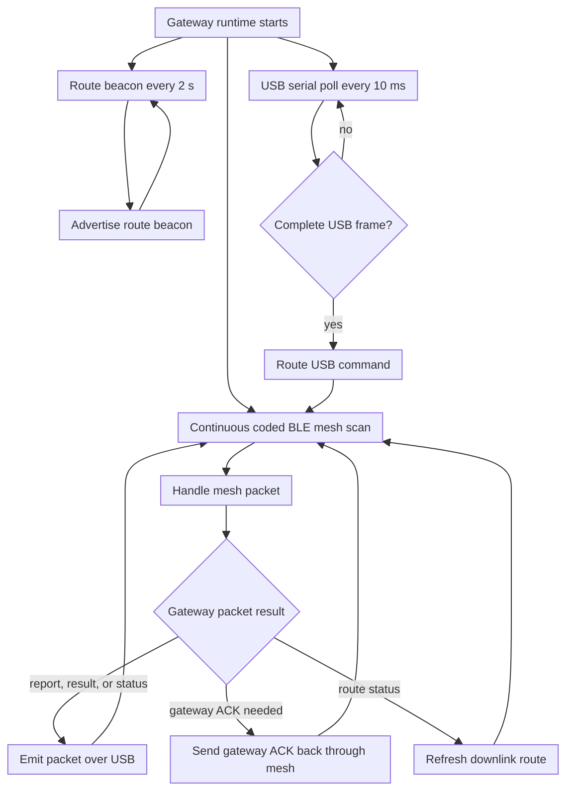
```mermaid
%%{init: {"flowchart": {"nodeSpacing": 24, "rankSpacing": 34, "padding": 6}, "themeVariables": {"fontSize": "12px"}} }%%
flowchart TD
    Start[Gateway runtime starts] --> Scan[Continuous coded BLE mesh scan]
    Start --> Beacon[Route beacon every 2 s]
    Start --> Usb[USB serial poll every 10 ms]
    Beacon --> BeaconAdv[Advertise route beacon]
    BeaconAdv --> Beacon
    Usb --> Frame{Complete USB frame?}
    Frame -->|yes| UsbCommand[Route USB command]
    Frame -->|no| Usb
    Scan --> MeshPacket[Handle mesh packet]
    MeshPacket --> PacketType{Gateway packet result}
    PacketType -->|report, result, or status| UsbOut[Emit packet over USB]
    PacketType -->|gateway ACK needed| AckBack[Send gateway ACK back through mesh]
    PacketType -->|route status| Downlink[Refresh downlink route]
    UsbCommand --> Scan
    UsbOut --> Scan
    AckBack --> Scan
    Downlink --> Scan
```

### USB Command Routing

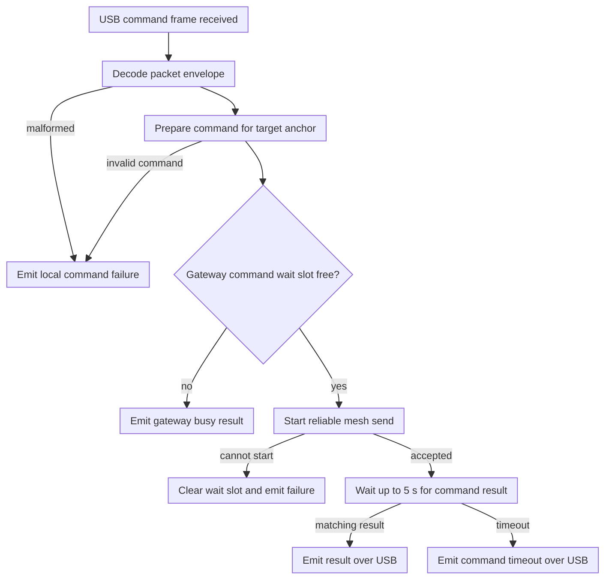
```mermaid
%%{init: {"flowchart": {"nodeSpacing": 24, "rankSpacing": 34, "padding": 6}, "themeVariables": {"fontSize": "12px"}} }%%
flowchart TD
    Frame[USB command frame received] --> Decode[Decode packet envelope]
    Decode -->|malformed| Reject[Emit local command failure]
    Decode --> Prepare[Prepare command for target anchor]
    Prepare -->|invalid command| Reject
    Prepare --> Reserve{Gateway command wait slot free?}
    Reserve -->|no| Busy[Emit gateway busy result]
    Reserve -->|yes| Send[Start reliable mesh send]
    Send -->|cannot start| SendFail[Clear wait slot and emit failure]
    Send -->|accepted| Wait[Wait up to 5 s for command result]
    Wait -->|matching result| UsbResult[Emit result over USB]
    Wait -->|timeout| Timeout[Emit command timeout over USB]
```

## Shared Mesh Relay

### Reliable Relay State Machine

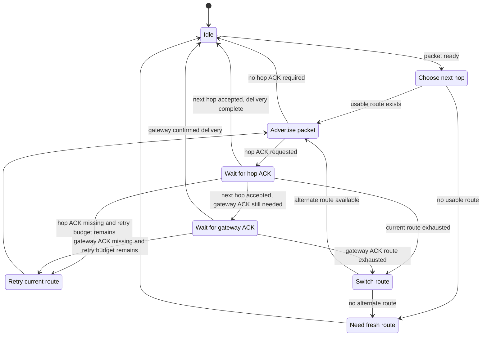
```mermaid
stateDiagram-v2
    state "Idle" as Idle
    state "Choose next hop" as Choose
    state "Advertise packet" as Send
    state "Wait for hop ACK" as HopAck
    state "Wait for gateway ACK" as GatewayAck
    state "Retry current route" as Retry
    state "Switch route" as Switch
    state "Need fresh route" as NeedRoute

    [*] --> Idle
    Idle --> Choose: packet ready
    Choose --> Send: usable route exists
    Choose --> NeedRoute: no usable route
    Send --> HopAck: hop ACK requested
    Send --> Idle: no hop ACK required
    HopAck --> GatewayAck: next hop accepted, gateway ACK still needed
    HopAck --> Idle: next hop accepted, delivery complete
    HopAck --> Retry: hop ACK missing and retry budget remains
    Retry --> Send
    HopAck --> Switch: current route exhausted
    Switch --> Send: alternate route available
    Switch --> NeedRoute: no alternate route
    GatewayAck --> Idle: gateway confirmed delivery
    GatewayAck --> Retry: gateway ACK missing and retry budget remains
    GatewayAck --> Switch: gateway ACK route exhausted
    NeedRoute --> Idle
```

Hop ACK timeout is 500 ms; duplicate state lasts 60 s.

### Anchor Upstream Retry

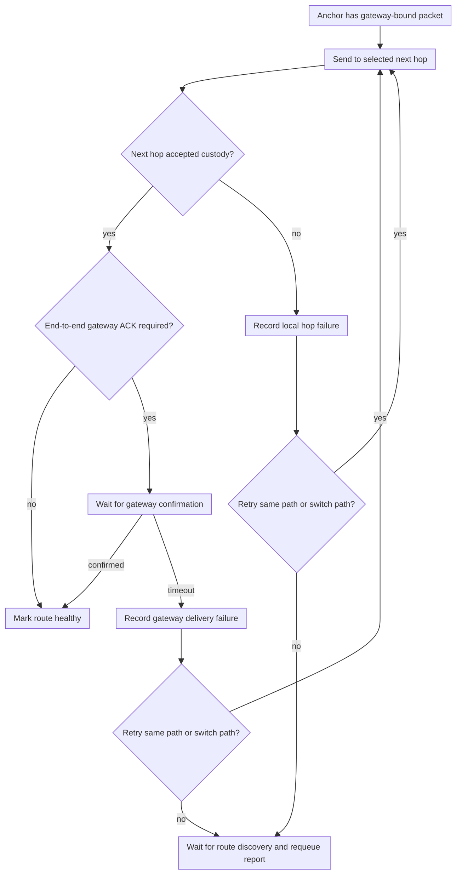
```mermaid
%%{init: {"flowchart": {"nodeSpacing": 24, "rankSpacing": 34, "padding": 6}, "themeVariables": {"fontSize": "12px"}} }%%
flowchart TD
    Start[Anchor has gateway-bound packet] --> Send[Send to selected next hop]
    Send --> Hop{Next hop accepted custody?}
    Hop -->|yes| NeedGateway{End-to-end gateway ACK required?}
    Hop -->|no| HopFail[Record local hop failure]
    HopFail --> HopRetry{Retry same path or switch path?}
    HopRetry -->|yes| Send
    HopRetry -->|no| Requeue[Wait for route discovery and requeue report]
    NeedGateway -->|no| Success[Mark route healthy]
    NeedGateway -->|yes| GatewayWait[Wait for gateway confirmation]
    GatewayWait -->|confirmed| Success
    GatewayWait -->|timeout| GatewayFail[Record gateway delivery failure]
    GatewayFail --> GatewayRetry{Retry same path or switch path?}
    GatewayRetry -->|yes| Send
    GatewayRetry -->|no| Requeue
```

### Gateway Downlink Retry

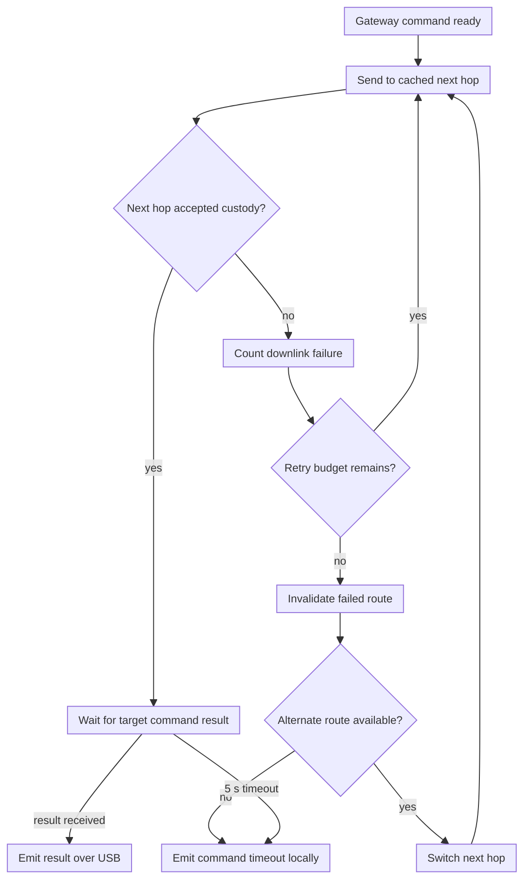
```mermaid
%%{init: {"flowchart": {"nodeSpacing": 24, "rankSpacing": 34, "padding": 6}, "themeVariables": {"fontSize": "12px"}} }%%
flowchart TD
    Start[Gateway command ready] --> Send[Send to cached next hop]
    Send --> Hop{Next hop accepted custody?}
    Hop -->|yes| Result[Wait for target command result]
    Hop -->|no| Failure[Count downlink failure]
    Failure --> Budget{Retry budget remains?}
    Budget -->|yes| Send
    Budget -->|no| Invalidate[Invalidate failed route]
    Invalidate --> Alternate{Alternate route available?}
    Alternate -->|yes| Switch[Switch next hop]
    Switch --> Send
    Alternate -->|no| Timeout[Emit command timeout locally]
    Result -->|result received| Done[Emit result over USB]
    Result -->|5 s timeout| Timeout
```

## Shared UWB Driver

### Initiator DS-TWR

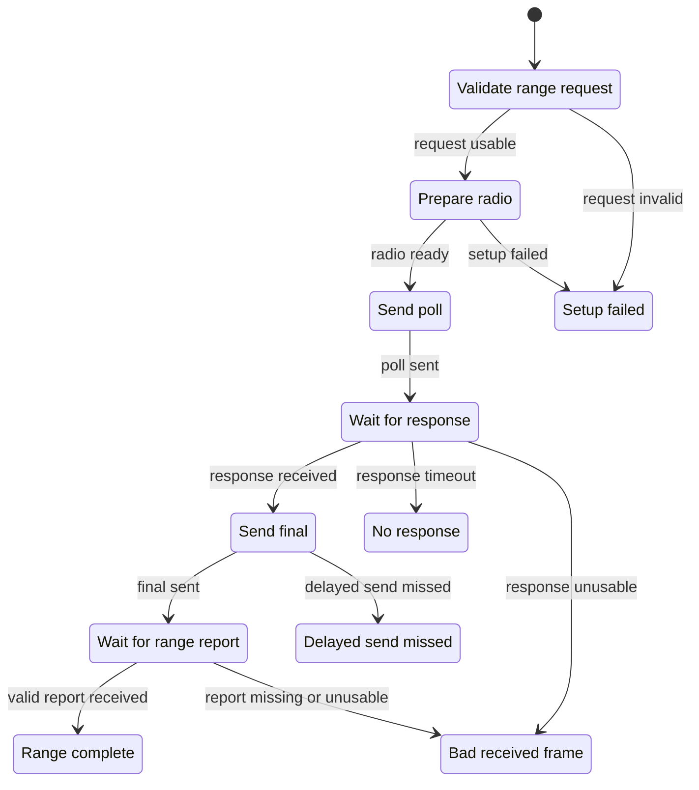
```mermaid
stateDiagram-v2
    state "Validate range request" as Validate
    state "Prepare radio" as Prepare
    state "Send poll" as Poll
    state "Wait for response" as Response
    state "Send final" as Final
    state "Wait for range report" as Report
    state "Range complete" as Complete
    state "No response" as Timeout
    state "Bad received frame" as BadRx
    state "Setup failed" as SetupFail
    state "Delayed send missed" as MissedSend

    [*] --> Validate
    Validate --> Prepare: request usable
    Validate --> SetupFail: request invalid
    Prepare --> Poll: radio ready
    Prepare --> SetupFail: setup failed
    Poll --> Response: poll sent
    Response --> Final: response received
    Response --> Timeout: response timeout
    Response --> BadRx: response unusable
    Final --> Report: final sent
    Final --> MissedSend: delayed send missed
    Report --> Complete: valid report received
    Report --> BadRx: report missing or unusable
```

### Responder DS-TWR

```mermaid
stateDiagram-v2
    state "Prepare radio" as Prepare
    state "Enable receiver" as Listen
    state "Wait inside the same 500 ms window" as WaitPoll
    state "Send response" as Response
    state "Wait for final" as WaitFinal
    state "Compute range" as Compute
    state "Send range report" as SendReport
    state "No matching poll" as Timeout
    state "Ignore wrong poll" as Ignore
    state "Range complete" as Complete
    state "Bad received frame" as BadRx
    state "Delayed send missed" as MissedSend
    state "Report send failed" as ReportFail

    [*] --> Prepare
    Prepare --> Listen: radio ready
    Listen --> WaitPoll: receiver enabled
    WaitPoll --> Response: selected clicker poll received
    WaitPoll --> Timeout: window expires
    WaitPoll --> Ignore: poll for another device
    Ignore --> WaitPoll: continue same continuous window
    Response --> WaitFinal: response sent
    Response --> MissedSend: delayed response missed
    WaitFinal --> Compute: matching final received
    WaitFinal --> BadRx: final missing or unusable
    Compute --> SendReport: distance calculated
    SendReport --> Complete: report sent
    SendReport --> ReportFail: report could not be sent
```
