# Firmware State Machines

Version: 0.1.31

Previous version: [[Firmware State Machines 0.1.30]]

## Changelog

### 2026-05-17 - 0.1.31

- Clarify that anchors preserve each successful sample's round-robin round and measurement time offset in click reports.
- Note that multiple round-robin passes for one click remain separable by per-sample round index.

### 2026-05-17 - 0.1.30

- Add the gateway-initiated time-sync broadcast flow.
- Clarify that anchors attach gateway-synchronized timestamps and sync age to range and survey reports.
- Show that broadcast time sync is handled without command results while directed commands keep their normal result path.

### 2026-05-17 - 0.1.29

- Add the anchor survey pair runtime flow, showing that long survey measurements run away from command handling and can be aborted.
- Clarify that scheduled UWB waits use non-wrapping local deadlines so long-running anchors keep honoring discovery and range windows.
- Keep deterministic anchor slot selection as the v1 collision-avoidance rule.

### 2026-05-16 - 0.1.28

- Clarify that a pre-DS-TWR abort succeeds when the clicker already has the required four unique completed DS-TWR ranges; otherwise it retries if attempts remain.

### 2026-05-16 - 0.1.27

- Show that clicker self-test emits a diagnostic UWB mesh self-test report after the local result is known.
- Replace the remaining route-request advertising wording with UWB route-request wording.

### 2026-05-16 - 0.1.26

- Correct the USB command routing diagram to show the implemented 12 s command-result wait.

### 2026-05-16 - 0.1.25

- Update gateway command handling to show the 12 s command-result wait, covering anchor UWB mesh RX cadence, gateway ACK timeout, and margin.
- Note that runtime scan-duty changes are bounded by firmware duty-cycle and wake-overlap limits.

### 2026-05-16 - 0.1.24

- Clarify that scheduled clicker ranging aborts the current attempt before DS-TWR starts when the click budget or radio access cannot safely start the next exchange; this pre-range abort does not count as a completed DS-TWR failure.
- Replace the older per-anchor retry-backoff chart wording with fixed scheduled slots, one completed DS-TWR exchange per sample, and parent-flow retry handling.

### 2026-05-16 - 0.1.23

- Clarify that same clicker/event retries use attempt freshness before ordinary competing-clicker arbitration: newer attempts refresh the selected epoch and older attempts are stale.

### 2026-05-16 - 0.1.22

- Clarify that anchor relay preemption starts only after the wake claim is accepted for local click handling; rejected claims return to scanning without clearing the current epoch.

### 2026-05-16 - 0.1.21

- Clarify that operational next-hop transfer is now UWB mesh TX/RX; gateway-bound traffic still waits for end-to-end gateway confirmation.

### 2026-05-16 - 0.1.20

- Replace BLE wake/READY and BLE mesh state-machine labels with UWB wake claims, UWB discovery/schedule, scheduled DS-TWR, and UWB mesh RX/TX windows.
- Note that anchors keep a single selected clicker/event epoch, discovery replies are presence-only, and bounded listen loops remain inside one continuous scheduled window.

### 2026-05-05 - 0.1.19

- Remove explicit mesh custody acknowledgement states. UWB mesh TX/RX windows cover next-hop transfer, while gateway-bound traffic waits for end-to-end gateway confirmation.

## Runtime Hierarchy

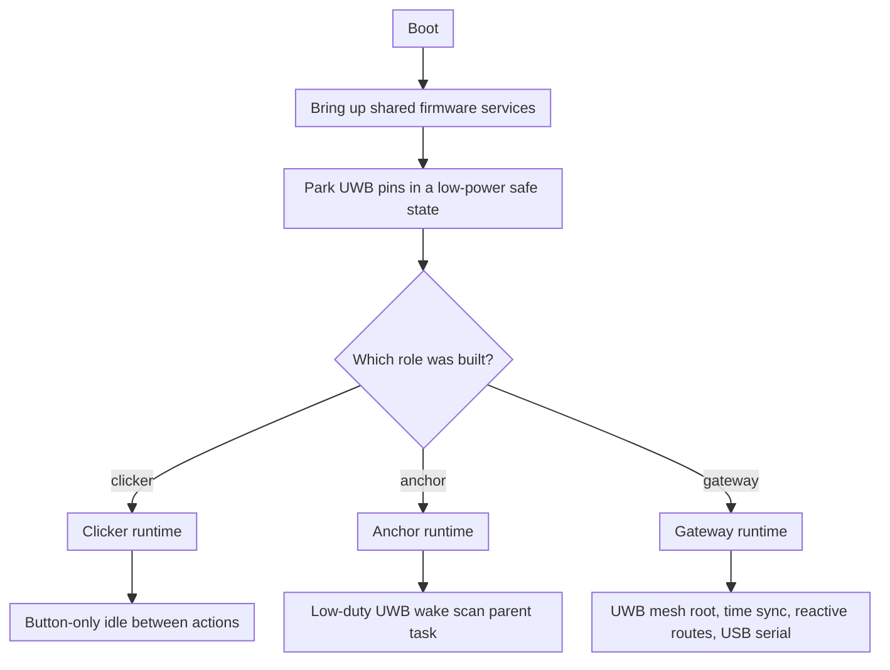
```mermaid
%%{init: {"flowchart": {"nodeSpacing": 24, "rankSpacing": 34, "padding": 6}, "themeVariables": {"fontSize": "12px"}} }%%
flowchart TD
    Boot[Boot] --> Shared[Bring up shared firmware services]
    Shared --> Park[Park UWB pins in a low-power safe state]
    Park --> Role{Which role was built?}
    Role -->|clicker| Clicker[Clicker runtime]
    Role -->|anchor| Anchor[Anchor runtime]
    Role -->|gateway| Gateway[Gateway runtime]
    Clicker --> ClickerIdle[Button-only idle between actions]
    Anchor --> AnchorScan[Low-duty UWB wake scan parent task]
    Gateway --> GatewayRoot[UWB mesh root, time sync, reactive routes, USB serial]
```

## Clicker Role

### Clicker Parent Flow

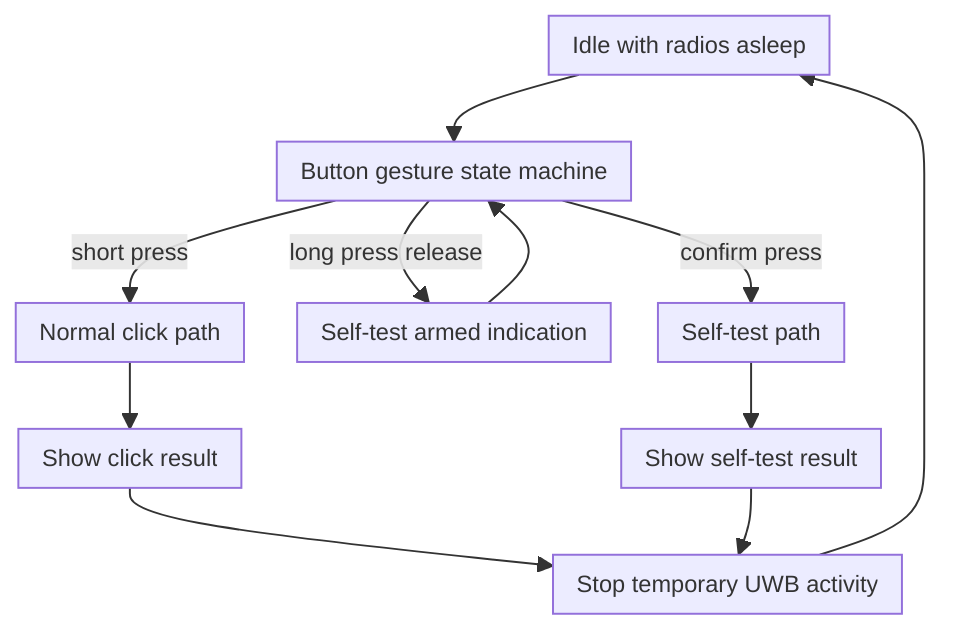
```mermaid
%%{init: {"flowchart": {"nodeSpacing": 24, "rankSpacing": 34, "padding": 6}, "themeVariables": {"fontSize": "12px"}} }%%
flowchart TD
    Idle[Idle with radios asleep] --> Button[Button gesture state machine]
    Button -->|short press| Normal[Normal click path]
    Button -->|long press release| Armed[Self-test armed indication]
    Armed --> Button
    Button -->|confirm press| SelfTest[Self-test path]
    Normal --> NormalResult[Show click result]
    SelfTest --> SelfTestResult[Show self-test result]
    NormalResult --> Shutdown[Stop temporary UWB activity]
    SelfTestResult --> Shutdown
    Shutdown --> Idle
```

### Button Gesture State Machine

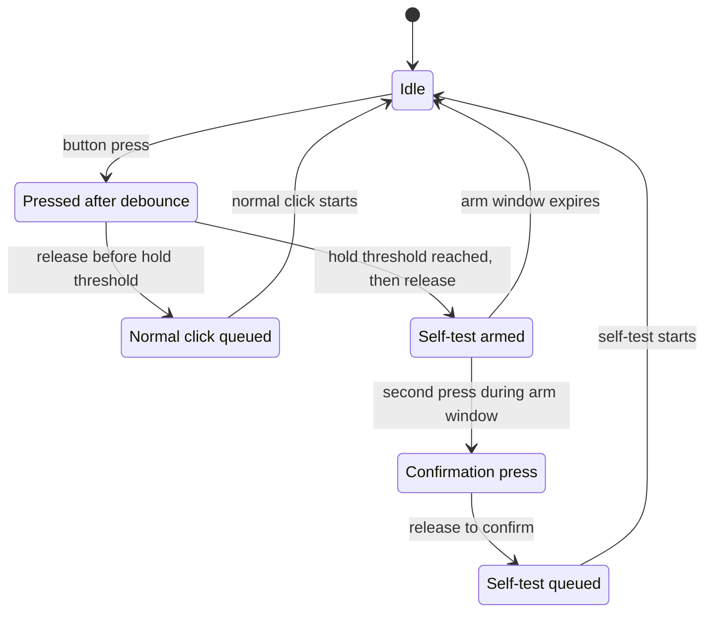
```mermaid
stateDiagram-v2
    state "Idle" as Idle
    state "Pressed after debounce" as Pressed
    state "Normal click queued" as NormalQueued
    state "Self-test armed" as Armed
    state "Confirmation press" as Confirm
    state "Self-test queued" as SelfTestQueued

    [*] --> Idle
    Idle --> Pressed: button press
    Pressed --> NormalQueued: release before hold threshold
    Pressed --> Armed: hold threshold reached, then release
    NormalQueued --> Idle: normal click starts
    Armed --> Confirm: second press during arm window
    Confirm --> SelfTestQueued: release to confirm
    SelfTestQueued --> Idle: self-test starts
    Armed --> Idle: arm window expires
```

### Normal Click End-to-End

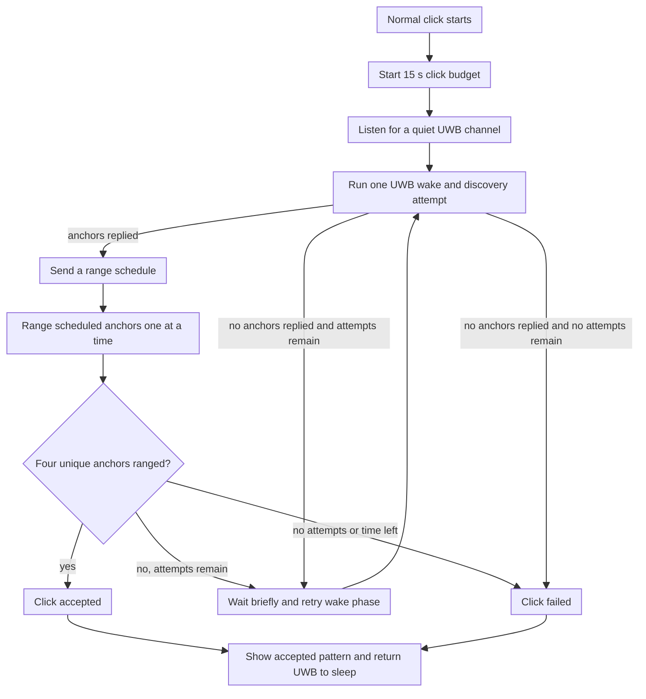
```mermaid
%%{init: {"flowchart": {"nodeSpacing": 24, "rankSpacing": 34, "padding": 6}, "themeVariables": {"fontSize": "12px"}} }%%
flowchart TD
    Start[Normal click starts] --> Deadline[Start 15 s click budget]
    Deadline --> Polite[Listen for a quiet UWB channel]
    Polite --> Attempt[Run one UWB wake and discovery attempt]
    Attempt -->|anchors replied| Schedule[Send a range schedule]
    Schedule --> Ranging[Range scheduled anchors one at a time]
    Ranging --> Success{Four unique anchors ranged?}
    Success -->|yes| Accepted[Click accepted]
    Success -->|no, attempts remain| Retry[Wait briefly and retry wake phase]
    Retry --> Attempt
    Success -->|no attempts or time left| Fail[Click failed]
    Attempt -->|no anchors replied and attempts remain| Retry
    Attempt -->|no anchors replied and no attempts remain| Fail
    Accepted --> Done[Show accepted pattern and return UWB to sleep]
    Fail --> Done
```

### UWB Wake And Discovery Attempt

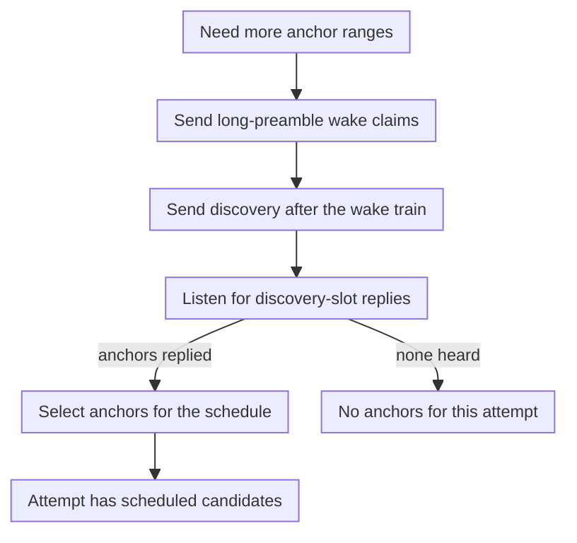
```mermaid
%%{init: {"flowchart": {"nodeSpacing": 24, "rankSpacing": 34, "padding": 6}, "themeVariables": {"fontSize": "12px"}} }%%
flowchart TD
    Start[Need more anchor ranges] --> Claim[Send long-preamble wake claims]
    Claim --> Discover[Send discovery after the wake train]
    Discover --> Listen[Listen for discovery-slot replies]
    Listen -->|anchors replied| Select[Select anchors for the schedule]
    Listen -->|none heard| NoReply[No anchors for this attempt]
    Select --> Done[Attempt has scheduled candidates]
```

The wake train covers one anchor low-duty UWB scan interval plus timing margin. Discovery replies only prove presence for the selected clicker/event; they are not range measurements.

### Scheduled Anchor Ranging

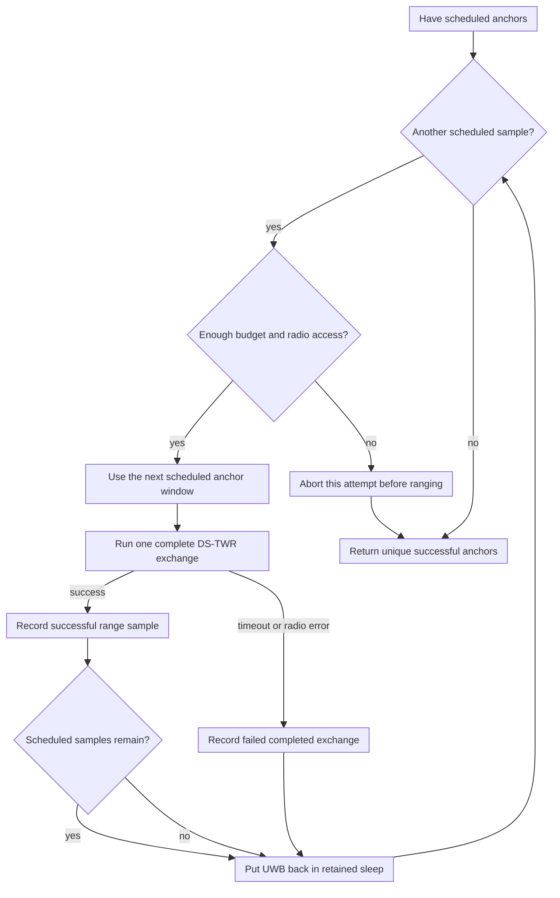
```mermaid
%%{init: {"flowchart": {"nodeSpacing": 24, "rankSpacing": 34, "padding": 6}, "themeVariables": {"fontSize": "12px"}} }%%
flowchart TD
    Start[Have scheduled anchors] --> Next{Another scheduled sample?}
    Next -->|yes| Budget{Enough budget and radio access?}
    Budget -->|yes| Window[Use the next scheduled anchor window]
    Budget -->|no| Abort[Abort this attempt before ranging]
    Abort --> Finish[Return attempt result to parent flow]
    Window --> Range[Run one complete DS-TWR exchange]
    Range -->|success| RecordOk[Record successful range sample]
    Range -->|timeout or radio error| RecordFail[Record failed completed exchange]
    RecordOk --> More{Scheduled samples remain?}
    More -->|yes| Standby[Put UWB back in retained sleep]
    More -->|no| Standby
    RecordFail --> Standby
    Standby --> Next
    Next -->|no| Finish[Return unique successful anchors]
```

Each DS-TWR exchange is completed without interleaving another anchor. Multiple samples are ordered round-robin across anchors, and timing-invalid exchanges are discarded. If the click budget or radio ownership check prevents starting the next scheduled exchange, firmware aborts the current attempt before ranging. If four unique anchors already have completed DS-TWR ranges, the click succeeds; otherwise it retries if attempts remain. Because no new DS-TWR exchange completed, this does not increment per-anchor DS-TWR failure counters.

### Self-Test Flow

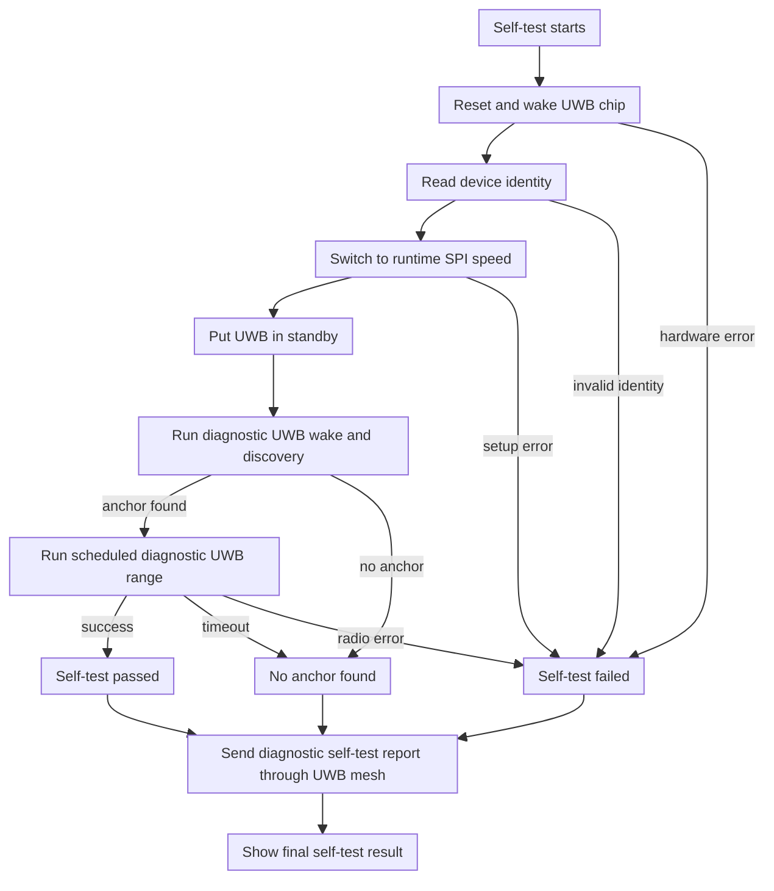
```mermaid
%%{init: {"flowchart": {"nodeSpacing": 24, "rankSpacing": 34, "padding": 6}, "themeVariables": {"fontSize": "12px"}} }%%
flowchart TD
    Start[Self-test starts] --> Reset[Reset and wake UWB chip]
    Reset --> Probe[Read device identity]
    Probe --> FastSpi[Switch to runtime SPI speed]
    FastSpi --> Standby[Put UWB in standby]
    Standby --> DiagnosticDiscovery[Run diagnostic UWB wake and discovery]
    DiagnosticDiscovery -->|anchor found| Range[Run scheduled diagnostic UWB range]
    DiagnosticDiscovery -->|no anchor| NoAnchor[No anchor found]
    Range -->|success| Pass[Self-test passed]
    Range -->|timeout| NoAnchor
    Range -->|radio error| Fail[Self-test failed]
    Pass --> Report[Send diagnostic self-test report through UWB mesh]
    NoAnchor --> Report
    Fail --> Report
    Report --> Done[Show final self-test result]
    Reset -->|hardware error| Fail
    Probe -->|invalid identity| Fail
    FastSpi -->|setup error| Fail
```

Diagnostic events do not count as clicks.

## Anchor Role

### Anchor Parent Flow

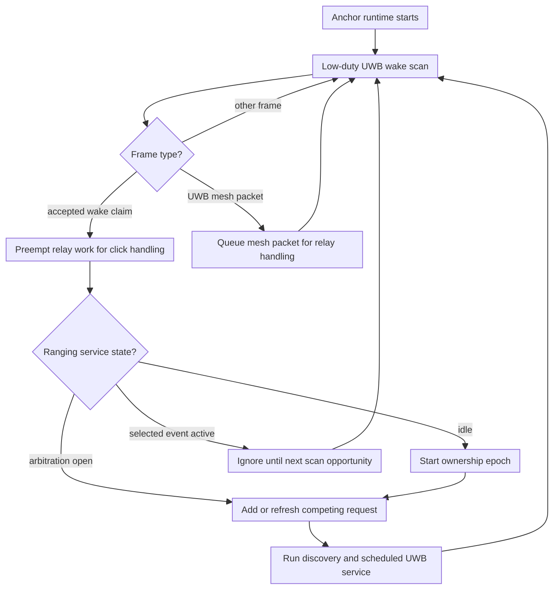
```mermaid
%%{init: {"flowchart": {"nodeSpacing": 24, "rankSpacing": 34, "padding": 6}, "themeVariables": {"fontSize": "12px"}} }%%
flowchart TD
    Start[Anchor runtime starts] --> Scan[Low-duty UWB wake scan]
    Scan --> Packet{Frame type?}
    Packet -->|accepted wake claim| Preempt[Preempt relay work for click handling]
    Preempt --> Availability{Ranging service state?}
    Packet -->|UWB mesh packet| MeshQueue[Queue mesh packet for relay handling]
    MeshQueue --> Scan
    Availability -->|idle| NewAdmission[Start ownership epoch]
    Availability -->|arbitration open| AddRequest[Add or refresh competing request]
    Availability -->|selected event active| Ignore[Ignore until next scan opportunity]
    NewAdmission --> AddRequest
    AddRequest --> Service[Run discovery and scheduled UWB service]
    Service --> Scan
    Ignore --> Scan
    Packet -->|other frame| Scan
```

Anchor wake scanning pauses only while a selected click epoch, tracked mesh transmit, or scheduled UWB responder window is active. Mesh receive windows are short and yield to click wake claims.

Scheduled waits use local non-wrapping uptime deadlines. Status and command payloads can still carry compact uptime fields, but discovery-listen and range-listen decisions do not stop working after the compact counter wraps.

### UWB Discovery And Schedule Service

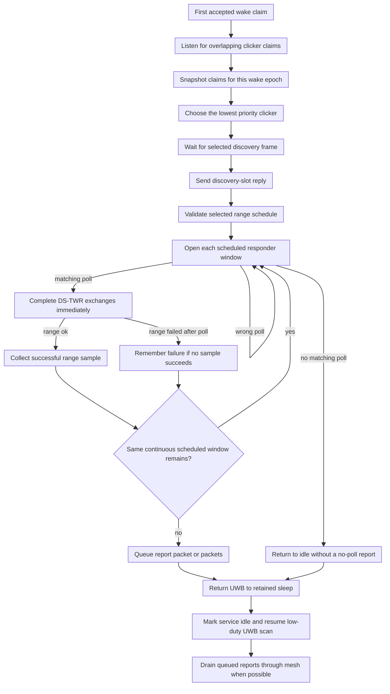
```mermaid
%%{init: {"flowchart": {"nodeSpacing": 24, "rankSpacing": 34, "padding": 6}, "themeVariables": {"fontSize": "12px"}} }%%
flowchart TD
    First[First accepted wake claim] --> Listen[Listen for overlapping clicker claims]
    Listen --> Snapshot[Snapshot claims for this wake epoch]
    Snapshot --> Select[Choose the lowest priority clicker]
    Select --> WaitDiscover[Wait for selected discovery frame]
    WaitDiscover --> Reply[Send discovery-slot reply]
    Reply --> Schedule[Validate selected range schedule]
    Schedule --> Window[Open each scheduled responder window]
    Window -->|matching poll| Exchange[Complete DS-TWR exchanges immediately]
    Window -->|no matching poll| Timeout[Return to idle without a no-poll report]
    Window -->|wrong poll| Window
    Exchange -->|range ok| CollectOk[Collect successful range sample]
    Exchange -->|range failed after poll| CollectFail[Remember failure if no sample succeeds]
    CollectOk --> More{Same continuous scheduled window remains?}
    More -->|yes| Window
    More -->|no| QueueOk[Queue report packet or packets]
    CollectFail --> More
    QueueOk --> Standby[Return UWB to retained sleep]
    Timeout --> Standby
    Standby --> Resume[Mark service idle and resume low-duty UWB scan]
    Resume --> Drain[Drain queued reports through mesh when possible]
```

Freshness is checked before ordinary competing-clicker arbitration: a newer attempt for the same clicker, event, nonce, and mode refreshes the selected epoch; an older attempt is stale. For different clicker events, selection order is lower priority ID, then lower clicker ID, event sequence, and attempt. A matching poll does not restart the scheduled responder window; bounded listen loops remain inside that same continuous window. Successful exchanges in that window are collected as samples for one clicker-anchor measurement; the anchor queues the mesh report data after the window ends. Each stored sample keeps the scheduled round-robin round and its local exchange-start time. A report chunk uses the first sample's gateway-synchronized timestamp as the base and carries per-sample time offsets plus per-sample round indices, so several round-robin passes for one click can be averaged by round after delivery. If the packed sample list does not fit one UWB mesh packet, the anchor queues additional report packets for the remaining samples. The aggregate carries one received signal level measurement, included only in the first report packet.

### Four Quick Clickers On The Same Anchors

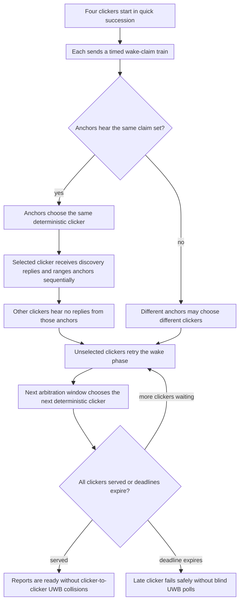
```mermaid
%%{init: {"flowchart": {"nodeSpacing": 24, "rankSpacing": 34, "padding": 6}, "themeVariables": {"fontSize": "12px"}} }%%
flowchart TD
    Four[Four clickers start in quick succession] --> Claim[Each sends a timed wake-claim train]
    Claim --> SameSet{Anchors hear the same claim set?}
    SameSet -->|yes| SameChoice[Anchors choose the same deterministic clicker]
    SameChoice --> ReadyOne[Selected clicker receives discovery replies and ranges anchors sequentially]
    ReadyOne --> Others[Other clickers hear no replies from those anchors]
    Others --> Retry[Unselected clickers retry the wake phase]
    Retry --> NextAttempt[Next arbitration window chooses the next deterministic clicker]
    NextAttempt --> Complete{All clickers served or deadlines expire?}
    Complete -->|more clickers waiting| Retry
    Complete -->|served| Reports[Reports are ready without clicker-to-clicker UWB collisions]
    Complete -->|deadline expires| Fail[Late clicker fails safely without blind UWB polls]
    SameSet -->|no| Diverge[Different anchors may choose different clickers]
    Diverge --> Retry
```

This v1 rule trades speed for deterministic collision avoidance.

Anchor discovery slots are deterministic production configuration. That keeps replies predictable when several anchors share one discovery window and avoids dynamic slot negotiation during the click path.

### Anchor Survey Pair Run

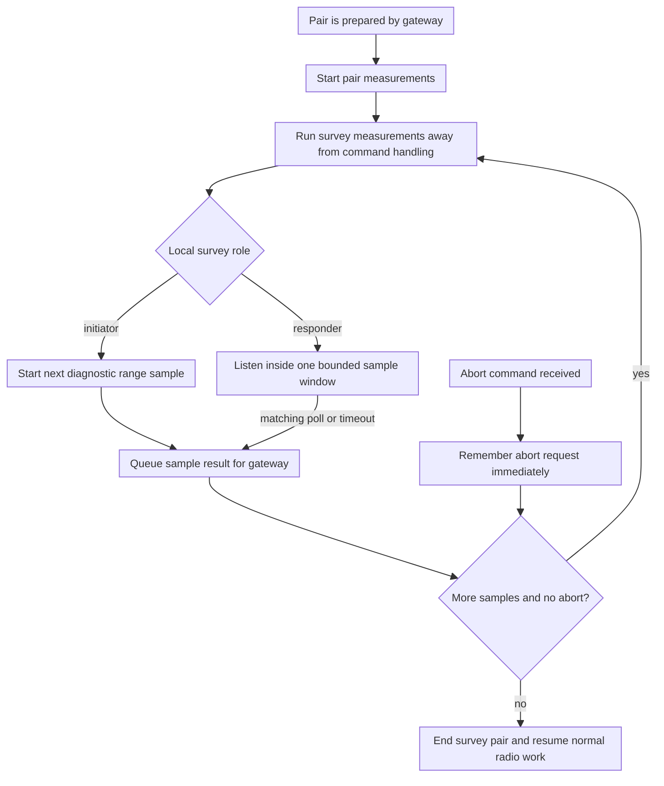
```mermaid
%%{init: {"flowchart": {"nodeSpacing": 24, "rankSpacing": 34, "padding": 6}, "themeVariables": {"fontSize": "12px"}} }%%
flowchart TD
    Prepare[Pair is prepared by gateway] --> Start[Start pair measurements]
    Start --> Worker[Run survey measurements away from command handling]
    Worker --> Role{Local survey role}
    Role -->|initiator| Initiator[Start next diagnostic range sample]
    Role -->|responder| Responder[Listen inside one bounded sample window]
    Initiator --> Result[Queue sample result for gateway]
    Responder -->|matching poll or timeout| Result
    Result --> More{More samples and no abort?}
    More -->|yes| Worker
    More -->|no| Finish[End survey pair and resume normal radio work]
    Abort[Abort command received] --> Stop[Remember abort request immediately]
    Stop --> More
```

Command handling, mesh receive, timeout handling, and report draining stay available while a long survey is running. An abort does not need to wait for the whole sample count; the active pair stops at the next sample boundary or bounded responder-listen check.

### Busy Anchor During A New Click

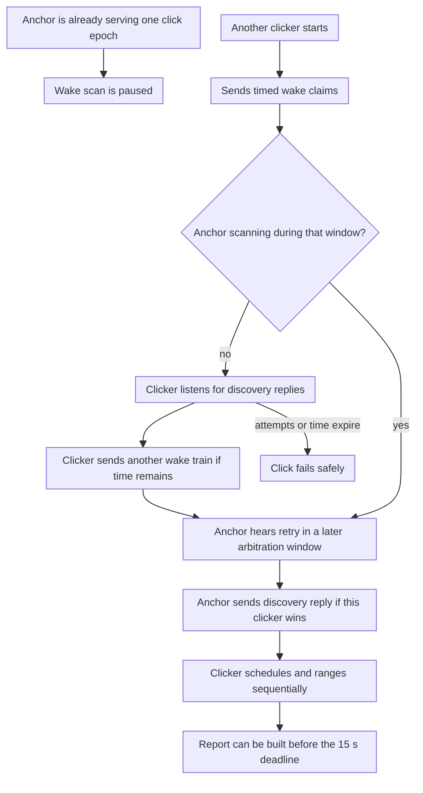
```mermaid
%%{init: {"flowchart": {"nodeSpacing": 24, "rankSpacing": 34, "padding": 6}, "themeVariables": {"fontSize": "12px"}} }%%
flowchart TD
    Existing[Anchor is already serving one click epoch] --> ScanPaused[Wake scan is paused]
    NewClick[Another clicker starts] --> Discovery[Sends timed wake claims]
    Discovery --> Missed{Anchor scanning during that window?}
    Missed -->|no| ScanAfter[Clicker listens for discovery replies]
    ScanAfter --> Retry[Clicker sends another wake train if time remains]
    Retry --> Admitted[Anchor hears retry in a later arbitration window]
    Missed -->|yes| Admitted
    Admitted --> Ready[Anchor sends discovery reply if this clicker wins]
    Ready --> Uwb[Clicker schedules and ranges sequentially]
    Uwb --> ReportReady[Report can be built before the 15 s deadline]
    ScanAfter -->|attempts or time expire| Fail[Click fails safely]
```

No anchor mixes DS-TWR packets from another clicker into the selected epoch.

### Mesh Receive And Relay Handling

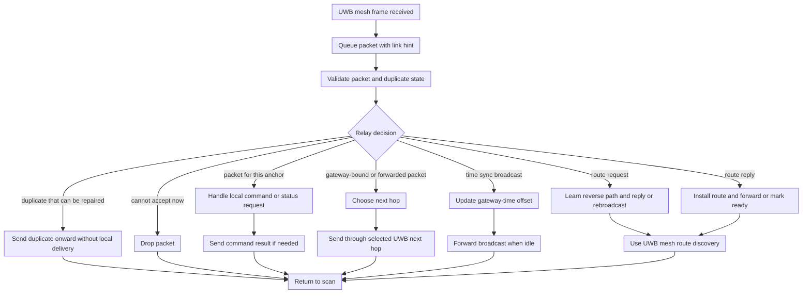
```mermaid
%%{init: {"flowchart": {"nodeSpacing": 24, "rankSpacing": 34, "padding": 6}, "themeVariables": {"fontSize": "12px"}} }%%
flowchart TD
    Found[UWB mesh frame received] --> Queue[Queue packet with link hint]
    Queue --> Validate[Validate packet and duplicate state]
    Validate --> Decision{Relay decision}
    Decision -->|route request| Request[Learn reverse path and reply or rebroadcast]
    Decision -->|route reply| Reply[Install route and forward or mark ready]
    Decision -->|time sync broadcast| Sync[Update gateway-time offset]
    Decision -->|packet for this anchor| Local[Handle local command or status request]
    Decision -->|gateway-bound or forwarded packet| Route[Choose next hop]
    Decision -->|duplicate that can be repaired| Reforward[Send duplicate onward without local delivery]
    Decision -->|cannot accept now| DropBusy[Drop packet]
    Local --> Responses[Send command result if needed]
    Route --> Forward[Send through selected UWB next hop]
    Sync --> Flood[Forward broadcast when idle]
    Request --> Discovery[Use UWB mesh route discovery]
    Reply --> Discovery
    Reforward --> Done[Return to scan]
    DropBusy --> Done
    Responses --> Done
    Forward --> Done
    Flood --> Done
    Discovery --> Done
```

### Anchor Report Queue Drain

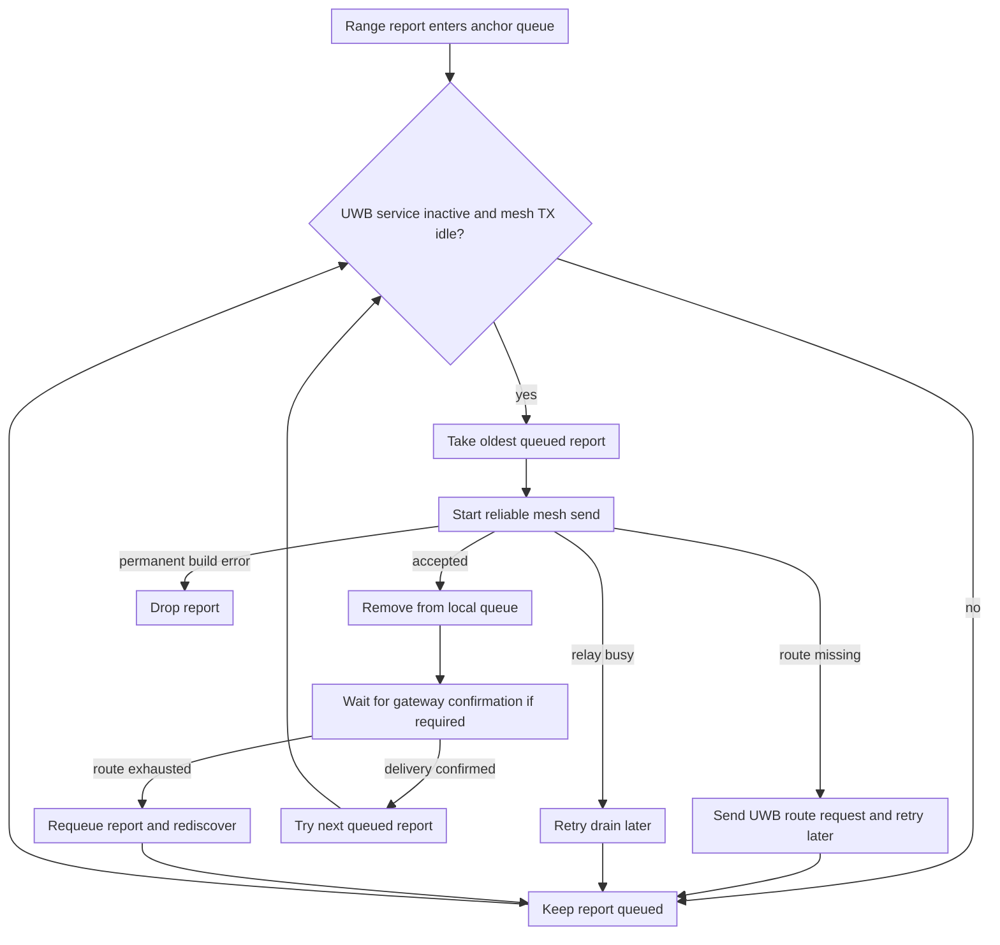
```mermaid
%%{init: {"flowchart": {"nodeSpacing": 24, "rankSpacing": 34, "padding": 6}, "themeVariables": {"fontSize": "12px"}} }%%
flowchart TD
    Report[Range report enters anchor queue] --> Ready{UWB service inactive and mesh TX idle?}
    Ready -->|no| Hold[Keep report queued]
    Hold --> Ready
    Ready -->|yes| Oldest[Take oldest queued report]
    Oldest --> StartTx[Start reliable mesh send]
    StartTx -->|accepted| Remove[Remove from local queue]
    StartTx -->|route missing| Discover[Send UWB route request and retry later]
    StartTx -->|relay busy| RetryLater[Retry drain later]
    StartTx -->|permanent build error| Drop[Drop report]
    Remove --> Await[Wait for gateway confirmation if required]
    Await -->|delivery confirmed| Next[Try next queued report]
    Await -->|route exhausted| Requeue[Requeue report and rediscover]
    Discover --> Hold
    RetryLater --> Hold
    Requeue --> Hold
    Next --> Ready
```

### Local Command Response

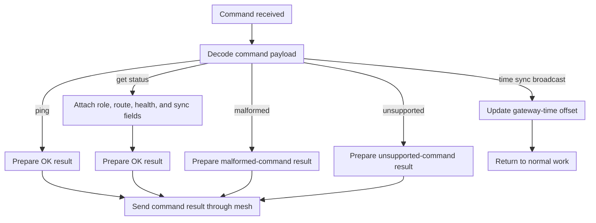
```mermaid
%%{init: {"flowchart": {"nodeSpacing": 24, "rankSpacing": 34, "padding": 6}, "themeVariables": {"fontSize": "12px"}} }%%
flowchart TD
    Command[Command received] --> Decode[Decode command payload]
    Decode -->|malformed| Malformed[Prepare malformed-command result]
    Decode -->|ping| Ping[Prepare OK result]
    Decode -->|get status| Status[Attach role, route, health, and sync fields]
    Decode -->|time sync broadcast| Sync[Update gateway-time offset]
    Decode -->|unsupported| Unsupported[Prepare unsupported-command result]
    Status --> Ok[Prepare OK result]
    Ping --> Result[Send command result through mesh]
    Ok --> Result
    Malformed --> Result
    Unsupported --> Result
    Sync --> Done[Return to normal work]
```

## Gateway Role

### Gateway Parent Flow

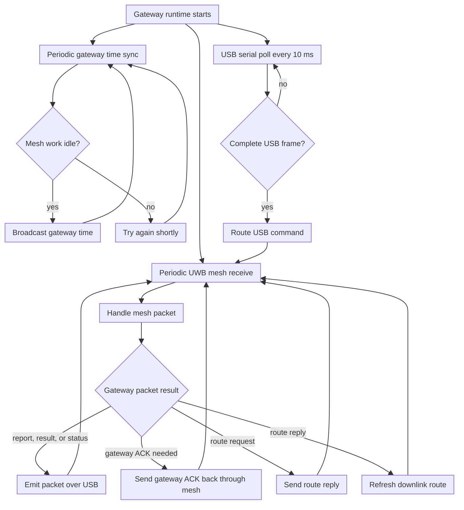
```mermaid
%%{init: {"flowchart": {"nodeSpacing": 24, "rankSpacing": 34, "padding": 6}, "themeVariables": {"fontSize": "12px"}} }%%
flowchart TD
    Start[Gateway runtime starts] --> Scan[Periodic UWB mesh receive]
    Start --> Usb[USB serial poll every 10 ms]
    Start --> SyncTimer[Periodic gateway time sync]
    SyncTimer --> SyncReady{Mesh work idle?}
    SyncReady -->|yes| SyncSend[Broadcast gateway time]
    SyncReady -->|no| SyncRetry[Try again shortly]
    SyncSend --> SyncTimer
    SyncRetry --> SyncTimer
    Usb --> Frame{Complete USB frame?}
    Frame -->|yes| UsbCommand[Route USB command]
    Frame -->|no| Usb
    Scan --> MeshPacket[Handle mesh packet]
    MeshPacket --> PacketType{Gateway packet result}
    PacketType -->|report, result, or status| UsbOut[Emit packet over USB]
    PacketType -->|gateway ACK needed| AckBack[Send gateway ACK back through mesh]
    PacketType -->|route request| Reply[Send route reply]
    PacketType -->|route reply| Downlink[Refresh downlink route]
    UsbCommand --> Scan
    UsbOut --> Scan
    AckBack --> Scan
    Reply --> Scan
    Downlink --> Scan
```

The gateway broadcasts time sync hourly. The interval is derived from a 60 s drift budget and a conservative 500 ppm oscillator bound, which permits about 33.3 h between syncs; hourly sync keeps drift to about 1.8 s at that bound.

### USB Command Routing

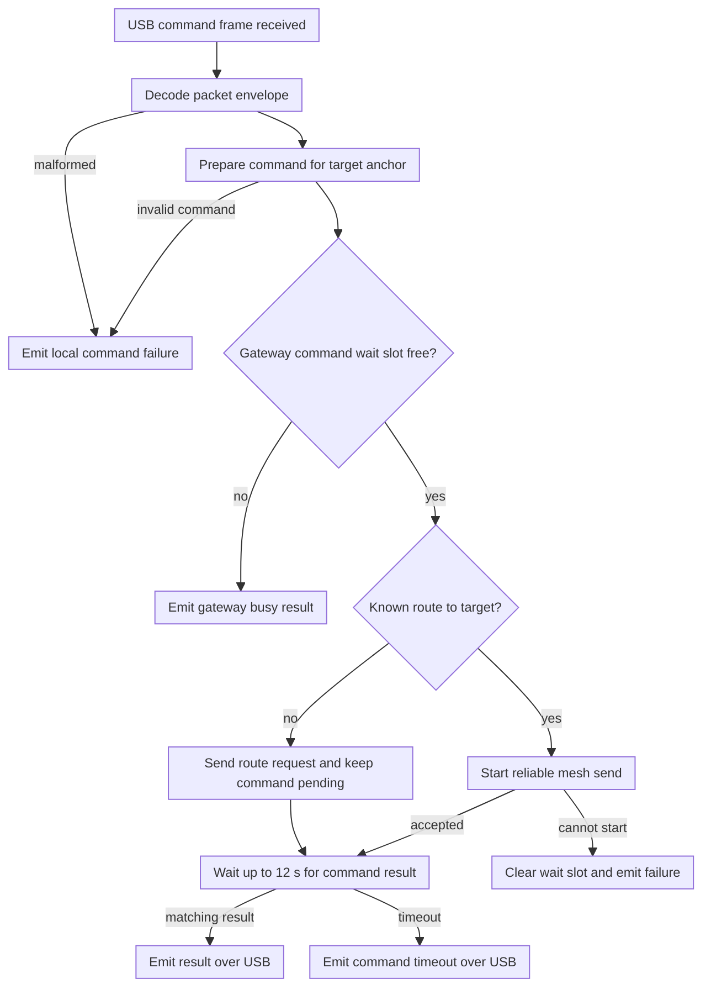
```mermaid
%%{init: {"flowchart": {"nodeSpacing": 24, "rankSpacing": 34, "padding": 6}, "themeVariables": {"fontSize": "12px"}} }%%
flowchart TD
    Frame[USB command frame received] --> Decode[Decode packet envelope]
    Decode -->|malformed| Reject[Emit local command failure]
    Decode --> Prepare[Prepare command for target anchor]
    Prepare -->|invalid command| Reject
    Prepare --> Reserve{Gateway command wait slot free?}
    Reserve -->|no| Busy[Emit gateway busy result]
    Reserve -->|yes| Route{Known route to target?}
    Route -->|yes| Send[Start reliable mesh send]
    Route -->|no| Discover[Send route request and keep command pending]
    Discover --> Wait
    Send -->|cannot start| SendFail[Clear wait slot and emit failure]
    Send -->|accepted| Wait[Wait up to 12 s for command result]
    Wait -->|matching result| UsbResult[Emit result over USB]
    Wait -->|timeout| Timeout[Emit command timeout over USB]
```

## Shared Mesh Relay

### Reliable Relay State Machine

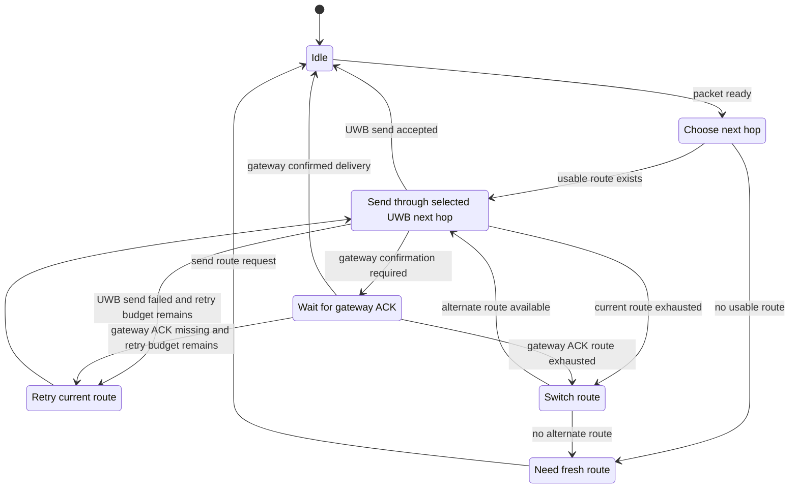
```mermaid
stateDiagram-v2
    state "Idle" as Idle
    state "Choose next hop" as Choose
    state "Send through selected UWB next hop" as Send
    state "Wait for gateway ACK" as GatewayAck
    state "Retry current route" as Retry
    state "Switch route" as Switch
    state "Need fresh route" as NeedRoute

    [*] --> Idle
    Idle --> Choose: packet ready
    Choose --> Send: usable route exists
    Choose --> NeedRoute: no usable route
    Send --> GatewayAck: gateway confirmation required
    Send --> Idle: UWB send accepted
    Send --> Retry: UWB send failed and retry budget remains
    Retry --> Send
    Send --> Switch: current route exhausted
    Switch --> Send: alternate route available
    Switch --> NeedRoute: no alternate route
    GatewayAck --> Idle: gateway confirmed delivery
    GatewayAck --> Retry: gateway ACK missing and retry budget remains
    GatewayAck --> Switch: gateway ACK route exhausted
    NeedRoute --> Idle: send route request
```

Gateway ACK timeout is 2 s; duplicate state lasts 60 s.

### Anchor Upstream Retry

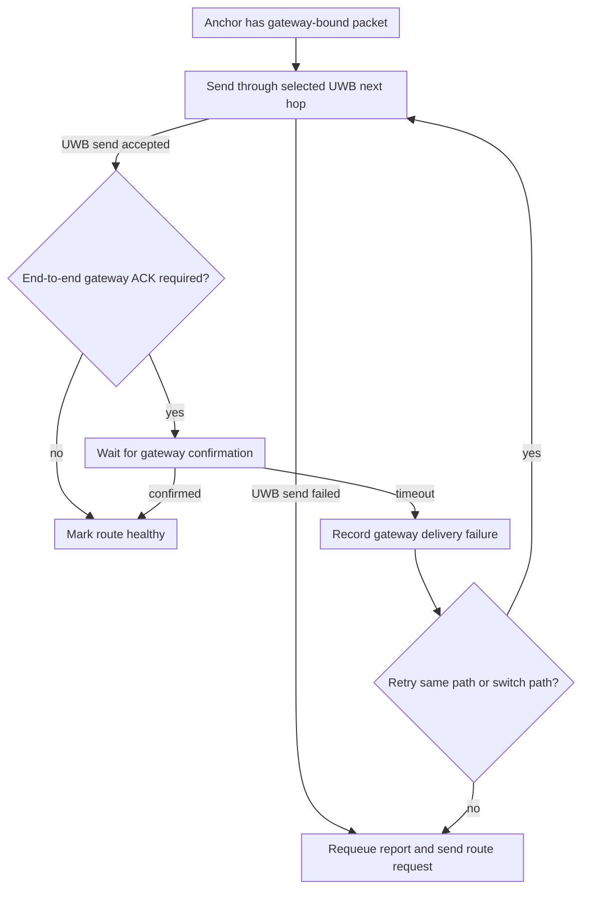
```mermaid
%%{init: {"flowchart": {"nodeSpacing": 24, "rankSpacing": 34, "padding": 6}, "themeVariables": {"fontSize": "12px"}} }%%
flowchart TD
    Start[Anchor has gateway-bound packet] --> Send[Send through selected UWB next hop]
    Send -->|UWB send accepted| NeedGateway{End-to-end gateway ACK required?}
    Send -->|UWB send failed| Requeue[Requeue report and send route request]
    NeedGateway -->|no| Success[Mark route healthy]
    NeedGateway -->|yes| GatewayWait[Wait for gateway confirmation]
    GatewayWait -->|confirmed| Success
    GatewayWait -->|timeout| GatewayFail[Record gateway delivery failure]
    GatewayFail --> GatewayRetry{Retry same path or switch path?}
    GatewayRetry -->|yes| Send
    GatewayRetry -->|no| Requeue
```

### Gateway Downlink Retry

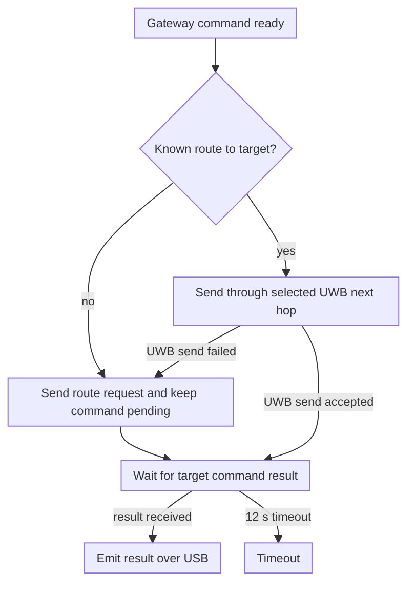
```mermaid
%%{init: {"flowchart": {"nodeSpacing": 24, "rankSpacing": 34, "padding": 6}, "themeVariables": {"fontSize": "12px"}} }%%
flowchart TD
    Start[Gateway command ready] --> Route{Known route to target?}
    Route -->|yes| Send[Send through selected UWB next hop]
    Route -->|no| Discover[Send route request and keep command pending]
    Discover --> Result
    Send -->|UWB send accepted| Result[Wait for target command result]
    Send -->|UWB send failed| Discover
    Result -->|result received| Done[Emit result over USB]
    Result -->|12 s timeout| Timeout
```

## Shared UWB Driver

### Initiator DS-TWR

```mermaid
stateDiagram-v2
    state "Validate range request" as Validate
    state "Prepare radio" as Prepare
    state "Send poll" as Poll
    state "Wait for response" as Response
    state "Send final" as Final
    state "Wait for range report" as Report
    state "Range complete" as Complete
    state "No response" as Timeout
    state "Bad received frame" as BadRx
    state "Setup failed" as SetupFail
    state "Delayed send missed" as MissedSend

    [*] --> Validate
    Validate --> Prepare: request usable
    Validate --> SetupFail: request invalid
    Prepare --> Poll: radio ready
    Prepare --> SetupFail: setup failed
    Poll --> Response: poll sent
    Response --> Final: response received
    Response --> Timeout: response timeout
    Response --> BadRx: response unusable
    Final --> Report: final sent
    Final --> MissedSend: delayed send missed
    Report --> Complete: valid report received
    Report --> BadRx: report missing or unusable
```

### Responder DS-TWR

```mermaid
stateDiagram-v2
    state "Prepare radio" as Prepare
    state "Enable receiver" as Listen
    state "Wait inside the same scheduled window" as WaitPoll
    state "Send response" as Response
    state "Wait for final" as WaitFinal
    state "Compute range" as Compute
    state "Send range report" as SendReport
    state "No matching poll" as Timeout
    state "Ignore wrong poll" as Ignore
    state "Range complete" as Complete
    state "Bad received frame" as BadRx
    state "Delayed send missed" as MissedSend
    state "Report send failed" as ReportFail

    [*] --> Prepare
    Prepare --> Listen: radio ready
    Listen --> WaitPoll: receiver enabled
    WaitPoll --> Response: selected clicker poll received
    WaitPoll --> Timeout: window expires
    WaitPoll --> Ignore: poll for another device
    Ignore --> WaitPoll: continue same continuous window
    Response --> WaitFinal: response sent
    Response --> MissedSend: delayed response missed
    WaitFinal --> Compute: matching final received
    WaitFinal --> BadRx: final missing or unusable
    Compute --> SendReport: distance calculated
    SendReport --> Complete: report sent
    SendReport --> ReportFail: report could not be sent
```
