# Firmware State Machines

Version: 0.1.45

Previous version: [[Firmware State Machines 0.1.44]]

## Changelog

### 2026-06-15 - 0.1.45

- Added hop-progress ACK handling to mesh delivery: progress ACKs extend the gateway-ACK wait but do not complete delivery.
- Added a retry-backoff wait state before retransmission and documented that rediscovery is capped to five attempts with exponential backoff plus jitter.
- Added forced rediscovery command behavior after command-result transmission.
- Updated references to architecture 0.5.55 and protocols 0.2.50.

### 2026-06-15 - 0.1.44

- Removed gateway time-sync states and command paths; mesh packet age now carries relay delay.
- Added the survey discovery start/probe/report flow using deterministic UWB discovery slots.
- Added deterministic post-discovery mesh report slots so survey reports are not sent as one mesh flood.
- Updated references to architecture 0.5.54 and protocols 0.2.49.

### 2026-06-05 - 0.1.43

- Clarified that normal-click range schedules fill the shared 200 ms burst with round-robin exchanges until the next exchange would exceed the burst, instead of using a fixed two-sample count.

### 2026-06-05 - 0.1.42

- Corrected the negotiated channel-9 mesh event flow so accepted event timing is reused until the queued transfer finishes in the normal case.
- Clarified that channel-5 work can cause sender and receiver channel-9 event misses; both sides advance to the next channel-9 event and refresh channel-5 contact only after supervision expiry or missing timing.

### 2026-05-29 - 0.1.41

- Changed the normal-click anchor threshold from four anchors to three because the server-side solver accepts three anchor distances.
- Clarified that range release applies to one or two discovery replies, while zero replies retry without release.
- Updated the normal-click flow so burst ranging may start from three discovery replies and still schedule up to six anchors.
- Updated scheduled burst acceptance to require three unique `RANGE_OK` anchors after the burst.
- Made burst identity mandatory for normal-click report grouping so retry bursts are not combined.
- Aligned arbitration wording with the firmware rule: freshness first, then higher attempt, lower priority, lower clicker, lower click event for different events.
- Normalized `UWB_RANGE_REPLY_DELAY_UUS = 900` wording as the DWM/DW3000 delayed-TX unit.

### 2026-05-18 - 0.1.40

- Clarified that channel-9 receive timing self-adjusts and that idle timing closes on supervision expiry.

### 2026-05-18 - 0.1.39

- Audited every flowchart against the firmware paths and corrected ambiguous or inaccurate labels.
- Clarified that six-anchor schedules continue past the four-anchor acceptance threshold until the burst, schedule, budget, or radio access ends.
- Updated mesh relay, report-drain, command-response, gateway downlink, and range-exchange charts to match the implemented control paths.
- Updated references to architecture 0.5.47 and protocols 0.2.44.

### 2026-05-18 - 0.1.38

- Corrected the scheduled anchor ranging flowchart so four unique anchors is an acceptance threshold after the burst, not an early stop inside the burst.
- Clarified that the clicker keeps running scheduled exchanges until the schedule, click budget, or radio access stops the burst.

### 2026-05-18 - 0.1.37

- Updated references after the UWB PHY preset correction to architecture 0.5.45 and protocols 0.2.42.
- Kept state flows unchanged; the PAC/SFD timeout correction does not alter runtime decisions.

### 2026-05-18 - 0.1.36

- Updated references after the UWB PHY correction to architecture 0.5.44 and protocols 0.2.41.
- Kept the state flows unchanged: the radio setting change affects all UWB modes underneath the same click, range, and mesh flows.

### 2026-05-18 - 0.1.35

- Simplified the normal-click end-to-end decision flow so anchor-count and retry decisions are grouped instead of split across repeated edge labels.
- Added range release for attempts where one to three anchors replied, and made clear that normal-click burst ranging starts only after at least four discovery replies.
- Updated mesh diagrams to separate route validity from channel-9 event timing freshness.
- Updated references to architecture 0.5.43 and protocols 0.2.40.

### 2026-05-18 - 0.1.34

- Update click and anchor flows for a shared 200 ms channel-5 responder burst and a six-anchor schedule cap.
- Show that normal clicks retry or fail before ranging when fewer than four eligible anchors reply.
- Add a high-level negotiated channel-9 mesh event flow with channel-5 preemption and stale-timing fallback.
- Add diagnostic collection and report delivery steps without exposing low-level implementation names in the diagrams.

Older changes are in [[Firmware State Machines 0.1.39]].

This document shows how the firmware moves between states. For system rationale, see [[UWB+BLE Architecture 0.5.55]]. For packet layouts and field names, see [[UWB+BLE Protocols and Strategies 0.2.50]].

## Runtime Hierarchy

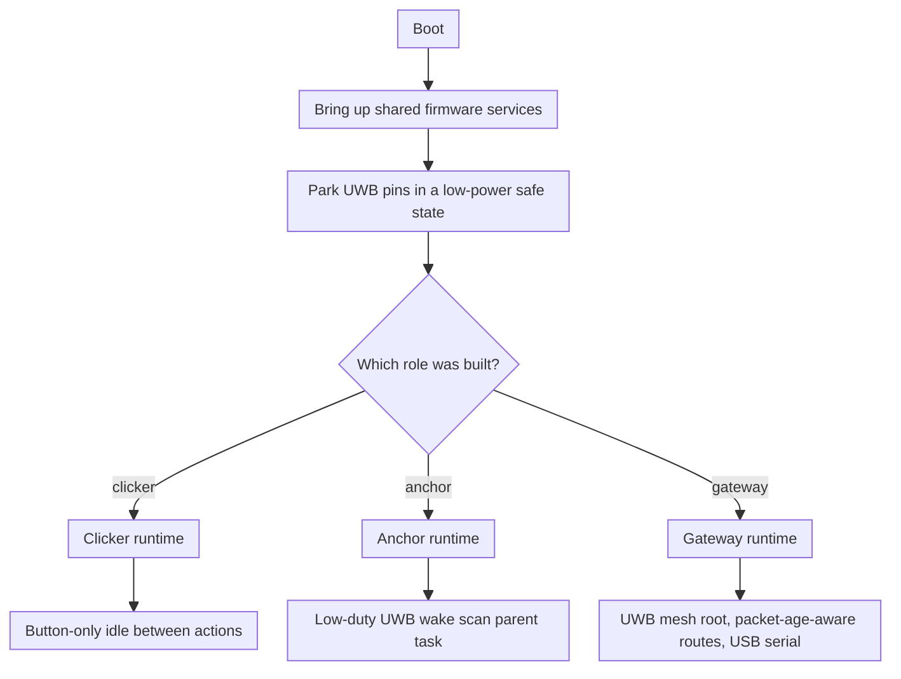
```mermaid
%%{init: {"flowchart": {"nodeSpacing": 24, "rankSpacing": 34, "padding": 6}, "themeVariables": {"fontSize": "12px"}} }%%
flowchart TD
    Boot[Boot] --> Shared[Bring up shared firmware services]
    Shared --> Park[Park UWB pins in a low-power safe state]
    Park --> Role{Which role was built?}
    Role -->|clicker| Clicker[Clicker runtime]
    Role -->|anchor| Anchor[Anchor runtime]
    Role -->|gateway| Gateway[Gateway runtime]
    Clicker --> ClickerIdle[Button-only idle between actions]
    Anchor --> AnchorScan[Low-duty UWB wake scan parent task]
    Gateway --> GatewayRoot[UWB mesh root, packet-age-aware routes, USB serial]
```

## Clicker Role

### Clicker Parent Flow

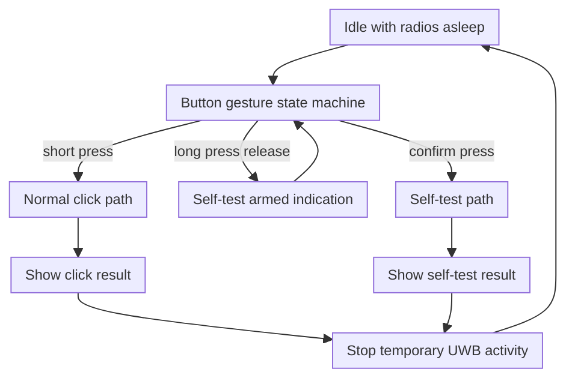
```mermaid
%%{init: {"flowchart": {"nodeSpacing": 24, "rankSpacing": 34, "padding": 6}, "themeVariables": {"fontSize": "12px"}} }%%
flowchart TD
    Idle[Idle with radios asleep] --> Button[Button gesture state machine]
    Button -->|short press| Normal[Normal click path]
    Button -->|long press release| Armed[Self-test armed indication]
    Armed --> Button
    Button -->|confirm press| SelfTest[Self-test path]
    Normal --> NormalResult[Show click result]
    SelfTest --> SelfTestResult[Show self-test result]
    NormalResult --> Shutdown[Stop temporary UWB activity]
    SelfTestResult --> Shutdown
    Shutdown --> Idle
```

### Button Gesture State Machine

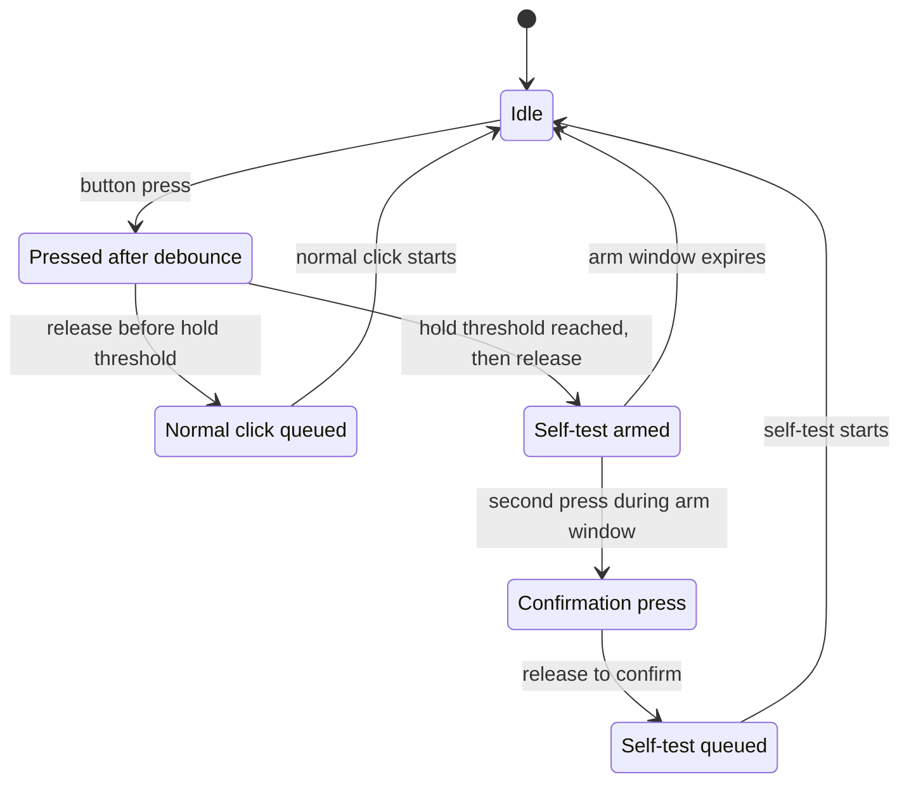
```mermaid
stateDiagram-v2
    state "Idle" as Idle
    state "Pressed after debounce" as Pressed
    state "Normal click queued" as NormalQueued
    state "Self-test armed" as Armed
    state "Confirmation press" as Confirm
    state "Self-test queued" as SelfTestQueued

    [*] --> Idle
    Idle --> Pressed: button press
    Pressed --> NormalQueued: release before hold threshold
    Pressed --> Armed: hold threshold reached, then release
    NormalQueued --> Idle: normal click starts
    Armed --> Confirm: second press during arm window
    Confirm --> SelfTestQueued: release to confirm
    SelfTestQueued --> Idle: self-test starts
    Armed --> Idle: arm window expires
```

### Normal Click End-to-End

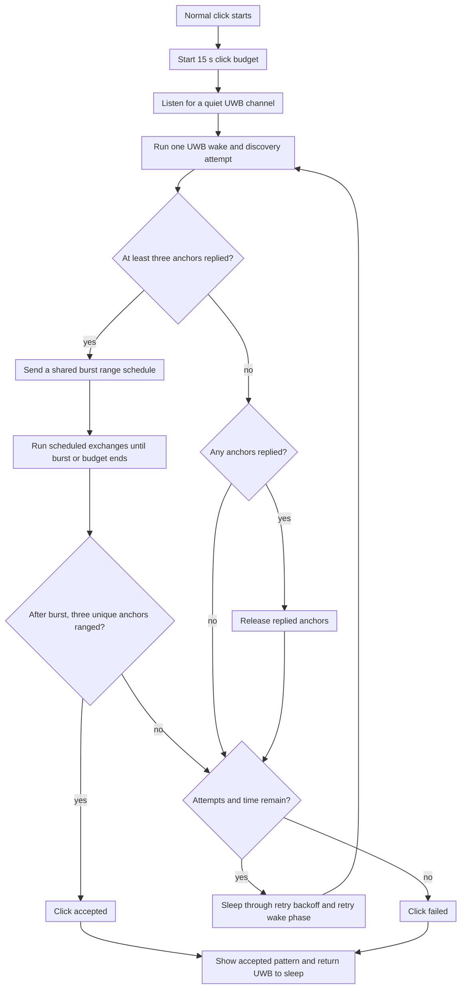
```mermaid
%%{init: {"flowchart": {"nodeSpacing": 24, "rankSpacing": 34, "padding": 6}, "themeVariables": {"fontSize": "12px"}} }%%
flowchart TD
    Start[Normal click starts] --> Deadline[Start 15 s click budget]
    Deadline --> Polite[Listen for a quiet UWB channel]
    Polite --> Attempt[Run one UWB wake and discovery attempt]
    Attempt --> Enough{At least three anchors replied?}
    Enough -->|yes| Schedule[Send a shared burst range schedule]
    Schedule --> Ranging[Run scheduled exchanges until burst or budget ends]
    Ranging --> Success{After burst, three unique anchors ranged?}
    Success -->|yes| Accepted[Click accepted]
    Success -->|no| Attempts{Attempts and time remain?}
    Enough -->|no| AnyReply{Any anchors replied?}
    AnyReply -->|yes| Release[Release replied anchors]
    AnyReply -->|no| Attempts
    Release --> Attempts
    Attempts -->|yes| Retry[Sleep through retry backoff and retry wake phase]
    Retry --> Attempt
    Attempts -->|no| Fail[Click failed]
    Accepted --> Done[Show accepted pattern and return UWB to sleep]
    Fail --> Done
```

### UWB Wake And Discovery Attempt

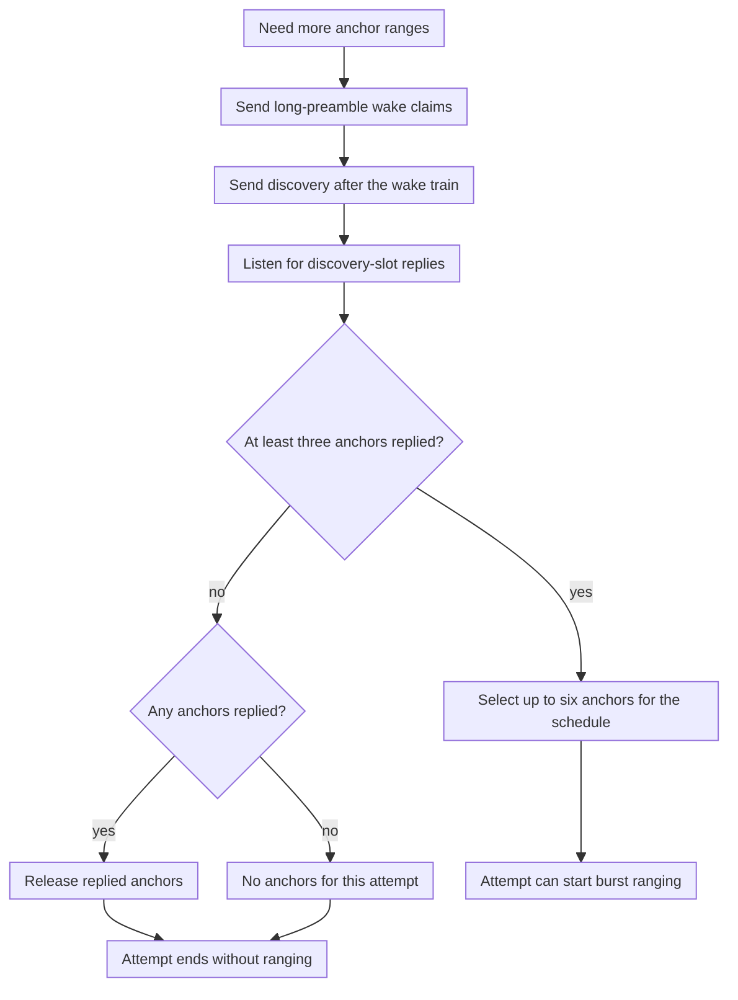
```mermaid
%%{init: {"flowchart": {"nodeSpacing": 24, "rankSpacing": 34, "padding": 6}, "themeVariables": {"fontSize": "12px"}} }%%
flowchart TD
    Start[Need more anchor ranges] --> Claim[Send long-preamble wake claims]
    Claim --> Discover[Send discovery after the wake train]
    Discover --> Listen[Listen for discovery-slot replies]
    Listen --> Enough{At least three anchors replied?}
    Enough -->|yes| Select[Select up to six anchors for the schedule]
    Enough -->|no| AnyReply{Any anchors replied?}
    AnyReply -->|yes| Release[Release replied anchors]
    AnyReply -->|no| NoReply[No anchors for this attempt]
    Select --> Done[Attempt can start burst ranging]
    Release --> DoneShort[Attempt ends without ranging]
    NoReply --> DoneShort
```

The wake train covers one anchor low-duty UWB scan interval plus timing margin. Discovery replies only prove presence for the selected clicker/event; they are not range measurements. A normal click starts burst ranging only after at least three eligible anchors replied. If one or two anchors replied, the clicker sends a release frame so those anchors can return to low-duty scan before the clicker retries or fails. If zero anchors replied, there is no release target and the clicker simply enters the retry/fail path.

### Scheduled Anchor Ranging

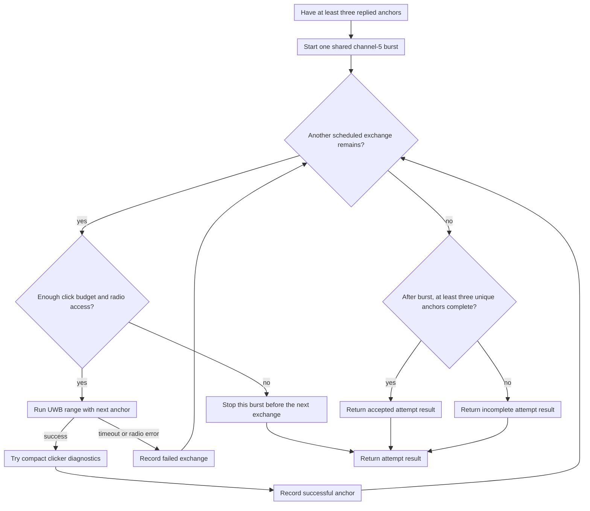
```mermaid
%%{init: {"flowchart": {"nodeSpacing": 24, "rankSpacing": 34, "padding": 6}, "themeVariables": {"fontSize": "12px"}} }%%
flowchart TD
    Start[Have at least three replied anchors] --> Open[Start one shared channel-5 burst]
    Open --> Next{Another scheduled exchange remains?}
    Next -->|yes| Budget{Enough click budget and radio access?}
    Budget -->|yes| Range[Run UWB range with next anchor]
    Budget -->|no| Abort[Stop this burst before the next exchange]
    Range -->|success| ClickerDiag[Try compact clicker diagnostics]
    Range -->|timeout or radio error| RecordFail[Record failed exchange]
    ClickerDiag --> RecordOk[Record successful anchor]
    RecordOk --> Next
    RecordFail --> Next
    Next -->|no| Enough{After burst, at least three unique anchors complete?}
    Enough -->|yes| Accepted[Return accepted attempt result]
    Enough -->|no| Retryable[Return incomplete attempt result]
    Abort --> Finish[Return attempt result]
    Accepted --> Finish
    Retryable --> Finish
```

The burst is one continuous 200 ms channel-5 responder window shared by all selected anchors. The clicker uses addressed no-STS DS-TWR exchanges, round-robin order, and a 7 ms minimum stride. A normal click can schedule up to six anchors but this flow is entered only after at least three anchors replied to discovery. The schedule advertises a per-anchor sample cap and a global exchange capacity for the 200 ms burst; the clicker keeps taking round-robin samples until the next exchange would exceed that capacity. With the current 7 ms stride, the 200 ms burst fits 28 exchanges: three selected anchors receive a 10/9/9 split, four receive 7 each, five receive 6/6/6/5/5, and six receive 5/5/5/5/4/4. Three unique anchors is the success threshold for accepting the click after the burst; it is not an early-stop condition. The clicker keeps starting scheduled exchanges until there is no next scheduled exchange, the click budget cannot leave report-build guard time, or radio access is denied. If fewer than three unique anchors complete by then, the clicker retries if attempts remain.

### Self-Test Flow

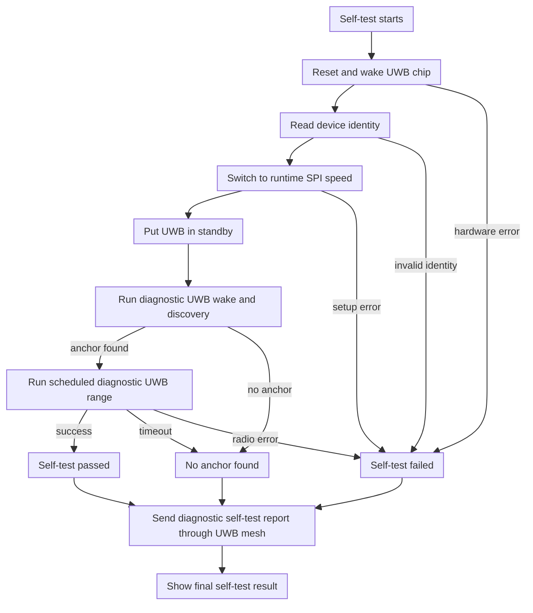
```mermaid
%%{init: {"flowchart": {"nodeSpacing": 24, "rankSpacing": 34, "padding": 6}, "themeVariables": {"fontSize": "12px"}} }%%
flowchart TD
    Start[Self-test starts] --> Reset[Reset and wake UWB chip]
    Reset --> Probe[Read device identity]
    Probe --> FastSpi[Switch to runtime SPI speed]
    FastSpi --> Standby[Put UWB in standby]
    Standby --> DiagnosticDiscovery[Run diagnostic UWB wake and discovery]
    DiagnosticDiscovery -->|anchor found| Range[Run scheduled diagnostic UWB range]
    DiagnosticDiscovery -->|no anchor| NoAnchor[No anchor found]
    Range -->|success| Pass[Self-test passed]
    Range -->|timeout| NoAnchor
    Range -->|radio error| Fail[Self-test failed]
    Pass --> Report[Send diagnostic self-test report through UWB mesh]
    NoAnchor --> Report
    Fail --> Report
    Report --> Done[Show final self-test result]
    Reset -->|hardware error| Fail
    Probe -->|invalid identity| Fail
    FastSpi -->|setup error| Fail
```

Diagnostic events do not count as clicks.

## Anchor Role

### Anchor Parent Flow

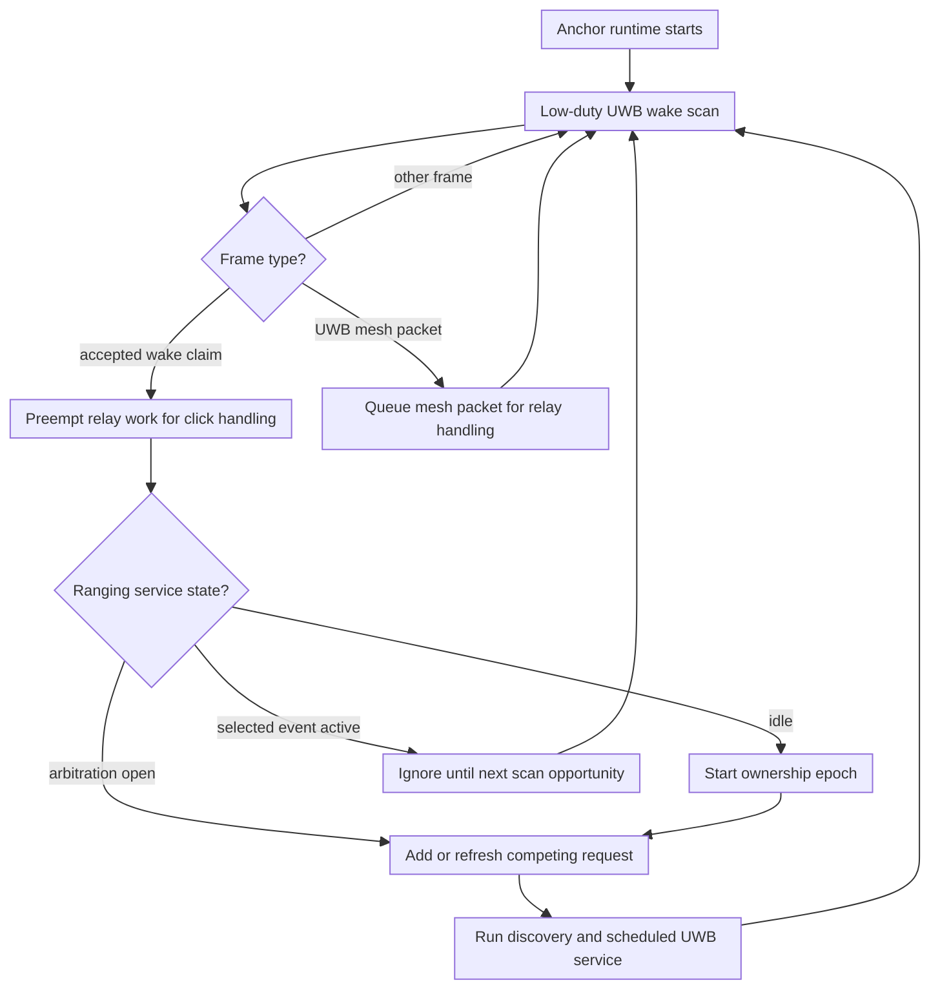
```mermaid
%%{init: {"flowchart": {"nodeSpacing": 24, "rankSpacing": 34, "padding": 6}, "themeVariables": {"fontSize": "12px"}} }%%
flowchart TD
    Start[Anchor runtime starts] --> Scan[Low-duty UWB wake scan]
    Scan --> Packet{Frame type?}
    Packet -->|accepted wake claim| Preempt[Preempt relay work for click handling]
    Preempt --> Availability{Ranging service state?}
    Packet -->|UWB mesh packet| MeshQueue[Queue mesh packet for relay handling]
    MeshQueue --> Scan
    Availability -->|idle| NewAdmission[Start ownership epoch]
    Availability -->|arbitration open| AddRequest[Add or refresh competing request]
    Availability -->|selected event active| Ignore[Ignore until next scan opportunity]
    NewAdmission --> AddRequest
    AddRequest --> Service[Run discovery and scheduled UWB service]
    Service --> Scan
    Ignore --> Scan
    Packet -->|other frame| Scan
```

Anchor wake scanning pauses only while a selected click epoch, tracked mesh transmit, or scheduled UWB responder window is active. Mesh receive windows are short and yield to click wake claims.

Scheduled waits use local non-wrapping uptime deadlines. Status and command payloads can still carry compact uptime fields, but discovery-listen and range-listen decisions do not stop working after the compact counter wraps.

### UWB Discovery And Schedule Service

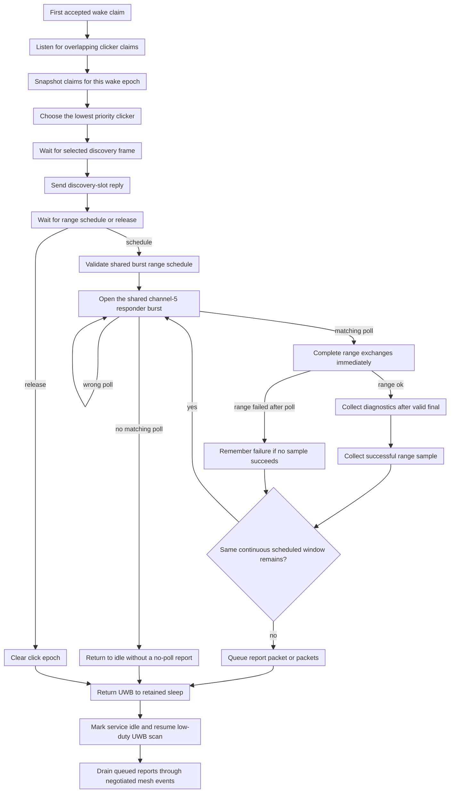
```mermaid
%%{init: {"flowchart": {"nodeSpacing": 24, "rankSpacing": 34, "padding": 6}, "themeVariables": {"fontSize": "12px"}} }%%
flowchart TD
    First[First accepted wake claim] --> Listen[Listen for overlapping clicker claims]
    Listen --> Snapshot[Snapshot claims for this wake epoch]
    Snapshot --> Select[Choose the lowest priority clicker]
    Select --> WaitDiscover[Wait for selected discovery frame]
    WaitDiscover --> Reply[Send discovery-slot reply]
    Reply --> WaitOrder[Wait for range schedule or release]
    WaitOrder -->|schedule| Schedule[Validate shared burst range schedule]
    WaitOrder -->|release| Release[Clear click epoch]
    Schedule --> Window[Open the shared channel-5 responder burst]
    Window -->|matching poll| Exchange[Complete range exchanges immediately]
    Window -->|no matching poll| Timeout[Return to idle without a no-poll report]
    Window -->|wrong poll| Window
    Exchange -->|range ok| Diag[Collect diagnostics after valid final]
    Diag --> CollectOk[Collect successful range sample]
    Exchange -->|range failed after poll| CollectFail[Remember failure if no sample succeeds]
    CollectOk --> More{Same continuous scheduled window remains?}
    More -->|yes| Window
    More -->|no| QueueOk[Queue report packet or packets]
    CollectFail --> More
    QueueOk --> Standby[Return UWB to retained sleep]
    Timeout --> Standby
    Release --> Standby
    Standby --> Resume[Mark service idle and resume low-duty UWB scan]
    Resume --> Drain[Drain queued reports through negotiated mesh events]
```

Freshness is checked before ordinary competing-clicker arbitration. For the same network, clicker, click event, nonce, and mode, a higher attempt replaces the selected epoch and a lower attempt is stale; the same attempt with a different priority is malformed and cannot refresh the epoch. Claims for different clicker events arbitrate by higher attempt, then lower priority, lower clicker identity, and lower click event. A release after the discovery reply means the clicker heard one or two anchors for a normal click, so the anchor clears that epoch and resumes scan without waiting for a schedule. A matching poll does not restart the scheduled responder burst; bounded listen loops remain inside that same continuous window. The clicker includes the round-robin round in each scheduled range request, and the anchor validates that round against the accepted schedule before collecting the result. Successful exchanges in that window are collected as samples for one clicker-anchor measurement. Anchor diagnostics are collected after the first valid final for the exchange, and clicker diagnostics are attached when the post-final diagnostic frame arrives. Normal-click report packets carry the burst identity so the server groups only samples from the same click event and burst. The anchor queues mesh report data after the window ends. If the packed sample list or diagnostics do not fit one UWB mesh packet, the anchor queues additional report packets for the remaining chunks.

### Four Quick Clickers On The Same Anchors

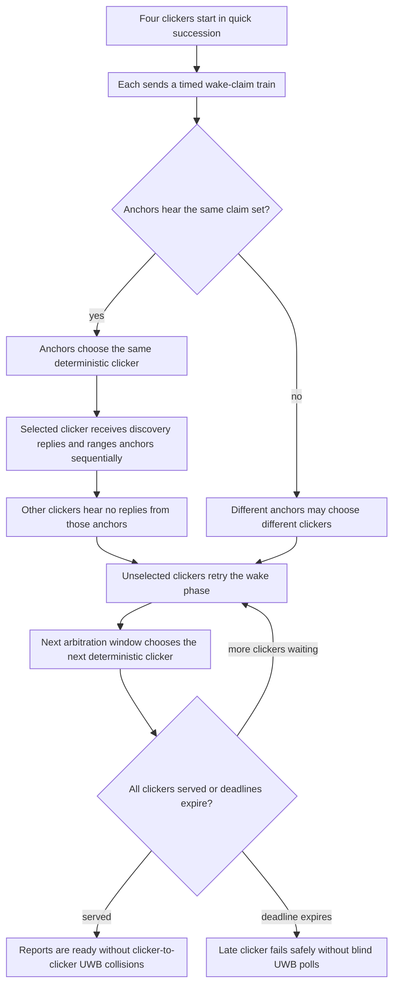
```mermaid
%%{init: {"flowchart": {"nodeSpacing": 24, "rankSpacing": 34, "padding": 6}, "themeVariables": {"fontSize": "12px"}} }%%
flowchart TD
    Four[Four clickers start in quick succession] --> Claim[Each sends a timed wake-claim train]
    Claim --> SameSet{Anchors hear the same claim set?}
    SameSet -->|yes| SameChoice[Anchors choose the same deterministic clicker]
    SameChoice --> ReadyOne[Selected clicker receives discovery replies and ranges anchors sequentially]
    ReadyOne --> Others[Other clickers hear no replies from those anchors]
    Others --> Retry[Unselected clickers retry the wake phase]
    Retry --> NextAttempt[Next arbitration window chooses the next deterministic clicker]
    NextAttempt --> Complete{All clickers served or deadlines expire?}
    Complete -->|more clickers waiting| Retry
    Complete -->|served| Reports[Reports are ready without clicker-to-clicker UWB collisions]
    Complete -->|deadline expires| Fail[Late clicker fails safely without blind UWB polls]
    SameSet -->|no| Diverge[Different anchors may choose different clickers]
    Diverge --> Retry
```

This v1 rule trades speed for deterministic collision avoidance.

Anchor discovery slots are deterministic production configuration. That keeps replies predictable when several anchors share one discovery window and avoids dynamic slot negotiation during the click path.

### Anchor Survey Pair Run

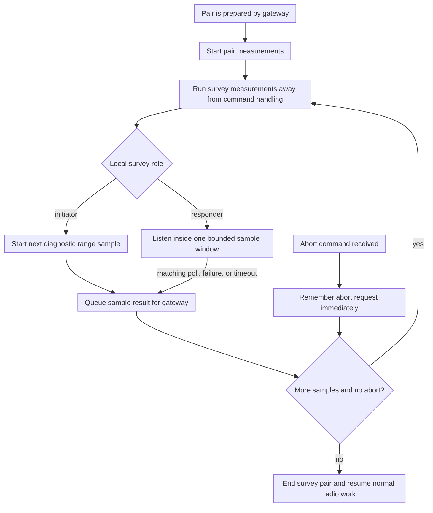
```mermaid
%%{init: {"flowchart": {"nodeSpacing": 24, "rankSpacing": 34, "padding": 6}, "themeVariables": {"fontSize": "12px"}} }%%
flowchart TD
    Prepare[Pair is prepared by gateway] --> Start[Start pair measurements]
    Start --> Worker[Run survey measurements away from command handling]
    Worker --> Role{Local survey role}
    Role -->|initiator| Initiator[Start next diagnostic range sample]
    Role -->|responder| Responder[Listen inside one bounded sample window]
    Initiator --> Result[Queue sample result for gateway]
    Responder -->|matching poll, failure, or timeout| Result
    Result --> More{More samples and no abort?}
    More -->|yes| Worker
    More -->|no| Finish[End survey pair and resume normal radio work]
    Abort[Abort command received] --> Stop[Remember abort request immediately]
    Stop --> More
```

Command handling, mesh receive, timeout handling, and report draining stay available while a long survey is running. An abort does not need to wait for the whole sample count; the active pair stops at the next sample boundary or bounded responder-listen check.

### Anchor Survey Discovery

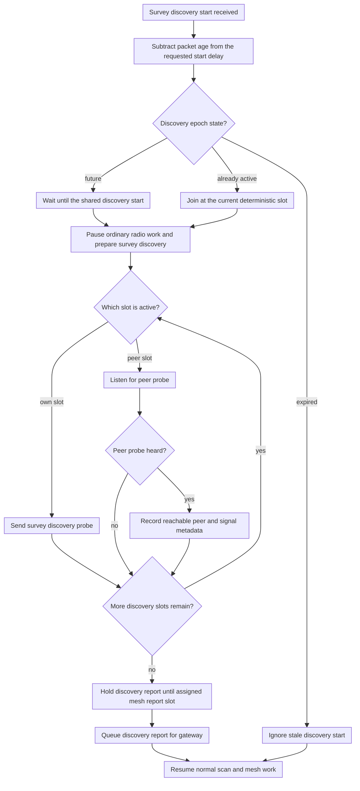
```mermaid
%%{init: {"flowchart": {"nodeSpacing": 24, "rankSpacing": 34, "padding": 6}, "themeVariables": {"fontSize": "12px"}} }%%
flowchart TD
    Start[Survey discovery start received] --> Age[Subtract packet age from the requested start delay]
    Age --> Time{Discovery epoch state?}
    Time -->|future| Wait[Wait until the shared discovery start]
    Time -->|already active| Join[Join at the current deterministic slot]
    Time -->|expired| Ignore[Ignore stale discovery start]
    Wait --> Prepare[Pause ordinary radio work and prepare survey discovery]
    Join --> Prepare
    Prepare --> Slot{Which slot is active?}
    Slot -->|own slot| Probe[Send survey discovery probe]
    Slot -->|peer slot| Listen[Listen for peer probe]
    Probe --> More{More discovery slots remain?}
    Listen --> Heard{Peer probe heard?}
    Heard -->|yes| Record[Record reachable peer and signal metadata]
    Heard -->|no| More
    Record --> More
    More -->|yes| Slot
    More -->|no| ReportWait[Hold discovery report until assigned mesh report slot]
    ReportWait --> Queue[Queue discovery report for gateway]
    Queue --> Resume[Resume normal scan and mesh work]
    Ignore --> Resume
```

Survey discovery is setup work and has priority over ordinary mesh/report work. The start packet's age lets anchors that receive the broadcast through different relay delays enter the same discovery epoch without a gateway-synchronized clock. The discovery slots are deterministic from the anchor slot assignment. After the UWB discovery epoch, each anchor waits for its deterministic mesh report slot before queueing the gateway-bound report, so the gateway receives a paced report train instead of a burst of reports from every reachable anchor.

### Busy Anchor During A New Click

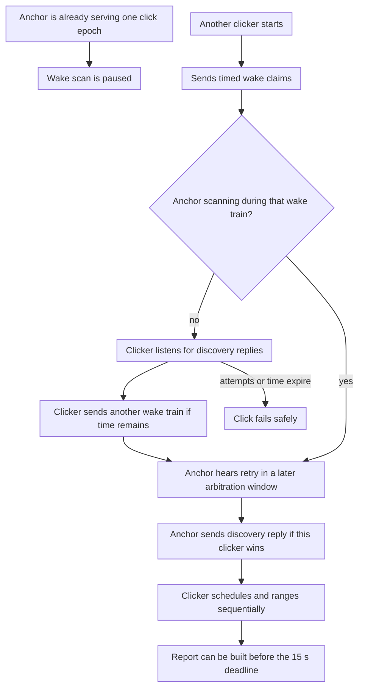
```mermaid
%%{init: {"flowchart": {"nodeSpacing": 24, "rankSpacing": 34, "padding": 6}, "themeVariables": {"fontSize": "12px"}} }%%
flowchart TD
    Existing[Anchor is already serving one click epoch] --> ScanPaused[Wake scan is paused]
    NewClick[Another clicker starts] --> Discovery[Sends timed wake claims]
    Discovery --> Scanning{Anchor scanning during that wake train?}
    Scanning -->|no| ScanAfter[Clicker listens for discovery replies]
    ScanAfter --> Retry[Clicker sends another wake train if time remains]
    Retry --> Admitted[Anchor hears retry in a later arbitration window]
    Scanning -->|yes| Admitted
    Admitted --> Ready[Anchor sends discovery reply if this clicker wins]
    Ready --> Uwb[Clicker schedules and ranges sequentially]
    Uwb --> ReportReady[Report can be built before the 15 s deadline]
    ScanAfter -->|attempts or time expire| Fail[Click fails safely]
```

No anchor mixes range packets from another clicker into the selected epoch.

### Mesh Receive And Relay Handling

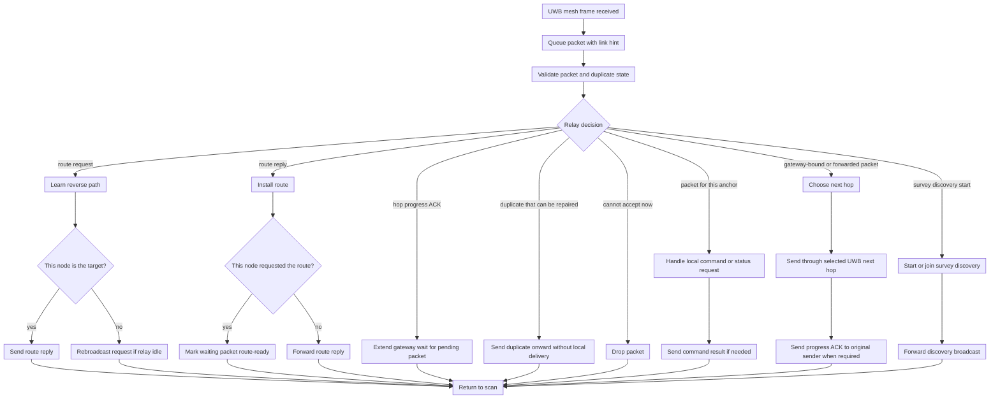
```mermaid
%%{init: {"flowchart": {"nodeSpacing": 24, "rankSpacing": 34, "padding": 6}, "themeVariables": {"fontSize": "12px"}} }%%
flowchart TD
    Found[UWB mesh frame received] --> Queue[Queue packet with link hint]
    Queue --> Validate[Validate packet and duplicate state]
    Validate --> Decision{Relay decision}
    Decision -->|route request| Request[Learn reverse path]
    Request --> RequestTarget{This node is the target?}
    RequestTarget -->|yes| RouteReply[Send route reply]
    RequestTarget -->|no| Rebroadcast[Rebroadcast request if relay idle]
    Decision -->|route reply| Reply[Install route]
    Reply --> ReplyTarget{This node requested the route?}
    ReplyTarget -->|yes| RouteReady[Mark waiting packet route-ready]
    ReplyTarget -->|no| ForwardReply[Forward route reply]
    Decision -->|hop progress ACK| Progress[Extend gateway wait for pending packet]
    Decision -->|survey discovery start| SurveyStart[Start or join survey discovery]
    Decision -->|packet for this anchor| Local[Handle local command or status request]
    Decision -->|gateway-bound or forwarded packet| Route[Choose next hop]
    Decision -->|duplicate that can be repaired| Reforward[Send duplicate onward without local delivery]
    Decision -->|cannot accept now| DropBusy[Drop packet]
    Local --> Responses[Send command result if needed]
    Route --> Forward[Send through selected UWB next hop]
    Forward --> HopProgress[Send progress ACK to original sender when required]
    SurveyStart --> Flood[Forward discovery broadcast]
    RouteReply --> Done
    Rebroadcast --> Done
    RouteReady --> Done
    ForwardReply --> Done
    Progress --> Done
    Reforward --> Done[Return to scan]
    DropBusy --> Done
    Responses --> Done
    HopProgress --> Done
    Flood --> Done
```

### Anchor Report Queue Drain

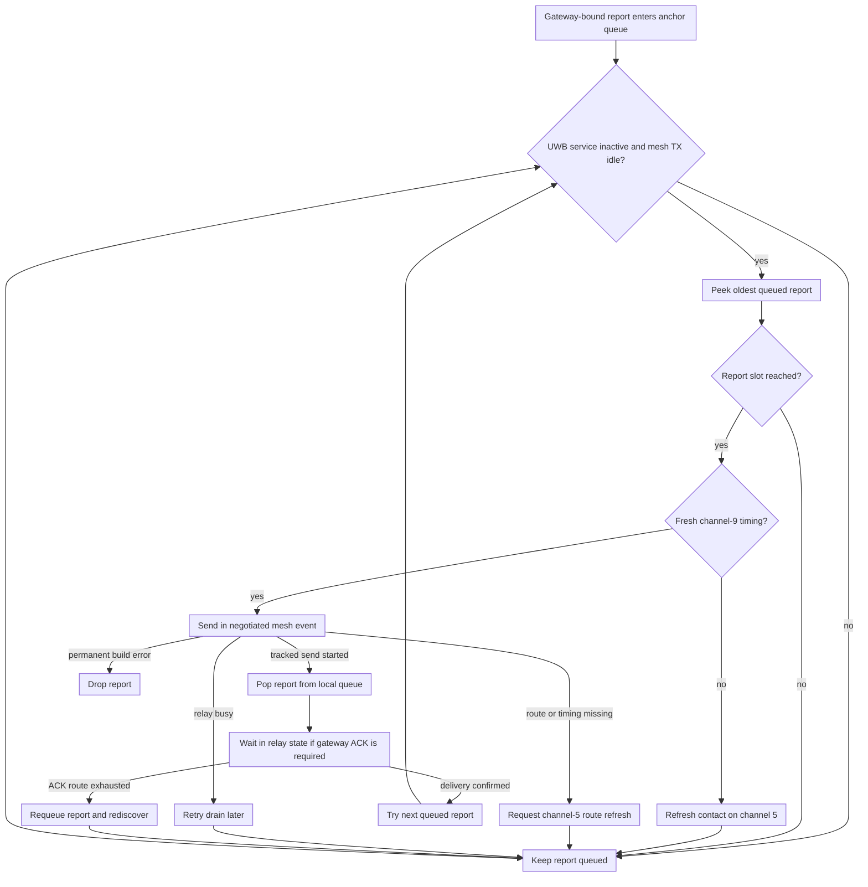
```mermaid
%%{init: {"flowchart": {"nodeSpacing": 24, "rankSpacing": 34, "padding": 6}, "themeVariables": {"fontSize": "12px"}} }%%
flowchart TD
    Report[Gateway-bound report enters anchor queue] --> Ready{UWB service inactive and mesh TX idle?}
    Ready -->|no| Hold[Keep report queued]
    Hold --> Ready
    Ready -->|yes| Oldest[Peek oldest queued report]
    Oldest --> SlotReady{Report slot reached?}
    SlotReady -->|no| Hold
    SlotReady -->|yes| Timing{Fresh channel-9 timing?}
    Timing -->|yes| StartTx[Send in negotiated mesh event]
    Timing -->|no| Refresh[Refresh contact on channel 5]
    Refresh --> Hold
    StartTx -->|tracked send started| Remove[Pop report from local queue]
    StartTx -->|route or timing missing| Discover[Request channel-5 route refresh]
    StartTx -->|relay busy| RetryLater[Retry drain later]
    StartTx -->|permanent build error| Drop[Drop report]
    Remove --> Await[Wait in relay state if gateway ACK is required]
    Await -->|delivery confirmed| Next[Try next queued report]
    Await -->|ACK route exhausted| Requeue[Requeue report and rediscover]
    Discover --> Hold
    RetryLater --> Hold
    Requeue --> Hold
    Next --> Ready
```

### Negotiated Channel-9 Mesh Event

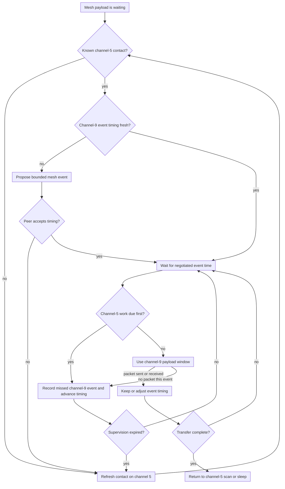
```mermaid
%%{init: {"flowchart": {"nodeSpacing": 24, "rankSpacing": 34, "padding": 6}, "themeVariables": {"fontSize": "12px"}} }%%
flowchart TD
    NeedPayload[Mesh payload is waiting] --> Contact{Known channel-5 contact?}
    Contact -->|no| Refresh[Refresh contact on channel 5]
    Refresh --> Contact
    Contact -->|yes| Timing{Channel-9 event timing fresh?}
    Timing -->|no| Propose[Propose bounded mesh event]
    Propose --> Accepted{Peer accepts timing?}
    Accepted -->|no| Refresh
    Accepted -->|yes| WaitEvent[Wait for negotiated event time]
    Timing -->|yes| WaitEvent
    WaitEvent --> Preempt{Channel-5 work due first?}
    Preempt -->|yes| Miss[Record missed channel-9 event and advance timing]
    Preempt -->|no| MeshWindow[Use channel-9 payload window]
    MeshWindow -->|packet sent or received| NoteSuccess[Keep or adjust event timing]
    MeshWindow -->|no packet this event| Miss
    NoteSuccess --> Complete{Transfer complete?}
    Complete -->|no| WaitEvent
    Complete -->|yes| Done[Return to channel-5 scan or sleep]
    Miss --> Stale{Supervision expired?}
    Stale -->|no| WaitEvent
    Stale -->|yes| Refresh
```

Channel-9 mesh is scheduled work, not wake discovery. An active click epoch, discovery listen/reply, responder burst, or required quick channel-5 wake scan can preempt the event. In the normal case, accepted channel-9 timing is reused across packet events until the queued transfer finishes; the sender does not renegotiate timing after each packet. A received channel-9 packet adjusts the peer's local next-window estimate. If either side misses a channel-9 event because channel-5 work took priority or no packet arrived, it advances the timing to the next event and keeps using channel 9 while supervision remains fresh. Supervision expiry closes the timing entry and returns payload delivery to channel-5 contact refresh, but it does not by itself delete the route.

### Local Command Response

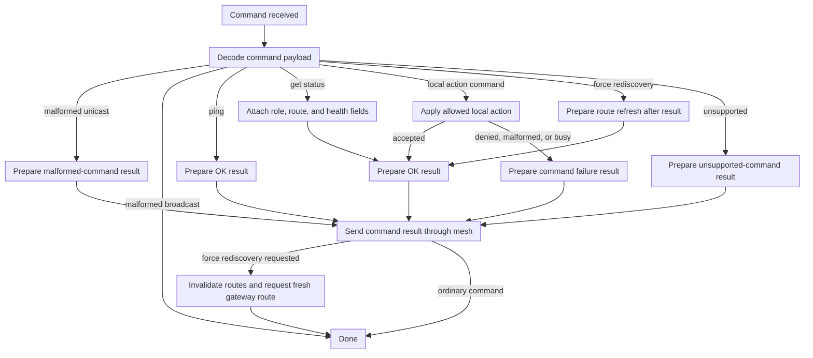
```mermaid
%%{init: {"flowchart": {"nodeSpacing": 24, "rankSpacing": 34, "padding": 6}, "themeVariables": {"fontSize": "12px"}} }%%
flowchart TD
    Command[Command received] --> Decode[Decode command payload]
    Decode -->|malformed unicast| Malformed[Prepare malformed-command result]
    Decode -->|malformed broadcast| Done
    Decode -->|ping| Ping[Prepare OK result]
    Decode -->|get status| Status[Attach role, route, and health fields]
    Decode -->|local action command| Apply[Apply allowed local action]
    Decode -->|force rediscovery| Force[Prepare route refresh after result]
    Decode -->|unsupported| Unsupported[Prepare unsupported-command result]
    Status --> Ok[Prepare OK result]
    Apply -->|accepted| Ok
    Apply -->|denied, malformed, or busy| ActionFail[Prepare command failure result]
    Force --> Ok
    Ping --> Result[Send command result through mesh]
    Ok --> Result
    Malformed --> Result
    Unsupported --> Result
    ActionFail --> Result
    Result -->|force rediscovery requested| Refresh[Invalidate routes and request fresh gateway route]
    Result -->|ordinary command| Done
    Refresh --> Done
```

## Gateway Role

### Gateway Parent Flow

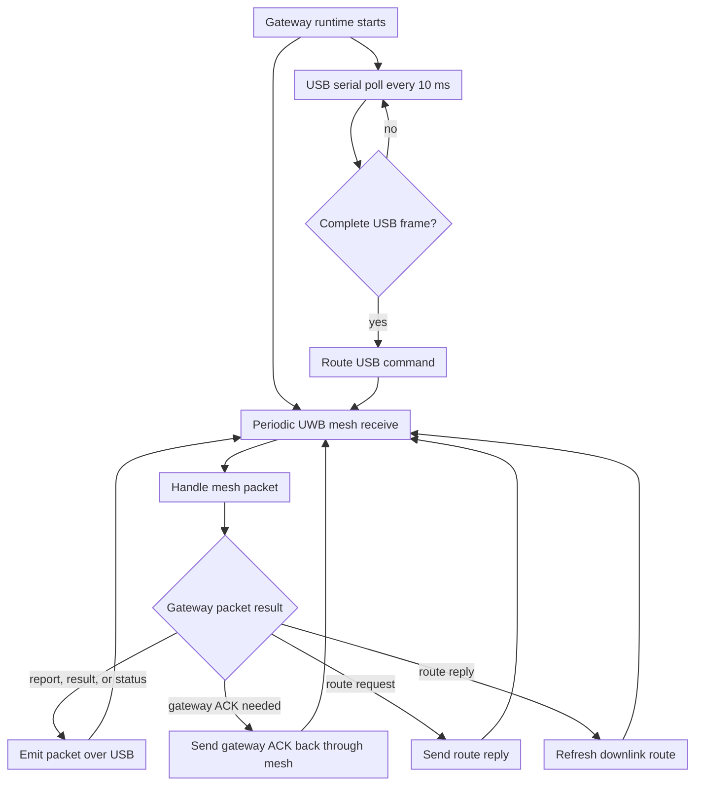
```mermaid
%%{init: {"flowchart": {"nodeSpacing": 24, "rankSpacing": 34, "padding": 6}, "themeVariables": {"fontSize": "12px"}} }%%
flowchart TD
    Start[Gateway runtime starts] --> Scan[Periodic UWB mesh receive]
    Start --> Usb[USB serial poll every 10 ms]
    Usb --> Frame{Complete USB frame?}
    Frame -->|yes| UsbCommand[Route USB command]
    Frame -->|no| Usb
    Scan --> MeshPacket[Handle mesh packet]
    MeshPacket --> PacketType{Gateway packet result}
    PacketType -->|report, result, or status| UsbOut[Emit packet over USB]
    PacketType -->|gateway ACK needed| AckBack[Send gateway ACK back through mesh]
    PacketType -->|route request| Reply[Send route reply]
    PacketType -->|route reply| Downlink[Refresh downlink route]
    UsbCommand --> Scan
    UsbOut --> Scan
    AckBack --> Scan
    Reply --> Scan
    Downlink --> Scan
```

Gateway timing is local. Shared mesh packets carry a packet-age field that is increased by queues, relays, and retransmits. Gateway survey discovery uses that age field to start anchors near the same slot epoch without broadcasting gateway time.

### USB Command Routing

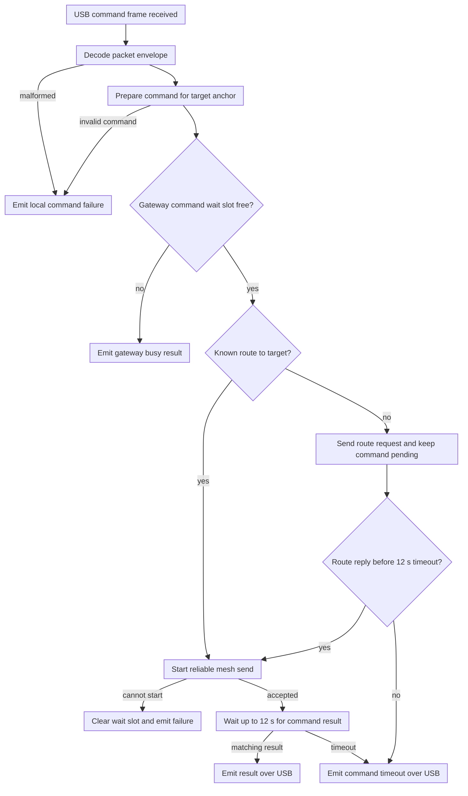
```mermaid
%%{init: {"flowchart": {"nodeSpacing": 24, "rankSpacing": 34, "padding": 6}, "themeVariables": {"fontSize": "12px"}} }%%
flowchart TD
    Frame[USB command frame received] --> Decode[Decode packet envelope]
    Decode -->|malformed| Reject[Emit local command failure]
    Decode --> Prepare[Prepare command for target anchor]
    Prepare -->|invalid command| Reject
    Prepare --> Reserve{Gateway command wait slot free?}
    Reserve -->|no| Busy[Emit gateway busy result]
    Reserve -->|yes| Route{Known route to target?}
    Route -->|yes| Send[Start reliable mesh send]
    Route -->|no| Discover[Send route request and keep command pending]
    Discover --> WaitRoute{Route reply before 12 s timeout?}
    WaitRoute -->|yes| Send
    WaitRoute -->|no| Timeout
    Send -->|cannot start| SendFail[Clear wait slot and emit failure]
    Send -->|accepted| Wait[Wait up to 12 s for command result]
    Wait -->|matching result| UsbResult[Emit result over USB]
    Wait -->|timeout| Timeout[Emit command timeout over USB]
```

## Shared Mesh Relay

### Reliable Relay State Machine

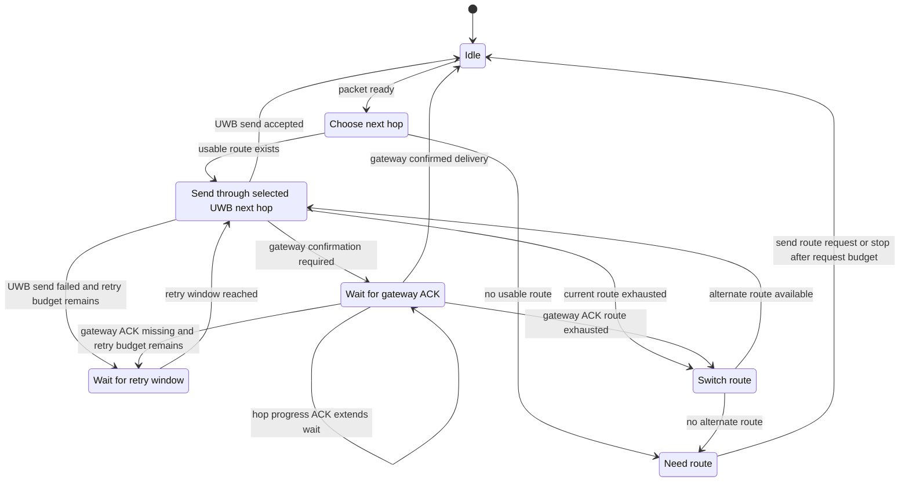
```mermaid
stateDiagram-v2
    state "Idle" as Idle
    state "Choose next hop" as Choose
    state "Send through selected UWB next hop" as Send
    state "Wait for gateway ACK" as GatewayAck
    state "Wait for retry window" as RetryWait
    state "Switch route" as Switch
    state "Need route" as NeedRoute

    [*] --> Idle
    Idle --> Choose: packet ready
    Choose --> Send: usable route exists
    Choose --> NeedRoute: no usable route
    Send --> GatewayAck: gateway confirmation required
    Send --> Idle: UWB send accepted
    Send --> RetryWait: UWB send failed and retry budget remains
    RetryWait --> Send: retry window reached
    Send --> Switch: current route exhausted
    Switch --> Send: alternate route available
    Switch --> NeedRoute: no alternate route
    GatewayAck --> Idle: gateway confirmed delivery
    GatewayAck --> GatewayAck: hop progress ACK extends wait
    GatewayAck --> RetryWait: gateway ACK missing and retry budget remains
    GatewayAck --> Switch: gateway ACK route exhausted
    NeedRoute --> Idle: send route request or stop after request budget
```

Gateway ACK timeout is a 2 s base window. Matching hop progress ACKs reset that same continuous delivery wait; they do not complete delivery. Missing gateway ACKs move through a randomized retry window before retransmission. Route rediscovery sends at most five requests per target with exponential backoff plus jitter. Duplicate state lasts 60 s.

### Anchor Upstream Retry

```mermaid
%%{init: {"flowchart": {"nodeSpacing": 24, "rankSpacing": 34, "padding": 6}, "themeVariables": {"fontSize": "12px"}} }%%
flowchart TD
    Start[Anchor has gateway-bound packet] --> Send[Send through selected UWB next hop]
    Send -->|UWB send accepted| NeedGateway{End-to-end gateway ACK required?}
    Send -->|UWB send failed| Requeue[Keep or requeue report and request route]
    NeedGateway -->|no| Success[Mark route healthy]
    NeedGateway -->|yes| GatewayWait[Wait for gateway confirmation]
    GatewayWait -->|confirmed| Success
    GatewayWait -->|timeout| GatewayFail[Record gateway delivery failure]
    GatewayFail --> GatewayRetry{Retry same path or switch path?}
    GatewayRetry -->|yes| Send
    GatewayRetry -->|no| Requeue
```

### Gateway Downlink Retry

```mermaid
%%{init: {"flowchart": {"nodeSpacing": 24, "rankSpacing": 34, "padding": 6}, "themeVariables": {"fontSize": "12px"}} }%%
flowchart TD
    Start[Gateway command ready] --> Route{Known route to target?}
    Route -->|yes| Send[Send through selected UWB next hop]
    Route -->|no| Discover[Send route request and keep command pending]
    Discover --> RouteReady{Route reply before 12 s timeout?}
    RouteReady -->|yes| Send
    RouteReady -->|no| Timeout[Emit command timeout over USB]
    Send -->|UWB send accepted| Result[Wait for target command result]
    Send -->|UWB send failed| Discover
    Result -->|result received| Done[Emit result over USB]
    Result -->|12 s timeout| Timeout
```

## Shared UWB Ranging Flow

These diagrams show the firmware flow for one UWB distance exchange. Frame names are used only as plain labels for the four radio messages; exact fields and validation rules are in [[UWB+BLE Protocols and Strategies 0.2.50]].

### Range Initiator

```mermaid
stateDiagram-v2
    state "Validate range request" as Validate
    state "Prepare radio" as Prepare
    state "Send poll" as Poll
    state "Wait for response" as Response
    state "Send final" as Final
    state "Wait for range report" as Report
    state "Send compact diagnostics" as Diag
    state "Range complete" as Complete
    state "Range failed" as Failed
    state "No response" as Timeout
    state "Received unusable frame" as BadRx
    state "Cannot start radio" as SetupFail
    state "Scheduled send missed" as MissedSend

    [*] --> Validate
    Validate --> Prepare: request usable
    Validate --> SetupFail: request invalid
    Prepare --> Poll: radio ready
    Prepare --> SetupFail: radio setup failed
    Poll --> Response: poll sent
    Response --> Final: response received
    Response --> Timeout: response timeout
    Response --> BadRx: response unusable
    Final --> Report: final sent
    Final --> MissedSend: scheduled send missed
    Report --> Diag: OK report received
    Diag --> Complete: diagnostic sent or skipped after TX failure
    Report --> Failed: failure report received
    Report --> BadRx: report missing or unusable
```

### Range Responder

```mermaid
stateDiagram-v2
    state "Prepare radio" as Prepare
    state "Enable receiver" as Listen
    state "Wait inside the same scheduled window" as WaitPoll
    state "Send response" as Response
    state "Wait for final" as WaitFinal
    state "Compute range" as Compute
    state "Send range report" as SendReport
    state "Listen for clicker diagnostics" as Diag
    state "No matching poll" as Timeout
    state "Ignore wrong poll" as Ignore
    state "Range complete" as Complete
    state "Received unusable frame" as BadRx
    state "Scheduled send missed" as MissedSend
    state "Could not send report" as ReportFail

    [*] --> Prepare
    Prepare --> Listen: radio ready
    Listen --> WaitPoll: receiver enabled
    WaitPoll --> Response: selected clicker poll received
    WaitPoll --> Timeout: window expires
    WaitPoll --> Ignore: poll for another device
    Ignore --> WaitPoll: continue same continuous window
    Response --> WaitFinal: response sent
    Response --> MissedSend: scheduled response missed
    WaitFinal --> Compute: matching final received
    WaitFinal --> SendReport: final received but unusable
    WaitFinal --> BadRx: final timeout or RX error
    Compute --> SendReport: distance calculated or failure status recorded
    SendReport --> Diag: OK report sent
    SendReport --> Complete: failure report sent
    Diag --> Complete: diagnostic received or timeout
    SendReport --> ReportFail: report could not be sent
```
