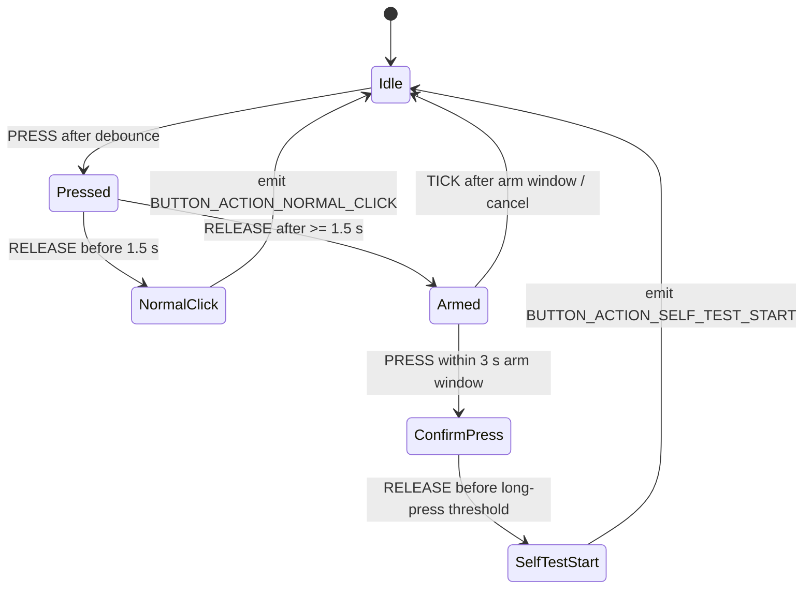
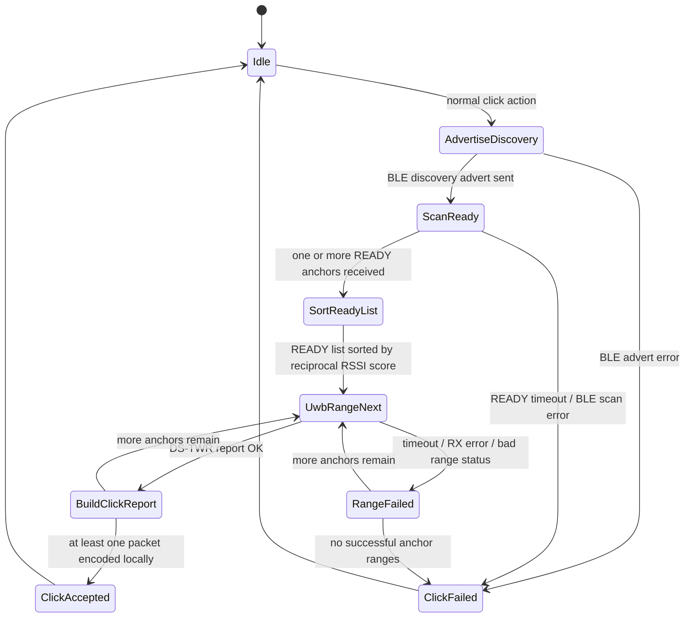
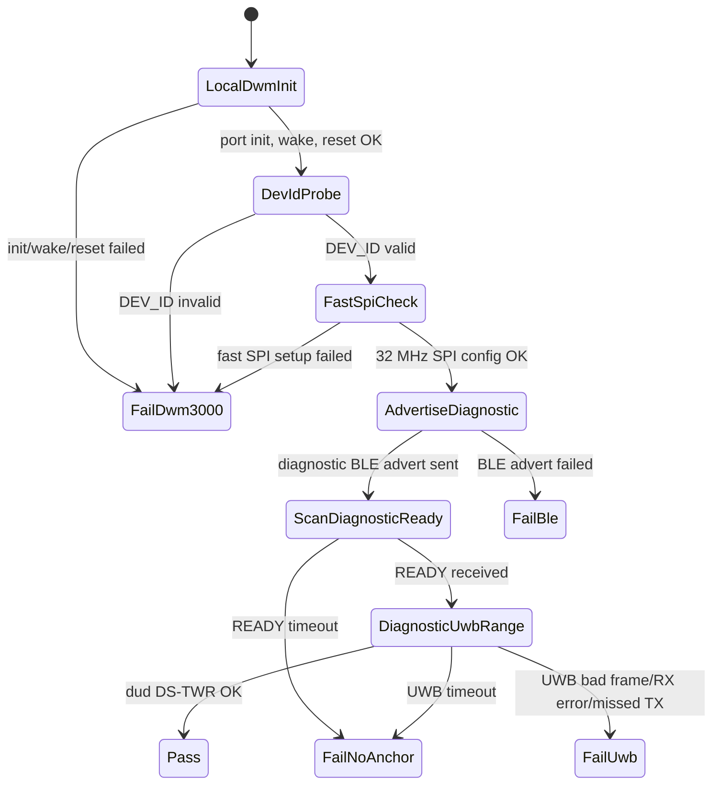
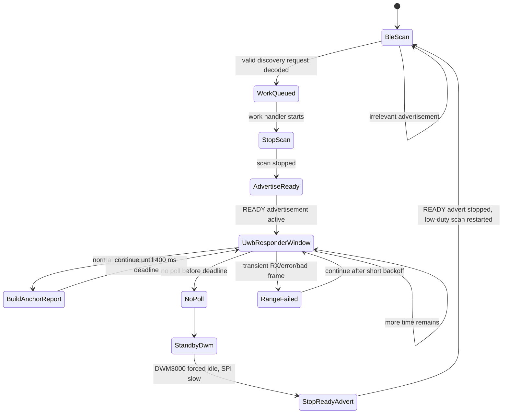
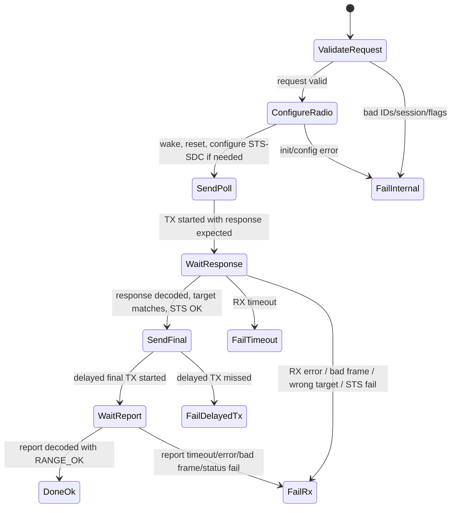
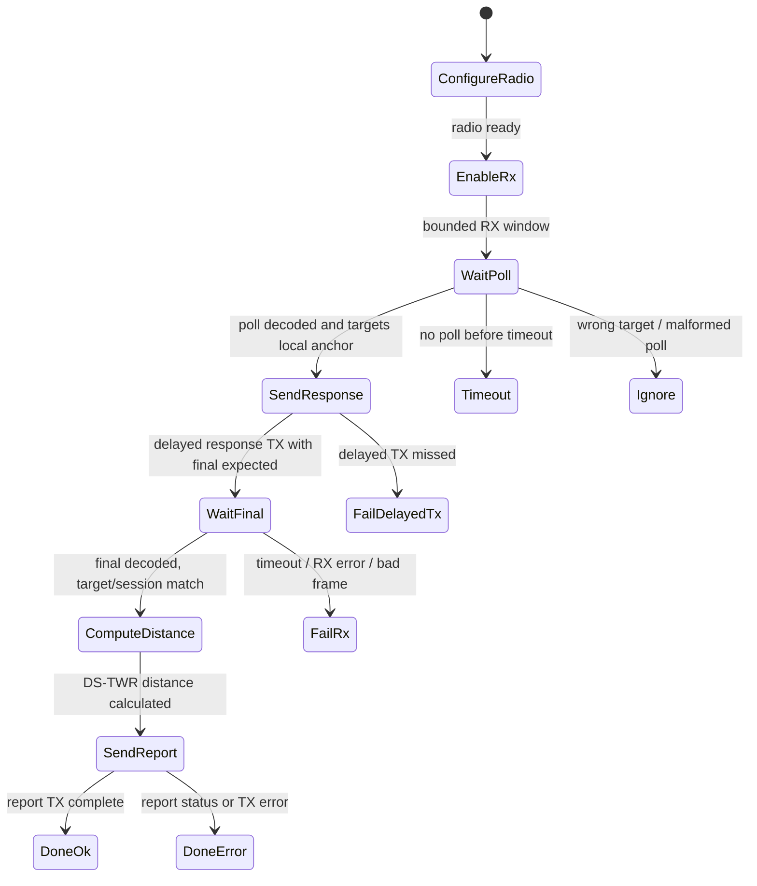
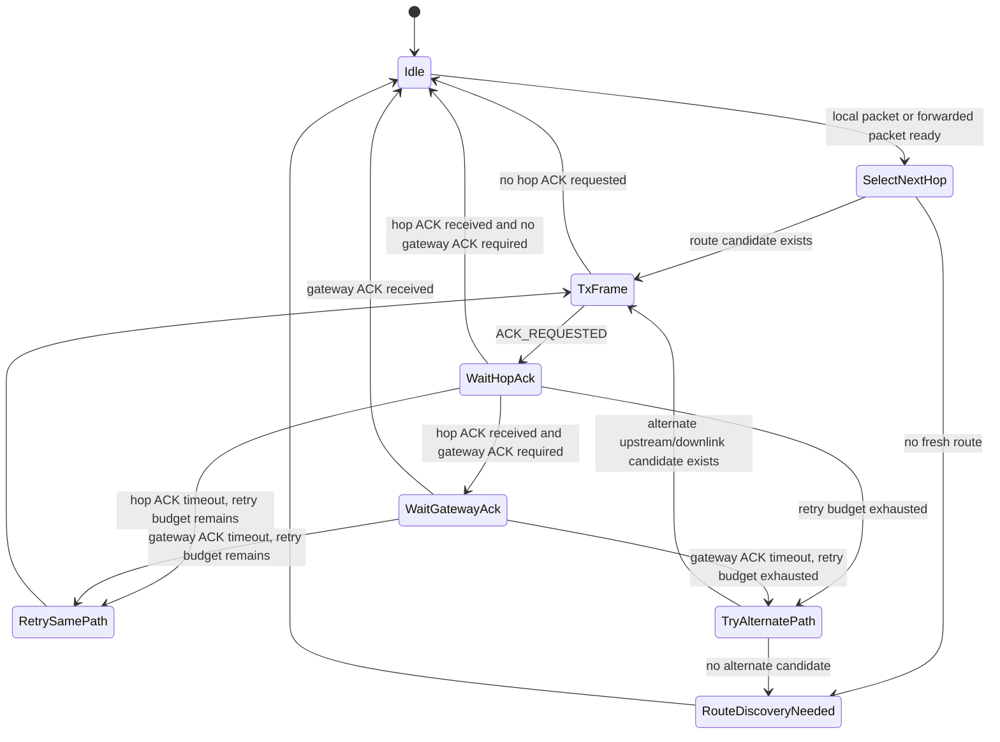
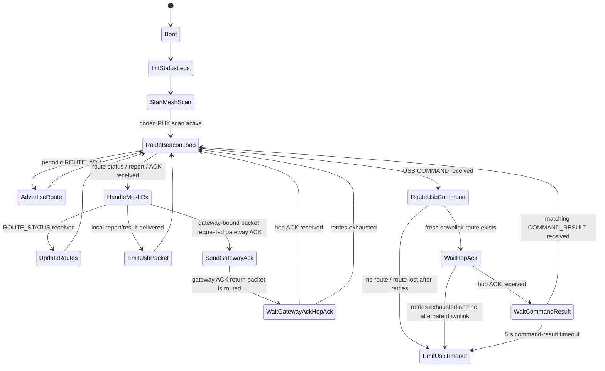

# Firmware State Machines and Status Report

This document records the runtime state machines represented by the current firmware MVP and summarizes completed and remaining work. Code references are in `firmware/app/src/main.c`, `firmware/app/src/dwm3000_driver.c`, and the shared modules under `firmware/src/`.

## Clicker Button FSM

Source: `button_fsm_handle()` in `firmware/src/status.c`.

## Clicker Normal Click MVP

Source: `run_normal_click()`.

The clicker collects up to 8 READY anchors, deduplicates by anchor ID, scores each candidate using the RSSI seen by the anchor plus the RSSI seen by the clicker, and ranges anchors sequentially in strongest-link order.

## Clicker Self-Test

Source: `run_self_test()`.

Diagnostic traffic sets `FLAG_DIAGNOSTIC` and never sets `FLAG_COUNT_AS_CLICK`.

## Anchor BLE-Gated UWB Window

Source: `anchor_start_ble_scan()`, `anchor_scan_cb()`, and `anchor_discovery_work_handler()`.

The anchor does not run an always-on UWB listener. It uses low-duty BLE scanning while idle, wakes UWB only after BLE discovery, keeps the responder window open for 400 ms, then returns DWM3000 to standby.

## DWM3000 Initiator DS-TWR

Source: `dwm3000_driver_range_initiator()`.

All waits poll `SYS_STATUS` over SPI because the DWM3000 IRQ pin is not connected.

## DWM3000 Responder DS-TWR

Source: `dwm3000_driver_responder_poll_once()`.

## BLE Mesh Relay FSM

Source: `mesh_relay_start_tx()`, `mesh_relay_handle_rx()`, and `mesh_relay_tick()` in `firmware/src/mesh_relay.c`.

Route candidates expire after 7 s without a fresh advertisement, route status, or successful ACK refresh. Duplicate suppression entries expire after 60 s. A hop ACK is a custody ACK: relays send it only after they can accept local handling or track the forward. Coded advertisements use a 30-60 ms interval, mesh advertisements last 120 ms, hop ACK replies wait 130 ms to avoid half-duplex collisions, and hop ACK timeout is 500 ms. Gateway-originated commands that exhaust all downlink candidates emit a local USB `COMMAND_TIMEOUT` result.

## Gateway Mesh Runtime

Source: `gateway_start_mesh_scan()`, `gateway_route_adv_work_handler()`, `gateway_handle_serial_frame()`, and `mesh_rx_work_handler()` in `firmware/app/src/main.c`.

The gateway is the active mesh root: it advertises the route epoch, learns downlinks from `ROUTE_STATUS`, routes USB commands through selected next hops, emits delivered mesh packets over USB COBS, and returns structured timeout results for failed gateway-originated commands. v1 tracks one outstanding command-result wait at a time.

## Completed Work

- Created the new `firmware/` implementation separate from `old code/`.
- Implemented native protocol primitives: packet envelope, CRC, COBS, TLV helpers, message types, flags, range statuses, command IDs, and roles.
- Implemented BLE discovery request and READY payload encode/decode.
- Implemented UWB frame encode/decode for POLL, RESPONSE, FINAL, and REPORT.
- Implemented click/self-test report builders.
- Implemented status LED pattern selection and button/self-test gesture FSM.
- Implemented route candidate helpers, mesh hop ACK packet builders, gateway ACK packet builders, and survey command/result structures.
- Implemented BLE mesh relay runtime with local next-hop addressing, custody hop ACKs, hop-ACKed gateway ACK return packets, retry/backoff, upstream route fallback, downlink alternate fallback, route freshness expiry, duplicate cache expiry, and route status/advertisement handling.
- Tuned BLE mesh timing for low-duty anchor scans: 30-60 ms coded advertisement interval, 120 ms mesh advertisements, 130 ms ACK turn-around delay, and 500 ms hop ACK timeout.
- Added Zephyr app skeleton with role selection for clicker, anchor, and gateway.
- Configured all firmware BLE traffic for LE Coded PHY/S=8 intent, coded-only scanning, extended advertising, and +8 dBm nRF52 TX power.
- Added ANNA-B402/DWM3000 devicetree overlay, DWM3000 binding, and 32 MHz SPIM3 runtime SPI configuration.
- Implemented DWM3000 Zephyr port layer for SPI, reset, wake, DEV_ID read/validation, and SDK-compatible SPI/sleep/tick/reset hooks.
- Integrated Qorvo DWM3000 decadriver source into the firmware build.
- Implemented SPI-polled DWM3000 STS-SDC DS-TWR initiator/responder runtime using bounded `SYS_STATUS` polling.
- Implemented BLE-gated anchor UWB wake: anchors low-duty scan BLE, advertise READY after valid discovery, keep a bounded multi-poll UWB responder window open, then return DWM3000 to standby.
- Implemented multi-anchor MVP click flow: clicker advertises discovery, collects up to 8 READY anchors, RSSI-sorts them, ranges them sequentially, and builds one click report per successful anchor range.
- Implemented clicker self-test flow with local DWM3000 check, diagnostic BLE, READY scan, and diagnostic dud UWB range.
- Routed serial console/logging to USB CDC ACM for prototype debug over the USB-C port.
- Implemented gateway USB COBS input/output for command packets and delivered mesh packets.
- Implemented gateway route beaconing and command routing through the BLE mesh.
- Implemented gateway ACK generation for received gateway-bound packets, including hop ACK tracking on the return path.
- Implemented gateway command-result timeout tracking for one outstanding gateway-originated command.
- Added selected-route telemetry to anchor `CMD_GET_STATUS` command results for mesh debug over USB.
- Tightened duplicate retry handling so relays only hop-ACK duplicates when they can re-forward or safely finish the packet locally.
- Added repository contributor guide in `AGENTS.md`.

## Verified

- Native tests pass: `ctest --test-dir firmware/build --output-on-failure` reports 12/12 passing.
- Zephyr builds pass for:
 - `FIRMWARE_ROLE=clicker`
 - `FIRMWARE_ROLE=anchor`
 - `FIRMWARE_ROLE=gateway`
- Current Zephyr builds were verified with `west build --no-sysbuild` and the uv-managed west Python interpreter.
- Remaining build warnings are Zephyr's default USB VID warning and the existing global `__ASSERT()` warning.

## Remaining Work

### Hardware Validation

- Smoke test DWM3000 reset, wake, DEV_ID, 2 MHz init SPI, and 32 MHz runtime SPI on the actual PCB.
- Validate the SPI-polled DS-TWR timing on real clicker/anchor hardware.
- Calibrate antenna delays and tune response/final/report timing constants.
- Confirm BLE advertising/scanning timing works reliably when READY and UWB windows overlap.

### Clicker

- Produce explicit partial-failure packets when some anchors time out or return bad range status.
- Add real low-power transitions after click/self-test.
- Integrate battery/charger measurement into self-test and status reporting.

### Anchor

- Add periodic heartbeat/status reports when requested by the gateway.

### Gateway

- Expand command handlers beyond ping/status as hardware needs mature.

### Anchor Survey

- Implement live reachability command handling.
- Implement gateway scheduling for unordered anchor pairs.
- Implement exactly `n` anchor-to-anchor measurements per scheduled pair.
- Report survey pair results through the mesh/gateway path.

### Protocol/Runtime Hardening

- Add more detailed error telemetry for RX timeout, RX error, STS quality failure, wrong target, and missed delayed TX.
- Decide persistent storage format for route/config state.
- Add integration tests or hardware-in-loop scripts once boards are available.
