## 1. Design reasoning
This document is more of a proposal than gospel. Treat it as a possible way to implement stuff at a high level.

The firmware contains several operations that last over time. A packet may wait for a route, a connection may wait for its next radio window, an accepted click may temporarily take over channel 5, and the gateway BLE link may be blocked while UWB traffic continues.

Putting all of this in one device-wide state machine would create many combined states. Using only flags and callbacks would avoid that large diagram, but retry, timeout, and cleanup rules would become spread across the code.

A useful middle ground is to give each long-lived operation a small state machine. Plain functions remain better for calculations and one-step work. A component probably needs state when it:

- waits for something that will arrive later;
- can be interrupted, retried, or timed out;
- owns data that must survive those interruptions.

This leads to the following starting structure:

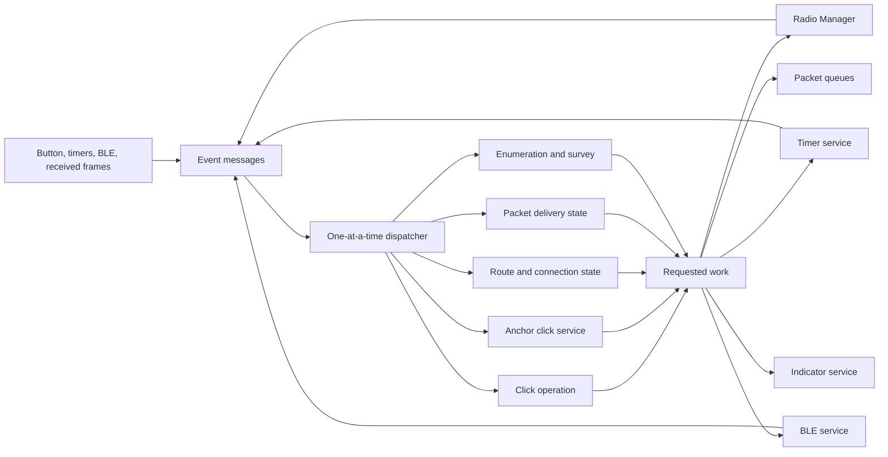

Most boundaries in this diagram are soft. Two components may share one source file, and a simple component may use a flat enum instead of a hierarchical state machine.

Two boundaries should remain strict:

1. The Radio Manager owns the DWM3000 because channel 5 and channel 9 use one physical radio.
2. One logical packet has one custody owner because ACK handling must never leave both nodes believing the other owns it.

## 2. Events, states, and effects

An **event message** is a small record saying that something has happened. It is input to a state machine.

Examples are `BUTTON_RELEASED`, `TIMER_EXPIRED`, `RADIO_RX_COMPLETE`, `WAKE_CLAIM_RECEIVED`, and `GATEWAY_ACK_RECEIVED`.

| Term | Meaning | Example |
|---|---|---|
| State | What an operation is currently doing or waiting for | `WAIT_DISCOVERY` |
| Event message | A fact that has just arrived | `DISCOVERY_TIMEOUT` |
| Transition | The response to an event in the current state | Move to `RETRY_WAIT` |
| Effect request | Work outside the state machine | Start a timer or submit a radio job |

A complete transition can be written as:

```text
WAIT_DISCOVERY + DISCOVERY_TIMEOUT
    -> RETRY_WAIT
    -> request START_RETRY_TIMER
```

A typical event contains:

```text
type, source, timestamp, operation_id, generation, payload
```

The generation changes when an operation is restarted. A late timer or radio result from an older generation can then be ignored.

Callbacks and interrupt handlers should only create event messages. The dispatcher handles one event at a time. A state machine updates its own context, changes state, and requests work. The service that performs that work later returns a result event.

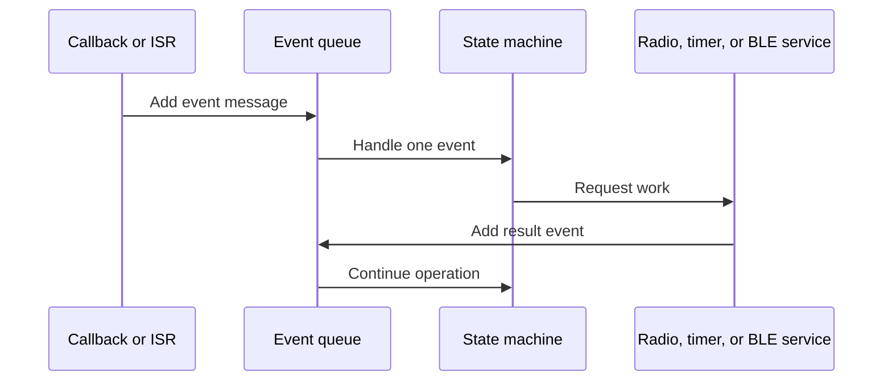

Hierarchy is only useful when several child states share behavior. For example, all states inside `CLICK_ACTIVE` can share the 15-second deadline, cancellation handling, radio-failure handling, and cleanup. A flat state machine is simpler when no such shared behavior exists.

## 3. Radio Manager

The DWM3000 can run only one job at a time and must retune between channels. A single Radio Manager makes this hardware limit visible to every protocol without forcing protocol code into the driver.

A radio request contains the owner, operation ID, channel, RX or TX mode, earliest start, deadline, maximum duration, and priority class.

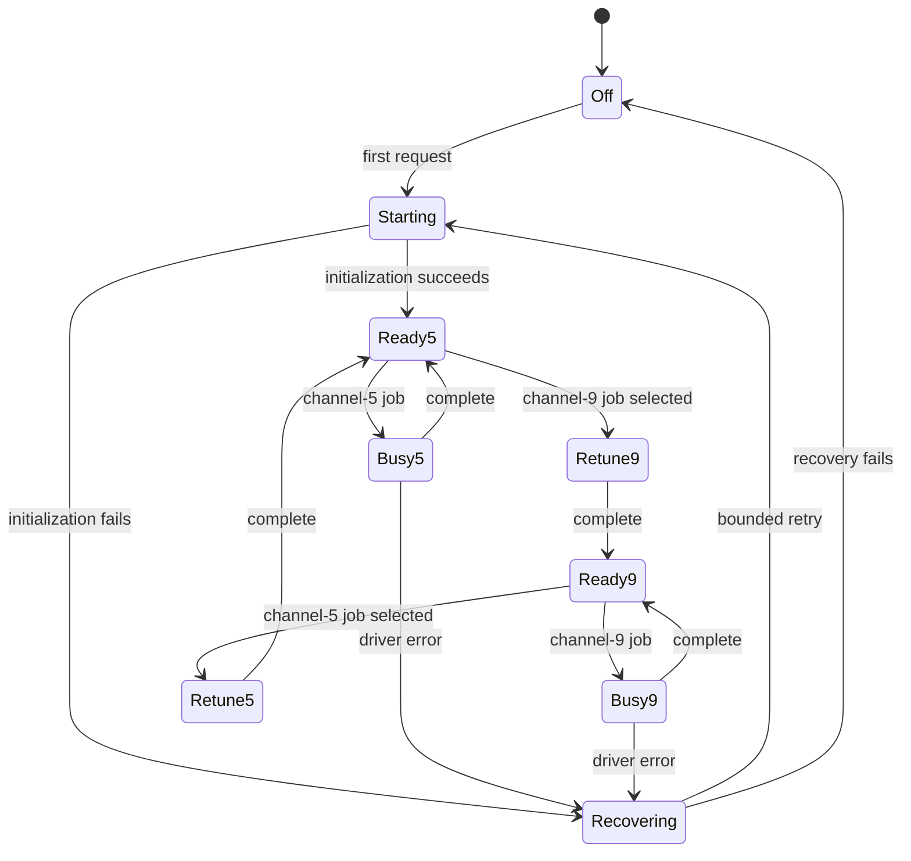

Suggested scheduling policy:

| Work | Behavior |
|---|---|
| Accepted click or gateway control on channel 5 | May cancel lower-priority channel-9 work. |
| Rejected or invalid wake claim | Changes nothing. Validation happens before pre-emption. |
| Route-request wake | Uses a permitted channel-5 window without destroying an active rhythm. |
| Channel-9 receive turn | Keep when possible because it checks peer liveness. |
| Channel-9 transmit turn | May be clipped, skipped, or retried for required channel-5 work. |
| Gateway BLE work | Remains queued while UWB has priority. |

The manager reports completion, timeout, cancellation, or failure to the request owner. It does not decide whether the protocol operation succeeded.

## 4. Clicker state

Button timing and UWB ranging are separate concerns. Keeping the gesture state separate avoids mixing debounce and long-press logic into the ranging protocol. They may still live in the same clicker module.

### 4.1 Button gesture

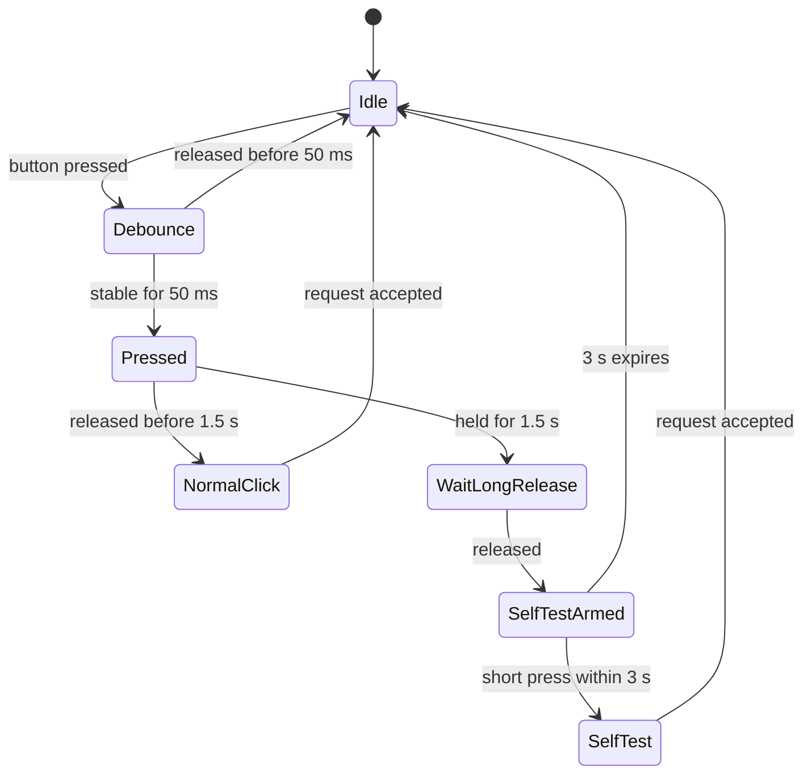

### 4.2 Normal click

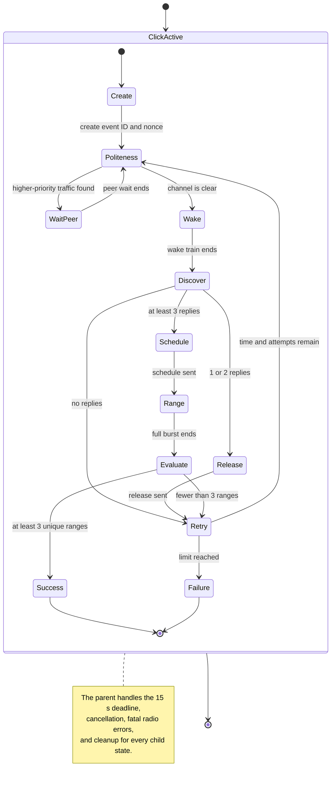
## 6. Mesh route, connection, and packet delivery

These states answer different questions:

- **Route:** Which parent should carry traffic?
- **Connection:** When can this anchor and that parent use channel 9 together?
- **Delivery:** Who owns this exact packet, and has its transfer finished?

They are worth keeping conceptually separate because one can fail while the others remain useful. For example, an accepted click may remove connection timing while the route remains valid and the packet remains owned.

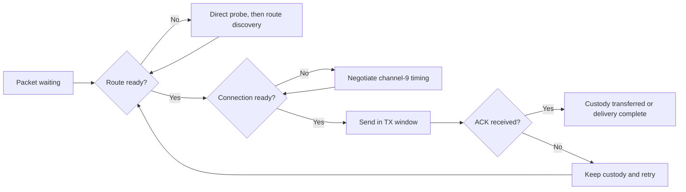

### 6.2 Connection state

Each anchor may have one upstream and one downstream instance. Each instance owns its own phase and event counter.

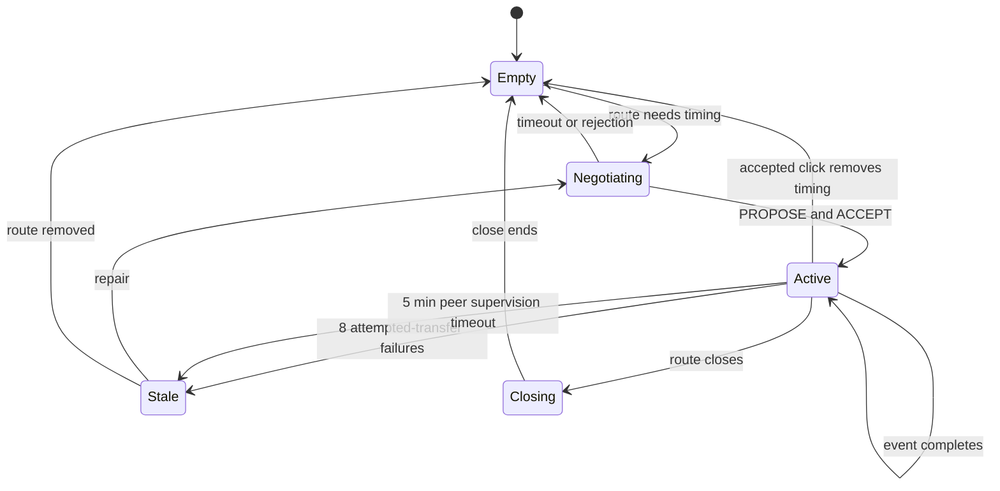

The successful `PROPOSE` defines the phase. Direction reverses after each event of that connection. Upstream and downstream counters advance independently. Empty transmit turns may be skipped, while receive turns remain useful liveness checks.

### 6.3 Delivery state

Each logical packet receives a small delivery record.

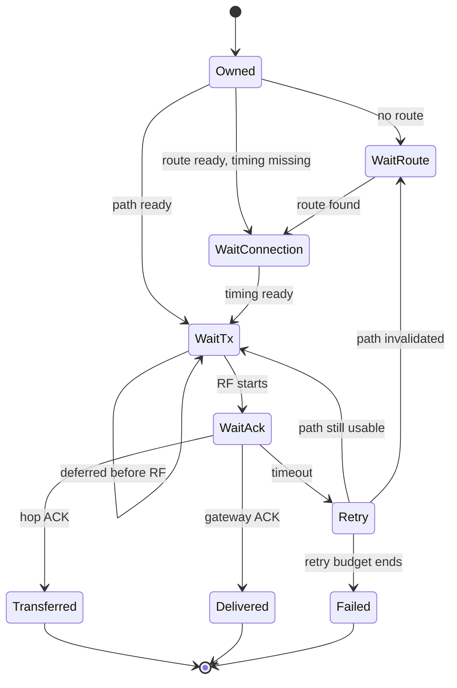

A relay may ACK only after it has accepted custody:

```text
validate -> deduplicate -> reserve storage -> copy packet -> ACK
```

Pre-RF delay consumes no attempt. RF start does. Missing entries from a gateway batch ACK remain owned. After the fourth gateway-ACK failure, the selected parent is invalidated and held down for 60 seconds.

## 7. Gateway and host link

Gateway UWB and BLE have independent flow control. UWB packets may arrive while BLE notifications are blocked, and BLE commands may arrive while the radio is busy. Keeping their state separate prevents one interface from blocking the other, although both may remain in one gateway module.

The UWB root can use the simple flow `LISTEN_9 -> RECEIVE_BATCH -> ACCEPT_BATCH -> SEND_ACK -> LISTEN_9`. It does not use the normal anchor-to-anchor cadence. Accepted packets enter a bounded gateway-to-host queue.

The visible host sequence remains:

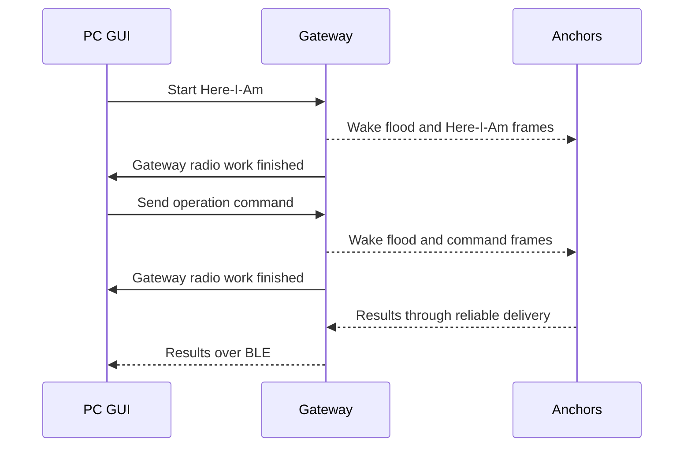


## 8. Enumeration and survey

### 8.1 Enumeration

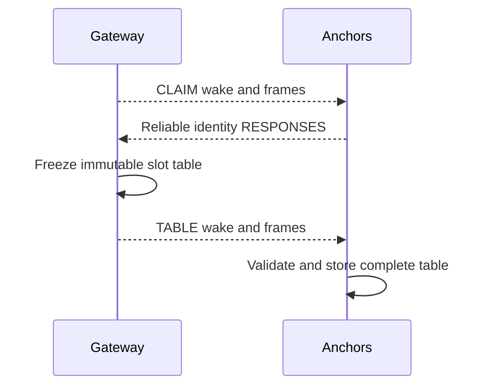

Each response stays under normal packet custody until gateway ACK. An anchor replaces its stored table only after validating the complete new table. Repeated CLAIM and TABLE frames should be harmless.

### 8.2 Survey coordinator

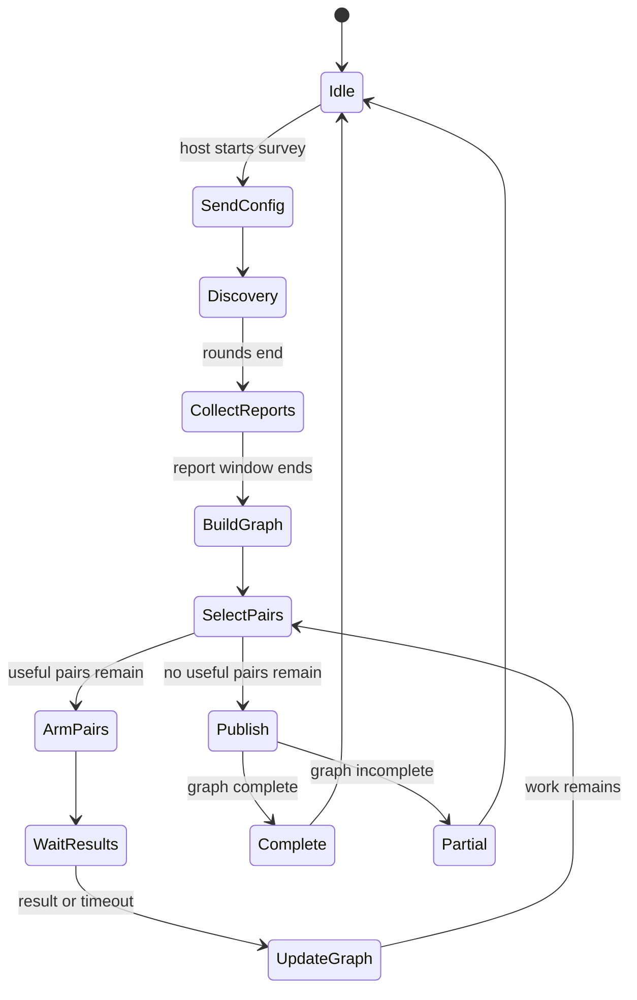

Pair selection can remain a normal function that receives the partial graph and pending jobs. It may choose pairs in parallel only when their endpoints and known neighbour sets do not overlap.

The gateway's durable survey generation is also the explicit restart-repair boundary. When an anchor accepts a strictly newer generation, it aborts the older producer, abandons any exact older discovery or pair-result communication handles, and only then releases their RAM custody. The gateway retains the discovery START delivery and redrives that same generation at 10, 20, 30, and 40 seconds before the shared 90-second execution instant, so an anchor that spent an earlier wave draining obsolete custody still gets another bounded admission opportunity. Same-generation redrives remain idempotent, lower generations remain stale, and this cancellation never masquerades as a gateway acknowledgement.

Pair arming follows the fixed order:

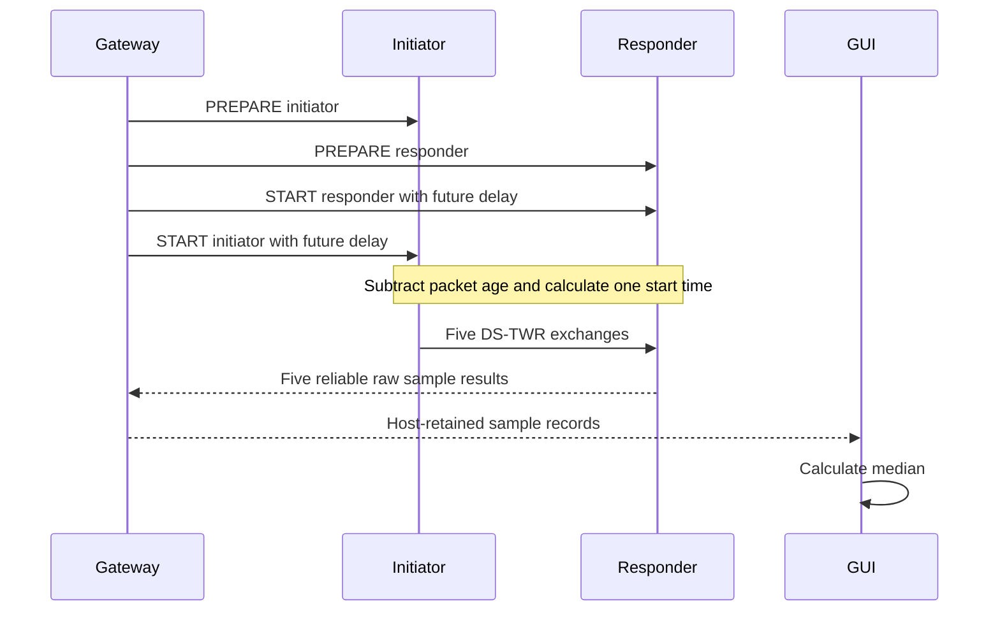

The anchor-side pair flow can remain `IDLE -> PREPARED -> ARMED -> WAIT_START -> RANGE -> COMPLETE/RESULT_OWNED`. A late command returns `MISSED_DEADLINE` instead of starting immediately. A failed pair repeats the complete PREPARE and START sequence, with at most two reruns. An incomplete graph is published as partial.

## 9. Implementation and verification

No state-machine framework is required. A plain enum, context struct, and handler are enough.

The handler should return quickly. It should not sleep, poll hardware, allocate dynamic memory, or directly edit another component's context.

Useful invariants for native and integration tests are:

- only one DWM3000 job is active;
- channel 5 and channel 9 are never active together;
- a rejected claim changes no mesh state;
- a stale event cannot affect a newer generation;
- a click attempt is counted only when RF starts;
- a relay never ACKs a packet it could not store;
- one packet has one custody owner;
- a partial survey is never reported as complete.

A small transition trace helps hardware debugging:

```text
timestamp, machine, instance, old_state, event, new_state, reason
```

## Conclusion

The recommended starting point is this set of small cooperating state machines. Merge a boundary when two states always change together. Split one when independent timing, retry, or ownership makes the combined code harder to reason about. Keep the Radio Manager and packet custody boundaries strict because the hardware and reliability rules depend on them.
