# Mesh Coordinator Refactor Proposal And First Implementation

Date: 2026-07-06

This document describes the cleaner firmware structure for click handling, mesh
routing, channel-9 delivery, and debugging. It is both a refactor target and a
review note for the first implementation pass now present in the firmware.

The proposal folds the existing clicker state-machine style from
`Firmware State Machines 0.2.3` into the mesh refactor. The main idea is that
one radio coordinator owns timing and priority decisions. Role-specific work
asks the coordinator for radio time; it does not independently start competing
radio flows.

## Goals

- Make radio timing procedural and reviewable.
- Keep click handling ahead of mesh work.
- Make route discovery, channel-9 delivery, and acknowledgements one visible
  flow from first request to final confirmation.
- Make debugging easier by logging state transitions instead of scattered
  partial breadcrumbs.
- Keep BLE enabled only on the gateway for the current firmware.
- Keep diagrams high level so they remain useful after implementation details
  change.

## Current Constraints

- All coordinator states restart from idle after reset.
- Paused mesh delivery state is RAM-only for now.
- A paused mesh delivery remains valid until reset, replacement, or RAM limits
  force it out. It does not expire merely because a click took time.
- Newer mesh packets override older paused packets when bounded RAM cannot hold
  both.
- Every overridden paused packet increments an internal lost-packet count.
- The next locally originated mesh delivery packet appends a lost-packet-count
  TLV when that count is nonzero. The count clears only after a packet carrying
  that TLV is transmitted.
- BLE is enabled only on the gateway. Non-gateway roles use LEDs and local debug
  transport, not BLE.

## Implemented First Pass

The first implementation pass adds a small reviewable coordinator policy module
instead of rewriting all radio workers at once.

- `app_mesh_coordinator` holds the high-level priority decision helper and the
  RAM-only paused-delivery loss counter.
- `app_mesh_report` now uses that helper when a route-waiting packet is stored,
  replaced, dropped, queued, or sent.
- If the anchor report queue is full, the oldest queued report is replaced by
  the newest report and the lost-packet count is incremented.
- Locally originated delivery packets can carry `TLV_MESH_LOST_PACKET_COUNT`.
  Forwarded packets and route/control packets are not mutated.
- The lost-packet count stays pending if the next packet has no room for the
  TLV, and is retried on a later local delivery packet.
- `app_mesh_coordinator` has native tests covering click priority, mesh-TX
  ownership, replacement counting, TLV update, and no-space behavior.

## Radio Coordinator Overview

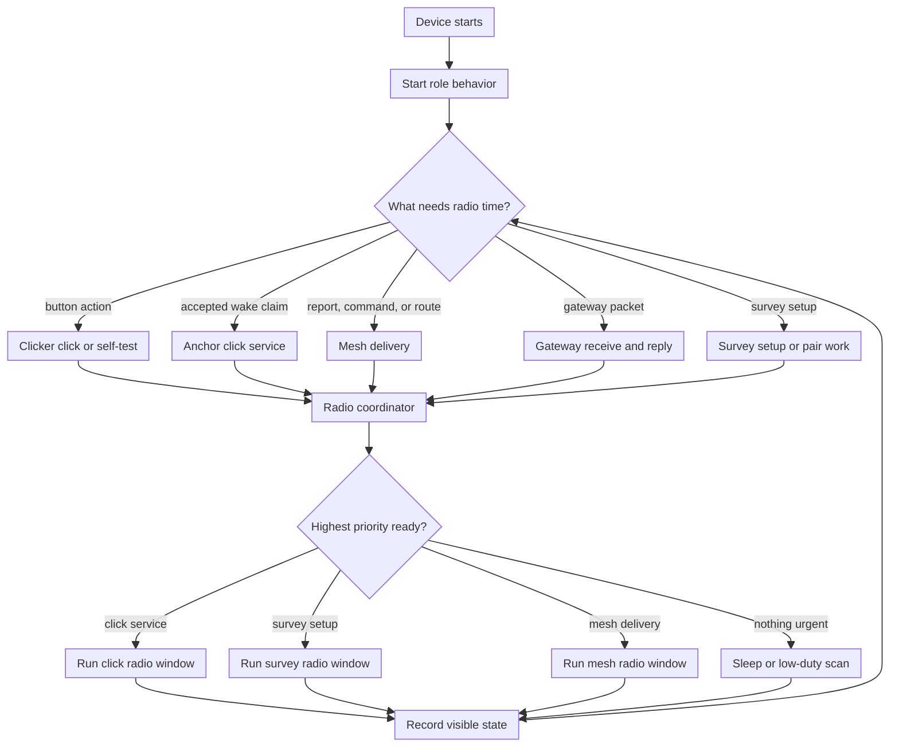

The coordinator is the only place that decides whether mesh work may run now.
When a click is active, mesh work is paused or deferred through the coordinator.
This replaces scattered checks spread through unrelated paths.

## Priority Model

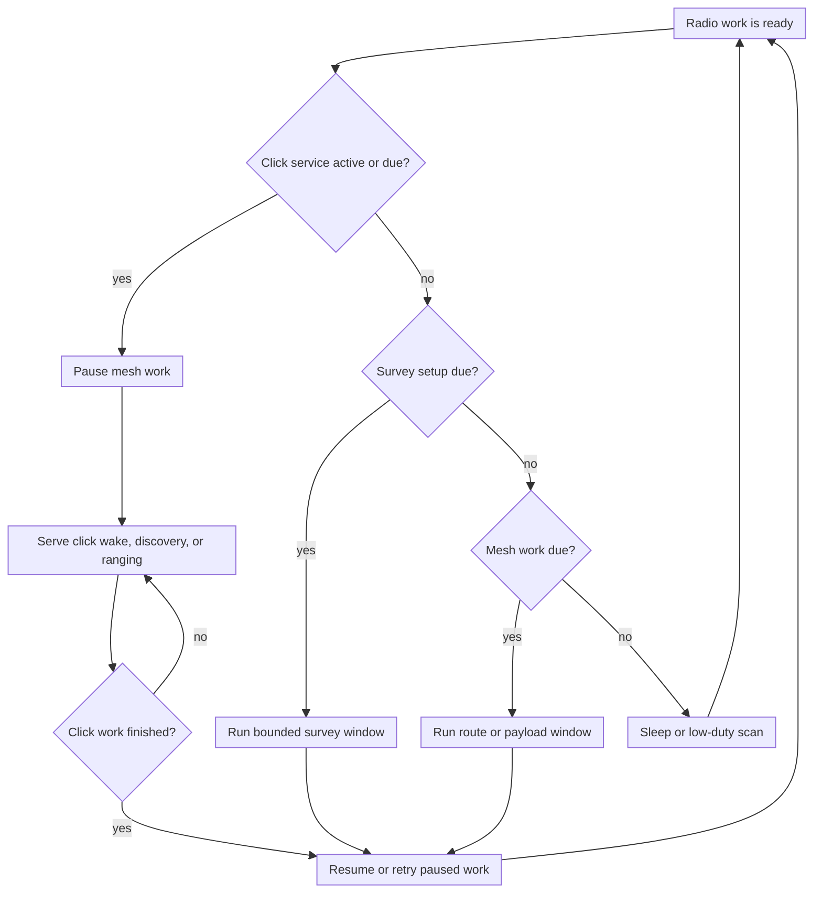

Click work includes a selected clicker wake epoch, discovery replies, scheduled
ranging, and the clicker's own normal click or self-test path. Mesh work can be
paused before it starts. If a click begins while mesh is waiting for a future
slot, the coordinator records the paused mesh state and decides after the click
whether the original deadline is still valid.

## Clicker Flow Folded Into The Coordinator

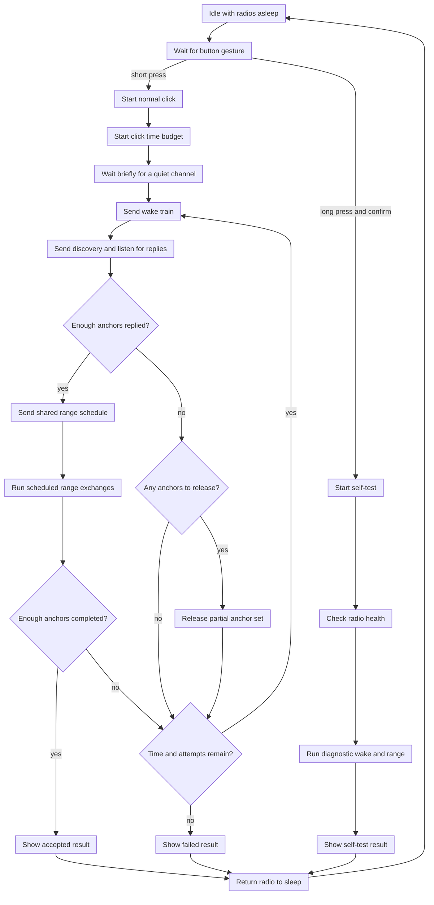

The clicker flow remains mostly the same as the existing documented flow. The
change is ownership: the normal click and self-test paths ask the coordinator
for radio windows. If a click is active, mesh work is not allowed to start a
competing radio window.

## Anchor Click Service Folded Into The Coordinator

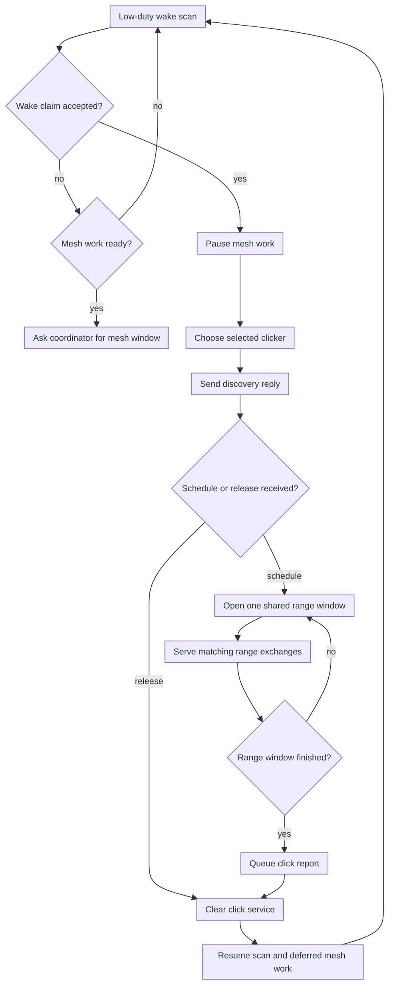

An accepted click wake claim pauses mesh work through one common path. Reports
created by click handling enter the mesh delivery flow after the click service
is complete.

## Mesh Delivery Flow

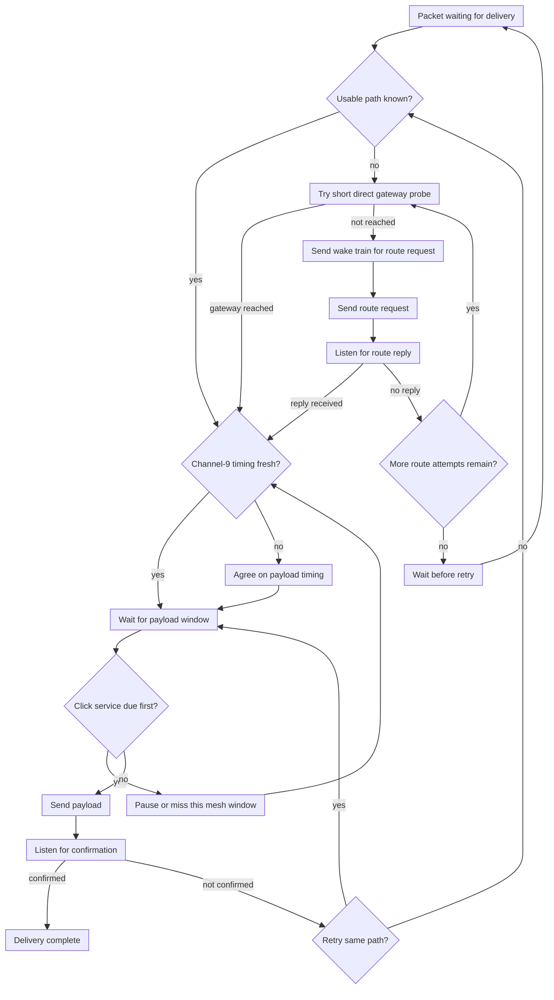

Route discovery and payload delivery are one visible delivery flow. The route
request tells the receiver when the sender will listen for the reply. The reply
window is planned from the same timeline as the wake train and request flood,
not from whichever worker happened to run last.

## Relay Flow

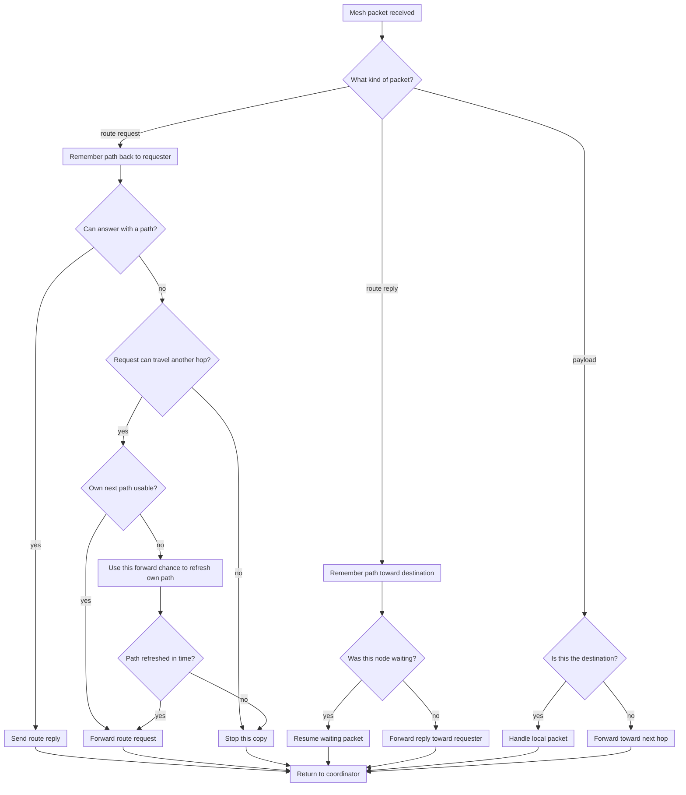

A relay can answer a route request when it is the destination or when it
already knows a usable path to the destination. If it cannot answer, it only
tries to refresh its own missing path when the received request still has
enough remaining reach to be forwarded. A narrow request that cannot travel
past this relay does not start a separate repair attempt.

## Flooded Packet Flow

Some mesh packets are not aimed at one next hop. They are bounded broadcasts:
the sender wakes nearby nodes, sends the packet, and each relay may repeat it
once if the packet is new and still has remaining reach. Flooding is used for
setup work such as gateway announcements, route requests, gateway command
broadcasts, collection coordination, and survey discovery starts.

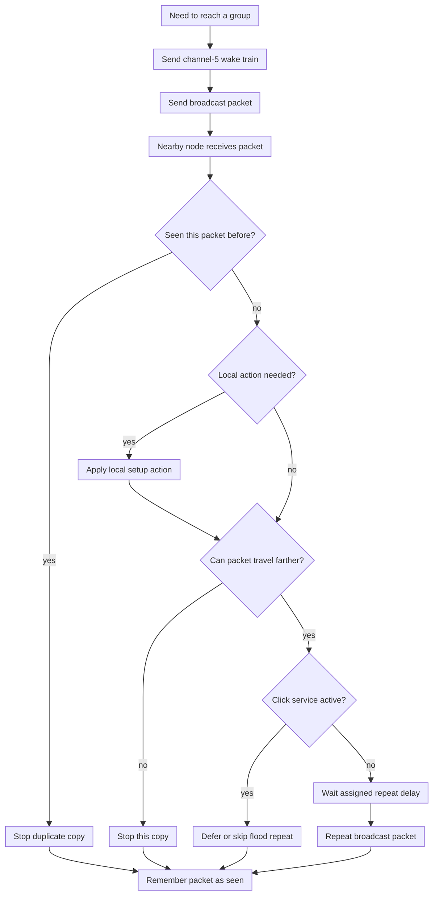

The coordinator should treat a flood as a transaction with a bounded lifetime.
Every receiver remembers enough identity to suppress duplicates. Repeat timing
should be deterministic or hash-spread so relays do not all rebroadcast at the
same instant. Click service still wins: a node may skip or defer a flood repeat
when an accepted click wake, discovery reply, or scheduled range window is due.

### Flooded Anchor Survey Start

Anchor survey setup is a good example because only the setup message is
flooded. The later UWB discovery slots and gateway reports are scheduled work,
not an uncontrolled report flood.

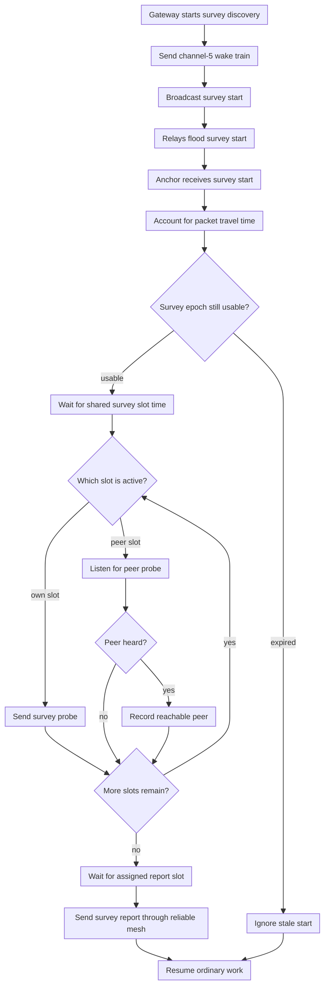

The survey start carries enough timing information for relays and anchors to
join the same survey epoch even if they receive the flood at different times.
After that, each anchor derives when to probe and when to report from the
shared survey parameters. This prevents two failure modes: anchors all probing
at once, and anchors all reporting back to the gateway at once.

## Gateway Flow

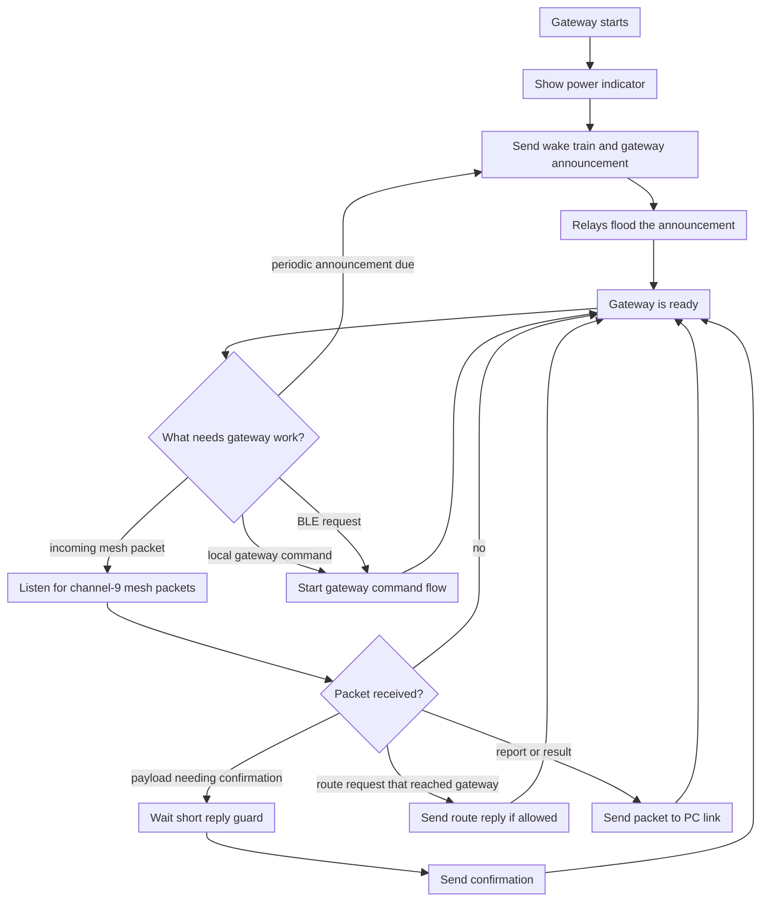

The gateway does not need ordinary click handling, but it is not only a passive
receiver. On reset it sends a channel-5 wake train followed by a broadcasted
"Here I Am" announcement that relays flood through the mesh. It can also start
commands itself, or start commands because a connected BLE client requested
them. In the mesh test protocol it can keep channel-9 receive continuous and
reply quickly after valid packets that require confirmation. Route-test
exceptions, such as a relay-required request that the gateway must ignore
unless it came through a relay, should be represented as explicit policy
decisions inside the coordinator.

### Gateway Command Flow

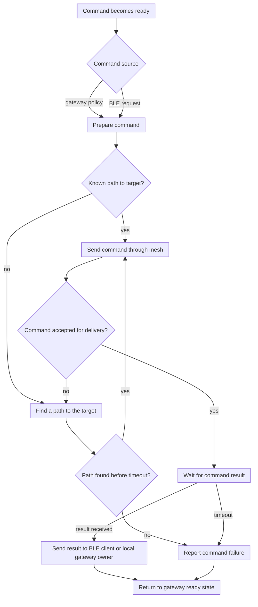

Gateway-originated commands and BLE-requested commands use the same command
flow after they are prepared. The difference is only where the command came
from and where the final result is reported.

## Coordinator State Diagram

```mermaid
stateDiagram-v2
    state "Idle or low-duty scan" as Idle
    state "Serving click work" as Click
    state "Serving survey work" as Survey
    state "Finding a path" as Route
    state "Waiting for mesh slot" as WaitMesh
    state "Sending mesh payload" as SendMesh
    state "Waiting for confirmation" as Ack
    state "Paused for click" as Paused
    state "Waiting before retry" as Backoff

    [*] --> Idle
    Idle --> Click: click work becomes due
    Idle --> Survey: survey work becomes due
    Idle --> Route: mesh packet needs a path
    Idle --> WaitMesh: mesh packet has a path

    Route --> WaitMesh: path found
    Route --> Backoff: request budget exhausted
    WaitMesh --> SendMesh: payload window opens
    SendMesh --> Ack: confirmation required
    SendMesh --> Idle: no confirmation needed
    Ack --> Idle: delivery confirmed
    Ack --> Backoff: confirmation missing
    Backoff --> Route: retry deadline reached

    WaitMesh --> Paused: click work becomes due
    Route --> Paused: click work becomes due
    SendMesh --> Paused: click work becomes due before send starts
    Paused --> Click: serve click work
    Click --> Idle: click work finished
    Click --> WaitMesh: paused mesh still stored
    Click --> Idle: no paused mesh stored
    Survey --> Idle: survey window finished

    Idle --> Idle: reset
    Click --> Idle: reset
    Survey --> Idle: reset
    Route --> Idle: reset
    WaitMesh --> Idle: reset
    SendMesh --> Idle: reset
    Ack --> Idle: reset
    Paused --> Idle: reset
    Backoff --> Idle: reset
```

This is intentionally a reader-facing state diagram. Implementation can split
radio send, radio receive, packet parsing, and logging into separate modules,
but those modules should not choose the next high-level state independently.
For now, no high-level coordinator state survives reset; reset always returns
the role to idle/startup behavior.

## Paused Mesh Delivery Policy

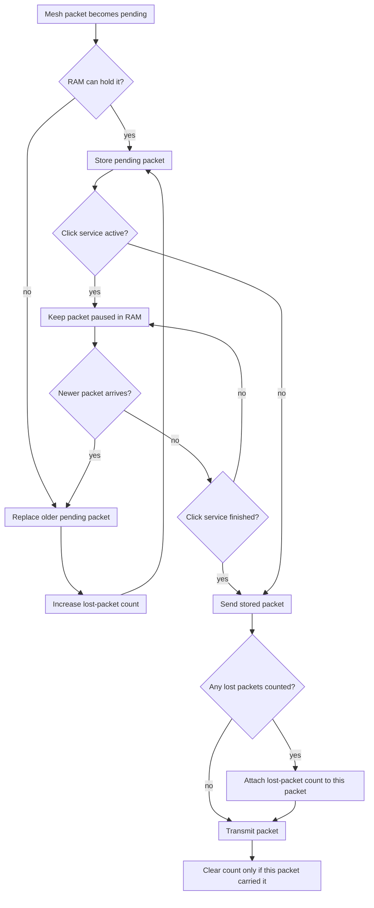

The paused packet store is a bounded RAM resource, not a durable queue. Newer
packets take precedence because they represent the freshest state. Lost older
packets are not silent: the next packet carries the accumulated count so the
gateway can see that data was overwritten while the node was busy.

## Debugging Structure

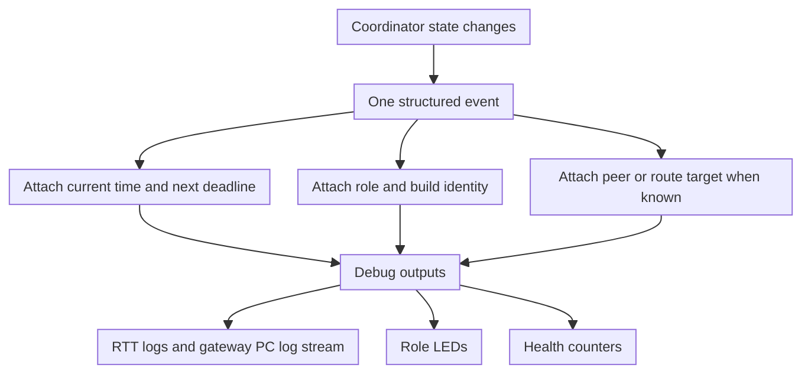

Every meaningful transition should produce one structured debug event:

- role and build preset
- current coordinator state
- next expected state
- peer or route target if relevant
- current time
- next deadline
- reason for pause, retry, or failure

This would make the logs answer "what was the firmware trying to do?" before
we inspect individual packet handling. BLE debug output is gateway-only in the
current design; anchors and transmitters should not enable BLE just for mesh
debugging.

## Build And Flash Safety

The coordinator refactor should also make image identity obvious:

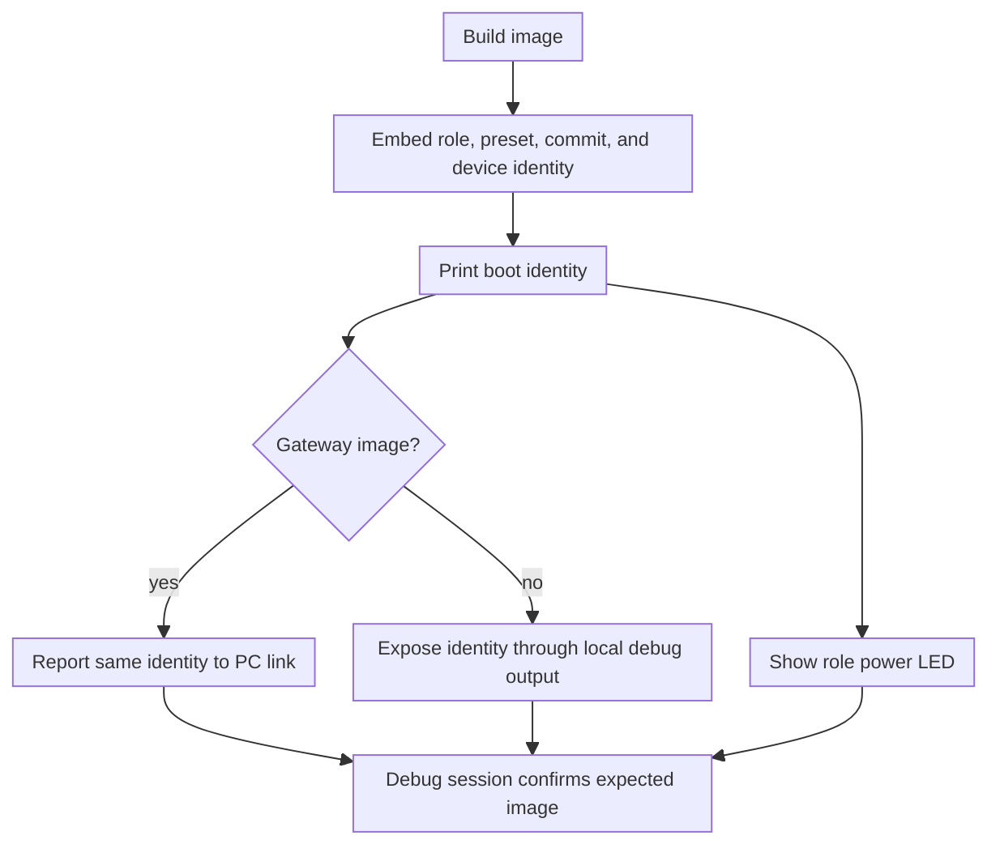

This is meant to prevent mistakes like flashing a normal gateway image when the
bench expects a mesh gateway image. The first boot log and PC-visible identity
should say the same role and preset that were flashed. For non-gateway roles,
the same identity should be visible through local debug output instead of BLE.

## Refactor Phases

1. Add boot identity and coordinator-style transition logging without changing
   behavior.
2. Extract the timing planner for click, route, and channel-9 windows. Test the
   worst-case paths before moving radio behavior.
3. Move route discovery into the coordinator while keeping packet formats
   unchanged.
4. Move channel-9 payload and confirmation handling into the coordinator.
5. Move click preemption into the coordinator and remove scattered mesh-pause
   checks.
6. Simplify old timers and radio workers after the coordinator owns all high
   level state transitions.

## Review Questions

- Should the gateway mesh-test continuous channel-9 receive mode be a gateway
  policy inside the same coordinator, or a separate gateway coordinator profile?
- Which LED colors should be reserved for power, click service, channel-5 mesh,
  channel-9 receive, channel-9 transmit, and failure?
- Which gateway debug events must be visible over BLE even when RTT probes are
  absent?
