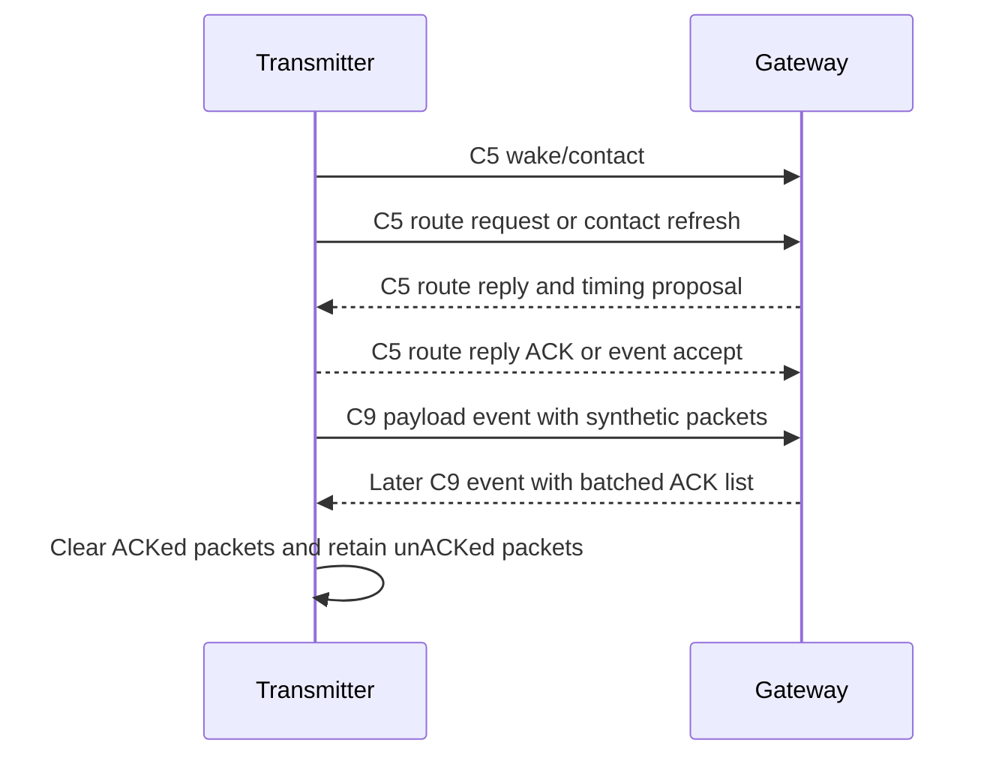
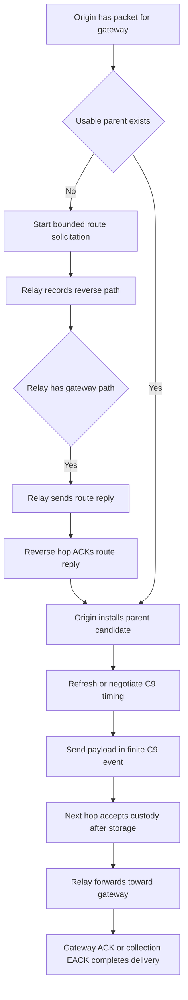
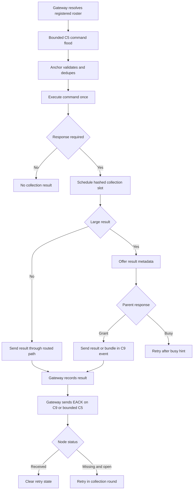
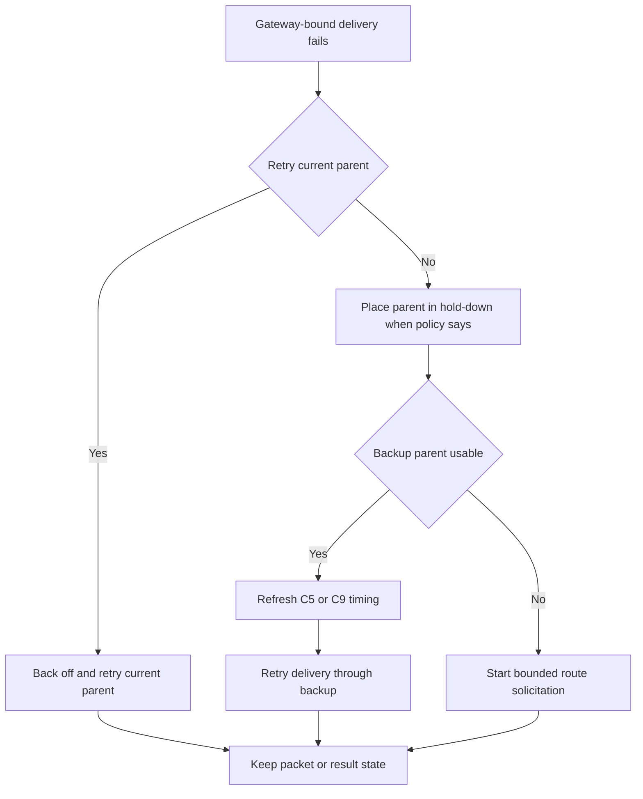
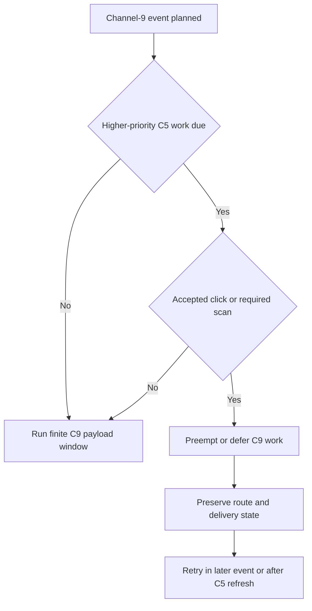

# Mesh Protocol Current Implementation

This document describes what the firmware tree implements right now. It is a
current-state draft, not a desired-state proposal, and it does not modify or
replace `Documentation/MeshSpec.md`. When behavior is only partially wired or
only helper-tested, that is stated in the relevant section and again in
`Current Remaining Gaps`.

Source of truth for this draft:

- `Documentation/MeshSpec.md`
- `Documentation/Firmware Implementation Tasklist.md`
- `Documentation/Mesh Protocol Detailed Flow.md`
- `firmware/include/protocol.h`
- `firmware/include/mesh.h`
- `firmware/include/mesh_relay.h`
- `firmware/include/route.h`
- `firmware/include/gateway_command.h`
- Current app mesh-report, mesh-test, gateway, persistence, and preemption code

## Current Scope

The mesh implementation is UWB-owned. BLE is host/debug/courtesy transport and
is not part of mesh delivery correctness.

Operational lanes:

- Channel 5 (`UWB_CHANNEL_WAKE_CONTACT`, value `5`) carries click service,
  quick wake scans, sleeping-peer contact, bounded flood control, route
  solicitation/reply/ACK, gateway route advertisements, gateway command floods,
  collection EACK flood fallback, result offer/grant/busy, and channel-9 timing
  negotiation.
- Channel 9 (`UWB_CHANNEL_MESH_PAYLOAD`, value `9`) carries negotiated finite
  payload events after contact. It is the preferred lane for `MSG_MESH_DATA`,
  relayed reports/results, hop/custody ACKs, gateway ACKs, collection EACKs,
  and result bundles when timing is valid.
- The shared packet envelope carries `message_age_ms`; relays add local queue
  and retransmit delay. Gateway time-sync commands and time-sync age fields are
  retired.

The current scheduler priority order is:

1. Active channel-5 click service.
2. Required quick channel-5 wake scan.
3. Channel-5 route/contact/timing refresh.
4. Negotiated channel-9 mesh payload event.
5. Retained sleep.

Invalid or foreign wake claims do not become active click service. Accepted
click work and required C5 scans can defer, clip, or preempt lower-priority mesh
work without immediately invalidating routes.

## Message Surface

Current mesh/control messages from `protocol.h`:

| Message | Value | Current use |
| --- | ---: | --- |
| `MSG_UWB_WAKE_CLAIM` | `0x08` | Channel-5 wake/contact claim, including mesh-test embedded route contact |
| `MSG_UWB_MESH` | `0x0C` | UWB frame wrapper for shared mesh packets |
| `MSG_MESH_DATA` | `0x30` | Gateway-bound mesh payload, including synthetic route-test packets |
| `MSG_MESH_HOP_ACK` | `0x31` | Hop/custody ACK |
| `MSG_GATEWAY_ACK` | `0x32` | End-to-end gateway ACK |
| `MSG_ROUTE_REQ` | `0x35` | Bounded route solicitation flood |
| `MSG_ROUTE_REPLY` | `0x36` | Reverse-path route reply |
| `MSG_MESH_EVENT_PROPOSE` | `0x37` | Channel-9 timing proposal |
| `MSG_MESH_EVENT_ACCEPT` | `0x38` | Channel-9 timing accept |
| `MSG_MESH_EVENT_UPDATE` | `0x39` | Channel-9 timing update |
| `MSG_MESH_EVENT_END` | `0x3A` | Channel-9 timing close |
| `MSG_ROUTE_REPLY_ACK` | `0x3B` | Hop ACK for a route reply |
| `MSG_GATEWAY_ROUTE_ADV` | `0x3C` | Gateway-originated route advertisement flood |
| `MSG_RELAY_BUSY` | `0x3D` | Relay custody/congestion response |
| `MSG_RESULT_BUSY` | `0x3E` | Result offer congestion response |
| `MSG_COMMAND` | `0x40` | Gateway command, unicast or bounded flood |
| `MSG_COMMAND_RESULT` | `0x41` | Command result payload |
| `MSG_RESULT_OFFER` | `0x42` | Large-result metadata offer |
| `MSG_RESULT_GRANT` | `0x43` | Parent reservation/grant for large result |
| `MSG_RESULT_BUNDLE` | `0x44` | Relay/gateway collection-result bundle |
| `MSG_GATEWAY_COLLECTION_EACK` | `0x45` | Collection status EACK |

Legacy route beacon IDs `0x33` and `0x34` are reserved and rejected. Operational
mesh packets with zero `session_id` or zero `seq` are rejected in current mesh
coverage.

## Current Constants

Only values that are current implementation constants are listed here. Other
architecture values are referenced by name.

### Packet And Route Capacity

| Constant | Value |
| --- | ---: |
| `PACKET_MAX_PAYLOAD_LEN` | `255` |
| `PACKET_EXT_MAX_PAYLOAD_LEN` | `958` |
| `UWB_PHY_EXTENDED_FRAME_MAX_LEN` | `1023` |
| `UWB_MESH_MAX_PAYLOAD_LEN` | `PACKET_EXT_MAX_PAYLOAD_LEN` |
| `MESH_DEFAULT_TTL` | `4` |
| `MESH_GATEWAY_ACK_TTL` | `4` |
| `PARENT_CANDIDATE_COUNT` | `3` |
| `MESH_RELAY_DOWNLINK_ROUTES` | `16` |
| `MESH_RELAY_DUP_CACHE_SIZE` | `16` |
| `MESH_RELAY_EVENT_TIMINGS` | `16` |
| `ROUTE_GATEWAY_ACK_TIMEOUT_MS` | `2000` |
| `ROUTE_PARENT_HOLDDOWN_S` | `30` |
| `ROUTE_DEDUP_WINDOW_MS` | `60000` |
| `MESH_RELAY_ROUTE_DISCOVERY_MAX_ATTEMPTS` | `5` |
| `MESH_RELAY_ROUTE_DISCOVERY_BACKOFF_BASE_MS` | `250` |
| `MESH_RELAY_ROUTE_DISCOVERY_BACKOFF_MAX_MS` | `4000` |

### Flood And C5 Contact

| Constant | Value |
| --- | ---: |
| `FLOOD_EPOCH_LOCAL_TTL` | `2` |
| `FLOOD_EPOCH_REGIONAL_TTL` | `4` |
| `FLOOD_EPOCH_GLOBAL_TTL` | `8` |
| `FLOOD_EPOCH_CRITICAL_TTL` | `12` |
| `FLOOD_FORWARD_MAX_NORMAL` | `1` |
| `FLOOD_FORWARD_MAX_CRITICAL` | `2` |
| `FLOOD_FORWARD_SUPPRESS_AFTER_HEARD` | `2` |
| `FLOOD_WAVE_MS` | `1400` |
| `FLOOD_RELAY_BURST_MS` | `600` |
| `FLOOD_RELAY_REPEAT_MS` | `40` |
| `FLOOD_POST_ROOT_GUARD_MS` | `150` |
| `C5_POLITE_SNIFF_MS` | `6` |
| `C5_POLITE_BACKOFF_MIN_MS` | `20` |
| `C5_POLITE_BACKOFF_MAX_MS` | `1600` |
| `C5_POLITE_DEFERRAL_MAX` | `8` |
| `RREP_ACK_TIMEOUT_MS` | `150` |
| `RREP_RETRY_COUNT_PER_HOP` | `4` |
| `REVERSE_PATH_CANDIDATE_COUNT` | `2` |
| `FLOOD_BETTER_METRIC_MARGIN_PERCENT` | `10` |

### Channel 9 And Route-Test Timing

Default production channel-9 timing:

| Constant | Value |
| --- | ---: |
| `MESH_EVENT_DEFAULT_INTERVAL_MS` | `80` |
| `MESH_EVENT_DEFAULT_WINDOW_MS` | `12` |
| `MESH_EVENT_DEFAULT_FIRST_DELAY_MS` | `20` |
| `MESH_EVENT_DEFAULT_GUARD_MS` | `UWB_SCHEDULE_GUARD_MS` (`10`) |
| `MESH_EVENT_DEFAULT_SECOND_SLOT_OFFSET_MS` | `0` |
| `MESH_EVENT_DEFAULT_MAX_MISSED` | `3` |
| `MESH_EVENT_DEFAULT_SUPERVISION_MS` | `1000` |

Mesh-route-test channel-9 timing:

| Constant | Value |
| --- | ---: |
| `MESH_EVENT_DEFAULT_INTERVAL_MS` | `440` |
| `MESH_EVENT_DEFAULT_WINDOW_MS` | `100` |
| `MESH_EVENT_DEFAULT_FIRST_DELAY_MS` | `500` |
| `MESH_EVENT_DEFAULT_GUARD_MS` | `20` |
| `MESH_EVENT_DEFAULT_SECOND_SLOT_OFFSET_MS` | `220` |
| `MESH_EVENT_RX_LATE_GUARD_MS` | `10` |
| `MESH_EVENT_DEFAULT_SUPERVISION_MS` | `5000` |
| `MESH_CH9_ACK_BATCH_MAX` | `8` |
| `MESH_CH9_TX_BATCH_MAX` | `8` |
| `MESH_CH9_DATA_RATE_BPS` | `850000` |
| `MESH_CH9_TX_FRAME_GAP_MS` | `2` |
| `MESH_CH9_TX_CONFIG_GUARD_MS` | `25` |
| `MESH_CH9_TX_SLOT_TRAILER_MS` | `5` |
| `MESH_ROUTE_TEST_CH9_TX_OFFSET_MS` | `15` |
| `MESH_ROUTE_TEST_CH9_RETUNE_GUARD_MS` | `30` |
| `MESH_ROUTE_TEST_CH9_MAX_CONNECTIONS` | `2` |
| `MESH_ROUTE_CHANNEL9_WAIT_RETRY_MS` | `50` |

Channel-9 PHY is current code, not just a protocol statement: the mesh payload
configuration uses 850 kbps, 1024-symbol preamble, extended PHR, and STS off.

### Collection, Bundling, And Persistence

| Constant | Value |
| --- | ---: |
| `GATEWAY_COMMAND_RESULT_TIMEOUT_MS` | `12000` |
| `GATEWAY_COLLECTION_RESULT_CACHE_SIZE` | `64` |
| `GATEWAY_COMMAND_RX_DUP_CACHE_SIZE` | `4` |
| `GATEWAY_COLLECTION_STATE_SNAPSHOT_VERSION` | `1` |
| `RELAY_BUSY_RETRY_MIN_MS` | `500` |
| `RELAY_BUSY_RETRY_MAX_MS` | `5000` |
| `RELAY_CAPACITY_HINT_VALIDITY_MS` | `5000` |
| `COLLECTION_INITIAL_SPREAD_MIN_MS` | `30000` |
| `COLLECTION_INITIAL_SPREAD_PER_NODE_MS` | `300` |
| `COLLECTION_MISSING_SPREAD_PER_NODE_MS` | `500` |
| `COLLECTION_RETRY_ROUND_0_MS` | `15000` |
| `COLLECTION_RETRY_ROUND_1_MS` | `30000` |
| `COLLECTION_RETRY_ROUND_2_MS` | `60000` |
| `COLLECTION_RETRY_ROUND_3_MS` | `120000` |
| `COLLECTION_RETRY_ROUND_STEADY_MS` | `300000` |
| `COLLECTION_RETRY_JITTER_PERCENT` | `25` |
| `COLLECTION_RESULT_INLINE_C5_MAX_BYTES` | `32` |
| `COLLECTION_BUNDLE_TARGET_BYTES` | `512` |
| `COLLECTION_BUNDLE_MAX_RECORDS` | `8` |
| `MESH_RELAY_RESULT_BUNDLE_RECORDS` | `2` |
| `MESH_RELAY_RESULT_BUNDLE_HOLD_MS` | `25` |
| `MESH_RELAY_OUTBOX_SNAPSHOT_VERSION` | `2` |
| `MESH_RELAY_CHILD_CUSTODY_SNAPSHOT_VERSION` | `1` |
| `COMMAND_RESULT_EXPIRY_DEFAULT_S` | `86400` |

The wire bundle format allows up to `COLLECTION_BUNDLE_MAX_RECORDS`. The current
relay RAM queue uses `MESH_RELAY_RESULT_BUNDLE_RECORDS`.

### C5 Scan Defaults

| Constant | Value |
| --- | ---: |
| `UWB_MESH_ANCHOR_RX_INTERVAL_MS` | `6000` |
| `UWB_MESH_ANCHOR_RX_WINDOW_MS` | `2` |
| `UWB_MESH_GATEWAY_RX_WINDOW_MS` | `50` |
| `UWB_MESH_GATEWAY_RX_IDLE_MS` | `2` |
| `CONFIG_IMEC_MESH_ROUTE_TEST_CH5_SCAN_INTERVAL_MS` | Kconfig default `0`, route-test conf `380` |
| `CONFIG_IMEC_MESH_ROUTE_TEST_CH5_SCAN_RX_US` | Kconfig default `20000`, route-test conf `5000` |

## C5 Wake, Contact, And Floods

A sleeping-peer C5 exchange begins with the existing UWB wake mechanism. The
code does not define separate "route wake" or "command wake" paths. Accepted C5
contact is tracked as a bounded exchange with peer, purpose, accepted state,
last-frame time, and expiry.

Implemented contact states:

- `C5_CONTACT_NONE`
- `C5_CONTACT_WAKE_PENDING`
- `C5_CONTACT_AWAKE_ACCEPTED`
- `C5_CONTACT_EXCHANGE_ACTIVE`
- `C5_CONTACT_CLOSING`

Implemented C5 contact purposes:

- route solicitation,
- route reply,
- route contact refresh,
- gateway command flood,
- collection EACK flood,
- result offer/grant,
- channel-9 timing negotiation.

Current app sends use two broad paths:

- `mesh_send_c5_control()` for reliable C5 control to a peer. It can wake the
  peer when needed and uses C5 politeness/backoff.
- `mesh_send_c5_flood()` for bounded broadcast floods. It starts with wake when
  needed, repeats at `FLOOD_RELAY_REPEAT_MS`, sniffs for `C5_POLITE_SNIFF_MS`
  before each repeat, skips a repeat if busy, and does not extend the burst
  indefinitely.

Current bounded flood users:

- route solicitation,
- gateway route advertisement,
- gateway command broadcast,
- collection EACK flood fallback,
- relay broadcast-forward paths.

`flood_epoch` identity includes the flood type, origin, request/command
identity, gateway identity/epoch, and `flood_epoch_id`. Route solicitation uses
one origin, one request, and one flood epoch through all relays. No-route relays
forward the same request under bounded rules; they do not start independent
child discoveries for the same gateway target.

## Parent Candidates And Route Selection

Route state is represented by parent candidates in `route_table`. Each
candidate carries:

- next hop and gateway ID,
- route epoch,
- last seen and last successful progress,
- hold-down deadline,
- hop count and link quality,
- route cost,
- failure count,
- relay capacity state,
- queue-free hint,
- channel-9 busy hint,
- capacity observed/valid-until timing,
- channel-9 timing-valid bit.

Route cost remains hop-first:

```c
cost = hop_count * 100 + (100 - link_quality)
```

Capacity is a hint, not route truth. If a capacity hint expires, the effective
capacity becomes `RELAY_CAP_UNKNOWN`. The candidate, route freshness, and
channel-9 timing are not deleted solely because capacity expired.

Implemented relay capacity states:

- `RELAY_CAP_UNKNOWN`
- `RELAY_CAP_GREEN`
- `RELAY_CAP_YELLOW`
- `RELAY_CAP_RED`
- `RELAY_CAP_BLACK`

Busy responses use `MSG_RELAY_BUSY` or `MSG_RESULT_BUSY` with retry-after,
capacity state, capacity validity, and optional alternate-parent metadata when
available. A busy response is congestion information; it is not by itself proof
that the route is bad.

## Route Solicitation, Reply, ACK, And Advertisement

Route solicitation is reactive. A node with a gateway-bound packet first tries
existing usable candidates. If none can carry the packet, it starts bounded
route solicitation on channel 5.

Current route solicitation behavior:

1. Origin creates a route request with target gateway, origin ID, request ID,
   flood epoch, TTL, hop/cost fields, capacity fields, and slot seed.
2. Relays validate, dedupe by flood identity, record best/backup reverse path,
   and forward within TTL/forward limits.
3. A relay with a usable gateway parent schedules a route reply.
4. Route replies carry nonce and metric CRC fields.
5. Each reverse hop expects `MSG_ROUTE_REPLY_ACK`.
6. A route-reply sender retries the best reverse path, then may try backup
   reverse-path metadata.
7. The origin installs the resulting route as a parent candidate, not as a
   single permanent route.

Gateway route advertisement is a maintenance optimization. The gateway can send
bounded `MSG_GATEWAY_ROUTE_ADV` floods at startup, on request, after route/profile
changes, or at a low maintenance cadence. Anchors treat advertisements as
parent-candidate updates and forward under bounded flood and duplicate
suppression rules. Missing one advertisement does not delete an existing route.

## Channel-9 Timing And Finite Events

Channel-9 timing is negotiated by C5 contact:

1. A peer sends `MSG_MESH_EVENT_PROPOSE` on channel 5.
2. The receiver parses timing TLVs and installs the timing.
3. The receiver sends `MSG_MESH_EVENT_ACCEPT`.
4. Both peers use scheduled finite channel-9 events.
5. `MSG_MESH_EVENT_END`, supervision expiry, too many misses, explicit route
   clear, timing replacement, or policy reset closes timing.

Channel-9 event direction alternates by event counter. The connection initiator
starts with TX on event counter 0; the downstream peer starts with RX. The
mesh-route-test build supports up to `MESH_ROUTE_TEST_CH9_MAX_CONNECTIONS`
timing entries for upstream/downstream relay testing.

Implemented finite event states:

- `CH9_EVENT_NONE`
- `CH9_EVENT_GRANTED`
- `CH9_EVENT_TX_PAYLOAD`
- `CH9_EVENT_WAIT_CUSTODY_ACK`
- `CH9_EVENT_COMPLETE`
- `CH9_EVENT_BUSY_RETRY_LATER`
- `CH9_EVENT_WINDOW_EXPIRED`
- `CH9_EVENT_PREEMPTED_BY_C5`

There is no channel-9 event state for waiting on gateway ACK or collection
EACK. A payload event can close while persistent delivery remains in
`MESH_RELAY_DELIVERY_WAIT_GATEWAY_ACK` or
`MESH_RELAY_DELIVERY_WAIT_COLLECTION_EACK`.

Current ACK/EACK handling:

- `MSG_MESH_HOP_ACK` is hop-local custody/progress.
- `MSG_GATEWAY_ACK` is end-to-end delivery confirmation for important
  gateway-bound packets.
- `MSG_GATEWAY_COLLECTION_EACK` is collection-level status and retry guidance.
- When a collection result or bundle is newly accepted on
  `UWB_CHANNEL_MESH_PAYLOAD` from a valid previous hop, the gateway first tries
  to return the collection EACK immediately on the current channel-9 event to
  that hop. If that send fails, the original EACK state is restored and the
  existing planned channel-9 candidate and bounded channel-5 fallback policy
  continues.
- Channel-9 route-test ACK batching carries explicit packet/session/sequence
  lists and keeps the legacy requested-sequence TLV for compatibility.
- Partial ACK matching requeues only unACKed packets ahead of later queued work;
  full retry queues can drop with diagnostics. Focused app-helper coverage now
  includes route-test multi-packet recovery and collection-result source sends
  whose command-result identity/source node and retry schedule TLVs survive
  nonmatching/partial ACK handoff.

## Gateway Command Flood And Collection Epoch

The gateway command path supports single-node, group, all-registered, and
all-heard scopes:

- `CMD_SCOPE_SINGLE_NODE`
- `CMD_SCOPE_GROUP`
- `CMD_SCOPE_ALL_REGISTERED`
- `CMD_SCOPE_ALL_HEARD`

Response modes:

- `CMD_RESPONSE_NONE`
- `CMD_RESPONSE_ACK_ONLY`
- `CMD_RESPONSE_SMALL_RESULT`
- `CMD_RESPONSE_LARGE_RESULT`

All-node command floods carry command sequence, flood epoch, collection epoch,
membership epoch, expected node count, collection slot seed, execute delay, and
expiry. Broadcast commands originate as bounded C5 floods rather than tracked
unicast sends.

Anchor receive behavior is implemented with packet-age compensation:

1. Reject expired command floods before side effects.
2. Suppress duplicate `command_seq` replays with a bounded RX duplicate cache.
3. Subtract `message_age_ms` from `execute_delay_ms`.
4. Execute immediately when remaining delay is zero, or schedule one delayed
   command execution.
5. Only schedule a collection result when the response mode requires it.

Gateway registered membership is implemented separately from best-effort
heard-node behavior. `CMD_SCOPE_ALL_REGISTERED` can use an explicit
`TLV_EXPECTED_NODE_ID` roster or a registered membership provider when
`membership_epoch` and `expected_node_count` match. The registered roster is
NVS-backed under record `0x0105`. `CMD_SCOPE_ALL_HEARD` remains best-effort.

Collection results are scheduled across a `collection_epoch`:

```text
collection_spread_ms =
    max(COLLECTION_INITIAL_SPREAD_MIN_MS,
        expected_node_count * COLLECTION_INITIAL_SPREAD_PER_NODE_MS)

initial_due =
    command_flood_end
  + hash(node_id, command_seq, collection_slot_seed) % collection_spread_ms
```

Retry rounds use the configured collection retry delays with
`COLLECTION_RETRY_JITTER_PERCENT`. EACKs suppress successful nodes and direct
missing nodes to retry while the collection remains open.

## Result Offer, Grant, Busy, And Bundling

Small collection results can use the normal routed path. Large command results
start with `MSG_RESULT_OFFER` and wait for `MSG_RESULT_GRANT` or
`MSG_RESULT_BUSY` before occupying channel 9.

Current large-result behavior:

- The child sends result identity, length, CRC, and priority in the offer.
- The parent can reserve one metadata slot for result ID, length, CRC, and
  child.
- The parent grants enough `max_bytes` for the offered result length when
  capacity exists.
- The child releases the original payload only after grant.
- Later payload identity, length, and CRC must match the reservation.
- Mismatched `RESULT_BUSY` identities are ignored.
- Parent-side result-offer reservation is anchor NVS-backed.

Custody ACK means the next hop accepted responsibility after safe storage or
reservation. It does not mean the gateway has received the result. The original
result source keeps persistent delivery state until gateway ACK, collection
EACK completion/close, command expiry, explicit cancel, or storage policy
expiry.

Relays can bundle child results:

- Gateway accepts and dedupes `MSG_RESULT_BUNDLE`.
- Relays queue small collection results.
- Relays custody-ACK after local storage; anchor firmware gates ACK on storage
  that can be exported to NVS where required.
- Relays flush on hold deadline or queue fill.
- Relays send bundles over channel 9 and retain custody until outbound handoff.
- Queued child bundles and in-flight `MSG_RESULT_BUNDLE` outbox state are
  restart-tolerant through relay/app persistence coverage.

## Persistence And Restart-Tolerant State

Current durable or restart-tolerant mesh state:

- Relay outbox snapshot `MESH_RELAY_OUTBOX_SNAPSHOT_VERSION` stores packet
  identity, delivery state, pending TX state, retry round, selected parent,
  custody state, payload length/CRC, snapshot time, and gateway/local identity.
- Child custody snapshot `MESH_RELAY_CHILD_CUSTODY_SNAPSHOT_VERSION` stores
  queued child result bundles and one result-offer reservation.
- Anchor app persistence stores active relay outbox snapshots and scheduled
  collection-result snapshots before they become active relay outbox state.
- Gateway collection snapshot version `GATEWAY_COLLECTION_STATE_SNAPSHOT_VERSION`
  stores active collection state, received result identities, per-result
  previous-hop return metadata, retry round, and open/closed state.
- Gateway collection state is NVS-backed under record `0x0104`.
- Gateway registered membership is NVS-backed under record `0x0105`.

Persistent delivery state is intentionally separate from C5 contact state and
channel-9 event/window state.

## Telemetry And Diagnostics

Relay/status telemetry exposes:

- duplicate-cache count,
- collection-pending count,
- parent hold-down count,
- route-discovery attempts,
- outbox delivery state,
- flood suppression count,
- route-reply retry count,
- busy-response count,
- C5/C9 preemption and timing diagnostics.

Mesh-route-test debug markers also distinguish raw channel 5 and raw channel 9
receive paths and expose route-test ACK batch state. Those markers are debug
evidence, not part of the protocol contract.

## Practical Scenario: Direct Transmitter To Gateway Route-Test Packets

This is the current isolated mesh-route-test direct-link path. The transmitter
is an anchor-role synthetic traffic generator that queues `MSG_MESH_DATA`
packets through the normal relay path.

1. The transmitter starts after `CONFIG_IMEC_MESH_ROUTE_TEST_STARTUP_GRACE_MS`.
2. It builds `MSG_MESH_DATA` with `FLAG_GATEWAY_ACK_REQUIRED` and diagnostic
   TLVs including mesh-test packet ID, attempt, origin, target, and padding when
   configured.
3. It performs C5 wake/contact with the gateway. The route-test path embeds
   compact route contact behind the wake claim when needed.
4. The gateway replies on C5 with route/timing information.
5. The transmitter ACKs/accepts as required and installs a channel-9 timing
   agreement.
6. The transmitter sends one or more queued packets in its C9 TX window.
7. The gateway receives the C9 packets and queues a batched ACK for a later
   reverse C9 event.
8. The transmitter marks included packet IDs ACKed and retains only unACKed
   packets for retry.



## Practical Scenario: Transmitter To Anchor To Gateway Relay

This describes the implemented one-hop relay shape. Some full app/radio
multi-hop recovery paths remain partial, but the route discovery, parent
candidate, relay, custody, and finite channel-9 pieces exist in code/native
coverage.

1. The transmitter has a gateway-bound packet and no usable gateway parent.
2. It starts a bounded `MSG_ROUTE_REQ` flood on C5.
3. The relay anchor hears it, stores reverse-path metadata, and either forwards
   the same route request or replies if it has a gateway parent.
4. The route reply travels back over the reverse path with
   `MSG_ROUTE_REPLY_ACK` per hop.
5. The transmitter installs the anchor as a parent candidate.
6. The transmitter refreshes/negotiates channel-9 timing with the anchor.
7. The transmitter sends the payload to the anchor in a finite C9 event.
8. The anchor ACKs custody only after safe queue/storage handling.
9. The anchor forwards upward to the gateway using its selected parent path.
10. The gateway ACK/EACK completes persistent delivery later; the original C9
    payload event does not stay open waiting for it.



## Practical Scenario: All-Registered Command And Collection EACK

This is the current strict all-registered collection flow when the gateway has a
matching explicit roster or registered membership provider.

1. The gateway builds a command with `CMD_SCOPE_ALL_REGISTERED`, command
   sequence, flood epoch, membership epoch, expected node count, response mode,
   collection epoch, collection slot seed, execute delay, and expiry.
2. The gateway resolves a strict roster. Explicit `TLV_EXPECTED_NODE_ID` roster
   takes precedence; otherwise the registered provider must match epoch/count.
3. The command is sent as a bounded C5 command flood.
4. Anchors validate, dedupe, compensate execute delay by `message_age_ms`, and
   execute once.
5. Anchors that owe a result compute a hashed initial collection slot.
6. Small results use the normal routed path; large results use offer/grant and
   C9 payload transfer.
7. Relays can bundle accepted child results and forward the bundle upstream.
8. The gateway dedupes results by `command_result_id`.
9. Gateway EACK is sent channel-9-first through up to two return candidates when
   known; otherwise it falls back to bounded C5 collection-status flood.
10. Missing/open EACK status schedules only missing nodes for retry. Received
    nodes clear active retry state.



## Practical Scenario: Route Failure, Backup Parent, And Local Repair

Route failure is handled locally before broad rediscovery.

1. A selected parent fails due to send failure or repeated missing gateway ACK
   evidence.
2. The route table records failure against that parent.
3. If retry policy allows, the current parent can be retried.
4. If retries are exhausted, the parent can enter hold-down for
   `ROUTE_PARENT_HOLDDOWN_S`.
5. The relay tries another usable parent candidate if one exists.
6. Stale channel-9 timing triggers C5 contact/timing refresh rather than route
   deletion when the route is otherwise usable.
7. If no parent works, the node starts bounded route solicitation.
8. The packet/result remains in persistent outbox or retry state unless expiry,
   explicit cancel/close, gateway ACK/EACK completion, or storage policy clears
   it.



## Practical Scenario: Click-Service Or C5 Preemption Of Channel-9 Work

The app treats accepted click work and required C5 scans as higher priority than
channel-9 payload windows.

1. A channel-9 TX/RX window is planned from a valid timing agreement.
2. Before or during the window, accepted click service or a required C5 scan is
   due.
3. The channel-9 event is deferred, clipped, skipped, or marked
   `CH9_EVENT_PREEMPTED_BY_C5` depending on timing.
4. Route state is not immediately invalidated.
5. Collection-result state can be saved/deferred; ordinary pending TX may be
   canceled or requeued according to the current preemption helper.
   The app helper preserves save/schedule return codes and marks
   `outbox_saved` or `timeout_scheduled` only when those side effects succeed.
6. Later channel-9 windows or C5 refresh resume delivery according to timing
   supervision and retry policy.



## Current Remaining Gaps

This section tracks the current implementation tracker language for MeshSpec
items that remain partial.

| Area | Current state |
| --- | --- |
| Gateway collection state and EACK | Gateway collection start, result dedupe, received-list EACK payloads, command-roster-derived and provider-roster-derived missing-list EACK payloads, rosterless `CMD_SCOPE_ALL_REGISTERED` collection acceptance only when the registered membership provider has matching epoch/count, gateway app missing-list EACK selection when a count-matched strict roster is present, received-list fallback for best-effort or oversized missing-list cases, collection-open state, timed retry-round EACK broadcasts, previous-hop metadata, previous-hop-aware result/bundle record APIs, distinct return candidates, channel-9-first EACK attempts, C5 fallback, collection snapshot export/restore, NVS record `0x0104`, and gateway persistence are implemented. Focused coverage includes multi-candidate C9 success, invalid/duplicate return-hop suppression, failed-prepare state restoration before C5 fallback, and all-channel-9-send-failed fallback notation. Full MeshSpec EACK routing remains partial until broader app/radio collection-routing behavior is complete. |
| Collection result source persistence/retry schedule | Gateway collection/EACK exists and relay custody state exists; source-side received-list completion, received-list absence retry, explicit missing-list retry, explicit missing-list absence confirmation, no-EACK timeout retry using collection retry rounds, active command-result expiry stop, closed-collection stop including roster-bitmap-format close without an explicit node list, deterministic retry delay with jitter, route-loss preservation without treating missing EACK as route failure, portable click/C5 preemption deferral, app-used click-preemption decision coverage, app-used Zephyr preemption side-effect helper coverage for queue purge/requeue plus delayable timeout schedule/cancel, relay outbox snapshot/restore, snapshot preservation of retry round and remaining retry-backoff delay, anchor-role NVS save/restore, and scheduled collection-result snapshot tests are implemented. Broader Zephyr runtime side-effect coverage across every radio handoff/preemption path still needs coverage. |
| Result offer/grant large-result flow | Result offer/grant/busy exists; large command results start with an offer; grants can cover the full reserved result length; a parent keeps one metadata reservation for result ID/length/CRC/child peer before granting; later payloads must match; mismatched `RESULT_BUSY` identities are ignored; parent-side reservations, queued child bundle state, in-flight `MSG_RESULT_BUNDLE` outbox state, and forwarded non-bundled child `MSG_COMMAND_RESULT` offer/payload custody-retry state are restart-tolerant through current native and focused Zephyr coverage. Focused app-helper coverage now includes the combined multi-hop `MSG_RESULT_BUNDLE` forward plus hop/custody ACK suppression path when child-custody save fails. Broader multi-hop app recovery around every possible radio handoff path still needs integration coverage. |
| Spec failure-mode tests | Cold mesh, dense flood duplicate suppression, duplicate route identity, relay busy, duplicate command/result, capacity expiry, command-result expiry, channel-9 local completion with later gateway ACK, channel-9 partial ACK matching and unACKed-only retry requeue/drop behavior, route-test `MSG_MESH_DATA` multi-packet partial ACK recovery, gateway EACK channel-9-first return with multi-candidate fallback to C5, collection EACK state preservation after channel-9 preparation failure and C5 fallback, all-channel-9-send-failed EACK fallback notation, missing EACK, closed collection EACK including roster-bitmap format, bundle dedupe, all-node collection spread, route-loss preservation, portable click/C5 preemption during collection, app-used accepted-click preemption decision, Zephyr NVS persistence paths, custody ACK suppression when child custody save fails including a combined forwarded-bundle handoff path, and focused app result-handoff helper behavior have coverage. Full MeshSpec EACK routing and full app/radio handoff side effects during collection still need broader integration coverage. |

Related tracker gaps outside the MeshSpec checklist remain current:

- Anchor self-distance survey is in progress and hardware validation is pending.
- Production anchor-pair survey timing still needs the ML-proven timing path
  ported into main firmware and closed with hardware evidence.
- Hardware smoke and final integration runs for normal click, self-test, route
  retry, and survey remain assumed until run on hardware.

## Freshness And Verification

This file is documentation only. The current tracker records latest focused
MeshSpec verification on July 3, 2026 as native CMake/ctest, Zephyr role builds,
mesh-flood Zephyr test, app mesh persistence test, gateway EACK policy tests,
mesh channel-9 ACK handoff tests, and `git diff --check` passing for the
related code changes. Those commands were not re-run for this documentation-only
draft unless noted by the person editing it.
