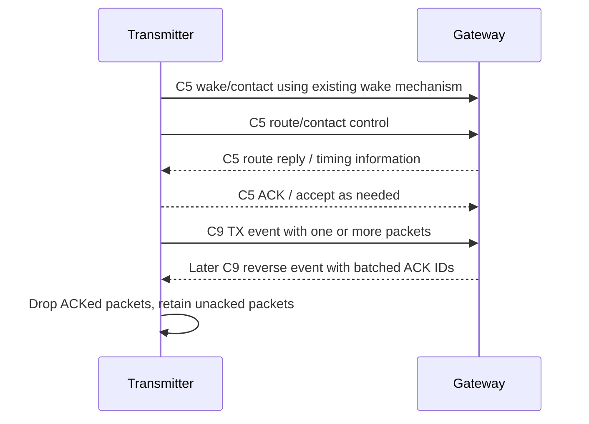
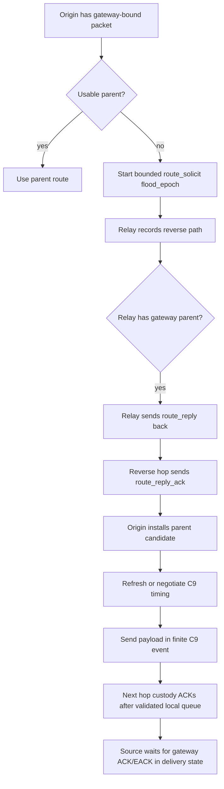
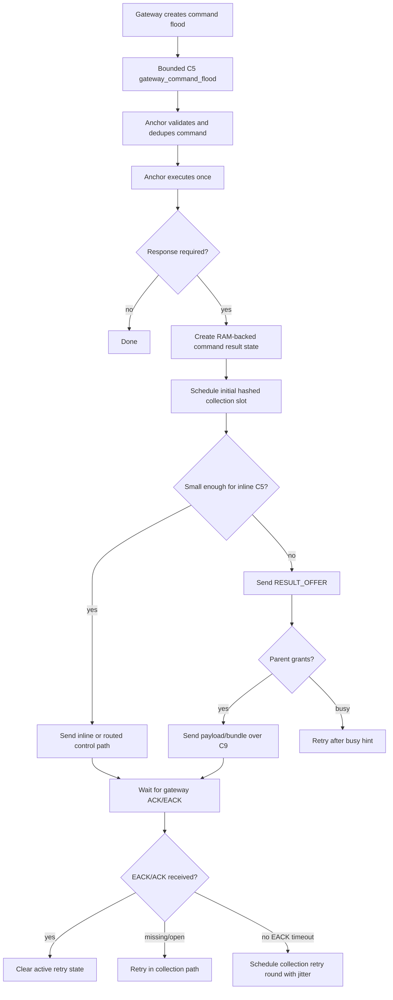

# Current Mesh Protocol Implementation Snapshot

This document describes what is implemented in the current firmware tree. It is
not a replacement for `Documentation/MeshSpec.md`, and it is not an idealized
protocol proposal. When behavior is only partially implemented, that is called
out explicitly.

Snapshot basis:

- Current code at repository `HEAD`.
- `Documentation/Firmware Implementation Tasklist.md` current checklist statuses.
- Current mesh relay, app mesh-report, gateway command, and native test code.

Reading rule: this document records the protocol surface that exists in the
firmware tree now. It is not a statement of desired MeshSpec behavior unless the
behavior is also present in code or tests. Unimplemented and partially
implemented items are listed as gaps rather than described as operational flow.

## Current Scope

The current mesh implementation uses UWB for route/control/data ownership.
BLE is debug/status/host transport only and is not part of mesh delivery
correctness.

Implemented lanes:

- Channel 5 click service for real clicker-originated wake/discovery/schedule
  and ranging.
- Channel 5 mesh/control contact for route solicitation, route reply,
  route/contact refresh, gateway route advertisement, gateway command flood,
  collection EACK flood, result offer/grant, and channel-9 timing negotiation.
- Channel 9 finite mesh payload events between negotiated neighbors.

The implementation keeps MeshSpec terminology in code: `flood_epoch`,
`collection_epoch`, C5 contact state, finite C9 event state, relay capacity
state, route reply ACK, result offer/grant, result bundle, and collection EACK.

## Implemented Timing Constants

These MeshSpec constants are currently defined in `firmware/include/mesh_relay.h`:

| Constant | Current value |
| --- | ---: |
| `FLOOD_EPOCH_LOCAL_TTL` | 2 |
| `FLOOD_EPOCH_REGIONAL_TTL` | 4 |
| `FLOOD_EPOCH_GLOBAL_TTL` | 8 |
| `FLOOD_EPOCH_CRITICAL_TTL` | 12 |
| `FLOOD_FORWARD_MAX_NORMAL` | 1 |
| `FLOOD_FORWARD_MAX_CRITICAL` | 2 |
| `FLOOD_FORWARD_SUPPRESS_AFTER_HEARD` | 2 |
| `FLOOD_WAVE_MS` | 1400 |
| `FLOOD_RELAY_BURST_MS` | 600 |
| `FLOOD_RELAY_REPEAT_MS` | 40 |
| `FLOOD_POST_ROOT_GUARD_MS` | 150 |
| `C5_POLITE_SNIFF_MS` | 6 |
| `C5_POLITE_BACKOFF_MIN_MS` | 20 |
| `C5_POLITE_BACKOFF_MAX_MS` | 1600 |
| `C5_POLITE_DEFERRAL_MAX` | 8 |
| `RREP_ACK_TIMEOUT_MS` | 150 |
| `RREP_RETRY_COUNT_PER_HOP` | 4 |
| `RELAY_BUSY_RETRY_MIN_MS` | 500 |
| `RELAY_BUSY_RETRY_MAX_MS` | 5000 |
| `COLLECTION_INITIAL_SPREAD_MIN_MS` | 30000 |
| `COLLECTION_INITIAL_SPREAD_PER_NODE_MS` | 300 |
| `COLLECTION_MISSING_SPREAD_PER_NODE_MS` | 500 |
| `COLLECTION_RETRY_ROUND_0_MS` | 15000 |
| `COLLECTION_RETRY_ROUND_1_MS` | 30000 |
| `COLLECTION_RETRY_ROUND_2_MS` | 60000 |
| `COLLECTION_RETRY_ROUND_3_MS` | 120000 |
| `COLLECTION_RETRY_ROUND_STEADY_MS` | 300000 |
| `COLLECTION_RETRY_JITTER_PERCENT` | 25 |
| `COLLECTION_RESULT_INLINE_C5_MAX_BYTES` | 32 |
| `COLLECTION_BUNDLE_TARGET_BYTES` | 512 |
| `COLLECTION_BUNDLE_MAX_RECORDS` | 8 |
| `COMMAND_RESULT_EXPIRY_DEFAULT_S` | 86400 |
| `FLOOD_BETTER_METRIC_MARGIN_PERCENT` | 10 |

Existing non-MeshSpec timing constants such as click wake train timing, anchor
wake scan cadence, and channel-9 event interval/window timing remain in their
existing modules.

## Implemented Scheduler Priorities

The current scheduler code follows this single-radio priority order:

1. Active channel-5 click service.
2. Required quick channel-5 wake scan.
3. Channel-5 route/contact/timing refresh.
4. Negotiated channel-9 mesh payload event.
5. Retained sleep.

Channel-9 event planning can be skipped, clipped, or preempted by channel-5
work. The mesh relay/app code records C5/C9 preemption and timing diagnostics,
and pending collection-result state is preserved across route loss and app-level
C5/click deferral paths that currently have native coverage.

Known remaining gap:

- App-integrated click-service preemption during collection is still listed as
  partial in the tasklist. Native coverage exists for several deferral paths,
  but the app-integrated click-service collection case is not fully proven.

## Implemented Channel-5 Contact Behavior

The app has a C5 contact state model with states equivalent to:

- `C5_CONTACT_NONE`
- `C5_CONTACT_WAKE_PENDING`
- `C5_CONTACT_AWAKE_ACCEPTED`
- `C5_CONTACT_EXCHANGE_ACTIVE`
- `C5_CONTACT_CLOSING`

Current C5 control sends route through `mesh_send_c5_control()` in the app
mesh-report layer. The implementation uses the existing UWB wake train /
wake-claim mechanism before C5 control exchanges when no accepted contact is
active. Once a contact is accepted, follow-up frames in that exchange do not
need a fresh full wake train.

Implemented through that path:

- Gateway command and survey floods.
- Collection EACK floods.
- Broadcast forwards.
- Gateway route advertisements.
- Route-request forwards.
- Result offers and busy replies.
- Gateway ACK C5 fallback.
- Channel-9 event negotiation.
- Route reply ACK and result grant direct sends only after accepted C5 exchange.

## Implemented Channel-5 Politeness

The C5 control path has listen-before-talk behavior using the configured
politeness constants. Reliable unicast control and bounded flood forwarding are
handled differently: reliable sends may retry/back off, while flood bursts stay
bounded and do not grow indefinitely just because channel 5 is busy.

## Implemented Channel-9 Behavior

Channel-9 is implemented as finite payload events, not open sessions waiting for
end-to-end ACKs.

Implemented event states include:

- `CH9_EVENT_NONE`
- `CH9_EVENT_GRANTED`
- `CH9_EVENT_TX_PAYLOAD`
- `CH9_EVENT_WAIT_CUSTODY_ACK`
- `CH9_EVENT_COMPLETE`
- `CH9_EVENT_BUSY_RETRY_LATER`
- `CH9_EVENT_WINDOW_EXPIRED`
- `CH9_EVENT_PREEMPTED_BY_C5`

The implemented event state excludes `WAIT_GATEWAY_ACK` and `WAIT_EACK`.
Gateway ACK/EACK wait belongs to relay delivery state, not the radio-window
state.

Current behavior:

- Payload windows can complete, expire, return busy/retry-later, or be
  preempted by channel-5 work.
- Event/window closure is separate from channel-9 timing validity.
- Timing can remain valid after a payload window completes.
- ACK/EACK can arrive later through a later event or refreshed contact path.

The direct mesh-test path uses alternating channel-9 TX/RX windows. The
initiator starts with a TX slot and the downstream peer starts with RX. Relay
nodes have room for an upstream and downstream connection. The gateway is a
special case and only needs upstream slots because it does not originate route
requests toward anchors.

## Implemented Parent Candidate And Capacity Model

Parent candidates currently carry:

- next hop,
- gateway ID,
- route epoch,
- hop count,
- path quality,
- route cost,
- channel-9 timing validity,
- relay capacity state,
- queue hint,
- channel-9 busy hint,
- capacity observation/validity timing,
- last observed,
- last success,
- hold-down deadline.

Implemented capacity states:

- `RELAY_CAP_UNKNOWN`
- `RELAY_CAP_GREEN`
- `RELAY_CAP_YELLOW`
- `RELAY_CAP_RED`
- `RELAY_CAP_BLACK`

Expired relay capacity becomes `RELAY_CAP_UNKNOWN`. Current tests cover that
expired capacity does not delete the route, invalidate the parent, clear
channel-9 timing, start route rediscovery, or place the parent in hold-down.

Route selection remains hop-first with link quality/cost first and capacity as
a tie-breaker or penalty among otherwise comparable candidates.

## Implemented Bounded Route Discovery

Current route discovery uses bounded same-event forwarding. A no-route relay
does not create an independent child route discovery for the same gateway
target.

Implemented route solicitation identity:

- target gateway,
- origin ID,
- request ID,
- flood epoch ID.

Implemented relay behavior:

- validate route solicit frames,
- use duplicate/flood suppression,
- preserve the same origin/request/flood identity when forwarding,
- record best and backup reverse path,
- suppress non-better duplicates,
- forward within configured TTL/forwarding bounds,
- build route replies when a usable gateway parent is known.

Current native tests cover cold-mesh style bounded identity behavior and dense
route-solicit suppression.

## Implemented Route Reply ACK

Route replies carry nonce and metric CRC fields and use `ROUTE_REPLY_ACK`.

Implemented app behavior:

- Route reply trains are sent to the reverse hop.
- The sender waits for a matching route reply ACK.
- Retries are counted.
- A backup reverse path can be tried.
- Route reply ACK/direct response handling goes through accepted C5 exchange
  semantics.

This is implemented as volatile runtime behavior; there is no storage-backed
recovery for an in-progress route reply across reset.

## Implemented Gateway Route Advertisement

Gateway route advertisements are implemented as bounded flood updates that seed
parent candidates. The app schedules gateway route advertisements at startup and
on request, and relays can parse, validate, install, and forward advertisements
with flood identity and duplicate suppression.

Missing an advertisement does not delete an existing usable route.

## Implemented Relay Busy / Result Busy

The relay layer implements:

- `RELAY_BUSY`
- `RESULT_BUSY`
- retry-after timing,
- capacity state/hint fields,
- optional alternate-parent metadata,
- busy-response telemetry.

Current tests cover busy-response increments and several result-offer busy
paths.

## Implemented Gateway Command Flood Fields

Gateway command option parsing and mesh envelope fields currently support:

- single/group/all-registered/all-heard scope options,
- response mode,
- flood identity,
- command sequence,
- collection epoch,
- membership epoch,
- expected node count,
- command expiry,
- collection slot seed.

Gateway broadcast commands originate as channel-5 control floods rather than as
tracked unicast sends.

## Implemented Collection EACK

Gateway collection state and EACK encoding/handling exist.

Implemented in native code:

- Gateway collection start.
- Result dedupe.
- Received-list EACK payloads.
- Missing-list EACK payload helpers from roster data.
- Collection-open state.
- Timed retry-round EACK broadcasts.
- Source behavior for received-list hit, received-list miss, explicit
  missing-list retry, and closed-collection stop.

Current app gap:

- The gateway app scheduled EACK path currently sends explicit received-list
  EACKs. Missing-list helper support exists in native code, but the app does
  not currently select missing-list EACKs when roster data is available.

## Implemented Collection Result Scheduling

The anchor app can create command-result identities, including boot/result
sequence state, and schedule the initial hashed result send slot. The mesh relay
has collection retry delay helpers and EACK-driven retry behavior.

Implemented and tested for active pending results:

- received-list completion,
- received-list absence retry,
- explicit missing-list retry,
- no-EACK timeout retry using collection retry rounds,
- closed-collection stop,
- deterministic jittered retry delay behavior,
- route-loss preservation without treating missing EACK as route failure,
- C5/click-style deferral preservation in native relay paths,
- relay outbox snapshot/restore after `mesh_relay_init()` with command-result
  identity, payload length, payload CRC, gateway/local identity, collection
  epoch, gateway epoch, and completed-record validation,
- anchor-role Zephyr NVS persistence for active relay outbox snapshots using
  the board `storage_partition`,
- anchor-role Zephyr NVS persistence for scheduled command results before they
  become active relay outbox state; the restored record preserves the original
  collection result identity.

Partial:

- Full source retry-round persistence across real reboot is not proven for every
  collection-result state.

## Implemented Result Offer / Grant

Large command results use result offer/grant before the channel-9 payload.

Implemented behavior:

- Large command results are detected and start with `RESULT_OFFER`.
- Parent can reserve one metadata slot for result ID, length, CRC, and child.
- Parent grants `max_bytes` for the offered result length when capacity exists.
- Original payload is released after `RESULT_GRANT`.
- Mismatched payload identity, length, or CRC is rejected before custody/forward.
- Mismatched `RESULT_BUSY` identities are ignored.
- Anchor-role NVS stores and restores the parent-side result-offer reservation
  after restart. The restore path validates role/local/gateway identity,
  gateway epoch, child identity, result ID, result length, and result CRC.

Partial:

- Parent-side reservation recovery is implemented, but in-flight upstream
  custody/retry state after a forwarded large result is still not fully
  restart-tolerant.

## Implemented Result Bundling

Gateway and relay bundle handling exists.

Implemented behavior:

- Gateway accepts and dedupes `MSG_RESULT_BUNDLE`.
- Relays queue small collection results.
- Relays custody-ACK after local storage in RAM and, for anchor firmware, after
  the queued child bundle can be exported to NVS.
- Relays flush on hold deadline or queue fill.
- Relays send bundles over channel 9.
- Relays retain custody until outbound handoff succeeds.
- Anchor-role NVS stores and restores queued child bundle state after restart.
  Restore validates each record's result identity, collection epoch, payload
  length, and payload CRC, folds pre-reset queued time into `message_age_ms`,
  and resumes the remaining hold delay on the new boot uptime.

Partial:

- Queued bundle state is restart-tolerant before outbound handoff. A bundle
  that has already been handed to the next hop is still cleared on outbound
  handoff, so broader upstream custody retry state is not fully durable.

## Implemented Telemetry

Relay/status telemetry currently exposes:

- duplicate-cache count,
- collection-pending count,
- parent hold-down count,
- route-discovery attempts,
- outbox delivery state,
- flood suppression count,
- route-reply retry count,
- busy-response count,
- C5/C9 preemption and timing diagnostics.

Native tests cover status serialization plus live duplicate-flood suppression
and busy-response increments.

## Implemented Direct Gateway/Transmitter Mesh-Test Behavior

The current mesh-test direct link behavior is implemented around synthetic
gateway-bound payloads:

1. Transmitter performs channel-5 wake/contact with gateway.
2. Route solicitation/contact can be carried in the C5 control exchange.
3. Gateway route reply/timing negotiation establishes a channel-9 timing path.
4. Transmitter sends queued synthetic packets in its channel-9 TX windows.
5. Gateway receives one or more packets in the channel-9 RX window.
6. Gateway sends a batched ACK with received packet IDs in its send window.
7. Transmitter treats included packet IDs as ACKed.
8. Packets not ACKed remain queued for a later TX slot.

Current direct-link testing has exercised multiple packets per slot and partial
ACK behavior. The implementation intentionally only requires ACK for packets
that were actually sent in a window.

## Current Failure-Mode Coverage

The tasklist marks the following as covered by native tests:

- Cold mesh bounded discovery.
- Dense flood duplicate suppression.
- Duplicate route identity.
- Relay busy.
- Duplicate command/result.
- Capacity expiry.
- Channel-9 local completion with later gateway ACK.
- Missing EACK.
- Bundle dedupe.
- All-node collection spread.
- Route-loss preservation.
- Portable click/C5 preemption during collection.

Remaining partial test gap:

- App-integrated click-service preemption during collection.

## Current Not-Implemented / Partial Summary

These are the concrete gaps still present relative to `MeshSpec.md`:

1. Anchor-role Zephyr NVS storage is wired to scheduled collection results and
   relay-level outbox snapshot/restore for active local collection-result TX
   state. It restores after `mesh_relay_init()`, avoids duplicating a pre-relay
   record if an active relay outbox snapshot is restored, and saves/clears
   around active relay TX state transitions.

2. Source retry-round state for collection results is not fully persistent
   across real reboot for every state; scheduled source results and active
   relay outbox snapshots are storage-backed, but broader multi-hop custody
   state remains RAM-only.

3. Gateway app scheduled EACKs currently use explicit received-list format.
   Missing-list EACK generation exists in native helpers/tests, but the app
   does not yet choose missing-list EACKs from roster data.

4. Durable large-result custody is partial.
   Offer/grant/reservation validation exists and parent-side reservations are
   anchor NVS-backed, but forwarded in-flight upstream custody/retry state is
   not fully durable.

5. Durable multi-hop child custody/storage-backed recovery is partial.
   Queued child bundles are anchor NVS-backed before outbound handoff, but
   broader upstream custody retry state after handoff is not fully durable.

6. App-integrated click-service preemption during collection still needs focused
   test coverage.

## Current Flow: Direct Gateway Link



## Current Flow: One Relay Hop



## Current Flow: All-Node Command Collection



## Verification Commands For Current State

Native test/build commands normally used for this area:

```sh
cmake -S firmware -B firmware/build
cmake --build firmware/build
ctest --test-dir firmware/build --output-on-failure
```

Zephyr role builds normally used after app-facing changes:

```sh
.venv/bin/west build --no-sysbuild -s firmware/app -b nrf52833dk/nrf52833 --build-dir build/firmware-clicker -- -DFIRMWARE_ROLE=clicker
.venv/bin/west build --no-sysbuild -s firmware/app -b nrf52833dk/nrf52833 --build-dir build/firmware-anchor -- -DFIRMWARE_ROLE=anchor
.venv/bin/west build --no-sysbuild -s firmware/app -b nrf52833dk/nrf52833 --build-dir build/firmware-gateway -- -DFIRMWARE_ROLE=gateway
```

This document itself is not a fresh verification result. It records the current
implemented protocol surface and the known remaining gaps. Use the commands
above to refresh build/test proof after code changes.
