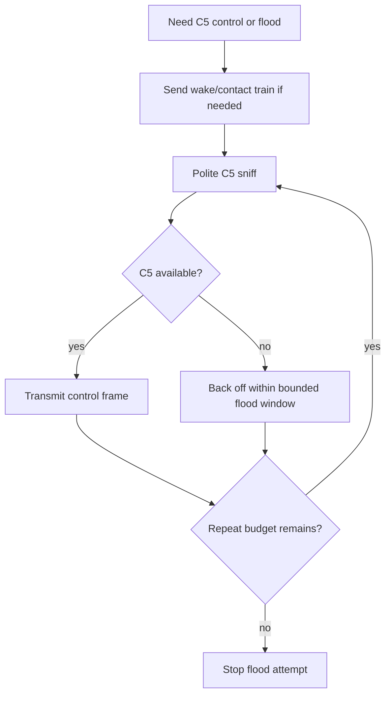
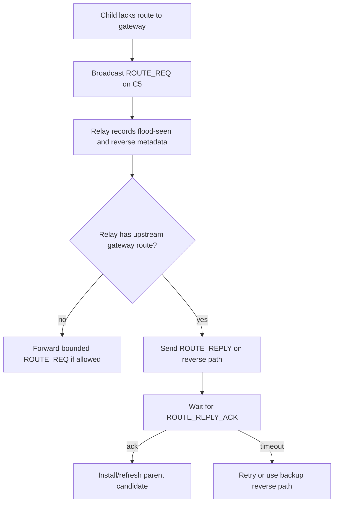
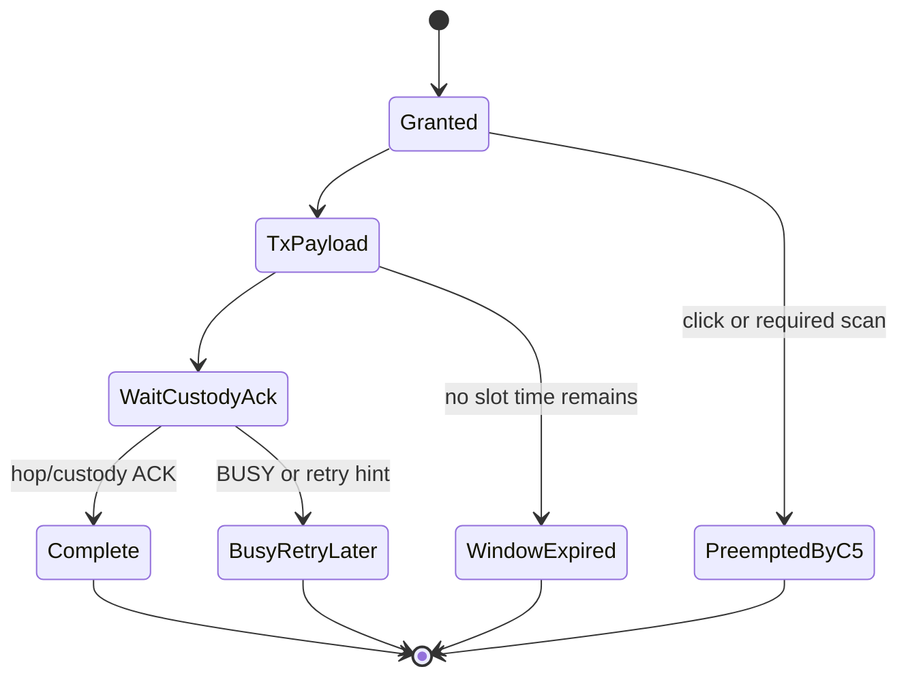
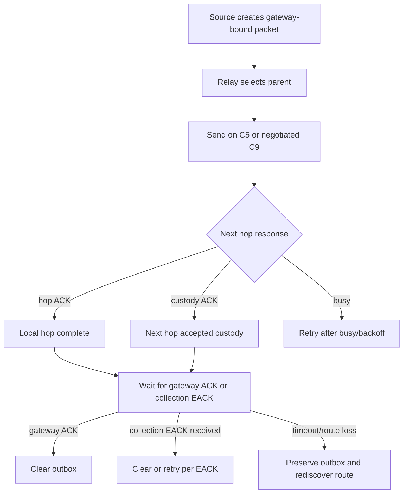
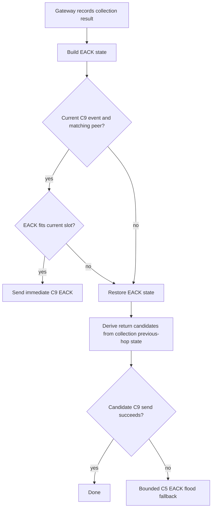
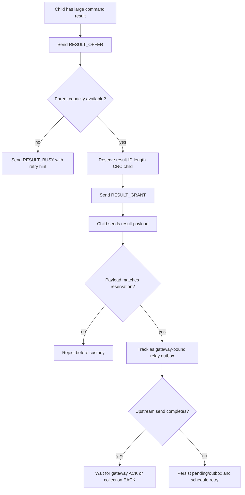

# Mesh Protocol Engineering Review

Review date: 2026-07-03

This file is the single engineer-facing review document for the current mesh
implementation. It summarizes the behavior implemented from
`Documentation/MeshSpec.md`, the code surfaces to inspect, the timing model,
the practical flows, the verification evidence, and the remaining validation
boundary.

`Documentation/MeshSpec.md` was not modified while implementing this behavior.

## Review Verdict

The software implementation is complete enough for engineering review against
the current MeshSpec intent. Native tests and Zephyr role builds pass for the
implemented behavior. The remaining caveats are hardware and broad runtime
integration evidence, not missing core protocol primitives.

The final committed implementation includes:

- bounded channel-5 route/control flooding,
- route reply ACK and retry policy,
- relay capacity and busy signaling,
- channel-9 finite event handling,
- gateway ACK return preference over channel 9,
- route-test partial ACK and supervised timing preservation,
- gateway collection state, collection EACK routing, and persistence,
- collection result retry and persistent relay outbox state,
- result offer/grant reservation and forwarded child custody preservation,
- focused app helper coverage for the handoff and preemption cases that had
  protocol risk.

Latest implementation commits:

| Commit | Summary |
| --- | --- |
| `c2d7995` | Preserve forwarded child result deferrals |
| `41d527b` | Require current event fit for collection EACK |
| `276bde5` | Preserve channel-9 timing after ACK completion |
| `9eff7de` | Keep gateway ACK return on channel 9 |
| `67299af` | Implement relay capacity backlog states |

## Source Map

The main review entry points are:

| Area | Files |
| --- | --- |
| Protocol constants and TLVs | `firmware/include/protocol.h` |
| UWB channel constants | `firmware/include/uwb.h` |
| Relay state machine and persistence | `firmware/include/mesh_relay.h`, `firmware/src/mesh_relay.c` |
| Generic mesh helpers | `firmware/include/mesh.h`, `firmware/src/mesh.c` |
| Gateway command and collection state | `firmware/include/gateway_command.h`, `firmware/src/gateway_command.c` |
| Gateway EACK policy | `firmware/app/src/app_gateway_eack_policy.c` |
| Gateway collection EACK orchestration | `firmware/app/src/app_gateway_collection_eack.c` |
| Gateway BLE/app bridge | `firmware/app/src/app_gateway_ble.c` |
| App mesh report and handoff logic | `firmware/app/src/app_mesh_report.c`, `firmware/app/src/app_mesh_result_handoff.c` |
| App preemption and deferral helpers | `firmware/app/src/app_mesh_collection_deferral.c`, `firmware/app/src/app_mesh_ch9_ack.c`, `firmware/app/src/app_mesh_gateway_ack_policy.c` |
| Native tests | `firmware/tests/test_mesh_relay.c`, `firmware/tests/test_mesh.c`, `firmware/tests/test_gateway_collection_eack.c`, `firmware/tests/test_gateway_eack_policy.c`, `firmware/tests/test_app_mesh_collection_deferral.c`, `firmware/tests/test_app_mesh_ch9_ack.c` |

Related current-state docs remain useful for detail:

- `Documentation/Mesh Protocol Current Implementation.md`
- `Documentation/Mesh Protocol Full Implementation.md`
- `Documentation/Mesh Protocol Detailed Flow.md`
- `Documentation/Firmware Implementation Tasklist.md`

## Network Model

The mesh is UWB-owned. BLE is used for host/debug/courtesy behavior and is not
part of mesh delivery correctness.

Two UWB lanes are used:

| Lane | Channel | Purpose |
| --- | ---: | --- |
| C5 wake/contact | `UWB_CHANNEL_WAKE_CONTACT` = `5` | click service, sleeping-peer contact, route discovery, route reply ACK, gateway route advertisement, command flood, collection EACK flood fallback, result offer/grant/busy, channel-9 negotiation |
| C9 payload | `UWB_CHANNEL_MESH_PAYLOAD` = `9` | negotiated finite payload event for mesh data, reports, command results, result bundles, hop/custody ACKs, gateway ACKs, collection EACKs |

The scheduler priority is:

1. active channel-5 click service,
2. required quick channel-5 wake scan,
3. channel-5 route/contact/timing refresh,
4. negotiated channel-9 mesh payload event,
5. retained sleep.

Accepted click work and required C5 scans may defer or preempt lower-priority
mesh work. That preemption preserves route state and relay-owned persistent
delivery state for the implemented collection/result paths.

## Message Surface

The implemented mesh/control message surface is:

| Message | Value | Role |
| --- | ---: | --- |
| `MSG_MESH_DATA` | `0x30` | gateway-bound mesh payload |
| `MSG_MESH_HOP_ACK` | `0x31` | hop-local progress or custody ACK |
| `MSG_GATEWAY_ACK` | `0x32` | end-to-end gateway ACK |
| `MSG_ROUTE_REQ` | `0x35` | bounded route solicitation flood |
| `MSG_ROUTE_REPLY` | `0x36` | reverse-path route reply |
| `MSG_MESH_EVENT_PROPOSE` | `0x37` | C9 timing proposal |
| `MSG_MESH_EVENT_ACCEPT` | `0x38` | C9 timing acceptance |
| `MSG_MESH_EVENT_UPDATE` | `0x39` | C9 timing update |
| `MSG_MESH_EVENT_END` | `0x3A` | C9 timing close |
| `MSG_ROUTE_REPLY_ACK` | `0x3B` | hop ACK for route reply |
| `MSG_GATEWAY_ROUTE_ADV` | `0x3C` | gateway-originated route advertisement flood |
| `MSG_RELAY_BUSY` | `0x3D` | relay capacity/congestion response |
| `MSG_RESULT_BUSY` | `0x3E` | result-offer congestion response |
| `MSG_COMMAND` | `0x40` | gateway command, unicast or bounded flood |
| `MSG_COMMAND_RESULT` | `0x41` | command result payload |
| `MSG_RESULT_OFFER` | `0x42` | large-result metadata offer |
| `MSG_RESULT_GRANT` | `0x43` | parent grant for reserved large result |
| `MSG_RESULT_BUNDLE` | `0x44` | relay/gateway collection-result bundle |
| `MSG_GATEWAY_COLLECTION_EACK` | `0x45` | collection status EACK |

Legacy route beacon IDs `0x33` and `0x34` are reserved and rejected. Operational
mesh packets with zero `session_id` or zero `seq` are rejected by current
coverage.

## Timing And Capacity Constants

Important implemented constants:

| Constant | Value | Meaning |
| --- | ---: | --- |
| `PACKET_MAX_PAYLOAD_LEN` | `255` | normal shared-packet payload cap |
| `PACKET_EXT_MAX_PAYLOAD_LEN` | `958` | extended payload cap |
| `UWB_PHY_EXTENDED_FRAME_MAX_LEN` | `1023` | extended PHY frame cap |
| `MESH_DEFAULT_TTL` | `4` | normal mesh TTL |
| `MESH_GATEWAY_ACK_TTL` | `4` | gateway ACK TTL |
| `PARENT_CANDIDATE_COUNT` | `3` | upstream candidate slots |
| `MESH_RELAY_DOWNLINK_ROUTES` | `16` | downlink reverse-route slots |
| `MESH_RELAY_DUP_CACHE_SIZE` | `16` | duplicate cache entries |
| `ROUTE_GATEWAY_ACK_TIMEOUT_MS` | `2000` | gateway ACK wait |
| `ROUTE_PARENT_HOLDDOWN_S` | `30` | parent hold-down |
| `ROUTE_DEDUP_WINDOW_MS` | `60000` | duplicate identity window |
| `RELAY_BUSY_RETRY_MIN_MS` | `500` | minimum busy retry |
| `RELAY_BUSY_RETRY_MAX_MS` | `5000` | maximum busy retry |
| `COLLECTION_RESULT_INLINE_C5_MAX_BYTES` | `32` | result-offer threshold |
| `COLLECTION_BUNDLE_TARGET_BYTES` | `512` | bundle flush target |
| `COLLECTION_BUNDLE_MAX_RECORDS` | `8` | wire-format bundle record cap |
| `MESH_RELAY_RESULT_BUNDLE_RECORDS` | `2` | relay RAM queue record cap |
| `MESH_RELAY_RESULT_BUNDLE_HOLD_MS` | `25` | bundle hold time |
| `MESH_RELAY_OUTBOX_SNAPSHOT_VERSION` | `2` | relay outbox snapshot format |
| `COMMAND_RESULT_EXPIRY_DEFAULT_S` | `86400` | default result expiry |

Collection retry timing:

| Constant | Value |
| --- | ---: |
| `COLLECTION_INITIAL_SPREAD_MIN_MS` | `30000` |
| `COLLECTION_INITIAL_SPREAD_PER_NODE_MS` | `300` |
| `COLLECTION_MISSING_SPREAD_PER_NODE_MS` | `500` |
| `COLLECTION_RETRY_ROUND_0_MS` | `15000` |
| `COLLECTION_RETRY_ROUND_1_MS` | `30000` |
| `COLLECTION_RETRY_ROUND_2_MS` | `60000` |
| `COLLECTION_RETRY_ROUND_3_MS` | `120000` |
| `COLLECTION_RETRY_ROUND_STEADY_MS` | `300000` |
| `COLLECTION_RETRY_JITTER_PERCENT` | `25` |

Route-test C9 timing uses a longer supervised event profile than production:

| Constant | Value |
| --- | ---: |
| `MESH_EVENT_DEFAULT_INTERVAL_MS` | `440` |
| `MESH_EVENT_DEFAULT_WINDOW_MS` | `100` |
| `MESH_EVENT_DEFAULT_FIRST_DELAY_MS` | `500` |
| `MESH_EVENT_DEFAULT_GUARD_MS` | `20` |
| `MESH_EVENT_DEFAULT_SECOND_SLOT_OFFSET_MS` | `220` |
| `MESH_EVENT_DEFAULT_SUPERVISION_MS` | `5000` |
| `MESH_CH9_ACK_BATCH_MAX` | `8` |
| `MESH_CH9_TX_BATCH_MAX` | `8` |
| `MESH_CH9_DATA_RATE_BPS` | `850000` |
| `MESH_ROUTE_TEST_CH9_TX_OFFSET_MS` | `15` |
| `MESH_ROUTE_TEST_CH9_MAX_CONNECTIONS` | `2` |

The C9 PHY uses 850 kbps, 1024-symbol preamble, extended PHR, and STS off.

## Core State Machines

### Channel-5 Contact And Flooding

C5 contact is the wake/control lane. Broadcast control work is bounded and does
not extend indefinitely on busy C5.

Implemented C5 flood behavior:

- flood identity is separate from the generic duplicate cache,
- heard equivalent floods can suppress redundant forwarding,
- route solicit, route advertisement, gateway command, collection EACK, and
  broadcast-forward paths use the bounded scheduler,
- every repeat performs polite sniffing before TX,
- click service and required scan can defer one flood slot.



### Route Discovery And Reply ACK

Route discovery is same-event and bounded. `MSG_ROUTE_REQ` establishes a flood
identity and records reverse-path metadata. `MSG_ROUTE_REPLY` follows reverse
metadata back toward the child. `MSG_ROUTE_REPLY_ACK` confirms the hop and
allows retry or backup reverse path if a reply ACK is missed.



### Channel-9 Event

C9 is a finite payload event. It does not stay open waiting for gateway ACK or
collection EACK. Those are persistent delivery states above the local radio
event.

Implemented C9 closure reasons:

- local payload and hop/custody ACK complete,
- busy/retry-later,
- event window expiry,
- channel-5 preemption,
- missed-event-limit refresh requirement.

`MSG_MESH_EVENT_END` is not emitted on ACK-complete in a way that destroys
supervised C9 timing. ACK completion preserves supervised timing for later
payload slots.



### Persistent Delivery

Persistent delivery is separate from local C9 state. A packet/result can finish
its local hop and still remain active until gateway ACK, collection EACK,
expiry, explicit close, or storage policy clears it.



## Implemented Flows

### Ordinary Gateway-Bound Packet

1. Source creates a gateway-bound packet with nonzero session and sequence.
2. Relay selects the best parent candidate.
3. If valid C9 timing exists, app policy prefers C9 for gateway ACK return and
   payload delivery.
4. If C9 timing is stale or missing, channel-5 contact/refresh is scheduled.
5. Local C9 completion leaves the packet in persistent gateway-ACK wait state
   until `MSG_GATEWAY_ACK` arrives or the route/retry policy runs.

### Gateway ACK Return

Gateway ACK return is channel-9-first when a valid event/route exists. Ordinary
gateway ACKs are not sent as the C5 timing-refresh payload. If timing is stale,
the app refreshes or retries the C9 path instead of abusing C5 ACK payloads.

### Gateway Command Flood And Collection Result

1. Gateway creates `MSG_COMMAND` with command identity, flood identity,
   collection epoch, membership, response mode, expiry, and collection slot
   seed.
2. Command is sent as bounded C5 flood for group/all scopes or routed unicast
   for unicast scopes.
3. Anchor rejects expired or duplicate commands and executes once.
4. Response timing is spread by deterministic hash:

```text
spread_ms =
    max(COLLECTION_INITIAL_SPREAD_MIN_MS,
        expected_node_count * COLLECTION_INITIAL_SPREAD_PER_NODE_MS)

initial_due =
    command_flood_end
  + hash(node_id, command_seq, collection_slot_seed) % spread_ms
```

5. Small results may use the normal routed path.
6. Large results use `MSG_RESULT_OFFER` / `MSG_RESULT_GRANT`.
7. Source waits for gateway ACK or collection EACK policy before clearing.

### Collection EACK

Gateway collection state supports:

- result dedupe,
- received-list EACK payloads,
- strict roster missing-list EACK payloads,
- provider-roster missing-list EACK payloads for all-registered scope,
- received-list fallback when missing-list payloads are not appropriate or do
  not fit,
- timed retry-round EACK broadcasts,
- collection snapshot export/restore through gateway persistence.

EACK return policy:

1. If the result was received inside the current expected C9 event and a current
   event plan is available, try immediate C9 return only after the normal
   `mesh_prepare_channel9_outbound()` fit check proves the EACK fits the current
   slot.
2. If immediate C9 prepare/send fails, restore the original EACK state.
3. Derive up to two distinct return candidates from collection previous-hop
   metadata.
4. Try valid candidates over planned C9.
5. Fall back to bounded C5 collection EACK flood when C9 candidates fail or are
   unavailable.



### Result Offer, Grant, And Forwarded Child Custody

Large command results start with `MSG_RESULT_OFFER`. The parent reserves one
metadata slot containing child ID, command-result identity, result length, and
CRC. It sends `MSG_RESULT_GRANT` only when capacity exists. Later payloads must
match the reservation before custody or forwarding.

Implemented safeguards:

- mismatched payload identity/length/CRC is rejected before custody,
- mismatched `MSG_RESULT_BUSY` identity is ignored,
- parent-side offer reservation is anchor NVS-backed,
- queued child bundles are restart-tolerant,
- in-flight `MSG_RESULT_BUNDLE` outbox state is restart-tolerant,
- forwarded non-bundled child `MSG_COMMAND_RESULT` payloads with valid identity
  are tracked as persistent gateway-bound relay outbox work before upstream
  send completion,
- slot-full/send-failure deferral preserves forwarded child pending state,
  persistent outbox state, outbox save, and retry scheduling.

This last point closes the important custody gap: after a parent grants and
accepts a child result, app/radio handoff failure no longer drops the forwarded
non-bundled child payload just because the packet source is not the local relay.



### Result Bundling

Relays may bundle small child collection results to reduce upstream events.
Gateway accepts and dedupes `MSG_RESULT_BUNDLE`. Relays queue child results,
custody-ACK after safe storage, flush on hold deadline or queue fill, and
retain custody until outbound handoff succeeds.

The wire format can carry up to `COLLECTION_BUNDLE_MAX_RECORDS` records. The
current relay RAM queue uses `MESH_RELAY_RESULT_BUNDLE_RECORDS`.

### Route-Test Direct Link

The route-test direct link exercises the same C5 contact and C9 payload
machinery with synthetic gateway-bound `MSG_MESH_DATA`.

Important route-test behaviors now covered:

- ACK batch matching,
- session/sequence disambiguation,
- malformed ACK-list rejection,
- partial ACK requeue of only unACKed packets,
- route-test multi-packet partial ACK recovery,
- full-queue retry drops,
- ACK-complete preservation of supervised C9 timing.

## Persistence

Implemented durable or restart-tolerant state:

| State | Mechanism |
| --- | --- |
| Active relay outbox | `MESH_RELAY_OUTBOX_SNAPSHOT_VERSION` |
| Queued child result bundles | child custody snapshot |
| Parent result-offer reservation | child custody snapshot |
| In-flight result bundle | relay outbox snapshot |
| Forwarded child command-result payload after grant | app outbox persistence |
| Scheduled collection result before relay TX | app scheduled-result snapshot |
| Gateway collection state | gateway collection snapshot, NVS record `0x0104` |
| Gateway registered membership | NVS record `0x0105` |

The relay outbox snapshot stores packet identity, delivery state, pending TX
state, retry round, selected parent, custody state, payload length/CRC, snapshot
time, and gateway/local identity.

## Capacity And Busy Behavior

Relay capacity states are:

| State | Meaning |
| --- | --- |
| `RELAY_CAP_UNKNOWN` | no fresh capacity information |
| `RELAY_CAP_GREEN` | idle and safe for more work |
| `RELAY_CAP_YELLOW` | shallow backlog, still usable |
| `RELAY_CAP_RED` | should not accept additional transfer custody |
| `RELAY_CAP_BLACK` | unusable relay identity/local state |

Current live capacity reports:

- GREEN for idle relays,
- YELLOW for shallow child-bundle backlog,
- RED for active tracked TX, active result-offer reservation, or full child
  bundle queue,
- BLACK for unusable local relay identity.

Route control handling is preserved under congestion. `MSG_RELAY_BUSY` and
`MSG_RESULT_BUSY` carry retry hints and alternate-parent information where
available.

## Practical Scenarios

### Scenario 1: Cold Anchor Finds Gateway Route

1. Anchor has gateway-bound work and no parent route.
2. Anchor sends bounded `MSG_ROUTE_REQ` on C5.
3. Relays record flood-seen and reverse metadata.
4. A relay or gateway with route knowledge sends `MSG_ROUTE_REPLY`.
5. Child ACKs the route reply with `MSG_ROUTE_REPLY_ACK`.
6. Anchor installs the parent candidate and sends queued work.

Review focus: duplicate route identity, route-solicit flood-seen suppression,
route reply ACK retry/listen behavior, and backup reverse-path fallback.

### Scenario 2: Normal Command Collection

1. Gateway floods command with collection identity and roster/membership scope.
2. Anchors execute once after duplicate and expiry checks.
3. Anchors schedule result sends by deterministic spread.
4. Gateway records received identities and previous-hop metadata.
5. Gateway emits received-list or missing-list EACK.
6. Missing nodes retry by collection retry rounds with jitter.
7. Successful nodes stop when EACK confirms receipt or closes collection.

Review focus: rosterless all-registered acceptance requires matching registered
membership epoch/count; all-heard remains best effort.

### Scenario 3: Large Child Result Through Parent

1. Child sends `RESULT_OFFER`.
2. Parent reserves metadata and sends `RESULT_GRANT`.
3. Child sends matching `MSG_COMMAND_RESULT`.
4. Parent tracks the forwarded child payload in persistent outbox.
5. If C9 slot is full or radio send fails before completion, parent saves the
   outbox and schedules retry.
6. Parent retries until gateway ACK, collection EACK, expiry, or close.

Review focus: this is the final custody fix in `c2d7995`.

### Scenario 4: Gateway ACK After C9 Payload

1. Anchor sends gateway-bound payload in C9 event.
2. Local hop completes.
3. C9 finite event can close without clearing persistent delivery.
4. Gateway ACK return prefers channel 9.
5. If timing is stale/missing, route/contact refresh happens without sending
   ordinary gateway ACK as the C5 refresh payload.

Review focus: local event state and persistent gateway-ACK wait are separate.

### Scenario 5: C5 Preempts C9 Work

1. C9 event is planned or active.
2. Click service or required C5 scan becomes higher priority.
3. C9 work is clipped, skipped, or deferred.
4. Route state and implemented persistent collection/result outbox state are
   preserved.
5. Retry happens in a later event or after C5 refresh.

Review focus: preemption is not treated as route failure by itself.

## Verification Evidence

Latest focused verification recorded after the final forwarded-child custody
fix:

| Command | Result |
| --- | --- |
| `git diff --check` | passed |
| `cmake --build firmware/build --target test_app_mesh_collection_deferral` | passed |
| `ctest --test-dir firmware/build -R app_mesh_collection_deferral --output-on-failure` | passed 1/1 |
| `cmake --build firmware/build` | passed |
| `ctest --test-dir firmware/build --output-on-failure` | passed 24/24 |
| `cmake --build build/firmware-clicker` | passed, 237728 B FLASH / 86544 B RAM |
| `cmake --build build/firmware-anchor` | passed, 184972 B FLASH / 98816 B RAM |
| `cmake --build build/firmware-gateway` | passed, 296244 B FLASH / 105420 B RAM |

Focused coverage includes:

- route discovery and route reply ACK policy,
- route-solicit flood-seen state,
- relay capacity and busy states,
- ordinary gateway ACK channel-9-first policy,
- channel-9 finite event and missed-event-limit behavior,
- route-test ACK matching and partial ACK recovery,
- ACK-complete preserving supervised C9 timing,
- gateway collection EACK policy and state preservation,
- current-channel-9 EACK fit checks,
- collection EACK fallback to C5,
- app orchestration for strict-roster missing-list versus received-list EACK,
- local collection-result deferral,
- forwarded child command-result deferral,
- result offer/grant reservation and persistence,
- child bundle custody and persistence,
- app handoff helper success/failure behavior.

## Remaining Validation Boundary

The following areas are intentionally not presented as fully proven by current
software tests:

- full app/radio collection EACK routing across every possible real preemption
  and handoff case,
- full source retry-round persistence across every app-integrated radio
  transition,
- full durable multi-hop child custody recovery across every handoff path,
- runtime route-test partial ACK proof beyond focused helper/native coverage,
- hardware smoke for the real DWM3000 boards,
- final hardware integration for normal click, self-test, route retry, and
  survey.

These are validation boundaries, not missing protocol objects. The code now has
the core mechanisms required to exercise and harden those paths on hardware.

## Review Checklist

An engineer reviewing this implementation should inspect:

1. `mesh_relay_start_tx()` and outbox tracking for local and forwarded
   gateway-bound work.
2. `preserve_pending_gateway_result()` and deferral behavior for local
   collection results, forwarded child command results, and bundles.
3. Result-offer reservation matching before custody/forward.
4. Gateway EACK immediate-C9 path requiring current event metadata and fit
   preparation.
5. EACK fallback preservation after failed channel-9 prepare/send.
6. Channel-9 ACK-complete behavior preserving supervised timing.
7. Route reply ACK app policy and flood-seen duplicate suppression.
8. Persistence snapshot version checks and identity/CRC validation.
9. Tests listed in the verification section.

## Conclusion

The software implementation is ready for review as a coherent UWB mesh
protocol implementation. The main remaining work is bench validation and any
follow-up hardening that falls out of real hardware runs.
