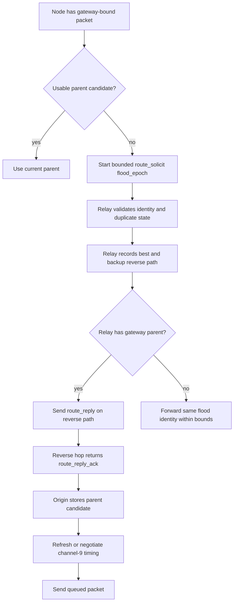
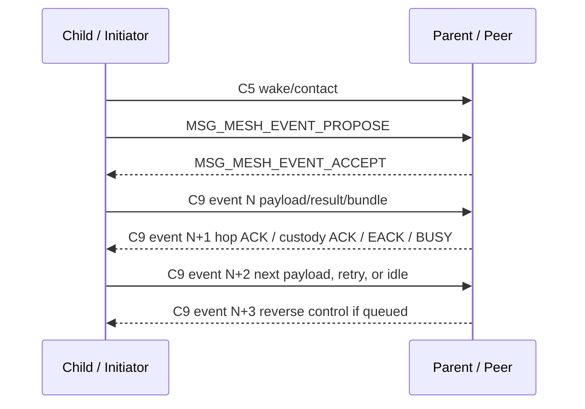
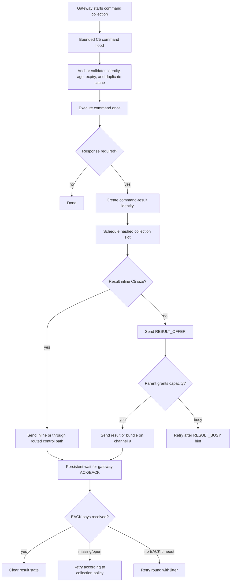
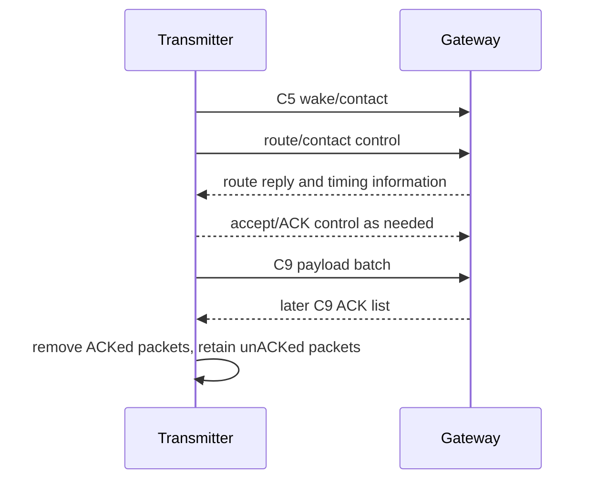

# Mesh Protocol Full Implementation

This document describes the mesh protocol implemented in this firmware tree as
of this worktree state. It is written from `Documentation/MeshSpec.md`, the
current implementation tracker, and the current mesh code/tests, but it does
not modify the spec and does not claim that every MeshSpec behavior is complete.

The protocol is UWB-owned:

- Channel 5 carries wake, click service, route/contact refresh, route discovery,
  gateway route advertisement, command flood, collection EACK flood fallback,
  result offer/grant, and channel-9 timing negotiation.
- Channel 9 carries finite negotiated payload events for reports, heartbeats,
  command results, bundles, gateway ACKs, collection EACKs, and reverse control.
- BLE is host/debug/courtesy transport only. It is not a correctness path for
  mesh delivery.

## Protocol Roles

Clickers initiate click/self-test workflows and may emit gateway-bound reports.
Anchors serve click ranging, relay mesh traffic, execute gateway commands, and
return command results. Gateways terminate gateway-bound delivery, emit
gateway ACKs, originate route advertisements and command floods, and manage
collection EACK state.

Every single-radio decision keeps this priority order:

1. Active accepted channel-5 click service.
2. Required quick channel-5 wake scan.
3. Channel-5 route/contact/timing refresh.
4. Negotiated channel-9 mesh payload event.
5. Retained sleep.

Click service can defer or preempt mesh work. A click preemption preserves
packet/result state and does not immediately invalidate a route or channel-9
timing agreement.

## Core Timing Constants

The current relay constants are defined in `firmware/include/mesh_relay.h`.

| Constant | Value | Meaning |
| --- | ---: | --- |
| `FLOOD_EPOCH_LOCAL_TTL` | 2 | Local route/control flood depth. |
| `FLOOD_EPOCH_REGIONAL_TTL` | 4 | Regional flood depth. |
| `FLOOD_EPOCH_GLOBAL_TTL` | 8 | Global flood depth. |
| `FLOOD_EPOCH_CRITICAL_TTL` | 12 | Critical flood depth. |
| `FLOOD_FORWARD_MAX_NORMAL` | 1 | Normal relay repeat bound. |
| `FLOOD_FORWARD_MAX_CRITICAL` | 2 | Critical relay repeat bound. |
| `FLOOD_FORWARD_SUPPRESS_AFTER_HEARD` | 2 | Heard-count suppression threshold. |
| `FLOOD_WAVE_MS` | 1400 | Flood wave timing basis. |
| `FLOOD_RELAY_BURST_MS` | 600 | Relay burst budget. |
| `FLOOD_RELAY_REPEAT_MS` | 40 | Flood repeat cadence. |
| `FLOOD_POST_ROOT_GUARD_MS` | 150 | Guard after root transmission. |
| `C5_POLITE_SNIFF_MS` | 6 | Listen-before-talk sniff. |
| `C5_POLITE_BACKOFF_MIN_MS` | 20 | Minimum C5 backoff. |
| `C5_POLITE_BACKOFF_MAX_MS` | 1600 | Maximum C5 backoff. |
| `C5_POLITE_DEFERRAL_MAX` | 8 | C5 deferral bound. |
| `RREP_ACK_TIMEOUT_MS` | 150 | Route-reply ACK wait. |
| `RREP_RETRY_COUNT_PER_HOP` | 4 | Route-reply retries per hop. |
| `RELAY_BUSY_RETRY_MIN_MS` | 500 | Minimum busy retry hint. |
| `RELAY_BUSY_RETRY_MAX_MS` | 5000 | Maximum busy retry hint. |
| `COLLECTION_INITIAL_SPREAD_MIN_MS` | 30000 | Minimum initial collection spread. |
| `COLLECTION_INITIAL_SPREAD_PER_NODE_MS` | 300 | Per-node initial spread. |
| `COLLECTION_MISSING_SPREAD_PER_NODE_MS` | 500 | Missing-node retry spread. |
| `COLLECTION_RETRY_ROUND_0_MS` | 15000 | First no-EACK retry round. |
| `COLLECTION_RETRY_ROUND_1_MS` | 30000 | Second no-EACK retry round. |
| `COLLECTION_RETRY_ROUND_2_MS` | 60000 | Third no-EACK retry round. |
| `COLLECTION_RETRY_ROUND_3_MS` | 120000 | Fourth no-EACK retry round. |
| `COLLECTION_RETRY_ROUND_STEADY_MS` | 300000 | Steady retry interval. |
| `COLLECTION_RETRY_JITTER_PERCENT` | 25 | Collection retry jitter. |
| `COLLECTION_RESULT_INLINE_C5_MAX_BYTES` | 32 | Inline C5 result size limit. |
| `COLLECTION_BUNDLE_TARGET_BYTES` | 512 | Relay bundle target size. |
| `COLLECTION_BUNDLE_MAX_RECORDS` | 8 | Relay bundle record cap. |
| `COMMAND_RESULT_EXPIRY_DEFAULT_S` | 86400 | Default result expiry. |

Channel-9 timing fields are preserved by the existing app configuration:
event interval, event window, first event delay, event guard, retune guard,
TX offset inside slot, late RX guard, maximum active channel-9 connections,
second-connection offset, alternating event direction, supervision timeout, and
maximum missed events.

## Channel-5 Contact And Flooding

Any channel-5 exchange to a sleeping peer starts with the existing UWB wake
train / wake-claim mechanism. Once contact is accepted, subsequent frames in
that exchange do not send a fresh full wake train. They still obey channel-5
politeness.

The app routes C5 control sends through `mesh_send_c5_control()` and C5 flood
sends through `mesh_send_c5_flood()`. Floods remain bounded: each repeat sniffs
first, busy C5 skips that repeat, and the burst does not grow indefinitely.

This C5 path is used for:

- route solicitation and route-reply control,
- route-reply ACK,
- route/contact refresh,
- gateway route advertisement,
- gateway command and survey floods,
- collection EACK fallback floods,
- result offer/grant/busy control,
- gateway ACK C5 fallback,
- channel-9 event propose/accept negotiation.

## Route Discovery

The firmware implements bounded same-event route solicitation rather than
recursive child discovery. A no-route relay never creates a new child route
request for the same target gateway request.

A route solicitation keeps one identity across relays:

- gateway target,
- origin node,
- request ID,
- flood epoch ID.

Relays validate the frame, suppress duplicates, record best and backup reverse
paths, forward only within TTL and repeat bounds, and reply only if they have a
usable parent route to the gateway. Route selection remains hop-first with
quality/cost as the main discriminator and capacity only as a tie-breaker or
penalty among comparable candidates.



## Route Reply Reliability

Route replies are not assumed to succeed because reverse-path nodes are awake.
The implementation uses `ROUTE_REPLY_ACK`, route-reply nonce/metric CRC fields,
per-hop retry counts, and backup reverse-path metadata.

Within one accepted route-reply exchange, the ACK and backup retry metadata are
normal control frames. They do not each require a separate wake train unless the
accepted C5 contact has expired.

Focused native app-policy coverage verifies send-failure retry, ACK-listen
timeout retry, final timeout failure, backup-hop selection, and ACK-listen
timeout extension after accepted channel-5 preemption.

## Gateway Route Advertisements

The gateway can flood route advertisements at startup or after route/profile
changes. Advertisements seed parent candidates and use the same bounded flood
identity and duplicate suppression machinery as other flood epochs.

Missing an advertisement does not delete an existing route. Routes remain
usable until replaced, explicitly cleared, or proven stale by delivery failure
or explicit policy.

## Relay Capacity And Busy Handling

Relay capacity is a short-lived hint, not route truth.

Capacity states are:

- `RELAY_CAP_UNKNOWN`
- `RELAY_CAP_GREEN`
- `RELAY_CAP_YELLOW`
- `RELAY_CAP_RED`
- `RELAY_CAP_BLACK`

When a capacity hint expires, effective capacity becomes
`RELAY_CAP_UNKNOWN`. Expiry does not delete a route, clear channel-9 timing,
invalidate a parent, trigger rediscovery, or place a parent in hold-down.

If a relay cannot safely accept a transfer, it can return `RELAY_BUSY` or
`RESULT_BUSY` with retry-after and optional alternate-parent metadata. Busy is
congestion, not proof that the route failed.

## Channel-9 Timing Model

Channel 9 is a repeating timing agreement made of finite payload windows. It is
not an open session that holds the radio awake until gateway ACK/EACK, and it is
not a series of tiny manually sliced RX/TX fragments.

The current negotiation is:

1. Channel-5 contact is established.
2. Sender sends `MSG_MESH_EVENT_PROPOSE` on channel 5.
3. Receiver parses timing TLVs and sends `MSG_MESH_EVENT_ACCEPT`.
4. Both sides install the timing.
5. Scheduled finite channel-9 windows run until explicit end, supervision
   expiry, the configured missed-event limit, replacement, route/timing clear,
   peer reset, or policy reset.

Direction alternates by event counter. The initiator starts with TX and the
peer starts with RX; the next event reverses direction. With two active timing
entries offset from one another, the firmware has predictable bidirectional
opportunities without returning to channel 5 for every reverse control frame.



One channel-9 window closes when the scheduled window ends, local payload and
required local ACK work finish, BUSY/RETRY_LATER is returned, higher-priority
C5 work preempts the radio, or the event expires. That closes the current
window only. The timing agreement remains supervised until its own lifetime
condition ends it. Missed windows increment the missed-event counter; reaching
the configured limit marks timing stale and requires channel-5 contact refresh
before further channel-9 payload use.

Gateway ACK and collection EACK wait in persistent delivery state. They do not
keep the current channel-9 window open, but they should use later valid
channel-9 reverse opportunities whenever possible.

## Delivery State

The implementation separates three concepts:

- channel-9 window state: one scheduled event slot,
- channel-9 timing state: the repeating timing agreement,
- delivery state: end-to-end packet/result completion.

A normal healthy packet can have:

- window complete,
- timing still supervised,
- delivery waiting for gateway ACK or collection EACK.

Important packets, reports, heartbeats, and command results complete only after
gateway ACK or collection EACK policy says they are done. Local hop ACK or
custody ACK only proves the next hop accepted the item.

## Gateway ACK And Collection EACK Return

Gateway ACK/EACK return priority is:

1. Existing valid channel-9 timing to the next hop, child, or relay.
2. Existing valid routed channel-9 path through parent candidates.
3. Channel-5 contact refresh followed by channel-9 timing negotiation.
4. Bounded channel-5 control flood only when timing is unavailable, broad
   route-wide suppression is needed, or missing-node recovery requires reach.

Gateway collection state keeps previous-hop metadata for accepted results and
bundles. EACK routing derives distinct return candidates from that state, tries
current or planned channel 9 first when possible, and falls back to bounded C5
flood after channel-9 candidates fail or are unavailable.

This area is still partial: focused policy and app-orchestration tests prove the
channel-9-first decisions and fallback preservation, but full app/radio EACK
routing across every handoff and preemption case is not complete.

## All-Node Command Collection

All-node commands use a bounded C5 command flood. Anchors validate packet age,
dedupe command sequence, apply execute delay after packet-age compensation, and
execute once while the command remains unexpired.

If a response is required, the anchor creates a command-result identity and
schedules an initial hashed send slot. Small results may fit inline on C5.
Large results use offer/grant before occupying channel 9.



Gateway EACKs can be received-list or missing-list format. Strict
`CMD_SCOPE_ALL_REGISTERED` collections require either an explicit roster or a
matching registered-membership provider. `CMD_SCOPE_ALL_HEARD` remains
best-effort and may use received-list fallback.

## Result Offer, Grant, Custody, And Bundling

Large results begin with `RESULT_OFFER`. A parent reserves one metadata slot for
the child result ID, length, CRC, and child identity before sending
`RESULT_GRANT`. Later payloads must match that reservation before custody or
forwarding.

Relays may bundle child results to reduce upstream channel-9 events. Custody ACK
is sent only after the relay has safely stored or reserved the result. In anchor
firmware, relevant child custody and relay outbox state can be persisted through
NVS-backed snapshots for the focused paths already covered by tests.

This durable custody area is partial: queued child bundles, in-flight
`MSG_RESULT_BUNDLE`, parent result-offer reservation, and forwarded child
`MSG_COMMAND_RESULT` retry paths have native and focused Zephyr coverage, but
full app-integrated recovery across every radio handoff/preemption point remains
unfinished.

## Direct Gateway / Transmitter Mesh-Test Scenario

The mesh-route-test direct link exercises the channel-5 contact and channel-9
payload lane with synthetic gateway-bound data:

1. Transmitter wakes/contacts the gateway on channel 5.
2. Gateway route reply and timing negotiation establish channel-9 timing.
3. Transmitter sends one or more packets in a channel-9 TX window.
4. Gateway receives packets in its channel-9 RX window.
5. Gateway returns a batched ACK list in a later reverse event.
6. Transmitter clears ACKed packets and keeps unACKed packets queued.



## Practical Failure Scenarios

Cold mesh:
One origin starts one bounded solicitation. Relays preserve the same request
identity instead of recursively spawning child route discoveries. If no parent
appears, the origin retries within the existing rediscovery budget and backoff.

Dense flood:
Duplicate flood identities are suppressed, non-better duplicates do not churn
reverse-path state, and relay repeat counts stay bounded.

Route reply loss:
The sender waits `RREP_ACK_TIMEOUT_MS`, retries up to the per-hop count, and can
try backup reverse-path metadata before the origin falls back to its route
discovery retry policy.

Capacity expiry:
The parent remains a route candidate. Capacity becomes `UNKNOWN`; route
knowledge and channel-9 timing follow their own validity rules.

Gateway busy:
BUSY/RETRY_LATER closes the current attempt/window and schedules retry. It does
not immediately clear the route or channel-9 timing.

Click during channel 9:
Click service preempts or skips the slot, packet/result state is preserved, and
supervised timing remains valid unless normal supervision later expires it.

Gateway ACK after local completion:
The finite channel-9 event closes after local payload and hop/custody ACK work.
Persistent delivery state waits for gateway ACK/EACK, which may arrive in a
later scheduled channel-9 reverse slot.

Missing EACK:
Successful nodes stop when EACK confirms them. Missing/open status or no EACK
drives patient retry rounds with jitter. A missing EACK is not by itself route
failure.

Stale channel-9 timing:
Route knowledge remains. The node refreshes channel-5 contact and renegotiates
channel-9 timing before payload.

## Current Verification Boundary

The implementation tracker records focused native and Zephyr coverage for:

- bounded route discovery and duplicate suppression,
- route reply ACK/retry behavior,
- relay capacity expiry to `UNKNOWN`,
- relay busy/result busy,
- channel-9 finite event state without gateway-ACK/EACK wait,
- channel-9 missed-event-limit refresh behavior,
- channel-9 ACK matching and partial requeue helpers,
- gateway collection EACK state and channel-9-first fallback policy,
- all-node command spread/retry helpers,
- result offer/grant validation,
- relay outbox and child custody snapshot/restore paths,
- app helper coverage for selected preemption/handoff paths.

Remaining partial areas are intentionally not hidden:

- full app/radio collection EACK routing across every handoff/preemption case,
- full source retry-round persistence across every real app-integrated radio
  transition,
- full durable multi-hop child custody recovery across every handoff path,
- full runtime partial-ACK recovery proof beyond focused helper coverage.

Use these commands to refresh software evidence after changes:

```sh
git diff --check
cmake -S firmware -B firmware/build
cmake --build firmware/build
ctest --test-dir firmware/build --output-on-failure
.venv/bin/west build --no-sysbuild -s firmware/app -b nrf52833dk/nrf52833 --build-dir build/firmware-clicker -- -DFIRMWARE_ROLE=clicker
.venv/bin/west build --no-sysbuild -s firmware/app -b nrf52833dk/nrf52833 --build-dir build/firmware-anchor -- -DFIRMWARE_ROLE=anchor
.venv/bin/west build --no-sysbuild -s firmware/app -b nrf52833dk/nrf52833 --build-dir build/firmware-gateway -- -DFIRMWARE_ROLE=gateway
```
