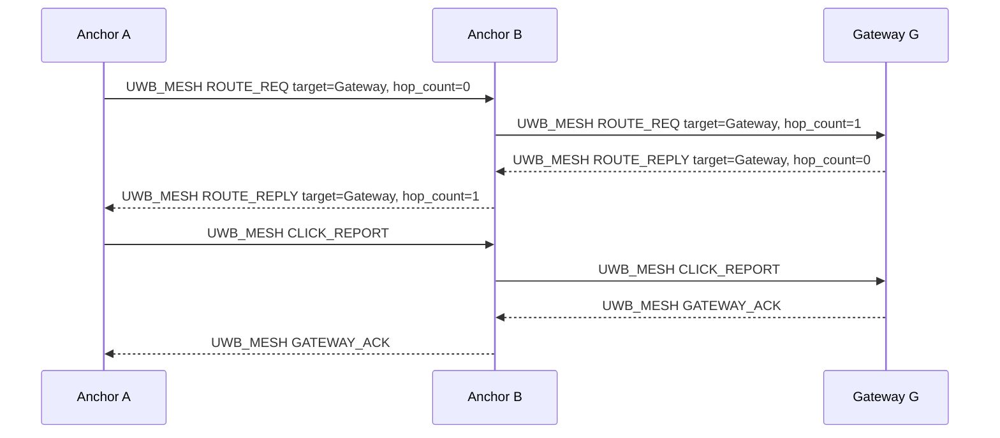

#internship #imec #protocol #documentation #UWB #BLE

# UWB+BLE Protocols and Strategies

Version: 0.2.5

Previous version: [[UWB+BLE Protocols and Strategies 0.2.4]]

This document defines the v1 wire protocol: binary packet formats, message types, TLVs, and forwarding rules. System architecture, timing budgets, power estimates, and state machine flows are in [[UWB+BLE Architecture 0.5.5]]. Runtime behavior and decision flows are in [[Firmware State Machines 0.1.21]].

## Changelog

### 2026-05-16 - 0.2.5

- Update cross-references after the architecture and state-machine wording cleanup. Clarify that route discovery requests are sent inside UWB mesh frames, not advertised.

### 2026-05-16 - 0.2.4

- Point protocol cross-references at the mandatory-IRQ architecture version after making the DWM3000 IRQ path required by design.

### 2026-05-16 - 0.2.3

- Move operational wake, discovery, ranging schedules, and mesh relay transport to UWB frames. BLE discovery payloads remain documented only as legacy compatibility payloads and are not part of the operational mesh path.
- Add nonce/network-tagged `WAKE_CLAIM`, `DISCOVER`, `DISCOVERY_REPLY`, `RANGE_SCHEDULE`, and `UWB_MESH` frames, plus `RANGE_TIMING_INVALID`.
- Replace legacy GATT mesh transport language with UWB mesh frame forwarding and UWB route-listen windows.
- Remove the Zephyr app dependency on legacy BLE discovery payloads; the BLE codec remains native compatibility coverage only.
- Reserve legacy `ROUTE_ADV`/`ROUTE_STATUS` message values and reject `RANGE_SCHEDULE` entries whose per-anchor DS-TWR sequence range would wrap.
- Require scheduled DS-TWR POLL frames to target the selected anchor short address; broadcast POLL is not valid for scheduled ranging.
- Require UWB wake, discovery, schedule, and DS-TWR session frames to carry exactly one mode bit: `DIAGNOSTIC` or `COUNT_AS_CLICK`. Frames with neither or both are invalid.

### 2026-05-05 - 0.2.2

- Remove the explicit mesh custody acknowledgement packet, the request flag for it, and retry rules tied to that packet. In the current UWB-only transport, UWB mesh TX/RX windows cover next-hop transfer; `GATEWAY_ACK` remains the end-to-end confirmation for gateway-bound traffic.

### 2026-05-05 - 0.2.1

- Add the `UWB_CIR_SAMPLE` TLV to click range reports. It carries one raw DWM3000 Ipatov accumulator complex sample from the integer first-path index and is included only on the first packet of an aggregated or fragmented range report.

### 2026-05-05 - 0.2

- Rewrite as a concise wire-protocol reference. Remove duplicated architecture, timing, power, and state-machine content already covered by the architecture and state-machines documents. Consolidate the 0.1.x changelog into this entry.
- Correct the packet header byte layout, field sizes, and byte order to match the firmware encode/decode implementation.
- Correct the BLE advertisement field layout to match the firmware discovery codec.
- Remove stale references to 200 ms discovery advertisements, 120 ms mesh advertisements, obsolete acknowledgement delay, and periodic ROUTE_ADV beacons.
- Document the COMMAND_ID and COMMAND_STATUS enumerated values.
- Document the RANGE_STATUS enumerated values.

## Abbreviations

| Abbreviation | Meaning |
| --- | --- |
| ACK | Acknowledgement. Confirms gateway delivery. |
| BLE | Bluetooth Low Energy. Retained for optional legacy local discovery payloads, not operational mesh transport. |
| COBS | Consistent Overhead Byte Stuffing. Frames binary packets over USB serial. |
| CRC | Cyclic Redundancy Check. Detects corrupted packets. |
| DS-TWR | Double-Sided Two-Way Ranging. UWB distance measurement. |
| STS | Scrambled Timestamp Sequence. DWM3000 secure ranging feature. |
| TLV | Type-Length-Value. Extensible payload field format. |
| TTL | Time To Live. Hop limit that prevents infinite forwarding. |
| UWB | Ultra-Wideband. Used for distance measurements. |

## Packet Envelope

All mesh payloads and USB packets use the shared IMEC binary envelope. UWB mesh frames wrap one shared packet for over-the-air relay. Legacy BLE discovery payloads and UWB control/ranging frames use separate compact layouts.

### Byte Layout

All multi-byte fields are little-endian.

| Offset | Size | Field | Purpose |
| --- | ---: | --- | --- |
| 0 | 1 | Magic | `0xC1`. Rejects non-IMEC data. |
| 1 | 1 | Version | `0x01`. Protocol version. |
| 2 | 1 | Message type | Selects the message family and handler. |
| 3 | 1 | Flags | `GATEWAY_ACK_REQUIRED`, `GATEWAY_ACK`, `DIAGNOSTIC`, `COUNT_AS_CLICK`, etc. |
| 4 | 8 | Source ID | Globally identifies the sender. |
| 12 | 8 | Destination ID | Target device, or `0x0000000000000000` for broadcast. |
| 20 | 4 | Session ID | Groups packets for one click, command, or survey. |
| 24 | 2 | Sequence | Sender-local packet number. Detects retries and duplicates. |
| 26 | 1 | TTL | Forwarding depth limit. Each relay decrements by 1. |
| 27 | 1 | Payload length | Number of TLV bytes that follow. |
| 28 | variable | Payload | TLV fields for the message type. |
| 28 + len | 2 | CRC16 | CRC-16/CCITT-FALSE over bytes 0 through 27 + len. Little-endian. |

Total header is 28 bytes. Maximum payload is 255 bytes. Maximum packet is 28 + 255 + 2 = 285 bytes.

USB serial wraps this with COBS framing. UWB mesh transport wraps one shared packet in a `UWB_MESH` frame with `network_id`, previous-hop ID, next-hop ID, packet length, and CRC. The maximum UWB mesh frame is 312 bytes: 25 bytes of UWB mesh header, one 285-byte shared packet, and a 2-byte frame CRC.

## Message Types

Message types are one byte on the wire. The ranges are a readability convention, not priority.

| Range | Family | Purpose |
| --- | --- | --- |
| `0x01-0x0F` | Discovery and UWB control | Legacy BLE payloads plus UWB wake/discovery/schedule/mesh control frames. |
| `0x10-0x1F` | UWB ranging | DS-TWR exchange frames. |
| `0x20-0x2F` | Device reports | Click reports, self-test reports, heartbeat/status. |
| `0x30-0x3F` | Mesh reliability/routing | Relay payloads, gateway ACKs, route discovery. |
| `0x40-0x4F` | Gateway commands | Extensible command and result messages. |
| `0x50-0x5F` | Anchor survey | Reachability and anchor-to-anchor distance measurements. |
| `0x7F` | Error | Common error response. |

| Value | Name | Direction |
| ---: | --- | --- |
| `0x01` | `BLE_DISCOVERY_REQ` | Clicker → Anchors (advertisement) |
| `0x02` | `BLE_DISCOVERY_READY` | Anchor → Clicker (advertisement) |
| `0x08` | `UWB_WAKE_CLAIM` | Clicker → Anchors (UWB long-preamble wake frame) |
| `0x09` | `UWB_DISCOVER` | Clicker → Selected anchors (UWB discovery frame) |
| `0x0A` | `UWB_DISCOVERY_REPLY` | Anchor → Selected clicker (UWB discovery slot reply) |
| `0x0B` | `UWB_RANGE_SCHEDULE` | Clicker → Selected anchors (UWB range schedule) |
| `0x0C` | `UWB_MESH` | Any relay → next hop or broadcast (UWB mesh frame) |
| `0x10` | `UWB_POLL` | Clicker → Anchor (UWB) |
| `0x11` | `UWB_RESP` | Anchor → Clicker (UWB) |
| `0x12` | `UWB_FINAL` | Clicker → Anchor (UWB) |
| `0x13` | `UWB_REPORT` | Anchor → Clicker (UWB) |
| `0x20` | `CLICK_REPORT` | Anchor → Gateway (mesh) |
| `0x21` | `SELF_TEST_REPORT` | Anchor → Gateway (mesh) |
| `0x22` | `ANCHOR_HEARTBEAT` | Anchor → Gateway (mesh) |
| `0x30` | `MESH_DATA` | Any → Any (inside UWB mesh frame) |
| `0x31` | Reserved | Do not emit in v1 firmware |
| `0x32` | `GATEWAY_ACK` | Gateway → Sender (end-to-end ACK inside UWB mesh frame) |
| `0x33-0x34` | Reserved | Legacy `ROUTE_ADV`/`ROUTE_STATUS`; do not emit in v1 firmware |
| `0x35` | `ROUTE_REQ` | Any → Broadcast (inside UWB mesh frame) |
| `0x36` | `ROUTE_REPLY` | Target → Requester (inside UWB mesh frame) |
| `0x40` | `COMMAND` | Gateway → Anchor (mesh) |
| `0x41` | `COMMAND_RESULT` | Anchor → Gateway (mesh) |
| `0x50` | `SURVEY_REACH_REQ` | Gateway → Anchors (mesh) |
| `0x51` | `SURVEY_REACH_REPORT` | Anchor → Gateway (mesh) |
| `0x52` | `SURVEY_PAIR_PREPARE` | Gateway → Anchor (mesh) |
| `0x53` | `SURVEY_PAIR_RESULT` | Anchor → Gateway (mesh) |
| `0x7F` | `MSG_ERROR` | Any → Any |

## Flags

| Bit | Name | Meaning |
| ---: | --- | --- |
| 0 | Reserved | Do not set in v1 firmware. |
| 1 | Reserved | Do not set in v1 firmware. |
| 2 | `GATEWAY_ACK_REQUIRED` | Gateway must send an end-to-end gateway ACK. |
| 3 | `GATEWAY_ACK` | This packet is a gateway ACK. |
| 4 | `DIAGNOSTIC` | Self-test traffic. Never counted as a real click. |
| 5 | `COUNT_AS_CLICK` | Normal click traffic. Mutually exclusive with `DIAGNOSTIC`. |
| 6 | `ERROR` | Packet carries an error indication. |

For UWB wake, discovery, range schedule, and DS-TWR frames, the flags byte must be exactly `DIAGNOSTIC` or exactly `COUNT_AS_CLICK`; no other packet flags are valid in these UWB session frames. The selected mode is part of the anchor ownership epoch and must match through `DISCOVER`, `RANGE_SCHEDULE`, `POLL`, `RESP`, `FINAL`, and `UWB_REPORT`.

## COMMAND_ID Values

| Value | Name | Purpose |
| ---: | --- | --- |
| `0x0001` | `CMD_PING` | Verify anchor is alive. |
| `0x0002` | `CMD_GET_STATUS` | Report role, uptime, battery, route, and radio status. |
| `0x0003` | `CMD_SET_LED_PATTERN` | Trigger a visible LED pattern on a specific anchor. |
| `0x0004` | `CMD_REBOOT` | Reboot the target anchor. |
| `0x0005` | `CMD_SET_ROLE` | Change the device role. |
| `0x0006` | `CMD_SET_ROUTE` | Set a route entry on the target. |
| `0x0007` | `CMD_CLEAR_ROUTE` | Clear a route entry on the target. |
| `0x0008` | `CMD_SET_SCAN_DUTY` | Change the low-duty UWB scan cadence. |
| `0x0009` | `CMD_START_HEARTBEAT` | Start periodic anchor health reports. |
| `0x000A` | `CMD_STOP_HEARTBEAT` | Stop periodic anchor health reports. |
| `0x0100` | `CMD_SURVEY_REACHABILITY` | Start anchor reachability survey. |
| `0x0101` | `CMD_SURVEY_PREPARE_PAIR` | Prepare an anchor pair for UWB ranging. |
| `0x0102` | `CMD_SURVEY_START_PAIR` | Start UWB ranging for a prepared pair. |
| `0x0103` | `CMD_SURVEY_ABORT` | Abort the current survey. |
| `0x8000` | `CMD_VENDOR_BASE` | Base for vendor-specific commands. |

## COMMAND_STATUS Values

| Value | Name | Meaning |
| ---: | --- | --- |
| 0 | `COMMAND_OK` | Command succeeded. |
| 1 | `COMMAND_UNSUPPORTED_COMMAND` | Command ID not recognised. |
| 2 | `COMMAND_MALFORMED_PAYLOAD` | TLV payload could not be parsed. |
| 3 | `COMMAND_BUSY` | Only one outstanding command at a time. |
| 4 | `COMMAND_DENIED` | Command not allowed in current state. |
| 5 | `COMMAND_TIMEOUT` | No matching command result within 5 s. |
| 6 | `COMMAND_RADIO_ERROR` | UWB radio failure. |
| 7 | `COMMAND_INVALID_STATE` | Device not in the right state for this command. |
| 8 | `COMMAND_INTERNAL_ERROR` | Unexpected firmware error. |

## RANGE_STATUS Values

| Value | Name | Meaning |
| ---: | --- | --- |
| 0 | `RANGE_OK` | Successful range. |
| 1 | `RANGE_RX_TIMEOUT` | No response received within timeout. |
| 2 | `RANGE_RX_ERROR` | General receive error. |
| 3 | `RANGE_BAD_FRAME` | Frame decoded but failed validation. |
| 4 | `RANGE_WRONG_TARGET` | Frame addressed to a different device. |
| 5 | `RANGE_STS_QUALITY_FAIL` | STS quality check failed. |
| 6 | `RANGE_DELAYED_TX_MISSED` | Delayed TX start deadline was missed. |
| 7 | `RANGE_INTERNAL_ERROR` | Unexpected driver error. |
| 8 | `RANGE_TIMING_INVALID` | Equal reply-delay validation failed; discard the exchange. |

## TLVs

TLVs let command and report payloads grow without changing the fixed packet header. Unknown TLVs are skipped unless the specific message handler marks them as mandatory.

| ID | Name | Value size | Meaning |
| --- | --- | ---: | --- |
| `0x01` | `DEVICE_ROLE` | 1 | Clicker, anchor, or gateway. |
| `0x02` | `BATTERY_MV` | 2 | Battery voltage in millivolts. |
| `0x03` | `STATUS_BITS` | 4 | Health bitfield for module state, charging, and faults. |
| `0x04` | `ERROR_CODE` | 1 or 2 | Machine-readable failure reason. |
| `0x05` | `ERROR_DETAIL` | variable | Extra debug context. Not part of normal control flow. |
| `0x06` | `EVENT_SEQ` | 4 | Clicker-local event counter. Correlates anchor reports for one click or self-test. |
| `0x07` | `TIMESTAMP_MS` | 4 | Local millisecond timestamp. Not trusted as global time. |
| `0x08` | `RSSI_DBM` | 1 (i8) | Legacy signal strength hint for route quality. |
| `0x09` | `UWB_SHORT_ADDR` | 2 | Compact address used inside UWB frames in place of 64-bit IDs. |
| `0x0A` | `ANCHOR_ID` | 8 | Anchor that measured, relayed, or reported data. |
| `0x0B` | `CLICKER_ID` | 8 | Clicker that originated a click or self-test. |
| `0x0C` | `DISTANCE_MM` | 4 (i32) | Millimeter distance. Averaged for aggregated click ranges. Negative = invalid. |
| `0x0D` | `QUALITY` | 1 | Normalized 1-100 range quality score. |
| `0x0E` | `SAMPLE_INDEX` | 2 | First sample index in this packet for fragmented reports. |
| `0x0F` | `SAMPLE_COUNT` | 2 | Total measurement count for the whole aggregate. |
| `0x10` | `COMMAND_ID` | 2 | Selects the gateway command being executed. |
| `0x11` | `COMMAND_STATUS` | 1 | Result of a command (`COMMAND_OK`, `COMMAND_TIMEOUT`, etc.). |
| `0x12` | `REQUESTED_MSG_SEQ` | 2 | Packet sequence number being acknowledged or referenced. |
| `0x13` | `NEXT_HOP_ID` | 8 | Selected next neighbor in a mesh route. |
| `0x14` | `GATEWAY_ID` | 8 | Gateway root expected to receive reports and send gateway ACKs. |
| `0x15` | `SURVEY_ID` | 4 | Groups all reachability and pair measurements for one survey. |
| `0x16` | `PEER_ID_LIST` | variable (8 × count) | Reachable anchor IDs. |
| `0x17` | `REACHABILITY_ENTRY` | variable | One reachable peer plus signal/quality metadata. |
| `0x18` | `RANGE_FLAGS` | 1 or 2 | Marks diagnostic, survey, click-related, or retry ranging. |
| `0x19` | `LED_PATTERN_ID` | 1 | Gateway-selected LED pattern for setup/testing. |
| `0x1A` | `DURATION_MS` | 4 | Duration for LED patterns, scan windows, or survey slots. |
| `0x1B` | `RETRY_COUNT` | 1 or 2 | Retries attempted or allowed. |
| `0x1C` | `FW_VERSION` | variable | Firmware version string. |
| `0x1D` | `UPTIME_MS` | 4 | Device uptime in milliseconds. |
| `0x1E` | `REASON` | 1 or 2 | Short reason code for route changes, survey aborts, and command denials. |
| `0x1F` | `INITIATOR_ID` | 8 | Anchor or clicker that starts a UWB ranging exchange. |
| `0x20` | `RESPONDER_ID` | 8 | Anchor expected to respond in UWB ranging. |
| `0x21` | `RANGE_STATUS` | 1 | UWB result status (`RANGE_OK`, `RANGE_RX_TIMEOUT`, etc.). |
| `0x22` | `ROUTE_EPOCH` | 4 | Gateway-selected route generation. Newer epochs invalidate older candidates. |
| `0x23` | `HOP_COUNT` | 1 | Route-discovery hop distance. |
| `0x24` | `UWB_RSL_DBM` | 1 (i8) | UWB received signal level in dBm. `0` = unavailable. Read once per aggregated anchor report, not per sample. |
| `0x25` | `DISTANCE_SAMPLES_MM` | variable (4 × count) | Packed `i32` little-endian millimeter distances for aggregated click ranges. |
| `0x26` | `UWB_CIR_SAMPLE` | 6 | One raw DWM3000 Ipatov accumulator complex sample from the integer first-path index. Bytes are the device accumulator order: 24-bit real part followed by 24-bit imaginary part. Included only on the first packet of an aggregated or fragmented click range report. |

## Legacy BLE Discovery Payloads

These payloads are retained for native compatibility tests and historical decoders. The Zephyr app no longer builds the legacy BLE discovery runtime. Operational click discovery uses the UWB wake/discovery frames below.

All discovery advertisements start with the 16-bit company ID, protocol version, and BLE message type. A clicker discovery request then carries:

| Field | Size | Purpose |
| --- | ---: | --- |
| Clicker ID | 64 bits | Identifies the clicker asking to range. |
| Event sequence | 32 bits | Groups all READY replies, UWB exchanges, and reports for this click or diagnostic event. |
| Flags | 8 bits | `COUNT_AS_CLICK` for normal traffic, `DIAGNOSTIC` for self-test. Mutually exclusive. |
| Attempt index | 8 bits | Wake attempt number for this click event. |
| READY scan starts in | 16 bits | Milliseconds from this payload until the clicker stops wake advertising and starts its READY scan. |
| READY scan duration | 16 bits | Duration of the addressed READY scan window. |
| Minimum anchor count | 8 bits | Number of unique successfully ranged anchors required for normal-click success. |
| Priority ID | 64 bits | Deterministic arbitration value; lower values win. The firmware uses the clicker device ID. |

An addressed READY advertisement carries anchor ID, selected clicker ID, selected event sequence, UWB short address, flags, attempt index, RSSI hint, status, and the selected priority value seen by the anchor. Clickers ignore READY advertisements not addressed to their current clicker ID, event sequence, attempt index, and flag mode.

## UWB Wake, Discovery, And Schedule Frames

Every UWB control frame begins with marker `0xCA`, version `0x01`, and a type byte, and ends with CRC-16/CCITT-FALSE over the frame bytes before the CRC. Multi-byte fields are little-endian.

| Frame | Length | Required identity/freshness fields | Purpose |
| --- | ---: | --- | --- |
| `WAKE_CLAIM` | 49 B | `network_id`, `clicker_id`, `click_event_id`, `attempt_index`, `priority_id`, `nonce`, wake/ranging channels, flags | Repeated long-preamble wake claim. Anchors create or update an ownership epoch only after this CRC-valid frame decodes. |
| `DISCOVER` | 32 B | `network_id`, `clicker_id`, `click_event_id`, `attempt_index`, `nonce`, flags | Sent by the selected clicker after the wake train. Anchors reply only if it matches their epoch. |
| `DISCOVERY_REPLY` | 44 B | `network_id`, `anchor_id`, `selected_clicker_id`, `click_event_id`, `attempt_index`, `nonce`, slot, status, quality, flags | Presence-only static-slot reply. It is not a range measurement. |
| `RANGE_SCHEDULE` | 40-120 B | `network_id`, `clicker_id`, `click_event_id`, `attempt_index`, `nonce`, ranging channel, reply delay, poll timing, selected anchors | Authorizes selected anchors and serializes DS-TWR poll order. Samples are round-robin across anchors. |

Anchors reject schedules that do not match the active epoch, wrong network/channel/nonce, unsafe reply delays, duplicate selected anchors, missing selected samples, or per-anchor sequence ranges that would wrap past `255`.

## UWB Ranging Frames

Timing-critical UWB DS-TWR frames use a compact 25-byte header before the radio FCS:

| Field | Size | Purpose |
| --- | ---: | --- |
| Marker | 8 bits | Rejects non-IMEC UWB frames. |
| Version | 8 bits | UWB frame format version. |
| Type | 8 bits | Poll, response, final, or report. |
| Sequence | 8 bits | Identifies one DS-TWR attempt inside the click event. |
| Network ID | 32 bits | Rejects frames from another deployment. |
| Session ID | 32 bits | Click or diagnostic event sequence. |
| Session nonce | 64 bits | Freshness token from the selected wake epoch. |
| Initiator short address | 16 bits | Compact UWB address derived from the initiator ID. |
| Responder short address | 16 bits | Compact UWB address derived from the selected anchor ID. |
| Flags | 8 bits | Normal click versus diagnostic. |

Frame sizes before the radio FCS: poll 25 B, response 33 B, final 37 B, report 33 B. Full 64-bit IDs stay out of the timing-critical DS-TWR path; the schedule binds anchor IDs to short addresses and sequence numbers. For the DS-TWR timing rationale, equal reply-delay validation, and timing rejection policy, see [[UWB+BLE Architecture 0.5.5]].

For scheduled ranging, each POLL must use the selected anchor's short address from the schedule. Broadcast POLL is reserved for unscheduled bring-up diagnostics and must not drive a scheduled anchor response.

## Mesh Protocol

The mesh is reactive. Nodes discover a path when a real packet needs one, then send shared packets inside UWB mesh frames while the route stays fresh. For the full route state, cost formula, retry behavior, and click-priority details, see [[UWB+BLE Architecture 0.5.5]].

### Mesh Packet Shapes

| Packet | Header flags | Main payload TLVs | Purpose |
| --- | --- | --- | --- |
| Gateway-bound report | `GATEWAY_ACK_REQUIRED`; `src_id`=anchor; `dst_id`=gateway; `ttl=4` | `CLICKER_ID`, `ANCHOR_ID`, `EVENT_SEQ`, `DISTANCE_MM`, `SAMPLE_COUNT`, `DISTANCE_SAMPLES_MM`, `QUALITY`, `RANGE_STATUS`, `UWB_RSL_DBM`, `UWB_CIR_SAMPLE` | Carries measured data toward the gateway. Click reports set `COUNT_AS_CLICK`; self-test sets `DIAGNOSTIC`. |
| Gateway ACK | `GATEWAY_ACK`; `src_id`=gateway; `dst_id`=original source; `ttl=4` | `REQUESTED_MSG_SEQ` | Confirms the gateway received the original packet. Routed back like a normal packet inside UWB mesh frames. |
| Gateway command | none; `src_id`=gateway; `dst_id`=target anchor; `ttl=4` | `COMMAND_ID` plus command-specific TLVs | Extensible command to one anchor. Completion is the matching `COMMAND_RESULT`. |
| Command result | `GATEWAY_ACK_REQUIRED`; `src_id`=target; `dst_id`=gateway; `ttl=4` | `COMMAND_ID`, `COMMAND_STATUS`, optional `ERROR_CODE` or result TLVs | Returns command outcome to the gateway. |
| Route request | `src_id`=requester; `dst_id`=broadcast; `ttl=4` | `INITIATOR_ID`, `RESPONDER_ID`, `ROUTE_EPOCH`, `HOP_COUNT`, `QUALITY` | UWB mesh discovery request. |
| Route reply | `src_id`=target; `dst_id`=requester; `ttl=4` | `INITIATOR_ID`, `RESPONDER_ID`, `ROUTE_EPOCH`, `HOP_COUNT`, `QUALITY` | UWB mesh discovery reply along the reverse path. |

### Forwarding Rules

1. **Validate** magic, version, payload length, and CRC. Invalid packets are dropped.
2. **Detect duplicates** by `(msg_type, src_id, dst_id, session_id, seq)`. A local duplicate is not delivered twice; the gateway may re-emit a gateway ACK. A directed duplicate that still needs forwarding is re-forwarded only when the relay is not already tracking a gateway-bound transmission. Duplicate cache entries expire after 60 s.
3. **Busy relay**: if a new packet would require forwarding or an immediate local response while the node already has a tracked gateway-bound transmission in flight, drop it and do not cache the duplicate.
4. **Local delivery**: if `dst_id` is this node, handle locally. Gateways emit `GATEWAY_ACK` for gateway-bound packets that requested it. Anchors receiving a command emit `COMMAND_RESULT`.
5. **TTL zero**: if `dst_id` is not local and `ttl` is zero, drop and record a route failure.
6. **Route selection**: expire stale candidates older than 30 s, then select the next hop. Routes use `effective_cost = hop_count * 100 + (100 - quality)`. Ties are broken by higher quality, fewer hops, newer observation time, then lower next-hop ID. See [[UWB+BLE Architecture 0.5.5]] for the full cost derivation and quality mapping.
7. **Forward** the same packet with `ttl - 1`. Relays never rewrite `src_id`, `dst_id`, `session_id`, `seq`, or payload.
8. **Gateway ACK**: for gateway-bound packets with `GATEWAY_ACK_REQUIRED`, keep the original sender's packet pending until the gateway ACK arrives or 2 s expires. Missing gateway ACKs retry the selected route up to three failures before rediscovery.
9. **Command serialization**: the gateway tracks one outstanding command at a time. A second command is rejected with `COMMAND_BUSY`. A matching `COMMAND_RESULT` clears the wait; no result within 5 s emits `COMMAND_TIMEOUT` over USB.
10. **Click priority**: a valid `WAKE_CLAIM` preempts active mesh forwarding and clears pending mesh RX work. Already-built local click reports are requeued for later delivery. See [[UWB+BLE Architecture 0.5.5]] for the full click-priority mechanism.

### Route Formation

1. A sender with data and no usable route sends `ROUTE_REQ` inside UWB mesh frames during its route-listen opportunity.
2. Every receiver stores a reverse breadcrumb to the requester through the previous hop.
3. If the receiver is not the target, it rebroadcasts with `HOP_COUNT + 1` and reduced path quality (weakest-link propagation).
4. The target sends `ROUTE_REPLY` back through the reverse path.
5. Every receiver of the reply stores a route to the target through the previous hop.
6. The requester sends the data packet inside a UWB mesh frame to the selected next hop. All subsequent data, gateway ACKs, and command results for that route also travel inside UWB mesh frames.

### Downlink Directory

The gateway keeps a flat `target_id → next_hop_id` directory, not a full topology map. If no entry exists for a target, the gateway sends a `ROUTE_REQ` inside a UWB mesh frame and keeps the USB command pending. The gateway serializes commands: only one outstanding command at a time.

For `CMD_GET_STATUS`, the response includes `DEVICE_ROLE`, `UPTIME_MS`, `STATUS_BITS`, `GATEWAY_ID`, and either route fields (`NEXT_HOP_ID`, `ROUTE_EPOCH`, `HOP_COUNT`, `QUALITY`, `RETRY_COUNT`) or `REASON=7` (`NOT_FOUND`) when no upstream route is selected.

### Report Fragmentation

An unfragmented aggregated click report can carry the configured single-packet sample limit inside one UWB mesh frame when diagnostic TLVs are present. If the anchor measured more samples, it sends multiple `CLICK_REPORT` packets for the same `(anchor_id, clicker_id, event_seq)`. The first packet carries one rounded-average `DISTANCE_MM`, one `QUALITY`, one `RANGE_STATUS`, one total `SAMPLE_COUNT`, the `UWB_RSL_DBM` TLV, the `UWB_CIR_SAMPLE` TLV, and the first chunk of `DISTANCE_SAMPLES_MM`. Subsequent packets carry the same aggregate fields, a `SAMPLE_INDEX` pointing to the first sample in that chunk, and the next sample chunk. `UWB_RSL_DBM` and `UWB_CIR_SAMPLE` appear only once per aggregate because DWM3000 RX diagnostics are sampled at most once per anchor UWB window.

### Duplicate Handling

If a relay receives a directed-unicast retry whose identity is already in its 60 s duplicate cache:
- **Idle with a route**: re-forward the packet. The duplicate cache prevents double delivery.
- **Busy or no route**: drop the packet. The sender retries later if its end-to-end confirmation times out.

Local or broadcast duplicates are not delivered twice.

## Self-Test and Diagnostic Flags

Self-test traffic sets `DIAGNOSTIC` and clears `COUNT_AS_CLICK`. Normal click traffic sets `COUNT_AS_CLICK` and clears `DIAGNOSTIC`. The firmware rejects packets where both flags are set. This prevents self-test dud events from appearing as real clicks in the server event stream. For the full self-test sequence, LED patterns, and click failure codes, see [[UWB+BLE Architecture 0.5.5]].

## Anchor Self-Distance Survey

The gateway starts survey setup by asking anchors for reachability. Anchors report which other anchors they can reach, producing a graph of possible measurement pairs. The gateway then schedules individual anchor pairs and requests exactly `n` measurements for each pair.

Pair measurements report `SURVEY_ID`, `INITIATOR_ID`, `RESPONDER_ID`, `SAMPLE_INDEX`, `SAMPLE_COUNT`, `DISTANCE_MM`, `QUALITY`, and `RANGE_STATUS`. The firmware only measures and reports; solving anchor positions from this distance network is off-site software.
