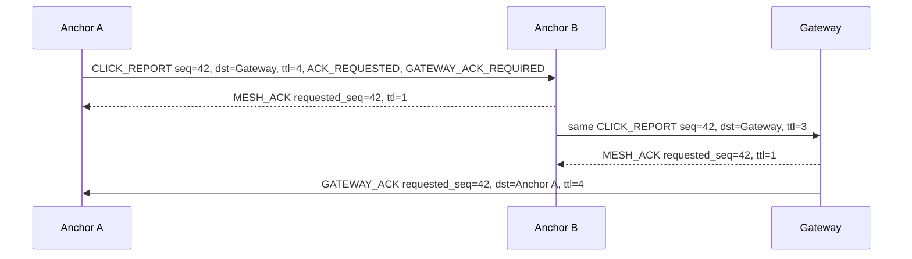
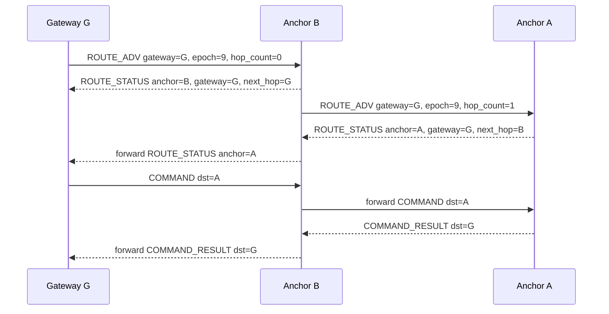

# UWB+BLE Protocols and Strategies

This document describes the v1 firmware wire protocol and the implementation strategies that go with it. It is deliberately separate from the architecture document so protocol choices can be reviewed without rereading the hardware and product context.

## Abbreviations

| Abbreviation | Meaning |
| --- | --- |
| ACK | Acknowledgement. A receiver confirms that it accepted a packet. |
| BLE | Bluetooth Low Energy. Used for clicker discovery and low-rate mesh communication. |
| COBS | Consistent Overhead Byte Stuffing. Used to frame binary packets over USB serial. |
| CRC | Cyclic Redundancy Check. Used to detect corrupted packets. |
| DS-TWR | Double-Sided Two-Way Ranging. The UWB exchange used to estimate distance. |
| SPIM3 | nRF52833 high-speed SPI master instance that supports 32 MHz. |
| STS | Scrambled Timestamp Sequence. DWM3000 secure ranging feature used for better timestamp integrity. |
| TLV | Type-Length-Value. A small typed field inside a message payload. |
| TTL | Time To Live. Hop limit used to stop mesh packets from circulating forever. |
| UWB | Ultra-Wideband. Used for distance measurements. |

## Packet Envelope

All non-advertising packets use the shared IMEC packet envelope:

| Field | Size | Purpose |
| --- | ---: | --- |
| Magic | 1 byte | Rejects non-IMEC data early. |
| Version | 1 byte | Allows incompatible protocol updates later. |
| Message type | 1 byte | Selects the message family and handler. |
| Flags | 1 byte | Carries ACK, diagnostic, gateway ACK, and click-count semantics. |
| Source ID | 64 bits | Globally identifies the sending clicker, anchor, or gateway. |
| Destination ID | 64 bits | Globally identifies the target, or a broadcast/special target when defined. |
| Session ID | 32 bits | Groups packets that belong to the same click, command, route update, or survey run. |
| Sequence | 16 bits | Detects retries, stale ACKs, and duplicate reports. |
| TTL | 8 bits | Limits mesh forwarding depth. |
| Payload length | 8 bits | Number of TLV payload bytes. |
| Payload | 0-255 bytes | TLVs for the selected message type. |
| CRC16 | 16 bits | Covers the envelope and payload. |

USB serial frames wrap this binary packet with COBS. BLE advertisements use compact fixed layouts for discovery because advertisements have tight payload limits.

## Why Message Types Are Numbered

Message types are numbered because they are transmitted as one byte on BLE, UWB, mesh, and USB links. The number is the stable wire value. The ranges are only a readability convention, not priority:

| Range | Family | Reason |
| --- | --- | --- |
| `0x01-0x0F` | BLE discovery | Compact bootstrap messages before UWB ranging starts. |
| `0x10-0x1F` | UWB ranging | Poll, response, final, and report exchange frames. |
| `0x20-0x2F` | Device reports | Click reports, self-test reports, and heartbeat/status data. |
| `0x30-0x3F` | Mesh reliability/routing | Relay payloads, hop ACKs, gateway ACKs, and route state. |
| `0x40-0x4F` | Gateway commands | Extensible command and result messages. |
| `0x50-0x5F` | Anchor survey | Anchor reachability and anchor-to-anchor distance measurement. |
| `0x7F` | Error | Common error response when a message cannot be handled normally. |

## TLVs

TLVs let command and report payloads grow without changing the fixed packet header. Unknown TLVs are skipped unless the specific message handler marks them as mandatory.

| ID | Name | Value | System meaning |
| --- | --- | --- | --- |
| `0x01` | `DEVICE_ROLE` | `u8` | Reports whether a device is acting as clicker, anchor, or gateway. Used in status, command results, and diagnostics. |
| `0x02` | `BATTERY_MV` | `u16` | Reports battery voltage in millivolts so the gateway can flag low-power clickers or anchors. |
| `0x03` | `STATUS_BITS` | `u32` | Compact health bitfield for module state, charging state, and locally detected faults. |
| `0x04` | `ERROR_CODE` | `u8/u16` | Machine-readable reason a command, route, range, or self-test failed. |
| `0x05` | `ERROR_DETAIL` | bytes/string | Extra debug context for logs. It is not part of normal control flow. |
| `0x06` | `EVENT_SEQ` | `u32` | Clicker-local event counter used to correlate all anchor reports for one click or diagnostic dud request. |
| `0x07` | `TIMESTAMP_MS` | `u32` | Local millisecond timestamp for ordering reports and debugging timing. It is not trusted as global time. |
| `0x08` | `RSSI_DBM` | `i8` | BLE signal hint used for diagnostics and possible route/reachability heuristics. |
| `0x09` | `UWB_SHORT_ADDR` | `u16` | Short address used inside UWB frames when the full 64-bit ID would be too large or too slow. |
| `0x0A` | `ANCHOR_ID` | `u64` | Identifies the anchor that measured, relayed, or reported data. |
| `0x0B` | `CLICKER_ID` | `u64` | Identifies the clicker that originated a click or diagnostic self-test request. |
| `0x0C` | `DISTANCE_MM` | `i32` | Ranging result in millimeters. Negative values are reserved for invalid or unavailable measurements. |
| `0x0D` | `QUALITY` | `u8` | Normalized range quality score so downstream processing can reject weak measurements. |
| `0x0E` | `SAMPLE_INDEX` | `u16` | Index of one measurement inside an `n`-sample survey or repeated diagnostic run. |
| `0x0F` | `SAMPLE_COUNT` | `u16` | Total requested measurements for a survey pair or repeated diagnostic range. |
| `0x10` | `COMMAND_ID` | `u16` | Selects the gateway command being executed. Leaves room for many future anchor commands. |
| `0x11` | `COMMAND_STATUS` | `u8` | Result of a command: OK, unsupported, malformed, busy, denied, timeout, radio error, invalid state, or internal error. |
| `0x12` | `REQUESTED_MSG_SEQ` | `u16` | Identifies the original packet sequence being acknowledged or referenced by an error. |
| `0x13` | `NEXT_HOP_ID` | `u64` | Names the selected next anchor in a mesh route. Used by route control and debugging. |
| `0x14` | `GATEWAY_ID` | `u64` | Names the gateway/root expected to receive reports and send end-to-end ACKs. |
| `0x15` | `SURVEY_ID` | `u32` | Groups all reachability and pair measurements belonging to one anchor setup survey. |
| `0x16` | `PEER_ID_LIST` | repeated `u64` | Lists anchors a device can currently hear, used to build the reachability graph. |
| `0x17` | `REACHABILITY_ENTRY` | structured bytes | Reports one reachable peer plus signal/quality metadata. Used before scheduling pair measurements. |
| `0x18` | `RANGE_FLAGS` | `u8/u16` | Marks a range as diagnostic, survey, click-related, retry, or otherwise special. |
| `0x19` | `LED_PATTERN_ID` | `u8` | Gateway-selected status LED pattern for test, setup, or operator feedback commands. |
| `0x1A` | `DURATION_MS` | `u32` | Duration for LED patterns, scan windows, survey slots, or temporary operating modes. |
| `0x1B` | `RETRY_COUNT` | `u8/u16` | Number of retries already attempted or allowed for an operation. |
| `0x1C` | `FW_VERSION` | bytes/string | Firmware version reported during heartbeat, status, and diagnostics. |
| `0x1D` | `UPTIME_MS` | `u32` | Device uptime for diagnosing reboots and ordering local events. |
| `0x1E` | `REASON` | `u8/u16` | Short reason code for route changes, survey aborts, and command denials. |
| `0x1F` | `INITIATOR_ID` | `u64` | Anchor or clicker that starts a UWB ranging exchange. Required for survey pair scheduling. |
| `0x20` | `RESPONDER_ID` | `u64` | Anchor expected to respond in a UWB ranging exchange. Required for survey pair scheduling. |
| `0x21` | `RANGE_STATUS` | `u8` | UWB result status such as OK, timeout, bad frame, wrong target, STS quality fail, or missed delayed TX. |
| `0x22` | `ROUTE_EPOCH` | `u32` | Gateway-selected route generation. A newer epoch invalidates older route candidates. |
| `0x23` | `HOP_COUNT` | `u8` | Number of mesh hops from this sender to the gateway. Used to prefer shorter routes. |

## Self-Test Strategy

The clicker self-test is activated by a long press followed by a short press within the documented arm window. Self-test traffic sets `DIAGNOSTIC` and clears `COUNT_AS_CLICK`; servers and gateways must never count it as a real click.

Self-test performs local module checks first, then emits a diagnostic BLE discovery request and a dud UWB ranging request. The dud request exercises the same BLE/UWB path as a real click but is explicitly diagnostic. Status LEDs show the result using the documented pattern table in the architecture document.

Anchors are BLE-gated for both real and diagnostic clicker-originated ranging. An anchor low-duty scans BLE while the DWM3000 is idle/asleep. After it decodes a valid discovery request, it advertises READY and opens a bounded UWB responder window. The current MVP keeps this window open for 400 ms so the clicker can complete sequential DS-TWR with up to 8 discovered anchors. When the window expires, the anchor closes READY advertising, returns DWM3000 to standby, and resumes low-duty BLE scanning.

The MVP click path collects up to 8 READY anchors, deduplicates them by anchor ID, scores them by reciprocal RSSI, ranges them sequentially, and builds one click report packet per successful DS-TWR result. Full v1 still needs explicit partial-failure packets, mesh forwarding, hop ACKs, and gateway ACKs.

## Mesh Protocol

The most useful way to picture the mesh is not "every node knows the whole network." It is simpler than that:

- A packet is an envelope with a final `src_id` and final `dst_id`.
- The current device only asks: "Which neighbor should I hand this envelope to next?"
- A hop ACK means: "that neighbor got the envelope from me."
- A gateway ACK means: "the gateway eventually got the envelope."
- A command result means: "the target anchor actually handled the command."

So if Anchor A wants to send a report to Gateway G through Anchor B, A does not need a full map. A only needs to know "to reach G, hand this to B." B then makes the same decision from its own route table.

Route discovery uses two message ideas:

- `ROUTE_ADV`: "I know a way to Gateway G. It is this many hops away."
- `ROUTE_STATUS`: "I am Anchor A. I currently reach Gateway G through this path. Remember that if you need to send something back to me."

That is the whole mesh model. Gateway advertisements teach anchors how to send upstream. Anchor status packets teach the gateway and relays how to send back downstream.

| Concept | Meaning |
| --- | --- |
| End-to-end source | `src_id`. The device that originally created the packet. Relays do not rewrite it. |
| End-to-end destination | `dst_id`. The final receiver, usually the gateway for reports or an anchor for commands. Relays do not rewrite it. |
| Local next hop | The neighbor chosen from the route table for this one transmission. It is transport state, not the packet destination. Route/status packets can expose it with `NEXT_HOP_ID`. |
| Upstream route | A route from an anchor toward a gateway. Used for reports, heartbeats, survey results, and command results. |
| Downlink route | A route from the gateway toward an anchor. Learned from anchor route status packets traveling upstream. Used for gateway commands. |
| Sequence | `seq`. The sender's packet number inside `session_id`. ACKs reference this value with `REQUESTED_MSG_SEQ`. |
| TTL | Forwarding budget. Each relay decrements `ttl`; packets with no remaining budget are dropped and reported as route failures. |
| Hop ACK | `MESH_ACK`. A local receipt from the next hop saying "I accepted your packet." |
| Gateway ACK | `GATEWAY_ACK`. An end-to-end receipt from the gateway saying "the gateway received the original packet." |

### Mesh Packet Shapes

| Packet | Header shape | Main payload TLVs | Purpose |
| --- | --- | --- | --- |
| Gateway-bound report | `msg_type=CLICK_REPORT`, `SELF_TEST_REPORT`, `SURVEY_RESULT`, or other report; `flags=ACK_REQUESTED | GATEWAY_ACK_REQUIRED`; `src_id=reporting anchor`; `dst_id=gateway`; `ttl=4` | Report-specific TLVs such as `CLICKER_ID`, `ANCHOR_ID`, `EVENT_SEQ`, `DISTANCE_MM`, `QUALITY`, `RANGE_STATUS` | Carries measured data toward the gateway. A real click also sets `COUNT_AS_CLICK`; diagnostic traffic sets `DIAGNOSTIC` and clears `COUNT_AS_CLICK`. |
| Hop ACK | `msg_type=MESH_ACK`; `flags=HOP_ACK`; `src_id=receiver`; `dst_id=previous hop`; `ttl=1` | `REQUESTED_MSG_SEQ` | Confirms one radio hop only. It does not mean the gateway received the packet. |
| Gateway ACK | `msg_type=GATEWAY_ACK`; `flags=GATEWAY_ACK`; `src_id=gateway`; `dst_id=original source`; `ttl=4` | `REQUESTED_MSG_SEQ` | Confirms the gateway received the original gateway-bound packet. This ACK can itself travel through the mesh and receive hop ACKs on the way back. |
| Gateway command | `msg_type=COMMAND`; `flags=ACK_REQUESTED`; `src_id=gateway`; `dst_id=target anchor`; `ttl=4` | `COMMAND_ID` plus command-specific TLVs | Sends an extensible command to one anchor. Delivery is confirmed hop by hop; target acceptance is confirmed by `COMMAND_RESULT`. |
| Command result | `msg_type=COMMAND_RESULT`; `flags=ACK_REQUESTED | GATEWAY_ACK_REQUIRED`; `src_id=target anchor`; `dst_id=gateway`; `ttl=4` | `COMMAND_ID`, `COMMAND_STATUS`, optional `ERROR_CODE` or result TLVs | Returns the command outcome to the gateway using the same reliable gateway-bound path as reports. |
| Route advertisement | `msg_type=ROUTE_ADV`; `src_id=advertising node`; `dst_id=broadcast or neighbor`; `ttl=1` for local advertisements | `GATEWAY_ID`, `ROUTE_EPOCH`, `HOP_COUNT`, `QUALITY`, optional `NEXT_HOP_ID` | Announces a possible route to the gateway. Anchors use this to populate their route tables. |
| Route status | `msg_type=ROUTE_STATUS`; `flags=ACK_REQUESTED | GATEWAY_ACK_REQUIRED`; `src_id=anchor`; `dst_id=gateway` | `ANCHOR_ID`, `GATEWAY_ID`, `NEXT_HOP_ID`, `ROUTE_EPOCH`, `HOP_COUNT`, `QUALITY`, `RETRY_COUNT`, optional `REASON` | Registers an anchor with the gateway, reports the selected upstream route, and teaches relays the reverse downlink path. |

### Example: Report Through One Relay

In this example Anchor A cannot reach the gateway directly, so it sends through Anchor B. The original packet keeps `src_id=Anchor A` and `dst_id=Gateway` the whole time.

The first ACK tells Anchor A that Anchor B accepted the packet. The gateway ACK tells Anchor A that the gateway eventually received it. If the gateway ACK is routed back through Anchor B, that return packet uses the same hop-ACK rules in the reverse direction.

### Forwarding Rules

1. Validate magic, version, payload length, and CRC. Invalid packets are dropped.
2. Detect duplicates by `msg_type`, `src_id`, `session_id`, and `seq`. If a duplicate requested a hop ACK, ACK it again but do not process the payload twice.
3. If `dst_id` is local, handle the packet locally. A gateway emits `GATEWAY_ACK` for gateway-bound packets that requested it. An anchor receiving a command emits `COMMAND_RESULT`.
4. If `dst_id` is not local and `ttl` is zero, drop the packet and record a route failure.
5. Select the local next hop from the route table. Routes prefer newest `ROUTE_EPOCH`, lower `HOP_COUNT`, higher `QUALITY`, newer observation time, then lower next-hop ID for deterministic tie breaking.
6. Forward the same packet with `ttl - 1`. Relays do not rewrite `src_id`, `dst_id`, `session_id`, `seq`, or payload.
7. If `ACK_REQUESTED` is set, wait up to `ROUTE_HOP_ACK_TIMEOUT_MS` for `MESH_ACK` with matching `REQUESTED_MSG_SEQ`.
8. Retry the current route until its failure count reaches `ROUTE_MAX_FAILURES`. Then try an alternate route. If no alternate exists, return to route discovery and report the reason.
9. For gateway-bound packets with `GATEWAY_ACK_REQUIRED`, keep the packet pending until the gateway ACK arrives or `ROUTE_GATEWAY_ACK_TIMEOUT_MS` expires.

### Route Formation

The mesh is built from two simple flows. I would explain it to myself like this:

1. The gateway says, "I am Gateway G, and I am zero hops away from myself."
2. Any anchor that hears that says, "I can reach Gateway G directly."
3. That anchor repeats the advertisement as, "I can reach Gateway G in one hop."
4. Farther anchors hear that and say, "I can reach Gateway G through that anchor."
5. Each anchor sends a route status back toward the gateway.
6. Every node that forwards the route status remembers which neighbor it came from. That becomes the way back to the anchor.

Anchor A finds Gateway G because Anchor B repeats the gateway advertisement. Gateway G reaches Anchor A because A's route status traveled back through B. B remembers "A is behind my A-facing link", and G remembers "A is behind B."

### How Anchors Find Gateways

If I am an anchor, I find gateways by listening for `ROUTE_ADV` messages.

When I hear one, I read it as:

- `GATEWAY_ID`: which gateway this route reaches.
- `ROUTE_EPOCH`: which generation of the route map this belongs to.
- `HOP_COUNT`: how far the advertising node is from the gateway.
- `QUALITY`: how good this local link looks.
- sender ID: the neighbor I would hand packets to if I choose this route.

Then I store a candidate that means: "To reach Gateway G, send to this neighbor." If the gateway itself sent the advertisement, that neighbor is the gateway. If another anchor sent it, that neighbor is the relay.

After I choose my best route, I re-advertise it with `HOP_COUNT + 1`. That lets anchors farther away discover the same gateway through me.

Each gateway owns its own route epoch. If several gateways exist, an anchor keeps separate candidates per `GATEWAY_ID`; a new epoch for one gateway does not invalidate routes to another gateway. The anchor may choose one default gateway for normal reports, but it still remembers every reachable gateway so test commands can verify the whole network.

An anchor can hold route candidates that name `gateway_id`, `next_hop_id`, `route_epoch`, `hop_count`, `quality`, and `last_seen_ms`. The selected candidate for a gateway becomes the local next hop for upstream traffic to that gateway. Route failures are based on missing hop ACKs or missing gateway ACKs; after three failures the selected route is invalidated and the anchor tries the next best candidate for that gateway.

### How Gateways Reach Anchors

If I am the gateway, I do not guess where anchors are. I wait for anchors to register themselves with `ROUTE_STATUS`.

After an anchor chooses an upstream route, it sends `ROUTE_STATUS` to that gateway. This is not optional registration; it is how the gateway learns that the anchor exists in the current route epoch.

Every node that forwards `ROUTE_STATUS` learns a reverse downlink entry:

| Receiver of `ROUTE_STATUS` | Cached downlink entry |
| --- | --- |
| Relay B receives status from Anchor A | `target_anchor=A`, `next_hop=A` |
| Gateway G receives forwarded status from Relay B | `target_anchor=A`, `next_hop=B` |

The gateway's anchor directory is therefore a table that says: "To reach Anchor A, send first to Neighbor B." It also stores `gateway_id`, `route_epoch`, `hop_count`, `quality`, and `last_seen_ms` so stale or weak routes can be replaced.

To send a command, the gateway does not broadcast to everyone. It sends a unicast `COMMAND` with `dst_id=anchor_id` to the remembered `next_hop_id`. Each relay repeats the same logic: "The final destination is Anchor A; my table says the next hop is X; send it to X."

Gateway commands do not use `GATEWAY_ACK_REQUIRED` because the gateway is the sender. A command is considered complete when the target anchor returns `COMMAND_RESULT`; that result is gateway-bound and does use `GATEWAY_ACK_REQUIRED`.

If a gateway has no current directory entry for an anchor, that anchor is not considered reachable. The gateway refreshes discovery by starting a new route epoch and waiting for fresh `ROUTE_STATUS` packets instead of blindly flooding operational commands.

This keeps mesh communication symmetric for v1 testing: every important sender knows whether the next hop received the packet, and every gateway-bound sender can also know whether the gateway received it.

## Anchor Self-Distance Survey Strategy

The gateway starts survey setup by asking anchors for reachability. Anchors report which other anchors they can reach, producing a graph of possible measurement pairs. The gateway then schedules individual anchor pairs and requests exactly `n` measurements for each pair.

Pair measurements report `SURVEY_ID`, `INITIATOR_ID`, `RESPONDER_ID`, `SAMPLE_INDEX`, `SAMPLE_COUNT`, `DISTANCE_MM`, `QUALITY`, and `RANGE_STATUS`. The firmware only measures and reports; solving anchor positions from this network of distances is off-site.

## DWM3000 SPI Strategy

DWM3000 reset and soft-reset are always performed with the SPI clock at 2 MHz. This respects the DW3000 reset-clock limit of 7 MHz. After the DWM3000 is initialized and in IDLE, runtime SPI targets 32 MHz.

On nRF52833, the DWM3000 is attached to SPIM3 because SPIM3 supports 32 MHz. SPI1 is capped at 8 MHz and is not suitable for the high-speed design target.

The DWM3000 IRQ pin is not connected in the current v1 pinout. During an active ranging window the firmware polls `SYS_STATUS` over SPI for TX complete, good RX, RX timeout, and RX error bits. This polling is bounded by BLE-scheduled windows and explicit timeouts; it is not an always-on UWB listening mode.
