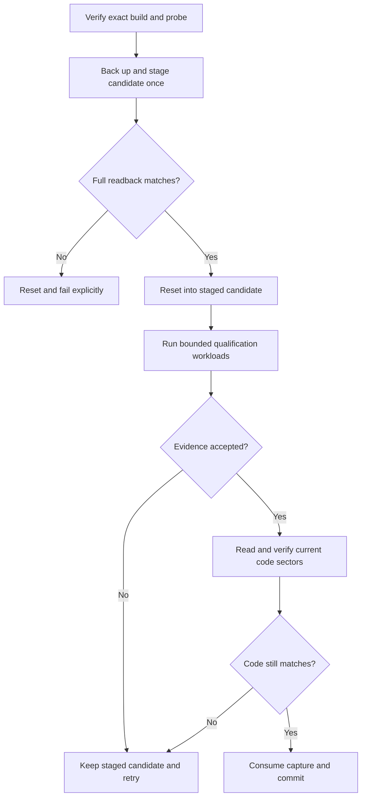

<!-- PAGE_ID: imec2-11-verified-deployment -->

[Wiki Home](README.md) / Verified Mesh Deployment and Hardware Qualification

<details>
<summary>📚 Relevant source files</summary>

The following files were used as context for generating this wiki page:

- [AGENTS.md:118-198](../../AGENTS.md#L118-L198)
- [stack_budget.h:12-56](https://github.com/Jubliano-sama/IMEC2/blob/f6594e41b57f5fd612aba182e0bd13cbbdd0c621/firmware/include/stack_budget.h#L12-L56)
- [verify_stack_evidence.py:24-51](https://github.com/Jubliano-sama/IMEC2/blob/f6594e41b57f5fd612aba182e0bd13cbbdd0c621/firmware/scripts/verify_stack_evidence.py#L24-L51)
- [capture_stack_evidence.py:61-129](https://github.com/Jubliano-sama/IMEC2/blob/f6594e41b57f5fd612aba182e0bd13cbbdd0c621/firmware/scripts/capture_stack_evidence.py#L61-L129)
- [flash_verified_mesh.py:419-660](https://github.com/Jubliano-sama/IMEC2/blob/f6594e41b57f5fd612aba182e0bd13cbbdd0c621/firmware/scripts/flash_verified_mesh.py#L419-L660)
- [check_mesh_deployment_policy.py:18-99](https://github.com/Jubliano-sama/IMEC2/blob/f6594e41b57f5fd612aba182e0bd13cbbdd0c621/firmware/scripts/check_mesh_deployment_policy.py#L18-L99)
- [mesh-deployment-policy.yml:1-17](https://github.com/Jubliano-sama/IMEC2/blob/f6594e41b57f5fd612aba182e0bd13cbbdd0c621/.github/workflows/mesh-deployment-policy.yml#L1-L17)

</details>

# Verified Mesh Deployment and Hardware Qualification

> **Related Pages**: [Build Presets and Configuration](10_build-presets-and-configuration.md), [Testing and Release Evidence](12_testing-simulation-and-release-evidence.md), [Hardware Bring-Up and Troubleshooting](13_hardware-bring-up-and-troubleshooting.md), [Data Custody and Recovery](08_data-custody-persistence-and-recovery.md)

The participant story depends on firmware that keeps a click correlated and recoverable through radio, mesh, and BLE pressure. IMEC2 therefore treats programming a production board as the final evidence handoff: the exact build, exact probe, measured runtime workloads, and flashed bytes must agree before the local deployment ledger records success.

---

<!-- BEGIN:AUTOGEN imec2-11-verified-deployment-eligibility-gate -->
## What Makes an Artifact Eligible

Only `mesh_clicker`, `mesh_anchor`, and `mesh_gateway` are deployable verified-flash targets. The verifier defines that set directly, and the capture and flash entrypoints reject any build whose generated preset is outside it ([verify_stack_evidence.py:24-51](https://github.com/Jubliano-sama/IMEC2/blob/f6594e41b57f5fd612aba182e0bd13cbbdd0c621/firmware/scripts/verify_stack_evidence.py#L24-L51), [capture_stack_evidence.py:81-89](https://github.com/Jubliano-sama/IMEC2/blob/f6594e41b57f5fd612aba182e0bd13cbbdd0c621/firmware/scripts/capture_stack_evidence.py#L81-L89), [flash_verified_mesh.py:390-416](https://github.com/Jubliano-sama/IMEC2/blob/f6594e41b57f5fd612aba182e0bd13cbbdd0c621/firmware/scripts/flash_verified_mesh.py#L390-L416)). This keeps the production [clicker, anchor, and gateway roles](01_product-roles-and-firmware-lines.md) separate from traffic generators, ML collection, debug, and legacy images.

Eligibility is tied to the policy header in this checkout. That header fixes role-specific stack sizes and minimum static RAM headroom, requires stack initialization, hardware stack protection, MPU guards, and thread information, and sets minimum free-stack and maximum-local-frame rules ([stack_budget.h:12-40](https://github.com/Jubliano-sama/IMEC2/blob/f6594e41b57f5fd612aba182e0bd13cbbdd0c621/firmware/include/stack_budget.h#L12-L40)). The verifier parses those machine-readable rows, checks that they cover exactly the three deployable presets, and compares them with each exact Zephyr build ([verify_stack_evidence.py:146-185](https://github.com/Jubliano-sama/IMEC2/blob/f6594e41b57f5fd612aba182e0bd13cbbdd0c621/firmware/scripts/verify_stack_evidence.py#L146-L185)). A linked artifact can therefore fail deployment even after a normal role build succeeds, because static RAM headroom, compiler stack attribution, generated configuration, or a large synchronous frame still violates the deployment policy.

Hardware evidence is role-specific rather than synthetic one-size-fits-all evidence. The clicker must complete real click activity, the anchor must complete an anchor survey report, and the gateway must complete report ingress, priority control, and BLE-backpressure workloads under their named execution owners ([stack_budget.h:42-56](https://github.com/Jubliano-sama/IMEC2/blob/f6594e41b57f5fd612aba182e0bd13cbbdd0c621/firmware/include/stack_budget.h#L42-L56)). Each successful run must carry at least one correlated stack sample; marker-only text is rejected rather than accepted as a runtime watermark ([verify_stack_evidence.py:1179-1205](https://github.com/Jubliano-sama/IMEC2/blob/f6594e41b57f5fd612aba182e0bd13cbbdd0c621/firmware/scripts/verify_stack_evidence.py#L1179-L1205)).

Sources: [verify_stack_evidence.py:24-51](https://github.com/Jubliano-sama/IMEC2/blob/f6594e41b57f5fd612aba182e0bd13cbbdd0c621/firmware/scripts/verify_stack_evidence.py#L24-L51), [stack_budget.h:12-56](https://github.com/Jubliano-sama/IMEC2/blob/f6594e41b57f5fd612aba182e0bd13cbbdd0c621/firmware/include/stack_budget.h#L12-L56), [verify_stack_evidence.py:146-224](https://github.com/Jubliano-sama/IMEC2/blob/f6594e41b57f5fd612aba182e0bd13cbbdd0c621/firmware/scripts/verify_stack_evidence.py#L146-L224)
<!-- END:AUTOGEN imec2-11-verified-deployment-eligibility-gate -->

---

<!-- BEGIN:AUTOGEN imec2-11-verified-deployment-qualification-capture -->
## Qualification Capture

The standalone capture tool observes an eligible artifact that is already running on the selected target; it never programs hardware. It verifies the exact build first, confirms the full probe ID is visible, and then runs `pyocd rtt -t nrf52833 -M pre-reset -u <probe-id> --up-channel-id 0` under `script` and a bounded foreground timeout ([capture_stack_evidence.py:1-7](https://github.com/Jubliano-sama/IMEC2/blob/f6594e41b57f5fd612aba182e0bd13cbbdd0c621/firmware/scripts/capture_stack_evidence.py#L1-L7), [capture_stack_evidence.py:31-78](https://github.com/Jubliano-sama/IMEC2/blob/f6594e41b57f5fd612aba182e0bd13cbbdd0c621/firmware/scripts/capture_stack_evidence.py#L31-L78)). The TTY wrapper matters because `pyocd rtt` is interactive, while `pre-reset` selects the reset-time connection sequence needed by the qualification contract. Hardware capture also needs direct USB access; a sandbox may list the probe yet leave RTT waiting, which is a tooling-access failure rather than firmware evidence ([AGENTS.md:189-198](../../AGENTS.md#L189-L198)).

A successful schema-3 manifest binds all of the evidence that must remain identical:

- The generated preset, full probe ID, exact ELF SHA-256, exact HEX SHA-256, and target-reported build identity bind the logical role and artifact to the physical qualification path ([capture_stack_evidence.py:98-120](https://github.com/Jubliano-sama/IMEC2/blob/f6594e41b57f5fd612aba182e0bd13cbbdd0c621/firmware/scripts/capture_stack_evidence.py#L98-L120)).
- The transcript path and SHA-256, capture-tool SHA-256, fixed RTT command, `script` wrapper, and UTC start/end times bind how and when the evidence was collected ([capture_stack_evidence.py:98-123](https://github.com/Jubliano-sama/IMEC2/blob/f6594e41b57f5fd612aba182e0bd13cbbdd0c621/firmware/scripts/capture_stack_evidence.py#L98-L123)).
- Typed `RUN_BEGIN`, `SAMPLE_BEGIN`, stack rows, `SAMPLE_END`, and `RUN_END` records must share run identity, workload kind, owner, packet identity, and queue/custody state. ISR data records configured size only; it does not substitute for a measured thread stack watermark ([verify_stack_evidence.py:1094-1168](https://github.com/Jubliano-sama/IMEC2/blob/f6594e41b57f5fd612aba182e0bd13cbbdd0c621/firmware/scripts/verify_stack_evidence.py#L1094-L1168)).

The verifier recalculates the capture ID from the artifact hashes, transcript hash, preset, probe, and wall-clock bounds. It also rejects the wrong preset or target identity, a modified capture tool, the wrong RTT command, a capture longer than 15 minutes, evidence older than 24 hours, and a transcript hash mismatch ([verify_stack_evidence.py:1208-1267](https://github.com/Jubliano-sama/IMEC2/blob/f6594e41b57f5fd612aba182e0bd13cbbdd0c621/firmware/scripts/verify_stack_evidence.py#L1208-L1267)).

Sources: [capture_stack_evidence.py:31-129](https://github.com/Jubliano-sama/IMEC2/blob/f6594e41b57f5fd612aba182e0bd13cbbdd0c621/firmware/scripts/capture_stack_evidence.py#L31-L129), [verify_stack_evidence.py:1094-1205](https://github.com/Jubliano-sama/IMEC2/blob/f6594e41b57f5fd612aba182e0bd13cbbdd0c621/firmware/scripts/verify_stack_evidence.py#L1094-L1205), [verify_stack_evidence.py:1208-1267](https://github.com/Jubliano-sama/IMEC2/blob/f6594e41b57f5fd612aba182e0bd13cbbdd0c621/firmware/scripts/verify_stack_evidence.py#L1208-L1267)
<!-- END:AUTOGEN imec2-11-verified-deployment-qualification-capture -->

---

<!-- BEGIN:AUTOGEN imec2-11-verified-deployment-verified-flash -->
## Verified Flash Workflow

The deployment entrypoint uses one durable transaction with separate staging and promotion phases. Staging is the only phase that programs the target; qualification can then run repeatedly against the exact staged image, and promotion only verifies current code sectors and records the accepted evidence. A mesh-anchor transaction therefore starts with:

```sh
.venv/bin/python firmware/scripts/flash_verified_mesh.py \
  --build-dir build/mesh-anchor \
  --probe-id E46070D247233537 \
  --stage-only
```

The wrapper fixes both west and pyOCD to the repository environment and fixes programming frequency at 4 MHz. It backs up the complete 512 KiB target image, overlays the candidate HEX onto the sectors it touches, journals the expected result and exact artifact hashes, stages through west with `--no-reset`, and confirms a full-flash readback before resetting the candidate. The durable journal then remains in `awaiting_qualification`, which blocks another stage on that probe.

Collect evidence and run the real workload in separate terminals. The capture tool does not program the device, so a failed scenario can be diagnosed and the same image can be exercised again without reflashing:

```sh
.venv/bin/python firmware/scripts/capture_stack_evidence.py \
  --build-dir build/mesh-anchor \
  --probe-id E46070D247233537 \
  --output-dir logs/stack-evidence \
  --duration-seconds 300
```

Promote one successful exact-artifact capture with:

```sh
.venv/bin/python firmware/scripts/flash_verified_mesh.py \
  --build-dir build/mesh-anchor \
  --hardware-manifest logs/stack-evidence/mesh-anchor-<capture-id>.json \
  --probe-id E46070D247233537
```

The complete bounded flow is:



Promotion validates the manifest, build, probe, and durable staging journal before touching target state. Its readback compares the code-sector hash map recorded at staging, so ordinary NVS changes caused by qualification are allowed while any code drift fails closed. A mismatch, stale manifest, malformed evidence, or failure before the deployment record becomes durable preserves the staged image and returns the journal to `awaiting_qualification`; an ambiguous or malformed ledger fails closed with the transaction intact for diagnosis. An exact capture is consumed once only after the deployment record is durable. Promotion never invokes west or writes firmware.

Sources: [flash_verified_mesh.py](../../firmware/scripts/flash_verified_mesh.py), [capture_stack_evidence.py](../../firmware/scripts/capture_stack_evidence.py), [test_flash_verified_mesh.py](../../firmware/tests/mesh_integration/test_flash_verified_mesh.py)
<!-- END:AUTOGEN imec2-11-verified-deployment-verified-flash -->

---

<!-- BEGIN:AUTOGEN imec2-11-verified-deployment-trust-boundary -->
## Trust Boundary and Bench Exceptions

This workflow provides strong local provenance, not cryptographic probe attestation. A person who can rewrite the checkout, artifact, capture tool, transcript, and local ledger can fabricate the local state, and a host owner can always invoke a programmer outside repository policy. The gate's enforceable claim is narrower: repository-owned release and deployment automation fails when the supported evidence chain is missing or inconsistent ([verify_stack_evidence.py:1-8](https://github.com/Jubliano-sama/IMEC2/blob/f6594e41b57f5fd612aba182e0bd13cbbdd0c621/firmware/scripts/verify_stack_evidence.py#L1-L8), [check_mesh_deployment_policy.py:1-8](https://github.com/Jubliano-sama/IMEC2/blob/f6594e41b57f5fd612aba182e0bd13cbbdd0c621/firmware/scripts/check_mesh_deployment_policy.py#L1-L8)).

Direct west or pyOCD flashing is reserved for explicitly named nondeployment images. The policy scanner permits bench traffic generators, ML clicker/anchor images, legacy clicker/anchor/gateway builds, staged high-debug presets, the gateway BLE connectivity test, and the power clicker sleep preset; any other direct flash command in supported scripts, workflows, or documentation is a policy failure ([check_mesh_deployment_policy.py:18-38](https://github.com/Jubliano-sama/IMEC2/blob/f6594e41b57f5fd612aba182e0bd13cbbdd0c621/firmware/scripts/check_mesh_deployment_policy.py#L18-L38), [check_mesh_deployment_policy.py:76-99](https://github.com/Jubliano-sama/IMEC2/blob/f6594e41b57f5fd612aba182e0bd13cbbdd0c621/firmware/scripts/check_mesh_deployment_policy.py#L76-L99)). CI runs that scanner and its negative suite on pull requests and pushes to `master`, so a documented bypass becomes a release-policy failure rather than an informal warning ([mesh-deployment-policy.yml:1-17](https://github.com/Jubliano-sama/IMEC2/blob/f6594e41b57f5fd612aba182e0bd13cbbdd0c621/.github/workflows/mesh-deployment-policy.yml#L1-L17)).

For a bench-only direct west flash, keep the preset distinction visible, select the probe after west's runner separator with `--dev-id`, and keep the proven 4 MHz rate. The direct pyOCD `-u` form belongs to RTT and commander commands, not west flash ([AGENTS.md:159-189](../../AGENTS.md#L159-L189)). A forced-hop relay test can therefore program `build/mesh-transmitter-forcedhop` directly, but that permission never extends to `mesh_clicker`, `mesh_anchor`, or `mesh_gateway`.

Sources: [verify_stack_evidence.py:1-8](https://github.com/Jubliano-sama/IMEC2/blob/f6594e41b57f5fd612aba182e0bd13cbbdd0c621/firmware/scripts/verify_stack_evidence.py#L1-L8), [check_mesh_deployment_policy.py:18-99](https://github.com/Jubliano-sama/IMEC2/blob/f6594e41b57f5fd612aba182e0bd13cbbdd0c621/firmware/scripts/check_mesh_deployment_policy.py#L18-L99), [mesh-deployment-policy.yml:1-17](https://github.com/Jubliano-sama/IMEC2/blob/f6594e41b57f5fd612aba182e0bd13cbbdd0c621/.github/workflows/mesh-deployment-policy.yml#L1-L17), [AGENTS.md:159-198](../../AGENTS.md#L159-L198)
<!-- END:AUTOGEN imec2-11-verified-deployment-trust-boundary -->

---

**Previous:** [Build Presets, Configuration, and Repository Boundaries](10_build-presets-and-configuration.md)

**Next:** [Testing, Simulation, and Release Evidence](12_testing-simulation-and-release-evidence.md)

**Related:** [Data Custody, Persistence, and Recovery](08_data-custody-persistence-and-recovery.md) · [Hardware Bring-Up and Troubleshooting](13_hardware-bring-up-and-troubleshooting.md) · [Product Roles and Firmware Lines](01_product-roles-and-firmware-lines.md)
