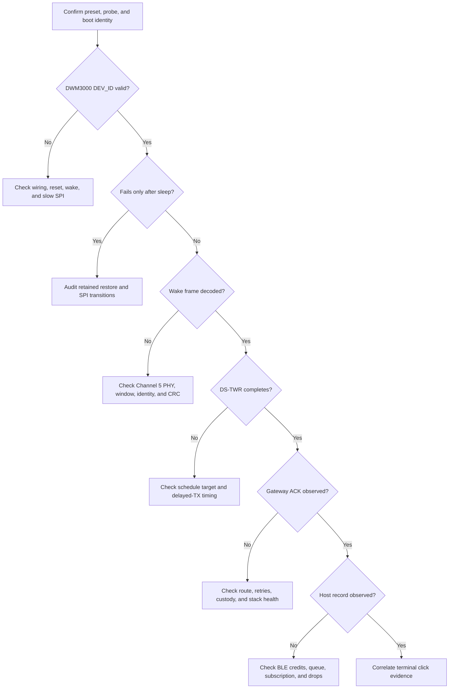

<!-- PAGE_ID: imec2-13-bring-up-and-troubleshooting -->

[← Start Here: From the User Story to the System](README.md) / Hardware Bring-Up and Troubleshooting

📚 Relevant source files

The following files were used as context for generating this wiki page:

- [AGENTS.md:49-64](../../AGENTS.md#L49-L64)
- [AGENTS.md:118-142](../../AGENTS.md#L118-L142)
- [AGENTS.md:177-198](../../AGENTS.md#L177-L198)
- [HARDWARE_BRINGUP_DEBUG.md:23-49](https://github.com/Jubliano-sama/IMEC2/blob/f6594e41b57f5fd612aba182e0bd13cbbdd0c621/Documentation/HARDWARE_BRINGUP_DEBUG.md#L23-L49)
- [HARDWARE_BRINGUP_DEBUG.md:227-376](https://github.com/Jubliano-sama/IMEC2/blob/f6594e41b57f5fd612aba182e0bd13cbbdd0c621/Documentation/HARDWARE_BRINGUP_DEBUG.md#L227-L376)
- [HARDWARE_BRINGUP_DEBUG.md:378-408](https://github.com/Jubliano-sama/IMEC2/blob/f6594e41b57f5fd612aba182e0bd13cbbdd0c621/Documentation/HARDWARE_BRINGUP_DEBUG.md#L378-L408)
- [README.md:35-93](https://github.com/Jubliano-sama/IMEC2/blob/f6594e41b57f5fd612aba182e0bd13cbbdd0c621/firmware/README.md#L35-L93)
- [README.md:122-169](https://github.com/Jubliano-sama/IMEC2/blob/f6594e41b57f5fd612aba182e0bd13cbbdd0c621/firmware/README.md#L122-L169)
- [dwm3000_port.c:51-70](https://github.com/Jubliano-sama/IMEC2/blob/f6594e41b57f5fd612aba182e0bd13cbbdd0c621/firmware/app/src/dwm3000_port.c#L51-L70)
- [dwm3000_driver_io.inc:143-203](https://github.com/Jubliano-sama/IMEC2/blob/f6594e41b57f5fd612aba182e0bd13cbbdd0c621/firmware/app/src/dwm3000_driver_io.inc#L143-L203)
- [dwm3000_driver_radio.inc:466-580](https://github.com/Jubliano-sama/IMEC2/blob/f6594e41b57f5fd612aba182e0bd13cbbdd0c621/firmware/app/src/dwm3000_driver_radio.inc#L466-L580)
- [capture_stack_evidence.py:31-129](https://github.com/Jubliano-sama/IMEC2/blob/f6594e41b57f5fd612aba182e0bd13cbbdd0c621/firmware/scripts/capture_stack_evidence.py#L31-L129)
- [mesh_ble_route_monitor.py:375-460](https://github.com/Jubliano-sama/IMEC2/blob/f6594e41b57f5fd612aba182e0bd13cbbdd0c621/tools/mesh_ble_route_monitor.py#L375-L460)
- [AGENT_KNOWN_ISSUES.md:93-124](../../AGENT_KNOWN_ISSUES.md#L93-L124)
- [AGENT_KNOWN_ISSUES.md:180-200](../../AGENT_KNOWN_ISSUES.md#L180-L200)
- [AGENT_KNOWN_ISSUES.md:270-273](../../AGENT_KNOWN_ISSUES.md#L270-L273)

# Hardware Bring-Up and Troubleshooting

Bring-up succeeds when one participant click can be traced through the exact intended firmware, radio work, mesh custody, gateway acceptance, and host observation. Start with identity, move outward one boundary at a time, and never convert a tooling failure or a debug-only shortcut into evidence about the product path.

> **Related pages:** [Testing, Simulation, and Release Evidence](12_testing-simulation-and-release-evidence.md) · [UWB Wake, Ranging, and Low-Power Radio](03_uwb-wake-ranging-and-power.md) · [Gateway, Host Tools, and Observability](09_gateway-host-tools-and-observability.md) · [Verified Deployment and Qualification](11_verified-deployment-and-qualification.md)

---

<!-- BEGIN:AUTOGEN imec2-13-bring-up-and-troubleshooting-first-principles -->
## Start With Identity and Evidence

Write down the intended preset, build directory, probe ID, physical board, and expected role before touching hardware. The repository explicitly requires an exact preset-to-probe mapping because `mesh_clicker`, `mesh_anchor`, and `mesh_gateway` are product candidates, while forced-hop transmitters, ML images, high-debug stages, and plain direct-role images have narrower purposes ([AGENTS.md:49-64](../../AGENTS.md#L49-L64)). A successful flash does not prove that the label beside the probe is current; a previous bench failure was misattributed after a board swap, so compare the live `app_device_id` with the exact flashed ELF before assigning a symptom to a role ([AGENT_KNOWN_ISSUES.md:225-227](../../AGENT_KNOWN_ISSUES.md#L225-L227)).

Use the boot record as the first runtime checkpoint. High-debug boot output includes the git/build identity, preset, role, stage, board, device ID, network ID, radio channels, SPI speed, polling mode, and enabled transports, so one banner can disprove several bad assumptions before RF diagnosis begins ([HARDWARE_BRINGUP_DEBUG.md:41-49](https://github.com/Jubliano-sama/IMEC2/blob/f6594e41b57f5fd612aba182e0bd13cbbdd0c621/Documentation/HARDWARE_BRINGUP_DEBUG.md#L41-L49)). LEDs are useful for locating a phase, but the bring-up guide requires pairing them with counters and range status because light alone is not protocol success ([HARDWARE_BRINGUP_DEBUG.md:400-408](https://github.com/Jubliano-sama/IMEC2/blob/f6594e41b57f5fd612aba182e0bd13cbbdd0c621/Documentation/HARDWARE_BRINGUP_DEBUG.md#L400-L408)).

| Question | Evidence to record before continuing |
| --- | --- |
| Is this the intended product behavior? | Exact `IMEC_BUILD_PRESET`, ELF/HEX identity, and a boot banner that agrees with the expected role. |
| Is this the intended board? | Full probe ID, physical label, and target-reported device identity. |
| Is the DWM3000 electrically reachable? | Reset/wake pin behavior, DEV_ID read, slow-to-fast SPI transition, and bounded status-poll evidence. |
| Did work finish semantically? | Correlated click, range, custody, ACK, and host-stream records—not merely a submitted command or LED transition. |

Treat the host stream as its own evidence boundary. Enumeration-era BLE disconnects and simultaneous anchor RF churn were traced to 2 ms notification retry bursts, an unbounded result path, and unrelated route-reply ownership; the fix retains notification custody, caps retry pressure, bounds survey-pair result delivery, and gives verified gateway controls the required preemption ([AGENT_KNOWN_ISSUES.md:313](../../AGENT_KNOWN_ISSUES.md#L313)). If enumeration appears stalled, preserve its correlation and inspect both gateway command progress and BLE stream pressure before restarting the operation or blaming UWB.

Keep deployment and bench work separate. Deployable mesh roles use the repository’s verified wrapper; direct `west flash` is reserved for explicitly non-deployable bench, legacy, and ML images ([AGENTS.md:118-142](../../AGENTS.md#L118-L142), [AGENTS.md:159-187](../../AGENTS.md#L159-L187)). Continue to [Product Roles and Firmware Lines](01_product-roles-and-firmware-lines.md) when the image’s purpose is unclear, or to [Verified Deployment and Qualification](11_verified-deployment-and-qualification.md) when the artifact is intended to leave the bench.

Source: [AGENTS.md:49-64](../../AGENTS.md#L49-L64), [HARDWARE_BRINGUP_DEBUG.md:41-49](https://github.com/Jubliano-sama/IMEC2/blob/f6594e41b57f5fd612aba182e0bd13cbbdd0c621/Documentation/HARDWARE_BRINGUP_DEBUG.md#L41-L49), [AGENT_KNOWN_ISSUES.md:225-227](../../AGENT_KNOWN_ISSUES.md#L225-L227), [AGENT_KNOWN_ISSUES.md:313](../../AGENT_KNOWN_ISSUES.md#L313)
<!-- END:AUTOGEN imec2-13-bring-up-and-troubleshooting-first-principles -->

---

<!-- BEGIN:AUTOGEN imec2-13-bring-up-and-troubleshooting-staged-bring-up -->
## Staged Bring-Up

Move outward only after the preceding boundary has direct evidence. The staged high-debug images are diagnostic instruments, while the matching product behavior remains defined by the production-candidate mesh presets ([HARDWARE_BRINGUP_DEBUG.md:1-9](https://github.com/Jubliano-sama/IMEC2/blob/f6594e41b57f5fd612aba182e0bd13cbbdd0c621/Documentation/HARDWARE_BRINGUP_DEBUG.md#L1-L9)).

1. **Prove one board and one radio.** Stage 0 initializes reset, wake, and SPI, reads DEV_ID at the initialization speed, switches to runtime SPI, and exercises explicit sleep/wake diagnostics without requiring an anchor. Its simulated `RANGE_OK` is labelled `BENCH_ONLY`, so it proves the local diagnostic path rather than real ranging ([HARDWARE_BRINGUP_DEBUG.md:227-254](https://github.com/Jubliano-sama/IMEC2/blob/f6594e41b57f5fd612aba182e0bd13cbbdd0c621/Documentation/HARDWARE_BRINGUP_DEBUG.md#L227-L254)).

2. **Add one anchor and prove the UWB exchange.** Stage 1 must show a low-duty scan, accepted wake claim, discovery reply, schedule, addressed DS-TWR, and distance/status result. The single-anchor exception remains explicitly bench-only and leaves identity, nonce, event, anchor, timing, and schedule validation active ([HARDWARE_BRINGUP_DEBUG.md:256-298](https://github.com/Jubliano-sama/IMEC2/blob/f6594e41b57f5fd612aba182e0bd13cbbdd0c621/Documentation/HARDWARE_BRINGUP_DEBUG.md#L256-L298)).

3. **Add anchors and prove production-style selection.** Stage 2 requires at least three eligible discovery replies, schedules at most four anchors, serializes DS-TWR inside one continuous responder window, and must release/retry/fail rather than range with only one or two replies. Each diagnostic anchor needs a unique flashed slot, which is a Stage 2 bench invariant rather than production assignment ([HARDWARE_BRINGUP_DEBUG.md:300-331](https://github.com/Jubliano-sama/IMEC2/blob/f6594e41b57f5fd612aba182e0bd13cbbdd0c621/Documentation/HARDWARE_BRINGUP_DEBUG.md#L300-L331)).

4. **Add the gateway and prove both custody boundaries.** Stage 3 extends the same click/range path through an anchor report queue, mesh transmission, gateway ACK, BLE packet output, command flow, and gateway-driven survey discovery. An anchor does not call a report delivered until the gateway ACK arrives, and the host does not own the result until the retained BLE stream drains it ([HARDWARE_BRINGUP_DEBUG.md:334-376](https://github.com/Jubliano-sama/IMEC2/blob/f6594e41b57f5fd612aba182e0bd13cbbdd0c621/Documentation/HARDWARE_BRINGUP_DEBUG.md#L334-L376), [AGENT_KNOWN_ISSUES.md:313](../../AGENT_KNOWN_ISSUES.md#L313)). During enumeration, record gateway command stages, stream gaps, notification failures, and anchor RF progress together; that keeps a host-stream backlog from being misdiagnosed as a stalled UWB operation.

5. **Repeat on exact production presets.** The repository smoke checklist requires DEV_ID/reset/wake/polling/sleep evidence, a one-anchor full-path smoke, a three-anchor click, timing measurements, idle diagnostics, and power validation. Simulation and high-debug milestones narrow the fault, but remaining hardware timing, anchor survey, multi-board, and power checks still require target evidence ([README.md:122-169](https://github.com/Jubliano-sama/IMEC2/blob/f6594e41b57f5fd612aba182e0bd13cbbdd0c621/firmware/README.md#L122-L169)).

Source: [HARDWARE_BRINGUP_DEBUG.md:227-376](https://github.com/Jubliano-sama/IMEC2/blob/f6594e41b57f5fd612aba182e0bd13cbbdd0c621/Documentation/HARDWARE_BRINGUP_DEBUG.md#L227-L376), [README.md:122-169](https://github.com/Jubliano-sama/IMEC2/blob/f6594e41b57f5fd612aba182e0bd13cbbdd0c621/firmware/README.md#L122-L169), [AGENT_KNOWN_ISSUES.md:313](../../AGENT_KNOWN_ISSUES.md#L313)
<!-- END:AUTOGEN imec2-13-bring-up-and-troubleshooting-staged-bring-up -->

---

<!-- BEGIN:AUTOGEN imec2-13-bring-up-and-troubleshooting-symptom-routing -->
## Route Symptoms to the Right Layer

Preserve the earliest failing boundary. Resetting everything after each symptom can make a retained-state bug look like an RF problem, while skipping semantic ACK or stream checks can turn queued work into false success.

| Symptom | First safe diagnostic branch | Why it belongs there |
| --- | --- | --- |
| DEV_ID fails or the radio never starts | Check the overlay wiring, reset/wake pins, CS/SCK/MOSI/MISO, slow SPI, and probe logs before RF. The port enforces reset/init below 7 MHz and runtime SPI at or above 32 MHz ([dwm3000_port.c:51-70](https://github.com/Jubliano-sama/IMEC2/blob/f6594e41b57f5fd612aba182e0bd13cbbdd0c621/firmware/app/src/dwm3000_port.c#L51-L70)). | A device-identity read is below protocol and routing. |
| It works once after reset, then fails after sleep | Inspect slow-SPI entry, retained configuration, wake readiness, common/TX-RX restore, return to fast SPI, and the device-identity recheck. The driver records each of these transitions and falls back to full reinitialization if retained wake/restore fails ([dwm3000_driver_io.inc:155-203](https://github.com/Jubliano-sama/IMEC2/blob/f6594e41b57f5fd612aba182e0bd13cbbdd0c621/firmware/app/src/dwm3000_driver_io.inc#L155-L203), [dwm3000_driver_radio.inc:466-580](https://github.com/Jubliano-sama/IMEC2/blob/f6594e41b57f5fd612aba182e0bd13cbbdd0c621/firmware/app/src/dwm3000_driver_radio.inc#L466-L580)). | A retained-state or SPI-order defect can mimic a later PHY timeout. |
| Wake is missing, rejected, or mistimed | Check channel 5, network/epoch/click identity, nonce, CRC, scan aperture, and accept/reject reason. Channel 5 owns wake, discovery, route contact, and ranging; channel 9 is used only after contact timing exists ([HARDWARE_BRINGUP_DEBUG.md:23-28](https://github.com/Jubliano-sama/IMEC2/blob/f6594e41b57f5fd612aba182e0bd13cbbdd0c621/Documentation/HARDWARE_BRINGUP_DEBUG.md#L23-L28)). | A route table cannot repair a frame that never passed the contact lane. |
| Discovery succeeds but ranging fails | Follow the named range stage—schedule TX, poll TX, response timeout, final TX, identity rejection, timing rejection, or radio error—without collapsing them into “UWB failed” ([HARDWARE_BRINGUP_DEBUG.md:288-298](https://github.com/Jubliano-sama/IMEC2/blob/f6594e41b57f5fd612aba182e0bd13cbbdd0c621/Documentation/HARDWARE_BRINGUP_DEBUG.md#L288-L298)). | Each milestone has different timing and ownership. |
| A report exists at the anchor but not at the gateway | Check route request/reply, retries, active-click preemption, gateway ACK TX/RX, duplicate handling, watchdog/reset markers, and stack evidence. A historical 8,904-byte branch frame overflowed an 8,192-byte mesh workqueue and produced illegal-EPSR resets, showing why a green RF trace does not clear stack health ([HARDWARE_BRINGUP_DEBUG.md:390-396](https://github.com/Jubliano-sama/IMEC2/blob/f6594e41b57f5fd612aba182e0bd13cbbdd0c621/Documentation/HARDWARE_BRINGUP_DEBUG.md#L390-L396), [AGENT_KNOWN_ISSUES.md:105-106](../../AGENT_KNOWN_ISSUES.md#L105-L106)). | Delivery remains incomplete until semantic gateway acceptance and ACK. |
| Survey says `No anchors`, although enumeration worked | Diagnose `SURVEY_DISCOVERY_START`, probe windows, and report custody independently of assignment enumeration and ordinary routes. This exact divergence previously occurred because the survey start frame was rejected even while enumeration reached the same devices ([AGENT_KNOWN_ISSUES.md:118-128](../../AGENT_KNOWN_ISSUES.md#L118-L128)). | “No anchors” means no accepted survey discovery reports; it does not prove the anchors were unreachable by every control path. |
| Gateway ACK exists but the host record is missing | Check GATT subscription, BLE credits, queue admission, notify failures, RX drops, and per-source sequence gaps. The monitor keeps independent source/event high-water marks and reports missing or out-of-order records ([mesh_ble_route_monitor.py:375-460](https://github.com/Jubliano-sama/IMEC2/blob/f6594e41b57f5fd612aba182e0bd13cbbdd0c621/tools/mesh_ble_route_monitor.py#L375-L460)). | BLE backpressure is a custody boundary, so protocol work must not outrun retained host-stream evidence. |

When several rows appear to fail at once, use the earliest one with trustworthy evidence. A historical BLE fix retained retryable snapshots and gated survey-pair progress on telemetry custody because temporary CCC, queue, or notify-credit refusal had been counted as irreversible loss ([AGENT_KNOWN_ISSUES.md:37-46](../../AGENT_KNOWN_ISSUES.md#L37-L46)).

Source: [HARDWARE_BRINGUP_DEBUG.md:378-408](https://github.com/Jubliano-sama/IMEC2/blob/f6594e41b57f5fd612aba182e0bd13cbbdd0c621/Documentation/HARDWARE_BRINGUP_DEBUG.md#L378-L408), [dwm3000_driver_radio.inc:466-580](https://github.com/Jubliano-sama/IMEC2/blob/f6594e41b57f5fd612aba182e0bd13cbbdd0c621/firmware/app/src/dwm3000_driver_radio.inc#L466-L580), [AGENT_KNOWN_ISSUES.md:105-128](../../AGENT_KNOWN_ISSUES.md#L105-L128)
<!-- END:AUTOGEN imec2-13-bring-up-and-troubleshooting-symptom-routing -->

---

<!-- BEGIN:AUTOGEN imec2-13-bring-up-and-troubleshooting-rtt-and-usb-gotchas -->
## RTT, USB, and Tooling Gotchas

The qualification capture path is intentionally concrete: it checks that the full probe ID is visible, runs `pyocd rtt -t nrf52833 -M pre-reset -u <probe-id>` under `script` and a bounded foreground timeout, rejects an empty transcript, and records the exact command, TTY wrapper, probe, artifact hashes, target identity, transcript hash, and UTC bounds in the manifest ([capture_stack_evidence.py:31-129](https://github.com/Jubliano-sama/IMEC2/blob/f6594e41b57f5fd612aba182e0bd13cbbdd0c621/firmware/scripts/capture_stack_evidence.py#L31-L129)). Use this capture for qualification; do not hand-author an equivalent-looking log.

- **Give hardware commands real USB access.** A sandbox can list both probes yet leave RTT waiting forever because the subprocess cannot access the USB device. In that exact case, rerun with host/USB permission and do not record the hang as a disconnected probe or firmware failure ([AGENTS.md:191-198](../../AGENTS.md#L191-L198)).

- **Keep RTT on a TTY.** Run interactively or through `script`; direct redirection can fail with `Inappropriate ioctl for device`. Capture the unfiltered typescript before filtering, because piping the live pseudo-terminal through `rg` can close it before attachment ([AGENTS.md:191](../../AGENTS.md#L191), [AGENT_KNOWN_ISSUES.md:270-271](../../AGENT_KNOWN_ISSUES.md#L270-L271)).

- **Treat `pre-reset` as a connection mode, not a reset command.** It selects the reset-aware attachment sequence but does not itself reset an already-running target. If a fresh boot identity is required, perform the explicit reset/staging step; an `attach` capture can begin with retained boot text, so correlate later monotonic markers instead of treating a low uptime line as proof of reset ([AGENT_KNOWN_ISSUES.md:187-194](../../AGENT_KNOWN_ISSUES.md#L187-L194), [AGENT_KNOWN_ISSUES.md:221-222](../../AGENT_KNOWN_ISSUES.md#L221-L222)).

- **Preserve empty and partial captures.** A TTY-backed session can find the RTT control block but emit no boot output; preserve that result, then use an explicit reset followed by attach to separate capture failure from a dead target. A wrapped timeout can also outlive its requested bound, and concurrent captures can leave one expected transcript missing, so verify process termination and each output path before accepting the window ([AGENT_KNOWN_ISSUES.md:98-105](../../AGENT_KNOWN_ISSUES.md#L98-L105), [AGENT_KNOWN_ISSUES.md:124](../../AGENT_KNOWN_ISSUES.md#L124)).

- **Use the installed pyOCD surface.** The capture code first attempts JSON enumeration and falls back to the plain table with exact-token probe matching, which covers hosts whose pyOCD lacks `list --json` ([capture_stack_evidence.py:31-58](https://github.com/Jubliano-sama/IMEC2/blob/f6594e41b57f5fd612aba182e0bd13cbbdd0c621/firmware/scripts/capture_stack_evidence.py#L31-L58)). Validate commander output as well as its process status because a command-level error has previously exited with status zero ([AGENT_KNOWN_ISSUES.md:110-112](../../AGENT_KNOWN_ISSUES.md#L110-L112)).

- **Avoid perturbing BLE evidence with RTT.** Simultaneous RTT attachment has disconnected a loaded gateway during GATT discovery. Preserve both traces and retry the BLE operation without RTT before declaring an anchor or gateway unreachable ([AGENT_KNOWN_ISSUES.md:113-115](../../AGENT_KNOWN_ISSUES.md#L113-L115)).

A verified wrapper rejection is itself a deployment result. Static RAM headroom, stack ownership, artifact identity, transcript structure, and workload requirements are stricter than “the role linked,” so preserve the rejection and debug the candidate rather than bypassing it with a production-role direct flash ([AGENT_KNOWN_ISSUES.md:14](../../AGENT_KNOWN_ISSUES.md#L14), [AGENT_KNOWN_ISSUES.md:273](../../AGENT_KNOWN_ISSUES.md#L273)).

Source: [capture_stack_evidence.py:31-129](https://github.com/Jubliano-sama/IMEC2/blob/f6594e41b57f5fd612aba182e0bd13cbbdd0c621/firmware/scripts/capture_stack_evidence.py#L31-L129), [AGENTS.md:191-198](../../AGENTS.md#L191-L198), [AGENT_KNOWN_ISSUES.md:93-124](../../AGENT_KNOWN_ISSUES.md#L93-L124)
<!-- END:AUTOGEN imec2-13-bring-up-and-troubleshooting-rtt-and-usb-gotchas -->

---

## Continue the story

[← Previous: Testing, Simulation, and Release Evidence](12_testing-simulation-and-release-evidence.md) · [↑ Return to Start Here](README.md) · [Next: Follow the participant story again →](README.md)

**Related:** [UWB Wake, Ranging, and Low-Power Radio](03_uwb-wake-ranging-and-power.md) · [Connected Routing, Priority, and Reliable Delivery](05_connected-routing-and-reliable-delivery.md) · [Data Custody, Persistence, and Recovery](08_data-custody-persistence-and-recovery.md) · [Gateway, Host Tools, and Observability](09_gateway-host-tools-and-observability.md) · [Verified Deployment and Qualification](11_verified-deployment-and-qualification.md)
