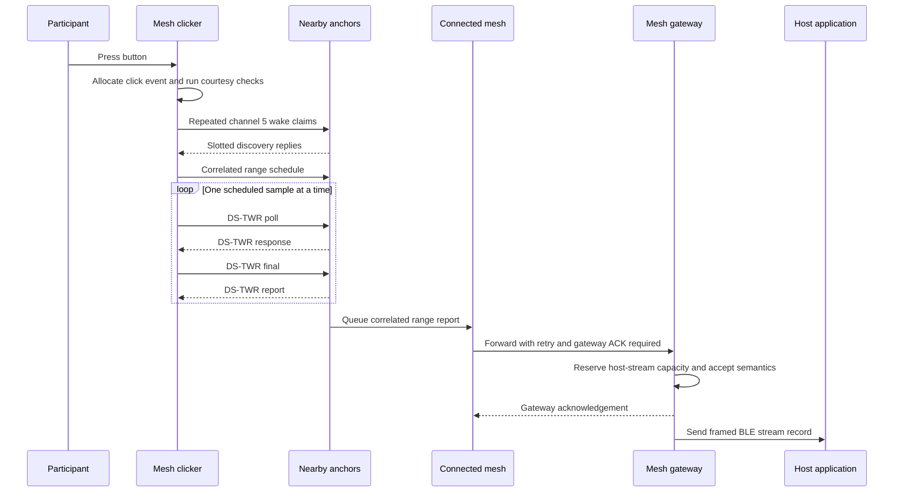

<!-- PAGE_ID: imec2-02-click-to-research-data -->

[← Start Here](README.md) / [Product Roles](01_product-roles-and-firmware-lines.md) / **One Click, End to End**

📚 Relevant source files

The following files were used as context for generating this wiki page:

- [From Click to Ranging, Developing a Robust UWB Gated Wake up Strategy.md:1-28](https://github.com/Jubliano-sama/IMEC2/blob/f6594e41b57f5fd612aba182e0bd13cbbdd0c621/Documentation/From%20Click%20to%20Ranging,%20Developing%20a%20Robust%20UWB%20Gated%20Wake%20up%20Strategy.md#L1-L28)
- [UWB+BLE Architecture 0.6.6.md:1-765](https://github.com/Jubliano-sama/IMEC2/blob/f6594e41b57f5fd612aba182e0bd13cbbdd0c621/Documentation/UWB+BLE%20Architecture%200.6.6.md#L1-L765)
- [app_clicker.c:1528-1851](https://github.com/Jubliano-sama/IMEC2/blob/f6594e41b57f5fd612aba182e0bd13cbbdd0c621/firmware/app/src/app_clicker.c#L1528-L1851)
- [app_anchor.c:297-322](https://github.com/Jubliano-sama/IMEC2/blob/f6594e41b57f5fd612aba182e0bd13cbbdd0c621/firmware/app/src/app_anchor.c#L297-L322)
- [app_anchor_radio.inc:299-667](https://github.com/Jubliano-sama/IMEC2/blob/f6594e41b57f5fd612aba182e0bd13cbbdd0c621/firmware/app/src/app_anchor_radio.inc#L299-L667)
- [app_mesh_report.c:734-741](https://github.com/Jubliano-sama/IMEC2/blob/f6594e41b57f5fd612aba182e0bd13cbbdd0c621/firmware/app/src/app_mesh_report.c#L734-L741)
- [app_mesh_report_encode.c:438-727](https://github.com/Jubliano-sama/IMEC2/blob/f6594e41b57f5fd612aba182e0bd13cbbdd0c621/firmware/app/src/app_mesh_report_encode.c#L438-L727)
- [app_mesh_report_delivery.inc:642-1179](https://github.com/Jubliano-sama/IMEC2/blob/f6594e41b57f5fd612aba182e0bd13cbbdd0c621/firmware/app/src/app_mesh_report_delivery.inc#L642-L1179)
- [app_gateway_ble_stream.c:286-708](https://github.com/Jubliano-sama/IMEC2/blob/f6594e41b57f5fd612aba182e0bd13cbbdd0c621/firmware/app/src/app_gateway_ble_stream.c#L286-L708)
- [report.c:246-327](https://github.com/Jubliano-sama/IMEC2/blob/f6594e41b57f5fd612aba182e0bd13cbbdd0c621/firmware/src/report.c#L246-L327)
- [uwb_session.c:523-976](https://github.com/Jubliano-sama/IMEC2/blob/f6594e41b57f5fd612aba182e0bd13cbbdd0c621/firmware/src/uwb_session.c#L523-L976)

# One Click, End to End

> **Related Pages**: [Product Roles](01_product-roles-and-firmware-lines.md), [UWB Wake and Ranging](03_uwb-wake-ranging-and-power.md), [Connected Routing](05_connected-routing-and-reliable-delivery.md), [Data Custody](08_data-custody-persistence-and-recovery.md), [Gateway and Host Tools](09_gateway-host-tools-and-observability.md)

This chapter follows one participant press through the system. The central caveat is that the [mesh clicker](01_product-roles-and-firmware-lines.md) can show a successful local result once it has enough valid ranges, while end-to-end research-data success still depends on each [anchor](01_product-roles-and-firmware-lines.md), the [connected-routing mesh](05_connected-routing-and-reliable-delivery.md), the gateway, and the host accepting custody in order.

---

<!-- BEGIN:AUTOGEN imec2-02-click-to-research-data-participant-action -->
## The Participant Action

The participant presses the physical button to mark a subjective moment. Firmware turns the resulting normal-click action into a new nonzero event sequence and a session containing the clicker identity, nonce, anchor bounds, attempt limit, sample count, radio channels, and click flags; that identity follows later discovery and ranging work so delayed traffic cannot be mistaken for another press ([app_clicker.c:1528-1547](https://github.com/Jubliano-sama/IMEC2/blob/f6594e41b57f5fd612aba182e0bd13cbbdd0c621/firmware/app/src/app_clicker.c#L1528-L1547)).

The clicker immediately marks the operation active, but it reports success only after the session reaches `UWB_CLICKER_SUCCEEDED`. A successful local run sets the click status, holds the result LED for two seconds, and then returns the clicker to idle; timeout and insufficient-range failures produce different status outcomes instead of a false success ([app_clicker.c:1702-1738](https://github.com/Jubliano-sama/IMEC2/blob/f6594e41b57f5fd612aba182e0bd13cbbdd0c621/firmware/app/src/app_clicker.c#L1702-L1738), [app_clicker.c:2615-2666](https://github.com/Jubliano-sama/IMEC2/blob/f6594e41b57f5fd612aba182e0bd13cbbdd0c621/firmware/app/src/app_clicker.c#L2615-L2666)). That feedback means “the clicker obtained the required ranging evidence,” not “the PC has durably stored a study row.”

Sources: [app_clicker.c:1528-1547](https://github.com/Jubliano-sama/IMEC2/blob/f6594e41b57f5fd612aba182e0bd13cbbdd0c621/firmware/app/src/app_clicker.c#L1528-L1547), [app_clicker.c:1702-1738](https://github.com/Jubliano-sama/IMEC2/blob/f6594e41b57f5fd612aba182e0bd13cbbdd0c621/firmware/app/src/app_clicker.c#L1702-L1738), [app_clicker.c:2615-2666](https://github.com/Jubliano-sama/IMEC2/blob/f6594e41b57f5fd612aba182e0bd13cbbdd0c621/firmware/app/src/app_clicker.c#L2615-L2666)
<!-- END:AUTOGEN imec2-02-click-to-research-data-participant-action -->

---

<!-- BEGIN:AUTOGEN imec2-02-click-to-research-data-wake-discover-range -->
## Wake, Discover, and Range

Before transmitting, the clicker performs bounded UWB and BLE courtesy checks, but click latency remains bounded. It then sends repeated long-preamble wake claims on channel 5 long enough to intersect the anchors’ short, low-duty receive apertures; only a CRC-valid claim creates protocol state, so preamble energy or a damaged frame cannot bind an anchor to the wrong click ([From Click to Ranging, Developing a Robust UWB Gated Wake up Strategy.md:19-28](https://github.com/Jubliano-sama/IMEC2/blob/f6594e41b57f5fd612aba182e0bd13cbbdd0c621/Documentation/From%20Click%20to%20Ranging,%20Developing%20a%20Robust%20UWB%20Gated%20Wake%20up%20Strategy.md#L19-L28), [app_clicker.c:1613-1642](https://github.com/Jubliano-sama/IMEC2/blob/f6594e41b57f5fd612aba182e0bd13cbbdd0c621/firmware/app/src/app_clicker.c#L1613-L1642)).

Discovery replies must match the active network, clicker, event sequence, attempt, nonce, flags, and a valid anchor slot before they become candidates. The clicker then selects the best candidates within capacity, publishes one range schedule, and enters ranging only if a normal click has enough candidates to satisfy its minimum ([uwb_session.c:582-657](https://github.com/Jubliano-sama/IMEC2/blob/f6594e41b57f5fd612aba182e0bd13cbbdd0c621/firmware/src/uwb_session.c#L582-L657), [uwb_session.c:731-815](https://github.com/Jubliano-sama/IMEC2/blob/f6594e41b57f5fd612aba182e0bd13cbbdd0c621/firmware/src/uwb_session.c#L731-L815)).

Each scheduled sample is serialized. The clicker waits for its target time, performs one DS-TWR exchange, and records either a valid result or a specific failure; the session counts a unique anchor only after `RANGE_OK`, and it moves to retry or failure when the minimum cannot be reached ([app_clicker.c:1189-1227](https://github.com/Jubliano-sama/IMEC2/blob/f6594e41b57f5fd612aba182e0bd13cbbdd0c621/firmware/app/src/app_clicker.c#L1189-L1227), [uwb_session.c:905-976](https://github.com/Jubliano-sama/IMEC2/blob/f6594e41b57f5fd612aba182e0bd13cbbdd0c621/firmware/src/uwb_session.c#L905-L976)). The anchor uses the same schedule identity and expected clicker, event, nonce, anchor, channel, delay, sequence, round, and flags before listening for its assigned exchange ([app_anchor_radio.inc:310-430](https://github.com/Jubliano-sama/IMEC2/blob/f6594e41b57f5fd612aba182e0bd13cbbdd0c621/firmware/app/src/app_anchor_radio.inc#L310-L430)).

Sources: [From Click to Ranging, Developing a Robust UWB Gated Wake up Strategy.md:19-28](https://github.com/Jubliano-sama/IMEC2/blob/f6594e41b57f5fd612aba182e0bd13cbbdd0c621/Documentation/From%20Click%20to%20Ranging,%20Developing%20a%20Robust%20UWB%20Gated%20Wake%20up%20Strategy.md#L19-L28), [uwb_session.c:582-815](https://github.com/Jubliano-sama/IMEC2/blob/f6594e41b57f5fd612aba182e0bd13cbbdd0c621/firmware/src/uwb_session.c#L582-L815), [app_anchor_radio.inc:310-430](https://github.com/Jubliano-sama/IMEC2/blob/f6594e41b57f5fd612aba182e0bd13cbbdd0c621/firmware/app/src/app_anchor_radio.inc#L310-L430)
<!-- END:AUTOGEN imec2-02-click-to-research-data-wake-discover-range -->

---

<!-- BEGIN:AUTOGEN imec2-02-click-to-research-data-report-delivery -->
## From Range Results to Gateway Custody

After the scheduled window, an anchor takes the median of successful samples and builds a report. The report binds the clicker, anchor, event sequence, attempt, burst, per-sample timing, distance, quality, radio diagnostics, and range status, then addresses the packet to the gateway ([app_anchor_radio.inc:674-678](https://github.com/Jubliano-sama/IMEC2/blob/f6594e41b57f5fd612aba182e0bd13cbbdd0c621/firmware/app/src/app_anchor_radio.inc#L674-L678), [app_mesh_report_encode.c:438-525](https://github.com/Jubliano-sama/IMEC2/blob/f6594e41b57f5fd612aba182e0bd13cbbdd0c621/firmware/app/src/app_mesh_report_encode.c#L438-L525), [app_mesh_report_encode.c:620-665](https://github.com/Jubliano-sama/IMEC2/blob/f6594e41b57f5fd612aba182e0bd13cbbdd0c621/firmware/app/src/app_mesh_report_encode.c#L620-L665)).

Sources: [app_anchor_radio.inc:674-678](https://github.com/Jubliano-sama/IMEC2/blob/f6594e41b57f5fd612aba182e0bd13cbbdd0c621/firmware/app/src/app_anchor_radio.inc#L674-L678), [app_mesh_report_encode.c:438-665](https://github.com/Jubliano-sama/IMEC2/blob/f6594e41b57f5fd612aba182e0bd13cbbdd0c621/firmware/app/src/app_mesh_report_encode.c#L438-L665), [app_mesh_report_delivery.inc:740-1179](https://github.com/Jubliano-sama/IMEC2/blob/f6594e41b57f5fd612aba182e0bd13cbbdd0c621/firmware/app/src/app_mesh_report_delivery.inc#L740-L1179), [app_mesh_report_delivery.inc:2613-2698](https://github.com/Jubliano-sama/IMEC2/blob/f6594e41b57f5fd612aba182e0bd13cbbdd0c621/firmware/app/src/app_mesh_report_delivery.inc#L2613-L2698)
<!-- END:AUTOGEN imec2-02-click-to-research-data-report-delivery -->

---

**Previous:** [Product Roles and Firmware Lines](01_product-roles-and-firmware-lines.md)

**Next:** [UWB Wake, Ranging, and Low-Power Radio](03_uwb-wake-ranging-and-power.md)

**Related:** [Connected Routing, Priority, and Reliable Delivery](05_connected-routing-and-reliable-delivery.md) · [Data Custody, Persistence, and Recovery](08_data-custody-persistence-and-recovery.md) · [Gateway, Host Tools, and Observability](09_gateway-host-tools-and-observability.md)
