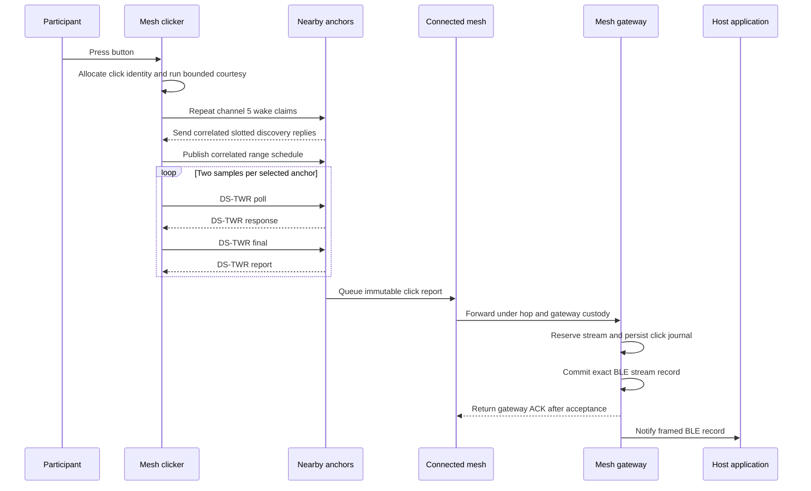

<!-- PAGE_ID: imec2-02-click-to-research-data -->

[← Start Here](README.md) / [Product Roles](01_product-roles-and-firmware-lines.md) / **One Click, End to End**

📚 Historical generation context (f6594e4)

The following files were used as context for generating this wiki page:

- [From Click to Ranging, Developing a Robust UWB Gated Wake up Strategy.md:1-28](https://github.com/Jubliano-sama/IMEC2/blob/f6594e41b57f5fd612aba182e0bd13cbbdd0c621/Documentation/From%20Click%20to%20Ranging,%20Developing%20a%20Robust%20UWB%20Gated%20Wake%20up%20Strategy.md#L1-L28)
- [UWB+BLE Architecture 0.6.6.md:1-765](https://github.com/Jubliano-sama/IMEC2/blob/f6594e41b57f5fd612aba182e0bd13cbbdd0c621/Documentation/UWB+BLE%20Architecture%200.6.6.md#L1-L765)
- [app_clicker.c:1528-1851](https://github.com/Jubliano-sama/IMEC2/blob/f6594e41b57f5fd612aba182e0bd13cbbdd0c621/firmware/app/src/app_clicker.c#L1528-L1851)
- [app_anchor.c:297-322](https://github.com/Jubliano-sama/IMEC2/blob/f6594e41b57f5fd612aba182e0bd13cbbdd0c621/firmware/app/src/app_anchor.c#L297-L322)
- [app_anchor_radio.inc:299-667](https://github.com/Jubliano-sama/IMEC2/blob/f6594e41b57f5fd612aba182e0bd13cbbdd0c621/firmware/app/src/app_anchor_radio.inc#L299-L667)
- [app_mesh_report.c:734-741](https://github.com/Jubliano-sama/IMEC2/blob/f6594e41b57f5fd612aba182e0bd13cbbdd0c621/firmware/app/src/app_mesh_report.c#L734-L741)
- [app_mesh_report_encode.c:438-727](https://github.com/Jubliano-sama/IMEC2/blob/f6594e41b57f5fd612aba182e0bd13cbbdd0c621/firmware/app/src/app_mesh_report_encode.c#L438-L727)
- [app_mesh_report_delivery.inc:642-1179](https://github.com/Jubliano-sama/IMEC2/blob/f6594e41b57f5fd612aba182e0bd13cbbdd0c621/firmware/app/src/app_mesh_report_delivery.inc#L642-L1179)
- [app_gateway_ble_stream.c:286-708](https://github.com/Jubliano-sama/IMEC2/blob/f6594e41b57f5fd612aba182e0bd13cbbdd0c621/firmware/app/src/app_gateway_ble_stream.c#L286-L708)
- [report.c:246-327](https://github.com/Jubliano-sama/IMEC2/blob/f6594e41b57f5fd612aba182e0bd13cbbdd0c621/firmware/src/report.c#L246-L327)
- [uwb_session.c:523-976](https://github.com/Jubliano-sama/IMEC2/blob/f6594e41b57f5fd612aba182e0bd13cbbdd0c621/firmware/src/uwb_session.c#L523-L976)

# One Click, End to End

> **Related Pages**: [Product Roles](01_product-roles-and-firmware-lines.md), [UWB Wake and Ranging](03_uwb-wake-ranging-and-power.md), [Connected Routing](05_connected-routing-and-reliable-delivery.md), [Data Custody](08_data-custody-persistence-and-recovery.md), [Gateway and Host Tools](09_gateway-host-tools-and-observability.md)

This chapter follows one participant press through the system. The central caveat is that the [mesh clicker](01_product-roles-and-firmware-lines.md) can show a successful local result once it has enough valid ranges, while end-to-end research-data success still depends on each [anchor](01_product-roles-and-firmware-lines.md), the [connected-routing mesh](05_connected-routing-and-reliable-delivery.md), the gateway, and the host accepting custody in order.

---

<!-- BEGIN:AUTOGEN imec2-02-click-to-research-data-participant-action -->
## The Participant Action

The participant presses the physical button to mark a subjective moment. Firmware allocates a new nonzero event sequence and starts a bounded normal-click session containing the clicker identity, a fresh nonce, anchor limits, attempt and sample limits, radio channels, and click flags. That session identity follows discovery and ranging work so a delayed reply cannot be accepted for a different press ([app_clicker.c:1630-1715](https://github.com/Jubliano-sama/IMEC2/blob/af15a7eb59b1ca8f75464506ffa97f980ffbfef7/firmware/app/src/app_clicker.c#L1630-L1715), [uwb_session.c:389-415](https://github.com/Jubliano-sama/IMEC2/blob/af15a7eb59b1ca8f75464506ffa97f980ffbfef7/firmware/src/uwb_session.c#L389-L415)).

The current normal-click contract succeeds after three unique anchors have produced `RANGE_OK`, within at most six attempts and a 15-second session deadline. The button handler maps that ranging result to click status, holds the result LED for two seconds, and returns the clicker to idle; timeout and insufficient-range outcomes remain explicit failures ([uwb_session.c:852-976](https://github.com/Jubliano-sama/IMEC2/blob/af15a7eb59b1ca8f75464506ffa97f980ffbfef7/firmware/src/uwb_session.c#L852-L976), [app_config.h:133-178](https://github.com/Jubliano-sama/IMEC2/blob/af15a7eb59b1ca8f75464506ffa97f980ffbfef7/firmware/app/src/app_config.h#L133-L178), [app_clicker.c:2750-2774](https://github.com/Jubliano-sama/IMEC2/blob/af15a7eb59b1ca8f75464506ffa97f980ffbfef7/firmware/app/src/app_clicker.c#L2750-L2774)). The local success indication therefore means that the clicker obtained enough valid ranging evidence; it does not prove that the gateway transmitted a BLE record or that a host database stored a study row.

Sources: [app_clicker.c:1630-1715](https://github.com/Jubliano-sama/IMEC2/blob/af15a7eb59b1ca8f75464506ffa97f980ffbfef7/firmware/app/src/app_clicker.c#L1630-L1715), [uwb_session.c:389-415](https://github.com/Jubliano-sama/IMEC2/blob/af15a7eb59b1ca8f75464506ffa97f980ffbfef7/firmware/src/uwb_session.c#L389-L415), [uwb_session.c:852-976](https://github.com/Jubliano-sama/IMEC2/blob/af15a7eb59b1ca8f75464506ffa97f980ffbfef7/firmware/src/uwb_session.c#L852-L976), [app_config.h:133-178](https://github.com/Jubliano-sama/IMEC2/blob/af15a7eb59b1ca8f75464506ffa97f980ffbfef7/firmware/app/src/app_config.h#L133-L178), [app_clicker.c:2750-2774](https://github.com/Jubliano-sama/IMEC2/blob/af15a7eb59b1ca8f75464506ffa97f980ffbfef7/firmware/app/src/app_clicker.c#L2750-L2774)
<!-- END:AUTOGEN imec2-02-click-to-research-data-participant-action -->

---

<!-- BEGIN:AUTOGEN imec2-02-click-to-research-data-wake-discover-range -->
## Wake, Discover, and Range

Before transmitting, the clicker gives active UWB work and BLE a bounded courtesy interval, but the normal click remains the authoritative action once those bounds expire ([app_clicker.c:252-393](https://github.com/Jubliano-sama/IMEC2/blob/af15a7eb59b1ca8f75464506ffa97f980ffbfef7/firmware/app/src/app_clicker.c#L252-L393), [UWB+BLE Architecture 0.6.6.2.md:75-87](https://github.com/Jubliano-sama/IMEC2/blob/af15a7eb59b1ca8f75464506ffa97f980ffbfef7/Documentation/UWB+BLE%20Architecture%200.6.6.2.md#L75-L87)). It then sends repeated channel-5 wake claims for 400 milliseconds so at least one claim can intersect an anchor’s low-duty receive aperture. Anchors scan for 3,000 microseconds every 380 milliseconds, and discovery replies use 12,000-microsecond slots ([mesh_radio_timing.h:5-9](https://github.com/Jubliano-sama/IMEC2/blob/af15a7eb59b1ca8f75464506ffa97f980ffbfef7/firmware/include/mesh_radio_timing.h#L5-L9), [app_clicker.c:535-705](https://github.com/Jubliano-sama/IMEC2/blob/af15a7eb59b1ca8f75464506ffa97f980ffbfef7/firmware/app/src/app_clicker.c#L535-L705)).

Discovery replies must match the active network, clicker, event sequence, attempt, nonce, flags, and a valid assigned anchor slot before they become candidates. The clicker selects at most eight candidates, publishes one correlated range schedule only when a normal click has at least three, and releases one- or two-anchor candidate sets before retrying discovery rather than leaving those anchors claimed by an unusable schedule ([uwb_session.c:582-657](https://github.com/Jubliano-sama/IMEC2/blob/af15a7eb59b1ca8f75464506ffa97f980ffbfef7/firmware/src/uwb_session.c#L582-L657), [uwb_session.c:731-815](https://github.com/Jubliano-sama/IMEC2/blob/af15a7eb59b1ca8f75464506ffa97f980ffbfef7/firmware/src/uwb_session.c#L731-L815), [app_clicker.c:1162-1270](https://github.com/Jubliano-sama/IMEC2/blob/af15a7eb59b1ca8f75464506ffa97f980ffbfef7/firmware/app/src/app_clicker.c#L1162-L1270)).

Ranging is serialized one DS-TWR sample at a time, with two configured samples per selected anchor and a 33,000-microsecond sample stride. Each anchor validates the expected clicker, event, nonce, anchor, channel, delayed timing, sequence, round, and flags before its assigned exchange; the clicker counts that anchor toward success only after `RANGE_OK` ([uwb.h:90-102](https://github.com/Jubliano-sama/IMEC2/blob/af15a7eb59b1ca8f75464506ffa97f980ffbfef7/firmware/include/uwb.h#L90-L102), [app_anchor_radio.inc:373-425](https://github.com/Jubliano-sama/IMEC2/blob/af15a7eb59b1ca8f75464506ffa97f980ffbfef7/firmware/app/src/app_anchor_radio.inc#L373-L425), [uwb_session.c:852-976](https://github.com/Jubliano-sama/IMEC2/blob/af15a7eb59b1ca8f75464506ffa97f980ffbfef7/firmware/src/uwb_session.c#L852-L976)). A failed or incomplete exchange remains a typed outcome and the bounded session either retries or terminates instead of silently treating the anchor as successful.

Sources: [app_clicker.c:252-393](https://github.com/Jubliano-sama/IMEC2/blob/af15a7eb59b1ca8f75464506ffa97f980ffbfef7/firmware/app/src/app_clicker.c#L252-L393), [UWB+BLE Architecture 0.6.6.2.md:75-87](https://github.com/Jubliano-sama/IMEC2/blob/af15a7eb59b1ca8f75464506ffa97f980ffbfef7/Documentation/UWB+BLE%20Architecture%200.6.6.2.md#L75-L87), [mesh_radio_timing.h:5-9](https://github.com/Jubliano-sama/IMEC2/blob/af15a7eb59b1ca8f75464506ffa97f980ffbfef7/firmware/include/mesh_radio_timing.h#L5-L9), [app_clicker.c:535-705](https://github.com/Jubliano-sama/IMEC2/blob/af15a7eb59b1ca8f75464506ffa97f980ffbfef7/firmware/app/src/app_clicker.c#L535-L705), [uwb_session.c:582-976](https://github.com/Jubliano-sama/IMEC2/blob/af15a7eb59b1ca8f75464506ffa97f980ffbfef7/firmware/src/uwb_session.c#L582-L976), [app_clicker.c:1162-1270](https://github.com/Jubliano-sama/IMEC2/blob/af15a7eb59b1ca8f75464506ffa97f980ffbfef7/firmware/app/src/app_clicker.c#L1162-L1270), [uwb.h:90-102](https://github.com/Jubliano-sama/IMEC2/blob/af15a7eb59b1ca8f75464506ffa97f980ffbfef7/firmware/include/uwb.h#L90-L102), [app_anchor_radio.inc:373-425](https://github.com/Jubliano-sama/IMEC2/blob/af15a7eb59b1ca8f75464506ffa97f980ffbfef7/firmware/app/src/app_anchor_radio.inc#L373-L425)
<!-- END:AUTOGEN imec2-02-click-to-research-data-wake-discover-range -->

---

<!-- BEGIN:AUTOGEN imec2-02-click-to-research-data-report-delivery -->
## From Range Results to Gateway Custody

An anchor records only successful `RANGE_OK` samples in the click result, averages their distance and quality, and builds a range report only for click or diagnostic schedules. The report binds the clicker, anchor, event sequence, attempt, burst, per-sample timing, distance, quality, radio diagnostics, and range status before it is addressed to the gateway ([app_anchor_radio.inc:120-214](https://github.com/Jubliano-sama/IMEC2/blob/af15a7eb59b1ca8f75464506ffa97f980ffbfef7/firmware/app/src/app_anchor_radio.inc#L120-L214), [app_mesh_report_encode.c:438-535](https://github.com/Jubliano-sama/IMEC2/blob/af15a7eb59b1ca8f75464506ffa97f980ffbfef7/firmware/app/src/app_mesh_report_encode.c#L438-L535), [app_mesh_report_encode.c:703-729](https://github.com/Jubliano-sama/IMEC2/blob/af15a7eb59b1ca8f75464506ffa97f980ffbfef7/firmware/app/src/app_mesh_report_encode.c#L703-L729)).

Queue admission transfers custody to the anchor’s report path. A local click report has priority over transit work, but displaced transit is handed to its recovery owner rather than deleted; if neither queue nor recovery can own the packet, admission returns `-ENOSPC` with explicit loss accounting ([app_mesh_report_delivery.inc:985-1125](https://github.com/Jubliano-sama/IMEC2/blob/af15a7eb59b1ca8f75464506ffa97f980ffbfef7/firmware/app/src/app_mesh_report_delivery.inc#L985-L1125)). Once admitted, the sender preserves the immutable queue head through radio contention, missing routes, channel-9 timing waits, and retryable failures until tracked delivery or a typed permanent failure transfers or ends that ownership ([app_mesh_report_delivery.inc:653-865](https://github.com/Jubliano-sama/IMEC2/blob/af15a7eb59b1ca8f75464506ffa97f980ffbfef7/firmware/app/src/app_mesh_report_delivery.inc#L653-L865)).

At the gateway, RF decode is still not success. A new click first reserves complete BLE-stream capacity, passes payload and click-identity validation, is saved in the persistent gateway click journal, and commits the exact reserved BLE record. Only after semantic finalization does the relay runtime commit gateway delivery, which permits the gateway ACK; any failure before that boundary leaves the sender retrying instead of acknowledging data with no downstream owner ([app_mesh_report_coordination.inc:1116-1200](https://github.com/Jubliano-sama/IMEC2/blob/af15a7eb59b1ca8f75464506ffa97f980ffbfef7/firmware/app/src/app_mesh_report_coordination.inc#L1116-L1200), [app_mesh_report_delivery.inc:2679-2807](https://github.com/Jubliano-sama/IMEC2/blob/af15a7eb59b1ca8f75464506ffa97f980ffbfef7/firmware/app/src/app_mesh_report_delivery.inc#L2679-L2807)). A journal-matching duplicate cancels the unused reservation and can complete semantic delivery without creating another host record.

Sources: [app_anchor_radio.inc:120-214](https://github.com/Jubliano-sama/IMEC2/blob/af15a7eb59b1ca8f75464506ffa97f980ffbfef7/firmware/app/src/app_anchor_radio.inc#L120-L214), [app_mesh_report_encode.c:438-535](https://github.com/Jubliano-sama/IMEC2/blob/af15a7eb59b1ca8f75464506ffa97f980ffbfef7/firmware/app/src/app_mesh_report_encode.c#L438-L535), [app_mesh_report_encode.c:703-729](https://github.com/Jubliano-sama/IMEC2/blob/af15a7eb59b1ca8f75464506ffa97f980ffbfef7/firmware/app/src/app_mesh_report_encode.c#L703-L729), [app_mesh_report_delivery.inc:653-1125](https://github.com/Jubliano-sama/IMEC2/blob/af15a7eb59b1ca8f75464506ffa97f980ffbfef7/firmware/app/src/app_mesh_report_delivery.inc#L653-L1125), [app_mesh_report_coordination.inc:1116-1200](https://github.com/Jubliano-sama/IMEC2/blob/af15a7eb59b1ca8f75464506ffa97f980ffbfef7/firmware/app/src/app_mesh_report_coordination.inc#L1116-L1200), [app_mesh_report_delivery.inc:2679-2807](https://github.com/Jubliano-sama/IMEC2/blob/af15a7eb59b1ca8f75464506ffa97f980ffbfef7/firmware/app/src/app_mesh_report_delivery.inc#L2679-L2807)
<!-- END:AUTOGEN imec2-02-click-to-research-data-report-delivery -->

---

<!-- BEGIN:AUTOGEN imec2-02-click-to-research-data-research-record -->
## The Research Record

The host-facing range payload is a typed [protocol](04_protocol-packets-and-data-contracts.md) record. Its correlation fields include clicker ID, anchor ID, event sequence, timestamp, distance, quality, and range status; attempt and detection source, distance samples, burst identity, RSL, CIR, and other diagnostics remain attached when present ([report.c:553-645](https://github.com/Jubliano-sama/IMEC2/blob/af15a7eb59b1ca8f75464506ffa97f980ffbfef7/firmware/src/report.c#L553-L645)). The anchor derives the report timestamp from the local time of the first included sample, or from exchange start when there are no samples, so later mesh and BLE delay do not rewrite when the measurement occurred ([app_mesh_report_encode.c:480-524](https://github.com/Jubliano-sama/IMEC2/blob/af15a7eb59b1ca8f75464506ffa97f980ffbfef7/firmware/app/src/app_mesh_report_encode.c#L480-L524)).

The [mesh gateway](01_product-roles-and-firmware-lines.md) wraps the exact packet in a stream record containing the stream schema, class and priority, record flags, message type and packet flags, sequence, session, source, destination, gateway queue age, payload length, and payload CRC ([app_gateway_ble_stream.c:291-363](https://github.com/Jubliano-sama/IMEC2/blob/af15a7eb59b1ca8f75464506ffa97f980ffbfef7/firmware/app/src/app_gateway_ble_stream.c#L291-L363)). Reservation binds payload length, the complete packet identity, and CRC; commit rejects stale or mutated data instead of letting it consume another packet’s reserved slot ([app_gateway_ble_stream.c:547-697](https://github.com/Jubliano-sama/IMEC2/blob/af15a7eb59b1ca8f75464506ffa97f980ffbfef7/firmware/app/src/app_gateway_ble_stream.c#L547-L697)).

The persistent click journal lets an accepted click survive a gateway reset and be restored into the stream queue before new click admission resumes ([app_gateway_ble.c:706-751](https://github.com/Jubliano-sama/IMEC2/blob/af15a7eb59b1ca8f75464506ffa97f980ffbfef7/firmware/app/src/app_gateway_ble.c#L706-L751), [app_gateway_ble.c:816-903](https://github.com/Jubliano-sama/IMEC2/blob/af15a7eb59b1ca8f75464506ffa97f980ffbfef7/firmware/app/src/app_gateway_ble.c#L816-L903)). The gateway removes the stream head only after the complete BLE frame’s transmit callback, then clears the matching journal; a clear failure is retained for persistence retry ([app_gateway_ble.c:2740-2795](https://github.com/Jubliano-sama/IMEC2/blob/af15a7eb59b1ca8f75464506ffa97f980ffbfef7/firmware/app/src/app_gateway_ble.c#L2740-L2795)). This proves custody through the gateway’s BLE transmission boundary, not parsing, study-specific joins, or durable database storage on the host. See [Gateway, Host Tools, and Observability](09_gateway-host-tools-and-observability.md) for that next edge, and [Data Custody, Persistence, and Recovery](08_data-custody-persistence-and-recovery.md) for the failure contract behind it.

Sources: [report.c:553-645](https://github.com/Jubliano-sama/IMEC2/blob/af15a7eb59b1ca8f75464506ffa97f980ffbfef7/firmware/src/report.c#L553-L645), [app_mesh_report_encode.c:480-524](https://github.com/Jubliano-sama/IMEC2/blob/af15a7eb59b1ca8f75464506ffa97f980ffbfef7/firmware/app/src/app_mesh_report_encode.c#L480-L524), [app_gateway_ble_stream.c:291-697](https://github.com/Jubliano-sama/IMEC2/blob/af15a7eb59b1ca8f75464506ffa97f980ffbfef7/firmware/app/src/app_gateway_ble_stream.c#L291-L697), [app_gateway_ble.c:706-903](https://github.com/Jubliano-sama/IMEC2/blob/af15a7eb59b1ca8f75464506ffa97f980ffbfef7/firmware/app/src/app_gateway_ble.c#L706-L903), [app_gateway_ble.c:2740-2795](https://github.com/Jubliano-sama/IMEC2/blob/af15a7eb59b1ca8f75464506ffa97f980ffbfef7/firmware/app/src/app_gateway_ble.c#L2740-L2795)
<!-- END:AUTOGEN imec2-02-click-to-research-data-research-record -->

---

**Previous:** [Product Roles and Firmware Lines](01_product-roles-and-firmware-lines.md)

**Next:** [UWB Wake, Ranging, and Low-Power Radio](03_uwb-wake-ranging-and-power.md)

**Related:** [Connected Routing, Priority, and Reliable Delivery](05_connected-routing-and-reliable-delivery.md) · [Data Custody, Persistence, and Recovery](08_data-custody-persistence-and-recovery.md) · [Gateway, Host Tools, and Observability](09_gateway-host-tools-and-observability.md)
