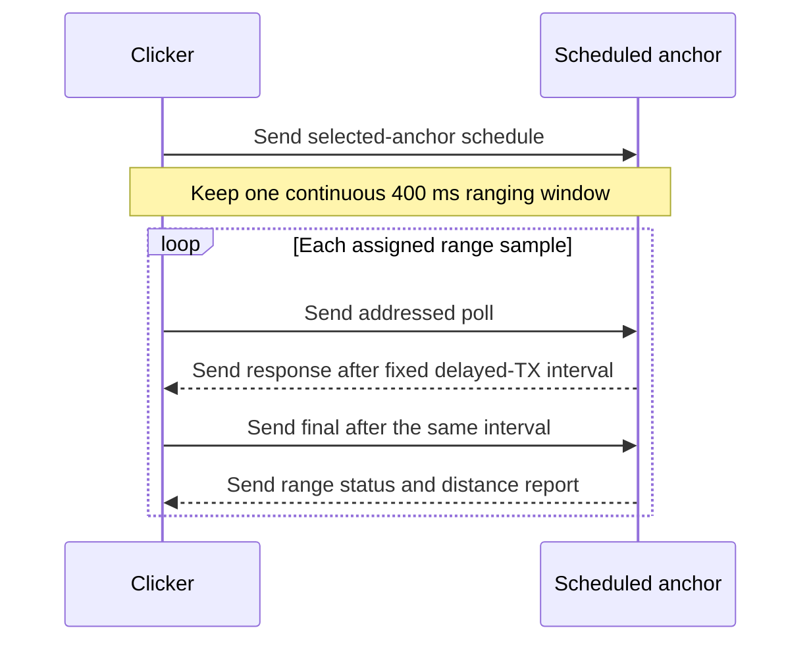

<!-- PAGE_ID: imec2-03-uwb-ranging-and-power -->

[← Start Here](README.md) / [One Click, End to End](02_one-click-end-to-end.md) / **UWB Wake, Ranging, and Low-Power Radio**

📚 Relevant source files

The following files were used as context for generating this wiki page:

- [mesh_radio_timing.h:4-23](https://github.com/Jubliano-sama/IMEC2/blob/f6594e41b57f5fd612aba182e0bd13cbbdd0c621/firmware/include/mesh_radio_timing.h#L4-L23)
- [uwb.h:14-172](https://github.com/Jubliano-sama/IMEC2/blob/f6594e41b57f5fd612aba182e0bd13cbbdd0c621/firmware/include/uwb.h#L14-L172)
- [uwb.h:267-292](https://github.com/Jubliano-sama/IMEC2/blob/f6594e41b57f5fd612aba182e0bd13cbbdd0c621/firmware/include/uwb.h#L267-L292)
- [uwb.c:78-123](https://github.com/Jubliano-sama/IMEC2/blob/f6594e41b57f5fd612aba182e0bd13cbbdd0c621/firmware/src/uwb.c#L78-L123)
- [uwb.c:844-881](https://github.com/Jubliano-sama/IMEC2/blob/f6594e41b57f5fd612aba182e0bd13cbbdd0c621/firmware/src/uwb.c#L844-L881)
- [app_config.h:150-249](https://github.com/Jubliano-sama/IMEC2/blob/f6594e41b57f5fd612aba182e0bd13cbbdd0c621/firmware/app/src/app_config.h#L150-L249)
- [main.c:83-110](https://github.com/Jubliano-sama/IMEC2/blob/f6594e41b57f5fd612aba182e0bd13cbbdd0c621/firmware/app/src/main.c#L83-L110)
- [app_anchor_radio.inc:1742-2130](https://github.com/Jubliano-sama/IMEC2/blob/f6594e41b57f5fd612aba182e0bd13cbbdd0c621/firmware/app/src/app_anchor_radio.inc#L1742-L2130)
- [dwm3000_driver.c:92-123](https://github.com/Jubliano-sama/IMEC2/blob/f6594e41b57f5fd612aba182e0bd13cbbdd0c621/firmware/app/src/dwm3000_driver.c#L92-L123)
- [dwm3000_driver.c:214-457](https://github.com/Jubliano-sama/IMEC2/blob/f6594e41b57f5fd612aba182e0bd13cbbdd0c621/firmware/app/src/dwm3000_driver.c#L214-L457)
- [dwm3000_driver_radio.inc:271-347](https://github.com/Jubliano-sama/IMEC2/blob/f6594e41b57f5fd612aba182e0bd13cbbdd0c621/firmware/app/src/dwm3000_driver_radio.inc#L271-L347)
- [dwm3000_driver_radio.inc:466-580](https://github.com/Jubliano-sama/IMEC2/blob/f6594e41b57f5fd612aba182e0bd13cbbdd0c621/firmware/app/src/dwm3000_driver_radio.inc#L466-L580)
- [dwm3000_driver_radio.inc:698-822](https://github.com/Jubliano-sama/IMEC2/blob/f6594e41b57f5fd612aba182e0bd13cbbdd0c621/firmware/app/src/dwm3000_driver_radio.inc#L698-L822)
- [dwm3000_driver_io.inc:272-405](https://github.com/Jubliano-sama/IMEC2/blob/f6594e41b57f5fd612aba182e0bd13cbbdd0c621/firmware/app/src/dwm3000_driver_io.inc#L272-L405)
- [dwm3000_driver_io.inc:417-570](https://github.com/Jubliano-sama/IMEC2/blob/f6594e41b57f5fd612aba182e0bd13cbbdd0c621/firmware/app/src/dwm3000_driver_io.inc#L417-L570)
- [dwm3000_driver_ds_twr.inc:2-327](https://github.com/Jubliano-sama/IMEC2/blob/f6594e41b57f5fd612aba182e0bd13cbbdd0c621/firmware/app/src/dwm3000_driver_ds_twr.inc#L2-L327)
- [dwm3000_driver_ds_twr.inc:507-825](https://github.com/Jubliano-sama/IMEC2/blob/f6594e41b57f5fd612aba182e0bd13cbbdd0c621/firmware/app/src/dwm3000_driver_ds_twr.inc#L507-L825)
- [dwm3000_runtime.h:14-119](https://github.com/Jubliano-sama/IMEC2/blob/f6594e41b57f5fd612aba182e0bd13cbbdd0c621/firmware/include/dwm3000_runtime.h#L14-L119)
- [dwm3000_runtime.c:296-383](https://github.com/Jubliano-sama/IMEC2/blob/f6594e41b57f5fd612aba182e0bd13cbbdd0c621/firmware/src/dwm3000_runtime.c#L296-L383)
- [dwm3000_runtime.c:516-607](https://github.com/Jubliano-sama/IMEC2/blob/f6594e41b57f5fd612aba182e0bd13cbbdd0c621/firmware/src/dwm3000_runtime.c#L516-L607)
- [app_anchor_low_power_policy.h:8-80](https://github.com/Jubliano-sama/IMEC2/blob/f6594e41b57f5fd612aba182e0bd13cbbdd0c621/firmware/app/src/app_anchor_low_power_policy.h#L8-L80)
- [Kconfig:327-340](https://github.com/Jubliano-sama/IMEC2/blob/f6594e41b57f5fd612aba182e0bd13cbbdd0c621/firmware/app/Kconfig#L327-L340)
- [UWB+BLE Architecture 0.6.6.md:667-708](https://github.com/Jubliano-sama/IMEC2/blob/f6594e41b57f5fd612aba182e0bd13cbbdd0c621/Documentation/UWB+BLE%20Architecture%200.6.6.md#L667-L708)

# UWB Wake, Ranging, and Low-Power Radio

> **Related Pages**: [One Click, End to End](02_one-click-end-to-end.md), [Protocol, Packets, and Data Contracts](04_protocol-packets-and-data-contracts.md), [Connected Routing](05_connected-routing-and-reliable-delivery.md), [Hardware Bring-Up and Troubleshooting](13_hardware-bring-up-and-troubleshooting.md)

A participant experiences one button press, but the radio path underneath it is deliberately staged: first make sleeping anchors reachable, then give selected anchors an exact ranging schedule, then accept a distance only after a complete and correctly timed exchange. This chapter stays on that radio boundary; [One Click, End to End](02_one-click-end-to-end.md) follows the resulting data onward, while [Connected Routing](05_connected-routing-and-reliable-delivery.md) owns delivery after the ranging burst.

---

<!-- BEGIN:AUTOGEN imec2-03-uwb-ranging-and-power-channel-five-coverage -->
## Channel 5 as the Contact Lane

Channel 5 is where a click first becomes shared radio context. The common UWB contract names channel 5 as the wake/contact lane and channel 9 as the mesh-payload lane, so discovery and ranging never depend on a sleeping anchor already having channel-9 event timing ([uwb.h:14-18](https://github.com/Jubliano-sama/IMEC2/blob/f6594e41b57f5fd612aba182e0bd13cbbdd0c621/firmware/include/uwb.h#L14-L18)).

The production-candidate timing defaults pair a 400 ms wake train with a low-duty anchor scan that is rescheduled after 380 ms and listens for 3,000 µs. A detected preamble may use a separate 15,000 µs completion allowance, so a frame that starts near the end of the short acquisition slice still has a bounded chance to finish ([mesh_radio_timing.h:4-9](https://github.com/Jubliano-sama/IMEC2/blob/f6594e41b57f5fd612aba182e0bd13cbbdd0c621/firmware/include/mesh_radio_timing.h#L4-L9)). Build-time guards require the wake train to exceed both the RX-off gap and a complete modeled scan-awake interval; a configuration that breaks that overlap does not compile ([main.c:83-107](https://github.com/Jubliano-sama/IMEC2/blob/f6594e41b57f5fd612aba182e0bd13cbbdd0c621/firmware/app/src/main.c#L83-L107)).

Before claiming that lane, the clicker performs decoded UWB politeness rather than treating raw energy as ownership. The current configuration requires two quiet samples, bounds relevant-traffic waiting, and applies retry contention only after a failed attempt; the wake claim itself carries the wake channel, ranging channel, remaining wake-train time, discovery offset, and claimed duration so an anchor can judge the contact in context ([app_config.h:164-171](https://github.com/Jubliano-sama/IMEC2/blob/f6594e41b57f5fd612aba182e0bd13cbbdd0c621/firmware/app/src/app_config.h#L164-L171), [uwb.h:217-229](https://github.com/Jubliano-sama/IMEC2/blob/f6594e41b57f5fd612aba182e0bd13cbbdd0c621/firmware/include/uwb.h#L217-L229)).

The anchor scan follows the same bounded handoff:

1. It defers while an accepted click window, survey, relay transmission, route wait, channel-9 receive, or another UWB owner is active, then retries instead of using the radio concurrently ([app_anchor_radio.inc:1796-1834](https://github.com/Jubliano-sama/IMEC2/blob/f6594e41b57f5fd612aba182e0bd13cbbdd0c621/firmware/app/src/app_anchor_radio.inc#L1796-L1834)).
2. It prepares the channel-5 wake PHY, opens the short acquisition slice, and extends only an already-detected transmission into the bounded completion interval ([app_anchor_radio.inc:1891-1930](https://github.com/Jubliano-sama/IMEC2/blob/f6594e41b57f5fd612aba182e0bd13cbbdd0c621/firmware/app/src/app_anchor_radio.inc#L1891-L1930)).
3. It decodes a complete wake claim, checks whether that claim belongs to click service or another channel-5 control path, and only then transfers radio ownership; malformed activity is counted and cooled down rather than promoted into a click ([app_anchor_radio.inc:1932-2024](https://github.com/Jubliano-sama/IMEC2/blob/f6594e41b57f5fd612aba182e0bd13cbbdd0c621/firmware/app/src/app_anchor_radio.inc#L1932-L2024)).

That last distinction matters: preamble activity extends the chance to receive a frame, but activity alone is not a decoded frame. The driver copies data only after the DWM3000 reports a good completed frame (`RXFCG`); acquisition with no activity times out, and an oversize or unreadable completed frame fails explicitly ([dwm3000_driver_io.inc:471-551](https://github.com/Jubliano-sama/IMEC2/blob/f6594e41b57f5fd612aba182e0bd13cbbdd0c621/firmware/app/src/dwm3000_driver_io.inc#L471-L551)).

Sources: [mesh_radio_timing.h:4-23](https://github.com/Jubliano-sama/IMEC2/blob/f6594e41b57f5fd612aba182e0bd13cbbdd0c621/firmware/include/mesh_radio_timing.h#L4-L23), [main.c:83-110](https://github.com/Jubliano-sama/IMEC2/blob/f6594e41b57f5fd612aba182e0bd13cbbdd0c621/firmware/app/src/main.c#L83-L110), [app_anchor_radio.inc:1796-2024](https://github.com/Jubliano-sama/IMEC2/blob/f6594e41b57f5fd612aba182e0bd13cbbdd0c621/firmware/app/src/app_anchor_radio.inc#L1796-L2024), [dwm3000_driver_io.inc:417-570](https://github.com/Jubliano-sama/IMEC2/blob/f6594e41b57f5fd612aba182e0bd13cbbdd0c621/firmware/app/src/dwm3000_driver_io.inc#L417-L570)
<!-- END:AUTOGEN imec2-03-uwb-ranging-and-power-channel-five-coverage -->

---

<!-- BEGIN:AUTOGEN imec2-03-uwb-ranging-and-power-ranging-exchange -->
## The Scheduled DS-TWR Exchange

Discovery answers “which anchors can participate”; the range schedule answers “which anchor speaks when.” It binds the click identity and nonce to a selected-anchor list, channel, reply delay, first-poll delay, poll spacing, burst duration, exchange capacity, success requirement, STS mode, diagnostic policy, and per-anchor sequence/sample counts ([uwb.h:267-292](https://github.com/Jubliano-sama/IMEC2/blob/f6594e41b57f5fd612aba182e0bd13cbbdd0c621/firmware/include/uwb.h#L267-L292)).

The schedule validator is the first timing gate. It requires channel 5, the exact configured DS-TWR reply delay, at least 50 ms poll spacing, at least a 400 ms burst, at least 33,000 µs exchange stride, and enough burst time for every declared exchange. It also rejects incompatible STS, diagnostic, count, identity, and flag combinations ([uwb.c:844-881](https://github.com/Jubliano-sama/IMEC2/blob/f6594e41b57f5fd612aba182e0bd13cbbdd0c621/firmware/src/uwb.c#L844-L881)).

| Timing contract | Current value | Why it exists |
| --- | ---: | --- |
| Responder response delay | 8,000 DWM/DW3000 UUS | The long-range preset is the protocol default; it remains explicitly marked for final-path recalibration ([uwb.h:107-118](https://github.com/Jubliano-sama/IMEC2/blob/f6594e41b57f5fd612aba182e0bd13cbbdd0c621/firmware/include/uwb.h#L107-L118)). |
| Initiator final delay | Same 8,000 UUS | Equal reply delays preserve the DS-TWR symmetry; the longer response frame gives the initiator 76 µs more receive work, so the shorter responder path waits instead of using a different delay ([dwm3000_driver.c:92-123](https://github.com/Jubliano-sama/IMEC2/blob/f6594e41b57f5fd612aba182e0bd13cbbdd0c621/firmware/app/src/dwm3000_driver.c#L92-L123)). |
| Scheduled poll spacing | At least 50 ms | The schedule rejects a smaller value before the anchor opens a ranging window ([uwb.h:98-105](https://github.com/Jubliano-sama/IMEC2/blob/f6594e41b57f5fd612aba182e0bd13cbbdd0c621/firmware/include/uwb.h#L98-L105)). |
| Shared burst | At least 400 ms | Selected anchors remain inside one bounded window rather than restarting the window for every sample ([uwb.h:98-102](https://github.com/Jubliano-sama/IMEC2/blob/f6594e41b57f5fd612aba182e0bd13cbbdd0c621/firmware/include/uwb.h#L98-L102)). |

On the initiator, the poll starts immediate TX with response expected; after a valid response, firmware validates both measured reply intervals, patches only the timestamp fields into a pre-staged final frame, and arms delayed final TX. A missed delayed-TX deadline becomes `RANGE_DELAYED_TX_MISSED`, not a best-effort immediate final ([dwm3000_driver_ds_twr.inc:68-118](https://github.com/Jubliano-sama/IMEC2/blob/f6594e41b57f5fd612aba182e0bd13cbbdd0c621/firmware/app/src/dwm3000_driver_ds_twr.inc#L68-L118), [dwm3000_driver_ds_twr.inc:187-262](https://github.com/Jubliano-sama/IMEC2/blob/f6594e41b57f5fd612aba182e0bd13cbbdd0c621/firmware/app/src/dwm3000_driver_ds_twr.inc#L187-L262)). Optional diagnostics run only after the delayed final has been accepted, so diagnostic SPI traffic cannot consume final-arm headroom ([dwm3000_driver_ds_twr.inc:265-286](https://github.com/Jubliano-sama/IMEC2/blob/f6594e41b57f5fd612aba182e0bd13cbbdd0c621/firmware/app/src/dwm3000_driver_ds_twr.inc#L265-L286)).

On the responder, a complete addressed poll schedules the response and a bounded final receive window. The final must repeat the poll’s sequence, round, network, session, nonce, addresses, flags, and full device identities, and both delayed intervals must validate before distance is computed ([dwm3000_driver_ds_twr.inc:669-715](https://github.com/Jubliano-sama/IMEC2/blob/f6594e41b57f5fd612aba182e0bd13cbbdd0c621/firmware/app/src/dwm3000_driver_ds_twr.inc#L669-L715), [dwm3000_driver_ds_twr.inc:738-813](https://github.com/Jubliano-sama/IMEC2/blob/f6594e41b57f5fd612aba182e0bd13cbbdd0c621/firmware/app/src/dwm3000_driver_ds_twr.inc#L738-L813)). The report therefore carries an explicit range status; a frame may complete at the radio while still being rejected as bad, mistimed, or meant for another exchange.

Sources: [uwb.h:98-118](https://github.com/Jubliano-sama/IMEC2/blob/f6594e41b57f5fd612aba182e0bd13cbbdd0c621/firmware/include/uwb.h#L98-L118), [uwb.h:267-292](https://github.com/Jubliano-sama/IMEC2/blob/f6594e41b57f5fd612aba182e0bd13cbbdd0c621/firmware/include/uwb.h#L267-L292), [uwb.c:844-881](https://github.com/Jubliano-sama/IMEC2/blob/f6594e41b57f5fd612aba182e0bd13cbbdd0c621/firmware/src/uwb.c#L844-L881), [dwm3000_driver.c:92-123](https://github.com/Jubliano-sama/IMEC2/blob/f6594e41b57f5fd612aba182e0bd13cbbdd0c621/firmware/app/src/dwm3000_driver.c#L92-L123), [dwm3000_driver_ds_twr.inc:2-327](https://github.com/Jubliano-sama/IMEC2/blob/f6594e41b57f5fd612aba182e0bd13cbbdd0c621/firmware/app/src/dwm3000_driver_ds_twr.inc#L2-L327), [dwm3000_driver_ds_twr.inc:507-825](https://github.com/Jubliano-sama/IMEC2/blob/f6594e41b57f5fd612aba182e0bd13cbbdd0c621/firmware/app/src/dwm3000_driver_ds_twr.inc#L507-L825)
<!-- END:AUTOGEN imec2-03-uwb-ranging-and-power-ranging-exchange -->

---

<!-- BEGIN:AUTOGEN imec2-03-uwb-ranging-and-power-driver-contract -->
## DWM3000 Runtime Contract

The DWM3000 has one radio and a strict preparation order. The production port initializes and wakes the chip on 2 MHz SPI, validates device identity, then switches to 32 MHz for runtime transactions; waking from retained sleep follows the same slow-SPI wake and restore sequence before returning to fast SPI ([dwm3000_driver_radio.inc:271-292](https://github.com/Jubliano-sama/IMEC2/blob/f6594e41b57f5fd612aba182e0bd13cbbdd0c621/firmware/app/src/dwm3000_driver_radio.inc#L271-L292), [dwm3000_driver_radio.inc:466-580](https://github.com/Jubliano-sama/IMEC2/blob/f6594e41b57f5fd612aba182e0bd13cbbdd0c621/firmware/app/src/dwm3000_driver_radio.inc#L466-L580)). The hardware-independent runtime model encodes the same order and returns explicit busy, SPI-order, radio-state, readiness, overflow, and missed-deadline errors when a caller violates it ([dwm3000_runtime.h:14-60](https://github.com/Jubliano-sama/IMEC2/blob/f6594e41b57f5fd612aba182e0bd13cbbdd0c621/firmware/include/dwm3000_runtime.h#L14-L60)).

The code-bound PHY profiles are:

| Use | Channel and PHY | Framing |
| --- | --- | --- |
| Wake, discovery, and DS-TWR | Channel 5, 850 kbps, 4,096-symbol preamble, PAC16, code 9, 16-symbol DWM SFD, SFD timeout 4,097, STS off | Standard PHR for wake/range frames; the channel-5 mesh-control variant uses extended PHR ([dwm3000_driver.c:233-273](https://github.com/Jubliano-sama/IMEC2/blob/f6594e41b57f5fd612aba182e0bd13cbbdd0c621/firmware/app/src/dwm3000_driver.c#L233-L273), [dwm3000_driver.c:395-441](https://github.com/Jubliano-sama/IMEC2/blob/f6594e41b57f5fd612aba182e0bd13cbbdd0c621/firmware/app/src/dwm3000_driver.c#L395-L441)). |
| Negotiated mesh payload | Channel 9, 850 kbps, 1,024-symbol preamble, PAC8, code 9, IEEE 4z SFD, SFD timeout 1,025, STS off | Extended PHR for larger mesh packets ([dwm3000_driver.c:284-319](https://github.com/Jubliano-sama/IMEC2/blob/f6594e41b57f5fd612aba182e0bd13cbbdd0c621/firmware/app/src/dwm3000_driver.c#L284-L319), [dwm3000_driver.c:443-457](https://github.com/Jubliano-sama/IMEC2/blob/f6594e41b57f5fd612aba182e0bd13cbbdd0c621/firmware/app/src/dwm3000_driver.c#L443-L457)). |

Completion is polled because the board path does not depend on a DWM3000 IRQ. Configuration disables DWM3000 interrupts, and waits read `SYS_STATUS` on a bounded deadline with 50 µs pauses, recording success, abort, or timeout rather than waiting forever ([dwm3000_driver_radio.inc:310-347](https://github.com/Jubliano-sama/IMEC2/blob/f6594e41b57f5fd612aba182e0bd13cbbdd0c621/firmware/app/src/dwm3000_driver_radio.inc#L310-L347), [dwm3000_driver_radio.inc:698-822](https://github.com/Jubliano-sama/IMEC2/blob/f6594e41b57f5fd612aba182e0bd13cbbdd0c621/firmware/app/src/dwm3000_driver_radio.inc#L698-L822)). This keeps radio windows bounded, but it keeps the MCU and SPI active during those waits.

Retained sleep is a contract rather than a hint. The driver’s sleep mode requires configuration preservation and CSn/WAKEUP wake sources at build time; on wake it restores common state and, when the requested PHY matches, restores TX/RX state before fast-SPI use ([dwm3000_driver.c:214-229](https://github.com/Jubliano-sama/IMEC2/blob/f6594e41b57f5fd612aba182e0bd13cbbdd0c621/firmware/app/src/dwm3000_driver.c#L214-L229), [dwm3000_driver_radio.inc:535-580](https://github.com/Jubliano-sama/IMEC2/blob/f6594e41b57f5fd612aba182e0bd13cbbdd0c621/firmware/app/src/dwm3000_driver_radio.inc#L535-L580)). If restore fails, the production path attempts a full reset and reconfiguration instead of continuing with assumed state ([dwm3000_driver_radio.inc:589-613](https://github.com/Jubliano-sama/IMEC2/blob/f6594e41b57f5fd612aba182e0bd13cbbdd0c621/firmware/app/src/dwm3000_driver_radio.inc#L589-L613)).

Delayed transmission has an equally strict deadline. The runtime model includes the fast-SPI start transaction in the budget and returns `DWM3000_RUNTIME_ERR_DEADLINE_MISSED` when that transaction finishes at or after the requested air start, so simulations cannot turn a late final or response into an on-time one ([dwm3000_runtime.c:516-557](https://github.com/Jubliano-sama/IMEC2/blob/f6594e41b57f5fd612aba182e0bd13cbbdd0c621/firmware/src/dwm3000_runtime.c#L516-L557)). Preparing a PHY similarly distinguishes a valid retained same-PHY restore from the reset/configure path and does not declare readiness until identity and PLL work complete ([dwm3000_runtime.c:296-383](https://github.com/Jubliano-sama/IMEC2/blob/f6594e41b57f5fd612aba182e0bd13cbbdd0c621/firmware/src/dwm3000_runtime.c#L296-L383)).

Sources: [dwm3000_driver.c:214-457](https://github.com/Jubliano-sama/IMEC2/blob/f6594e41b57f5fd612aba182e0bd13cbbdd0c621/firmware/app/src/dwm3000_driver.c#L214-L457), [dwm3000_driver_radio.inc:271-347](https://github.com/Jubliano-sama/IMEC2/blob/f6594e41b57f5fd612aba182e0bd13cbbdd0c621/firmware/app/src/dwm3000_driver_radio.inc#L271-L347), [dwm3000_driver_radio.inc:466-650](https://github.com/Jubliano-sama/IMEC2/blob/f6594e41b57f5fd612aba182e0bd13cbbdd0c621/firmware/app/src/dwm3000_driver_radio.inc#L466-L650), [dwm3000_driver_radio.inc:698-822](https://github.com/Jubliano-sama/IMEC2/blob/f6594e41b57f5fd612aba182e0bd13cbbdd0c621/firmware/app/src/dwm3000_driver_radio.inc#L698-L822), [dwm3000_runtime.h:14-119](https://github.com/Jubliano-sama/IMEC2/blob/f6594e41b57f5fd612aba182e0bd13cbbdd0c621/firmware/include/dwm3000_runtime.h#L14-L119), [dwm3000_runtime.c:296-383](https://github.com/Jubliano-sama/IMEC2/blob/f6594e41b57f5fd612aba182e0bd13cbbdd0c621/firmware/src/dwm3000_runtime.c#L296-L383), [dwm3000_runtime.c:516-607](https://github.com/Jubliano-sama/IMEC2/blob/f6594e41b57f5fd612aba182e0bd13cbbdd0c621/firmware/src/dwm3000_runtime.c#L516-L607)
<!-- END:AUTOGEN imec2-03-uwb-ranging-and-power-driver-contract -->

---

<!-- BEGIN:AUTOGEN imec2-03-uwb-ranging-and-power-energy-and-failure -->
## Power Budget and Fail-Closed Behavior

Low duty is achieved by making the expensive windows explicit. The current production defaults are a 380 ms reschedule interval and a 3,000 µs receive slice; the firmware budget adds 2,500 µs startup and 170 µs PLL time to form a modeled 5,670 µs awake interval per scan cycle, and it rejects production anchor configurations above the calibrated 13,000 µs/s RX budget ([Kconfig:327-340](https://github.com/Jubliano-sama/IMEC2/blob/f6594e41b57f5fd612aba182e0bd13cbbdd0c621/firmware/app/Kconfig#L327-L340), [app_config.h:196-250](https://github.com/Jubliano-sama/IMEC2/blob/f6594e41b57f5fd612aba182e0bd13cbbdd0c621/firmware/app/src/app_config.h#L196-L250), [main.c:88-101](https://github.com/Jubliano-sama/IMEC2/blob/f6594e41b57f5fd612aba182e0bd13cbbdd0c621/firmware/app/src/main.c#L88-L101)).

> **Configuration note:** the versioned architecture document’s anchor battery table still calculates from a 5 ms receive slice, while the current Kconfig and production timing header both specify 3 ms. Its 5 ms daily-consumption and battery-life totals should be rebaselined before they are used for a current hardware decision ([UWB+BLE Architecture 0.6.6.md:667-708](https://github.com/Jubliano-sama/IMEC2/blob/f6594e41b57f5fd612aba182e0bd13cbbdd0c621/Documentation/UWB+BLE%20Architecture%200.6.6.md#L667-L708), [mesh_radio_timing.h:4-8](https://github.com/Jubliano-sama/IMEC2/blob/f6594e41b57f5fd612aba182e0bd13cbbdd0c621/firmware/include/mesh_radio_timing.h#L4-L8)).

After a scan or active exchange, the anchor selects retained idle for a connected radio and retained standby otherwise. The transition policy permits at most two transition attempts with one bounded recovery between them; a second failure is terminal for that transition instead of becoming an unbounded retry loop ([app_anchor_low_power_policy.h:8-31](https://github.com/Jubliano-sama/IMEC2/blob/f6594e41b57f5fd612aba182e0bd13cbbdd0c621/firmware/app/src/app_anchor_low_power_policy.h#L8-L31), [app_anchor_low_power_policy.h:51-80](https://github.com/Jubliano-sama/IMEC2/blob/f6594e41b57f5fd612aba182e0bd13cbbdd0c621/firmware/app/src/app_anchor_low_power_policy.h#L51-L80)). The scan releases the radio only after that transition returns and lengthens its next retry when low-power entry fails ([app_anchor_radio.inc:2086-2104](https://github.com/Jubliano-sama/IMEC2/blob/f6594e41b57f5fd612aba182e0bd13cbbdd0c621/firmware/app/src/app_anchor_radio.inc#L2086-L2104)).

The same boundedness protects measurement truth:

- **Incomplete RF activity does not decode.** Channel-5 acquisition may extend after activity, but only `RXFCG` yields bytes; no completed frame, an unreadable frame, or an oversize frame returns a timeout or frame error ([dwm3000_driver_io.inc:471-551](https://github.com/Jubliano-sama/IMEC2/blob/f6594e41b57f5fd612aba182e0bd13cbbdd0c621/firmware/app/src/dwm3000_driver_io.inc#L471-L551)).
- **A completed byte sequence still must be exact.** Shared decoders require the expected length, marker, version, message type, and—where the protocol supplies one—a matching CRC before exposing fields to session logic ([uwb.c:78-123](https://github.com/Jubliano-sama/IMEC2/blob/f6594e41b57f5fd612aba182e0bd13cbbdd0c621/firmware/src/uwb.c#L78-L123), [uwb.c:1096-1113](https://github.com/Jubliano-sama/IMEC2/blob/f6594e41b57f5fd612aba182e0bd13cbbdd0c621/firmware/src/uwb.c#L1096-L1113)).
- **A valid frame must belong to this exchange.** Wrong identity becomes `RANGE_WRONG_TARGET`, bad delayed timing becomes `RANGE_TIMING_INVALID`, and distance computation runs only after those checks pass ([dwm3000_driver_ds_twr.inc:780-825](https://github.com/Jubliano-sama/IMEC2/blob/f6594e41b57f5fd612aba182e0bd13cbbdd0c621/firmware/app/src/dwm3000_driver_ds_twr.inc#L780-L825)).
- **A late radio action is failure, not recovery data.** Missing the delayed response or final deadline returns `RANGE_DELAYED_TX_MISSED`; firmware does not substitute an immediate transmission and pretend the original schedule held ([dwm3000_driver_ds_twr.inc:238-262](https://github.com/Jubliano-sama/IMEC2/blob/f6594e41b57f5fd612aba182e0bd13cbbdd0c621/firmware/app/src/dwm3000_driver_ds_twr.inc#L238-L262), [dwm3000_driver_ds_twr.inc:695-715](https://github.com/Jubliano-sama/IMEC2/blob/f6594e41b57f5fd612aba182e0bd13cbbdd0c621/firmware/app/src/dwm3000_driver_ds_twr.inc#L695-L715)).

That fail-closed behavior is why a participant can trust a reported range: retries may spend more time and energy, but they cannot convert clipped airtime, malformed bytes, another click’s identity, or a missed delayed-TX slot into a successful distance. The next chapter, [Protocol, Packets, and Data Contracts](04_protocol-packets-and-data-contracts.md), follows the identities and statuses that preserve this distinction outside the radio driver.

Sources: [Kconfig:327-340](https://github.com/Jubliano-sama/IMEC2/blob/f6594e41b57f5fd612aba182e0bd13cbbdd0c621/firmware/app/Kconfig#L327-L340), [app_config.h:196-250](https://github.com/Jubliano-sama/IMEC2/blob/f6594e41b57f5fd612aba182e0bd13cbbdd0c621/firmware/app/src/app_config.h#L196-L250), [app_anchor_low_power_policy.h:8-80](https://github.com/Jubliano-sama/IMEC2/blob/f6594e41b57f5fd612aba182e0bd13cbbdd0c621/firmware/app/src/app_anchor_low_power_policy.h#L8-L80), [app_anchor_radio.inc:2086-2104](https://github.com/Jubliano-sama/IMEC2/blob/f6594e41b57f5fd612aba182e0bd13cbbdd0c621/firmware/app/src/app_anchor_radio.inc#L2086-L2104), [dwm3000_driver_io.inc:417-570](https://github.com/Jubliano-sama/IMEC2/blob/f6594e41b57f5fd612aba182e0bd13cbbdd0c621/firmware/app/src/dwm3000_driver_io.inc#L417-L570), [uwb.c:78-123](https://github.com/Jubliano-sama/IMEC2/blob/f6594e41b57f5fd612aba182e0bd13cbbdd0c621/firmware/src/uwb.c#L78-L123), [dwm3000_driver_ds_twr.inc:238-262](https://github.com/Jubliano-sama/IMEC2/blob/f6594e41b57f5fd612aba182e0bd13cbbdd0c621/firmware/app/src/dwm3000_driver_ds_twr.inc#L238-L262), [dwm3000_driver_ds_twr.inc:695-825](https://github.com/Jubliano-sama/IMEC2/blob/f6594e41b57f5fd612aba182e0bd13cbbdd0c621/firmware/app/src/dwm3000_driver_ds_twr.inc#L695-L825)
<!-- END:AUTOGEN imec2-03-uwb-ranging-and-power-energy-and-failure -->

---

**Previous:** [One Click, End to End](02_one-click-end-to-end.md)

**Next:** [Protocol, Packets, and Data Contracts](04_protocol-packets-and-data-contracts.md)

**Related:** [Connected Routing, Priority, and Reliable Delivery](05_connected-routing-and-reliable-delivery.md) · [Hardware Bring-Up and Troubleshooting](13_hardware-bring-up-and-troubleshooting.md)
