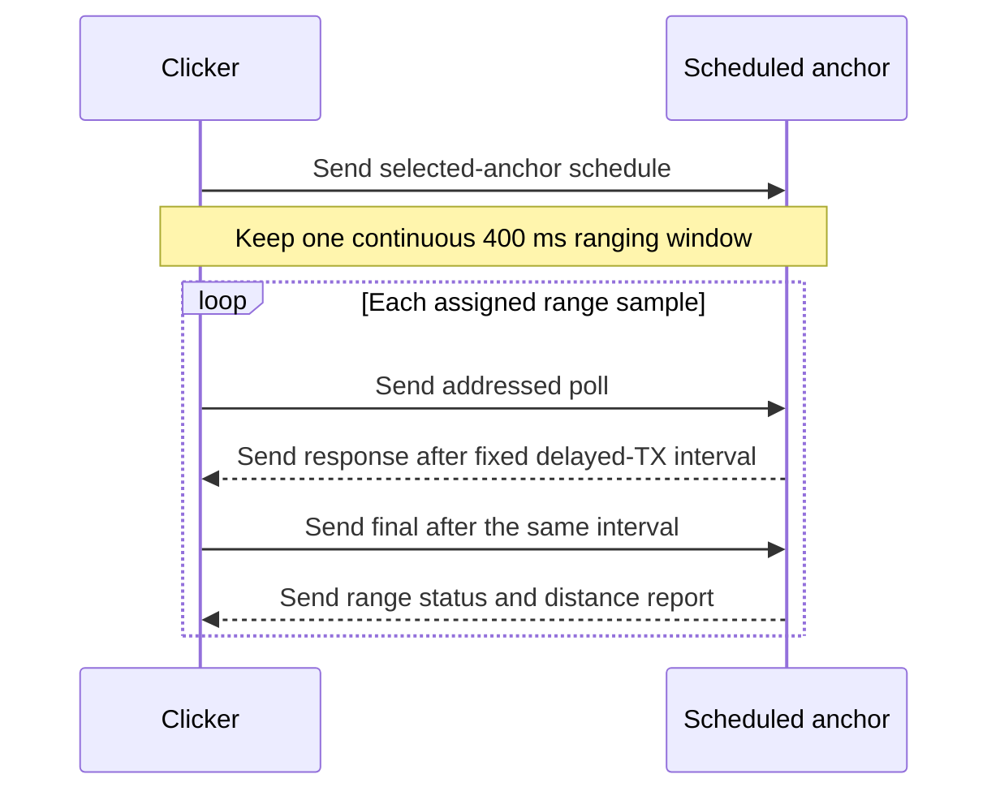

<!-- PAGE_ID: imec2-03-uwb-ranging-and-power -->

[← Start Here](README.md) / [One Click, End to End](02_one-click-end-to-end.md) / **UWB Wake, Ranging, and Low-Power Radio**

📚 Historical generation context (f6594e4)

The following files were used as context for generating this wiki page:

- [mesh_radio_timing.h:4-23](https://github.com/Jubliano-sama/IMEC2/blob/f6594e41b57f5fd612aba182e0bd13cbbdd0c621/firmware/include/mesh_radio_timing.h#L4-L23)
- [uwb.h:14-172](https://github.com/Jubliano-sama/IMEC2/blob/f6594e41b57f5fd612aba182e0bd13cbbdd0c621/firmware/include/uwb.h#L14-L172)
- [uwb.h:267-292](https://github.com/Jubliano-sama/IMEC2/blob/f6594e41b57f5fd612aba182e0bd13cbbdd0c621/firmware/include/uwb.h#L267-L292)
- [uwb.c:78-123](https://github.com/Jubliano-sama/IMEC2/blob/f6594e41b57f5fd612aba182e0bd13cbbdd0c621/firmware/src/uwb.c#L78-L123)
- [uwb.c:844-881](https://github.com/Jubliano-sama/IMEC2/blob/f6594e41b57f5fd612aba182e0bd13cbbdd0c621/firmware/src/uwb.c#L844-L881)
- [app_config.h:150-249](https://github.com/Jubliano-sama/IMEC2/blob/f6594e41b57f5fd612aba182e0bd13cbbdd0c621/firmware/app/src/app_config.h#L150-L249)
- [main.c:83-110](https://github.com/Jubliano-sama/IMEC2/blob/f6594e41b57f5fd612aba182e0bd13cbbdd0c621/firmware/app/src/main.c#L83-L110)
- [app_anchor_radio.inc:1742-2130](https://github.com/Jubliano-sama/IMEC2/blob/f6594e41b57f5fd612aba182e0bd13cbbdd0c621/firmware/app/src/app_anchor_radio.inc#L1742-L2130)
- [dwm3000_driver.c:92-123](https://github.com/Jubliano-sama/IMEC2/blob/f6594e41b57f5fd612aba182e0bd13cbbdd0c621/firmware/app/src/dwm3000_driver.c#L92-L123)
- [dwm3000_driver.c:214-457](https://github.com/Jubliano-sama/IMEC2/blob/f6594e41b57f5fd612aba182e0bd13cbbdd0c621/firmware/app/src/dwm3000_driver.c#L214-L457)
- [dwm3000_driver_radio.inc:271-347](https://github.com/Jubliano-sama/IMEC2/blob/f6594e41b57f5fd612aba182e0bd13cbbdd0c621/firmware/app/src/dwm3000_driver_radio.inc#L271-L347)
- [dwm3000_driver_radio.inc:466-580](https://github.com/Jubliano-sama/IMEC2/blob/f6594e41b57f5fd612aba182e0bd13cbbdd0c621/firmware/app/src/dwm3000_driver_radio.inc#L466-L580)
- [dwm3000_driver_radio.inc:698-822](https://github.com/Jubliano-sama/IMEC2/blob/f6594e41b57f5fd612aba182e0bd13cbbdd0c621/firmware/app/src/dwm3000_driver_radio.inc#L698-L822)
- [dwm3000_driver_io.inc:272-405](https://github.com/Jubliano-sama/IMEC2/blob/f6594e41b57f5fd612aba182e0bd13cbbdd0c621/firmware/app/src/dwm3000_driver_io.inc#L272-L405)
- [dwm3000_driver_io.inc:417-570](https://github.com/Jubliano-sama/IMEC2/blob/f6594e41b57f5fd612aba182e0bd13cbbdd0c621/firmware/app/src/dwm3000_driver_io.inc#L417-L570)
- [dwm3000_driver_ds_twr.inc:2-327](https://github.com/Jubliano-sama/IMEC2/blob/f6594e41b57f5fd612aba182e0bd13cbbdd0c621/firmware/app/src/dwm3000_driver_ds_twr.inc#L2-L327)
- [dwm3000_driver_ds_twr.inc:507-825](https://github.com/Jubliano-sama/IMEC2/blob/f6594e41b57f5fd612aba182e0bd13cbbdd0c621/firmware/app/src/dwm3000_driver_ds_twr.inc#L507-L825)
- [dwm3000_runtime.h:14-119](https://github.com/Jubliano-sama/IMEC2/blob/f6594e41b57f5fd612aba182e0bd13cbbdd0c621/firmware/include/dwm3000_runtime.h#L14-L119)
- [dwm3000_runtime.c:296-383](https://github.com/Jubliano-sama/IMEC2/blob/f6594e41b57f5fd612aba182e0bd13cbbdd0c621/firmware/src/dwm3000_runtime.c#L296-L383)
- [dwm3000_runtime.c:516-607](https://github.com/Jubliano-sama/IMEC2/blob/f6594e41b57f5fd612aba182e0bd13cbbdd0c621/firmware/src/dwm3000_runtime.c#L516-L607)
- [app_anchor_low_power_policy.h:8-80](https://github.com/Jubliano-sama/IMEC2/blob/f6594e41b57f5fd612aba182e0bd13cbbdd0c621/firmware/app/src/app_anchor_low_power_policy.h#L8-L80)
- [Kconfig:327-340](https://github.com/Jubliano-sama/IMEC2/blob/f6594e41b57f5fd612aba182e0bd13cbbdd0c621/firmware/app/Kconfig#L327-L340)
- [UWB+BLE Architecture 0.6.6.md:667-708](https://github.com/Jubliano-sama/IMEC2/blob/f6594e41b57f5fd612aba182e0bd13cbbdd0c621/Documentation/UWB+BLE%20Architecture%200.6.6.md#L667-L708)

# UWB Wake, Ranging, and Low-Power Radio

> **Related Pages**: [One Click, End to End](02_one-click-end-to-end.md), [Protocol, Packets, and Data Contracts](04_protocol-packets-and-data-contracts.md), [Connected Routing](05_connected-routing-and-reliable-delivery.md), [Hardware Bring-Up and Troubleshooting](13_hardware-bring-up-and-troubleshooting.md)

A participant experiences one button press, but the radio path underneath it is deliberately staged: first make sleeping anchors reachable, then give selected anchors an exact ranging schedule, then accept a distance only after a complete and correctly timed exchange. This chapter stays on that radio boundary; [One Click, End to End](02_one-click-end-to-end.md) follows the resulting data onward, while [Connected Routing](05_connected-routing-and-reliable-delivery.md) owns delivery after the ranging burst.

---

<!-- BEGIN:AUTOGEN imec2-03-uwb-ranging-and-power-channel-five-coverage -->
## Channel 5 as the Contact Lane

Channel 5 is the contact, control, ranging, and preemption lane; channel 9 is the negotiated payload lane. That separation lets a clicker wake and range sleeping anchors before any node depends on channel-9 event timing, while gateway control and local click work can still preempt lower-priority payload traffic ([UWB+BLE Architecture 0.6.6.2.md:52-73](https://github.com/Jubliano-sama/IMEC2/blob/e04a0a7cfccd21c8821f2975119fcafc85705e4c/Documentation/UWB%2BBLE%20Architecture%200.6.6.2.md#L52-L73)).

The production timing contract pairs a 400 ms wake train with a low-duty anchor scan that is rescheduled after 380 ms and listens for 3,000 µs. Detected activity gets a separate bounded 15,000 µs completion allowance, so a frame that starts near the end of acquisition can finish without turning the scan into an open-ended receive window ([mesh_radio_timing.h:4-23](https://github.com/Jubliano-sama/IMEC2/blob/e04a0a7cfccd21c8821f2975119fcafc85705e4c/firmware/include/mesh_radio_timing.h#L4-L23)). Build-time guards require the wake train to cover both the RX-off gap and the modeled startup, PLL, and acquisition interval; a configuration that loses that overlap does not compile ([main.c:115-164](https://github.com/Jubliano-sama/IMEC2/blob/e04a0a7cfccd21c8821f2975119fcafc85705e4c/firmware/app/src/main.c#L115-L164)).

Before transmitting, the clicker applies two bounded channel-5 courtesy checks: each of four flood opportunities uses a 20 ms sniff, while decoded-traffic politeness requires two consecutive 50 ms quiet samples, or 100 ms total ([mesh_radio_timing.h:21-23](https://github.com/Jubliano-sama/IMEC2/blob/e04a0a7cfccd21c8821f2975119fcafc85705e4c/firmware/include/mesh_radio_timing.h#L21-L23), [app_config.h:165-170](https://github.com/Jubliano-sama/IMEC2/blob/e04a0a7cfccd21c8821f2975119fcafc85705e4c/firmware/app/src/app_config.h#L165-L170), [main.c:150-170](https://github.com/Jubliano-sama/IMEC2/blob/e04a0a7cfccd21c8821f2975119fcafc85705e4c/firmware/app/src/main.c#L150-L170)). The wake claim carries both channels, remaining wake time, discovery timing, minimum and maximum anchor counts, and a nonce, so the anchor can validate the requested session rather than infer it from RF activity ([uwb.h:217-232](https://github.com/Jubliano-sama/IMEC2/blob/e04a0a7cfccd21c8821f2975119fcafc85705e4c/firmware/include/uwb.h#L217-L232)). A normal click requires three anchors and can schedule no more than eight; discovering only one or two releases those anchors before retry rather than lowering normal-click acceptance ([UWB+BLE Architecture 0.6.6.2.md:148-157](https://github.com/Jubliano-sama/IMEC2/blob/e04a0a7cfccd21c8821f2975119fcafc85705e4c/Documentation/UWB%2BBLE%20Architecture%200.6.6.2.md#L148-L157)). The one-anchor acceptance exception is limited to the explicit Stage 1 diagnostic escape hatch ([Kconfig:310-316](https://github.com/Jubliano-sama/IMEC2/blob/e04a0a7cfccd21c8821f2975119fcafc85705e4c/firmware/app/Kconfig#L310-L316)).

The anchor scan follows the same bounded handoff:

1. It defers while a click, survey, relay, route wait, channel-9 receive window, or another radio owner is active, then reschedules instead of using the single UWB radio concurrently ([app_anchor_radio.inc:1755-1836](https://github.com/Jubliano-sama/IMEC2/blob/e04a0a7cfccd21c8821f2975119fcafc85705e4c/firmware/app/src/app_anchor_radio.inc#L1755-L1836)).
2. It prepares the channel-5 wake PHY, opens the short acquisition slice, and extends only detected activity into the bounded completion interval ([app_anchor_radio.inc:1893-1932](https://github.com/Jubliano-sama/IMEC2/blob/e04a0a7cfccd21c8821f2975119fcafc85705e4c/firmware/app/src/app_anchor_radio.inc#L1893-L1932)).
3. It decodes a complete wake claim, routes other valid channel-5 control classes to their owners, and transfers click ownership only for a valid claim; malformed activity is counted and cooled down instead of becoming a click ([app_anchor_radio.inc:1934-2025](https://github.com/Jubliano-sama/IMEC2/blob/e04a0a7cfccd21c8821f2975119fcafc85705e4c/firmware/app/src/app_anchor_radio.inc#L1934-L2025)).

Preamble activity extends the chance to receive a frame, but activity is not a decoded frame. The driver copies bytes only after the DWM3000 reports a good completed frame (`RXFCG`); no activity times out, and an unreadable or oversize completed frame fails explicitly ([dwm3000_driver_io.inc:417-551](https://github.com/Jubliano-sama/IMEC2/blob/e04a0a7cfccd21c8821f2975119fcafc85705e4c/firmware/app/src/dwm3000_driver_io.inc#L417-L551)).

Sources: [UWB+BLE Architecture 0.6.6.2.md:52-157](https://github.com/Jubliano-sama/IMEC2/blob/e04a0a7cfccd21c8821f2975119fcafc85705e4c/Documentation/UWB%2BBLE%20Architecture%200.6.6.2.md#L52-L157), [mesh_radio_timing.h:4-23](https://github.com/Jubliano-sama/IMEC2/blob/e04a0a7cfccd21c8821f2975119fcafc85705e4c/firmware/include/mesh_radio_timing.h#L4-L23), [uwb.h:85-232](https://github.com/Jubliano-sama/IMEC2/blob/e04a0a7cfccd21c8821f2975119fcafc85705e4c/firmware/include/uwb.h#L85-L232), [Kconfig:310-316](https://github.com/Jubliano-sama/IMEC2/blob/e04a0a7cfccd21c8821f2975119fcafc85705e4c/firmware/app/Kconfig#L310-L316), [app_config.h:165-170](https://github.com/Jubliano-sama/IMEC2/blob/e04a0a7cfccd21c8821f2975119fcafc85705e4c/firmware/app/src/app_config.h#L165-L170), [main.c:115-170](https://github.com/Jubliano-sama/IMEC2/blob/e04a0a7cfccd21c8821f2975119fcafc85705e4c/firmware/app/src/main.c#L115-L170), [app_anchor_radio.inc:1755-2025](https://github.com/Jubliano-sama/IMEC2/blob/e04a0a7cfccd21c8821f2975119fcafc85705e4c/firmware/app/src/app_anchor_radio.inc#L1755-L2025), [dwm3000_driver_io.inc:417-551](https://github.com/Jubliano-sama/IMEC2/blob/e04a0a7cfccd21c8821f2975119fcafc85705e4c/firmware/app/src/dwm3000_driver_io.inc#L417-L551)
<!-- END:AUTOGEN imec2-03-uwb-ranging-and-power-channel-five-coverage -->

---

<!-- BEGIN:AUTOGEN imec2-03-uwb-ranging-and-power-ranging-exchange -->
## The Scheduled DS-TWR Exchange

Discovery answers “which anchors can participate”; the range schedule answers “which anchor speaks when.” It binds the click identity and nonce to the selected anchors, channel, delayed-TX timing, poll spacing, one burst window, exchange capacity, success quorum, diagnostics, and per-anchor sequence and sample counts ([uwb.h:267-292](https://github.com/Jubliano-sama/IMEC2/blob/e04a0a7cfccd21c8821f2975119fcafc85705e4c/firmware/include/uwb.h#L267-L292)).

For a normal click, firmware schedules two samples per selected anchor and uses at least a 33,000 µs exchange stride inside one 400 ms burst. The click succeeds only after three unique anchors return `RANGE_OK`; it can make at most six attempts inside a 15,000 ms click deadline, so retries cannot silently relax the spatial quorum or restart time indefinitely ([UWB+BLE Architecture 0.6.6.2.md:135-160](https://github.com/Jubliano-sama/IMEC2/blob/e04a0a7cfccd21c8821f2975119fcafc85705e4c/Documentation/UWB%2BBLE%20Architecture%200.6.6.2.md#L135-L160), [app_config.h:133-178](https://github.com/Jubliano-sama/IMEC2/blob/e04a0a7cfccd21c8821f2975119fcafc85705e4c/firmware/app/src/app_config.h#L133-L178)).

The schedule validator is the first timing gate. It requires channel 5, the exact configured reply delay, at least 50 ms poll spacing, at least a 400 ms burst, at least a 33,000 µs exchange stride, enough burst time for every declared exchange, and at least three selected and successful anchors for a normal click. It also rejects incompatible STS, diagnostic, count, identity, flag, and physical-timing combinations before opening the ranging window ([uwb.c:836-881](https://github.com/Jubliano-sama/IMEC2/blob/e04a0a7cfccd21c8821f2975119fcafc85705e4c/firmware/src/uwb.c#L836-L881)).

| Timing contract | Current value | Why it exists |
| --- | ---: | --- |
| Responder response delay | 8,000 DWM/DW3000 UUS | The value is the current protocol constant, but the source marks it provisional and requires recalibration against the final path and payload sizes before production freeze ([uwb.h:104-118](https://github.com/Jubliano-sama/IMEC2/blob/e04a0a7cfccd21c8821f2975119fcafc85705e4c/firmware/include/uwb.h#L104-L118)). |
| Initiator final delay | Same 8,000 UUS | Equal delayed-TX intervals preserve DS-TWR symmetry; the longer response frame gives the initiator 76 µs more receive work, so the responder path waits rather than changing the wire delay ([dwm3000_driver.c:92-123](https://github.com/Jubliano-sama/IMEC2/blob/e04a0a7cfccd21c8821f2975119fcafc85705e4c/firmware/app/src/dwm3000_driver.c#L92-L123)). |
| Scheduled poll spacing | At least 50 ms | The schedule rejects a smaller value before the anchor enters the ranging window ([uwb.h:85-105](https://github.com/Jubliano-sama/IMEC2/blob/e04a0a7cfccd21c8821f2975119fcafc85705e4c/firmware/include/uwb.h#L85-L105)). |
| Shared burst | At least 400 ms | All samples assigned by one schedule remain inside the same continuous window; the window is not restarted for each anchor or sample ([uwb.h:85-105](https://github.com/Jubliano-sama/IMEC2/blob/e04a0a7cfccd21c8821f2975119fcafc85705e4c/firmware/include/uwb.h#L85-L105)). |

On the initiator, the final frame is fully staged before the response arrives, leaving only timestamp patches on the timing-critical path. After a valid response, firmware checks both measured reply intervals and arms delayed final TX; missing that air deadline becomes `RANGE_DELAYED_TX_MISSED`, never an immediate substitute transmission. Diagnostics run only after the final has been accepted, so their SPI work cannot consume final-arm headroom ([dwm3000_driver_ds_twr.inc:121-156](https://github.com/Jubliano-sama/IMEC2/blob/e04a0a7cfccd21c8821f2975119fcafc85705e4c/firmware/app/src/dwm3000_driver_ds_twr.inc#L121-L156), [dwm3000_driver_ds_twr.inc:187-286](https://github.com/Jubliano-sama/IMEC2/blob/e04a0a7cfccd21c8821f2975119fcafc85705e4c/firmware/app/src/dwm3000_driver_ds_twr.inc#L187-L286)).

On the responder, an addressed poll schedules the response and a bounded final receive window. The final must repeat the poll’s sequence, round, network, session, nonce, addresses, flags, and full device identities, and both delayed intervals must validate before distance is computed ([dwm3000_driver_ds_twr.inc:669-715](https://github.com/Jubliano-sama/IMEC2/blob/e04a0a7cfccd21c8821f2975119fcafc85705e4c/firmware/app/src/dwm3000_driver_ds_twr.inc#L669-L715), [dwm3000_driver_ds_twr.inc:737-824](https://github.com/Jubliano-sama/IMEC2/blob/e04a0a7cfccd21c8821f2975119fcafc85705e4c/firmware/app/src/dwm3000_driver_ds_twr.inc#L737-L824)). A radio-complete frame can therefore still become an explicit bad-frame, wrong-target, timing-invalid, or delayed-TX-missed range result.

Sources: [UWB+BLE Architecture 0.6.6.2.md:135-160](https://github.com/Jubliano-sama/IMEC2/blob/e04a0a7cfccd21c8821f2975119fcafc85705e4c/Documentation/UWB%2BBLE%20Architecture%200.6.6.2.md#L135-L160), [app_config.h:133-178](https://github.com/Jubliano-sama/IMEC2/blob/e04a0a7cfccd21c8821f2975119fcafc85705e4c/firmware/app/src/app_config.h#L133-L178), [uwb.h:85-118](https://github.com/Jubliano-sama/IMEC2/blob/e04a0a7cfccd21c8821f2975119fcafc85705e4c/firmware/include/uwb.h#L85-L118), [uwb.h:267-292](https://github.com/Jubliano-sama/IMEC2/blob/e04a0a7cfccd21c8821f2975119fcafc85705e4c/firmware/include/uwb.h#L267-L292), [uwb.c:836-881](https://github.com/Jubliano-sama/IMEC2/blob/e04a0a7cfccd21c8821f2975119fcafc85705e4c/firmware/src/uwb.c#L836-L881), [dwm3000_driver.c:92-123](https://github.com/Jubliano-sama/IMEC2/blob/e04a0a7cfccd21c8821f2975119fcafc85705e4c/firmware/app/src/dwm3000_driver.c#L92-L123), [dwm3000_driver_ds_twr.inc:121-286](https://github.com/Jubliano-sama/IMEC2/blob/e04a0a7cfccd21c8821f2975119fcafc85705e4c/firmware/app/src/dwm3000_driver_ds_twr.inc#L121-L286), [dwm3000_driver_ds_twr.inc:669-824](https://github.com/Jubliano-sama/IMEC2/blob/e04a0a7cfccd21c8821f2975119fcafc85705e4c/firmware/app/src/dwm3000_driver_ds_twr.inc#L669-L824)
<!-- END:AUTOGEN imec2-03-uwb-ranging-and-power-ranging-exchange -->

---

<!-- BEGIN:AUTOGEN imec2-03-uwb-ranging-and-power-driver-contract -->
## DWM3000 Runtime Contract

The DWM3000 has one radio and a strict preparation order. The production port initializes and wakes the chip on 2 MHz SPI, validates device identity, then switches to 32 MHz for runtime transactions; retained-sleep wake follows the same slow-SPI restore path before fast SPI resumes ([dwm3000_driver_radio.inc:260-282](https://github.com/Jubliano-sama/IMEC2/blob/e04a0a7cfccd21c8821f2975119fcafc85705e4c/firmware/app/src/dwm3000_driver_radio.inc#L260-L282), [dwm3000_driver_radio.inc:456-570](https://github.com/Jubliano-sama/IMEC2/blob/e04a0a7cfccd21c8821f2975119fcafc85705e4c/firmware/app/src/dwm3000_driver_radio.inc#L456-L570)). The hardware-independent runtime encodes the same ordering and reports busy, SPI-order, radio-state, readiness, overflow, and missed-deadline failures explicitly ([dwm3000_runtime.h:14-60](https://github.com/Jubliano-sama/IMEC2/blob/e04a0a7cfccd21c8821f2975119fcafc85705e4c/firmware/include/dwm3000_runtime.h#L14-L60)).

The code-bound PHY profiles are:

| Use | Channel and PHY | Framing |
| --- | --- | --- |
| Wake, discovery, and DS-TWR | Channel 5, 850 kbps, 4,096-symbol preamble, PAC16, code 9, 16-symbol DWM SFD, SFD timeout 4,097, STS off | Wake and ranging use standard PHR; the channel-5 mesh-control profile uses extended PHR ([dwm3000_driver.c:233-273](https://github.com/Jubliano-sama/IMEC2/blob/e04a0a7cfccd21c8821f2975119fcafc85705e4c/firmware/app/src/dwm3000_driver.c#L233-L273), [dwm3000_driver.c:395-441](https://github.com/Jubliano-sama/IMEC2/blob/e04a0a7cfccd21c8821f2975119fcafc85705e4c/firmware/app/src/dwm3000_driver.c#L395-L441)). |
| Negotiated mesh payload | Channel 9, 850 kbps, 1,024-symbol preamble, PAC8, code 9, IEEE 4z SFD, SFD timeout 1,025, STS off | Extended PHR carries the larger mesh packet ([dwm3000_driver.c:284-319](https://github.com/Jubliano-sama/IMEC2/blob/e04a0a7cfccd21c8821f2975119fcafc85705e4c/firmware/app/src/dwm3000_driver.c#L284-L319), [dwm3000_driver.c:443-457](https://github.com/Jubliano-sama/IMEC2/blob/e04a0a7cfccd21c8821f2975119fcafc85705e4c/firmware/app/src/dwm3000_driver.c#L443-L457)). |

Completion is polled because this board path does not depend on a DWM3000 IRQ. Configuration disables DWM3000 interrupts, and waits read `SYS_STATUS` against a bounded deadline with 50 µs pauses, returning success, abort, or timeout instead of waiting forever ([dwm3000_driver_radio.inc:300-337](https://github.com/Jubliano-sama/IMEC2/blob/e04a0a7cfccd21c8821f2975119fcafc85705e4c/firmware/app/src/dwm3000_driver_radio.inc#L300-L337), [dwm3000_driver_radio.inc:688-813](https://github.com/Jubliano-sama/IMEC2/blob/e04a0a7cfccd21c8821f2975119fcafc85705e4c/firmware/app/src/dwm3000_driver_radio.inc#L688-L813)). The bounded wait preserves forward progress, but the MCU and SPI remain active while polling.

Retained sleep is an enforced configuration. Build assertions require preservation of radio configuration and CSn/WAKEUP wake sources; wake restores state at slow SPI and returns to fast SPI only after the device is ready ([dwm3000_driver.c:220-229](https://github.com/Jubliano-sama/IMEC2/blob/e04a0a7cfccd21c8821f2975119fcafc85705e4c/firmware/app/src/dwm3000_driver.c#L220-L229), [dwm3000_driver_radio.inc:456-570](https://github.com/Jubliano-sama/IMEC2/blob/e04a0a7cfccd21c8821f2975119fcafc85705e4c/firmware/app/src/dwm3000_driver_radio.inc#L456-L570)). If retained restore fails, the driver performs a full reset and reinitialization instead of continuing with assumed radio state ([dwm3000_driver_radio.inc:573-604](https://github.com/Jubliano-sama/IMEC2/blob/e04a0a7cfccd21c8821f2975119fcafc85705e4c/firmware/app/src/dwm3000_driver_radio.inc#L573-L604)).

Delayed transmission has the same strictness. The runtime includes the fast-SPI start transaction in its budget and returns `DWM3000_RUNTIME_ERR_DEADLINE_MISSED` when that transaction finishes at or after the requested air start, so a simulation cannot turn a late response or final into an on-time one ([dwm3000_runtime.c:516-557](https://github.com/Jubliano-sama/IMEC2/blob/e04a0a7cfccd21c8821f2975119fcafc85705e4c/firmware/src/dwm3000_runtime.c#L516-L557)). PHY preparation similarly distinguishes a ready same-PHY path, retained restore, and full reset/configure path, and declares readiness only after identity and PLL checks complete ([dwm3000_runtime.c:296-383](https://github.com/Jubliano-sama/IMEC2/blob/e04a0a7cfccd21c8821f2975119fcafc85705e4c/firmware/src/dwm3000_runtime.c#L296-L383)).

Sources: [dwm3000_driver.c:220-457](https://github.com/Jubliano-sama/IMEC2/blob/e04a0a7cfccd21c8821f2975119fcafc85705e4c/firmware/app/src/dwm3000_driver.c#L220-L457), [dwm3000_driver_radio.inc:260-337](https://github.com/Jubliano-sama/IMEC2/blob/e04a0a7cfccd21c8821f2975119fcafc85705e4c/firmware/app/src/dwm3000_driver_radio.inc#L260-L337), [dwm3000_driver_radio.inc:456-604](https://github.com/Jubliano-sama/IMEC2/blob/e04a0a7cfccd21c8821f2975119fcafc85705e4c/firmware/app/src/dwm3000_driver_radio.inc#L456-L604), [dwm3000_driver_radio.inc:688-813](https://github.com/Jubliano-sama/IMEC2/blob/e04a0a7cfccd21c8821f2975119fcafc85705e4c/firmware/app/src/dwm3000_driver_radio.inc#L688-L813), [dwm3000_runtime.h:14-60](https://github.com/Jubliano-sama/IMEC2/blob/e04a0a7cfccd21c8821f2975119fcafc85705e4c/firmware/include/dwm3000_runtime.h#L14-L60), [dwm3000_runtime.c:296-383](https://github.com/Jubliano-sama/IMEC2/blob/e04a0a7cfccd21c8821f2975119fcafc85705e4c/firmware/src/dwm3000_runtime.c#L296-L383), [dwm3000_runtime.c:516-557](https://github.com/Jubliano-sama/IMEC2/blob/e04a0a7cfccd21c8821f2975119fcafc85705e4c/firmware/src/dwm3000_runtime.c#L516-L557)
<!-- END:AUTOGEN imec2-03-uwb-ranging-and-power-driver-contract -->

---

<!-- BEGIN:AUTOGEN imec2-03-uwb-ranging-and-power-energy-and-failure -->
## Power Budget and Fail-Closed Behavior

Low duty comes from making each expensive window explicit. The production defaults are a 380 ms reschedule interval and a 3,000 µs receive slice; adding 2,500 µs startup and 170 µs PLL time gives a modeled 5,670 µs awake interval per scan cycle. Production anchors must remain within the calibrated 13,000 µs/s receive budget unless the explicit Stage 1 debug escape hatch is enabled ([Kconfig:359-379](https://github.com/Jubliano-sama/IMEC2/blob/e04a0a7cfccd21c8821f2975119fcafc85705e4c/firmware/app/Kconfig#L359-L379), [app_config.h:200-252](https://github.com/Jubliano-sama/IMEC2/blob/e04a0a7cfccd21c8821f2975119fcafc85705e4c/firmware/app/src/app_config.h#L200-L252), [main.c:115-146](https://github.com/Jubliano-sama/IMEC2/blob/e04a0a7cfccd21c8821f2975119fcafc85705e4c/firmware/app/src/main.c#L115-L146)).

Architecture version 0.6.6.2 is aligned with those compiled defaults: it records the 3,000 µs acquisition slice, 380 ms reschedule interval, 15,000 µs completion bound, 400 ms wake train, and 12,000 µs discovery slot as the current timing model ([UWB+BLE Architecture 0.6.6.2.md:89-116](https://github.com/Jubliano-sama/IMEC2/blob/e04a0a7cfccd21c8821f2975119fcafc85705e4c/Documentation/UWB%2BBLE%20Architecture%200.6.6.2.md#L89-L116)).

After a scan or active exchange, the anchor selects retained idle for a connected radio and retained standby otherwise. The transition policy allows at most two attempts with one bounded recovery between them; a second failure ends that transition instead of creating an unbounded retry loop ([app_anchor_low_power_policy.h:8-31](https://github.com/Jubliano-sama/IMEC2/blob/e04a0a7cfccd21c8821f2975119fcafc85705e4c/firmware/app/src/app_anchor_low_power_policy.h#L8-L31), [app_anchor_low_power_policy.h:51-80](https://github.com/Jubliano-sama/IMEC2/blob/e04a0a7cfccd21c8821f2975119fcafc85705e4c/firmware/app/src/app_anchor_low_power_policy.h#L51-L80)). The scan enters low power before releasing radio ownership and lengthens the next retry after a transition failure ([app_anchor_radio.inc:2100-2118](https://github.com/Jubliano-sama/IMEC2/blob/e04a0a7cfccd21c8821f2975119fcafc85705e4c/firmware/app/src/app_anchor_radio.inc#L2100-L2118)).

The same boundedness protects measurement truth:

- **Incomplete RF activity does not decode.** Channel-5 acquisition may extend after activity, but only `RXFCG` yields bytes; no completed frame, an unreadable frame, or an oversize frame returns a timeout or frame error ([dwm3000_driver_io.inc:417-551](https://github.com/Jubliano-sama/IMEC2/blob/e04a0a7cfccd21c8821f2975119fcafc85705e4c/firmware/app/src/dwm3000_driver_io.inc#L417-L551)).
- **Completed bytes still must be exact.** UWB decoders require their precise length, prefix or marker, version, type, and CRC where that compact frame defines one before exposing session fields ([uwb.c:77-123](https://github.com/Jubliano-sama/IMEC2/blob/e04a0a7cfccd21c8821f2975119fcafc85705e4c/firmware/src/uwb.c#L77-L123), [uwb.c:1096-1129](https://github.com/Jubliano-sama/IMEC2/blob/e04a0a7cfccd21c8821f2975119fcafc85705e4c/firmware/src/uwb.c#L1096-L1129)).
- **A valid frame must belong to this exchange.** Wrong identity becomes `RANGE_WRONG_TARGET`, invalid delayed timing becomes `RANGE_TIMING_INVALID`, and distance calculation runs only after both checks pass ([dwm3000_driver_ds_twr.inc:737-824](https://github.com/Jubliano-sama/IMEC2/blob/e04a0a7cfccd21c8821f2975119fcafc85705e4c/firmware/app/src/dwm3000_driver_ds_twr.inc#L737-L824)).
- **A late radio action remains a failure.** Missing a delayed response or final deadline returns `RANGE_DELAYED_TX_MISSED`; firmware does not substitute immediate TX and claim that the scheduled exchange succeeded ([dwm3000_driver_ds_twr.inc:238-262](https://github.com/Jubliano-sama/IMEC2/blob/e04a0a7cfccd21c8821f2975119fcafc85705e4c/firmware/app/src/dwm3000_driver_ds_twr.inc#L238-L262), [dwm3000_driver_ds_twr.inc:669-715](https://github.com/Jubliano-sama/IMEC2/blob/e04a0a7cfccd21c8821f2975119fcafc85705e4c/firmware/app/src/dwm3000_driver_ds_twr.inc#L669-L715)).

That fail-closed behavior is why a participant can trust a reported range: retries may spend more time and energy, but they cannot convert clipped airtime, malformed bytes, another click’s identity, or a missed delayed-TX slot into a successful distance. The next chapter, [Protocol, Packets, and Data Contracts](04_protocol-packets-and-data-contracts.md), follows the identities and statuses that preserve this distinction outside the radio driver.

Sources: [UWB+BLE Architecture 0.6.6.2.md:89-116](https://github.com/Jubliano-sama/IMEC2/blob/e04a0a7cfccd21c8821f2975119fcafc85705e4c/Documentation/UWB%2BBLE%20Architecture%200.6.6.2.md#L89-L116), [Kconfig:359-379](https://github.com/Jubliano-sama/IMEC2/blob/e04a0a7cfccd21c8821f2975119fcafc85705e4c/firmware/app/Kconfig#L359-L379), [app_config.h:200-252](https://github.com/Jubliano-sama/IMEC2/blob/e04a0a7cfccd21c8821f2975119fcafc85705e4c/firmware/app/src/app_config.h#L200-L252), [main.c:115-146](https://github.com/Jubliano-sama/IMEC2/blob/e04a0a7cfccd21c8821f2975119fcafc85705e4c/firmware/app/src/main.c#L115-L146), [app_anchor_low_power_policy.h:8-80](https://github.com/Jubliano-sama/IMEC2/blob/e04a0a7cfccd21c8821f2975119fcafc85705e4c/firmware/app/src/app_anchor_low_power_policy.h#L8-L80), [app_anchor_radio.inc:2100-2118](https://github.com/Jubliano-sama/IMEC2/blob/e04a0a7cfccd21c8821f2975119fcafc85705e4c/firmware/app/src/app_anchor_radio.inc#L2100-L2118), [dwm3000_driver_io.inc:417-551](https://github.com/Jubliano-sama/IMEC2/blob/e04a0a7cfccd21c8821f2975119fcafc85705e4c/firmware/app/src/dwm3000_driver_io.inc#L417-L551), [uwb.c:77-123](https://github.com/Jubliano-sama/IMEC2/blob/e04a0a7cfccd21c8821f2975119fcafc85705e4c/firmware/src/uwb.c#L77-L123), [dwm3000_driver_ds_twr.inc:238-262](https://github.com/Jubliano-sama/IMEC2/blob/e04a0a7cfccd21c8821f2975119fcafc85705e4c/firmware/app/src/dwm3000_driver_ds_twr.inc#L238-L262), [dwm3000_driver_ds_twr.inc:669-824](https://github.com/Jubliano-sama/IMEC2/blob/e04a0a7cfccd21c8821f2975119fcafc85705e4c/firmware/app/src/dwm3000_driver_ds_twr.inc#L669-L824)
<!-- END:AUTOGEN imec2-03-uwb-ranging-and-power-energy-and-failure -->

---

**Previous:** [One Click, End to End](02_one-click-end-to-end.md)

**Next:** [Protocol, Packets, and Data Contracts](04_protocol-packets-and-data-contracts.md)

**Related:** [Connected Routing, Priority, and Reliable Delivery](05_connected-routing-and-reliable-delivery.md) · [Hardware Bring-Up and Troubleshooting](13_hardware-bring-up-and-troubleshooting.md)
