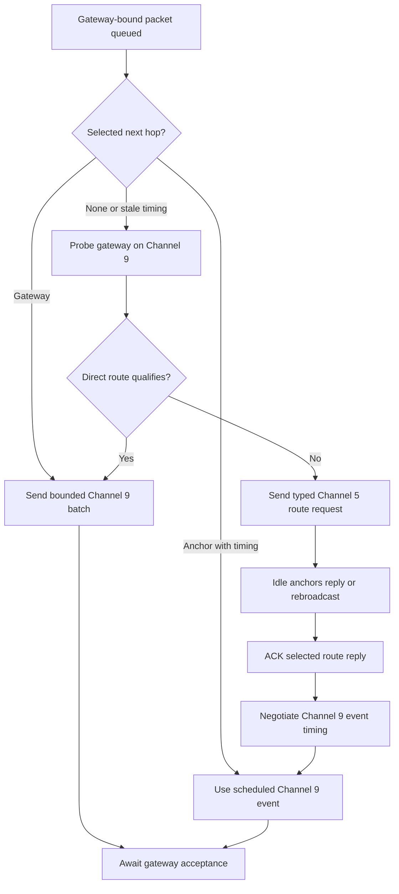
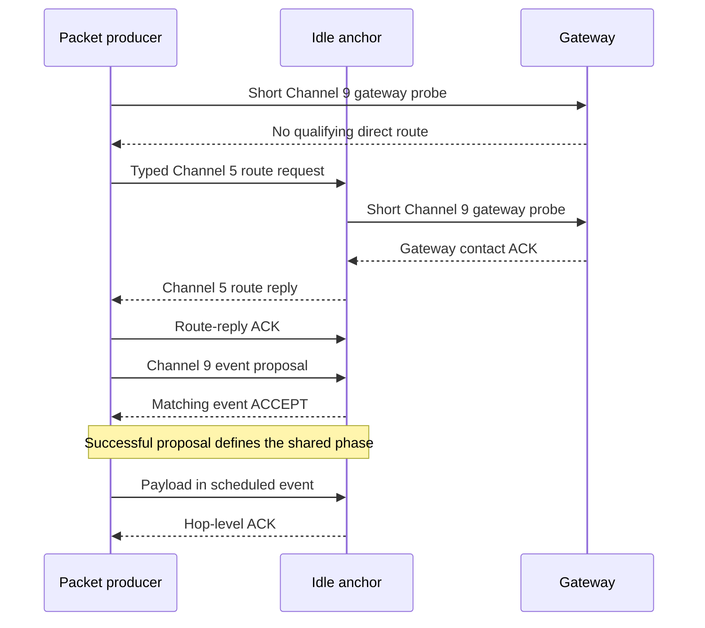

<!-- PAGE_ID: imec2-05-connected-mesh -->

[← IMEC2 Wiki](README.md) / Connected Routing, Priority, and Reliable Delivery

📚 Relevant source files

The following files were used as context for generating this wiki page:

- [Mesh Connected Routing Contract.md:1-1024](https://github.com/Jubliano-sama/IMEC2/blob/f6594e41b57f5fd612aba182e0bd13cbbdd0c621/Documentation/Mesh%20Connected%20Routing%20Contract.md#L1-L1024)
- [node_comm.h:25-63](https://github.com/Jubliano-sama/IMEC2/blob/f6594e41b57f5fd612aba182e0bd13cbbdd0c621/firmware/include/node_comm.h#L25-L63)
- [node_comm.c:16-64](https://github.com/Jubliano-sama/IMEC2/blob/f6594e41b57f5fd612aba182e0bd13cbbdd0c621/firmware/src/node_comm.c#L16-L64)
- [mesh_runtime.c:8-21](https://github.com/Jubliano-sama/IMEC2/blob/f6594e41b57f5fd612aba182e0bd13cbbdd0c621/firmware/src/mesh_runtime.c#L8-L21)
- [mesh_relay.h:177-210](https://github.com/Jubliano-sama/IMEC2/blob/f6594e41b57f5fd612aba182e0bd13cbbdd0c621/firmware/include/mesh_relay.h#L177-L210)
- [route.h:14-71](https://github.com/Jubliano-sama/IMEC2/blob/f6594e41b57f5fd612aba182e0bd13cbbdd0c621/firmware/include/route.h#L14-L71)

# Connected Routing, Priority, and Reliable Delivery

A participant's click becomes useful research data only if its report survives contention, relays, missed acknowledgements, and temporary loss of contact. This chapter continues the [end-to-end click story](02_one-click-end-to-end.md) at the point where a [production clicker or anchor](01_product-roles-and-firmware-lines.md) has gateway-bound data and the connected mesh must carry it to the gateway without claiming success too early.

> **Related pages:** [Protocol, Packets, and Data Contracts](04_protocol-packets-and-data-contracts.md) · [Anchor Identity, Discovery, and Assignment](06_anchor-identity-discovery-and-assignment.md) · [Data Custody, Persistence, and Recovery](08_data-custody-persistence-and-recovery.md) · [Testing, Simulation, and Release Evidence](12_testing-simulation-and-release-evidence.md)

---

<!-- BEGIN:AUTOGEN imec2-05-connected-mesh-contract-invariants -->
## The Mesh Contract

The connected-routing contract is binding: it defines channel ownership, event timing, custody, priority, acknowledgements, retry, and teardown before implementation details are considered. Its central split is simple: **Channel 5 is the contact and preemption lane, while Channel 9 is the scheduled payload lane**. A connected [mesh_anchor](01_product-roles-and-firmware-lines.md) alternates Channel 9 work with full-duty Channel 5 receive windows, and Channel 9 work must be clipped or deferred rather than starving those windows ([Mesh Connected Routing Contract.md:19-35](https://github.com/Jubliano-sama/IMEC2/blob/f6594e41b57f5fd612aba182e0bd13cbbdd0c621/Documentation/Mesh%20Connected%20Routing%20Contract.md#L19-L35)).

| Contract boundary | What it means in the participant story |
|---|---|
| Channel 5 contact | A valid click or ranging claim transfers radio ownership directly to the click sequence; it cannot be reclassified as route traffic or left for a later receiver ([Mesh Connected Routing Contract.md:36-43](https://github.com/Jubliano-sama/IMEC2/blob/f6594e41b57f5fd612aba182e0bd13cbbdd0c621/Documentation/Mesh%20Connected%20Routing%20Contract.md#L36-L43)). |
| Channel 9 events | Anchor-to-anchor relay traffic uses negotiated recurring events, while the [mesh_gateway](01_product-roles-and-firmware-lines.md) remains primarily a continuous Channel 9 receiver and owns no normal connection ([Mesh Connected Routing Contract.md:111-124](https://github.com/Jubliano-sama/IMEC2/blob/f6594e41b57f5fd612aba182e0bd13cbbdd0c621/Documentation/Mesh%20Connected%20Routing%20Contract.md#L111-L124)). |
| Route versus contact | A fresh reverse next-hop hint says where a response may go; it does not by itself create a gateway connection or reserve Channel 9 timing ([Mesh Connected Routing Contract.md:84-92](https://github.com/Jubliano-sama/IMEC2/blob/f6594e41b57f5fd612aba182e0bd13cbbdd0c621/Documentation/Mesh%20Connected%20Routing%20Contract.md#L84-L92)). |
| Local versus transit work | An anchor's own click or command-result report outranks traffic it is relaying, so it may release the lower-priority transit reservation and let the displaced producer recover through retry and rediscovery ([Mesh Connected Routing Contract.md:93-99](https://github.com/Jubliano-sama/IMEC2/blob/f6594e41b57f5fd612aba182e0bd13cbbdd0c621/Documentation/Mesh%20Connected%20Routing%20Contract.md#L93-L99)). |

Protocol state machines enter this transport through one communication-service boundary. They submit an immutable packet identity and payload, a named delivery profile, a destination, and an absolute deadline; route acquisition, priority, retries, ACK timing, and custody remain shared policy rather than protocol-specific tuning ([Mesh Connected Routing Contract.md:207-222](https://github.com/Jubliano-sama/IMEC2/blob/f6594e41b57f5fd612aba182e0bd13cbbdd0c621/Documentation/Mesh%20Connected%20Routing%20Contract.md#L207-L222)). The public API exposes bounded control flood, reliable uplink, durable reliable uplink, protocol response, control response, and best-effort profiles, plus explicit terminal reasons for delivery, deadline expiry, attempt exhaustion, permanent failure, and cancellation ([node_comm.h:25-63](https://github.com/Jubliano-sama/IMEC2/blob/f6594e41b57f5fd612aba182e0bd13cbbdd0c621/firmware/include/node_comm.h#L25-L63)).

This boundary gives the mesh its fail-closed behavior: one logical request keeps the same source, session, sequence, and payload across retries; an exact result is accepted once, a duplicate is harmless, a conflicting payload is rejected, and a late result cannot advance a later transaction ([Mesh Connected Routing Contract.md:250-275](https://github.com/Jubliano-sama/IMEC2/blob/f6594e41b57f5fd612aba182e0bd13cbbdd0c621/Documentation/Mesh%20Connected%20Routing%20Contract.md#L250-L275)).

Sources: [Mesh Connected Routing Contract.md:19-43](https://github.com/Jubliano-sama/IMEC2/blob/f6594e41b57f5fd612aba182e0bd13cbbdd0c621/Documentation/Mesh%20Connected%20Routing%20Contract.md#L19-L43), [Mesh Connected Routing Contract.md:84-124](https://github.com/Jubliano-sama/IMEC2/blob/f6594e41b57f5fd612aba182e0bd13cbbdd0c621/Documentation/Mesh%20Connected%20Routing%20Contract.md#L84-L124), [Mesh Connected Routing Contract.md:207-275](https://github.com/Jubliano-sama/IMEC2/blob/f6594e41b57f5fd612aba182e0bd13cbbdd0c621/Documentation/Mesh%20Connected%20Routing%20Contract.md#L207-L275), [node_comm.h:25-63](https://github.com/Jubliano-sama/IMEC2/blob/f6594e41b57f5fd612aba182e0bd13cbbdd0c621/firmware/include/node_comm.h#L25-L63)
<!-- END:AUTOGEN imec2-05-connected-mesh-contract-invariants -->

---

<!-- BEGIN:AUTOGEN imec2-05-connected-mesh-route-and-connect -->
## Find a Route and Establish Contact

Route acquisition starts only when gateway-bound work has no usable path. Before every Channel 5 route-request attempt, the producer first performs a short direct Channel 9 gateway probe. A qualifying direct reply can satisfy route acquisition in direct-or-relayed mode; otherwise the producer sends a clearly typed Channel 5 route request, and idle anchors either answer from a usable route or rebroadcast within the remaining TTL ([Mesh Connected Routing Contract.md:420-480](https://github.com/Jubliano-sama/IMEC2/blob/f6594e41b57f5fd612aba182e0bd13cbbdd0c621/Documentation/Mesh%20Connected%20Routing%20Contract.md#L420-L480)). Connected anchors do not advertise another route they lack timing capacity to service, because each anchor has at most one upstream and one downstream Channel 9 connection ([Mesh Connected Routing Contract.md:143-149](https://github.com/Jubliano-sama/IMEC2/blob/f6594e41b57f5fd612aba182e0bd13cbbdd0c621/Documentation/Mesh%20Connected%20Routing%20Contract.md#L143-L149)).

Route knowledge and radio timing stay separate. A route candidate records the next hop, epoch, cost, quality, capacity hints, failure history, and whether Channel 9 timing is valid; the table keeps up to three candidates and selects among them rather than treating one observation as a permanent path ([route.h:14-24](https://github.com/Jubliano-sama/IMEC2/blob/f6594e41b57f5fd612aba182e0bd13cbbdd0c621/firmware/include/route.h#L14-L24), [route.h:47-71](https://github.com/Jubliano-sama/IMEC2/blob/f6594e41b57f5fd612aba182e0bd13cbbdd0c621/firmware/include/route.h#L47-L71)). For an anchor hop, the successful proposal transmission defines the Channel 9 phase; the responder installs that phase only after its matching ACCEPT transmits, and queue latency, retries, or duplicate ACCEPTs cannot shift the established schedule ([Mesh Connected Routing Contract.md:483-499](https://github.com/Jubliano-sama/IMEC2/blob/f6594e41b57f5fd612aba182e0bd13cbbdd0c621/Documentation/Mesh%20Connected%20Routing%20Contract.md#L483-L499)).

Once connected, the radio rhythm alternates scheduled Channel 9 relay windows with required Channel 5 receive windows. A click claim interrupts relay work without destroying the connection; after the bounded click sequence, retry timers account for the interruption and the anchor returns to the existing rhythm if it is still valid ([Mesh Connected Routing Contract.md:615-644](https://github.com/Jubliano-sama/IMEC2/blob/f6594e41b57f5fd612aba182e0bd13cbbdd0c621/Documentation/Mesh%20Connected%20Routing%20Contract.md#L615-L644)).

Sources: [Mesh Connected Routing Contract.md:143-149](https://github.com/Jubliano-sama/IMEC2/blob/f6594e41b57f5fd612aba182e0bd13cbbdd0c621/Documentation/Mesh%20Connected%20Routing%20Contract.md#L143-L149), [Mesh Connected Routing Contract.md:420-499](https://github.com/Jubliano-sama/IMEC2/blob/f6594e41b57f5fd612aba182e0bd13cbbdd0c621/Documentation/Mesh%20Connected%20Routing%20Contract.md#L420-L499), [Mesh Connected Routing Contract.md:615-644](https://github.com/Jubliano-sama/IMEC2/blob/f6594e41b57f5fd612aba182e0bd13cbbdd0c621/Documentation/Mesh%20Connected%20Routing%20Contract.md#L615-L644), [route.h:14-71](https://github.com/Jubliano-sama/IMEC2/blob/f6594e41b57f5fd612aba182e0bd13cbbdd0c621/firmware/include/route.h#L14-L71)
<!-- END:AUTOGEN imec2-05-connected-mesh-route-and-connect -->

---

<!-- BEGIN:AUTOGEN imec2-05-connected-mesh-custody-and-acks -->
## Custody, Forwarding, and Acknowledgements

Transmission is not delivery. A packet stays pending until the relevant acknowledgement transfers custody, and the relay state distinguishes waiting for local custody, waiting for final gateway acceptance, waiting for a collection EACK, gateway-accepted, expired, and collection-closed outcomes ([mesh_relay.h:177-210](https://github.com/Jubliano-sama/IMEC2/blob/f6594e41b57f5fd612aba182e0bd13cbbdd0c621/firmware/include/mesh_relay.h#L177-L210)).

| Boundary | Evidence of progress | What the sender may conclude |
|---|---|---|
| Producer to anchor | The hop-level ACK explicitly lists the packet | The next hop accepted custody, but the gateway has not yet accepted it ([Mesh Connected Routing Contract.md:850-864](https://github.com/Jubliano-sama/IMEC2/blob/f6594e41b57f5fd612aba182e0bd13cbbdd0c621/Documentation/Mesh%20Connected%20Routing%20Contract.md#L850-L864)). |
| Anchor to gateway | A gateway ACK or gateway batch ACK explicitly lists the packet | Final gateway acceptance is proven for that identity ([Mesh Connected Routing Contract.md:865-889](https://github.com/Jubliano-sama/IMEC2/blob/f6594e41b57f5fd612aba182e0bd13cbbdd0c621/Documentation/Mesh%20Connected%20Routing%20Contract.md#L865-L889)). |
| Gateway protocol boundary | The complete message passes semantic validation, required state is committed, and host-stream capacity is reserved and committed | The gateway may remember the packet and emit its ACK; rejection, persistence failure, or a full host queue remains retryable end to end ([Mesh Connected Routing Contract.md:157-171](https://github.com/Jubliano-sama/IMEC2/blob/f6594e41b57f5fd612aba182e0bd13cbbdd0c621/Documentation/Mesh%20Connected%20Routing%20Contract.md#L157-L171)). |

Anchor-to-anchor events may carry several packets if the slot budget allows, and one hop ACK can transfer custody for all packet identities it lists. Direct-to-gateway delivery is also batched, but the sender must reserve turnaround and receive time before deciding how many frames fit, mark the final frame, and wait for one gateway batch ACK covering the accepted identities ([Mesh Connected Routing Contract.md:175-190](https://github.com/Jubliano-sama/IMEC2/blob/f6594e41b57f5fd612aba182e0bd13cbbdd0c621/Documentation/Mesh%20Connected%20Routing%20Contract.md#L175-L190)). Missing identities remain pending; losing the final frame or batch ACK causes Channel 9 retry while the path is alive, not a new wake train or immediate route negotiation ([Mesh Connected Routing Contract.md:879-899](https://github.com/Jubliano-sama/IMEC2/blob/f6594e41b57f5fd612aba182e0bd13cbbdd0c621/Documentation/Mesh%20Connected%20Routing%20Contract.md#L879-L899)).

Duplicate handling repairs lost acknowledgements without duplicating research data. A receiver suppresses processing and forwarding for a packet it already accepted, but it still includes that identity in the next hop ACK; at the gateway, semantic acceptance is ACK-sticky only after validation and commit, so the same payload cannot mutate protocol state or enter the BLE stream twice ([Mesh Connected Routing Contract.md:920-925](https://github.com/Jubliano-sama/IMEC2/blob/f6594e41b57f5fd612aba182e0bd13cbbdd0c621/Documentation/Mesh%20Connected%20Routing%20Contract.md#L920-L925), [Mesh Connected Routing Contract.md:157-171](https://github.com/Jubliano-sama/IMEC2/blob/f6594e41b57f5fd612aba182e0bd13cbbdd0c621/Documentation/Mesh%20Connected%20Routing%20Contract.md#L157-L171)). [Persistence and Recovery](08_data-custody-persistence-and-recovery.md) follows these ownership rules across reset and storage faults.

Sources: [mesh_relay.h:177-210](https://github.com/Jubliano-sama/IMEC2/blob/f6594e41b57f5fd612aba182e0bd13cbbdd0c621/firmware/include/mesh_relay.h#L177-L210), [Mesh Connected Routing Contract.md:157-190](https://github.com/Jubliano-sama/IMEC2/blob/f6594e41b57f5fd612aba182e0bd13cbbdd0c621/Documentation/Mesh%20Connected%20Routing%20Contract.md#L157-L190), [Mesh Connected Routing Contract.md:846-925](https://github.com/Jubliano-sama/IMEC2/blob/f6594e41b57f5fd612aba182e0bd13cbbdd0c621/Documentation/Mesh%20Connected%20Routing%20Contract.md#L846-L925)
<!-- END:AUTOGEN imec2-05-connected-mesh-custody-and-acks -->

---

<!-- BEGIN:AUTOGEN imec2-05-connected-mesh-priority-and-recovery -->
## Priority, Retry, and Recovery

Priority is applied at safe radio boundaries, so it changes what runs next without corrupting a timing-critical exchange already on air. In the mesh runtime, queued work is ordered as gateway command, local click, event repair, then transit, with FIFO order inside one class ([mesh_runtime.c:8-21](https://github.com/Jubliano-sama/IMEC2/blob/f6594e41b57f5fd612aba182e0bd13cbbdd0c621/firmware/src/mesh_runtime.c#L8-L21), [mesh_runtime.c:47-73](https://github.com/Jubliano-sama/IMEC2/blob/f6594e41b57f5fd612aba182e0bd13cbbdd0c621/firmware/src/mesh_runtime.c#L47-L73)). A decoded click claim owns the interactive Channel 5 sequence and may reclaim lower-priority transit capacity; queued gateway-originated control remains the first mesh work at the earliest safe boundary ([Mesh Connected Routing Contract.md:646-658](https://github.com/Jubliano-sama/IMEC2/blob/f6594e41b57f5fd612aba182e0bd13cbbdd0c621/Documentation/Mesh%20Connected%20Routing%20Contract.md#L646-L658), [mesh_runtime.c:238-276](https://github.com/Jubliano-sama/IMEC2/blob/f6594e41b57f5fd612aba182e0bd13cbbdd0c621/firmware/src/mesh_runtime.c#L238-L276)).

Retries preserve identity and distinguish contention from actual transmission. Every failed or deferred RF operation re-enters randomized exponential backoff; a pre-RF deferral advances the backoff round but consumes no transmission opportunity, while an actual RF start consumes one even if it collides or times out ([Mesh Connected Routing Contract.md:100-110](https://github.com/Jubliano-sama/IMEC2/blob/f6594e41b57f5fd612aba182e0bd13cbbdd0c621/Documentation/Mesh%20Connected%20Routing%20Contract.md#L100-L110)). Delivery profiles encode that policy centrally: for example, bounded control flood requires four successful RF opportunities, while reliable and durable profiles use their own bounded attempt and priority settings ([node_comm.c:16-64](https://github.com/Jubliano-sama/IMEC2/blob/f6594e41b57f5fd612aba182e0bd13cbbdd0c621/firmware/src/node_comm.c#L16-L64)). Each accepted request ends in one explicit terminal event, and the request slot is released only when that event is consumed ([node_comm.c:461-476](https://github.com/Jubliano-sama/IMEC2/blob/f6594e41b57f5fd612aba182e0bd13cbbdd0c621/firmware/src/node_comm.c#L461-L476), [node_comm.c:1223-1239](https://github.com/Jubliano-sama/IMEC2/blob/f6594e41b57f5fd612aba182e0bd13cbbdd0c621/firmware/src/node_comm.c#L1223-L1239)).

Recovery escalates only when progress has genuinely stopped:

1. **Retry the live path.** A missed hop or gateway ACK keeps the same packet on Channel 9 while the connection remains alive; hop progress extends the gateway-ACK wait rather than restarting discovery ([Mesh Connected Routing Contract.md:891-899](https://github.com/Jubliano-sama/IMEC2/blob/f6594e41b57f5fd612aba182e0bd13cbbdd0c621/Documentation/Mesh%20Connected%20Routing%20Contract.md#L891-L899)).
2. **Hold down a failing parent.** The selected parent is retried through three failures with 1500, 3000, and 6000 ms backoff bases; the next failure invalidates the active route path, places that physical candidate in a 30-second hold-down, and tries a valid alternate before broadcasting another route request ([Mesh Connected Routing Contract.md:934-955](https://github.com/Jubliano-sama/IMEC2/blob/f6594e41b57f5fd612aba182e0bd13cbbdd0c621/Documentation/Mesh%20Connected%20Routing%20Contract.md#L934-L955), [route.h:17-24](https://github.com/Jubliano-sama/IMEC2/blob/f6594e41b57f5fd612aba182e0bd13cbbdd0c621/firmware/include/route.h#L17-L24)).
3. **Invalidate dependent timing.** Exhausting the active path clears its route epoch, downstream dependencies, and Channel 9 reservations; rediscovery begins only when no selected parent or alternate remains ([Mesh Connected Routing Contract.md:957-1009](https://github.com/Jubliano-sama/IMEC2/blob/f6594e41b57f5fd612aba182e0bd13cbbdd0c621/Documentation/Mesh%20Connected%20Routing%20Contract.md#L957-L1009)).
4. **Tear down on evidence, not interruption.** Explicit close, route invalidation, sustained missed receive cycles, stale state without progress, or peer rejection ends a connection. A temporary click does not, and the inactivity threshold must cover the worst-case click sequence plus retune and scheduling jitter ([Mesh Connected Routing Contract.md:1012-1024](https://github.com/Jubliano-sama/IMEC2/blob/f6594e41b57f5fd612aba182e0bd13cbbdd0c621/Documentation/Mesh%20Connected%20Routing%20Contract.md#L1012-L1024)).

The consequence for the participant is deliberate: a report either remains in custody, reaches explicit gateway acceptance, or ends with an observable bounded failure. A missed window, full queue, malformed packet, conflicting identity, or unavailable route never becomes a synthetic success.

Sources: [mesh_runtime.c:8-73](https://github.com/Jubliano-sama/IMEC2/blob/f6594e41b57f5fd612aba182e0bd13cbbdd0c621/firmware/src/mesh_runtime.c#L8-L73), [mesh_runtime.c:238-276](https://github.com/Jubliano-sama/IMEC2/blob/f6594e41b57f5fd612aba182e0bd13cbbdd0c621/firmware/src/mesh_runtime.c#L238-L276), [node_comm.c:16-64](https://github.com/Jubliano-sama/IMEC2/blob/f6594e41b57f5fd612aba182e0bd13cbbdd0c621/firmware/src/node_comm.c#L16-L64), [node_comm.c:461-476](https://github.com/Jubliano-sama/IMEC2/blob/f6594e41b57f5fd612aba182e0bd13cbbdd0c621/firmware/src/node_comm.c#L461-L476), [node_comm.c:1223-1239](https://github.com/Jubliano-sama/IMEC2/blob/f6594e41b57f5fd612aba182e0bd13cbbdd0c621/firmware/src/node_comm.c#L1223-L1239), [Mesh Connected Routing Contract.md:934-1024](https://github.com/Jubliano-sama/IMEC2/blob/f6594e41b57f5fd612aba182e0bd13cbbdd0c621/Documentation/Mesh%20Connected%20Routing%20Contract.md#L934-L1024), [route.h:17-24](https://github.com/Jubliano-sama/IMEC2/blob/f6594e41b57f5fd612aba182e0bd13cbbdd0c621/firmware/include/route.h#L17-L24)
<!-- END:AUTOGEN imec2-05-connected-mesh-priority-and-recovery -->

---

**Previous:** [Protocol, Packets, and Data Contracts](04_protocol-packets-and-data-contracts.md) · **Next:** [Anchor Identity, Discovery, and Assignment](06_anchor-identity-discovery-and-assignment.md)

**Related:** [Data Custody, Persistence, and Recovery](08_data-custody-persistence-and-recovery.md) · [Testing, Simulation, and Release Evidence](12_testing-simulation-and-release-evidence.md) · [Wiki home](README.md)
