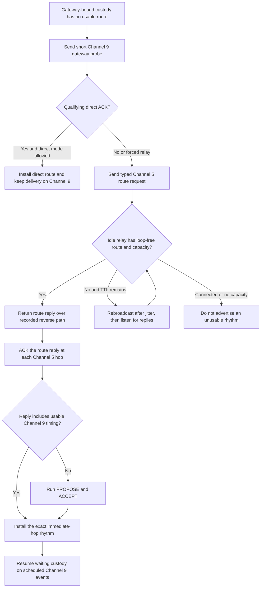
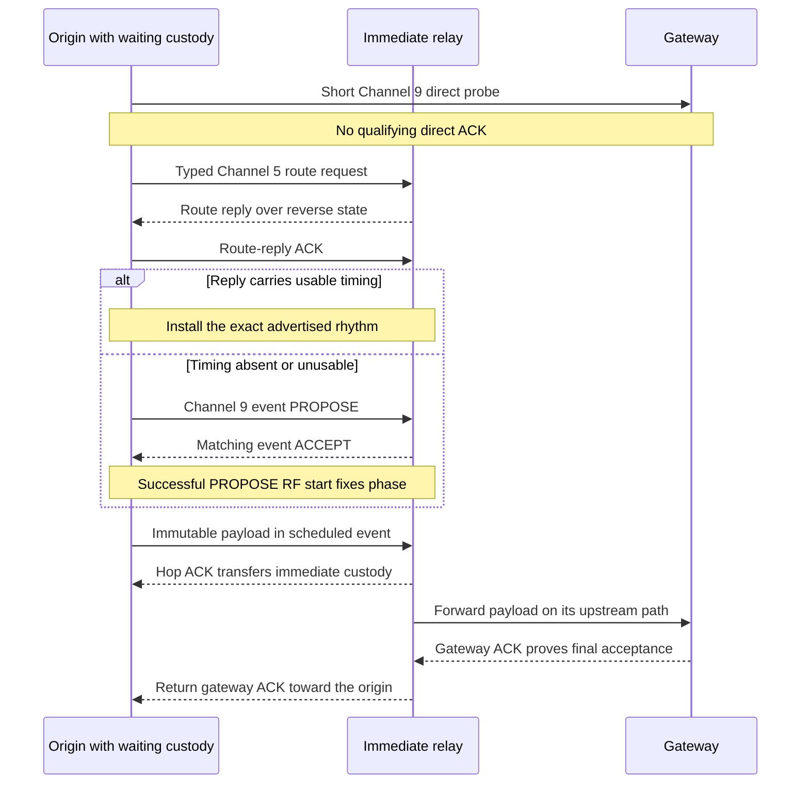

<!-- PAGE_ID: imec2-05-connected-mesh -->

[← IMEC2 Wiki](README.md) / Connected Routing, Priority, and Reliable Delivery

📚 Historical generation context (f6594e4)

The following files were used as context for generating this wiki page:

- [Mesh Connected Routing Contract.md:1-1024](https://github.com/Jubliano-sama/IMEC2/blob/f6594e41b57f5fd612aba182e0bd13cbbdd0c621/Documentation/Mesh%20Connected%20Routing%20Contract.md#L1-L1024)
- [node_comm.h:25-63](https://github.com/Jubliano-sama/IMEC2/blob/f6594e41b57f5fd612aba182e0bd13cbbdd0c621/firmware/include/node_comm.h#L25-L63)
- [node_comm.c:16-64](https://github.com/Jubliano-sama/IMEC2/blob/f6594e41b57f5fd612aba182e0bd13cbbdd0c621/firmware/src/node_comm.c#L16-L64)
- [mesh_runtime.c:8-21](https://github.com/Jubliano-sama/IMEC2/blob/f6594e41b57f5fd612aba182e0bd13cbbdd0c621/firmware/src/mesh_runtime.c#L8-L21)
- [mesh_relay.h:177-210](https://github.com/Jubliano-sama/IMEC2/blob/f6594e41b57f5fd612aba182e0bd13cbbdd0c621/firmware/include/mesh_relay.h#L177-L210)
- [route.h:14-71](https://github.com/Jubliano-sama/IMEC2/blob/f6594e41b57f5fd612aba182e0bd13cbbdd0c621/firmware/include/route.h#L14-L71)

# Connected Routing, Priority, and Reliable Delivery

A participant's click becomes useful research data only if its report survives contention, relays, missed acknowledgements, and temporary loss of contact. This chapter continues the [end-to-end click story](02_one-click-end-to-end.md) at the point where a [production clicker or anchor](01_product-roles-and-firmware-lines.md) has gateway-bound data and the connected mesh must carry it to the gateway without claiming success too early.

> **Related pages:** [Protocol, Packets, and Data Contracts](04_protocol-packets-and-data-contracts.md) · [Anchor Identity, Discovery, and Assignment](06_anchor-identity-discovery-and-assignment.md) · [Data Custody, Persistence, and Recovery](08_data-custody-persistence-and-recovery.md) · [Testing, Simulation, and Release Evidence](12_testing-simulation-and-release-evidence.md)

---

<!-- BEGIN:AUTOGEN imec2-05-connected-mesh-contract-invariants -->
## The Mesh Contract

The connected-routing contract is the normative runtime specification for the production-candidate mesh, and its requirement IDs are immutable. Wire headers still own encoding, while the contract owns runtime behavior when those surfaces disagree ([Mesh Connected Routing Contract.md:3-27](https://github.com/Jubliano-sama/IMEC2/blob/47590ded63e99caca4461cb61f77f861bcf94b54/Documentation/Mesh%20Connected%20Routing%20Contract.md#L3-L27)). The traceability manifest maps those IDs to authoritative documents, implementation owners, and bounded evidence, but it explicitly says that no requirement is currently recorded as fully verified; this page therefore describes the contract and current code, not a release-qualification verdict ([mesh_contract_traceability.yaml:11-19](https://github.com/Jubliano-sama/IMEC2/blob/47590ded63e99caca4461cb61f77f861bcf94b54/Documentation/mesh_contract_traceability.yaml#L11-L19)).

| Invariant | Runtime consequence |
|---|---|
| Channel ownership | Channel 5 carries control and click preemption; Channel 9 carries connected payloads and ACKs. A connected anchor must preserve complete recurring Channel 5 receive windows, and only a valid click or ranging claim may end one early ([Mesh Connected Routing Contract.md:156-176](https://github.com/Jubliano-sama/IMEC2/blob/47590ded63e99caca4461cb61f77f861bcf94b54/Documentation/Mesh%20Connected%20Routing%20Contract.md#L156-L176)). |
| Role capacity | An anchor has at most one upstream and one downstream Channel 9 reservation, selects local click, ranging, and command-result work before transit, and retains accepted transit custody for retry. The gateway remains primarily a continuous Channel 9 receiver and owns no normal connection ([Mesh Connected Routing Contract.md:119-137](https://github.com/Jubliano-sama/IMEC2/blob/47590ded63e99caca4461cb61f77f861bcf94b54/Documentation/Mesh%20Connected%20Routing%20Contract.md#L119-L137)). |
| Route versus event timing | A route reply returns over recorded reverse state and may carry usable Channel 9 timing. When it does not, the peers must establish the immediate-hop rhythm through PROPOSE/ACCEPT before waiting custody uses that connection ([Mesh Connected Routing Contract.md:393-403](https://github.com/Jubliano-sama/IMEC2/blob/47590ded63e99caca4461cb61f77f861bcf94b54/Documentation/Mesh%20Connected%20Routing%20Contract.md#L393-L403)). |
| Custody ownership | An accepted logical datagram keeps immutable identity, bytes, profile, destination, and absolute deadline, with exactly one owner across queued, route-wait, RF, ACK-wait, retry, and terminal transitions ([Mesh Connected Routing Contract.md:462-475](https://github.com/Jubliano-sama/IMEC2/blob/47590ded63e99caca4461cb61f77f861bcf94b54/Documentation/Mesh%20Connected%20Routing%20Contract.md#L462-L475)). |
| Failure behavior | Malformed state, missing routes, collisions, partial airtime, and exhausted capacity fail explicitly. The implementation may not hide a broken production path behind a seeded route, direct-delivery fallback, or synthetic success ([Mesh Connected Routing Contract.md:987-994](https://github.com/Jubliano-sama/IMEC2/blob/47590ded63e99caca4461cb61f77f861bcf94b54/Documentation/Mesh%20Connected%20Routing%20Contract.md#L987-L994)). |

The communication facade exposes named profiles for bounded control flood, reliable uplink, durable reliable uplink, protocol response, control response, and best effort; each submitted request carries its profile, immutable datagram, deadline, owner token, and retry-jitter seed ([node_comm.h:39-72](https://github.com/Jubliano-sama/IMEC2/blob/47590ded63e99caca4461cb61f77f861bcf94b54/firmware/include/node_comm.h#L39-L72)). The implementation freezes the request and profile policy into one slot, then selects ready work by profile priority and FIFO order within equal priority ([node_comm.c:769-860](https://github.com/Jubliano-sama/IMEC2/blob/47590ded63e99caca4461cb61f77f861bcf94b54/firmware/src/node_comm.c#L769-L860)).

That facade is the direction of travel, not a claim that every old path has already migrated. The contract calls the current mesh-report runtime a compatibility backend and keeps frozen legacy owners as explicit architecture debt until their staged replacement is complete ([Mesh Connected Routing Contract.md:545-569](https://github.com/Jubliano-sama/IMEC2/blob/47590ded63e99caca4461cb61f77f861bcf94b54/Documentation/Mesh%20Connected%20Routing%20Contract.md#L545-L569)).

Sources: [Mesh Connected Routing Contract.md:3-27](https://github.com/Jubliano-sama/IMEC2/blob/47590ded63e99caca4461cb61f77f861bcf94b54/Documentation/Mesh%20Connected%20Routing%20Contract.md#L3-L27), [mesh_contract_traceability.yaml:11-39](https://github.com/Jubliano-sama/IMEC2/blob/47590ded63e99caca4461cb61f77f861bcf94b54/Documentation/mesh_contract_traceability.yaml#L11-L39), [node_comm.h:39-128](https://github.com/Jubliano-sama/IMEC2/blob/47590ded63e99caca4461cb61f77f861bcf94b54/firmware/include/node_comm.h#L39-L128), [node_comm.c:769-860](https://github.com/Jubliano-sama/IMEC2/blob/47590ded63e99caca4461cb61f77f861bcf94b54/firmware/src/node_comm.c#L769-L860)
<!-- END:AUTOGEN imec2-05-connected-mesh-contract-invariants -->

---

<!-- BEGIN:AUTOGEN imec2-05-connected-mesh-route-and-connect -->
## Find a Route and Establish Contact

Route acquisition begins only when gateway-bound custody has no usable path. Before every original request, rebroadcast, or retry, the producer sends a short direct Channel 9 gateway probe; a qualifying reply can install a direct route in direct-or-relayed mode, while forced-relay mode records contact and continues discovery. When the probe is insufficient, the origin sends a route-typed wake and one reactive Channel 5 request rather than using the blind command-flood path ([Mesh Connected Routing Contract.md:301-315](https://github.com/Jubliano-sama/IMEC2/blob/47590ded63e99caca4461cb61f77f861bcf94b54/Documentation/Mesh%20Connected%20Routing%20Contract.md#L301-L315)).

An idle relay records the request's reverse route, waits with randomized airtime-sized jitter, keeps listening for a better candidate, repeats the direct probe, and then either replies from usable capacity or rebroadcasts within TTL. A connected anchor neither answers nor rebroadcasts an unrelated request because it cannot promise another Channel 9 rhythm ([Mesh Connected Routing Contract.md:317-332](https://github.com/Jubliano-sama/IMEC2/blob/47590ded63e99caca4461cb61f77f861bcf94b54/Documentation/Mesh%20Connected%20Routing%20Contract.md#L317-L332)).

The route table keeps up to three candidates. Each entry carries physical next hop, gateway, epoch, cost, quality, failure and hold-down state, capacity hints, exact path ancestry, and optional Channel 9 timing ([route.h:14-71](https://github.com/Jubliano-sama/IMEC2/blob/47590ded63e99caca4461cb61f77f861bcf94b54/firmware/include/route.h#L14-L71)). Selection considers only valid current-epoch candidates and skips a candidate whose hold-down is still active, so one failed parent does not erase an available alternate ([route.c:209-234](https://github.com/Jubliano-sama/IMEC2/blob/47590ded63e99caca4461cb61f77f861bcf94b54/firmware/src/route.c#L209-L234)).

Loop freedom is checked before the requester mutates the candidate snapshot: the selected next hop must differ from the request's physical previous hop, and its complete ancestry must be disjoint from the request ancestry. Every request, reply, and gateway advertisement carries an exact directionally ordered bounded node path; malformed roots, tails, duplicates, hop counts, or local cycles fail before state changes ([Mesh Connected Routing Contract.md:334-375](https://github.com/Jubliano-sama/IMEC2/blob/47590ded63e99caca4461cb61f77f861bcf94b54/Documentation/Mesh%20Connected%20Routing%20Contract.md#L334-L375)).

Replies return over recorded reverse paths and receive a Channel 5 ACK at each hop. If a reply supplies usable timing, both immediate peers install it; otherwise PROPOSE/ACCEPT owns event establishment, and the successful PROPOSE RF start fixes the phase without retry-induced drift ([Mesh Connected Routing Contract.md:393-433](https://github.com/Jubliano-sama/IMEC2/blob/47590ded63e99caca4461cb61f77f861bcf94b54/Documentation/Mesh%20Connected%20Routing%20Contract.md#L393-L433)).

Once connected, a valid click marks relay work interrupted rather than disconnected. The anchor preserves the recurring Channel 5 receive window, accounts for the bounded click duration, and resumes the existing Channel 9 rhythm when it remains valid ([Mesh Connected Routing Contract.md:169-176](https://github.com/Jubliano-sama/IMEC2/blob/47590ded63e99caca4461cb61f77f861bcf94b54/Documentation/Mesh%20Connected%20Routing%20Contract.md#L169-L176), [Mesh Connected Routing Contract.md:285-289](https://github.com/Jubliano-sama/IMEC2/blob/47590ded63e99caca4461cb61f77f861bcf94b54/Documentation/Mesh%20Connected%20Routing%20Contract.md#L285-L289)).

Sources: [Mesh Connected Routing Contract.md:301-433](https://github.com/Jubliano-sama/IMEC2/blob/47590ded63e99caca4461cb61f77f861bcf94b54/Documentation/Mesh%20Connected%20Routing%20Contract.md#L301-L433), [route.h:14-71](https://github.com/Jubliano-sama/IMEC2/blob/47590ded63e99caca4461cb61f77f861bcf94b54/firmware/include/route.h#L14-L71), [route.c:209-234](https://github.com/Jubliano-sama/IMEC2/blob/47590ded63e99caca4461cb61f77f861bcf94b54/firmware/src/route.c#L209-L234)
<!-- END:AUTOGEN imec2-05-connected-mesh-route-and-connect -->

---

<!-- BEGIN:AUTOGEN imec2-05-connected-mesh-custody-and-acks -->
## Custody, Forwarding, and Acknowledgements

Transmission is not delivery. One logical datagram keeps exactly one custody owner, and a sender may release only the boundary explicitly named by the matching ACK ([Mesh Connected Routing Contract.md:462-475](https://github.com/Jubliano-sama/IMEC2/blob/47590ded63e99caca4461cb61f77f861bcf94b54/Documentation/Mesh%20Connected%20Routing%20Contract.md#L462-L475), [Mesh Connected Routing Contract.md:608-617](https://github.com/Jubliano-sama/IMEC2/blob/47590ded63e99caca4461cb61f77f861bcf94b54/Documentation/Mesh%20Connected%20Routing%20Contract.md#L608-L617)).

| Boundary | Required evidence | What changes |
|---|---|---|
| Before RF | The communication service records a real RF start | Pre-RF policy, admission, route, or resource deferral consumes no RF opportunity and transfers no custody ([node_comm.c:862-933](https://github.com/Jubliano-sama/IMEC2/blob/47590ded63e99caca4461cb61f77f861bcf94b54/firmware/src/node_comm.c#L862-L933)). |
| Child to relay | A hop ACK lists the exact session and sequence | Immediate-hop custody moves to the relay, while gateway acceptance remains pending ([Mesh Connected Routing Contract.md:608-622](https://github.com/Jubliano-sama/IMEC2/blob/47590ded63e99caca4461cb61f77f861bcf94b54/Documentation/Mesh%20Connected%20Routing%20Contract.md#L608-L622)). |
| Relay to gateway | A gateway ACK lists the accepted identity | Final gateway acceptance is proven, but a transit relay keeps the original packet until that exact ACK is physically handed back toward its child ([Mesh Connected Routing Contract.md:637-650](https://github.com/Jubliano-sama/IMEC2/blob/47590ded63e99caca4461cb61f77f861bcf94b54/Documentation/Mesh%20Connected%20Routing%20Contract.md#L637-L650)). |
| Gateway semantic admission | The complete message validates, required durable state commits, and the complete host-stream record is reserved and committed | Only then may the gateway make the identity ACK-sticky; malformed, stale, full, or failed-persistence input remains retryable upstream ([Mesh Connected Routing Contract.md:573-586](https://github.com/Jubliano-sama/IMEC2/blob/47590ded63e99caca4461cb61f77f861bcf94b54/Documentation/Mesh%20Connected%20Routing%20Contract.md#L573-L586)). |
| Collection result | The specialized collection EACK covers the frozen result identity | A generic gateway ACK cannot finish this custody class, whose exact bytes remain durable across retry and reset ([Mesh Connected Routing Contract.md:666-688](https://github.com/Jubliano-sama/IMEC2/blob/47590ded63e99caca4461cb61f77f861bcf94b54/Documentation/Mesh%20Connected%20Routing%20Contract.md#L666-L688)). |

**Gateway admission is deliberately two-stage.** For click reports, command results, result bundles, survey discovery reports, and pair results, the relay core first checks that ACK-history capacity exists and emits `DELIVER_LOCAL` without generating the gateway ACK ([mesh_relay_delivery.inc:1360-1372](https://github.com/Jubliano-sama/IMEC2/blob/47590ded63e99caca4461cb61f77f861bcf94b54/firmware/src/mesh_relay_delivery.inc#L1360-L1372), [mesh_relay_custody.inc:2046-2067](https://github.com/Jubliano-sama/IMEC2/blob/47590ded63e99caca4461cb61f77f861bcf94b54/firmware/src/mesh_relay_custody.inc#L2046-L2067)). The BLE stream then reserves capacity for the complete identity and payload and refuses a full or disconnected stream; commit revalidates that same reservation before inserting the record ([app_gateway_ble_stream.c:547-615](https://github.com/Jubliano-sama/IMEC2/blob/47590ded63e99caca4461cb61f77f861bcf94b54/firmware/app/src/app_gateway_ble_stream.c#L547-L615), [app_gateway_ble_stream.c:618-697](https://github.com/Jubliano-sama/IMEC2/blob/47590ded63e99caca4461cb61f77f861bcf94b54/firmware/app/src/app_gateway_ble_stream.c#L618-L697)). Only after the application reports successful semantic delivery does the core store ACK history and exact payload identity and request transmission of the gateway ACK ([mesh_relay_custody.inc:2089-2146](https://github.com/Jubliano-sama/IMEC2/blob/47590ded63e99caca4461cb61f77f861bcf94b54/firmware/src/mesh_relay_custody.inc#L2089-L2146)).

**Batches transfer custody identity by identity.** A direct sender reserves room for the ACK turn, gives all eligible same-source gateway packets one batch ID, and marks the final packet ([app_mesh_report_direct_gateway.inc:365-425](https://github.com/Jubliano-sama/IMEC2/blob/47590ded63e99caca4461cb61f77f861bcf94b54/firmware/app/src/app_mesh_report_direct_gateway.inc#L365-L425), [app_mesh_report_direct_gateway.inc:484-519](https://github.com/Jubliano-sama/IMEC2/blob/47590ded63e99caca4461cb61f77f861bcf94b54/firmware/app/src/app_mesh_report_direct_gateway.inc#L484-L519), [app_mesh_report_direct_gateway.inc:581-590](https://github.com/Jubliano-sama/IMEC2/blob/47590ded63e99caca4461cb61f77f861bcf94b54/firmware/app/src/app_mesh_report_direct_gateway.inc#L581-L590)). ACK processing marks only listed session/sequence pairs accepted and leaves every omitted entry unacknowledged for requeue ([app_mesh_ch9_ack.c:548-645](https://github.com/Jubliano-sama/IMEC2/blob/47590ded63e99caca4461cb61f77f861bcf94b54/firmware/app/src/app_mesh_ch9_ack.c#L548-L645)).

**Duplicates repair ACK loss without changing accepted data.** Exact accepted duplicates are suppressed as payload work but remain ACKable, while a retry that reuses an identity with different bytes fails malformed rather than replacing custody ([mesh_relay_delivery.inc:1140-1163](https://github.com/Jubliano-sama/IMEC2/blob/47590ded63e99caca4461cb61f77f861bcf94b54/firmware/src/mesh_relay_delivery.inc#L1140-L1163), [mesh_relay_delivery.inc:1190-1234](https://github.com/Jubliano-sama/IMEC2/blob/47590ded63e99caca4461cb61f77f861bcf94b54/firmware/src/mesh_relay_delivery.inc#L1190-L1234)). For transit traffic, receipt of the gateway ACK starts a child-directed handoff but preserves the original packet and outbox; the core clears them only when the exact forwarded ACK is committed on the expected reverse next hop ([mesh_relay_custody.inc:1532-1569](https://github.com/Jubliano-sama/IMEC2/blob/47590ded63e99caca4461cb61f77f861bcf94b54/firmware/src/mesh_relay_custody.inc#L1532-L1569), [mesh_relay_custody.inc:1588-1645](https://github.com/Jubliano-sama/IMEC2/blob/47590ded63e99caca4461cb61f77f861bcf94b54/firmware/src/mesh_relay_custody.inc#L1588-L1645)).

[Persistence and Recovery](08_data-custody-persistence-and-recovery.md) follows the durable journal and reset boundaries beyond these radio-level custody transfers.

Sources: [Mesh Connected Routing Contract.md:573-688](https://github.com/Jubliano-sama/IMEC2/blob/47590ded63e99caca4461cb61f77f861bcf94b54/Documentation/Mesh%20Connected%20Routing%20Contract.md#L573-L688), [mesh_relay_delivery.inc:1140-1463](https://github.com/Jubliano-sama/IMEC2/blob/47590ded63e99caca4461cb61f77f861bcf94b54/firmware/src/mesh_relay_delivery.inc#L1140-L1463), [mesh_relay_custody.inc:1486-1645](https://github.com/Jubliano-sama/IMEC2/blob/47590ded63e99caca4461cb61f77f861bcf94b54/firmware/src/mesh_relay_custody.inc#L1486-L1645), [app_gateway_ble_stream.c:547-697](https://github.com/Jubliano-sama/IMEC2/blob/47590ded63e99caca4461cb61f77f861bcf94b54/firmware/app/src/app_gateway_ble_stream.c#L547-L697), [app_mesh_ch9_ack.c:548-645](https://github.com/Jubliano-sama/IMEC2/blob/47590ded63e99caca4461cb61f77f861bcf94b54/firmware/app/src/app_mesh_ch9_ack.c#L548-L645)
<!-- END:AUTOGEN imec2-05-connected-mesh-custody-and-acks -->

---

<!-- BEGIN:AUTOGEN imec2-05-connected-mesh-priority-and-recovery -->
## Priority, Retry, and Recovery

Priority changes what runs at the next safe radio boundary; it does not corrupt an exchange already on air. The runtime queue orders gateway command, local click, event repair, then transit, with FIFO order inside one class, and waits when the current radio owner has not yet reached its boundary ([mesh_runtime.c:8-73](https://github.com/Jubliano-sama/IMEC2/blob/47590ded63e99caca4461cb61f77f861bcf94b54/firmware/src/mesh_runtime.c#L8-L73), [mesh_runtime.c:202-280](https://github.com/Jubliano-sama/IMEC2/blob/47590ded63e99caca4461cb61f77f861bcf94b54/firmware/src/mesh_runtime.c#L202-L280)). A gateway command may request that a receive owner abort, but the command is rescheduled only after that owner acknowledges the safe boundary ([app_mesh_gateway_command_priority.c:24-60](https://github.com/Jubliano-sama/IMEC2/blob/47590ded63e99caca4461cb61f77f861bcf94b54/firmware/app/src/app_mesh_gateway_command_priority.c#L24-L60)).

Retries preserve immutable identity and distinguish contention from transmission. The service increments its attempt counter only after `note_rf_started`; pre-RF defer or resource wait leaves the attempt untouched, and a caller cannot report success without an RF start ([node_comm.c:862-933](https://github.com/Jubliano-sama/IMEC2/blob/47590ded63e99caca4461cb61f77f861bcf94b54/firmware/src/node_comm.c#L862-L933), [node_comm.c:980-1030](https://github.com/Jubliano-sama/IMEC2/blob/47590ded63e99caca4461cb61f77f861bcf94b54/firmware/src/node_comm.c#L980-L1030)). Its retry delay doubles within each profile's cap and mixes the immutable jitter seed with the retry round, while the absolute deadline independently terminalizes expired work ([node_comm.c:315-363](https://github.com/Jubliano-sama/IMEC2/blob/47590ded63e99caca4461cb61f77f861bcf94b54/firmware/src/node_comm.c#L315-L363), [node_comm.c:1169-1187](https://github.com/Jubliano-sama/IMEC2/blob/47590ded63e99caca4461cb61f77f861bcf94b54/firmware/src/node_comm.c#L1169-L1187)).

Recovery escalates only when progress has genuinely stopped:

1. **Retry the live Channel 9 path.** A missed hop, gateway, or batch ACK keeps the same pending packets on the live connection; it does not start a wake train or route negotiation while the selected route remains usable ([Mesh Connected Routing Contract.md:652-664](https://github.com/Jubliano-sama/IMEC2/blob/47590ded63e99caca4461cb61f77f861bcf94b54/Documentation/Mesh%20Connected%20Routing%20Contract.md#L652-L664)).
2. **Count only a real parent failure.** Only a completed gateway-bound Channel 9 send followed by terminal gateway-ACK timeout increments the parent failure counter; the current ACK helper limits route-failure accounting to Channel 9, gateway destination, and `FLAG_GATEWAY_ACK_REQUIRED` traffic ([Mesh Connected Routing Contract.md:996-1003](https://github.com/Jubliano-sama/IMEC2/blob/47590ded63e99caca4461cb61f77f861bcf94b54/Documentation/Mesh%20Connected%20Routing%20Contract.md#L996-L1003), [app_mesh_ch9_ack.c:770-782](https://github.com/Jubliano-sama/IMEC2/blob/47590ded63e99caca4461cb61f77f861bcf94b54/firmware/app/src/app_mesh_ch9_ack.c#L770-L782)).
3. **Hold down the fourth real failure.** The first three failures retry the current candidate with 1500, 3000, and 6000 ms bases. The fourth places that physical parent in a 30-second hold-down, then selects an alternate before requesting discovery ([route.h:17-24](https://github.com/Jubliano-sama/IMEC2/blob/47590ded63e99caca4461cb61f77f861bcf94b54/firmware/include/route.h#L17-L24), [route.c:448-495](https://github.com/Jubliano-sama/IMEC2/blob/47590ded63e99caca4461cb61f77f861bcf94b54/firmware/src/route.c#L448-L495)).
4. **Preserve custody while healing.** Parent-failure handling refreshes the pending packet and outbox, invalidates dependents of the failed parent, immediately selects an alternate when one exists, and asks for discovery only when no usable next hop remains ([mesh_relay_delivery.inc:729-793](https://github.com/Jubliano-sama/IMEC2/blob/47590ded63e99caca4461cb61f77f861bcf94b54/firmware/src/mesh_relay_delivery.inc#L729-L793)). The contract also requires active-path invalidation to clear dependent timing and discovery state while preserving an unrelated current-epoch reverse downlink for a gateway ACK already in flight ([Mesh Connected Routing Contract.md:1005-1012](https://github.com/Jubliano-sama/IMEC2/blob/47590ded63e99caca4461cb61f77f861bcf94b54/Documentation/Mesh%20Connected%20Routing%20Contract.md#L1005-L1012)).

The result is bounded and observable: a report remains owned, reaches explicit gateway acceptance, or ends in one typed failure. No-response is valid only after at least one real RF start and the complete configured horizon, and zero-attempt success, silent replacement, or ACK before semantic acceptance is itself a failure ([Mesh Connected Routing Contract.md:1032-1045](https://github.com/Jubliano-sama/IMEC2/blob/47590ded63e99caca4461cb61f77f861bcf94b54/Documentation/Mesh%20Connected%20Routing%20Contract.md#L1032-L1045)).

Sources: [mesh_runtime.c:8-280](https://github.com/Jubliano-sama/IMEC2/blob/47590ded63e99caca4461cb61f77f861bcf94b54/firmware/src/mesh_runtime.c#L8-L280), [node_comm.c:315-363](https://github.com/Jubliano-sama/IMEC2/blob/47590ded63e99caca4461cb61f77f861bcf94b54/firmware/src/node_comm.c#L315-L363), [node_comm.c:862-1030](https://github.com/Jubliano-sama/IMEC2/blob/47590ded63e99caca4461cb61f77f861bcf94b54/firmware/src/node_comm.c#L862-L1030), [route.c:448-495](https://github.com/Jubliano-sama/IMEC2/blob/47590ded63e99caca4461cb61f77f861bcf94b54/firmware/src/route.c#L448-L495), [Mesh Connected Routing Contract.md:985-1045](https://github.com/Jubliano-sama/IMEC2/blob/47590ded63e99caca4461cb61f77f861bcf94b54/Documentation/Mesh%20Connected%20Routing%20Contract.md#L985-L1045)
<!-- END:AUTOGEN imec2-05-connected-mesh-priority-and-recovery -->

---

**Previous:** [Protocol, Packets, and Data Contracts](04_protocol-packets-and-data-contracts.md) · **Next:** [Anchor Identity, Discovery, and Assignment](06_anchor-identity-discovery-and-assignment.md)

**Related:** [Data Custody, Persistence, and Recovery](08_data-custody-persistence-and-recovery.md) · [Testing, Simulation, and Release Evidence](12_testing-simulation-and-release-evidence.md) · [Wiki home](README.md)
