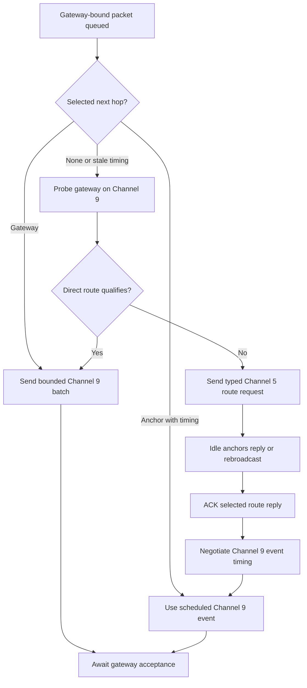
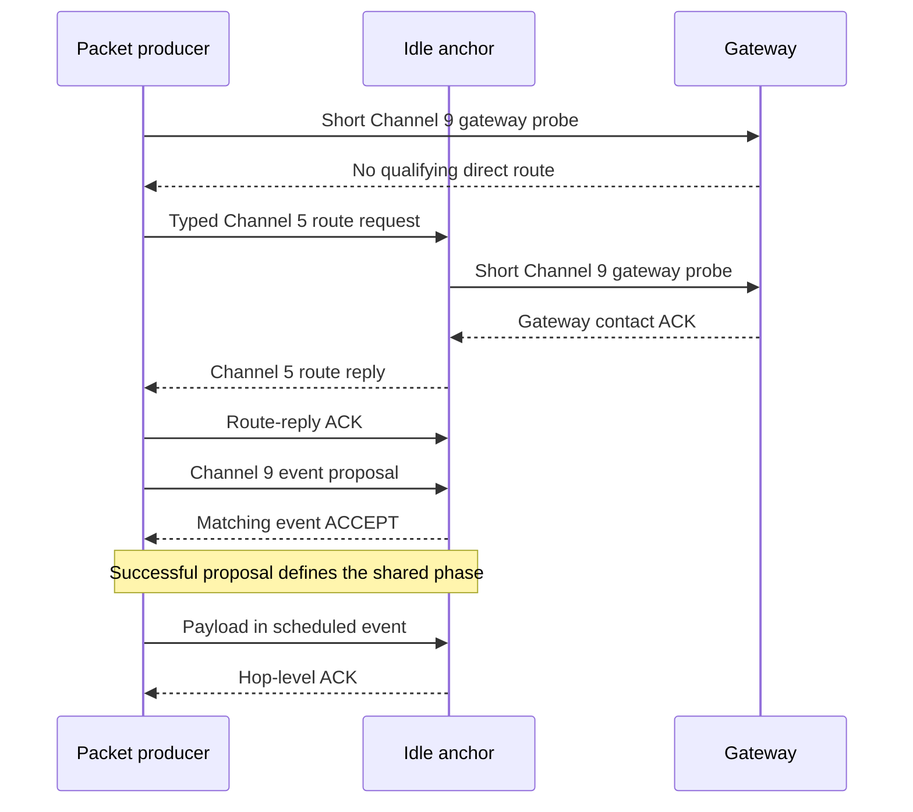

<!-- PAGE_ID: imec2-05-connected-mesh -->

[← IMEC2 Wiki](README.md) / Connected Routing, Priority, and Reliable Delivery

📚 Historical generation context (f6594e4)

The following files were used as context for generating this wiki page:

- [Mesh Connected Routing Contract.md:1-1024](https://github.com/Jubliano-sama/IMEC2/blob/f6594e41b57f5fd612aba182e0bd13cbbdd0c621/Documentation/Mesh%20Connected%20Routing%20Contract.md#L1-L1024)
- [node_comm.h:25-63](https://github.com/Jubliano-sama/IMEC2/blob/f6594e41b57f5fd612aba182e0bd13cbbdd0c621/firmware/include/node_comm.h#L25-L63)
- [node_comm.c:16-64](https://github.com/Jubliano-sama/IMEC2/blob/f6594e41b57f5fd612aba182e0bd13cbbdd0c621/firmware/src/node_comm.c#L16-L64)
- [mesh_runtime.c:8-21](https://github.com/Jubliano-sama/IMEC2/blob/f6594e41b57f5fd612aba182e0bd13cbbdd0c621/firmware/src/mesh_runtime.c#L8-L21)
- [mesh_relay.h:177-210](https://github.com/Jubliano-sama/IMEC2/blob/f6594e41b57f5fd612aba182e0bd13cbbdd0c621/firmware/include/mesh_relay.h#L177-L210)
- [route.h:14-71](https://github.com/Jubliano-sama/IMEC2/blob/f6594e41b57f5fd612aba182e0bd13cbbdd0c621/firmware/include/route.h#L14-L71)

# Connected Routing, Priority, and Reliable Delivery

A participant's click becomes useful research data only if its report survives contention, relays, missed acknowledgements, and temporary loss of contact. This chapter continues the [end-to-end click story](02_one-click-end-to-end.md) at the point where a [production clicker or anchor](01_product-roles-and-firmware-lines.md) has gateway-bound data and the connected mesh must carry it to the gateway without claiming success too early.

> **Related pages:** [Protocol, Packets, and Data Contracts](04_protocol-packets-and-data-contracts.md) · [Anchor Identity, Discovery, and Assignment](06_anchor-identity-discovery-and-assignment.md) · [Data Custody, Persistence, and Recovery](08_data-custody-persistence-and-recovery.md) · [Testing, Simulation, and Release Evidence](12_testing-simulation-and-release-evidence.md)

---

<!-- BEGIN:AUTOGEN imec2-05-connected-mesh-contract-invariants -->
## The Mesh Contract

The connected-routing contract owns the shared radio and delivery rules. **Channel 5 is the control and preemption lane, while Channel 9 carries scheduled relay traffic.** A connected [mesh_anchor](01_product-roles-and-firmware-lines.md) alternates Channel 9 work with full-duty Channel 5 receive windows, and Channel 9 work must be clipped, deferred, or retried rather than starving those windows ([Mesh Connected Routing Contract.md:66-90](https://github.com/Jubliano-sama/IMEC2/blob/af15a7eb59b1ca8f75464506ffa97f980ffbfef7/Documentation/Mesh%20Connected%20Routing%20Contract.md#L66-L90)).

| Contract boundary | What it means in the participant story |
|---|---|
| Channel 5 contact | A valid click or ranging claim transfers radio ownership directly to the click sequence; it cannot be reclassified as route traffic or deferred to another receiver ([Mesh Connected Routing Contract.md:78-109](https://github.com/Jubliano-sama/IMEC2/blob/af15a7eb59b1ca8f75464506ffa97f980ffbfef7/Documentation/Mesh%20Connected%20Routing%20Contract.md#L78-L109)). |
| Channel 9 events | Anchor-to-anchor traffic uses negotiated recurring events, while the [mesh_gateway](01_product-roles-and-firmware-lines.md) remains primarily a continuous Channel 9 receiver and owns no normal connection ([Mesh Connected Routing Contract.md:174-187](https://github.com/Jubliano-sama/IMEC2/blob/af15a7eb59b1ca8f75464506ffa97f980ffbfef7/Documentation/Mesh%20Connected%20Routing%20Contract.md#L174-L187)). |
| Route versus timing | A reverse next-hop hint records where a response may travel; it does not create a connection, reserve timing, or skip PROPOSE/ACCEPT negotiation ([Mesh Connected Routing Contract.md:145-154](https://github.com/Jubliano-sama/IMEC2/blob/af15a7eb59b1ca8f75464506ffa97f980ffbfef7/Documentation/Mesh%20Connected%20Routing%20Contract.md#L145-L154)). |
| Local versus transit work | An anchor selects its own click or command-result work before transit traffic, but already accepted transit custody remains explicit and retryable ([Mesh Connected Routing Contract.md:155-159](https://github.com/Jubliano-sama/IMEC2/blob/af15a7eb59b1ca8f75464506ffa97f980ffbfef7/Documentation/Mesh%20Connected%20Routing%20Contract.md#L155-L159)). |

Protocol state machines enter transport through one communication-service boundary. They submit immutable work with a named delivery profile and absolute deadline; the service owns priority, retry, resource waiting, RF-attempt accounting, and one typed terminal result. Its public profiles cover bounded control flood, reliable and durable uplink, protocol response, control response, and best effort ([node_comm.h:32-72](https://github.com/Jubliano-sama/IMEC2/blob/af15a7eb59b1ca8f75464506ffa97f980ffbfef7/firmware/include/node_comm.h#L32-L72), [node_comm.c:16-80](https://github.com/Jubliano-sama/IMEC2/blob/af15a7eb59b1ca8f75464506ffa97f980ffbfef7/firmware/src/node_comm.c#L16-L80)).

The host owns experiment sequencing. For an ordinary GUI operation it freezes the target and one versioned runtime profile, sends a separately correlated Here-I-Am preflight, waits for that exact successful terminal, and only then submits the target. Abort, stop, heartbeat, manual Here-I-Am, and internal survey phases are direct exceptions. Firmware validates the profile against physical airtime, guard, route, and deadline bounds; accepted policy remains in RAM only, and safe defaults return after reset ([Mesh Connected Routing Contract.md:19-58](https://github.com/Jubliano-sama/IMEC2/blob/af15a7eb59b1ca8f75464506ffa97f980ffbfef7/Documentation/Mesh%20Connected%20Routing%20Contract.md#L19-L58)).

Normal prototype success is outcome-based: useful committed partial assignment or survey results remain useful, while exact roster counts, complete telemetry, and zero loss are optional host-side qualification rules rather than hidden firmware all-or-nothing gates ([Mesh Connected Routing Contract.md:60-64](https://github.com/Jubliano-sama/IMEC2/blob/af15a7eb59b1ca8f75464506ffa97f980ffbfef7/Documentation/Mesh%20Connected%20Routing%20Contract.md#L60-L64)).

Sources: [Mesh Connected Routing Contract.md:19-187](https://github.com/Jubliano-sama/IMEC2/blob/af15a7eb59b1ca8f75464506ffa97f980ffbfef7/Documentation/Mesh%20Connected%20Routing%20Contract.md#L19-L187), [Mesh Connected Routing Contract.md:325-426](https://github.com/Jubliano-sama/IMEC2/blob/af15a7eb59b1ca8f75464506ffa97f980ffbfef7/Documentation/Mesh%20Connected%20Routing%20Contract.md#L325-L426), [node_comm.h:32-128](https://github.com/Jubliano-sama/IMEC2/blob/af15a7eb59b1ca8f75464506ffa97f980ffbfef7/firmware/include/node_comm.h#L32-L128), [node_comm.c:16-80](https://github.com/Jubliano-sama/IMEC2/blob/af15a7eb59b1ca8f75464506ffa97f980ffbfef7/firmware/src/node_comm.c#L16-L80)
<!-- END:AUTOGEN imec2-05-connected-mesh-contract-invariants -->

---

<!-- BEGIN:AUTOGEN imec2-05-connected-mesh-route-and-connect -->
## Find a Route and Establish Contact

Route acquisition starts only when gateway-bound work has no usable path. Before every Channel 5 route-request attempt, the producer performs a short direct Channel 9 gateway probe. A qualifying direct reply may satisfy direct-or-relayed mode; otherwise the producer sends a typed Channel 5 request, and idle anchors answer from a loop-free usable route or rebroadcast within the remaining TTL. Connected anchors do not advertise capacity they cannot service because each anchor has at most one upstream and one downstream Channel 9 connection ([Mesh Connected Routing Contract.md:211-220](https://github.com/Jubliano-sama/IMEC2/blob/af15a7eb59b1ca8f75464506ffa97f980ffbfef7/Documentation/Mesh%20Connected%20Routing%20Contract.md#L211-L220), [Mesh Connected Routing Contract.md:717-798](https://github.com/Jubliano-sama/IMEC2/blob/af15a7eb59b1ca8f75464506ffa97f980ffbfef7/Documentation/Mesh%20Connected%20Routing%20Contract.md#L717-L798)).

Route knowledge and radio timing stay separate. A candidate records the next hop, gateway, epoch, cost, quality, capacity hints, failure history, and whether Channel 9 timing is valid; the table keeps up to three candidates rather than treating one observation as permanent ([route.h:14-71](https://github.com/Jubliano-sama/IMEC2/blob/af15a7eb59b1ca8f75464506ffa97f980ffbfef7/firmware/include/route.h#L14-L71)). Route-control packets also carry an exact bounded node path, so split horizon and ancestry checks reject both two-node and longer loops. For an anchor hop, the successful PROPOSE RF transmission defines the phase; the responder installs it only after its matching ACCEPT physically transmits, and retry or replay cannot shift established timing ([Mesh Connected Routing Contract.md:809-857](https://github.com/Jubliano-sama/IMEC2/blob/af15a7eb59b1ca8f75464506ffa97f980ffbfef7/Documentation/Mesh%20Connected%20Routing%20Contract.md#L809-L857), [Mesh Connected Routing Contract.md:874-900](https://github.com/Jubliano-sama/IMEC2/blob/af15a7eb59b1ca8f75464506ffa97f980ffbfef7/Documentation/Mesh%20Connected%20Routing%20Contract.md#L874-L900)).

Once connected, the radio rhythm alternates scheduled Channel 9 relay windows with required Channel 5 receive windows. A click claim interrupts relay work without destroying the connection; retry timers account for the bounded click sequence, and the anchor returns to the existing rhythm when it remains valid ([Mesh Connected Routing Contract.md:1008-1035](https://github.com/Jubliano-sama/IMEC2/blob/af15a7eb59b1ca8f75464506ffa97f980ffbfef7/Documentation/Mesh%20Connected%20Routing%20Contract.md#L1008-L1035)).

Sources: [Mesh Connected Routing Contract.md:717-900](https://github.com/Jubliano-sama/IMEC2/blob/af15a7eb59b1ca8f75464506ffa97f980ffbfef7/Documentation/Mesh%20Connected%20Routing%20Contract.md#L717-L900), [Mesh Connected Routing Contract.md:1008-1035](https://github.com/Jubliano-sama/IMEC2/blob/af15a7eb59b1ca8f75464506ffa97f980ffbfef7/Documentation/Mesh%20Connected%20Routing%20Contract.md#L1008-L1035), [route.h:14-71](https://github.com/Jubliano-sama/IMEC2/blob/af15a7eb59b1ca8f75464506ffa97f980ffbfef7/firmware/include/route.h#L14-L71)
<!-- END:AUTOGEN imec2-05-connected-mesh-route-and-connect -->

---

<!-- BEGIN:AUTOGEN imec2-05-connected-mesh-custody-and-acks -->
## Custody, Forwarding, and Acknowledgements

Transmission is not delivery. A packet stays pending until the acknowledgement for its current boundary transfers custody.

| Boundary | Evidence of progress | What the sender may conclude |
|---|---|---|
| Producer to anchor | A hop ACK explicitly lists the packet | The next hop accepted custody; the gateway has not yet accepted it ([Mesh Connected Routing Contract.md:1317-1331](https://github.com/Jubliano-sama/IMEC2/blob/af15a7eb59b1ca8f75464506ffa97f980ffbfef7/Documentation/Mesh%20Connected%20Routing%20Contract.md#L1317-L1331)). |
| Anchor to gateway | A gateway ACK or batch ACK explicitly lists the packet | Final gateway acceptance is proven for that identity ([Mesh Connected Routing Contract.md:1332-1356](https://github.com/Jubliano-sama/IMEC2/blob/af15a7eb59b1ca8f75464506ffa97f980ffbfef7/Documentation/Mesh%20Connected%20Routing%20Contract.md#L1332-L1356)). |
| Gateway semantic boundary | The complete message validates, required protocol state is durable, and complete host-record capacity is reserved and committed | The gateway may make acceptance ACK-sticky. A full host queue, rejected message, or failed persistence operation leaves upstream custody retryable ([Mesh Connected Routing Contract.md:225-254](https://github.com/Jubliano-sama/IMEC2/blob/af15a7eb59b1ca8f75464506ffa97f980ffbfef7/Documentation/Mesh%20Connected%20Routing%20Contract.md#L225-L254)). |
| Collection result | A collection EACK covers the immutable result snapshot | A generic gateway ACK cannot complete this transaction; EACK custody persists through retry and reset ([Mesh Connected Routing Contract.md:249-254](https://github.com/Jubliano-sama/IMEC2/blob/af15a7eb59b1ca8f75464506ffa97f980ffbfef7/Documentation/Mesh%20Connected%20Routing%20Contract.md#L249-L254)). |

Anchor events may carry several packets, and one hop ACK can transfer custody for every identity it lists. Direct-to-gateway work is also batched: the sender reserves turnaround and receive time, marks the final frame, and waits for one ACK that lists accepted identities. Missing identities remain pending, and losing the final frame or batch ACK retries on Channel 9 while the path remains alive ([Mesh Connected Routing Contract.md:1317-1366](https://github.com/Jubliano-sama/IMEC2/blob/af15a7eb59b1ca8f75464506ffa97f980ffbfef7/Documentation/Mesh%20Connected%20Routing%20Contract.md#L1317-L1366)).

Duplicate handling repairs lost ACKs without repeating protocol mutation. A receiver suppresses a packet it already accepted but still ACKs that identity. Accepted click records add a reset boundary: the gateway journals the exact packet before semantic acceptance, commits it to BLE, and clears the journal only after the complete host record finishes. Reset between host notification and clear can replay the exact record, so BLE delivery is at-least-once across gateway reset. The GUI merges exact replays within a bounded session cache and exposes same-identity payload changes as conflicts, but a GUI process restart or cache eviction prevents an end-to-end exactly-once claim ([Mesh Connected Routing Contract.md:227-264](https://github.com/Jubliano-sama/IMEC2/blob/af15a7eb59b1ca8f75464506ffa97f980ffbfef7/Documentation/Mesh%20Connected%20Routing%20Contract.md#L227-L264), [Mesh Connected Routing Contract.md:1392-1400](https://github.com/Jubliano-sama/IMEC2/blob/af15a7eb59b1ca8f75464506ffa97f980ffbfef7/Documentation/Mesh%20Connected%20Routing%20Contract.md#L1392-L1400)). [Persistence and Recovery](08_data-custody-persistence-and-recovery.md) follows those owners across reset and storage faults.

Sources: [Mesh Connected Routing Contract.md:225-324](https://github.com/Jubliano-sama/IMEC2/blob/af15a7eb59b1ca8f75464506ffa97f980ffbfef7/Documentation/Mesh%20Connected%20Routing%20Contract.md#L225-L324), [Mesh Connected Routing Contract.md:1313-1400](https://github.com/Jubliano-sama/IMEC2/blob/af15a7eb59b1ca8f75464506ffa97f980ffbfef7/Documentation/Mesh%20Connected%20Routing%20Contract.md#L1313-L1400)
<!-- END:AUTOGEN imec2-05-connected-mesh-custody-and-acks -->

---

<!-- BEGIN:AUTOGEN imec2-05-connected-mesh-priority-and-recovery -->
## Priority, Retry, and Recovery

Priority changes what runs at the next safe radio boundary without corrupting an exchange already on air. Queued work is ordered gateway command, local click, event repair, then transit, with FIFO order inside one class. A decoded click claim owns the interactive Channel 5 sequence and may release a lower-priority transit reservation, but accepted transit custody remains available for retry ([mesh_runtime.c:8-73](https://github.com/Jubliano-sama/IMEC2/blob/af15a7eb59b1ca8f75464506ffa97f980ffbfef7/firmware/src/mesh_runtime.c#L8-L73), [mesh_runtime.c:220-280](https://github.com/Jubliano-sama/IMEC2/blob/af15a7eb59b1ca8f75464506ffa97f980ffbfef7/firmware/src/mesh_runtime.c#L220-L280)).

Retries preserve identity and distinguish contention from transmission. A pre-RF deferral advances randomized backoff but consumes no RF opportunity; a real RF start consumes one even when it later collides or times out. Bounded control flood requires four actual starts, while reliable profiles have their own limits, and every accepted request ends in exactly one typed terminal event ([Mesh Connected Routing Contract.md:165-210](https://github.com/Jubliano-sama/IMEC2/blob/af15a7eb59b1ca8f75464506ffa97f980ffbfef7/Documentation/Mesh%20Connected%20Routing%20Contract.md#L165-L210), [node_comm.c:16-80](https://github.com/Jubliano-sama/IMEC2/blob/af15a7eb59b1ca8f75464506ffa97f980ffbfef7/firmware/src/node_comm.c#L16-L80), [node_comm.c:472-488](https://github.com/Jubliano-sama/IMEC2/blob/af15a7eb59b1ca8f75464506ffa97f980ffbfef7/firmware/src/node_comm.c#L472-L488)).

Recovery escalates only when progress has genuinely stopped:

1. **Retry the live path.** A missed hop or gateway ACK keeps the same packet on Channel 9 while the connection remains alive; hop or partial-batch progress extends the wait rather than restarting discovery ([Mesh Connected Routing Contract.md:1358-1366](https://github.com/Jubliano-sama/IMEC2/blob/af15a7eb59b1ca8f75464506ffa97f980ffbfef7/Documentation/Mesh%20Connected%20Routing%20Contract.md#L1358-L1366)).
2. **Hold down a failing parent.** Three real failed gateway-ACK cycles use 1500, 3000, and 6000 ms bases. The next real failure invalidates the active path, puts that physical candidate in a 30-second hold-down, and tries an alternate before discovery ([Mesh Connected Routing Contract.md:1402-1437](https://github.com/Jubliano-sama/IMEC2/blob/af15a7eb59b1ca8f75464506ffa97f980ffbfef7/Documentation/Mesh%20Connected%20Routing%20Contract.md#L1402-L1437), [route.h:17-24](https://github.com/Jubliano-sama/IMEC2/blob/af15a7eb59b1ca8f75464506ffa97f980ffbfef7/firmware/include/route.h#L17-L24)).
3. **Invalidate dependent timing.** A proven dead path clears its active route epoch, dependent downstream entries, and Channel 9 reservations. An unrelated current reverse mapping remains available for an ACK already in flight ([Mesh Connected Routing Contract.md:1439-1450](https://github.com/Jubliano-sama/IMEC2/blob/af15a7eb59b1ca8f75464506ffa97f980ffbfef7/Documentation/Mesh%20Connected%20Routing%20Contract.md#L1439-L1450)).
4. **Use exact reverse paths for control.** A targeted gateway command follows the current-epoch reverse node path hop by hop on Channel 5; a hint alone cannot invent timing, and the bounded overflow sidecar supports the full 50-anchor membership without allocating extra connection schedules ([Mesh Connected Routing Contract.md:428-446](https://github.com/Jubliano-sama/IMEC2/blob/af15a7eb59b1ca8f75464506ffa97f980ffbfef7/Documentation/Mesh%20Connected%20Routing%20Contract.md#L428-L446)).

The consequence for the participant is deliberate: a report either remains in custody, reaches explicit gateway acceptance, or ends with an observable bounded failure. A missed window, full queue, malformed packet, conflicting identity, or unavailable route never becomes a synthetic success.

Sources: [mesh_runtime.c:8-73](https://github.com/Jubliano-sama/IMEC2/blob/af15a7eb59b1ca8f75464506ffa97f980ffbfef7/firmware/src/mesh_runtime.c#L8-L73), [mesh_runtime.c:220-280](https://github.com/Jubliano-sama/IMEC2/blob/af15a7eb59b1ca8f75464506ffa97f980ffbfef7/firmware/src/mesh_runtime.c#L220-L280), [Mesh Connected Routing Contract.md:165-210](https://github.com/Jubliano-sama/IMEC2/blob/af15a7eb59b1ca8f75464506ffa97f980ffbfef7/Documentation/Mesh%20Connected%20Routing%20Contract.md#L165-L210), [Mesh Connected Routing Contract.md:1402-1450](https://github.com/Jubliano-sama/IMEC2/blob/af15a7eb59b1ca8f75464506ffa97f980ffbfef7/Documentation/Mesh%20Connected%20Routing%20Contract.md#L1402-L1450), [node_comm.c:16-80](https://github.com/Jubliano-sama/IMEC2/blob/af15a7eb59b1ca8f75464506ffa97f980ffbfef7/firmware/src/node_comm.c#L16-L80), [route.h:17-24](https://github.com/Jubliano-sama/IMEC2/blob/af15a7eb59b1ca8f75464506ffa97f980ffbfef7/firmware/include/route.h#L17-L24)
<!-- END:AUTOGEN imec2-05-connected-mesh-priority-and-recovery -->

---

**Previous:** [Protocol, Packets, and Data Contracts](04_protocol-packets-and-data-contracts.md) · **Next:** [Anchor Identity, Discovery, and Assignment](06_anchor-identity-discovery-and-assignment.md)

**Related:** [Data Custody, Persistence, and Recovery](08_data-custody-persistence-and-recovery.md) · [Testing, Simulation, and Release Evidence](12_testing-simulation-and-release-evidence.md) · [Wiki home](README.md)
