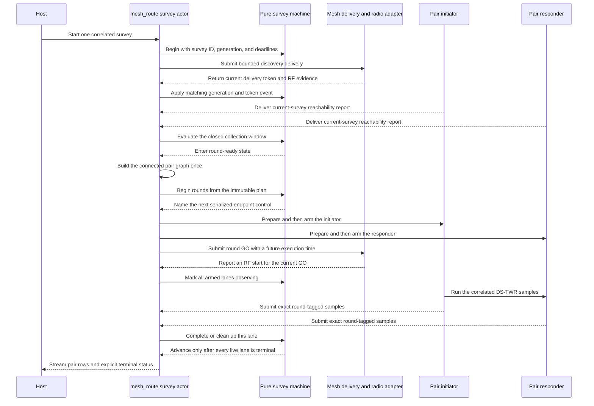

<!-- PAGE_ID: imec2-07-anchor-self-setup -->

[IMEC2 Wiki](README.md) / Anchor Self-Setup: Survey and Geometry

📚 Historical generation context (f6594e4)

The following files were used as context for this wiki page:

- [README.md:1-68](https://github.com/Jubliano-sama/IMEC2/blob/f6594e41b57f5fd612aba182e0bd13cbbdd0c621/README.md#L1-L68)
- [narrative(user story).md:1-46](https://github.com/Jubliano-sama/IMEC2/blob/f6594e41b57f5fd612aba182e0bd13cbbdd0c621/Documentation/narrative%28user%20story%29.md#L1-L46)
- [UWB+BLE Protocols and Strategies 0.3.12.2.md:1-718](https://github.com/Jubliano-sama/IMEC2/blob/f6594e41b57f5fd612aba182e0bd13cbbdd0c621/Documentation/UWB%2BBLE%20Protocols%20and%20Strategies%200.3.12.2.md#L1-L718)
- [survey.h:1-445](https://github.com/Jubliano-sama/IMEC2/blob/f6594e41b57f5fd612aba182e0bd13cbbdd0c621/firmware/include/survey.h#L1-L445)
- [survey_gateway_transaction.h:1-125](https://github.com/Jubliano-sama/IMEC2/blob/f6594e41b57f5fd612aba182e0bd13cbbdd0c621/firmware/include/survey_gateway_transaction.h#L1-L125)
- [survey_pair_lease.h:1-99](https://github.com/Jubliano-sama/IMEC2/blob/f6594e41b57f5fd612aba182e0bd13cbbdd0c621/firmware/include/survey_pair_lease.h#L1-L99)
- [survey.c:1-2204](https://github.com/Jubliano-sama/IMEC2/blob/f6594e41b57f5fd612aba182e0bd13cbbdd0c621/firmware/src/survey.c#L1-L2204)
- [survey_gateway_transaction.c:1-482](https://github.com/Jubliano-sama/IMEC2/blob/f6594e41b57f5fd612aba182e0bd13cbbdd0c621/firmware/src/survey_gateway_transaction.c#L1-L482)
- [survey_pair_lease.c:1-384](https://github.com/Jubliano-sama/IMEC2/blob/f6594e41b57f5fd612aba182e0bd13cbbdd0c621/firmware/src/survey_pair_lease.c#L1-L384)
- [app_anchor_survey_runtime.c:1-1228](https://github.com/Jubliano-sama/IMEC2/blob/f6594e41b57f5fd612aba182e0bd13cbbdd0c621/firmware/app/src/app_anchor_survey_runtime.c#L1-L1228)
- [app_mesh_gateway_command_flow.c:1-222](https://github.com/Jubliano-sama/IMEC2/blob/f6594e41b57f5fd612aba182e0bd13cbbdd0c621/firmware/app/src/app_mesh_gateway_command_flow.c#L1-L222)
- [anchor_geometry.py:1-674](https://github.com/Jubliano-sama/IMEC2/blob/f6594e41b57f5fd612aba182e0bd13cbbdd0c621/tools/gateway_gui/anchor_geometry.py#L1-L674)
- [anchor_geometry_visibility.py:1-774](https://github.com/Jubliano-sama/IMEC2/blob/f6594e41b57f5fd612aba182e0bd13cbbdd0c621/tools/gateway_gui/anchor_geometry_visibility.py#L1-L774)
- [diagnostic_models.py:70-956](https://github.com/Jubliano-sama/IMEC2/blob/f6594e41b57f5fd612aba182e0bd13cbbdd0c621/tools/gateway_gui/diagnostic_models.py#L70-L956)

# Anchor Self-Setup: Survey and Geometry

> **Related pages:** [Anchor Identity, Discovery, and Assignment](06_anchor-identity-discovery-and-assignment.md) · [Data Custody, Persistence, and Recovery](08_data-custody-persistence-and-recovery.md) · [Gateway, Host Tools, and Observability](09_gateway-host-tools-and-observability.md) · [Testing, Simulation, and Release Evidence](12_testing-simulation-and-release-evidence.md)

This chapter follows setup as one evidence chain: discover which anchors can hear one another, choose a connected set of ranging pairs, measure those pairs, retain every result until delivery is terminal, and solve a layout only after the host has a complete, internally consistent survey.

---

<!-- BEGIN:AUTOGEN imec2-07-anchor-self-setup-why-self-setup -->
## Why Self-Setup Exists

The research story begins with a participant carrying a clicker through an office. Earlier localization poles depended on participants remembering to scan whenever they changed zones, so missed scans produced spatial gaps; passive wireless localization removes that burden and lets a click remain an immediate, timestamped report of experience ([narrative(user story).md:13-17](https://github.com/Jubliano-sama/IMEC2/blob/47590ded63e99caca4461cb61f77f861bcf94b54/Documentation/narrative%28user%20story%29.md#L13-L17), [narrative(user story).md:29-36](https://github.com/Jubliano-sama/IMEC2/blob/47590ded63e99caca4461cb61f77f861bcf94b54/Documentation/narrative%28user%20story%29.md#L29-L36)).

Anchor self-setup removes the corresponding installer burden. The project goal is to derive anchor geometry from measured anchor-to-anchor distances plus approximate radio reach rather than requiring a manual positioning survey; that geometry is what later turns three or more click-to-anchor ranges into spatial context for a participant event ([README.md:5-20](https://github.com/Jubliano-sama/IMEC2/blob/47590ded63e99caca4461cb61f77f861bcf94b54/README.md#L5-L20), [narrative(user story).md:29-34](https://github.com/Jubliano-sama/IMEC2/blob/47590ded63e99caca4461cb61f77f861bcf94b54/Documentation/narrative%28user%20story%29.md#L29-L34)). Robustness matters more than producing a picture: firmware isolates stale survey work, while the host refuses disconnected, incomplete, or ambiguous evidence instead of silently returning a plausible-looking layout.

Self-setup belongs to the production-candidate `mesh_anchor`/`mesh_gateway` path. Its current protocol separates discovery evidence from synchronized pair-ranging evidence and retains useful partial results rather than converting one missing anchor or failed pair into false total failure ([UWB+BLE Protocols and Strategies 0.3.12.4.md:272-313](https://github.com/Jubliano-sama/IMEC2/blob/47590ded63e99caca4461cb61f77f861bcf94b54/Documentation/UWB%2BBLE%20Protocols%20and%20Strategies%200.3.12.4.md#L272-L313)).

Sources: [narrative(user story).md:13-36](https://github.com/Jubliano-sama/IMEC2/blob/47590ded63e99caca4461cb61f77f861bcf94b54/Documentation/narrative%28user%20story%29.md#L13-L36), [README.md:5-20](https://github.com/Jubliano-sama/IMEC2/blob/47590ded63e99caca4461cb61f77f861bcf94b54/README.md#L5-L20), [UWB+BLE Protocols and Strategies 0.3.12.4.md:272-313](https://github.com/Jubliano-sama/IMEC2/blob/47590ded63e99caca4461cb61f77f861bcf94b54/Documentation/UWB%2BBLE%20Protocols%20and%20Strategies%200.3.12.4.md#L272-L313)
<!-- END:AUTOGEN imec2-07-anchor-self-setup-why-self-setup -->

---

<!-- BEGIN:AUTOGEN imec2-07-anchor-self-setup-discover-and-plan -->
## Discover Anchors and Plan a Connected Pair Graph

Four operations that all involve “discovery” have different contracts and should stay separate:

| Operation | What it establishes | What it does not establish |
|---|---|---|
| [Enumeration and assignment](06_anchor-identity-discovery-and-assignment.md) | Stable anchor identities and the committed logical reply order used by normal clicks. | It does not measure inter-anchor visibility or distance. |
| Gateway Here-I-Am | Current reverse route evidence from a bounded Channel 5 gateway advertisement. | It proves route-refresh work, not reception by every anchor or survey participation. |
| Survey discovery | Directed evidence that one anchor heard another during the current survey's randomized rounds. | A probe is presence evidence, not a distance measurement or a mesh connection. |
| Pair ranging | Correlated DS-TWR samples for planned endpoint pairs and one nonzero synchronized-round generation. | One successful pair does not make the full graph connected or geometrically rigid. |

The host supplies one versioned discovery profile with start delay, slot duration and count, round count, report grace, and total operation budget. The old nominal-plus-reserve horizon is retired: discovery is one continuous sequence of randomized rounds. In each round every anchor chooses a survey- and identity-derived transmit slot and listens during the rest of that same round. A pre-RF refusal retries inside the remaining operation window without erasing peers already heard, restarting the window, or consuming an RF opportunity ([UWB+BLE Protocols and Strategies 0.3.12.4.md:241-270](https://github.com/Jubliano-sama/IMEC2/blob/47590ded63e99caca4461cb61f77f861bcf94b54/Documentation/UWB%2BBLE%20Protocols%20and%20Strategies%200.3.12.4.md#L241-L270), [survey.c:228-330](https://github.com/Jubliano-sama/IMEC2/blob/47590ded63e99caca4461cb61f77f861bcf94b54/firmware/src/survey.c#L228-L330)).

Starting a gateway survey clears the caller-owned context and round adapter, then begins one `gateway_survey_machine` with a nonzero operation generation, a survey ID, and 64-bit absolute operation and emission deadlines; overflow is rejected instead of wrapping a deadline. The discovery delivery is bound to that generation and one nonzero token. A callback must match both before it can change state, and a report is admitted only after a proven RF start, for the current survey, while the collection window is open ([gateway_survey_machine.c:43-171](https://github.com/Jubliano-sama/IMEC2/blob/47590ded63e99caca4461cb61f77f861bcf94b54/firmware/src/gateway_survey_machine.c#L43-L171), [gateway_survey_machine.c:192-321](https://github.com/Jubliano-sama/IMEC2/blob/47590ded63e99caca4461cb61f77f861bcf94b54/firmware/src/gateway_survey_machine.c#L192-L321), [app_anchor_gateway_survey.inc:585-695](https://github.com/Jubliano-sama/IMEC2/blob/47590ded63e99caca4461cb61f77f861bcf94b54/firmware/app/src/app_anchor_gateway_survey.inc#L585-L695), [app_anchor_gateway_survey.inc:872-896](https://github.com/Jubliano-sama/IMEC2/blob/47590ded63e99caca4461cb61f77f861bcf94b54/firmware/app/src/app_anchor_gateway_survey.inc#L872-L896)).

The gateway accepts at most 50 reports and retains at most 12 peer observations per report. One directed observation is enough to propose a pair; reciprocal hearing improves diagnostics but is not required. The first accepted report for an anchor owns its peer set and current-survey reverse hint, while an exact duplicate is idempotent. Stale survey IDs, malformed peers, invalid reverse hints, and capacity overflow fail explicitly ([survey.h:83-140](https://github.com/Jubliano-sama/IMEC2/blob/47590ded63e99caca4461cb61f77f861bcf94b54/firmware/include/survey.h#L83-L140), [survey.c:677-775](https://github.com/Jubliano-sama/IMEC2/blob/47590ded63e99caca4461cb61f77f861bcf94b54/firmware/src/survey.c#L677-L775)).

Pair planning is a close-of-collection transition, not work performed while reports are still arriving. The machine applies the emission horizon, the safety deadline, and the optional expected count in one decision; it either waits, terminates with a specific no-anchor or count-mismatch reason, or enters `ROUND_READY`. Only then does the adapter's `pairs_planned` guard build the connected bounded-degree graph once, and `gateway_survey_machine_round_begin()` accepts that immutable plan only from `ROUND_READY` before producing round metadata and loading the first batch ([gateway_survey_machine.c:345-456](https://github.com/Jubliano-sama/IMEC2/blob/47590ded63e99caca4461cb61f77f861bcf94b54/firmware/src/gateway_survey_machine.c#L345-L456), [app_anchor_gateway_control.inc:1546-1648](https://github.com/Jubliano-sama/IMEC2/blob/47590ded63e99caca4461cb61f77f861bcf94b54/firmware/app/src/app_anchor_gateway_control.inc#L1546-L1648), [app_anchor_gateway_survey_round.inc:40-70](https://github.com/Jubliano-sama/IMEC2/blob/47590ded63e99caca4461cb61f77f861bcf94b54/firmware/app/src/app_anchor_gateway_survey_round.inc#L40-L70), [gateway_survey_machine.c:648-705](https://github.com/Jubliano-sama/IMEC2/blob/47590ded63e99caca4461cb61f77f861bcf94b54/firmware/src/gateway_survey_machine.c#L648-L705)).

The planner first builds a connected graph with at most six planned pairs per anchor, so 50 anchors are capped at 150 pairs rather than a 1,225-edge complete graph. It then colors pairs into synchronized rounds. Two pairs may share a round only when their endpoints are distinct, their observed radio neighborhoods do not conflict, and their known reverse relay roots do not collide; missing evidence fails conservative and keeps the pairs separate. The runtime profile can further cap the number of parallel lanes loaded from one safe round ([survey.h:83-105](https://github.com/Jubliano-sama/IMEC2/blob/47590ded63e99caca4461cb61f77f861bcf94b54/firmware/include/survey.h#L83-L105), [survey_pair_planner.c:200-367](https://github.com/Jubliano-sama/IMEC2/blob/47590ded63e99caca4461cb61f77f861bcf94b54/firmware/src/survey_pair_planner.c#L200-L367), [survey_pair_planner.c:443-483](https://github.com/Jubliano-sama/IMEC2/blob/47590ded63e99caca4461cb61f77f861bcf94b54/firmware/src/survey_pair_planner.c#L443-L483), [survey_pair_planner.c:527-715](https://github.com/Jubliano-sama/IMEC2/blob/47590ded63e99caca4461cb61f77f861bcf94b54/firmware/src/survey_pair_planner.c#L527-L715)).

Sources: [gateway_survey_machine.h:60-149](https://github.com/Jubliano-sama/IMEC2/blob/47590ded63e99caca4461cb61f77f861bcf94b54/firmware/include/gateway_survey_machine.h#L60-L149), [gateway_survey_machine.c:43-456](https://github.com/Jubliano-sama/IMEC2/blob/47590ded63e99caca4461cb61f77f861bcf94b54/firmware/src/gateway_survey_machine.c#L43-L456), [app_anchor_gateway_survey_round.inc:40-70](https://github.com/Jubliano-sama/IMEC2/blob/47590ded63e99caca4461cb61f77f861bcf94b54/firmware/app/src/app_anchor_gateway_survey_round.inc#L40-L70), [survey.c:228-330](https://github.com/Jubliano-sama/IMEC2/blob/47590ded63e99caca4461cb61f77f861bcf94b54/firmware/src/survey.c#L228-L330), [survey.c:677-775](https://github.com/Jubliano-sama/IMEC2/blob/47590ded63e99caca4461cb61f77f861bcf94b54/firmware/src/survey.c#L677-L775), [survey_pair_planner.c:200-715](https://github.com/Jubliano-sama/IMEC2/blob/47590ded63e99caca4461cb61f77f861bcf94b54/firmware/src/survey_pair_planner.c#L200-L715)
<!-- END:AUTOGEN imec2-07-anchor-self-setup-discover-and-plan -->

---

<!-- BEGIN:AUTOGEN imec2-07-anchor-self-setup-run-pair-survey -->
## Run the Pair Survey

The former split round coordinator is no longer the source of truth. Survey behavior now crosses four explicit ownership boundaries:

| Layer | Current responsibility |
|---|---|
| Pure machine | One `gateway_survey_machine` owns discovery, collection, round dispatch, observation, cleanup/rerun, abort, and terminal transitions. Callers must serialize every transition, and the planned context remains caller-owned and immutable while the embedded round runtime is active ([gateway_survey_machine.h:60-96](https://github.com/Jubliano-sama/IMEC2/blob/47590ded63e99caca4461cb61f77f861bcf94b54/firmware/include/gateway_survey_machine.h#L60-L96)). |
| Serialized actor | Survey polling, result timeout, host retry, and abort cleanup use the existing `mesh_route` owner queue. This lifecycle work remains runnable while transport admission is paused, so cleanup cannot be stranded behind the pause it must resolve ([app_mesh_route_owner_queue.h:6-16](https://github.com/Jubliano-sama/IMEC2/blob/47590ded63e99caca4461cb61f77f861bcf94b54/firmware/app/src/app_mesh_route_owner_queue.h#L6-L16), [app_mesh_route_owner_queue.c:15-56](https://github.com/Jubliano-sama/IMEC2/blob/47590ded63e99caca4461cb61f77f861bcf94b54/firmware/app/src/app_mesh_route_owner_queue.c#L15-L56)). |
| Zephyr adapters | The composed gateway adapter translates machine decisions into mesh delivery, radio, workqueue, BLE custody, and observability calls; it does not restore a second survey policy owner ([app_anchor_gateway_control.inc:1546-1713](https://github.com/Jubliano-sama/IMEC2/blob/47590ded63e99caca4461cb61f77f861bcf94b54/firmware/app/src/app_anchor_gateway_control.inc#L1546-L1713), [app_anchor_gateway_survey_round.inc:613-772](https://github.com/Jubliano-sama/IMEC2/blob/47590ded63e99caca4461cb61f77f861bcf94b54/firmware/app/src/app_anchor_gateway_survey_round.inc#L613-L772)). |
| Terminal mapper | Machine terminal reasons map in one place to host-visible command status and event reason, preserving distinctions among operation timeout, discovery timeout, retry exhaustion, radio refusal, no anchors, count mismatch, internal failure, and abort ([app_gateway_survey_terminal.c:3-58](https://github.com/Jubliano-sama/IMEC2/blob/47590ded63e99caca4461cb61f77f861bcf94b54/firmware/app/src/app_gateway_survey_terminal.c#L3-L58)). |

The machine serializes prepare-initiator, prepare-responder, start-responder, and start-initiator controls across live lanes. START only arms a lane; GO is eligible only when every nonterminal live lane is armed and no failed-control cleanup owner remains. The adapter then submits one bounded broadcast GO carrying the batch's nonzero round ID and future execution delay, and it moves lanes to observation only after the delivery reports a real RF attempt ([gateway_survey_machine.c:602-638](https://github.com/Jubliano-sama/IMEC2/blob/47590ded63e99caca4461cb61f77f861bcf94b54/firmware/src/gateway_survey_machine.c#L602-L638), [gateway_survey_machine.c:767-946](https://github.com/Jubliano-sama/IMEC2/blob/47590ded63e99caca4461cb61f77f861bcf94b54/firmware/src/gateway_survey_machine.c#L767-L946), [gateway_survey_machine.c:1043-1079](https://github.com/Jubliano-sama/IMEC2/blob/47590ded63e99caca4461cb61f77f861bcf94b54/firmware/src/gateway_survey_machine.c#L1043-L1079), [app_anchor_gateway_survey_round.inc:95-250](https://github.com/Jubliano-sama/IMEC2/blob/47590ded63e99caca4461cb61f77f861bcf94b54/firmware/app/src/app_anchor_gateway_survey_round.inc#L95-L250)).

Each anchor still holds a `PREPARED`, `START_PENDING`, `RUNNING`, or `ABORTING` lease. Exact duplicate prepares are idempotent and do not extend the deadline. START must name the prepared pair, carry the same nonzero round ID, and use a newer command identity; radio work becomes ready only after the exact START result reaches gateway confirmation and matching GO arrives ([survey_pair_lease.h:14-53](https://github.com/Jubliano-sama/IMEC2/blob/47590ded63e99caca4461cb61f77f861bcf94b54/firmware/include/survey_pair_lease.h#L14-L53), [survey_pair_lease.h:58-119](https://github.com/Jubliano-sama/IMEC2/blob/47590ded63e99caca4461cb61f77f861bcf94b54/firmware/include/survey_pair_lease.h#L58-L119), [app_anchor_survey_runtime.c:620-684](https://github.com/Jubliano-sama/IMEC2/blob/47590ded63e99caca4461cb61f77f861bcf94b54/firmware/app/src/app_anchor_survey_runtime.c#L620-L684)).

Every result carries the survey, ordered endpoints, nonzero round ID, sample index and count, distance, quality, and range status. The live batch accepts it only when that complete identity and reporter match one observing lane. A rerun receives a new nonzero batch sequence, so delayed samples from the previous attempt cannot complete it. Missing or jointly unusable samples enter lane-scoped endpoint cleanup and the bounded rerun queue, while successful independent lanes remain complete; the next batch cannot load until every lane in the current batch is terminal ([survey_pair_round_runtime.c:207-309](https://github.com/Jubliano-sama/IMEC2/blob/47590ded63e99caca4461cb61f77f861bcf94b54/firmware/src/survey_pair_round_runtime.c#L207-L309), [survey_pair_round_runtime.c:416-625](https://github.com/Jubliano-sama/IMEC2/blob/47590ded63e99caca4461cb61f77f861bcf94b54/firmware/src/survey_pair_round_runtime.c#L416-L625), [gateway_survey_machine.c:1082-1225](https://github.com/Jubliano-sama/IMEC2/blob/47590ded63e99caca4461cb61f77f861bcf94b54/firmware/src/gateway_survey_machine.c#L1082-L1225)).

Failed controls have an additional barrier: the machine records the exact failed lane as cleanup owner, blocks later controls and batch advance until both required endpoints are released, and lets the adapter publish terminal pair telemetry under BLE custody before clearing that owner. A failed final lane therefore cannot disappear during cleanup or backpressure ([gateway_survey_machine.c:949-1041](https://github.com/Jubliano-sama/IMEC2/blob/47590ded63e99caca4461cb61f77f861bcf94b54/firmware/src/gateway_survey_machine.c#L949-L1041), [app_anchor_gateway_survey_round.inc:287-403](https://github.com/Jubliano-sama/IMEC2/blob/47590ded63e99caca4461cb61f77f861bcf94b54/firmware/app/src/app_anchor_gateway_survey_round.inc#L287-L403), [app_anchor_gateway_survey_round.inc:449-485](https://github.com/Jubliano-sama/IMEC2/blob/47590ded63e99caca4461cb61f77f861bcf94b54/firmware/app/src/app_anchor_gateway_survey_round.inc#L449-L485), [app_anchor_gateway_survey_round.inc:585-611](https://github.com/Jubliano-sama/IMEC2/blob/47590ded63e99caca4461cb61f77f861bcf94b54/firmware/app/src/app_anchor_gateway_survey_round.inc#L585-L611)).

### Reset and qualification boundaries

`gateway_survey_machine_reset()` clears the complete machine and increments its nonzero generation, invalidating every retained generation/token callback. The adapter reset also abandons an outstanding GO delivery and clears its short observation deadline; terminal finish retires or abandons active delivery custody, resets response-settle and orchestration state, and keeps the mesh-route actor scheduled while cleanup remains. Tests exercise stale callbacks before and after reset, operation abort, one-lane rerun isolation, stale rerun samples, and the failed-control cleanup barrier ([gateway_survey_machine.h:90-106](https://github.com/Jubliano-sama/IMEC2/blob/47590ded63e99caca4461cb61f77f861bcf94b54/firmware/include/gateway_survey_machine.h#L90-L106), [app_anchor_gateway_survey_round.inc:4-18](https://github.com/Jubliano-sama/IMEC2/blob/47590ded63e99caca4461cb61f77f861bcf94b54/firmware/app/src/app_anchor_gateway_survey_round.inc#L4-L18), [app_anchor_gateway_survey.inc:1094-1202](https://github.com/Jubliano-sama/IMEC2/blob/47590ded63e99caca4461cb61f77f861bcf94b54/firmware/app/src/app_anchor_gateway_survey.inc#L1094-L1202), [test_gateway_survey_machine.c:339-408](https://github.com/Jubliano-sama/IMEC2/blob/47590ded63e99caca4461cb61f77f861bcf94b54/firmware/tests/test_gateway_survey_machine.c#L339-L408), [test_gateway_survey_machine.c:638-988](https://github.com/Jubliano-sama/IMEC2/blob/47590ded63e99caca4461cb61f77f861bcf94b54/firmware/tests/test_gateway_survey_machine.c#L638-L988)).

The 64-bit guarantee applies to the operation, emission, and collection-safety lifecycle deadlines. The adapter still uses a bounded, wrap-safe 32-bit observation deadline for an individual GO batch, so this page does not describe every local timer as a 64-bit owner deadline ([gateway_survey_machine.h:66-87](https://github.com/Jubliano-sama/IMEC2/blob/47590ded63e99caca4461cb61f77f861bcf94b54/firmware/include/gateway_survey_machine.h#L66-L87), [app_anchor_gateway_survey_round.inc:182-216](https://github.com/Jubliano-sama/IMEC2/blob/47590ded63e99caca4461cb61f77f861bcf94b54/firmware/app/src/app_anchor_gateway_survey_round.inc#L182-L216), [app_anchor_gateway_survey_round.inc:405-446](https://github.com/Jubliano-sama/IMEC2/blob/47590ded63e99caca4461cb61f77f861bcf94b54/firmware/app/src/app_anchor_gateway_survey_round.inc#L405-L446)).

The target commit contains focused native and source-invariant coverage for this machine, but that evidence is not physical qualification. The architecture decision still requires trace equivalence through route loss and reset, production-preset checks, and hardware evidence before a migration stage is complete; its repository-wide completion criterion also requires exact-role and hardware evidence without a legacy fallback. Multi-board RF behavior, exact-role stack evidence, reset behavior, and power behavior therefore remain separate proof obligations. Radio admission and general delivery custody are later ownership migrations rather than capabilities supplied by this survey extraction ([Architecture Reset Plan.md:137-166](https://github.com/Jubliano-sama/IMEC2/blob/47590ded63e99caca4461cb61f77f861bcf94b54/Documentation/Architecture%20Reset%20Plan.md#L137-L166), [Architecture Reset Plan.md:207-213](https://github.com/Jubliano-sama/IMEC2/blob/47590ded63e99caca4461cb61f77f861bcf94b54/Documentation/Architecture%20Reset%20Plan.md#L207-L213)).

Sources: [gateway_survey_machine.h:60-271](https://github.com/Jubliano-sama/IMEC2/blob/47590ded63e99caca4461cb61f77f861bcf94b54/firmware/include/gateway_survey_machine.h#L60-L271), [gateway_survey_machine.c:602-1225](https://github.com/Jubliano-sama/IMEC2/blob/47590ded63e99caca4461cb61f77f861bcf94b54/firmware/src/gateway_survey_machine.c#L602-L1225), [app_mesh_route_owner_queue.c:15-56](https://github.com/Jubliano-sama/IMEC2/blob/47590ded63e99caca4461cb61f77f861bcf94b54/firmware/app/src/app_mesh_route_owner_queue.c#L15-L56), [app_anchor_gateway_survey_round.inc:4-772](https://github.com/Jubliano-sama/IMEC2/blob/47590ded63e99caca4461cb61f77f861bcf94b54/firmware/app/src/app_anchor_gateway_survey_round.inc#L4-L772), [survey_pair_round_runtime.c:207-625](https://github.com/Jubliano-sama/IMEC2/blob/47590ded63e99caca4461cb61f77f861bcf94b54/firmware/src/survey_pair_round_runtime.c#L207-L625), [test_gateway_survey_machine.c:207-988](https://github.com/Jubliano-sama/IMEC2/blob/47590ded63e99caca4461cb61f77f861bcf94b54/firmware/tests/test_gateway_survey_machine.c#L207-L988), [Architecture Reset Plan.md:137-166](https://github.com/Jubliano-sama/IMEC2/blob/47590ded63e99caca4461cb61f77f861bcf94b54/Documentation/Architecture%20Reset%20Plan.md#L137-L166)
<!-- END:AUTOGEN imec2-07-anchor-self-setup-run-pair-survey -->

---

<!-- BEGIN:AUTOGEN imec2-07-anchor-self-setup-solve-and-inspect-geometry -->
## Solve and Inspect the Geometry

The host does not feed every received distance directly into an optimizer. `SurveyGeometryModel` first binds packets to the active survey, validates both endpoint IDs and the reporting source, retains per-sample outcomes, and forms one pair distance only when every expected sample is present and successful; the distance supplied to the solver is the mean of those samples ([diagnostic_models.py:180-278](https://github.com/Jubliano-sama/IMEC2/blob/47590ded63e99caca4461cb61f77f861bcf94b54/tools/gateway_gui/diagnostic_models.py#L180-L278)). Command telemetry must also agree on the planned pairs, successful pairs, and terminal result before failed opportunities become trustworthy “missing edge” evidence ([diagnostic_models.py:280-339](https://github.com/Jubliano-sama/IMEC2/blob/47590ded63e99caca4461cb61f77f861bcf94b54/tools/gateway_gui/diagnostic_models.py#L280-L339)).

The visibility-aware solver combines known distance edges with explicit missing edges. Its pinned profile uses an 8.0 m radio radius; a pair known to have failed after complete survey coverage is penalized if the proposed layout puts those anchors closer than `radio_radius + margin`. Merely lacking a distance row is not visibility evidence, so an incomplete survey cannot manufacture separation constraints ([anchor_geometry_visibility.py:1-7](https://github.com/Jubliano-sama/IMEC2/blob/47590ded63e99caca4461cb61f77f861bcf94b54/tools/gateway_gui/anchor_geometry_visibility.py#L1-L7), [anchor_geometry_visibility.py:40-57](https://github.com/Jubliano-sama/IMEC2/blob/47590ded63e99caca4461cb61f77f861bcf94b54/tools/gateway_gui/anchor_geometry_visibility.py#L40-L57), [anchor_geometry_visibility.py:377-405](https://github.com/Jubliano-sama/IMEC2/blob/47590ded63e99caca4461cb61f77f861bcf94b54/tools/gateway_gui/anchor_geometry_visibility.py#L377-L405)). The GUI can alternatively run the dependency-free spring solver, which de-duplicates weighted pair constraints, explores multiple seeds and basin hops, and reports RMSE, maximum residual, per-pair residuals, and warnings ([anchor_geometry.py:27-65](https://github.com/Jubliano-sama/IMEC2/blob/47590ded63e99caca4461cb61f77f861bcf94b54/tools/gateway_gui/anchor_geometry.py#L27-L65), [anchor_geometry.py:67-165](https://github.com/Jubliano-sama/IMEC2/blob/47590ded63e99caca4461cb61f77f861bcf94b54/tools/gateway_gui/anchor_geometry.py#L67-L165)).

Before either solver runs, the host checks the complete evidence shape:

| Diagnostic | Meaning and next check |
|---|---|
| Incomplete `observed/expected` count | Pair rows are still missing or extra; inspect gateway command stages and retained result delivery before retrying the solve ([diagnostic_models.py:101-130](https://github.com/Jubliano-sama/IMEC2/blob/47590ded63e99caca4461cb61f77f861bcf94b54/tools/gateway_gui/diagnostic_models.py#L101-L130)). |
| Disconnected successful-distance graph | Some anchors have no successful path of distance constraints; rerun discovery/ranging and inspect the failed pairs ([diagnostic_models.py:135-155](https://github.com/Jubliano-sama/IMEC2/blob/47590ded63e99caca4461cb61f77f861bcf94b54/tools/gateway_gui/diagnostic_models.py#L135-L155)). |
| Too few edges or low rigidity rank | The graph can move while preserving its measured distances, so another pair is needed rather than another optimizer seed ([diagnostic_models.py:157-168](https://github.com/Jubliano-sama/IMEC2/blob/47590ded63e99caca4461cb61f77f861bcf94b54/tools/gateway_gui/diagnostic_models.py#L157-L168)). |
| Non-global rigidity | The distances admit non-equivalent reflected layouts; collect constraints that remove the ambiguity ([diagnostic_models.py:170-177](https://github.com/Jubliano-sama/IMEC2/blob/47590ded63e99caca4461cb61f77f861bcf94b54/tools/gateway_gui/diagnostic_models.py#L170-L177)). |
| High RMSE or large residual | One or more ranges disagree with the rest of the graph; inspect NLOS or bad pair measurements instead of accepting the plotted coordinates ([anchor_geometry.py:633-649](https://github.com/Jubliano-sama/IMEC2/blob/47590ded63e99caca4461cb61f77f861bcf94b54/tools/gateway_gui/anchor_geometry.py#L633-L649)). |

Residuals are fit diagnostics, not a qualification certificate. Low residuals only say that the accepted distance graph is internally consistent with one fitted layout; they do not supply an external coordinate frame, prove line-of-sight measurements, or replace multi-board RF and installation checks. Translation, rotation, and mirror reflection remain unconstrained by distances alone ([anchor_geometry.py:52-65](https://github.com/Jubliano-sama/IMEC2/blob/47590ded63e99caca4461cb61f77f861bcf94b54/tools/gateway_gui/anchor_geometry.py#L52-L65), [anchor_geometry.py:67-82](https://github.com/Jubliano-sama/IMEC2/blob/47590ded63e99caca4461cb61f77f861bcf94b54/tools/gateway_gui/anchor_geometry.py#L67-L82)).

The project narrative names automatic **3D** geometry as the ambition, but the checked-in GUI result and parameterization currently contain `(x, y)` coordinates only. This page therefore documents a visibility-aware **2D** layout; adding height remains separate implementation work rather than an inferred capability ([anchor_geometry.py:52-65](https://github.com/Jubliano-sama/IMEC2/blob/47590ded63e99caca4461cb61f77f861bcf94b54/tools/gateway_gui/anchor_geometry.py#L52-L65), [anchor_geometry.py:359-385](https://github.com/Jubliano-sama/IMEC2/blob/47590ded63e99caca4461cb61f77f861bcf94b54/tools/gateway_gui/anchor_geometry.py#L359-L385), [narrative(user story).md:29-32](https://github.com/Jubliano-sama/IMEC2/blob/47590ded63e99caca4461cb61f77f861bcf94b54/Documentation/narrative%28user%20story%29.md#L29-L32)).

Sources: [diagnostic_models.py:70-360](https://github.com/Jubliano-sama/IMEC2/blob/47590ded63e99caca4461cb61f77f861bcf94b54/tools/gateway_gui/diagnostic_models.py#L70-L360), [anchor_geometry_visibility.py:1-57](https://github.com/Jubliano-sama/IMEC2/blob/47590ded63e99caca4461cb61f77f861bcf94b54/tools/gateway_gui/anchor_geometry_visibility.py#L1-L57), [anchor_geometry_visibility.py:377-405](https://github.com/Jubliano-sama/IMEC2/blob/47590ded63e99caca4461cb61f77f861bcf94b54/tools/gateway_gui/anchor_geometry_visibility.py#L377-L405), [anchor_geometry.py:27-165](https://github.com/Jubliano-sama/IMEC2/blob/47590ded63e99caca4461cb61f77f861bcf94b54/tools/gateway_gui/anchor_geometry.py#L27-L165), [anchor_geometry.py:359-385](https://github.com/Jubliano-sama/IMEC2/blob/47590ded63e99caca4461cb61f77f861bcf94b54/tools/gateway_gui/anchor_geometry.py#L359-L385)
<!-- END:AUTOGEN imec2-07-anchor-self-setup-solve-and-inspect-geometry -->

---

## Continue the story

**Previous:** [Anchor Identity, Discovery, and Assignment](06_anchor-identity-discovery-and-assignment.md)

**Next:** [Data Custody, Persistence, and Recovery](08_data-custody-persistence-and-recovery.md)

**Related:** [Gateway, Host Tools, and Observability](09_gateway-host-tools-and-observability.md) · [Testing, Simulation, and Release Evidence](12_testing-simulation-and-release-evidence.md) · [Connected Routing and Reliable Delivery](05_connected-routing-and-reliable-delivery.md)
