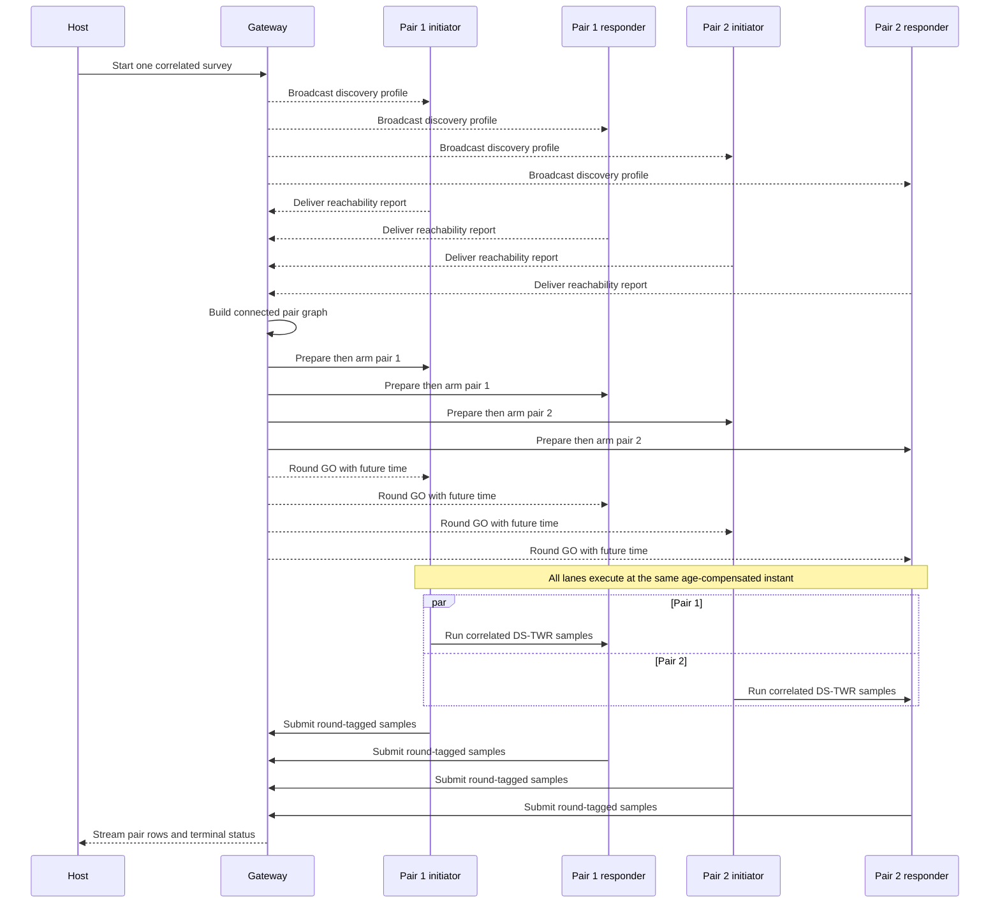

<!-- PAGE_ID: imec2-07-anchor-self-setup -->

[IMEC2 Wiki](README.md) / Anchor Self-Setup: Survey and Geometry

📚 Relevant source files

The following files were used as context for this wiki page:

- [README.md:1-68](https://github.com/Jubliano-sama/IMEC2/blob/f6594e41b57f5fd612aba182e0bd13cbbdd0c621/README.md#L1-L68)
- [narrative(user story).md:1-46](../../Documentation/narrative%28user%20story%29.md#L1-L46)
- [UWB+BLE Protocols and Strategies 0.3.12.2.md:1-718](https://github.com/Jubliano-sama/IMEC2/blob/f6594e41b57f5fd612aba182e0bd13cbbdd0c621/Documentation/UWB%2BBLE%20Protocols%20and%20Strategies%200.3.12.2.md#L1-L718)
- [survey.h:1-445](https://github.com/Jubliano-sama/IMEC2/blob/f6594e41b57f5fd612aba182e0bd13cbbdd0c621/firmware/include/survey.h#L1-L445)
- [survey_gateway_transaction.h:1-125](https://github.com/Jubliano-sama/IMEC2/blob/f6594e41b57f5fd612aba182e0bd13cbbdd0c621/firmware/include/survey_gateway_transaction.h#L1-L125)
- [survey_pair_lease.h:1-99](https://github.com/Jubliano-sama/IMEC2/blob/f6594e41b57f5fd612aba182e0bd13cbbdd0c621/firmware/include/survey_pair_lease.h#L1-L99)
- [survey.c:1-2204](https://github.com/Jubliano-sama/IMEC2/blob/f6594e41b57f5fd612aba182e0bd13cbbdd0c621/firmware/src/survey.c#L1-L2204)
- [survey_gateway_transaction.c:1-482](https://github.com/Jubliano-sama/IMEC2/blob/f6594e41b57f5fd612aba182e0bd13cbbdd0c621/firmware/src/survey_gateway_transaction.c#L1-L482)
- [survey_pair_lease.c:1-384](https://github.com/Jubliano-sama/IMEC2/blob/f6594e41b57f5fd612aba182e0bd13cbbdd0c621/firmware/src/survey_pair_lease.c#L1-L384)
- [app_anchor_survey_runtime.c:1-1228](https://github.com/Jubliano-sama/IMEC2/blob/f6594e41b57f5fd612aba182e0bd13cbbdd0c621/firmware/app/src/app_anchor_survey_runtime.c#L1-L1228)
- [app_mesh_gateway_command_flow.c:1-222](https://github.com/Jubliano-sama/IMEC2/blob/f6594e41b57f5fd612aba182e0bd13cbbdd0c621/firmware/app/src/app_mesh_gateway_command_flow.c#L1-L222)
- [anchor_geometry.py:1-674](https://github.com/Jubliano-sama/IMEC2/blob/f6594e41b57f5fd612aba182e0bd13cbbdd0c621/tools/gateway_gui/anchor_geometry.py#L1-L674)
- [anchor_geometry_visibility.py:1-774](https://github.com/Jubliano-sama/IMEC2/blob/f6594e41b57f5fd612aba182e0bd13cbbdd0c621/tools/gateway_gui/anchor_geometry_visibility.py#L1-L774)
- [diagnostic_models.py:70-956](https://github.com/Jubliano-sama/IMEC2/blob/f6594e41b57f5fd612aba182e0bd13cbbdd0c621/tools/gateway_gui/diagnostic_models.py#L70-L956)

# Anchor Self-Setup: Survey and Geometry

> **Related pages:** [Anchor Identity, Discovery, and Assignment](06_anchor-identity-discovery-and-assignment.md) · [Data Custody, Persistence, and Recovery](08_data-custody-persistence-and-recovery.md) · [Gateway, Host Tools, and Observability](09_gateway-host-tools-and-observability.md) · [Testing, Simulation, and Release Evidence](12_testing-simulation-and-release-evidence.md)

This chapter follows setup as one evidence chain: discover which anchors can hear one another, choose a connected set of ranging pairs, measure those pairs, retain every result until delivery is terminal, and solve a layout only after the host has a complete, internally consistent survey.

---

<!-- BEGIN:AUTOGEN imec2-07-anchor-self-setup-why-self-setup -->
## Why Self-Setup Exists

The research story begins with a participant carrying a clicker through an office. Earlier localization poles depended on participants remembering to scan whenever they changed zones, so missed scans produced spatial gaps; passive wireless localization removes that burden and lets a click remain an immediate, timestamped report of experience ([narrative(user story).md:13-17](../../Documentation/narrative%28user%20story%29.md#L13-L17), [narrative(user story).md:29-36](../../Documentation/narrative%28user%20story%29.md#L29-L36)).

Anchor self-setup removes the corresponding installer burden. The project goal is to derive anchor geometry from measured anchor-to-anchor distances plus approximate radio reach rather than requiring a manual positioning survey; that geometry is what later turns three or more click-to-anchor ranges into spatial context for a participant event ([README.md:5-20](https://github.com/Jubliano-sama/IMEC2/blob/c9e8e2fe4a450a8d65f697ce026f8524c81b105f/README.md#L5-L20), [narrative(user story).md:29-34](../../Documentation/narrative%28user%20story%29.md#L29-L34)). Robustness matters more than producing a picture: the repository rejects stale, disconnected, incomplete, or ambiguous evidence instead of silently returning a plausible-looking layout.

Self-setup belongs to the production-candidate `mesh_anchor`/`mesh_gateway` path. Its current protocol separates discovery evidence from synchronized pair-ranging evidence and retains useful partial results rather than converting one missing anchor or failed pair into false total failure ([UWB+BLE Protocols and Strategies 0.3.12.4.md:272-313](https://github.com/Jubliano-sama/IMEC2/blob/c9e8e2fe4a450a8d65f697ce026f8524c81b105f/Documentation/UWB%2BBLE%20Protocols%20and%20Strategies%200.3.12.4.md#L272-L313)).

Sources: [narrative(user story).md:13-36](../../Documentation/narrative%28user%20story%29.md#L13-L36), [README.md:5-20](https://github.com/Jubliano-sama/IMEC2/blob/c9e8e2fe4a450a8d65f697ce026f8524c81b105f/README.md#L5-L20), [UWB+BLE Protocols and Strategies 0.3.12.4.md:272-313](https://github.com/Jubliano-sama/IMEC2/blob/c9e8e2fe4a450a8d65f697ce026f8524c81b105f/Documentation/UWB%2BBLE%20Protocols%20and%20Strategies%200.3.12.4.md#L272-L313)
<!-- END:AUTOGEN imec2-07-anchor-self-setup-why-self-setup -->

---

<!-- BEGIN:AUTOGEN imec2-07-anchor-self-setup-discover-and-plan -->
## Discover Anchors and Plan a Connected Pair Graph

Four operations that all involve “discovery” have different contracts and should stay separate:

| Operation | What it establishes | What it does not establish |
|---|---|---|
| [Enumeration and assignment](06_anchor-identity-discovery-and-assignment.md) | Stable anchor identities and the committed logical reply order used by normal clicks. | It does not measure inter-anchor visibility or distance. |
| Gateway Here-I-Am | Current reverse route evidence from a bounded Channel 5 gateway advertisement. | It proves route-refresh work, not reception by every anchor or survey participation. |
| Survey discovery | Directed evidence that one anchor heard another during the current survey's randomized rounds. | A probe is presence evidence, not a distance measurement or a mesh connection. |
| Pair ranging | Correlated DS-TWR samples for planned endpoint pairs and one nonzero synchronized-round generation. | One successful pair does not make the full graph connected or geometrically rigid. |

The host supplies one versioned discovery profile with start delay, slot duration and count, round count, report grace, and total operation budget. The old nominal-plus-reserve horizon is retired: discovery is one continuous sequence of randomized rounds. In each round every anchor chooses a survey- and identity-derived transmit slot and listens during the rest of that same round. A pre-RF refusal retries inside the remaining operation window without erasing peers already heard, restarting the window, or consuming an RF opportunity ([UWB+BLE Protocols and Strategies 0.3.12.4.md:241-270](https://github.com/Jubliano-sama/IMEC2/blob/c9e8e2fe4a450a8d65f697ce026f8524c81b105f/Documentation/UWB%2BBLE%20Protocols%20and%20Strategies%200.3.12.4.md#L241-L270), [survey.c:230-330](https://github.com/Jubliano-sama/IMEC2/blob/c9e8e2fe4a450a8d65f697ce026f8524c81b105f/firmware/src/survey.c#L230-L330)).

The gateway starts a survey with a nonzero ID and bounded sample count, accepts at most 50 reports, and retains at most 12 peer observations per report. One directed observation is enough to propose a pair; reciprocal hearing improves diagnostics but is not required. The first accepted report for an anchor owns its peer set and current-survey reverse hint, while an exact duplicate is idempotent. Stale survey IDs, malformed peers, invalid reverse hints, and capacity overflow fail explicitly ([survey.h:82-140](https://github.com/Jubliano-sama/IMEC2/blob/c9e8e2fe4a450a8d65f697ce026f8524c81b105f/firmware/include/survey.h#L82-L140), [survey.c:677-824](https://github.com/Jubliano-sama/IMEC2/blob/c9e8e2fe4a450a8d65f697ce026f8524c81b105f/firmware/src/survey.c#L677-L824)).

Planning first builds a connected, bounded-degree distance graph: each anchor has at most six planned pairs, so 50 anchors are capped at 150 pairs rather than a 1,225-edge complete graph. It then colors planned pairs into synchronized rounds. Two pairs may share a round only when their endpoints are distinct, their observed radio neighborhoods do not conflict, and their known reverse relay roots do not collide; missing evidence fails conservative and keeps the pairs separate. The runtime profile can further cap the number of parallel lanes loaded from one safe round ([survey.h:93-105](https://github.com/Jubliano-sama/IMEC2/blob/c9e8e2fe4a450a8d65f697ce026f8524c81b105f/firmware/include/survey.h#L93-L105), [survey_pair_planner.c:560-715](https://github.com/Jubliano-sama/IMEC2/blob/c9e8e2fe4a450a8d65f697ce026f8524c81b105f/firmware/src/survey_pair_planner.c#L560-L715), [survey_pair_round_runtime.h:68-100](https://github.com/Jubliano-sama/IMEC2/blob/c9e8e2fe4a450a8d65f697ce026f8524c81b105f/firmware/include/survey_pair_round_runtime.h#L68-L100)).

Sources: [UWB+BLE Protocols and Strategies 0.3.12.4.md:241-313](https://github.com/Jubliano-sama/IMEC2/blob/c9e8e2fe4a450a8d65f697ce026f8524c81b105f/Documentation/UWB%2BBLE%20Protocols%20and%20Strategies%200.3.12.4.md#L241-L313), [survey.h:82-140](https://github.com/Jubliano-sama/IMEC2/blob/c9e8e2fe4a450a8d65f697ce026f8524c81b105f/firmware/include/survey.h#L82-L140), [survey.c:230-330](https://github.com/Jubliano-sama/IMEC2/blob/c9e8e2fe4a450a8d65f697ce026f8524c81b105f/firmware/src/survey.c#L230-L330), [survey.c:677-824](https://github.com/Jubliano-sama/IMEC2/blob/c9e8e2fe4a450a8d65f697ce026f8524c81b105f/firmware/src/survey.c#L677-L824), [survey_pair_planner.c:560-715](https://github.com/Jubliano-sama/IMEC2/blob/c9e8e2fe4a450a8d65f697ce026f8524c81b105f/firmware/src/survey_pair_planner.c#L560-L715)
<!-- END:AUTOGEN imec2-07-anchor-self-setup-discover-and-plan -->

---

<!-- BEGIN:AUTOGEN imec2-07-anchor-self-setup-run-pair-survey -->
## Run the Pair Survey

The gateway loads a bounded batch of nonconflicting pair lanes. It serializes four correlated controls for each live lane—prepare initiator, prepare responder, start responder, start initiator—because control transport still has one explicit owner. START only arms a lane. After every live lane has both endpoints armed, the gateway sends one broadcast `CMD_SURVEY_GO` with the batch's nonzero round generation and a common future execution time ([app_gateway_survey_round.c:75-220](https://github.com/Jubliano-sama/IMEC2/blob/c9e8e2fe4a450a8d65f697ce026f8524c81b105f/firmware/app/src/app_gateway_survey_round.c#L75-L220), [app_gateway_survey_round.c:225-372](https://github.com/Jubliano-sama/IMEC2/blob/c9e8e2fe4a450a8d65f697ce026f8524c81b105f/firmware/app/src/app_gateway_survey_round.c#L225-L372)).

Each anchor holds a lease with `PREPARED`, `START_PENDING`, `RUNNING`, and `ABORTING` phases. Exact duplicate prepares are idempotent and do not extend the deadline. START must name the prepared pair, carry the same nonzero round generation, and use a newer command identity; a newer START for the same pending pair explicitly supersedes the old result custody. Radio work becomes ready only after both the exact START result reaches gateway confirmation and the matching GO arrives ([survey_pair_lease.h:14-53](https://github.com/Jubliano-sama/IMEC2/blob/c9e8e2fe4a450a8d65f697ce026f8524c81b105f/firmware/include/survey_pair_lease.h#L14-L53), [survey_pair_lease.h:58-119](https://github.com/Jubliano-sama/IMEC2/blob/c9e8e2fe4a450a8d65f697ce026f8524c81b105f/firmware/include/survey_pair_lease.h#L58-L119), [app_anchor_survey_runtime.c:620-684](https://github.com/Jubliano-sama/IMEC2/blob/c9e8e2fe4a450a8d65f697ce026f8524c81b105f/firmware/app/src/app_anchor_survey_runtime.c#L620-L684)).

GO reserves a complete flood-forward horizon per hop before execution. Each receiver compensates the future delay for packet age, so endpoints that receive different flood copies still derive one execution instant; the local responder RX window remains the bounded DS-TWR window and does not expand to a multi-hop command deadline. If GO reaches a retryable terminal with zero RF starts, the gateway regenerates a fresh future instant within the operation deadline; a real RF attempt or permanent error becomes explicit affected work ([survey_round_control.h:13-46](https://github.com/Jubliano-sama/IMEC2/blob/c9e8e2fe4a450a8d65f697ce026f8524c81b105f/firmware/include/survey_round_control.h#L13-L46), [survey_round_control.c:7-13](https://github.com/Jubliano-sama/IMEC2/blob/c9e8e2fe4a450a8d65f697ce026f8524c81b105f/firmware/src/survey_round_control.c#L7-L13), [survey_round_control.c:174-207](https://github.com/Jubliano-sama/IMEC2/blob/c9e8e2fe4a450a8d65f697ce026f8524c81b105f/firmware/src/survey_round_control.c#L174-L207), [app_gateway_survey_round.c:11-27](https://github.com/Jubliano-sama/IMEC2/blob/c9e8e2fe4a450a8d65f697ce026f8524c81b105f/firmware/app/src/app_gateway_survey_round.c#L11-L27)).

Every result carries the survey, ordered endpoints, nonzero round generation, sample index and count, distance, quality, and range status. The live batch accepts a sample only when that complete identity matches one observing lane; a stale result from an earlier rerun cannot complete the new generation. A distance is usable only for `RANGE_OK` and `distance_mm > 0`; there is no 50 mm floor. A usable report may replace an unusable copy for the same sample. Missing or jointly unusable samples trigger lane-scoped cleanup and the profile's bounded reruns, while completed independent lanes remain complete ([survey.h:14-47](https://github.com/Jubliano-sama/IMEC2/blob/c9e8e2fe4a450a8d65f697ce026f8524c81b105f/firmware/include/survey.h#L14-L47), [survey_pair_round_runtime.c:416-545](https://github.com/Jubliano-sama/IMEC2/blob/c9e8e2fe4a450a8d65f697ce026f8524c81b105f/firmware/src/survey_pair_round_runtime.c#L416-L545), [survey_pair_round_runtime.c:550-625](https://github.com/Jubliano-sama/IMEC2/blob/c9e8e2fe4a450a8d65f697ce026f8524c81b105f/firmware/src/survey_pair_round_runtime.c#L550-L625)).

Failure telemetry remains correlated to the pair and control identity. The gateway distinguishes accepted success, accepted failure, duplicate, stale, late, and conflict results, and it keeps response-ACK settling, cleanup, rerun, and deadlines as separate owners. “Pair failed,” “old generation arrived,” and “control conflicted” are therefore different diagnoses rather than one timeout ([survey_gateway_transaction.h:10-72](https://github.com/Jubliano-sama/IMEC2/blob/c9e8e2fe4a450a8d65f697ce026f8524c81b105f/firmware/include/survey_gateway_transaction.h#L10-L72), [survey_pair_round_runtime.h:126-161](https://github.com/Jubliano-sama/IMEC2/blob/c9e8e2fe4a450a8d65f697ce026f8524c81b105f/firmware/include/survey_pair_round_runtime.h#L126-L161)).

Sources: [UWB+BLE Protocols and Strategies 0.3.12.4.md:287-313](https://github.com/Jubliano-sama/IMEC2/blob/c9e8e2fe4a450a8d65f697ce026f8524c81b105f/Documentation/UWB%2BBLE%20Protocols%20and%20Strategies%200.3.12.4.md#L287-L313), [app_gateway_survey_round.c:75-372](https://github.com/Jubliano-sama/IMEC2/blob/c9e8e2fe4a450a8d65f697ce026f8524c81b105f/firmware/app/src/app_gateway_survey_round.c#L75-L372), [survey_pair_lease.h:14-119](https://github.com/Jubliano-sama/IMEC2/blob/c9e8e2fe4a450a8d65f697ce026f8524c81b105f/firmware/include/survey_pair_lease.h#L14-L119), [survey_round_control.c:174-207](https://github.com/Jubliano-sama/IMEC2/blob/c9e8e2fe4a450a8d65f697ce026f8524c81b105f/firmware/src/survey_round_control.c#L174-L207), [survey_pair_round_runtime.c:416-625](https://github.com/Jubliano-sama/IMEC2/blob/c9e8e2fe4a450a8d65f697ce026f8524c81b105f/firmware/src/survey_pair_round_runtime.c#L416-L625)
<!-- END:AUTOGEN imec2-07-anchor-self-setup-run-pair-survey -->

---

<!-- BEGIN:AUTOGEN imec2-07-anchor-self-setup-solve-and-inspect-geometry -->
## Solve and Inspect the Geometry

The host does not feed every received distance directly into an optimizer. `SurveyGeometryModel` first binds packets to the active survey, validates both endpoint IDs and the reporting source, retains per-sample outcomes, and forms one pair distance only when every expected sample is present and successful; the distance supplied to the solver is the mean of those samples ([diagnostic_models.py:179-266](https://github.com/Jubliano-sama/IMEC2/blob/c9e8e2fe4a450a8d65f697ce026f8524c81b105f/tools/gateway_gui/diagnostic_models.py#L179-L266)). Command telemetry must also agree on the planned pairs, successful pairs, and terminal result before failed opportunities become trustworthy “missing edge” evidence ([diagnostic_models.py:283-327](https://github.com/Jubliano-sama/IMEC2/blob/c9e8e2fe4a450a8d65f697ce026f8524c81b105f/tools/gateway_gui/diagnostic_models.py#L283-L327)).

The default visibility-aware solver combines known distance edges with explicit missing edges. Its pinned profile uses an 8.0 m radio radius; a pair known to have failed after complete survey coverage is penalized if the proposed layout puts those anchors closer than `radio_radius + margin`. Merely lacking a distance row is not visibility evidence, so incomplete surveys cannot manufacture separation constraints ([anchor_geometry_visibility.py:1-7](https://github.com/Jubliano-sama/IMEC2/blob/c9e8e2fe4a450a8d65f697ce026f8524c81b105f/tools/gateway_gui/anchor_geometry_visibility.py#L1-L7), [anchor_geometry_visibility.py:40-57](https://github.com/Jubliano-sama/IMEC2/blob/c9e8e2fe4a450a8d65f697ce026f8524c81b105f/tools/gateway_gui/anchor_geometry_visibility.py#L40-L57), [anchor_geometry_visibility.py:377-405](https://github.com/Jubliano-sama/IMEC2/blob/c9e8e2fe4a450a8d65f697ce026f8524c81b105f/tools/gateway_gui/anchor_geometry_visibility.py#L377-L405)). The GUI can alternatively run the dependency-free spring solver, which de-duplicates weighted pair constraints, explores multiple seeds and basin hops, and reports RMSE, maximum residual, per-pair residuals, and warnings ([anchor_geometry.py:27-65](https://github.com/Jubliano-sama/IMEC2/blob/c9e8e2fe4a450a8d65f697ce026f8524c81b105f/tools/gateway_gui/anchor_geometry.py#L27-L65), [anchor_geometry.py:67-165](https://github.com/Jubliano-sama/IMEC2/blob/c9e8e2fe4a450a8d65f697ce026f8524c81b105f/tools/gateway_gui/anchor_geometry.py#L67-L165)).

Before either solver runs, the host checks the complete evidence shape:

| Diagnostic | Meaning and next check |
|---|---|
| Incomplete `observed/expected` count | Pair rows are still missing or extra; inspect gateway command stages and retained result delivery before retrying the solve ([diagnostic_models.py:100-129](https://github.com/Jubliano-sama/IMEC2/blob/c9e8e2fe4a450a8d65f697ce026f8524c81b105f/tools/gateway_gui/diagnostic_models.py#L100-L129)). |
| Disconnected successful-distance graph | Some anchors have no successful path of distance constraints; rerun discovery/ranging and inspect the failed pairs ([diagnostic_models.py:134-154](https://github.com/Jubliano-sama/IMEC2/blob/c9e8e2fe4a450a8d65f697ce026f8524c81b105f/tools/gateway_gui/diagnostic_models.py#L134-L154)). |
| Too few edges or low rigidity rank | The graph can move while preserving its measured distances, so another pair is needed rather than another optimizer seed ([diagnostic_models.py:156-168](https://github.com/Jubliano-sama/IMEC2/blob/c9e8e2fe4a450a8d65f697ce026f8524c81b105f/tools/gateway_gui/diagnostic_models.py#L156-L168)). |
| Non-global rigidity | The distances admit non-equivalent reflected layouts; collect constraints that remove the ambiguity ([diagnostic_models.py:169-176](https://github.com/Jubliano-sama/IMEC2/blob/c9e8e2fe4a450a8d65f697ce026f8524c81b105f/tools/gateway_gui/diagnostic_models.py#L169-L176)). |
| High RMSE or large residual | One or more ranges disagree with the rest of the graph; inspect NLOS or bad pair measurements instead of accepting the plotted coordinates ([anchor_geometry.py:633-649](https://github.com/Jubliano-sama/IMEC2/blob/c9e8e2fe4a450a8d65f697ce026f8524c81b105f/tools/gateway_gui/anchor_geometry.py#L633-L649)). |

There is one present-tense boundary to keep explicit: the project narrative names automatic **3D** geometry as the ambition, but the checked-in GUI parameterization and result type currently contain `(x, y)` coordinates only. The current page therefore documents a visibility-aware **2D** layout, canonicalized up to translation, rotation, and reflection; adding a height dimension remains separate implementation work rather than an inferred capability ([anchor_geometry.py:67-82](https://github.com/Jubliano-sama/IMEC2/blob/c9e8e2fe4a450a8d65f697ce026f8524c81b105f/tools/gateway_gui/anchor_geometry.py#L67-L82), [anchor_geometry.py:360-385](https://github.com/Jubliano-sama/IMEC2/blob/c9e8e2fe4a450a8d65f697ce026f8524c81b105f/tools/gateway_gui/anchor_geometry.py#L360-L385), [narrative(user story).md:29-32](../../Documentation/narrative%28user%20story%29.md#L29-L32)).

Sources: [diagnostic_models.py:70-327](https://github.com/Jubliano-sama/IMEC2/blob/c9e8e2fe4a450a8d65f697ce026f8524c81b105f/tools/gateway_gui/diagnostic_models.py#L70-L327), [anchor_geometry_visibility.py:1-57](https://github.com/Jubliano-sama/IMEC2/blob/c9e8e2fe4a450a8d65f697ce026f8524c81b105f/tools/gateway_gui/anchor_geometry_visibility.py#L1-L57), [anchor_geometry_visibility.py:377-405](https://github.com/Jubliano-sama/IMEC2/blob/c9e8e2fe4a450a8d65f697ce026f8524c81b105f/tools/gateway_gui/anchor_geometry_visibility.py#L377-L405), [anchor_geometry.py:27-165](https://github.com/Jubliano-sama/IMEC2/blob/c9e8e2fe4a450a8d65f697ce026f8524c81b105f/tools/gateway_gui/anchor_geometry.py#L27-L165), [anchor_geometry.py:360-385](https://github.com/Jubliano-sama/IMEC2/blob/c9e8e2fe4a450a8d65f697ce026f8524c81b105f/tools/gateway_gui/anchor_geometry.py#L360-L385)
<!-- END:AUTOGEN imec2-07-anchor-self-setup-solve-and-inspect-geometry -->

---

## Continue the story

**Previous:** [Anchor Identity, Discovery, and Assignment](06_anchor-identity-discovery-and-assignment.md)

**Next:** [Data Custody, Persistence, and Recovery](08_data-custody-persistence-and-recovery.md)

**Related:** [Gateway, Host Tools, and Observability](09_gateway-host-tools-and-observability.md) · [Testing, Simulation, and Release Evidence](12_testing-simulation-and-release-evidence.md) · [Connected Routing and Reliable Delivery](05_connected-routing-and-reliable-delivery.md)
