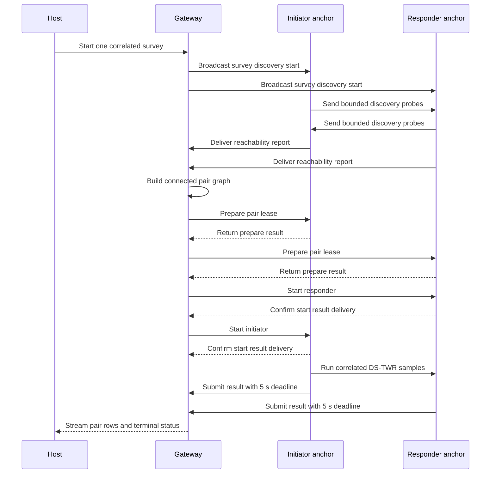

<!-- PAGE_ID: imec2-07-anchor-self-setup -->

[IMEC2 Wiki](README.md) / Anchor Self-Setup: Survey and Geometry

📚 Relevant source files

The following files were used as context for this wiki page:

- [README.md:1-68](https://github.com/Jubliano-sama/IMEC2/blob/f6594e41b57f5fd612aba182e0bd13cbbdd0c621/README.md#L1-L68)
- [narrative(user story).md:1-46](../../Documentation/narrative%28user%20story%29.md#L1-L46)
- [UWB+BLE Protocols and Strategies 0.3.12.2.md:1-718](https://github.com/Jubliano-sama/IMEC2/blob/f6594e41b57f5fd612aba182e0bd13cbbdd0c621/Documentation/UWB%2BBLE%20Protocols%20and%20Strategies%200.3.12.2.md#L1-L718)
- [survey.h:1-445](https://github.com/Jubliano-sama/IMEC2/blob/f6594e41b57f5fd612aba182e0bd13cbbdd0c621/firmware/include/survey.h#L1-L445)
- [survey_gateway_transaction.h:1-125](https://github.com/Jubliano-sama/IMEC2/blob/f6594e41b57f5fd612aba182e0bd13cbbdd0c621/firmware/include/survey_gateway_transaction.h#L1-L125)
- [survey_pair_lease.h:1-99](https://github.com/Jubliano-sama/IMEC2/blob/f6594e41b57f5fd612aba182e0bd13cbbdd0c621/firmware/include/survey_pair_lease.h#L1-L99)
- [survey.c:1-2204](https://github.com/Jubliano-sama/IMEC2/blob/f6594e41b57f5fd612aba182e0bd13cbbdd0c621/firmware/src/survey.c#L1-L2204)
- [survey_gateway_transaction.c:1-482](https://github.com/Jubliano-sama/IMEC2/blob/f6594e41b57f5fd612aba182e0bd13cbbdd0c621/firmware/src/survey_gateway_transaction.c#L1-L482)
- [survey_pair_lease.c:1-384](https://github.com/Jubliano-sama/IMEC2/blob/f6594e41b57f5fd612aba182e0bd13cbbdd0c621/firmware/src/survey_pair_lease.c#L1-L384)
- [app_anchor_survey_runtime.c:1-1228](https://github.com/Jubliano-sama/IMEC2/blob/f6594e41b57f5fd612aba182e0bd13cbbdd0c621/firmware/app/src/app_anchor_survey_runtime.c#L1-L1228)
- [app_mesh_gateway_command_flow.c:1-222](https://github.com/Jubliano-sama/IMEC2/blob/f6594e41b57f5fd612aba182e0bd13cbbdd0c621/firmware/app/src/app_mesh_gateway_command_flow.c#L1-L222)
- [anchor_geometry.py:1-674](https://github.com/Jubliano-sama/IMEC2/blob/f6594e41b57f5fd612aba182e0bd13cbbdd0c621/tools/gateway_gui/anchor_geometry.py#L1-L674)
- [anchor_geometry_visibility.py:1-774](https://github.com/Jubliano-sama/IMEC2/blob/f6594e41b57f5fd612aba182e0bd13cbbdd0c621/tools/gateway_gui/anchor_geometry_visibility.py#L1-L774)
- [diagnostic_models.py:70-956](https://github.com/Jubliano-sama/IMEC2/blob/f6594e41b57f5fd612aba182e0bd13cbbdd0c621/tools/gateway_gui/diagnostic_models.py#L70-L956)

# Anchor Self-Setup: Survey and Geometry

> **Related pages:** [Anchor Identity, Discovery, and Assignment](06_anchor-identity-discovery-and-assignment.md) · [Data Custody, Persistence, and Recovery](08_data-custody-persistence-and-recovery.md) · [Gateway, Host Tools, and Observability](09_gateway-host-tools-and-observability.md) · [Testing, Simulation, and Release Evidence](12_testing-simulation-and-release-evidence.md)

This chapter follows setup as one evidence chain: discover which anchors can hear one another, choose a connected set of ranging pairs, measure those pairs, retain every result until delivery is terminal, and solve a layout only after the host has a complete, internally consistent survey.

---

<!-- BEGIN:AUTOGEN imec2-07-anchor-self-setup-why-self-setup -->
## Why Self-Setup Exists

The research story begins with a participant carrying a clicker through an office. Earlier localization poles depended on participants remembering to scan whenever they changed zones, so missed scans produced spatial gaps; passive wireless localization removes that burden and lets a click remain an immediate, timestamped report of experience ([narrative(user story).md:13-17](../../Documentation/narrative%28user%20story%29.md#L13-L17), [narrative(user story).md:29-36](../../Documentation/narrative%28user%20story%29.md#L29-L36)).

Anchor self-setup removes the corresponding installer burden. The project goal is to derive anchor geometry from measured anchor-to-anchor distances plus approximate radio reach rather than requiring a manual positioning survey; that geometry is what later turns three or more click-to-anchor ranges into spatial context for a participant event ([README.md:5-20](https://github.com/Jubliano-sama/IMEC2/blob/f6594e41b57f5fd612aba182e0bd13cbbdd0c621/README.md#L5-L20), [narrative(user story).md:29-34](../../Documentation/narrative%28user%20story%29.md#L29-L34)). Robustness matters more than producing a picture: the repository contract rejects stale, disconnected, incomplete, or ambiguous evidence instead of silently returning a plausible-looking layout.

Self-setup belongs to the production-candidate `mesh_anchor`/`mesh_gateway` path. The separate ML clicker anchor-pair survey is a diagnostic collection mode with a different schedule and host-report format, so its rows must not be confused with gateway-orchestrated `SURVEY_PAIR_RESULT` traffic ([UWB+BLE Protocols and Strategies 0.3.12.2.md:700-716](https://github.com/Jubliano-sama/IMEC2/blob/f6594e41b57f5fd612aba182e0bd13cbbdd0c621/Documentation/UWB%2BBLE%20Protocols%20and%20Strategies%200.3.12.2.md#L700-L716)).

Sources: [narrative(user story).md:13-36](../../Documentation/narrative%28user%20story%29.md#L13-L36), [README.md:5-20](https://github.com/Jubliano-sama/IMEC2/blob/f6594e41b57f5fd612aba182e0bd13cbbdd0c621/README.md#L5-L20), [UWB+BLE Protocols and Strategies 0.3.12.2.md:700-716](https://github.com/Jubliano-sama/IMEC2/blob/f6594e41b57f5fd612aba182e0bd13cbbdd0c621/Documentation/UWB%2BBLE%20Protocols%20and%20Strategies%200.3.12.2.md#L700-L716)
<!-- END:AUTOGEN imec2-07-anchor-self-setup-why-self-setup -->

---

<!-- BEGIN:AUTOGEN imec2-07-anchor-self-setup-discover-and-plan -->
## Discover Anchors and Plan a Connected Pair Graph

Four operations that all involve “discovery” have different contracts and should stay separate:

| Operation | What it establishes | What it does not establish |
|---|---|---|
| [Enumeration and assignment](06_anchor-identity-discovery-and-assignment.md) | Stable anchor identities plus the durable logical reply order used by normal clicks. The gateway accepts full-hash claims, publishes an authoritative table, and waits for exact table acknowledgements ([UWB+BLE Protocols and Strategies 0.3.12.2.md:567-571](https://github.com/Jubliano-sama/IMEC2/blob/f6594e41b57f5fd612aba182e0bd13cbbdd0c621/Documentation/UWB%2BBLE%20Protocols%20and%20Strategies%200.3.12.2.md#L567-L571)). | It does not measure inter-anchor visibility or distance. Survey slots remain hash-derived and independent of the normal-click assignment table. |
| Gateway Here-I-Am | A gateway route advertisement seeds an upstream mesh route and may be forwarded as a controlled channel-5 flood ([UWB+BLE Protocols and Strategies 0.3.12.2.md:611-615](https://github.com/Jubliano-sama/IMEC2/blob/f6594e41b57f5fd612aba182e0bd13cbbdd0c621/Documentation/UWB%2BBLE%20Protocols%20and%20Strategies%200.3.12.2.md#L611-L615)). | It proves a routing contact, not survey participation or geometric reachability. |
| Survey discovery | Anchors exchange compact UWB presence probes in hash-derived nominal and reserve slots, then report the peers they actually heard ([UWB+BLE Protocols and Strategies 0.3.12.2.md:706-710](https://github.com/Jubliano-sama/IMEC2/blob/f6594e41b57f5fd612aba182e0bd13cbbdd0c621/Documentation/UWB%2BBLE%20Protocols%20and%20Strategies%200.3.12.2.md#L706-L710)). | A probe is presence evidence, not a distance measurement. |
| Pair ranging | A prepared initiator and responder execute DS-TWR samples and report distance, quality, and status ([survey.h:89-102](https://github.com/Jubliano-sama/IMEC2/blob/f6594e41b57f5fd612aba182e0bd13cbbdd0c621/firmware/include/survey.h#L89-L102)). | One successful pair does not make the overall graph connected or geometrically rigid. |

The gateway starts a survey with a nonzero survey ID and bounded sample count, accepts at most 50 anchor reports, and retains at most 12 peer observations per report. A stored report may also carry the actual reverse next-hop and quality, which lets later pair controls reinstall a route to the reporting anchor without pretending that visibility itself created a mesh connection ([survey.h:50-77](https://github.com/Jubliano-sama/IMEC2/blob/f6594e41b57f5fd612aba182e0bd13cbbdd0c621/firmware/include/survey.h#L50-L77), [survey.c:702-798](https://github.com/Jubliano-sama/IMEC2/blob/f6594e41b57f5fd612aba182e0bd13cbbdd0c621/firmware/src/survey.c#L702-L798)). Duplicate reports are first-accepted, while a stale survey ID, malformed peer, invalid reverse hint, or capacity overflow is rejected explicitly.

Planning happens in two passes. First, the gateway joins graph components with the best available visibility edges while respecting the six-pairs-per-anchor ceiling; if no legal edge can connect the remaining components, planning returns `PROTO_ERR_NOT_FOUND`. It then adds preferred extra edges, ordered by mutual visibility, quality, received level, and stable identity, until degree or storage limits are reached ([survey.c:1539-1689](https://github.com/Jubliano-sama/IMEC2/blob/f6594e41b57f5fd612aba182e0bd13cbbdd0c621/firmware/src/survey.c#L1539-L1689), [survey.c:1692-1801](https://github.com/Jubliano-sama/IMEC2/blob/f6594e41b57f5fd612aba182e0bd13cbbdd0c621/firmware/src/survey.c#L1692-L1801)). This produces a connected, bounded-degree survey instead of an unrestricted complete graph: 50 anchors are capped at 150 planned pairs rather than 1,225 ([survey.h:50-64](https://github.com/Jubliano-sama/IMEC2/blob/f6594e41b57f5fd612aba182e0bd13cbbdd0c621/firmware/include/survey.h#L50-L64)).

Sources: [UWB+BLE Protocols and Strategies 0.3.12.2.md:567-571](https://github.com/Jubliano-sama/IMEC2/blob/f6594e41b57f5fd612aba182e0bd13cbbdd0c621/Documentation/UWB%2BBLE%20Protocols%20and%20Strategies%200.3.12.2.md#L567-L571), [survey.h:50-197](https://github.com/Jubliano-sama/IMEC2/blob/f6594e41b57f5fd612aba182e0bd13cbbdd0c621/firmware/include/survey.h#L50-L197), [survey.c:702-885](https://github.com/Jubliano-sama/IMEC2/blob/f6594e41b57f5fd612aba182e0bd13cbbdd0c621/firmware/src/survey.c#L702-L885), [survey.c:1539-1801](https://github.com/Jubliano-sama/IMEC2/blob/f6594e41b57f5fd612aba182e0bd13cbbdd0c621/firmware/src/survey.c#L1539-L1801)
<!-- END:AUTOGEN imec2-07-anchor-self-setup-discover-and-plan -->

---

<!-- BEGIN:AUTOGEN imec2-07-anchor-self-setup-run-pair-survey -->
## Run the Pair Survey

The gateway drives one pair through four correlated control steps: prepare the initiator, prepare the responder, start the responder, then start the initiator. It advances only after the matching command result is accepted; a failed result skips that pair and returns the orchestrator to `LOAD_PAIR` ([survey.c:985-1034](https://github.com/Jubliano-sama/IMEC2/blob/f6594e41b57f5fd612aba182e0bd13cbbdd0c621/firmware/src/survey.c#L985-L1034), [survey.c:1120-1171](https://github.com/Jubliano-sama/IMEC2/blob/f6594e41b57f5fd612aba182e0bd13cbbdd0c621/firmware/src/survey.c#L1120-L1171)).

Each anchor holds a lease with explicit `PREPARED`, `START_PENDING`, `RUNNING`, and `ABORTING` phases. Exact duplicate prepares are idempotent and do not extend the deadline; `START` must name the prepared pair and use a newer command sequence, while the original deadline remains active so radio contention cannot strand a pair forever ([survey_pair_lease.h:13-30](https://github.com/Jubliano-sama/IMEC2/blob/f6594e41b57f5fd612aba182e0bd13cbbdd0c621/firmware/include/survey_pair_lease.h#L13-L30), [survey_pair_lease.h:50-93](https://github.com/Jubliano-sama/IMEC2/blob/f6594e41b57f5fd612aba182e0bd13cbbdd0c621/firmware/include/survey_pair_lease.h#L50-L93)). Before DS-TWR begins, the anchor waits for terminal confirmation that its accepted `START` result reached the gateway; failed delivery aborts the lease instead of running uncorrelated radio work ([app_anchor_survey_runtime.c:595-657](https://github.com/Jubliano-sama/IMEC2/blob/f6594e41b57f5fd612aba182e0bd13cbbdd0c621/firmware/app/src/app_anchor_survey_runtime.c#L595-L657)).

For every sample, the initiator and responder derive the same nonce from the pair identity and sample index, run the appropriate DS-TWR side, and queue a result even when ranging fails so the host can distinguish a timeout from missing telemetry ([app_anchor_survey_runtime.c:408-500](https://github.com/Jubliano-sama/IMEC2/blob/f6594e41b57f5fd612aba182e0bd13cbbdd0c621/firmware/app/src/app_anchor_survey_runtime.c#L408-L500), [app_anchor_survey_runtime.c:503-592](https://github.com/Jubliano-sama/IMEC2/blob/f6594e41b57f5fd612aba182e0bd13cbbdd0c621/firmware/app/src/app_anchor_survey_runtime.c#L503-L592)). The encoded result carries both endpoint IDs, sample index and count, distance, quality, and range status; its packet requests a gateway ACK, so local queue admission and RF reception are intermediate custody states rather than completion ([survey.c:1993-2055](https://github.com/Jubliano-sama/IMEC2/blob/f6594e41b57f5fd612aba182e0bd13cbbdd0c621/firmware/src/survey.c#L1993-L2055)). The cross-role runtime limit is four samples because the anchor can have one bounded reliable uplink per sample in flight, and each result submission gets an absolute terminal deadline five seconds after submission ([survey.h:14-25](https://github.com/Jubliano-sama/IMEC2/blob/f6594e41b57f5fd612aba182e0bd13cbbdd0c621/firmware/include/survey.h#L14-L25), [app_anchor_radio.inc:80-100](https://github.com/Jubliano-sama/IMEC2/blob/f6594e41b57f5fd612aba182e0bd13cbbdd0c621/firmware/app/src/app_anchor_radio.inc#L80-L100)). Capacity is checked before the radio run, and temporary radio ownership failures retry within the prepared lease rather than consuming the work silently ([app_anchor_survey_runtime.c:840-940](https://github.com/Jubliano-sama/IMEC2/blob/f6594e41b57f5fd612aba182e0bd13cbbdd0c621/firmware/app/src/app_anchor_survey_runtime.c#L840-L940)).

Failure telemetry stays correlated to the pair and control identity. The gateway transaction model distinguishes accepted success, accepted failure, duplicate, stale, late, and conflict results, and separately tracks cleanup and retry-boundary work ([survey_gateway_transaction.h:10-62](https://github.com/Jubliano-sama/IMEC2/blob/f6594e41b57f5fd612aba182e0bd13cbbdd0c621/firmware/include/survey_gateway_transaction.h#L10-L62)). This makes “pair failed,” “result arrived late,” and “control conflicted” different diagnoses instead of one generic timeout.

Sources: [survey.h:14-25](https://github.com/Jubliano-sama/IMEC2/blob/f6594e41b57f5fd612aba182e0bd13cbbdd0c621/firmware/include/survey.h#L14-L25), [survey.c:985-1171](https://github.com/Jubliano-sama/IMEC2/blob/f6594e41b57f5fd612aba182e0bd13cbbdd0c621/firmware/src/survey.c#L985-L1171), [survey_pair_lease.h:13-93](https://github.com/Jubliano-sama/IMEC2/blob/f6594e41b57f5fd612aba182e0bd13cbbdd0c621/firmware/include/survey_pair_lease.h#L13-L93), [app_anchor_survey_runtime.c:408-657](https://github.com/Jubliano-sama/IMEC2/blob/f6594e41b57f5fd612aba182e0bd13cbbdd0c621/firmware/app/src/app_anchor_survey_runtime.c#L408-L657), [app_anchor_survey_runtime.c:840-940](https://github.com/Jubliano-sama/IMEC2/blob/f6594e41b57f5fd612aba182e0bd13cbbdd0c621/firmware/app/src/app_anchor_survey_runtime.c#L840-L940), [app_anchor_radio.inc:80-100](https://github.com/Jubliano-sama/IMEC2/blob/f6594e41b57f5fd612aba182e0bd13cbbdd0c621/firmware/app/src/app_anchor_radio.inc#L80-L100), [survey_gateway_transaction.h:10-62](https://github.com/Jubliano-sama/IMEC2/blob/f6594e41b57f5fd612aba182e0bd13cbbdd0c621/firmware/include/survey_gateway_transaction.h#L10-L62)
<!-- END:AUTOGEN imec2-07-anchor-self-setup-run-pair-survey -->

---

<!-- BEGIN:AUTOGEN imec2-07-anchor-self-setup-solve-and-inspect-geometry -->
## Solve and Inspect the Geometry

The host does not feed every received distance directly into an optimizer. `SurveyGeometryModel` first binds packets to the active survey, validates both endpoint IDs and the reporting source, retains per-sample outcomes, and forms one pair distance only when every expected sample is present and successful; the distance supplied to the solver is the mean of those samples ([diagnostic_models.py:179-266](https://github.com/Jubliano-sama/IMEC2/blob/f6594e41b57f5fd612aba182e0bd13cbbdd0c621/tools/gateway_gui/diagnostic_models.py#L179-L266)). Command telemetry must also agree on the planned pairs, successful pairs, and terminal result before failed opportunities become trustworthy “missing edge” evidence ([diagnostic_models.py:283-327](https://github.com/Jubliano-sama/IMEC2/blob/f6594e41b57f5fd612aba182e0bd13cbbdd0c621/tools/gateway_gui/diagnostic_models.py#L283-L327)).

The default visibility-aware solver combines known distance edges with explicit missing edges. Its pinned profile uses an 8.0 m radio radius; a pair known to have failed after complete survey coverage is penalized if the proposed layout puts those anchors closer than `radio_radius + margin`. Merely lacking a distance row is not visibility evidence, so incomplete surveys cannot manufacture separation constraints ([anchor_geometry_visibility.py:1-7](https://github.com/Jubliano-sama/IMEC2/blob/f6594e41b57f5fd612aba182e0bd13cbbdd0c621/tools/gateway_gui/anchor_geometry_visibility.py#L1-L7), [anchor_geometry_visibility.py:40-57](https://github.com/Jubliano-sama/IMEC2/blob/f6594e41b57f5fd612aba182e0bd13cbbdd0c621/tools/gateway_gui/anchor_geometry_visibility.py#L40-L57), [anchor_geometry_visibility.py:377-405](https://github.com/Jubliano-sama/IMEC2/blob/f6594e41b57f5fd612aba182e0bd13cbbdd0c621/tools/gateway_gui/anchor_geometry_visibility.py#L377-L405)). The GUI can alternatively run the dependency-free spring solver, which de-duplicates weighted pair constraints, explores multiple seeds and basin hops, and reports RMSE, maximum residual, per-pair residuals, and warnings ([anchor_geometry.py:27-65](https://github.com/Jubliano-sama/IMEC2/blob/f6594e41b57f5fd612aba182e0bd13cbbdd0c621/tools/gateway_gui/anchor_geometry.py#L27-L65), [anchor_geometry.py:67-165](https://github.com/Jubliano-sama/IMEC2/blob/f6594e41b57f5fd612aba182e0bd13cbbdd0c621/tools/gateway_gui/anchor_geometry.py#L67-L165)).

Before either solver runs, the host checks the complete evidence shape:

| Diagnostic | Meaning and next check |
|---|---|
| Incomplete `observed/expected` count | Pair rows are still missing or extra; inspect gateway command stages and retained result delivery before retrying the solve ([diagnostic_models.py:100-129](https://github.com/Jubliano-sama/IMEC2/blob/f6594e41b57f5fd612aba182e0bd13cbbdd0c621/tools/gateway_gui/diagnostic_models.py#L100-L129)). |
| Disconnected successful-distance graph | Some anchors have no successful path of distance constraints; rerun discovery/ranging and inspect the failed pairs ([diagnostic_models.py:134-154](https://github.com/Jubliano-sama/IMEC2/blob/f6594e41b57f5fd612aba182e0bd13cbbdd0c621/tools/gateway_gui/diagnostic_models.py#L134-L154)). |
| Too few edges or low rigidity rank | The graph can move while preserving its measured distances, so another pair is needed rather than another optimizer seed ([diagnostic_models.py:156-168](https://github.com/Jubliano-sama/IMEC2/blob/f6594e41b57f5fd612aba182e0bd13cbbdd0c621/tools/gateway_gui/diagnostic_models.py#L156-L168)). |
| Non-global rigidity | The distances admit non-equivalent reflected layouts; collect constraints that remove the ambiguity ([diagnostic_models.py:169-176](https://github.com/Jubliano-sama/IMEC2/blob/f6594e41b57f5fd612aba182e0bd13cbbdd0c621/tools/gateway_gui/diagnostic_models.py#L169-L176)). |
| High RMSE or large residual | One or more ranges disagree with the rest of the graph; inspect NLOS or bad pair measurements instead of accepting the plotted coordinates ([anchor_geometry.py:633-649](https://github.com/Jubliano-sama/IMEC2/blob/f6594e41b57f5fd612aba182e0bd13cbbdd0c621/tools/gateway_gui/anchor_geometry.py#L633-L649)). |

There is one present-tense boundary to keep explicit: the project narrative names automatic **3D** geometry as the ambition, but the checked-in GUI parameterization and result type currently contain `(x, y)` coordinates only. The current page therefore documents a visibility-aware **2D** layout, canonicalized up to translation, rotation, and reflection; adding a height dimension remains separate implementation work rather than an inferred capability ([anchor_geometry.py:67-82](https://github.com/Jubliano-sama/IMEC2/blob/f6594e41b57f5fd612aba182e0bd13cbbdd0c621/tools/gateway_gui/anchor_geometry.py#L67-L82), [anchor_geometry.py:360-385](https://github.com/Jubliano-sama/IMEC2/blob/f6594e41b57f5fd612aba182e0bd13cbbdd0c621/tools/gateway_gui/anchor_geometry.py#L360-L385), [narrative(user story).md:29-32](../../Documentation/narrative%28user%20story%29.md#L29-L32)).

Sources: [diagnostic_models.py:70-327](https://github.com/Jubliano-sama/IMEC2/blob/f6594e41b57f5fd612aba182e0bd13cbbdd0c621/tools/gateway_gui/diagnostic_models.py#L70-L327), [anchor_geometry_visibility.py:1-57](https://github.com/Jubliano-sama/IMEC2/blob/f6594e41b57f5fd612aba182e0bd13cbbdd0c621/tools/gateway_gui/anchor_geometry_visibility.py#L1-L57), [anchor_geometry_visibility.py:377-405](https://github.com/Jubliano-sama/IMEC2/blob/f6594e41b57f5fd612aba182e0bd13cbbdd0c621/tools/gateway_gui/anchor_geometry_visibility.py#L377-L405), [anchor_geometry.py:27-165](https://github.com/Jubliano-sama/IMEC2/blob/f6594e41b57f5fd612aba182e0bd13cbbdd0c621/tools/gateway_gui/anchor_geometry.py#L27-L165), [anchor_geometry.py:360-385](https://github.com/Jubliano-sama/IMEC2/blob/f6594e41b57f5fd612aba182e0bd13cbbdd0c621/tools/gateway_gui/anchor_geometry.py#L360-L385)
<!-- END:AUTOGEN imec2-07-anchor-self-setup-solve-and-inspect-geometry -->

---

## Continue the story

**Previous:** [Anchor Identity, Discovery, and Assignment](06_anchor-identity-discovery-and-assignment.md)

**Next:** [Data Custody, Persistence, and Recovery](08_data-custody-persistence-and-recovery.md)

**Related:** [Gateway, Host Tools, and Observability](09_gateway-host-tools-and-observability.md) · [Testing, Simulation, and Release Evidence](12_testing-simulation-and-release-evidence.md) · [Connected Routing and Reliable Delivery](05_connected-routing-and-reliable-delivery.md)
