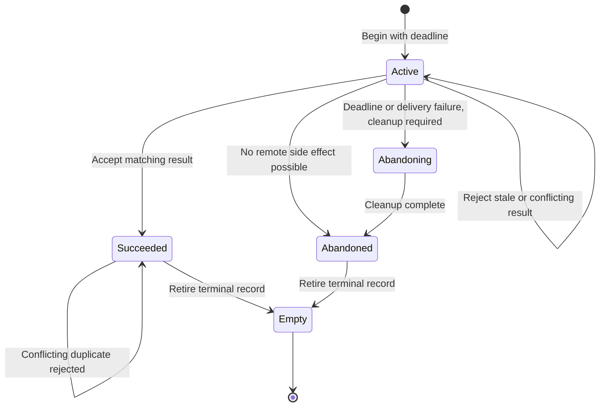

<!-- PAGE_ID: imec2-08-persistence-and-recovery -->

[Wiki Home](README.md) / Data Custody, Persistence, and Recovery

📚 Historical generation context (f6594e4)

The following files were used as context for generating this wiki page:

- [gateway_collection_journal.h:14-111](https://github.com/Jubliano-sama/IMEC2/blob/f6594e41b57f5fd612aba182e0bd13cbbdd0c621/firmware/include/gateway_collection_journal.h#L14-L111)
- [gateway_membership.c:5-74](https://github.com/Jubliano-sama/IMEC2/blob/f6594e41b57f5fd612aba182e0bd13cbbdd0c621/firmware/src/gateway_membership.c#L5-L74)
- [node_transaction.c:51-123](https://github.com/Jubliano-sama/IMEC2/blob/f6594e41b57f5fd612aba182e0bd13cbbdd0c621/firmware/src/node_transaction.c#L51-L123)
- [gateway_collection_journal.c:651-814](https://github.com/Jubliano-sama/IMEC2/blob/f6594e41b57f5fd612aba182e0bd13cbbdd0c621/firmware/src/gateway_collection_journal.c#L651-L814)
- [app_mesh_persistence.c:24-136](https://github.com/Jubliano-sama/IMEC2/blob/f6594e41b57f5fd612aba182e0bd13cbbdd0c621/firmware/app/src/app_mesh_persistence.c#L24-L136)
- [mesh_relay_custody.inc:1866-1965](https://github.com/Jubliano-sama/IMEC2/blob/f6594e41b57f5fd612aba182e0bd13cbbdd0c621/firmware/src/mesh_relay_custody.inc#L1866-L1965)
- [app_mesh_report_delivery.inc:2613-2698](https://github.com/Jubliano-sama/IMEC2/blob/f6594e41b57f5fd612aba182e0bd13cbbdd0c621/firmware/app/src/app_mesh_report_delivery.inc#L2613-L2698)
- [app_gateway_ble_stream.c:426-583](https://github.com/Jubliano-sama/IMEC2/blob/f6594e41b57f5fd612aba182e0bd13cbbdd0c621/firmware/app/src/app_gateway_ble_stream.c#L426-L583)
- [app_gateway_ble.c:591-650](https://github.com/Jubliano-sama/IMEC2/blob/f6594e41b57f5fd612aba182e0bd13cbbdd0c621/firmware/app/src/app_gateway_ble.c#L591-L650)
- [app_watchdog.c:106-164](https://github.com/Jubliano-sama/IMEC2/blob/f6594e41b57f5fd612aba182e0bd13cbbdd0c621/firmware/app/src/app_watchdog.c#L106-L164)

# Data Custody, Persistence, and Recovery

> **Related Pages**: [Anchor Self-Setup](07_anchor-self-setup-survey-and-geometry.md), [Gateway and Host Tools](09_gateway-host-tools-and-observability.md), [Verified Deployment](11_verified-deployment-and-qualification.md), [Testing and Simulation](12_testing-simulation-and-release-evidence.md)

The participant's click remains useful only if every handoff has an explicit owner. IMEC2 treats radio transmission, semantic acceptance, durable storage, and host delivery as different milestones, so a successful lower-level operation never silently stands in for the next one.

---

<!-- BEGIN:AUTOGEN imec2-08-persistence-and-recovery-custody-owners -->
## Who Owns Data at Each Boundary

The [one-click path](02_one-click-end-to-end.md) preserves a participant's observation by moving custody only after the next boundary can retain the exact work. Queue pressure and transport outages therefore remain retryable states or become explicit terminal failures; they never turn a lower-level send into research-data success.

| Boundary | Current owner | What transfers custody |
|---|---|---|
| Locally generated report | The originating relay and its outbox journal | The active outbox is snapshotted to NVS; click preemption uses a staged then committed handoff, and reset recovery treats the committed handoff as authoritative ([app_mesh_persistence.c:1474-1497](https://github.com/Jubliano-sama/IMEC2/blob/47590ded63e99caca4461cb61f77f861bcf94b54/firmware/app/src/app_mesh_persistence.c#L1474-L1497), [app_mesh_persistence.c:1599-1673](https://github.com/Jubliano-sama/IMEC2/blob/47590ded63e99caca4461cb61f77f861bcf94b54/firmware/app/src/app_mesh_persistence.c#L1599-L1673)). |
| Transit report | The relay holding child custody | Child custody is exported, written, and restored independently of the local outbox, so a relay reset does not turn transit work into local success ([app_mesh_persistence.c:1572-1597](https://github.com/Jubliano-sama/IMEC2/blob/47590ded63e99caca4461cb61f77f861bcf94b54/firmware/app/src/app_mesh_persistence.c#L1572-L1597), [app_mesh_persistence.c:1815-1854](https://github.com/Jubliano-sama/IMEC2/blob/47590ded63e99caca4461cb61f77f861bcf94b54/firmware/app/src/app_mesh_persistence.c#L1815-L1854)). |
| Gateway-bound result | The sender or previous relay | Command results, result bundles, survey reports, and clicks that require a gateway ACK remain upstream-owned until semantic delivery commits and ACK history becomes eligible ([mesh_relay_custody.inc:1866-1885](https://github.com/Jubliano-sama/IMEC2/blob/47590ded63e99caca4461cb61f77f861bcf94b54/firmware/src/mesh_relay_custody.inc#L1866-L1885)). |
| Gateway semantic state | The gateway, after validation and downstream custody | The gateway reserves the complete host-stream record before semantic mutation. A new click additionally commits its exact payload and metadata journal before BLE reservation commit; protocol finalization and gateway-delivery commit happen only after those custody steps succeed ([app_mesh_report_delivery.inc:2679-2807](https://github.com/Jubliano-sama/IMEC2/blob/47590ded63e99caca4461cb61f77f861bcf94b54/firmware/app/src/app_mesh_report_delivery.inc#L2679-L2807)). |
| Host-stream queue | The gateway BLE stream | Reservation binds the complete packet identity, payload length, and payload CRC; commit fails closed on mismatch or exhausted capacity ([app_gateway_ble_stream.c:547-697](https://github.com/Jubliano-sama/IMEC2/blob/47590ded63e99caca4461cb61f77f861bcf94b54/firmware/app/src/app_gateway_ble_stream.c#L547-L697)). The queue keeps its head until the complete asynchronous notification finishes, then retires the record ([app_gateway_ble_stream.c:796-846](https://github.com/Jubliano-sama/IMEC2/blob/47590ded63e99caca4461cb61f77f861bcf94b54/firmware/app/src/app_gateway_ble_stream.c#L796-L846), [app_gateway_ble.c:2740-2795](https://github.com/Jubliano-sama/IMEC2/blob/47590ded63e99caca4461cb61f77f861bcf94b54/firmware/app/src/app_gateway_ble.c#L2740-L2795)). |

This ordering is why a received RF frame is evidence of arrival, not proof that the [gateway-to-PC edge](09_gateway-host-tools-and-observability.md) can expose it. If BLE capacity or the click journal is unavailable, semantic state remains unmodified and no gateway ACK is emitted, leaving the upstream copy eligible for retry. An exact duplicate may reuse the already-durable click identity, but a different payload or semantic header under the same packet identity conflicts rather than replacing custody ([app_mesh_persistence.h:70-90](https://github.com/Jubliano-sama/IMEC2/blob/47590ded63e99caca4461cb61f77f861bcf94b54/firmware/app/src/app_mesh_persistence.h#L70-L90), [app_mesh_persistence.c:1020-1086](https://github.com/Jubliano-sama/IMEC2/blob/47590ded63e99caca4461cb61f77f861bcf94b54/firmware/app/src/app_mesh_persistence.c#L1020-L1086)).

Sources: [app_mesh_persistence.c:1020-1298](https://github.com/Jubliano-sama/IMEC2/blob/47590ded63e99caca4461cb61f77f861bcf94b54/firmware/app/src/app_mesh_persistence.c#L1020-L1298), [app_mesh_persistence.c:1474-1854](https://github.com/Jubliano-sama/IMEC2/blob/47590ded63e99caca4461cb61f77f861bcf94b54/firmware/app/src/app_mesh_persistence.c#L1474-L1854), [app_mesh_report_delivery.inc:2679-2807](https://github.com/Jubliano-sama/IMEC2/blob/47590ded63e99caca4461cb61f77f861bcf94b54/firmware/app/src/app_mesh_report_delivery.inc#L2679-L2807), [app_gateway_ble_stream.c:547-697](https://github.com/Jubliano-sama/IMEC2/blob/47590ded63e99caca4461cb61f77f861bcf94b54/firmware/app/src/app_gateway_ble_stream.c#L547-L697), [app_gateway_ble.c:2740-2795](https://github.com/Jubliano-sama/IMEC2/blob/47590ded63e99caca4461cb61f77f861bcf94b54/firmware/app/src/app_gateway_ble.c#L2740-L2795)
<!-- END:AUTOGEN imec2-08-persistence-and-recovery-custody-owners -->

---

<!-- BEGIN:AUTOGEN imec2-08-persistence-and-recovery-durable-state -->
## Durable State and Journals

Once a click or survey result has an owner, the Zephyr persistence layer keeps each kind of work distinct. It assigns NVS keys to the relay outbox, deferred outbox, local collection result, child custody, click handoff, local delivery, gateway collection, EACK custody, membership, and discovery assignment, then reserves two banks for gateway collection base, control, roster, and result records. The gateway click journal deliberately overlays two keys whose normal APIs are anchor-only, avoiding another live gateway key while retaining the full extended click payload bound ([app_mesh_persistence.c:24-43](https://github.com/Jubliano-sama/IMEC2/blob/47590ded63e99caca4461cb61f77f861bcf94b54/firmware/app/src/app_mesh_persistence.c#L24-L43), [app_mesh_persistence.h:70-90](https://github.com/Jubliano-sama/IMEC2/blob/47590ded63e99caca4461cb61f77f861bcf94b54/firmware/app/src/app_mesh_persistence.h#L70-L90)). Build-time assertions require a five-sector partition, account for alignment and optional NVS data CRC bytes, prove the worst-case live key set fits, and bind every major snapshot below half a sector ([app_mesh_persistence.c:44-147](https://github.com/Jubliano-sama/IMEC2/blob/47590ded63e99caca4461cb61f77f861bcf94b54/firmware/app/src/app_mesh_persistence.c#L44-L147)).

The click journal is a two-record commit protocol, not a second RAM queue. Firmware writes the exact payload first and metadata last; the metadata binds magic, schema, packet identity, payload length and CRC, receive time, checksum, and a valid marker. Semantic identity excludes only relay-local TTL and message age, because retries may change those transport fields. Restore rejects malformed metadata, missing or corrupt payload, and CRC mismatch, while an exact retry may repair a torn payload behind an intact marker ([app_mesh_persistence.c:389-405](https://github.com/Jubliano-sama/IMEC2/blob/47590ded63e99caca4461cb61f77f861bcf94b54/firmware/app/src/app_mesh_persistence.c#L389-L405), [app_mesh_persistence.c:1088-1250](https://github.com/Jubliano-sama/IMEC2/blob/47590ded63e99caca4461cb61f77f861bcf94b54/firmware/app/src/app_mesh_persistence.c#L1088-L1250)).

The gateway collection journal is a two-bank, generation-numbered commit log. Each encoded record carries a magic value, schema version, stored length, and CRC; the base record also binds the gateway, command, collection, membership, expected count, and roster CRC ([gateway_collection_journal.c:117-190](https://github.com/Jubliano-sama/IMEC2/blob/47590ded63e99caca4461cb61f77f861bcf94b54/firmware/src/gateway_collection_journal.c#L117-L190)). For a new generation, save writes roster chunks, committed result slots, and control state before writing the active base record last. For the same collection, it appends only newly committed result slots and then updates control state, while rejecting a state that removes already committed slots ([gateway_collection_journal.c:651-729](https://github.com/Jubliano-sama/IMEC2/blob/47590ded63e99caca4461cb61f77f861bcf94b54/firmware/src/gateway_collection_journal.c#L651-L729), [gateway_collection_journal.c:732-813](https://github.com/Jubliano-sama/IMEC2/blob/47590ded63e99caca4461cb61f77f861bcf94b54/firmware/src/gateway_collection_journal.c#L732-L813)).

On reset, restore examines both base banks, tries the newest valid generation first, falls back from malformed or torn data, reconstructs only committed result slots, and validates the complete collection before exposing it ([gateway_collection_journal.c:525-648](https://github.com/Jubliano-sama/IMEC2/blob/47590ded63e99caca4461cb61f77f861bcf94b54/firmware/src/gateway_collection_journal.c#L525-L648), [gateway_collection_journal.c:816-891](https://github.com/Jubliano-sama/IMEC2/blob/47590ded63e99caca4461cb61f77f861bcf94b54/firmware/src/gateway_collection_journal.c#L816-L891)). Clearing is another generation whose base is explicitly inactive, so an older active bank cannot reappear as current state after reset ([gateway_collection_journal.c:894-932](https://github.com/Jubliano-sama/IMEC2/blob/47590ded63e99caca4461cb61f77f861bcf94b54/firmware/src/gateway_collection_journal.c#L894-L932)). Membership snapshots likewise reject a wrong version, zero epoch, empty or oversized roster, zero node IDs, and duplicates before replacing live state ([gateway_membership.c:5-74](https://github.com/Jubliano-sama/IMEC2/blob/47590ded63e99caca4461cb61f77f861bcf94b54/firmware/src/gateway_membership.c#L5-L74)).

The runtime resumes interrupted ownership rather than merely exposing snapshots. After its stream is initialized, the gateway restores a valid click journal directly into a retained host-stream item before admitting a different click; the journal remains durable until the complete BLE record's send callback succeeds. A reset after host notification but before NVS clear can therefore replay the exact click, which gives at-least-once gateway-to-host delivery and requires host-side exact-identity-and-payload deduplication ([app_gateway_ble.c:706-751](https://github.com/Jubliano-sama/IMEC2/blob/47590ded63e99caca4461cb61f77f861bcf94b54/firmware/app/src/app_gateway_ble.c#L706-L751), [app_gateway_ble.c:816-903](https://github.com/Jubliano-sama/IMEC2/blob/47590ded63e99caca4461cb61f77f861bcf94b54/firmware/app/src/app_gateway_ble.c#L816-L903), [app_gateway_ble.c:3219-3227](https://github.com/Jubliano-sama/IMEC2/blob/47590ded63e99caca4461cb61f77f861bcf94b54/firmware/app/src/app_gateway_ble.c#L3219-L3227)). A restored collection separately revalidates pending EACK custody and schedules the reset gap after a final result if necessary, preserving the reset-safe [survey workflow](07_anchor-self-setup-survey-and-geometry.md) ([app_gateway_ble.c:2137-2209](https://github.com/Jubliano-sama/IMEC2/blob/47590ded63e99caca4461cb61f77f861bcf94b54/firmware/app/src/app_gateway_ble.c#L2137-L2209)).

Sources: [app_mesh_persistence.c:24-147](https://github.com/Jubliano-sama/IMEC2/blob/47590ded63e99caca4461cb61f77f861bcf94b54/firmware/app/src/app_mesh_persistence.c#L24-L147), [app_mesh_persistence.c:1020-1298](https://github.com/Jubliano-sama/IMEC2/blob/47590ded63e99caca4461cb61f77f861bcf94b54/firmware/app/src/app_mesh_persistence.c#L1020-L1298), [gateway_collection_journal.c:525-932](https://github.com/Jubliano-sama/IMEC2/blob/47590ded63e99caca4461cb61f77f861bcf94b54/firmware/src/gateway_collection_journal.c#L525-L932), [app_gateway_ble.c:816-903](https://github.com/Jubliano-sama/IMEC2/blob/47590ded63e99caca4461cb61f77f861bcf94b54/firmware/app/src/app_gateway_ble.c#L816-L903), [app_gateway_ble.c:2137-2209](https://github.com/Jubliano-sama/IMEC2/blob/47590ded63e99caca4461cb61f77f861bcf94b54/firmware/app/src/app_gateway_ble.c#L2137-L2209)
<!-- END:AUTOGEN imec2-08-persistence-and-recovery-durable-state -->

---

<!-- BEGIN:AUTOGEN imec2-08-persistence-and-recovery-transaction-lifecycle -->
## Transaction and Terminal-State Lifecycle

The same custody rule applies when the gateway asks a remote node to do work: an accepted command is not terminal until the matching result or an explicit abandonment path closes it. A node transaction begins only with a valid composite key, nonzero delivery handle, and future absolute deadline. While active it waits for a matching result; expiry or a failed terminal delivery abandons it, but cleanup is required whenever an RF attempt means a remote side effect may have occurred. A terminal delivery with zero attempts can prove that cleanup is unnecessary ([node_transaction.c:152-191](https://github.com/Jubliano-sama/IMEC2/blob/47590ded63e99caca4461cb61f77f861bcf94b54/firmware/src/node_transaction.c#L152-L191), [node_transaction.c:194-238](https://github.com/Jubliano-sama/IMEC2/blob/47590ded63e99caca4461cb61f77f861bcf94b54/firmware/src/node_transaction.c#L194-L238)).

Result reconciliation distinguishes accepted, duplicate, stale, late-after-abandon, and conflict without letting invalid input rewrite terminal state. An exact duplicate of the accepted fingerprint and token remains `SUCCEEDED`; a different request or result fingerprint is reported as conflict ([node_transaction.c:240-295](https://github.com/Jubliano-sama/IMEC2/blob/47590ded63e99caca4461cb61f77f861bcf94b54/firmware/src/node_transaction.c#L240-L295)). Retirement is allowed only from `SUCCEEDED` or `ABANDONED`, so cleanup cannot be skipped by simply clearing an active record ([node_transaction.c:298-363](https://github.com/Jubliano-sama/IMEC2/blob/47590ded63e99caca4461cb61f77f861bcf94b54/firmware/src/node_transaction.c#L298-L363)).

The responder applies the same identity discipline within its bounded eight-record table. A repeated executing request coalesces, an already committed request replays its cached result token, a changed fingerprint conflicts, an expired request is rejected, and a full table reports `FULL` instead of evicting live work ([node_transaction.h:115-169](https://github.com/Jubliano-sama/IMEC2/blob/47590ded63e99caca4461cb61f77f861bcf94b54/firmware/include/node_transaction.h#L115-L169), [node_transaction.c:398-520](https://github.com/Jubliano-sama/IMEC2/blob/47590ded63e99caca4461cb61f77f861bcf94b54/firmware/src/node_transaction.c#L398-L520)). That terminal identity is what the [host observability path](09_gateway-host-tools-and-observability.md) must report; a completed BLE write alone cannot replace it.

Sources: [node_transaction.c:152-363](https://github.com/Jubliano-sama/IMEC2/blob/47590ded63e99caca4461cb61f77f861bcf94b54/firmware/src/node_transaction.c#L152-L363), [node_transaction.c:398-520](https://github.com/Jubliano-sama/IMEC2/blob/47590ded63e99caca4461cb61f77f861bcf94b54/firmware/src/node_transaction.c#L398-L520), [node_transaction.h:115-169](https://github.com/Jubliano-sama/IMEC2/blob/47590ded63e99caca4461cb61f77f861bcf94b54/firmware/include/node_transaction.h#L115-L169)
<!-- END:AUTOGEN imec2-08-persistence-and-recovery-transaction-lifecycle -->

---

<!-- BEGIN:AUTOGEN imec2-08-persistence-and-recovery-watchdog-and-backpressure -->
## Watchdogs, Backpressure, and Bounded Recovery

Multi-month operation depends on treating pressure as a reason to retain custody, not as permission to discard a participant's record. BLE reservation returns `-ENOSPC` when its bounded queue and record pool cannot fit the record, or `-ENOTCONN` when the host edge is unavailable; it does not authorize semantic ACK completion ([app_gateway_ble_stream.c:547-615](https://github.com/Jubliano-sama/IMEC2/blob/47590ded63e99caca4461cb61f77f861bcf94b54/firmware/app/src/app_gateway_ble_stream.c#L547-L615)). Once queued, a record remains selected when notification submission fails. The gateway increments a saturating failure count and retries with capped exponential delay, while warning logs are sampled at power-of-two failure counts ([app_gateway_ble.c:2478-2490](https://github.com/Jubliano-sama/IMEC2/blob/47590ded63e99caca4461cb61f77f861bcf94b54/firmware/app/src/app_gateway_ble.c#L2478-L2490), [app_gateway_ble.c:2826-3006](https://github.com/Jubliano-sama/IMEC2/blob/47590ded63e99caca4461cb61f77f861bcf94b54/firmware/app/src/app_gateway_ble.c#L2826-L3006)).

NVS failures follow the same rule. Mount failures schedule randomized retry and keep persistence unready, while each write records consecutive and total failures and rejects short writes ([app_mesh_persistence.c:219-250](https://github.com/Jubliano-sama/IMEC2/blob/47590ded63e99caca4461cb61f77f861bcf94b54/firmware/app/src/app_mesh_persistence.c#L219-L250), [app_mesh_persistence.c:329-373](https://github.com/Jubliano-sama/IMEC2/blob/47590ded63e99caca4461cb61f77f861bcf94b54/firmware/app/src/app_mesh_persistence.c#L329-L373)). After a complete click notification, a failed journal clear remains pending and is retried; it may cause an exact replay after reset, but it cannot silently forget the durable click ([app_gateway_ble.c:596-617](https://github.com/Jubliano-sama/IMEC2/blob/47590ded63e99caca4461cb61f77f861bcf94b54/firmware/app/src/app_gateway_ble.c#L596-L617), [app_gateway_ble.c:2768-2795](https://github.com/Jubliano-sama/IMEC2/blob/47590ded63e99caca4461cb61f77f861bcf94b54/firmware/app/src/app_gateway_ble.c#L2768-L2795)).

Gateway startup and later NVS faults remain fail closed. A retained click is restored before a conflicting new click can reserve the stream; membership restore runs before collection restore; and any unresolved restore, save, or clear keeps its pending flag and scheduled retry. The runtime never treats an NVS read failure as evidence that the owner disappeared ([app_gateway_ble.c:596-669](https://github.com/Jubliano-sama/IMEC2/blob/47590ded63e99caca4461cb61f77f861bcf94b54/firmware/app/src/app_gateway_ble.c#L596-L669), [app_gateway_ble.c:706-737](https://github.com/Jubliano-sama/IMEC2/blob/47590ded63e99caca4461cb61f77f861bcf94b54/firmware/app/src/app_gateway_ble.c#L706-L737), [app_gateway_ble.c:2122-2250](https://github.com/Jubliano-sama/IMEC2/blob/47590ded63e99caca4461cb61f77f861bcf94b54/firmware/app/src/app_gateway_ble.c#L2122-L2250)).

The watchdog is a progress gate, not a periodic unconditional feed. It tracks separate system and radio lease timestamps, suppresses stale decisions only during bounded startup grace, and returns without feeding hardware when a required lease is stale; the build also proves that the software lease plus check interval expires before the hardware timeout ([app_watchdog.c:21-25](https://github.com/Jubliano-sama/IMEC2/blob/47590ded63e99caca4461cb61f77f861bcf94b54/firmware/app/src/app_watchdog.c#L21-L25), [app_watchdog.c:106-164](https://github.com/Jubliano-sama/IMEC2/blob/47590ded63e99caca4461cb61f77f861bcf94b54/firmware/app/src/app_watchdog.c#L106-L164)). If firmware inherits an already-running hardware watchdog after reset, adoption validates the reload-request mask and feeds every enabled request; invalid or empty inherited state is rejected instead of assuming protection exists ([watchdog_adoption.c:26-56](https://github.com/Jubliano-sama/IMEC2/blob/47590ded63e99caca4461cb61f77f861bcf94b54/firmware/src/watchdog_adoption.c#L26-L56), [app_watchdog.c:194-232](https://github.com/Jubliano-sama/IMEC2/blob/47590ded63e99caca4461cb61f77f861bcf94b54/firmware/app/src/app_watchdog.c#L194-L232)).

Together, bounded queues, durable journals, terminal reasons, retry scheduling, restore gates, and progress leases produce explicit recovery or explicit failure. The [testing and simulation guide](12_testing-simulation-and-release-evidence.md) shows how these boundaries are exercised; none of them convert capacity exhaustion, a torn record, a disconnected host, or a stalled worker into successful delivery.

Sources: [app_gateway_ble_stream.c:547-697](https://github.com/Jubliano-sama/IMEC2/blob/47590ded63e99caca4461cb61f77f861bcf94b54/firmware/app/src/app_gateway_ble_stream.c#L547-L697), [app_gateway_ble.c:596-903](https://github.com/Jubliano-sama/IMEC2/blob/47590ded63e99caca4461cb61f77f861bcf94b54/firmware/app/src/app_gateway_ble.c#L596-L903), [app_gateway_ble.c:2478-3006](https://github.com/Jubliano-sama/IMEC2/blob/47590ded63e99caca4461cb61f77f861bcf94b54/firmware/app/src/app_gateway_ble.c#L2478-L3006), [app_mesh_persistence.c:219-373](https://github.com/Jubliano-sama/IMEC2/blob/47590ded63e99caca4461cb61f77f861bcf94b54/firmware/app/src/app_mesh_persistence.c#L219-L373), [app_watchdog.c:106-232](https://github.com/Jubliano-sama/IMEC2/blob/47590ded63e99caca4461cb61f77f861bcf94b54/firmware/app/src/app_watchdog.c#L106-L232)
<!-- END:AUTOGEN imec2-08-persistence-and-recovery-watchdog-and-backpressure -->

---

**Previous:** [Anchor Self-Setup: Survey and Geometry](07_anchor-self-setup-survey-and-geometry.md)

**Next:** [Gateway, Host Tools, and Observability](09_gateway-host-tools-and-observability.md)

**Related:** [Verified Mesh Deployment](11_verified-deployment-and-qualification.md) · [Testing and Simulation](12_testing-simulation-and-release-evidence.md) · [Connected Routing and Reliable Delivery](05_connected-routing-and-reliable-delivery.md)
