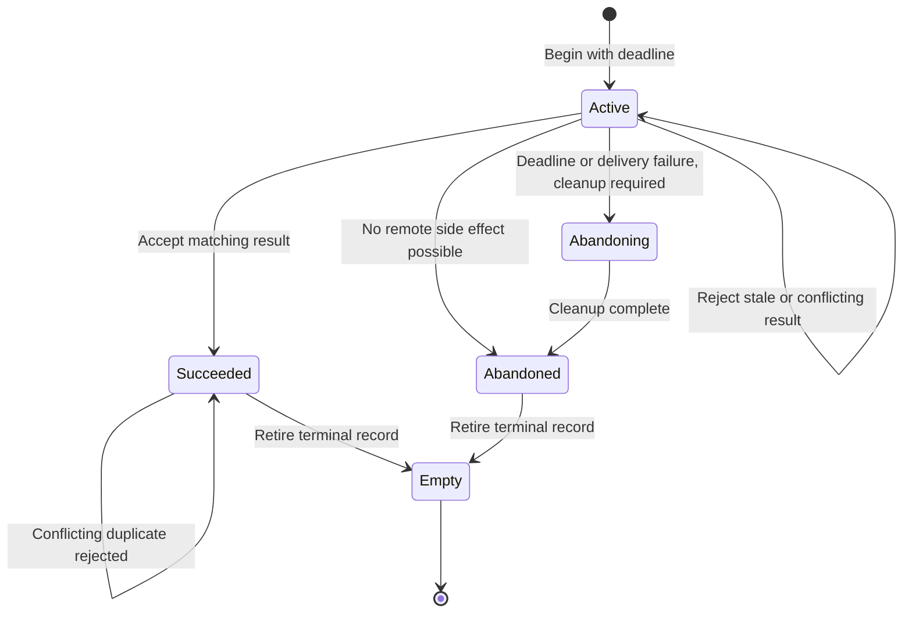

<!-- PAGE_ID: imec2-08-persistence-and-recovery -->

[Wiki Home](README.md) / Data Custody, Persistence, and Recovery

📚 Relevant source files

The following files were used as context for generating this wiki page:

- [gateway_collection_journal.h:14-111](https://github.com/Jubliano-sama/IMEC2/blob/f6594e41b57f5fd612aba182e0bd13cbbdd0c621/firmware/include/gateway_collection_journal.h#L14-L111)
- [gateway_membership.c:5-74](https://github.com/Jubliano-sama/IMEC2/blob/f6594e41b57f5fd612aba182e0bd13cbbdd0c621/firmware/src/gateway_membership.c#L5-L74)
- [node_transaction.c:51-123](https://github.com/Jubliano-sama/IMEC2/blob/f6594e41b57f5fd612aba182e0bd13cbbdd0c621/firmware/src/node_transaction.c#L51-L123)
- [gateway_collection_journal.c:651-814](https://github.com/Jubliano-sama/IMEC2/blob/f6594e41b57f5fd612aba182e0bd13cbbdd0c621/firmware/src/gateway_collection_journal.c#L651-L814)
- [app_mesh_persistence.c:24-136](https://github.com/Jubliano-sama/IMEC2/blob/f6594e41b57f5fd612aba182e0bd13cbbdd0c621/firmware/app/src/app_mesh_persistence.c#L24-L136)
- [mesh_relay_custody.inc:1866-1965](https://github.com/Jubliano-sama/IMEC2/blob/f6594e41b57f5fd612aba182e0bd13cbbdd0c621/firmware/src/mesh_relay_custody.inc#L1866-L1965)
- [app_mesh_report_delivery.inc:2613-2698](https://github.com/Jubliano-sama/IMEC2/blob/f6594e41b57f5fd612aba182e0bd13cbbdd0c621/firmware/app/src/app_mesh_report_delivery.inc#L2613-L2698)
- [app_gateway_ble_stream.c:426-583](https://github.com/Jubliano-sama/IMEC2/blob/f6594e41b57f5fd612aba182e0bd13cbbdd0c621/firmware/app/src/app_gateway_ble_stream.c#L426-L583)
- [app_gateway_ble.c:591-650](https://github.com/Jubliano-sama/IMEC2/blob/f6594e41b57f5fd612aba182e0bd13cbbdd0c621/firmware/app/src/app_gateway_ble.c#L591-L650)
- [app_watchdog.c:106-164](https://github.com/Jubliano-sama/IMEC2/blob/f6594e41b57f5fd612aba182e0bd13cbbdd0c621/firmware/app/src/app_watchdog.c#L106-L164)

# Data Custody, Persistence, and Recovery

> **Related Pages**: [Anchor Self-Setup](07_anchor-self-setup-survey-and-geometry.md), [Gateway and Host Tools](09_gateway-host-tools-and-observability.md), [Verified Deployment](11_verified-deployment-and-qualification.md), [Testing and Simulation](12_testing-simulation-and-release-evidence.md)

The participant's click remains useful only if every handoff has an explicit owner. IMEC2 treats radio transmission, semantic acceptance, durable storage, and host delivery as different milestones, so a successful lower-level operation never silently stands in for the next one.

---

<!-- BEGIN:AUTOGEN imec2-08-persistence-and-recovery-custody-owners -->
## Who Owns Data at Each Boundary

The [one-click path](02_one-click-end-to-end.md) preserves a participant's observation by moving custody only after the next boundary can retain the exact work. Queue pressure and transport outages therefore remain retryable states or become explicit terminal failures; they never turn a lower-level send into research-data success.

| Boundary | Current owner | What transfers custody |
|---|---|---|
| Locally generated report | The originating relay and its outbox journal | The active outbox is snapshotted to NVS; click preemption uses a staged then committed handoff, and reset recovery treats the committed handoff as authoritative ([app_mesh_persistence.c:511-563](https://github.com/Jubliano-sama/IMEC2/blob/f6594e41b57f5fd612aba182e0bd13cbbdd0c621/firmware/app/src/app_mesh_persistence.c#L511-L563), [app_mesh_persistence.c:734-808](https://github.com/Jubliano-sama/IMEC2/blob/f6594e41b57f5fd612aba182e0bd13cbbdd0c621/firmware/app/src/app_mesh_persistence.c#L734-L808)). |
| Transit report | The relay holding child custody | Child custody is exported, written, and restored independently of the local outbox, so a relay reset does not turn transit work into local success ([app_mesh_persistence.c:707-731](https://github.com/Jubliano-sama/IMEC2/blob/f6594e41b57f5fd612aba182e0bd13cbbdd0c621/firmware/app/src/app_mesh_persistence.c#L707-L731), [app_mesh_persistence.c:811-850](https://github.com/Jubliano-sama/IMEC2/blob/f6594e41b57f5fd612aba182e0bd13cbbdd0c621/firmware/app/src/app_mesh_persistence.c#L811-L850)). |
| Gateway-bound result | The sender or previous relay | Command results, result bundles, and survey reports that require a gateway ACK are delivered to the semantic owner before ACK history is committed ([mesh_relay_custody.inc:1866-1885](https://github.com/Jubliano-sama/IMEC2/blob/f6594e41b57f5fd612aba182e0bd13cbbdd0c621/firmware/src/mesh_relay_custody.inc#L1866-L1885)). |
| Gateway semantic state | The gateway, after validation | The gateway first reserves complete host-stream capacity, then performs semantic acceptance, commits the reserved record, finalizes protocol state, and only then commits gateway delivery and enables its ACK ([app_mesh_report_delivery.inc:2613-2698](https://github.com/Jubliano-sama/IMEC2/blob/f6594e41b57f5fd612aba182e0bd13cbbdd0c621/firmware/app/src/app_mesh_report_delivery.inc#L2613-L2698)). |
| Host-stream queue | The gateway BLE stream | A reservation is bound to packet identity, payload length, and payload CRC; commit fails closed on a mismatch or exhausted capacity ([app_gateway_ble_stream.c:426-539](https://github.com/Jubliano-sama/IMEC2/blob/f6594e41b57f5fd612aba182e0bd13cbbdd0c621/firmware/app/src/app_gateway_ble_stream.c#L426-L539)). The queue removes a record only after the send callback succeeds, and keeps it when BLE is unavailable or sending fails ([app_gateway_ble_stream.c:585-619](https://github.com/Jubliano-sama/IMEC2/blob/f6594e41b57f5fd612aba182e0bd13cbbdd0c621/firmware/app/src/app_gateway_ble_stream.c#L585-L619)). |

This ordering is why a received RF frame is evidence of arrival, not proof that the [gateway-to-PC edge](09_gateway-host-tools-and-observability.md) can expose it. If BLE capacity cannot be reserved, semantic state remains unmodified and no gateway ACK is emitted, leaving the upstream copy eligible for retry ([app_mesh_report_delivery.inc:2619-2644](https://github.com/Jubliano-sama/IMEC2/blob/f6594e41b57f5fd612aba182e0bd13cbbdd0c621/firmware/app/src/app_mesh_report_delivery.inc#L2619-L2644)). Duplicate gateway deliveries are identity-aware as well: after semantic acceptance, the gateway stores ACK history and payload identity before requesting the ACK action ([mesh_relay_custody.inc:1943-1965](https://github.com/Jubliano-sama/IMEC2/blob/f6594e41b57f5fd612aba182e0bd13cbbdd0c621/firmware/src/mesh_relay_custody.inc#L1943-L1965)).

Sources: [app_mesh_persistence.c:511-850](https://github.com/Jubliano-sama/IMEC2/blob/f6594e41b57f5fd612aba182e0bd13cbbdd0c621/firmware/app/src/app_mesh_persistence.c#L511-L850), [app_mesh_report_delivery.inc:2613-2698](https://github.com/Jubliano-sama/IMEC2/blob/f6594e41b57f5fd612aba182e0bd13cbbdd0c621/firmware/app/src/app_mesh_report_delivery.inc#L2613-L2698), [app_gateway_ble_stream.c:426-619](https://github.com/Jubliano-sama/IMEC2/blob/f6594e41b57f5fd612aba182e0bd13cbbdd0c621/firmware/app/src/app_gateway_ble_stream.c#L426-L619)
<!-- END:AUTOGEN imec2-08-persistence-and-recovery-custody-owners -->

---

<!-- BEGIN:AUTOGEN imec2-08-persistence-and-recovery-durable-state -->
## Durable State and Journals

Once a click or survey result has an owner, the Zephyr persistence layer keeps each kind of work distinct. It gives separate NVS keys to the relay outbox, local collection result, child custody, click handoff, local delivery, gateway collection, EACK custody, gateway membership, and discovery assignment, then reserves two banks for gateway collection base, control, roster, and result records ([app_mesh_persistence.c:24-39](https://github.com/Jubliano-sama/IMEC2/blob/f6594e41b57f5fd612aba182e0bd13cbbdd0c621/firmware/app/src/app_mesh_persistence.c#L24-L39)). Build-time assertions require a five-sector partition, account for alignment and optional NVS data CRC bytes, prove the worst-case live key set fits, and bound each major snapshot below half a sector ([app_mesh_persistence.c:40-136](https://github.com/Jubliano-sama/IMEC2/blob/f6594e41b57f5fd612aba182e0bd13cbbdd0c621/firmware/app/src/app_mesh_persistence.c#L40-L136)). Capacity is therefore a checked contract; a write error or short write is reported as failure and does not become a successful save ([app_mesh_persistence.c:243-264](https://github.com/Jubliano-sama/IMEC2/blob/f6594e41b57f5fd612aba182e0bd13cbbdd0c621/firmware/app/src/app_mesh_persistence.c#L243-L264)).

The gateway collection journal is a two-bank, generation-numbered commit log. Each encoded record carries a magic value, schema version, stored length, and CRC; the base record also binds the gateway, command, collection, membership, expected count, and roster CRC ([gateway_collection_journal.c:117-190](https://github.com/Jubliano-sama/IMEC2/blob/f6594e41b57f5fd612aba182e0bd13cbbdd0c621/firmware/src/gateway_collection_journal.c#L117-L190)). For a new generation, save writes roster chunks, committed result slots, and control state before writing the active base record last. For the same collection, it appends only newly committed result slots and then updates control state, while rejecting a state that removes already committed slots ([gateway_collection_journal.c:651-729](https://github.com/Jubliano-sama/IMEC2/blob/f6594e41b57f5fd612aba182e0bd13cbbdd0c621/firmware/src/gateway_collection_journal.c#L651-L729), [gateway_collection_journal.c:732-813](https://github.com/Jubliano-sama/IMEC2/blob/f6594e41b57f5fd612aba182e0bd13cbbdd0c621/firmware/src/gateway_collection_journal.c#L732-L813)).

On reset, restore examines both base banks, tries the newest valid generation first, falls back from malformed or torn data, reconstructs only committed result slots, and validates the complete collection before exposing it ([gateway_collection_journal.c:525-648](https://github.com/Jubliano-sama/IMEC2/blob/f6594e41b57f5fd612aba182e0bd13cbbdd0c621/firmware/src/gateway_collection_journal.c#L525-L648), [gateway_collection_journal.c:816-891](https://github.com/Jubliano-sama/IMEC2/blob/f6594e41b57f5fd612aba182e0bd13cbbdd0c621/firmware/src/gateway_collection_journal.c#L816-L891)). Clearing is another generation whose base is explicitly inactive, so an older active bank cannot reappear as current state after reset ([gateway_collection_journal.c:894-932](https://github.com/Jubliano-sama/IMEC2/blob/f6594e41b57f5fd612aba182e0bd13cbbdd0c621/firmware/src/gateway_collection_journal.c#L894-L932)). Membership snapshots likewise reject a wrong version, zero epoch, empty or oversized roster, zero node IDs, and duplicates before replacing live state ([gateway_membership.c:5-74](https://github.com/Jubliano-sama/IMEC2/blob/f6594e41b57f5fd612aba182e0bd13cbbdd0c621/firmware/src/gateway_membership.c#L5-L74)).

The runtime then resumes the interrupted protocol rather than merely exposing a snapshot. A restored pending EACK is revalidated against the restored collection and rescheduled; if reset occurred after the final result but before EACK custody, the gateway explicitly schedules that gap for recovery ([app_gateway_ble.c:1998-2070](https://github.com/Jubliano-sama/IMEC2/blob/f6594e41b57f5fd612aba182e0bd13cbbdd0c621/firmware/app/src/app_gateway_ble.c#L1998-L2070)). This is the persistence layer behind the reset-safe [survey workflow](07_anchor-self-setup-survey-and-geometry.md).

Sources: [app_mesh_persistence.c:24-136](https://github.com/Jubliano-sama/IMEC2/blob/f6594e41b57f5fd612aba182e0bd13cbbdd0c621/firmware/app/src/app_mesh_persistence.c#L24-L136), [gateway_collection_journal.c:525-932](https://github.com/Jubliano-sama/IMEC2/blob/f6594e41b57f5fd612aba182e0bd13cbbdd0c621/firmware/src/gateway_collection_journal.c#L525-L932), [gateway_membership.c:5-74](https://github.com/Jubliano-sama/IMEC2/blob/f6594e41b57f5fd612aba182e0bd13cbbdd0c621/firmware/src/gateway_membership.c#L5-L74), [app_gateway_ble.c:1998-2070](https://github.com/Jubliano-sama/IMEC2/blob/f6594e41b57f5fd612aba182e0bd13cbbdd0c621/firmware/app/src/app_gateway_ble.c#L1998-L2070)
<!-- END:AUTOGEN imec2-08-persistence-and-recovery-durable-state -->

---

<!-- BEGIN:AUTOGEN imec2-08-persistence-and-recovery-transaction-lifecycle -->
## Transaction and Terminal-State Lifecycle

The same custody rule applies when the gateway asks a remote node to do work: an accepted command is not terminal until the matching result or an explicit abandonment path closes it. A node transaction begins only with a valid composite key, nonzero delivery handle, and future absolute deadline. While active it waits for a matching result; expiry or a failed terminal delivery abandons it, but cleanup is required first whenever a remote side effect may have occurred ([node_transaction.c:101-140](https://github.com/Jubliano-sama/IMEC2/blob/f6594e41b57f5fd612aba182e0bd13cbbdd0c621/firmware/src/node_transaction.c#L101-L140), [node_transaction.c:143-186](https://github.com/Jubliano-sama/IMEC2/blob/f6594e41b57f5fd612aba182e0bd13cbbdd0c621/firmware/src/node_transaction.c#L143-L186)).

Result reconciliation distinguishes accepted, duplicate, stale, late-after-abandon, and conflict without letting an invalid result rewrite terminal state. An exact duplicate of the accepted fingerprint and token remains `SUCCEEDED`; a different identity is reported as conflict ([node_transaction.c:189-245](https://github.com/Jubliano-sama/IMEC2/blob/f6594e41b57f5fd612aba182e0bd13cbbdd0c621/firmware/src/node_transaction.c#L189-L245)). Retirement is allowed only from `SUCCEEDED` or `ABANDONED`, so cleanup cannot be skipped by simply clearing an active record ([node_transaction.c:270-312](https://github.com/Jubliano-sama/IMEC2/blob/f6594e41b57f5fd612aba182e0bd13cbbdd0c621/firmware/src/node_transaction.c#L270-L312)).

The responder applies the same identity discipline within its bounded eight-record table. A repeated executing request coalesces, an already committed request replays its cached result token, a changed fingerprint conflicts, an expired request is rejected, and a full table reports `FULL` instead of evicting live work ([node_transaction.h:115-169](https://github.com/Jubliano-sama/IMEC2/blob/f6594e41b57f5fd612aba182e0bd13cbbdd0c621/firmware/include/node_transaction.h#L115-L169), [node_transaction.c:369-435](https://github.com/Jubliano-sama/IMEC2/blob/f6594e41b57f5fd612aba182e0bd13cbbdd0c621/firmware/src/node_transaction.c#L369-L435)). That terminal identity is what the [host observability path](09_gateway-host-tools-and-observability.md) must report; a completed BLE write alone cannot replace it.

Sources: [node_transaction.c:101-312](https://github.com/Jubliano-sama/IMEC2/blob/f6594e41b57f5fd612aba182e0bd13cbbdd0c621/firmware/src/node_transaction.c#L101-L312), [node_transaction.c:369-470](https://github.com/Jubliano-sama/IMEC2/blob/f6594e41b57f5fd612aba182e0bd13cbbdd0c621/firmware/src/node_transaction.c#L369-L470), [node_transaction.h:115-169](https://github.com/Jubliano-sama/IMEC2/blob/f6594e41b57f5fd612aba182e0bd13cbbdd0c621/firmware/include/node_transaction.h#L115-L169)
<!-- END:AUTOGEN imec2-08-persistence-and-recovery-transaction-lifecycle -->

---

<!-- BEGIN:AUTOGEN imec2-08-persistence-and-recovery-watchdog-and-backpressure -->
## Watchdogs, Backpressure, and Bounded Recovery

Multi-month operation depends on treating pressure as a reason to retain custody, not as permission to discard a participant's record. BLE reservation returns `-ENOSPC` when its bounded queue and record pool cannot fit the record, or `-ENOTCONN` when the host edge is unavailable; it does not consume the reservation or authorize semantic ACK completion ([app_gateway_ble_stream.c:426-491](https://github.com/Jubliano-sama/IMEC2/blob/f6594e41b57f5fd612aba182e0bd13cbbdd0c621/firmware/app/src/app_gateway_ble_stream.c#L426-L491)). Once queued, a record remains at the head when notification submission fails. The gateway increments a saturating failure count and retries with an exponentially increasing delay capped by the configured maximum, while the stream removes the item only after a successful send callback ([app_gateway_ble.c:2335-2348](https://github.com/Jubliano-sama/IMEC2/blob/f6594e41b57f5fd612aba182e0bd13cbbdd0c621/firmware/app/src/app_gateway_ble.c#L2335-L2348), [app_gateway_ble.c:2773-2817](https://github.com/Jubliano-sama/IMEC2/blob/f6594e41b57f5fd612aba182e0bd13cbbdd0c621/firmware/app/src/app_gateway_ble.c#L2773-L2817), [app_gateway_ble_stream.c:585-619](https://github.com/Jubliano-sama/IMEC2/blob/f6594e41b57f5fd612aba182e0bd13cbbdd0c621/firmware/app/src/app_gateway_ble_stream.c#L585-L619)).

NVS failures follow the same rule. Mount failures schedule a randomized retry and keep persistence unready, while each write records consecutive and total failures and rejects short writes ([app_mesh_persistence.c:145-180](https://github.com/Jubliano-sama/IMEC2/blob/f6594e41b57f5fd612aba182e0bd13cbbdd0c621/firmware/app/src/app_mesh_persistence.c#L145-L180), [app_mesh_persistence.c:190-264](https://github.com/Jubliano-sama/IMEC2/blob/f6594e41b57f5fd612aba182e0bd13cbbdd0c621/firmware/app/src/app_mesh_persistence.c#L190-L264)).

Gateway startup and later NVS faults remain fail closed. Membership restore runs before collection restore; either failure leaves a pending flag and schedules another attempt. Membership changes are rejected with `-EAGAIN` while restore, save, or clear work is unresolved, and failed NVS deletion leaves the clear pending rather than erasing only RAM ([app_gateway_ble.c:591-650](https://github.com/Jubliano-sama/IMEC2/blob/f6594e41b57f5fd612aba182e0bd13cbbdd0c621/firmware/app/src/app_gateway_ble.c#L591-L650), [app_gateway_ble.c:1718-1771](https://github.com/Jubliano-sama/IMEC2/blob/f6594e41b57f5fd612aba182e0bd13cbbdd0c621/firmware/app/src/app_gateway_ble.c#L1718-L1771), [app_gateway_ble.c:2073-2107](https://github.com/Jubliano-sama/IMEC2/blob/f6594e41b57f5fd612aba182e0bd13cbbdd0c621/firmware/app/src/app_gateway_ble.c#L2073-L2107)).

The watchdog is a progress gate, not a periodic unconditional feed. It tracks separate system and radio lease timestamps, suppresses stale decisions only during bounded startup grace, and returns without feeding hardware when a required lease is stale; the build also proves that the software lease plus check interval expires before the hardware timeout ([app_watchdog.c:21-25](https://github.com/Jubliano-sama/IMEC2/blob/f6594e41b57f5fd612aba182e0bd13cbbdd0c621/firmware/app/src/app_watchdog.c#L21-L25), [app_watchdog.c:106-164](https://github.com/Jubliano-sama/IMEC2/blob/f6594e41b57f5fd612aba182e0bd13cbbdd0c621/firmware/app/src/app_watchdog.c#L106-L164)). If firmware inherits an already-running hardware watchdog after reset, adoption validates the reload-request mask and feeds every enabled request; invalid or empty inherited state is rejected instead of assuming protection exists ([watchdog_adoption.c:26-56](https://github.com/Jubliano-sama/IMEC2/blob/f6594e41b57f5fd612aba182e0bd13cbbdd0c621/firmware/src/watchdog_adoption.c#L26-L56), [app_watchdog.c:194-232](https://github.com/Jubliano-sama/IMEC2/blob/f6594e41b57f5fd612aba182e0bd13cbbdd0c621/firmware/app/src/app_watchdog.c#L194-L232)).

Together, bounded queues, durable journals, terminal reasons, retry scheduling, restore gates, and progress leases produce explicit recovery or explicit failure. The [testing and simulation guide](12_testing-simulation-and-release-evidence.md) shows how these boundaries are exercised; none of them convert capacity exhaustion, a torn record, a disconnected host, or a stalled worker into successful delivery.

Sources: [app_gateway_ble_stream.c:426-619](https://github.com/Jubliano-sama/IMEC2/blob/f6594e41b57f5fd612aba182e0bd13cbbdd0c621/firmware/app/src/app_gateway_ble_stream.c#L426-L619), [app_gateway_ble.c:591-650](https://github.com/Jubliano-sama/IMEC2/blob/f6594e41b57f5fd612aba182e0bd13cbbdd0c621/firmware/app/src/app_gateway_ble.c#L591-L650), [app_gateway_ble.c:2335-2817](https://github.com/Jubliano-sama/IMEC2/blob/f6594e41b57f5fd612aba182e0bd13cbbdd0c621/firmware/app/src/app_gateway_ble.c#L2335-L2817), [app_watchdog.c:106-232](https://github.com/Jubliano-sama/IMEC2/blob/f6594e41b57f5fd612aba182e0bd13cbbdd0c621/firmware/app/src/app_watchdog.c#L106-L232)
<!-- END:AUTOGEN imec2-08-persistence-and-recovery-watchdog-and-backpressure -->

---

**Previous:** [Anchor Self-Setup: Survey and Geometry](07_anchor-self-setup-survey-and-geometry.md)

**Next:** [Gateway, Host Tools, and Observability](09_gateway-host-tools-and-observability.md)

**Related:** [Verified Mesh Deployment](11_verified-deployment-and-qualification.md) · [Testing and Simulation](12_testing-simulation-and-release-evidence.md) · [Connected Routing and Reliable Delivery](05_connected-routing-and-reliable-delivery.md)
