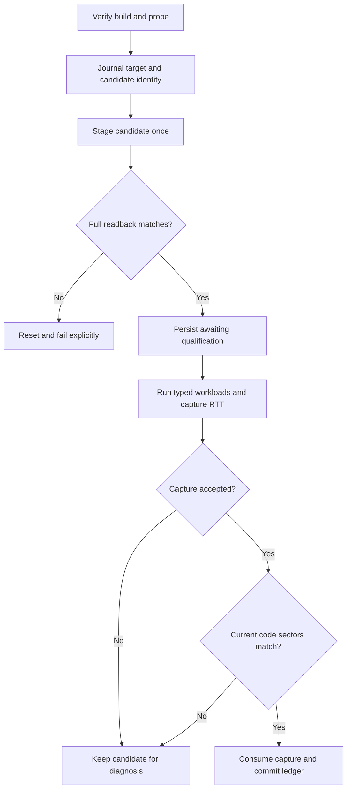

<!-- PAGE_ID: imec2-11-verified-deployment -->

[Wiki Home](README.md) / Verified Mesh Deployment and Hardware Qualification

<details>
<summary>📚 Historical generation context (f6594e4)</summary>

The following files were used as context for generating this wiki page:

- [AGENTS.md:49-115](https://github.com/Jubliano-sama/IMEC2/blob/f6594e41b57f5fd612aba182e0bd13cbbdd0c621/AGENTS.md#L49-L115)
- [AGENTS.md:188-193](https://github.com/Jubliano-sama/IMEC2/blob/f6594e41b57f5fd612aba182e0bd13cbbdd0c621/AGENTS.md#L188-L193)
- [stack_budget.h:12-56](https://github.com/Jubliano-sama/IMEC2/blob/f6594e41b57f5fd612aba182e0bd13cbbdd0c621/firmware/include/stack_budget.h#L12-L56)
- [verify_stack_evidence.py:24-51](https://github.com/Jubliano-sama/IMEC2/blob/f6594e41b57f5fd612aba182e0bd13cbbdd0c621/firmware/scripts/verify_stack_evidence.py#L24-L51)
- [capture_stack_evidence.py:61-129](https://github.com/Jubliano-sama/IMEC2/blob/f6594e41b57f5fd612aba182e0bd13cbbdd0c621/firmware/scripts/capture_stack_evidence.py#L61-L129)
- [flash_verified_mesh.py:419-660](https://github.com/Jubliano-sama/IMEC2/blob/f6594e41b57f5fd612aba182e0bd13cbbdd0c621/firmware/scripts/flash_verified_mesh.py#L419-L660)
- [check_mesh_deployment_policy.py:18-99](https://github.com/Jubliano-sama/IMEC2/blob/f6594e41b57f5fd612aba182e0bd13cbbdd0c621/firmware/scripts/check_mesh_deployment_policy.py#L18-L99)
- [mesh-deployment-policy.yml:1-17](https://github.com/Jubliano-sama/IMEC2/blob/f6594e41b57f5fd612aba182e0bd13cbbdd0c621/.github/workflows/mesh-deployment-policy.yml#L1-L17)

</details>

# Verified Mesh Deployment and Hardware Qualification

> **Related Pages**: [Build Presets and Configuration](10_build-presets-and-configuration.md), [Testing and Release Evidence](12_testing-simulation-and-release-evidence.md), [Hardware Bring-Up and Troubleshooting](13_hardware-bring-up-and-troubleshooting.md), [Data Custody and Recovery](08_data-custody-persistence-and-recovery.md)

The participant story depends on firmware that keeps a click correlated and recoverable through radio, mesh, and BLE pressure. IMEC2 therefore treats programming a production board as the final evidence handoff: the exact build, exact probe, measured runtime workloads, and flashed bytes must agree before the local deployment ledger records success.

---

<!-- BEGIN:AUTOGEN imec2-11-verified-deployment-eligibility-gate -->
## What Makes an Artifact Eligible

Only `mesh_clicker`, `mesh_anchor`, and `mesh_gateway` are deployable verified-flash targets. The stack verifier defines that closed set, and both capture and staging reject a build outside it ([verify_stack_evidence.py:34-51](https://github.com/Jubliano-sama/IMEC2/blob/e04a0a7cfccd21c8821f2975119fcafc85705e4c/firmware/scripts/verify_stack_evidence.py#L34-L51), [capture_stack_evidence.py:81-89](https://github.com/Jubliano-sama/IMEC2/blob/e04a0a7cfccd21c8821f2975119fcafc85705e4c/firmware/scripts/capture_stack_evidence.py#L81-L89), [flash_verified_mesh.py:474-500](https://github.com/Jubliano-sama/IMEC2/blob/e04a0a7cfccd21c8821f2975119fcafc85705e4c/firmware/scripts/flash_verified_mesh.py#L474-L500)). Bench traffic, ML collection, high-debug, and generic legacy artifacts remain separate even when their compatibility builds pass.

Eligibility combines four kinds of evidence:

| Gate | What must agree |
|---|---|
| Exact artifact identity | The generated preset, ELF, HEX, embedded build identity, and build directory must describe the same pristine artifact. |
| Generated capacity | Role-specific stacks, MPU/thread features, and minimum static RAM headroom must match the machine-readable policy. The current minimum headroom is 24,576 bytes for clicker, 10,240 for anchor, and 6,000 for gateway ([stack_budget.h:12-29](https://github.com/Jubliano-sama/IMEC2/blob/e04a0a7cfccd21c8821f2975119fcafc85705e4c/firmware/include/stack_budget.h#L12-L29)). |
| Compiler ownership | Linked functions need attributable IPA call paths and stack-usage records; unrooted or ambiguous work fails rather than being charged to an assumed largest stack ([stack_budget.h:60-70](https://github.com/Jubliano-sama/IMEC2/blob/e04a0a7cfccd21c8821f2975119fcafc85705e4c/firmware/include/stack_budget.h#L60-L70)). |
| Runtime workload | The clicker completes `click_activity`, the anchor completes `anchor_survey_report`, and the gateway completes report ingress, priority control, and BLE backpressure under their specified thread owners ([stack_budget.h:44-58](https://github.com/Jubliano-sama/IMEC2/blob/e04a0a7cfccd21c8821f2975119fcafc85705e4c/firmware/include/stack_budget.h#L44-L58)). |

The build verifier also requires a clean build graph, checks generated Kconfig against the policy, computes linker RAM use and headroom, hashes the ELF and HEX, extracts the target build identity, and consumes compiler evidence ([verify_stack_evidence.py:862-905](https://github.com/Jubliano-sama/IMEC2/blob/e04a0a7cfccd21c8821f2975119fcafc85705e4c/firmware/scripts/verify_stack_evidence.py#L862-L905)). A successful Zephyr link is therefore necessary but insufficient: a capacity, attribution, or runtime-evidence defect still blocks deployment.

Sources: [verify_stack_evidence.py:34-51](https://github.com/Jubliano-sama/IMEC2/blob/e04a0a7cfccd21c8821f2975119fcafc85705e4c/firmware/scripts/verify_stack_evidence.py#L34-L51), [stack_budget.h:12-70](https://github.com/Jubliano-sama/IMEC2/blob/e04a0a7cfccd21c8821f2975119fcafc85705e4c/firmware/include/stack_budget.h#L12-L70), [verify_stack_evidence.py:862-905](https://github.com/Jubliano-sama/IMEC2/blob/e04a0a7cfccd21c8821f2975119fcafc85705e4c/firmware/scripts/verify_stack_evidence.py#L862-L905)
<!-- END:AUTOGEN imec2-11-verified-deployment-eligibility-gate -->

---

<!-- BEGIN:AUTOGEN imec2-11-verified-deployment-qualification-capture -->
## Qualification Capture

The capture tool observes the exact staged artifact already running on the selected target; it never programs hardware ([capture_stack_evidence.py:1-7](https://github.com/Jubliano-sama/IMEC2/blob/e04a0a7cfccd21c8821f2975119fcafc85705e4c/firmware/scripts/capture_stack_evidence.py#L1-L7)). It first verifies the build, confirms the full probe ID, then runs `pyocd rtt -t nrf52833 -M pre-reset -u <probe-id> --up-channel-id 0` under `script` with a bounded foreground timeout and rejects an empty transcript ([capture_stack_evidence.py:31-94](https://github.com/Jubliano-sama/IMEC2/blob/e04a0a7cfccd21c8821f2975119fcafc85705e4c/firmware/scripts/capture_stack_evidence.py#L31-L94)).

A successful schema-3 capture binds:

- The generated preset, full probe ID, exact ELF and HEX SHA-256 hashes, and target-reported preset/build identity.
- The transcript path and hash, capture-tool hash, fixed RTT command, TTY wrapper, and UTC capture bounds.
- A derived capture ID over artifact hashes, transcript hash, preset, probe, and capture bounds ([capture_stack_evidence.py:98-123](https://github.com/Jubliano-sama/IMEC2/blob/e04a0a7cfccd21c8821f2975119fcafc85705e4c/firmware/scripts/capture_stack_evidence.py#L98-L123), [verify_stack_evidence.py:1225-1228](https://github.com/Jubliano-sama/IMEC2/blob/e04a0a7cfccd21c8821f2975119fcafc85705e4c/firmware/scripts/verify_stack_evidence.py#L1225-L1228)).

Typed `DBG_STACK_RUN_BEGIN`, sample boundaries, per-thread rows, and `DBG_STACK_RUN_END` must retain one boot epoch, run identity, workload kind, execution owner, packet identity, and queue/custody state. ISR output is checked as configured size, while the measured thread rows provide runtime watermarks; marker-only or uncorrelated text is rejected ([verify_stack_evidence.py:1090-1185](https://github.com/Jubliano-sama/IMEC2/blob/e04a0a7cfccd21c8821f2975119fcafc85705e4c/firmware/scripts/verify_stack_evidence.py#L1090-L1185)). Each required workload must end successfully with at least one correlated sample ([verify_stack_evidence.py:1188-1207](https://github.com/Jubliano-sama/IMEC2/blob/e04a0a7cfccd21c8821f2975119fcafc85705e4c/firmware/scripts/verify_stack_evidence.py#L1188-L1207)).

The manifest loader recalculates all of that provenance, rejects a modified capture tool or command, limits the capture to 15 minutes and an age of 24 hours, and verifies the transcript hash before parsing runtime evidence ([verify_stack_evidence.py:1240-1285](https://github.com/Jubliano-sama/IMEC2/blob/e04a0a7cfccd21c8821f2975119fcafc85705e4c/firmware/scripts/verify_stack_evidence.py#L1240-L1285)). `pre-reset` is the prescribed connection mode, but it does not itself guarantee that an already-running target was reset; use the transaction's explicit reset when a fresh boot identity is required ([Development and Deployment Guide.md:188-202](https://github.com/Jubliano-sama/IMEC2/blob/e04a0a7cfccd21c8821f2975119fcafc85705e4c/Documentation/Development%20and%20Deployment%20Guide.md#L188-L202)).

Sources: [capture_stack_evidence.py:1-128](https://github.com/Jubliano-sama/IMEC2/blob/e04a0a7cfccd21c8821f2975119fcafc85705e4c/firmware/scripts/capture_stack_evidence.py#L1-L128), [verify_stack_evidence.py:1090-1207](https://github.com/Jubliano-sama/IMEC2/blob/e04a0a7cfccd21c8821f2975119fcafc85705e4c/firmware/scripts/verify_stack_evidence.py#L1090-L1207), [verify_stack_evidence.py:1225-1285](https://github.com/Jubliano-sama/IMEC2/blob/e04a0a7cfccd21c8821f2975119fcafc85705e4c/firmware/scripts/verify_stack_evidence.py#L1225-L1285)
<!-- END:AUTOGEN imec2-11-verified-deployment-qualification-capture -->

---

<!-- BEGIN:AUTOGEN imec2-11-verified-deployment-verified-flash -->
## Verified Flash Workflow

Production deployment is one stage/capture/promote transaction. Staging is the only target-programming step; capture observes that exact running candidate; promotion validates current code sectors and records the accepted evidence without flashing again ([Development and Deployment Guide.md:125-161](https://github.com/Jubliano-sama/IMEC2/blob/e04a0a7cfccd21c8821f2975119fcafc85705e4c/Documentation/Development%20and%20Deployment%20Guide.md#L125-L161)).

```sh
.venv/bin/python firmware/scripts/flash_verified_mesh.py \
  --build-dir build/mesh-anchor \
  --probe-id E46070D247233537 \
  --stage-only
```

The wrapper fixes repository-local west and pyOCD at 4 MHz. It reads the complete target image, computes the expected candidate overlay and code-sector hashes, journals the exact build/probe/artifact identity, stages with `--no-reset`, verifies a complete 512 KiB readback, persists `awaiting_qualification`, and then resets into the candidate ([flash_verified_mesh.py:529-608](https://github.com/Jubliano-sama/IMEC2/blob/e04a0a7cfccd21c8821f2975119fcafc85705e4c/firmware/scripts/flash_verified_mesh.py#L529-L608)). A second staging request on the same probe is blocked while that candidate awaits qualification ([flash_verified_mesh.py:739-764](https://github.com/Jubliano-sama/IMEC2/blob/e04a0a7cfccd21c8821f2975119fcafc85705e4c/firmware/scripts/flash_verified_mesh.py#L739-L764)).

Run the capture and role-specific workload against that staged artifact:

```sh
.venv/bin/python firmware/scripts/capture_stack_evidence.py \
  --build-dir build/mesh-anchor \
  --probe-id E46070D247233537 \
  --output-dir logs/stack-evidence
```

Promote one accepted exact-artifact capture:

```sh
.venv/bin/python firmware/scripts/flash_verified_mesh.py \
  --build-dir build/mesh-anchor \
  --hardware-manifest logs/stack-evidence/mesh-anchor-<capture-id>.json \
  --probe-id E46070D247233537
```

The complete bounded flow is:



Promotion requires the same build directory, preset, ELF and HEX hashes, probe, verified stage readback, and trusted capture ([flash_verified_mesh.py:626-642](https://github.com/Jubliano-sama/IMEC2/blob/e04a0a7cfccd21c8821f2975119fcafc85705e4c/firmware/scripts/flash_verified_mesh.py#L626-L642)). It rereads the target and compares only candidate code sectors, so ordinary NVS evolution during qualification is allowed while code drift fails closed. The capture is consumed only after the deployment record is durable; an earlier promotion failure restores the transaction to `awaiting_qualification` for diagnosis ([flash_verified_mesh.py:662-721](https://github.com/Jubliano-sama/IMEC2/blob/e04a0a7cfccd21c8821f2975119fcafc85705e4c/firmware/scripts/flash_verified_mesh.py#L662-L721)). The parser enforces mutually exclusive `--stage-only` and promotion modes, and promotion performs no west flash ([flash_verified_mesh.py:725-788](https://github.com/Jubliano-sama/IMEC2/blob/e04a0a7cfccd21c8821f2975119fcafc85705e4c/firmware/scripts/flash_verified_mesh.py#L725-L788)).

Sources: [Development and Deployment Guide.md:125-170](https://github.com/Jubliano-sama/IMEC2/blob/e04a0a7cfccd21c8821f2975119fcafc85705e4c/Documentation/Development%20and%20Deployment%20Guide.md#L125-L170), [flash_verified_mesh.py:529-608](https://github.com/Jubliano-sama/IMEC2/blob/e04a0a7cfccd21c8821f2975119fcafc85705e4c/firmware/scripts/flash_verified_mesh.py#L529-L608), [flash_verified_mesh.py:626-788](https://github.com/Jubliano-sama/IMEC2/blob/e04a0a7cfccd21c8821f2975119fcafc85705e4c/firmware/scripts/flash_verified_mesh.py#L626-L788)
<!-- END:AUTOGEN imec2-11-verified-deployment-verified-flash -->

---

<!-- BEGIN:AUTOGEN imec2-11-verified-deployment-trust-boundary -->
## Trust Boundary and Bench Exceptions

The verified workflow establishes strong local provenance, not cryptographic probe or remote attestation. A host owner can replace the checkout, tools, artifacts, transcript, or ledger and can invoke a programmer outside repository policy. The enforceable claim is that repository-owned scripts, workflows, and supported documentation fail when the local evidence chain is missing or inconsistent ([check_mesh_deployment_policy.py:1-8](https://github.com/Jubliano-sama/IMEC2/blob/e04a0a7cfccd21c8821f2975119fcafc85705e4c/firmware/scripts/check_mesh_deployment_policy.py#L1-L8), [Development and Deployment Guide.md:163-170](https://github.com/Jubliano-sama/IMEC2/blob/e04a0a7cfccd21c8821f2975119fcafc85705e4c/Documentation/Development%20and%20Deployment%20Guide.md#L163-L170)).

The policy scanner walks repository guidance, documentation, scripts, and workflows for direct `west flash` or pyOCD programming. It allows only explicit nonproduction names—bench transmitters, ML slots, legacy roles, staged high-debug images, the BLE connectivity test, and named power/bench cases—and rejects every other direct command ([check_mesh_deployment_policy.py:18-38](https://github.com/Jubliano-sama/IMEC2/blob/e04a0a7cfccd21c8821f2975119fcafc85705e4c/firmware/scripts/check_mesh_deployment_policy.py#L18-L38), [check_mesh_deployment_policy.py:80-102](https://github.com/Jubliano-sama/IMEC2/blob/e04a0a7cfccd21c8821f2975119fcafc85705e4c/firmware/scripts/check_mesh_deployment_policy.py#L80-L102)). Pull requests and pushes to `master` run that policy through `verify_changes.py --checks-only` ([mesh-deployment-policy.yml:1-18](https://github.com/Jubliano-sama/IMEC2/blob/e04a0a7cfccd21c8821f2975119fcafc85705e4c/.github/workflows/mesh-deployment-policy.yml#L1-L18)).

For an allowed bench, legacy, or ML image, west receives the probe as `-- --dev-id <probe-id>` and retains the proven 4 MHz rate. Direct pyOCD uses `-u <probe-id>` instead ([Development and Deployment Guide.md:172-186](https://github.com/Jubliano-sama/IMEC2/blob/e04a0a7cfccd21c8821f2975119fcafc85705e4c/Documentation/Development%20and%20Deployment%20Guide.md#L172-L186)). That exception can program `mesh_transmitter_forcedhop` for a relay bench, but it never extends to `mesh_clicker`, `mesh_anchor`, or `mesh_gateway`.

Sources: [check_mesh_deployment_policy.py:1-102](https://github.com/Jubliano-sama/IMEC2/blob/e04a0a7cfccd21c8821f2975119fcafc85705e4c/firmware/scripts/check_mesh_deployment_policy.py#L1-L102), [mesh-deployment-policy.yml:1-18](https://github.com/Jubliano-sama/IMEC2/blob/e04a0a7cfccd21c8821f2975119fcafc85705e4c/.github/workflows/mesh-deployment-policy.yml#L1-L18), [Development and Deployment Guide.md:163-186](https://github.com/Jubliano-sama/IMEC2/blob/e04a0a7cfccd21c8821f2975119fcafc85705e4c/Documentation/Development%20and%20Deployment%20Guide.md#L163-L186)
<!-- END:AUTOGEN imec2-11-verified-deployment-trust-boundary -->

---

**Previous:** [Build Presets, Configuration, and Repository Boundaries](10_build-presets-and-configuration.md)

**Next:** [Testing, Simulation, and Release Evidence](12_testing-simulation-and-release-evidence.md)

**Related:** [Data Custody, Persistence, and Recovery](08_data-custody-persistence-and-recovery.md) · [Hardware Bring-Up and Troubleshooting](13_hardware-bring-up-and-troubleshooting.md) · [Product Roles and Firmware Lines](01_product-roles-and-firmware-lines.md)
