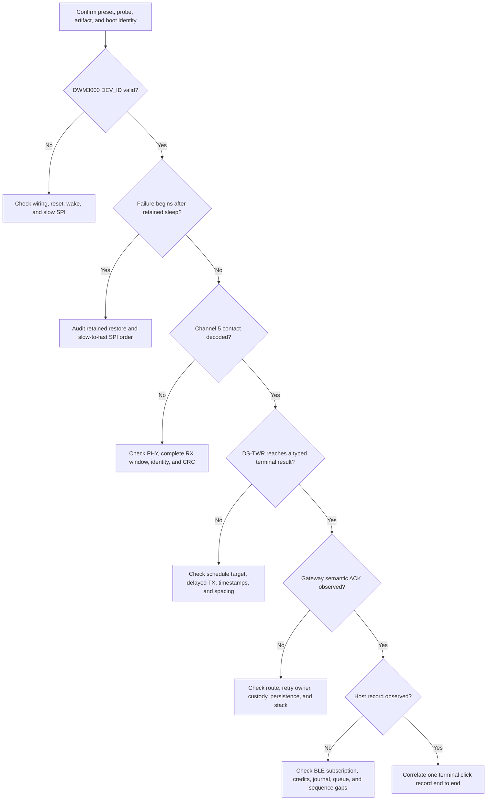

<!-- PAGE_ID: imec2-13-bring-up-and-troubleshooting -->

[← Start Here: From the User Story to the System](README.md) / Hardware Bring-Up and Troubleshooting

📚 Historical generation context (f6594e4)

The following files were used as context for generating this wiki page:

- [AGENTS.md:49-74](https://github.com/Jubliano-sama/IMEC2/blob/f6594e41b57f5fd612aba182e0bd13cbbdd0c621/AGENTS.md#L49-L74)
- [AGENTS.md:129-155](https://github.com/Jubliano-sama/IMEC2/blob/f6594e41b57f5fd612aba182e0bd13cbbdd0c621/AGENTS.md#L129-L155)
- [AGENTS.md:175-208](https://github.com/Jubliano-sama/IMEC2/blob/f6594e41b57f5fd612aba182e0bd13cbbdd0c621/AGENTS.md#L175-L208)
- [HARDWARE_BRINGUP_DEBUG.md:23-49](https://github.com/Jubliano-sama/IMEC2/blob/f6594e41b57f5fd612aba182e0bd13cbbdd0c621/Documentation/HARDWARE_BRINGUP_DEBUG.md#L23-L49)
- [HARDWARE_BRINGUP_DEBUG.md:227-376](https://github.com/Jubliano-sama/IMEC2/blob/f6594e41b57f5fd612aba182e0bd13cbbdd0c621/Documentation/HARDWARE_BRINGUP_DEBUG.md#L227-L376)
- [HARDWARE_BRINGUP_DEBUG.md:378-408](https://github.com/Jubliano-sama/IMEC2/blob/f6594e41b57f5fd612aba182e0bd13cbbdd0c621/Documentation/HARDWARE_BRINGUP_DEBUG.md#L378-L408)
- [README.md:35-93](https://github.com/Jubliano-sama/IMEC2/blob/f6594e41b57f5fd612aba182e0bd13cbbdd0c621/firmware/README.md#L35-L93)
- [README.md:122-169](https://github.com/Jubliano-sama/IMEC2/blob/f6594e41b57f5fd612aba182e0bd13cbbdd0c621/firmware/README.md#L122-L169)
- [dwm3000_port.c:51-70](https://github.com/Jubliano-sama/IMEC2/blob/f6594e41b57f5fd612aba182e0bd13cbbdd0c621/firmware/app/src/dwm3000_port.c#L51-L70)
- [dwm3000_driver_io.inc:143-203](https://github.com/Jubliano-sama/IMEC2/blob/f6594e41b57f5fd612aba182e0bd13cbbdd0c621/firmware/app/src/dwm3000_driver_io.inc#L143-L203)
- [dwm3000_driver_radio.inc:466-580](https://github.com/Jubliano-sama/IMEC2/blob/f6594e41b57f5fd612aba182e0bd13cbbdd0c621/firmware/app/src/dwm3000_driver_radio.inc#L466-L580)
- [capture_stack_evidence.py:31-129](https://github.com/Jubliano-sama/IMEC2/blob/f6594e41b57f5fd612aba182e0bd13cbbdd0c621/firmware/scripts/capture_stack_evidence.py#L31-L129)
- [mesh_ble_route_monitor.py:375-460](https://github.com/Jubliano-sama/IMEC2/blob/f6594e41b57f5fd612aba182e0bd13cbbdd0c621/tools/mesh_ble_route_monitor.py#L375-L460)
- [AGENT_KNOWN_ISSUES.md:93-124](https://github.com/Jubliano-sama/IMEC2/blob/f6594e41b57f5fd612aba182e0bd13cbbdd0c621/AGENT_KNOWN_ISSUES.md#L93-L124)
- [AGENT_KNOWN_ISSUES.md:180-200](https://github.com/Jubliano-sama/IMEC2/blob/f6594e41b57f5fd612aba182e0bd13cbbdd0c621/AGENT_KNOWN_ISSUES.md#L180-L200)
- [AGENT_KNOWN_ISSUES.md:270-273](https://github.com/Jubliano-sama/IMEC2/blob/f6594e41b57f5fd612aba182e0bd13cbbdd0c621/AGENT_KNOWN_ISSUES.md#L270-L273)

# Hardware Bring-Up and Troubleshooting

Bring-up succeeds when one participant click can be traced through the exact intended firmware, radio work, mesh custody, gateway acceptance, and host observation. Start with identity, move outward one boundary at a time, and never convert a tooling failure or a debug-only shortcut into evidence about the product path.

> **Related pages:** [Testing, Simulation, and Release Evidence](12_testing-simulation-and-release-evidence.md) · [UWB Wake, Ranging, and Low-Power Radio](03_uwb-wake-ranging-and-power.md) · [Gateway, Host Tools, and Observability](09_gateway-host-tools-and-observability.md) · [Verified Deployment and Qualification](11_verified-deployment-and-qualification.md)

---

<!-- BEGIN:AUTOGEN imec2-13-bring-up-and-troubleshooting-first-principles -->
## Start With Identity and Evidence

Record the exact preset, build directory, ELF/HEX identity, full probe ID, physical board, and expected role before any hardware command, then recheck them after a cable or board moves. `mesh_clicker`, `mesh_anchor`, and `mesh_gateway` are the only production candidates; traffic generators, ML images, generic roles, and staged high-debug images answer different questions ([AGENTS.md:49-60](https://github.com/Jubliano-sama/IMEC2/blob/af15a7eb59b1ca8f75464506ffa97f980ffbfef7/AGENTS.md#L49-L60)). A successful command is weak identity evidence: a stale probe-to-anchor map has already made the wrong artifact look like a role-specific firmware failure ([AGENT_KNOWN_ISSUES.md:230-231](https://github.com/Jubliano-sama/IMEC2/blob/af15a7eb59b1ca8f75464506ffa97f980ffbfef7/AGENT_KNOWN_ISSUES.md#L230-L231)).

Use the target’s boot record as the first runtime checkpoint. High-debug output carries git/build identity, role, stage, board, device ID, network ID, radio channels, SPI speed, polling mode, and enabled transports, while counters expose DEV_ID, status polling, RX/TX, wake, ranging, mesh, BLE, and command outcomes ([HARDWARE_BRINGUP_DEBUG.md:41-49](https://github.com/Jubliano-sama/IMEC2/blob/af15a7eb59b1ca8f75464506ffa97f980ffbfef7/Documentation/HARDWARE_BRINGUP_DEBUG.md#L41-L49)). LEDs can locate a phase, but only correlated records establish semantic completion.

| Boundary | Minimum evidence before moving outward |
| --- | --- |
| Artifact and board | Preset, ELF/HEX hash, full probe ID, physical label, and target-reported build/device identity all agree. |
| DWM3000 port | Reset and wake pins respond, a supported DEV_ID is read at slow SPI, runtime SPI is selected, and status polling is bounded. |
| UWB operation | One correlation identity connects wake, discovery, schedule, DS-TWR status, and terminal range outcome. |
| Mesh custody | The intended route is used, retry ownership stays singular, and gateway semantic acceptance plus ACK are observed. |
| Host custody | The exact gateway record survives BLE queue/credit pressure and is observed by the host without an unexplained sequence gap. |

Keep diagnostic and deployment evidence separate. A nonproduction high-debug image may be flashed directly to isolate a boundary, but a production candidate must use one transactional stage/capture/promote sequence; promotion does not program the target again ([AGENTS.md:62-74](https://github.com/Jubliano-sama/IMEC2/blob/af15a7eb59b1ca8f75464506ffa97f980ffbfef7/AGENTS.md#L62-L74), [Development and Deployment Guide.md:125-170](https://github.com/Jubliano-sama/IMEC2/blob/af15a7eb59b1ca8f75464506ffa97f980ffbfef7/Documentation/Development%20and%20Deployment%20Guide.md#L125-L170)). Continue to [Product Roles and Firmware Lines](01_product-roles-and-firmware-lines.md) if the image’s purpose is unclear, or to [Verified Deployment and Qualification](11_verified-deployment-and-qualification.md) for a production transaction.
<!-- END:AUTOGEN imec2-13-bring-up-and-troubleshooting-first-principles -->

---

<!-- BEGIN:AUTOGEN imec2-13-bring-up-and-troubleshooting-staged-bring-up -->
## Staged Bring-Up

Move outward only when the previous boundary has direct evidence. The high-debug suite is a diagnostic ladder with hardware validation still pending in its own document; it does not redefine production behavior, and the radio remains IRQ-free with bounded `SYS_STATUS` polling ([HARDWARE_BRINGUP_DEBUG.md:1-9](https://github.com/Jubliano-sama/IMEC2/blob/af15a7eb59b1ca8f75464506ffa97f980ffbfef7/Documentation/HARDWARE_BRINGUP_DEBUG.md#L1-L9)).

1. **Stage 0 — prove one MCU/radio boundary.** Initialize GPIO, reset, wake, and SPI; read DEV_ID; select runtime SPI; then exercise probe and retained sleep/wake without needing an anchor. Its local `RANGE_OK` is explicitly `BENCH_ONLY simulated=1`, so it proves the diagnostic path rather than ranging ([HARDWARE_BRINGUP_DEBUG.md:227-254](https://github.com/Jubliano-sama/IMEC2/blob/af15a7eb59b1ca8f75464506ffa97f980ffbfef7/Documentation/HARDWARE_BRINGUP_DEBUG.md#L227-L254)).

2. **Stage 1 — add one anchor.** Require a visible low-duty scan, accepted wake claim, discovery reply, schedule, addressed DS-TWR exchange, and named distance/status outcome. The one-anchor exception is bench-only; identity, nonce, event, target, timing, and schedule checks remain active ([HARDWARE_BRINGUP_DEBUG.md:256-298](https://github.com/Jubliano-sama/IMEC2/blob/af15a7eb59b1ca8f75464506ffa97f980ffbfef7/Documentation/HARDWARE_BRINGUP_DEBUG.md#L256-L298)).

3. **Stage 2 — add the production quorum.** Require at least three eligible replies, schedule at most four anchors, and serialize addressed DS-TWR inside the same continuous 400 ms responder window. One or two replies must release/retry/fail rather than range, and each diagnostic anchor needs a unique flashed slot; that slot is a Stage 2 bench mechanism, not production assignment ([HARDWARE_BRINGUP_DEBUG.md:300-331](https://github.com/Jubliano-sama/IMEC2/blob/af15a7eb59b1ca8f75464506ffa97f980ffbfef7/Documentation/HARDWARE_BRINGUP_DEBUG.md#L300-L331)).

4. **Stage 3 — add gateway and host custody.** Follow the same click through anchor queueing, mesh transmission, gateway ACK, BLE packet output, commands, and survey discovery. Scheduled transmission is not delivery: the anchor retains responsibility until gateway ACK, and gateway acceptance still has to reach the host stream ([HARDWARE_BRINGUP_DEBUG.md:334-376](https://github.com/Jubliano-sama/IMEC2/blob/af15a7eb59b1ca8f75464506ffa97f980ffbfef7/Documentation/HARDWARE_BRINGUP_DEBUG.md#L334-L376)).

5. **Repeat the proof on exact production candidates.** Run the hardware checklist with the exact role artifacts: DEV_ID/reset/wake/polling/retained-sleep evidence, one-anchor full path, three-anchor click, wake-train and DS-TWR timing, anchor idle diagnostics, and power measurements ([README.md:145-170](https://github.com/Jubliano-sama/IMEC2/blob/af15a7eb59b1ca8f75464506ffa97f980ffbfef7/firmware/README.md#L145-L170)). High-debug stages isolate a failure; only exact production artifacts close the release gap.
<!-- END:AUTOGEN imec2-13-bring-up-and-troubleshooting-staged-bring-up -->

---

<!-- BEGIN:AUTOGEN imec2-13-bring-up-and-troubleshooting-symptom-routing -->
## Route Symptoms to the Right Layer

Preserve the earliest failing boundary. Resetting the whole bench can hide a retained-state failure, while skipping gateway ACK or host-stream checks can turn queued work into false success.

| Symptom | First checks | Why this layer comes first |
| --- | --- | --- |
| DEV_ID fails or the radio never starts | Check overlay wiring, CS/SCK/MOSI/MISO, reset/wake, and the slow-SPI read before any RF reasoning. Build guards require reset/init at no more than 7 MHz and runtime SPI at at least 32 MHz ([dwm3000_port.c:27-70](https://github.com/Jubliano-sama/IMEC2/blob/af15a7eb59b1ca8f75464506ffa97f980ffbfef7/firmware/app/src/dwm3000_port.c#L27-L70), [dwm3000_port.c:335-362](https://github.com/Jubliano-sama/IMEC2/blob/af15a7eb59b1ca8f75464506ffa97f980ffbfef7/firmware/app/src/dwm3000_port.c#L335-L362)). | Device identity is below PHY, protocol, and routing. |
| It works once after reset, then fails after sleep | Trace slow SPI, wake pin, `IDLE_RC`, common/TX-RX restore, fast SPI, and the post-wake identity check. A failed retained restore intentionally falls back to a full reset/configure path ([dwm3000_driver_radio.inc:456-570](https://github.com/Jubliano-sama/IMEC2/blob/af15a7eb59b1ca8f75464506ffa97f980ffbfef7/firmware/app/src/dwm3000_driver_radio.inc#L456-L570), [dwm3000_driver_radio.inc:573-605](https://github.com/Jubliano-sama/IMEC2/blob/af15a7eb59b1ca8f75464506ffa97f980ffbfef7/firmware/app/src/dwm3000_driver_radio.inc#L573-L605)). | Retained state and SPI order can mimic a later RF timeout, so the contract calls for auditing them first ([AGENTS.md:157-158](https://github.com/Jubliano-sama/IMEC2/blob/af15a7eb59b1ca8f75464506ffa97f980ffbfef7/AGENTS.md#L157-L158)). |
| Wake or discovery is missing | Check Channel 5, network/epoch/click identity, nonce, CRC, complete scan aperture, and accept/reject reason. Channel 9 begins only after contact timing exists ([HARDWARE_BRINGUP_DEBUG.md:23-39](https://github.com/Jubliano-sama/IMEC2/blob/af15a7eb59b1ca8f75464506ffa97f980ffbfef7/Documentation/HARDWARE_BRINGUP_DEBUG.md#L23-L39)). | A route cannot repair a frame that never passed the contact lane. |
| Discovery succeeds but ranging fails or reports impossible geometry | Follow the named schedule, poll, response, final, report, identity, timing, and radio outcome. Test at realistic antenna spacing before changing timing; a near-field setup produced negative-ToF failures that disappeared after separating the boards ([HARDWARE_BRINGUP_DEBUG.md:288-298](https://github.com/Jubliano-sama/IMEC2/blob/af15a7eb59b1ca8f75464506ffa97f980ffbfef7/Documentation/HARDWARE_BRINGUP_DEBUG.md#L288-L298), [AGENT_KNOWN_ISSUES.md:474-476](https://github.com/Jubliano-sama/IMEC2/blob/af15a7eb59b1ca8f75464506ffa97f980ffbfef7/AGENT_KNOWN_ISSUES.md#L474-L476)). | Each DS-TWR milestone has different timing and ownership. |
| The anchor has a report but the gateway does not | Check route formation, the one retry owner, active-click preemption, gateway ACK TX/RX, duplicate handling, persistence, watchdog/reset records, and exact stack evidence. An 8,904-byte dormant branch frame previously overflowed an 8,192-byte workqueue and caused illegal-EPSR resets ([AGENT_KNOWN_ISSUES.md:109-111](https://github.com/Jubliano-sama/IMEC2/blob/af15a7eb59b1ca8f75464506ffa97f980ffbfef7/AGENT_KNOWN_ISSUES.md#L109-L111)). | RF transmission is incomplete until semantic gateway acceptance and ACK. |
| Gateway ACK exists but the host record is missing | Check notification subscription, BLE credits, journal restore/clear, queue admission, notify completion, and source/event sequence gaps. Host tools notify on `PACKET_TX_UUID` and write commands to `PACKET_RX_UUID` ([AGENT_KNOWN_ISSUES.md:515-515](https://github.com/Jubliano-sama/IMEC2/blob/af15a7eb59b1ca8f75464506ffa97f980ffbfef7/AGENT_KNOWN_ISSUES.md#L515-L515)). | BLE and the durable click journal are a separate custody boundary. |
| A survey reports zero or a suspicious distance | Decode the typed TLVs before interpreting raw offsets: sample index is TLV `0x0e`, range status is `0x21`, and a positive `RANGE_OK` below 50 mm is valid ([AGENT_KNOWN_ISSUES.md:513-517](https://github.com/Jubliano-sama/IMEC2/blob/af15a7eb59b1ca8f75464506ffa97f980ffbfef7/AGENT_KNOWN_ISSUES.md#L513-L517)). | A zero distance accompanying a typed error is not a successful zero-length range. |

When several symptoms appear together, start with the earliest boundary that has trustworthy evidence and keep all later failures as consequences until disproved.
<!-- END:AUTOGEN imec2-13-bring-up-and-troubleshooting-symptom-routing -->

---

<!-- BEGIN:AUTOGEN imec2-13-bring-up-and-troubleshooting-rtt-and-usb-gotchas -->
## RTT, USB, and Tooling Gotchas

Qualification uses the repository capture tool, not a hand-authored transcript. It finds the exact full probe ID, runs `pyocd rtt -t nrf52833 -M pre-reset -u <probe-id> --up-channel-id 0` under `script` and a bounded foreground timeout, rejects a missing/empty transcript, and records the probe, artifact hashes, target identity, transcript hash, command, wrapper, and UTC bounds before verifying the manifest ([capture_stack_evidence.py:31-129](https://github.com/Jubliano-sama/IMEC2/blob/af15a7eb59b1ca8f75464506ffa97f980ffbfef7/firmware/scripts/capture_stack_evidence.py#L31-L129)).

- **Give hardware commands direct USB access.** A sandbox may list a probe while the RTT child waits forever for that same ID. Rerun with host USB access before calling the probe disconnected or treating the hang as firmware evidence ([Development and Deployment Guide.md:188-202](https://github.com/Jubliano-sama/IMEC2/blob/af15a7eb59b1ca8f75464506ffa97f980ffbfef7/Documentation/Development%20and%20Deployment%20Guide.md#L188-L202)).

- **Keep RTT on a TTY and save before filtering.** Run interactively or through `script`; direct redirection can fail with `Inappropriate ioctl for device`, and piping the live pseudo-terminal through `rg` can close it before attachment and leave no transcript ([AGENT_KNOWN_ISSUES.md:275-275](https://github.com/Jubliano-sama/IMEC2/blob/af15a7eb59b1ca8f75464506ffa97f980ffbfef7/AGENT_KNOWN_ISSUES.md#L275-L275)).

- **Treat `pre-reset` as a connection mode.** It does not guarantee that an already-running target reset, so perform an explicit verified reset when fresh boot identity matters ([Development and Deployment Guide.md:188-195](https://github.com/Jubliano-sama/IMEC2/blob/af15a7eb59b1ca8f75464506ffa97f980ffbfef7/Documentation/Development%20and%20Deployment%20Guide.md#L188-L195)). Incremental builds can also retain a stale target-reported git identity even when the HEX changed correctly, so use a pristine reconfigure when that identity is evidence ([AGENT_KNOWN_ISSUES.md:474-476](https://github.com/Jubliano-sama/IMEC2/blob/af15a7eb59b1ca8f75464506ffa97f980ffbfef7/AGENT_KNOWN_ISSUES.md#L474-L476)).

- **Verify the session actually ended and produced the expected file.** A wrapped timeout can outlive its bound, a control block can attach without boot output, and concurrent captures can omit one transcript. Preserve the partial result, terminate lingering sessions, and distinguish capture failure from a dead target with an explicit reset plus attach ([AGENT_KNOWN_ISSUES.md:102-109](https://github.com/Jubliano-sama/IMEC2/blob/af15a7eb59b1ca8f75464506ffa97f980ffbfef7/AGENT_KNOWN_ISSUES.md#L102-L109)).

- **Use the installed pyOCD behavior.** The capture tool tries JSON enumeration and falls back to exact-token matching in the plain table, which supports this host’s older CLI ([capture_stack_evidence.py:31-58](https://github.com/Jubliano-sama/IMEC2/blob/af15a7eb59b1ca8f75464506ffa97f980ffbfef7/firmware/scripts/capture_stack_evidence.py#L31-L58)). For commander probes, validate the returned text or bytes as well as the exit status; `read32` lengths are bytes, and a command-level error can still return zero ([AGENT_KNOWN_ISSUES.md:115-116](https://github.com/Jubliano-sama/IMEC2/blob/af15a7eb59b1ca8f75464506ffa97f980ffbfef7/AGENT_KNOWN_ISSUES.md#L115-L116), [AGENT_KNOWN_ISSUES.md:516-516](https://github.com/Jubliano-sama/IMEC2/blob/af15a7eb59b1ca8f75464506ffa97f980ffbfef7/AGENT_KNOWN_ISSUES.md#L516-L516)).

- **Measure perturbation.** RTT attachment has disconnected a busy gateway during GATT discovery, and unrestricted full-debug logs can drop the application events needed for RF proof. Repeat suspect BLE behavior without RTT and use bounded role-specific logging before assigning the failure to firmware ([AGENT_KNOWN_ISSUES.md:118-118](https://github.com/Jubliano-sama/IMEC2/blob/af15a7eb59b1ca8f75464506ffa97f980ffbfef7/AGENT_KNOWN_ISSUES.md#L118-L118), [AGENT_KNOWN_ISSUES.md:445-445](https://github.com/Jubliano-sama/IMEC2/blob/af15a7eb59b1ca8f75464506ffa97f980ffbfef7/AGENT_KNOWN_ISSUES.md#L445-L445)).

A verified-wrapper rejection is a real result. Preserve it and diagnose the identity, RAM, stack, transcript, or workload gate; do not replace missing production evidence with a direct flash.
<!-- END:AUTOGEN imec2-13-bring-up-and-troubleshooting-rtt-and-usb-gotchas -->

---

## Continue the story

[← Previous: Testing, Simulation, and Release Evidence](12_testing-simulation-and-release-evidence.md) · [↑ Return to Start Here](README.md) · [Next: Follow the participant story again →](README.md)

**Related:** [UWB Wake, Ranging, and Low-Power Radio](03_uwb-wake-ranging-and-power.md) · [Connected Routing, Priority, and Reliable Delivery](05_connected-routing-and-reliable-delivery.md) · [Data Custody, Persistence, and Recovery](08_data-custody-persistence-and-recovery.md) · [Gateway, Host Tools, and Observability](09_gateway-host-tools-and-observability.md) · [Verified Deployment and Qualification](11_verified-deployment-and-qualification.md)
