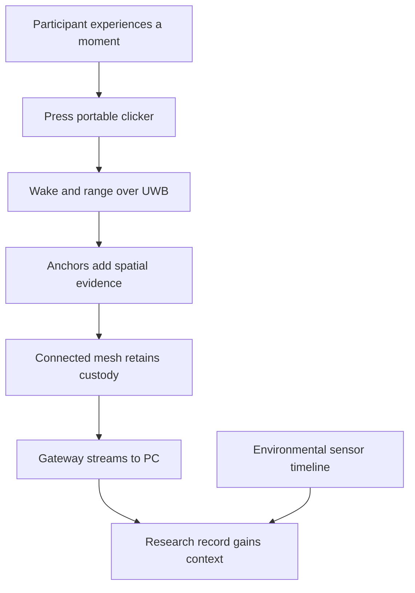

<!-- PAGE_ID: imec2-00-start-here -->

📚 Historical generation context (f6594e4)

The following files were used as context for generating this wiki page:

- [README.md:1-68](https://github.com/Jubliano-sama/IMEC2/blob/f6594e41b57f5fd612aba182e0bd13cbbdd0c621/README.md#L1-L68)
- [narrative(user story).md:2-46](https://github.com/Jubliano-sama/IMEC2/blob/f6594e41b57f5fd612aba182e0bd13cbbdd0c621/Documentation/narrative%28user%20story%29.md#L2-L46)
- [Customer Needs.md:3-27](https://github.com/Jubliano-sama/IMEC2/blob/f6594e41b57f5fd612aba182e0bd13cbbdd0c621/Documentation/Customer%20Needs.md#L3-L27)
- [Stakeholder Requirements.md:3-5](https://github.com/Jubliano-sama/IMEC2/blob/f6594e41b57f5fd612aba182e0bd13cbbdd0c621/Documentation/Stakeholder%20Requirements.md#L3-L5)
- [user requirements.md:3-14](https://github.com/Jubliano-sama/IMEC2/blob/f6594e41b57f5fd612aba182e0bd13cbbdd0c621/Documentation/user%20requirements.md#L3-L14)

# Start Here: From the User Story to the System

> **Breadcrumb:** [IMEC2 Wiki](README.md) / Start Here

> **Source snapshot:** Generated sections are synchronized to and pinned at `47590ded63e99caca4461cb61f77f861bcf94b54`. The collapsible context inventory above records the page's original generation inputs, while repository-relative navigation follows this checkout.

> **Related pages:** [Hardware Bring-Up and Troubleshooting](13_hardware-bring-up-and-troubleshooting.md) · [Product Roles and Firmware Lines](01_product-roles-and-firmware-lines.md) · [One Click, End to End](02_one-click-end-to-end.md) · [Anchor Self-Setup](07_anchor-self-setup-survey-and-geometry.md) · [Gateway, Host Tools, and Observability](09_gateway-host-tools-and-observability.md)

---

<!-- BEGIN:AUTOGEN imec2-00-start-here-research-story -->
## The Research Story

IMEC2 begins with a person at work. The Living Vitality Hub already measures environmental conditions such as CO₂, particulate matter, light, occupancy, and temperature; the missing signal is how people experience that environment at a particular moment ([README.md:5-12](https://github.com/Jubliano-sama/IMEC2/blob/47590ded63e99caca4461cb61f77f861bcf94b54/README.md#L5-L12)). A participant carries a small clicker and presses it when an experience worth studying occurs—for example, loss of concentration, thermal discomfort, or a social interaction—so subjective feedback can be correlated with the surrounding sensor data ([narrative(user story).md:3-5](https://github.com/Jubliano-sama/IMEC2/blob/47590ded63e99caca4461cb61f77f861bcf94b54/Documentation/narrative%28user%20story%29.md#L3-L5)).

That interaction must stay simple enough to disappear into an ordinary workday. The participant requirements call for feedback without visual focus, immediate pleasant confirmation, pocketable carrying, free movement between environments, full-workday operation, intuitive use, and anonymity ([user requirements.md:5-11](https://github.com/Jubliano-sama/IMEC2/blob/47590ded63e99caca4461cb61f77f861bcf94b54/Documentation/user%20requirements.md#L5-L11)). The broader stakeholder requirement is equally direct: the device must not disrupt normal office operation ([Stakeholder Requirements.md:3-5](https://github.com/Jubliano-sama/IMEC2/blob/47590ded63e99caca4461cb61f77f861bcf94b54/Documentation/Stakeholder%20Requirements.md#L3-L5)).

Earlier mechanical clickers captured in-the-moment reflection but could not timestamp individual clicks, while manual localization poles introduced spatial gaps when participants forgot to scan ([narrative(user story).md:13-17](https://github.com/Jubliano-sama/IMEC2/blob/47590ded63e99caca4461cb61f77f861bcf94b54/Documentation/narrative%28user%20story%29.md#L13-L17)). IMEC2’s goal is to attach precise time to every input and obtain spatial context passively, letting researchers align a human response with high-frequency environmental measurements without asking the participant to remember a location or perform another task ([README.md:9-20](https://github.com/Jubliano-sama/IMEC2/blob/47590ded63e99caca4461cb61f77f861bcf94b54/README.md#L9-L20), [narrative(user story).md:29-36](https://github.com/Jubliano-sama/IMEC2/blob/47590ded63e99caca4461cb61f77f861bcf94b54/Documentation/narrative%28user%20story%29.md#L29-L36)).

**The user story in one sentence:** a person presses once, receives immediate feedback, and continues working while the system turns that moment into anonymous, timestamped, spatially contextual research data.

Sources: [README.md:5-20](https://github.com/Jubliano-sama/IMEC2/blob/47590ded63e99caca4461cb61f77f861bcf94b54/README.md#L5-L20), [narrative(user story).md:3-17](https://github.com/Jubliano-sama/IMEC2/blob/47590ded63e99caca4461cb61f77f861bcf94b54/Documentation/narrative%28user%20story%29.md#L3-L17), [narrative(user story).md:29-36](https://github.com/Jubliano-sama/IMEC2/blob/47590ded63e99caca4461cb61f77f861bcf94b54/Documentation/narrative%28user%20story%29.md#L29-L36), [user requirements.md:5-11](https://github.com/Jubliano-sama/IMEC2/blob/47590ded63e99caca4461cb61f77f861bcf94b54/Documentation/user%20requirements.md#L5-L11), [Stakeholder Requirements.md:3-5](https://github.com/Jubliano-sama/IMEC2/blob/47590ded63e99caca4461cb61f77f861bcf94b54/Documentation/Stakeholder%20Requirements.md#L3-L5)
<!-- END:AUTOGEN imec2-00-start-here-research-story -->

---

<!-- BEGIN:AUTOGEN imec2-00-start-here-system-response -->
## How IMEC2 Answers the User Story

The portable [clicker](01_product-roles-and-firmware-lines.md) wakes on a button press, ranges against fixed anchors, and starts the report path. [Anchors](01_product-roles-and-firmware-lines.md) participate in ranging, relay mesh traffic, and prioritize their own local click reports; the [gateway](01_product-roles-and-firmware-lines.md) is the mesh root and connected Bluetooth edge to the PC ([README.md:24-30](https://github.com/Jubliano-sama/IMEC2/blob/47590ded63e99caca4461cb61f77f861bcf94b54/README.md#L24-L30)).

The radio design separates first contact from sustained delivery. UWB channel 5 covers wake, discovery, and click/ranging preemption, while channel 9 carries connected routing, reports, transit traffic, and acknowledgements; BLE is limited to clicker courtesy hints and the gateway-to-PC edge ([README.md:30](https://github.com/Jubliano-sama/IMEC2/blob/47590ded63e99caca4461cb61f77f861bcf94b54/README.md#L30)). This division lets the participant-facing action stay simple while the system handles ranging and transfer behind it.

The current scope also removes a major setup burden: the system measures anchor-to-anchor distances and solves the network’s three-dimensional geometry from those distances plus an approximate minimum radio radius ([README.md:16](https://github.com/Jubliano-sama/IMEC2/blob/47590ded63e99caca4461cb61f77f861bcf94b54/README.md#L16), [narrative(user story).md:29-36](https://github.com/Jubliano-sama/IMEC2/blob/47590ded63e99caca4461cb61f77f861bcf94b54/Documentation/narrative%28user%20story%29.md#L29-L36)). That makes [anchor self-setup](07_anchor-self-setup-survey-and-geometry.md) part of the same story: spatial context should not depend on participants remembering a manual location check.

Sources: [README.md:16-30](https://github.com/Jubliano-sama/IMEC2/blob/47590ded63e99caca4461cb61f77f861bcf94b54/README.md#L16-L30), [narrative(user story).md:29-36](https://github.com/Jubliano-sama/IMEC2/blob/47590ded63e99caca4461cb61f77f861bcf94b54/Documentation/narrative%28user%20story%29.md#L29-L36)
<!-- END:AUTOGEN imec2-00-start-here-system-response -->

---

<!-- BEGIN:AUTOGEN imec2-00-start-here-robustness-promise -->
## The Robustness Promise

The system’s non-negotiable is trustworthy operation over long deployments: it must not stall silently, drop data, or return a false result through a convenient fallback ([README.md:12-20](https://github.com/Jubliano-sama/IMEC2/blob/47590ded63e99caca4461cb61f77f861bcf94b54/README.md#L12-L20)). This matters because an apparently successful but incomplete record can distort a research conclusion just as surely as a missing record.

The requirements turn that principle into observable outcomes:

| Promise | What the study needs |
|---|---|
| Preserve the event | Every input must transfer automatically into a digital form suitable for export ([Customer Needs.md:9-12](https://github.com/Jubliano-sama/IMEC2/blob/47590ded63e99caca4461cb61f77f861bcf94b54/Documentation/Customer%20Needs.md#L9-L12)). |
| Preserve its meaning | Every input must remain associated with a precise timestamp and a specific spatial zone ([Customer Needs.md:10-11](https://github.com/Jubliano-sama/IMEC2/blob/47590ded63e99caca4461cb61f77f861bcf94b54/Documentation/Customer%20Needs.md#L10-L11)). |
| Preserve collection continuity | Researchers must be able to retrieve data without disrupting ongoing collection ([Customer Needs.md:14](https://github.com/Jubliano-sama/IMEC2/blob/47590ded63e99caca4461cb61f77f861bcf94b54/Documentation/Customer%20Needs.md#L14)). |
| Preserve privacy and usability | Records must be decoupled from personal identity, while the clicker remains unobtrusive and usable through a full workday ([Customer Needs.md:6-9](https://github.com/Jubliano-sama/IMEC2/blob/47590ded63e99caca4461cb61f77f861bcf94b54/Documentation/Customer%20Needs.md#L6-L9), [Customer Needs.md:13](https://github.com/Jubliano-sama/IMEC2/blob/47590ded63e99caca4461cb61f77f861bcf94b54/Documentation/Customer%20Needs.md#L13)). |
| Preserve service under load | The system must operate in a large, dense office and handle simultaneous clicks ([Customer Needs.md:26-27](https://github.com/Jubliano-sama/IMEC2/blob/47590ded63e99caca4461cb61f77f861bcf94b54/Documentation/Customer%20Needs.md#L26-L27)). |

The later pages explain the mechanisms behind these outcomes—bounded radio behavior, explicit ownership, durable state, acknowledgements, backpressure handling, watchdogs, adversarial simulation, and verified deployment—but this user-facing promise is the reason those mechanisms exist.

Sources: [README.md:12-20](https://github.com/Jubliano-sama/IMEC2/blob/47590ded63e99caca4461cb61f77f861bcf94b54/README.md#L12-L20), [Customer Needs.md:5-27](https://github.com/Jubliano-sama/IMEC2/blob/47590ded63e99caca4461cb61f77f861bcf94b54/Documentation/Customer%20Needs.md#L5-L27)
<!-- END:AUTOGEN imec2-00-start-here-robustness-promise -->

---

<!-- BEGIN:AUTOGEN imec2-00-start-here-reading-path -->
## Follow the Story

> **Recommended path:** follow the numbered pages in order. Each page answers the next question raised by the participant’s click, and every page links onward so the wiki reads as one continuous system story.

1. **[Product Roles and Firmware Lines](01_product-roles-and-firmware-lines.md)** — Meet the clicker, anchor, and gateway, then separate production behavior from bench, ML, debug, and legacy images.
2. **[One Click, End to End](02_one-click-end-to-end.md)** — Follow one physical press from wake and ranging through custody, mesh delivery, gateway streaming, and the research record.
3. **[UWB Wake, Ranging, and Low-Power Radio](03_uwb-wake-ranging-and-power.md)** — Open the radio layer behind that click: channel 5 contact, DS-TWR timing, DWM3000 behavior, and low-duty operation.
4. **[Protocol, Packets, and Data Contracts](04_protocol-packets-and-data-contracts.md)** — Read the shared envelope, message families, TLVs, identities, statuses, framing, and capacity rules.
5. **[Connected Routing, Priority, and Reliable Delivery](05_connected-routing-and-reliable-delivery.md)** — See how routes, channel 9 events, custody, acknowledgements, preemption, and retry carry the event onward.
6. **[Anchor Identity, Discovery, and Assignment](06_anchor-identity-discovery-and-assignment.md)** — Learn how identical anchor firmware becomes stable physical nodes with gateway-assigned logical order.
7. **[Anchor Self-Setup: Survey and Geometry](07_anchor-self-setup-survey-and-geometry.md)** — Follow discovery, pair ranging, durable results, and the host’s three-dimensional geometry solution.
8. **[Data Custody, Persistence, and Recovery](08_data-custody-persistence-and-recovery.md)** — Track who owns exact work across queues, radio failures, reset, NVS faults, and BLE backpressure.
9. **[Gateway, Host Tools, and Observability](09_gateway-host-tools-and-observability.md)** — Cross the PC edge through BLE records, commands, the GUI, route monitoring, RTT, and durable captures.
10. **[Build Presets, Configuration, and Repository Boundaries](10_build-presets-and-configuration.md)** — Build the native core and exact Zephyr role presets without confusing product and nonproduction lines.
11. **[Verified Mesh Deployment and Hardware Qualification](11_verified-deployment-and-qualification.md)** — Bind an exact artifact to qualification evidence and deploy it through the repository-owned gate.
12. **[Testing, Simulation, and Release Evidence](12_testing-simulation-and-release-evidence.md)** — Combine native tests, integration scenarios, hardware models, exact role builds, and bench proof.
13. **[Hardware Bring-Up and Troubleshooting](13_hardware-bring-up-and-troubleshooting.md)** — Diagnose identity, SPI, UWB, mesh, persistence, BLE, RTT, USB, watchdog, and stack symptoms from evidence.

### Choose a shorter route

| If you are… | Follow this path |
|---|---|
| A researcher or product stakeholder | [One Click, End to End](02_one-click-end-to-end.md) → [Anchor Self-Setup](07_anchor-self-setup-survey-and-geometry.md) → [Host Tools and Observability](09_gateway-host-tools-and-observability.md) → [Data Custody and Recovery](08_data-custody-persistence-and-recovery.md) |
| A firmware or protocol developer | [Product Roles](01_product-roles-and-firmware-lines.md) → [UWB and Power](03_uwb-wake-ranging-and-power.md) → [Protocol Contracts](04_protocol-packets-and-data-contracts.md) → [Connected Routing](05_connected-routing-and-reliable-delivery.md) → [Persistence](08_data-custody-persistence-and-recovery.md) → [Testing](12_testing-simulation-and-release-evidence.md) |
| A build or bench operator | [Build and Configuration](10_build-presets-and-configuration.md) → [Testing and Release Evidence](12_testing-simulation-and-release-evidence.md) → [Verified Deployment](11_verified-deployment-and-qualification.md) → [Bring-Up and Troubleshooting](13_hardware-bring-up-and-troubleshooting.md) |
| Investigating one failed click | [One Click, End to End](02_one-click-end-to-end.md) → [Connected Routing](05_connected-routing-and-reliable-delivery.md) → [Host Observability](09_gateway-host-tools-and-observability.md) → [Troubleshooting](13_hardware-bring-up-and-troubleshooting.md) |

The repository’s quick links direct contributors to the repository rules, code map, firmware guide, mesh contract, current architecture `0.6.6.2`, current protocol document `0.3.12.4`, executable development guide, and accepted architecture-reset plan ([README.md:32-49](https://github.com/Jubliano-sama/IMEC2/blob/47590ded63e99caca4461cb61f77f861bcf94b54/README.md#L32-L49)). The numbered wiki path wraps those references in the participant-to-research story; use each page’s pinned source links when you need the precise implementation or contract.

### Continue

**Previous:** You are at the wiki entrance.

**Next:** [Product Roles and Firmware Lines →](01_product-roles-and-firmware-lines.md)

**Related:** [One Click, End to End](02_one-click-end-to-end.md) · [Anchor Self-Setup](07_anchor-self-setup-survey-and-geometry.md) · [Gateway, Host Tools, and Observability](09_gateway-host-tools-and-observability.md) · [Hardware Bring-Up and Troubleshooting](13_hardware-bring-up-and-troubleshooting.md)

Sources: [README.md:32-49](https://github.com/Jubliano-sama/IMEC2/blob/47590ded63e99caca4461cb61f77f861bcf94b54/README.md#L32-L49)
<!-- END:AUTOGEN imec2-00-start-here-reading-path -->

---
