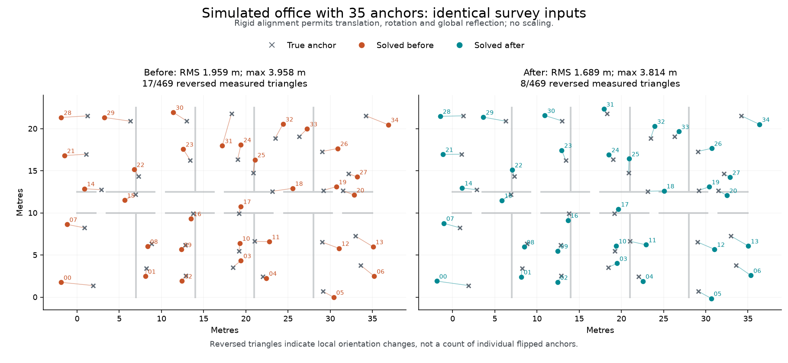

# NLOS candidate-search validation — 2026-09-07

The GUI's **NLOS one-sided intervals / Auto** search now explores a second path
through the same spring and graph-MDS starts. During that path alone, a weak
positive-bias penalty keeps saturated ranges contributing. The penalty is
removed before final refinement and selection. The original incumbent survives
unless the alternate improves the original objective by more than `1e-6`.

This changes only GUI solving. Measurements, locks, radio evidence, final loss,
explicit seed choices and sparse plans (`pairs <= 2 * anchors`) retain their
existing behavior. Numerical failure in the extra search retains the incumbent
and produces a warning. The original spring seed is computed once and reused.
Temporary trials use coarse convergence tolerances (`ftol=1e-5`,
`xtol=gtol=1e-6`); the original search and final polish keep `1e-8` throughout.

## Evidence

These are synthetic, deterministic scenes, not measured RF qualification. The
reference is commit `b84a84e91799da075b9183a3d35b4e45b4289912`; shared solver
modules are unchanged. [Manifest](manifest.json) records source hashes;
[summary](summary.json), [small comparisons](small-comparison.jsonl),
[large comparisons](large-comparison.jsonl), and [large input scenes](large-inputs.jsonl)
retain the measurements, returned coordinates and scores.

Small-case confirmation covers 24 development controls and 48 fresh holdout
scenes: sketch/reflection cases, relabelled controls, walls, short-link NLOS,
clean and sparse plans, and expanded LOS/NLOS reach. There were **no added
sketch target flips, no whole-map RMS regressions over 1 mm, and no increases
in the original objective** across the 72 actual production solves. The target
flip metric applies to 44 of those cases: **12/44 before and after**, with no
new flips. One dense
holdout's maximum anchor error improved from **3.342 m to 2.485 m**. Existing
flips remained; this does not claim that the small cases were solved completely.
Relabelled controls and repeated geometry families are not independent physical
trials.

The large benchmark generates 20-, 35- and 50-anchor offices, room partitions,
a corridor, irregular layouts, correlated positive biases, short-link NLOS and
ranging omissions. LOS reach is 17–20 m and NLOS reach 12–15 m. The solver sees
only ranges and radio reports, never truth, walls or generated bias labels.
Clean controls and the GUI's real degree-four planner are also available in the
benchmark. Only completed cases listed in the manifest count as validation;
the entire generated suite has not been qualified.

Every position score uses one whole-map translation and orthogonal alignment,
including global reflection, **without scale fitting**. Side reversals count
fully measured triangles with at least a 2 m support baseline and 1 m altitude
in the true layout. This fixes the eligible set before examining either solution.
An opposite estimated signed area counts as a reversal even if the estimated
triangle becomes shallow. Estimated triangles lacking the same support and
altitude are counted separately as collapsed; these counts can overlap. Neither
metric counts individually flipped anchors. Earlier exploratory scoring gated
eligibility on estimated geometry too; all saved results here use the corrected,
truth-only eligibility rule.

Across the **nine completed large scenes / 270 anchors**, reversed triangles
fell from **110 to 91 out of the same 5,026 eligible triangles**; collapsed
triangles remained at 65. The 95th-percentile position error fell from
**3.618 to 3.353 m**, and the largest error from **7.709 to 5.615 m**.
The number of anchors above 2 m changed from 71 to 70. Both clean controls and
the 50-anchor office retained exactly their original coordinates.

| 35-anchor scene | RMS before → after | Worst anchor before → after | Reversed / eligible triangles before → after |
|---|---:|---:|---:|
| Office development, 454500 | 1.959 → 1.689 m | 3.958 → 3.814 m | 17/469 → 8/469 |
| Office holdout, 554500 | 1.870 → 1.739 m | 4.338 → 3.400 m | 30/588 → 31/588 |
| Irregular holdout, 554500 | 2.550 → 2.284 m | 7.709 → 4.709 m | 21/467 → 10/467 |



The original score improves in these cases, but that is not itself accuracy
proof; the independent positions and orientation metrics establish the observed
gains. Individual anchors can still worsen: in the irregular holdout the count
above 2 m rises from 13 to 15 even though RMS, maximum error and side reversals
improve. The office holdout gains one reversed triangle despite lower RMS and
maximum error. Exact reflection ambiguities in distance-only NLOS data remain
possible; lower optimization cost cannot guarantee the correct physical side.

## Runtime and checks

Extra search is bounded by the existing per-solve iteration and reflection
limits, but can substantially increase runtime. On the three 35-anchor noisy
cases above, observed times were approximately **100 → 101 s, 75 → 89 s and
57 → 100 s**. The 50-anchor case took **209 → 258 s** without an accuracy change.
Shared-host workloads varied, so these are observed costs rather than isolated
speed benchmarks. Small-case median time was approximately 1.43 s before and
1.42 s after; the large-case median changed from 28.70 to 37.92 s. GUI event
handling remains in the existing background-solver workflow.

- All **355 GUI tests** passed, including the sparse/explicit-seed guard.
  Mypy passed over **41 source files**. The final full test run used an isolated
  Xvfb display with Openbox: the live desktop had stopped mapping test windows
  and delivering synthetic events, causing nine unrelated UI failures. No
  production UI changes or skipped tests were needed; the isolated run passed
  in 28.15 s. [Verification record](verification.txt).
- The new accuracy regression fails on the frozen baseline at 3.342 m and passes
  on the current solver below 2.6 m.
- Tests cover the temporary gradient, restoration of the original loss, hard
  locks, numerical-failure fallback, deterministic generation, rigid alignment,
  omitted measurements and orientation scoring. Existing sketch-flip regressions
  also pass.

More reflection moves, circle starts, larger loss plateaus, permanent positive
bias penalties and a learned global LOS/NLOS mixture were explored but not
promoted: they either found no improvement or introduced fresh errors. In
particular, a permanent weak bias penalty worsened a fresh holdout's RMS by
1.27 m; restoring the original score rejects that candidate exactly.

## Reproduce

Use the existing project Python environment, with BLAS limited to one thread
when running several benchmark workers. From the repository root:

```sh
git show b84a84e91799da075b9183a3d35b4e45b4289912:tools/gateway_gui/anchor_geometry_nlos.py > /tmp/imec-nlos-before.py
OPENBLAS_NUM_THREADS=1 /home/tommie/Projects/IMEC2/.venv/bin/python -m tools.gateway_gui.experiments.large_nlos_benchmark --baseline-source /tmp/imec-nlos-before.py --sizes 35 --kinds office --out /tmp/imec-nlos-comparison.jsonl
OPENBLAS_NUM_THREADS=1 /home/tommie/Projects/IMEC2/.venv/bin/python -m tools.gateway_gui.experiments.large_nlos_benchmark --baseline-source /tmp/imec-nlos-before.py --split holdout --seeds 551000 --sizes 20,35 --kinds office,irregular,clean --out /tmp/imec-nlos-holdout.jsonl
OPENBLAS_NUM_THREADS=1 /home/tommie/Projects/IMEC2/.venv/bin/python -m unittest tools.gateway_gui.tests.test_nlos_search
```
